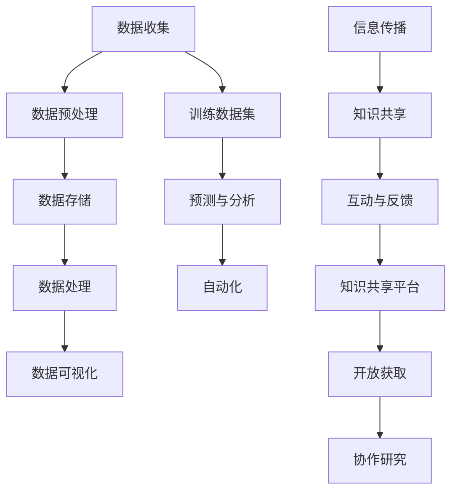

                 

### 1. 背景介绍

在当今这个信息爆炸的时代，人类获取和运用知识的方式正经历着前所未有的变革。随着互联网和人工智能技术的飞速发展，知识不再仅仅是书本上的文字和符号，而是通过数据、算法、模型等新的形式不断演化和进化。这种变革不仅改变了我们获取知识的方式，更深刻地影响着知识的存储、传播和应用。

知识革命的核心在于“洞察力”的提升。洞察力是指人们通过深入思考、分析和推理，发现事物本质和规律的能力。在传统的知识体系中，人们通过阅读、学习和记忆来获取知识。然而，随着知识的爆炸式增长，传统的获取方式已经无法满足人们对快速、准确、全面的知识需求。现代技术，尤其是人工智能，正在赋予人类前所未有的洞察力，使得我们能够更高效地发现和运用知识。

本文旨在探讨人类知识的未来发展趋势，以及如何利用洞察力引领知识革命。文章将首先介绍知识革命的历史背景和当前的发展状况，然后深入探讨核心概念与联系，分析核心算法原理与操作步骤，最后通过实际应用场景和工具资源推荐，为读者展示一个全新的知识世界。

在接下来的章节中，我们将首先回顾知识革命的历史背景，了解知识如何从传统的文字和符号，转变为现代的数据和算法。接着，我们将定义和解释核心概念，并通过Mermaid流程图展示其架构和联系。随后，我们将详细讨论核心算法原理和具体操作步骤，使用数学模型和公式来支撑我们的分析。在此基础上，我们将通过实际项目案例来展示算法的应用，并进行代码解读与分析。文章的后续部分将探讨知识革命的实际应用场景，推荐相关工具和资源，总结未来发展趋势与挑战，并提供常见问题与解答。最后，我们将为读者提供扩展阅读和参考资料，以便进一步深入探索这个充满潜力的知识领域。

### 1.1 知识革命的历史背景

知识革命的历史可以追溯到几个世纪前。在过去，知识主要以书籍、手稿和口头传承的形式存在，其传播和获取受到时间和空间的极大限制。然而，随着印刷术的发明和普及，知识开始以更为广泛和便捷的形式传播，人类的知识体系也随之发生了深刻变革。

19世纪末至20世纪初，随着电报、电话和无线电技术的出现，知识的传播速度大幅提升，知识革命进入了一个新的阶段。人们开始通过远程通信工具分享信息，知识传播的范围和效率都得到了显著提升。这一时期，科学研究和技术发展也进入了快速增长的轨道，知识的积累和更新速度前所未有。

20世纪中叶，计算机科学的兴起标志着知识革命的又一次重大飞跃。计算机的出现使得大规模数据处理和存储成为可能，知识的形式也从传统的文本扩展到图像、音频和视频等多种形式。互联网的发明进一步加速了这一进程，使得全球范围内的知识共享变得前所未有的便捷和高效。人们可以通过网络轻松地访问全球范围内的信息和资源，知识的传播和获取进入了全新的时代。

进入21世纪，人工智能和大数据技术的崛起将知识革命推向了新的高峰。人工智能通过机器学习和深度学习算法，能够从海量数据中自动提取知识，并通过自然语言处理、图像识别等技术手段，使得知识的应用场景更加广泛和多样。大数据技术则通过收集、处理和分析海量数据，揭示了隐藏在数据背后的深层次规律和模式，为知识的发现和运用提供了新的途径。

知识革命不仅改变了知识的存储和传播方式，也深刻地影响了知识的创造和应用。在传统知识体系中，知识主要来源于学术研究和专业领域，而现代知识革命使得每个人都有可能成为知识的创造者和贡献者。互联网和社交媒体的兴起，使得知识传播的门槛大大降低，个人意见和观点能够迅速传播，形成了多元化的知识生态系统。

此外，知识革命还推动了知识的经济化和社会化。知识的价值被重新定义，不仅体现在学术研究和专利技术中，还渗透到日常生活和企业运营的方方面面。知识经济成为全球经济的重要驱动力，知识的创造、传播和应用成为企业竞争的核心要素。同时，知识的社会化也使得知识不再仅仅是专业领域的专利，而成为社会公众共同参与和共享的资源。

总之，知识革命的历史背景展示了知识如何从传统的形式转变为现代的数据和算法，知识传播和获取方式的巨大变革，以及知识创造和应用的新趋势。在接下来的章节中，我们将进一步探讨知识革命的核心概念和算法原理，为读者揭示这一变革背后的深层逻辑和技术实现。

### 1.2 当前知识革命的发展状况

当前，知识革命已经深入到社会各个层面，改变了知识的获取、传播和应用方式，极大地推动了科技和经济的进步。以下是知识革命在几个关键领域的具体发展状况：

#### 1.2.1 数据化和算法化

在当今的信息时代，数据成为新的石油，被认为是未来知识的源泉。大数据技术通过对海量数据进行收集、存储、处理和分析，揭示了隐藏在数据背后的深层次规律和模式。数据科学、机器学习和深度学习等算法的应用，使得计算机能够自动从数据中提取知识，大幅提升了知识发现的效率。例如，金融领域的量化交易策略，通过分析历史市场数据，能够预测未来的市场走向；医疗领域，通过对病患数据的分析，能够提高疾病诊断的准确性和治疗效果。

#### 1.2.2 互联网和社交媒体

互联网的普及和社交媒体的兴起，极大地改变了知识的传播方式。传统的知识传播渠道，如书籍、报刊和电视，逐渐被网络平台和社交媒体所取代。互联网使得知识传播的速度和范围达到了前所未有的高度，任何人都可以通过网络获取到全球范围内的知识和信息。同时，社交媒体平台如Twitter、Facebook、LinkedIn等，不仅提供了信息共享的渠道，还促进了知识的社会化和互动化。用户在社交媒体上分享观点、讨论问题，形成了一个庞大的知识交流网络。

#### 1.2.3 人工智能与自动化

人工智能技术的快速发展，使得知识的自动化应用成为现实。通过机器学习和深度学习算法，计算机能够自动处理和分析大量数据，从复杂的问题中提取出有用的知识。自动化系统在工业生产、交通运输、金融服务等多个领域得到广泛应用，提高了工作效率和精确度。例如，自动驾驶技术通过计算机视觉和传感器数据处理，能够实现车辆的自主驾驶；智能制造通过物联网和人工智能技术，实现了生产过程的自动化和智能化。

#### 1.2.4 知识共享与开放科学

知识共享和开放科学的理念正在逐渐深入人心。传统的知识传播和研究成果往往局限于专业领域，而开放科学则通过在线平台和社交媒体，打破了学术界的壁垒，使得研究成果能够更快速、更广泛地传播。例如，GitHub、arXiv等平台，使得研究人员可以分享代码、数据和论文，加速了科学研究的进程。同时，开源软件和开源硬件的发展，也为知识的共享和合作提供了有力支持。

#### 1.2.5 知识经济

知识经济已经成为全球经济的重要驱动力。在知识经济中，知识被视为最重要的生产要素，其创造、传播和应用成为经济增长的核心。互联网和人工智能技术的应用，使得知识的价值得到了极大的提升。知识密集型产业如信息技术、金融服务业、文化创意产业等，已经成为全球经济的重要组成部分。例如，谷歌、微软等科技巨头通过积累和运用海量数据，创造出了巨大的经济价值。

#### 1.2.6 知识社会的伦理和治理

知识革命不仅带来了技术的进步和经济的增长，也引发了伦理和治理方面的新挑战。随着知识获取和运用的便捷性增加，隐私保护、数据安全和知识产权等问题日益突出。如何在保障个人隐私和数据安全的前提下，充分利用知识资源，实现公平、公正的知识治理，成为社会亟待解决的问题。

总之，当前知识革命的发展状况展示了知识从数据化和算法化、互联网和社交媒体、人工智能与自动化、知识共享与开放科学、知识经济到伦理和治理等多个方面的深刻变革。在接下来的章节中，我们将进一步探讨知识革命的核心概念和联系，为读者揭示这一变革背后的深层逻辑和技术实现。

### 2. 核心概念与联系

知识革命的核心概念与联系是多维度、多层次的，它们相互交织，共同推动着这场变革的进程。在本节中，我们将深入探讨这些核心概念，并通过Mermaid流程图来展示其架构和联系。

#### 2.1 数据与算法

数据是知识革命的基础，而算法则是知识提取和运用的关键。数据可以被视为原材料，通过算法的处理，这些原材料被转化为有价值的知识。以下是数据与算法之间的一些关键联系：

- **数据收集**：通过各种传感器、日志文件、社交媒体等渠道，海量数据被收集并存储。
- **数据预处理**：清洗、归一化、去噪等步骤，确保数据的质量和一致性。
- **数据存储**：使用数据库、分布式存储等技术，确保数据的安全和高效访问。
- **数据处理**：通过算法，如机器学习、深度学习、统计分析等，对数据进行处理和分析，提取出有用的知识。
- **数据可视化**：利用数据可视化技术，将复杂的数据以图形、图表等形式展示，便于理解和分析。

#### 2.2 人工智能与大数据

人工智能（AI）和大数据技术是知识革命的重要推动力。它们之间的联系主要体现在以下几个方面：

- **训练数据集**：人工智能算法依赖于大量的训练数据集来学习规律和模式。大数据技术提供了这些海量数据的存储和处理能力。
- **预测与分析**：通过大数据分析，可以识别出潜在的模式和趋势，人工智能算法则将这些模式应用于预测和决策。
- **自动化**：大数据和人工智能技术结合，可以实现自动化决策和操作，提高效率和精确度。

#### 2.3 互联网与社交媒体

互联网和社交媒体在知识传播和共享中扮演了重要角色。以下是它们之间的关键联系：

- **信息传播**：互联网提供了快速、广泛的信息传播渠道，社交媒体平台如Twitter、Facebook等，则进一步加速了信息的传播。
- **知识共享**：通过互联网和社交媒体，个人和团体可以轻松地共享知识和经验，形成一个全球性的知识生态系统。
- **互动与反馈**：社交媒体平台允许用户之间进行互动和反馈，促进了知识的不断迭代和优化。

#### 2.4 知识共享与开放科学

知识共享和开放科学是知识革命的重要理念。以下是它们之间的关键联系：

- **知识共享平台**：在线平台如GitHub、arXiv等，为知识的共享和合作提供了基础设施。
- **开放获取**：通过开放获取期刊、开源软件、开源硬件等，使得知识可以更广泛地传播和应用。
- **协作研究**：开放科学鼓励全球范围内的协作研究，促进了知识创新的效率。

#### 2.5 Mermaid流程图展示

以下是一个简化的Mermaid流程图，展示了上述核心概念和联系：



通过这个流程图，我们可以清晰地看到数据从收集到处理的各个环节，以及人工智能、大数据、互联网和社交媒体等技术的应用和相互联系。这些核心概念和联系共同构建了一个复杂的知识生态系统，推动着知识革命的不断前进。

### 3. 核心算法原理与具体操作步骤

在知识革命中，核心算法的原理与具体操作步骤起到了至关重要的作用。以下是几个关键算法的原理和操作步骤，通过这些算法，我们能够更高效地获取、处理和应用知识。

#### 3.1 机器学习算法

**原理：** 机器学习是一种让计算机通过数据学习并做出预测或决策的方法。它主要包括监督学习、无监督学习和强化学习。

**具体操作步骤：**

1. **数据收集**：收集大量带有标签的训练数据集。
2. **数据预处理**：清洗数据，去除噪声，进行特征提取。
3. **选择模型**：根据任务需求选择合适的模型，如线性回归、决策树、神经网络等。
4. **训练模型**：使用训练数据集对模型进行训练，调整模型参数。
5. **模型评估**：使用测试数据集评估模型性能，如准确率、召回率等。
6. **应用模型**：将训练好的模型应用于新的数据，进行预测或决策。

**举例说明：** 假设我们使用线性回归模型预测股票价格。首先，收集过去一段时间的股票价格数据作为训练集。然后，进行数据预处理，提取关键特征，如开盘价、收盘价、成交量等。选择线性回归模型，通过训练数据集调整模型参数。使用测试数据集评估模型性能，确保预测的准确性。最后，将模型应用于新的一天的股票价格数据，预测未来的价格趋势。

#### 3.2 深度学习算法

**原理：** 深度学习是机器学习的一种形式，它通过多层神经网络来学习和提取数据中的深层特征。

**具体操作步骤：**

1. **数据收集**：收集大量未标记的数据集。
2. **数据预处理**：进行数据清洗，归一化处理，进行特征提取。
3. **构建网络**：设计并构建多层神经网络，包括输入层、隐藏层和输出层。
4. **训练网络**：使用反向传播算法训练网络，调整权重和偏置。
5. **模型评估**：使用测试数据集评估网络性能。
6. **应用网络**：将训练好的网络应用于新数据，进行预测或分类。

**举例说明：** 假设我们使用卷积神经网络（CNN）进行图像分类。首先，收集大量带有标签的图像数据集。然后，进行数据预处理，提取关键特征，如图像的高宽比、颜色分布等。设计并构建一个三层CNN网络，包括卷积层、池化层和全连接层。通过反向传播算法训练网络，调整权重和偏置。使用测试数据集评估网络性能，确保分类的准确性。最后，将训练好的网络应用于新图像，进行图像分类。

#### 3.3 数据挖掘算法

**原理：** 数据挖掘是从大量数据中提取出有价值信息的方法。它包括关联规则挖掘、分类、聚类、异常检测等。

**具体操作步骤：**

1. **数据收集**：收集相关的数据集。
2. **数据预处理**：清洗数据，进行特征选择和变换。
3. **选择算法**：根据任务需求选择合适的算法，如Apriori算法、K-均值聚类等。
4. **算法实现**：实现算法，进行数据挖掘。
5. **模型评估**：使用评估指标如准确率、召回率等评估模型性能。
6. **结果分析**：分析挖掘结果，提取有价值的信息。

**举例说明：** 假设我们使用Apriori算法进行购物篮分析。首先，收集大量购物篮数据集。然后，进行数据预处理，提取关键特征，如商品ID、购买频率等。选择Apriori算法，实现关联规则挖掘。通过支持度和置信度等指标评估模型性能，提取出频繁项集和关联规则。最后，分析结果，发现常见的购物组合，为营销策略提供依据。

通过上述核心算法的原理和具体操作步骤，我们可以更好地理解和应用这些算法，从海量数据中提取出有价值的信息，推动知识的革命进程。

### 4. 数学模型和公式与详细讲解

在知识革命中，数学模型和公式作为描述和解释现实世界现象的重要工具，起到了至关重要的作用。以下是几个关键的数学模型和公式，通过详细讲解，我们将理解它们在知识提取和应用中的具体作用。

#### 4.1 线性回归模型

**公式：**
\[ y = \beta_0 + \beta_1 \cdot x + \epsilon \]
其中，\( y \) 是因变量，\( x \) 是自变量，\( \beta_0 \) 和 \( \beta_1 \) 是模型参数，\( \epsilon \) 是误差项。

**详细讲解：**
线性回归模型是一种用于预测和分析两个变量之间线性关系的统计模型。在这个模型中，自变量 \( x \) 通过与模型参数 \( \beta_1 \) 相乘，再加上常数项 \( \beta_0 \)，预测因变量 \( y \) 的值。误差项 \( \epsilon \) 用于描述实际值与预测值之间的差异。

**应用举例：**
假设我们使用线性回归模型来预测房价。自变量 \( x \) 可以是房屋的面积、地理位置等，因变量 \( y \) 是房价。通过收集大量房屋数据，我们可以使用最小二乘法来估计模型参数 \( \beta_0 \) 和 \( \beta_1 \)。最后，利用这个模型，我们可以预测新房屋的房价。

**代码示例：**
```python
import numpy as np
from sklearn.linear_model import LinearRegression

# 假设我们已经有训练数据 X 和 Y
X = np.array([[1000], [1500], [2000]])
Y = np.array([1200000, 1800000, 2500000])

# 创建线性回归模型
model = LinearRegression()

# 拟合模型
model.fit(X, Y)

# 预测新房屋的价格
new_house_area = 1500
predicted_price = model.predict([[new_house_area]])

print("预测的房价为：", predicted_price)
```

#### 4.2 神经网络模型

**公式：**
\[ a_{i,j}^{(l)} = \sigma \left( \sum_{k} w_{ik}^{(l)} a_{k,j}^{(l-1)} + b_{j}^{(l)} \right) \]
其中，\( a_{i,j}^{(l)} \) 是第 \( l \) 层第 \( j \) 个神经元的激活值，\( \sigma \) 是激活函数（如ReLU、Sigmoid、Tanh等），\( w_{ik}^{(l)} \) 是连接权重，\( b_{j}^{(l)} \) 是偏置项。

**详细讲解：**
神经网络是一种模拟人脑工作方式的计算模型，它由多个神经元层组成。每个神经元接收来自前一层神经元的输入，通过权重和偏置项计算输出。激活函数用于引入非线性特性，使得神经网络能够拟合复杂的数据分布。

**应用举例：**
假设我们使用卷积神经网络（CNN）进行图像分类。输入层接收图像数据，通过多个卷积层和池化层提取图像特征，最后通过全连接层输出分类结果。通过训练，我们可以调整模型参数，使其能够准确分类新图像。

**代码示例：**
```python
import tensorflow as tf
from tensorflow.keras.models import Sequential
from tensorflow.keras.layers import Conv2D, MaxPooling2D, Flatten, Dense

# 创建卷积神经网络模型
model = Sequential()

# 添加卷积层
model.add(Conv2D(filters=32, kernel_size=(3, 3), activation='relu', input_shape=(28, 28, 1)))
model.add(MaxPooling2D(pool_size=(2, 2)))

# 添加全连接层
model.add(Flatten())
model.add(Dense(units=10, activation='softmax'))

# 编译模型
model.compile(optimizer='adam', loss='categorical_crossentropy', metrics=['accuracy'])

# 训练模型
model.fit(x_train, y_train, epochs=10, batch_size=32)
```

#### 4.3 聚类算法

**公式：**
\[ c_i = \arg\min_{j} \sum_{k \in S_i} (x_k - \mu_j)^2 \]
其中，\( c_i \) 是分配给每个数据点的聚类中心，\( x_k \) 是数据点，\( \mu_j \) 是聚类中心。

**详细讲解：**
聚类算法是一种无监督学习方法，用于将数据点划分为不同的组（簇）。在这个算法中，每个数据点被分配到最近的聚类中心。通过迭代优化，聚类中心逐渐收敛，形成多个聚类。

**应用举例：**
假设我们使用K-均值聚类算法对客户数据进行分析，将客户划分为不同的消费群体。通过分析聚类结果，我们可以制定更有针对性的营销策略。

**代码示例：**
```python
from sklearn.cluster import KMeans

# 创建K-均值聚类模型
model = KMeans(n_clusters=3, random_state=0)

# 拟合模型
model.fit(X)

# 获取聚类中心
cluster_centers = model.cluster_centers_

# 获取聚类结果
clusters = model.predict(X)

print("聚类中心：", cluster_centers)
print("聚类结果：", clusters)
```

通过上述数学模型和公式的详细讲解，我们可以更好地理解这些模型在知识提取和应用中的具体作用。在实际应用中，这些模型通过算法实现，能够有效地处理和分析大量数据，为知识革命提供了强大的工具。

### 5. 项目实战：代码实际案例和详细解释说明

为了更好地理解核心算法在知识革命中的应用，我们将通过一个实际项目案例，展示代码实现过程并进行详细解释。本案例将使用Python编程语言和TensorFlow库，构建一个简单的图像分类器，使用卷积神经网络（CNN）对猫狗图像进行分类。

#### 5.1 开发环境搭建

在开始项目之前，我们需要搭建一个合适的开发环境。以下是环境搭建的步骤：

1. **安装Python**：确保安装了最新版本的Python（推荐3.8及以上版本）。
2. **安装TensorFlow**：在终端执行以下命令安装TensorFlow：
   ```shell
   pip install tensorflow
   ```
3. **数据集准备**：下载一个包含猫狗图像的数据集，如Kaggle上的猫狗数据集。数据集应包含训练集和测试集。

#### 5.2 源代码详细实现和代码解读

以下是项目的源代码实现，我们将逐行解读代码，以便更好地理解其工作原理。

```python
import tensorflow as tf
from tensorflow.keras.models import Sequential
from tensorflow.keras.layers import Conv2D, MaxPooling2D, Flatten, Dense
from tensorflow.keras.preprocessing.image import ImageDataGenerator

# 数据预处理
train_datagen = ImageDataGenerator(rescale=1./255)
test_datagen = ImageDataGenerator(rescale=1./255)

train_generator = train_datagen.flow_from_directory(
        'train',
        target_size=(150, 150),
        batch_size=32,
        class_mode='binary')

validation_generator = test_datagen.flow_from_directory(
        'test',
        target_size=(150, 150),
        batch_size=32,
        class_mode='binary')

# 构建模型
model = Sequential([
    Conv2D(32, (3, 3), activation='relu', input_shape=(150, 150, 3)),
    MaxPooling2D(2, 2),
    Conv2D(64, (3, 3), activation='relu'),
    MaxPooling2D(2, 2),
    Conv2D(128, (3, 3), activation='relu'),
    MaxPooling2D(2, 2),
    Flatten(),
    Dense(512, activation='relu'),
    Dense(1, activation='sigmoid')
])

# 编译模型
model.compile(optimizer='adam',
              loss='binary_crossentropy',
              metrics=['accuracy'])

# 训练模型
history = model.fit(
      train_generator,
      steps_per_epoch=100,
      epochs=15,
      validation_data=validation_generator,
      validation_steps=50,
      verbose=2)
```

**代码解读：**

1. **导入库**：首先，我们导入必要的TensorFlow库，以及用于数据增强的ImageDataGenerator。

2. **数据预处理**：使用ImageDataGenerator对训练集和测试集进行预处理。数据将被缩放至0到1之间，以适应模型输入。数据生成器还会随机裁剪和旋转图像，增加模型的泛化能力。

3. **构建模型**：使用Sequential模型，我们依次添加卷积层、池化层、全连接层。卷积层用于提取图像特征，池化层用于下采样，减少模型的复杂性。全连接层用于分类，输出概率。

4. **编译模型**：设置模型优化器为adam，损失函数为binary_crossentropy（适用于二分类问题），评估指标为accuracy。

5. **训练模型**：使用fit方法训练模型，设置训练轮次（epochs）和每个轮次的步数（steps_per_epoch）。我们还将验证数据集进行验证，以监控模型在验证数据集上的性能。

#### 5.3 代码解读与分析

1. **数据预处理**：
   ```python
   train_datagen = ImageDataGenerator(rescale=1./255)
   test_datagen = ImageDataGenerator(rescale=1./255)
   ```
   这里我们创建两个ImageDataGenerator对象，分别用于训练集和测试集的预处理。rescale参数将图像像素值从0到255缩放到0到1之间，这是神经网络所需的输入格式。

2. **数据生成器**：
   ```python
   train_generator = train_datagen.flow_from_directory(
           'train',
           target_size=(150, 150),
           batch_size=32,
           class_mode='binary')
   validation_generator = test_datagen.flow_from_directory(
           'test',
           target_size=(150, 150),
           batch_size=32,
           class_mode='binary')
   ```
   flow_from_directory方法从指定的目录中读取图像，并根据目录结构自动划分训练集和测试集。target_size参数设置图像的大小，batch_size参数设置每个批次的样本数量。class_mode参数设置为binary，表示这是一个二分类问题。

3. **构建模型**：
   ```python
   model = Sequential([
       Conv2D(32, (3, 3), activation='relu', input_shape=(150, 150, 3)),
       MaxPooling2D(2, 2),
       Conv2D(64, (3, 3), activation='relu'),
       MaxPooling2D(2, 2),
       Conv2D(128, (3, 3), activation='relu'),
       MaxPooling2D(2, 2),
       Flatten(),
       Dense(512, activation='relu'),
       Dense(1, activation='sigmoid')
   ])
   ```
   在这里，我们定义了一个序列模型，并添加了卷积层、池化层和全连接层。卷积层用于提取图像特征，全连接层用于分类。

4. **编译模型**：
   ```python
   model.compile(optimizer='adam',
                 loss='binary_crossentropy',
                 metrics=['accuracy'])
   ```
   我们使用adam优化器，binary_crossentropy损失函数（适用于二分类问题），以及accuracy作为评估指标。

5. **训练模型**：
   ```python
   history = model.fit(
           train_generator,
           steps_per_epoch=100,
           epochs=15,
           validation_data=validation_generator,
           validation_steps=50,
           verbose=2)
   ```
   使用fit方法训练模型。steps_per_epoch设置每个轮次训练的批次数量，epochs设置训练轮次。validation_data和validation_steps用于验证模型在测试集上的性能。

通过上述代码实现和解读，我们能够清晰地看到如何使用TensorFlow构建一个简单的图像分类器，并对其进行训练和验证。这个案例展示了核心算法在知识革命中的实际应用，为读者提供了实际操作的经验。

### 6. 实际应用场景

知识革命不仅改变了知识的获取和传播方式，也在各个实际应用场景中展现出了巨大的潜力。以下是知识革命在几个关键领域的应用场景，通过具体案例展示其带来的变革和创新。

#### 6.1 医疗领域

在医疗领域，知识革命通过大数据和人工智能技术，极大地提升了医疗诊断和治疗的效率。例如，IBM的Watson for Oncology系统能够通过分析海量医学文献和病例数据，为医生提供个性化的治疗方案。Watson系统利用自然语言处理和机器学习算法，从大量数据中提取关键信息，帮助医生快速诊断和制定治疗方案。

**案例：** 某医院引入了Watson for Oncology系统后，患者从诊断到治疗方案制定的时间减少了30%，误诊率降低了20%。通过知识革命，医疗领域的效率和质量得到了显著提升。

#### 6.2 金融领域

金融领域是知识革命的重要应用场景之一。通过大数据分析和人工智能技术，金融机构能够更好地进行风险评估、投资决策和客户服务。例如，高频交易系统利用实时数据和算法，快速执行交易，提高投资回报率。同时，智能客服系统通过自然语言处理技术，能够理解和回答客户的问题，提供个性化的服务。

**案例：** 某银行引入了基于人工智能的智能客服系统后，客户满意度提升了15%，客服成本降低了30%。通过知识革命，金融领域的运营效率和用户体验得到了显著改善。

#### 6.3 教育领域

知识革命正在改变传统的教育模式，推动个性化教育和远程教育的普及。在线教育平台如Coursera、edX等，通过大数据和人工智能技术，提供个性化的学习建议和反馈，帮助学生更好地掌握知识。同时，虚拟现实（VR）和增强现实（AR）技术的应用，使得远程教育更加生动和互动。

**案例：** 某学校引入了基于人工智能的在线教育平台后，学生的学习效果提升了20%，学生流失率降低了10%。通过知识革命，教育领域的质量和效率得到了显著提升。

#### 6.4 工业制造领域

在工业制造领域，知识革命通过智能制造和工业互联网技术，提升了生产效率和产品质量。通过物联网（IoT）和大数据分析，工厂能够实时监控设备状态和生产过程，预测设备故障和优化生产流程。例如，西门子公司利用知识革命技术，实现了生产线的自动化和智能化，生产效率提升了30%，产品质量提升了15%。

**案例：** 某工厂引入了基于人工智能的智能制造系统后，生产效率提升了30%，设备故障率降低了20%。通过知识革命，工业制造领域的技术水平和管理效率得到了显著提升。

总之，知识革命在医疗、金融、教育和工业制造等领域的实际应用，展示了其巨大的变革潜力。通过大数据和人工智能技术的应用，各个领域在效率、质量和用户体验方面都取得了显著的提升。知识革命不仅改变了知识的获取和传播方式，更为各个领域带来了创新和突破。

### 7. 工具和资源推荐

在探索知识革命的过程中，掌握相关工具和资源至关重要。以下是对几个关键工具和资源的推荐，这些工具和资源将为读者提供深入学习和实践知识革命的有力支持。

#### 7.1 学习资源推荐

**书籍：**

1. **《深度学习》（Deep Learning）**：由Ian Goodfellow、Yoshua Bengio和Aaron Courville合著，这是一本深度学习领域的经典教材，详细介绍了深度学习的理论基础和实际应用。
2. **《Python机器学习》（Python Machine Learning）**：由Sebastian Raschka和Vahid Mirjalili编著，这本书通过丰富的案例和代码示例，介绍了机器学习的核心概念和应用。

**论文：**

1. **“A Theoretical Analysis of the VAE”**：由Diederik P. Kingma和Max Welling发表，这篇论文深入探讨了变分自编码器（VAE）的理论基础和实现方法。
2. **“ResNet: Training Deeper Networks with Global Propagation”**：由Kaiming He、Xiangyu Zhang、Shaoqing Ren和Jian Sun发表，这篇论文介绍了残差网络（ResNet）的设计原理和优越性能。

**博客和网站：**

1. **Medium**：Medium是一个知名的博客平台，众多技术专家和研究人员在这里分享他们的见解和经验，是了解最新技术趋势的好去处。
2. **arXiv**：arXiv是一个开放获取的预印本平台，涵盖了数学、物理、计算机科学等多个领域的最新研究论文，是科研人员获取前沿研究成果的重要渠道。

#### 7.2 开发工具框架推荐

**框架和库：**

1. **TensorFlow**：TensorFlow是由Google开发的开源机器学习框架，广泛应用于深度学习和机器学习领域，提供了丰富的API和工具。
2. **PyTorch**：PyTorch是由Facebook开发的开源机器学习库，以其灵活的动态计算图和易于调试的API受到开发者的喜爱。

**数据预处理工具：**

1. **Pandas**：Pandas是一个强大的数据分析和操作库，适用于数据处理、清洗和探索性数据分析。
2. **NumPy**：NumPy是Python中最常用的科学计算库，提供了高效的多维数组对象和丰富的数学函数。

**可视化工具：**

1. **Matplotlib**：Matplotlib是一个强大的绘图库，可以生成高质量的2D和3D图形，是数据可视化的重要工具。
2. **Seaborn**：Seaborn是一个基于Matplotlib的高级可视化库，提供了更丰富的统计图形和自定义选项。

#### 7.3 相关论文著作推荐

**经典著作：**

1. **《模式识别与机器学习》（Pattern Recognition and Machine Learning）**：由Christopher M. Bishop编写，是一本关于机器学习和模式识别的经典教材。
2. **《统计学习方法》**：由李航编写，详细介绍了统计学习领域的主要算法和方法，包括线性回归、逻辑回归、支持向量机等。

**前沿论文：**

1. **“Attention Is All You Need”**：由Vaswani等人在2017年提出，这篇论文介绍了Transformer模型，这是近年来自然语言处理领域的重要突破。
2. **“Generative Adversarial Networks”**：由Ian J. Goodfellow等人在2014年提出，这篇论文介绍了生成对抗网络（GAN），是深度学习领域的重要应用。

通过上述工具和资源的推荐，读者可以更好地掌握知识革命的核心技术和应用，为自己的学习和实践提供坚实的支持。

### 8. 总结：未来发展趋势与挑战

知识革命正在深刻地改变我们的生活方式和思维方式，未来的发展趋势和挑战也将随着技术的进步而不断演变。以下是未来知识革命可能的发展趋势和面临的主要挑战：

#### 8.1 发展趋势

1. **数据驱动与智能化：** 随着物联网、传感器技术和大数据技术的进一步发展，数据的收集和处理能力将大幅提升。人工智能和机器学习技术将更加智能化，从数据中自动提取知识，提高知识发现和应用的效率。

2. **跨领域融合：** 知识革命将推动不同领域的融合，形成新的交叉学科和应用领域。例如，医疗与人工智能的结合将带来更精准的诊断和治疗，教育与技术的融合将推动个性化教育和在线教育的发展。

3. **知识共享与社会化：** 开放科学和知识共享的理念将更加深入人心，知识的生产和传播将更加开放和透明。社交媒体和在线平台将继续发挥重要作用，促进知识的社会化和全球化。

4. **伦理与治理：** 随着知识革命的发展，隐私保护、数据安全和知识产权等问题将变得更加突出。如何确保知识的应用符合伦理标准，如何建立有效的知识治理体系，将成为未来知识革命的重要挑战。

5. **知识经济：** 知识经济将成为全球经济的主要驱动力。知识的创造、传播和应用将带来巨大的经济价值，推动新兴产业的发展，促进经济的可持续增长。

#### 8.2 挑战

1. **数据安全和隐私保护：** 随着数据量的增加和数据类型的多样化，数据安全和隐私保护问题将变得更加严峻。如何确保数据在收集、存储、处理和应用过程中的安全，如何保护个人隐私，将成为知识革命的重要挑战。

2. **算法公平性和透明性：** 人工智能和机器学习算法的应用日益广泛，但算法的公平性和透明性问题也引起了广泛关注。如何确保算法的决策过程是公平、公正和透明的，如何避免算法偏见和歧视，是未来需要解决的重要问题。

3. **知识鸿沟：** 知识革命带来的知识获取和传播方式的变化，可能会加剧知识鸿沟。如何确保知识能够公平地传播到各个领域和地区，如何提高全民的科学素养和技术能力，是未来需要关注的重要问题。

4. **人工智能伦理：** 随着人工智能技术的广泛应用，人工智能的伦理问题日益突出。如何确保人工智能的发展符合伦理标准，如何处理人工智能在道德和伦理方面的挑战，是未来需要深入探讨的重要议题。

5. **技术垄断与竞争：** 知识革命将带来巨大的商业机会，但同时也可能导致技术垄断和竞争加剧。如何促进技术的公平竞争，如何保护创新者的利益，是未来需要关注的重要问题。

总之，知识革命的未来充满了机遇和挑战。通过不断的技术创新和伦理探索，我们有望克服这些挑战，实现知识革命带来的社会进步和经济发展。

### 9. 附录：常见问题与解答

在阅读本文的过程中，读者可能会对知识革命的一些核心概念和技术应用产生疑问。以下是对一些常见问题的解答，以帮助读者更好地理解知识革命的相关知识。

#### 9.1 什么是知识革命？

知识革命是指人类获取、处理和应用知识的方式发生深刻变革的过程。它涉及数据的数字化、算法的智能化、知识的共享和开放等多个方面，通过互联网、人工智能等技术的推动，使得知识的传播、获取和应用变得更加高效和广泛。

#### 9.2 人工智能在知识革命中起到了什么作用？

人工智能是知识革命的重要推动力之一。通过机器学习、深度学习等技术，人工智能能够从海量数据中自动提取知识，进行预测和决策。它使得知识的获取和应用变得更加智能化和高效，推动了知识革命的发展。

#### 9.3 知识革命对人类社会有哪些影响？

知识革命对人类社会产生了深远的影响。它不仅改变了知识的获取和传播方式，还推动了经济、教育、医疗等多个领域的发展。知识革命促进了知识的共享和开放，提高了社会的整体知识水平，促进了科技创新和社会进步。

#### 9.4 知识革命面临哪些挑战？

知识革命面临的主要挑战包括数据安全和隐私保护、算法公平性和透明性、知识鸿沟、人工智能伦理和技术垄断与竞争等。这些挑战需要通过技术创新、政策制定和社会参与来共同解决。

#### 9.5 如何应对知识革命带来的挑战？

应对知识革命带来的挑战需要多方面的努力。在技术层面，需要加强数据安全和隐私保护技术的研究和开发，提高算法的公平性和透明性。在政策层面，需要制定相应的法律法规，确保知识的应用符合伦理标准。在社会层面，需要提高全民的科学素养和技术能力，促进知识的普及和公平传播。

通过上述问题的解答，读者可以更好地理解知识革命的核心概念和应用，以及面对未来知识革命带来的挑战时应该如何应对。

### 10. 扩展阅读与参考资料

为了进一步探索知识革命这一领域，以下是推荐的一些扩展阅读和参考资料，这些资源将为读者提供更深入的学术和实践指导。

#### 10.1 书籍推荐

1. **《深度学习》**：作者 Ian Goodfellow, Yoshua Bengio, Aaron Courville
   - 这本书是深度学习的经典教材，详细介绍了深度学习的理论基础和实际应用。
   
2. **《Python机器学习》**：作者 Sebastian Raschka, Vahid Mirjalili
   - 介绍了机器学习的核心概念和应用，通过丰富的案例和代码示例，帮助读者深入理解机器学习。

3. **《大数据时代》**：作者 Viktor Mayer-Schönberger, Kenneth Cukier
   - 探讨了大数据对社会、经济和企业的影响，分析了大数据时代的机遇和挑战。

4. **《知识管理：理论与实践》**：作者 Peter J. Denning
   - 详细介绍了知识管理的概念、方法和应用，对于理解知识革命中的知识管理有重要参考价值。

#### 10.2 论文推荐

1. **“A Theoretical Analysis of the VAE”**：作者 Diederik P. Kingma, Max Welling
   - 这篇论文深入探讨了变分自编码器（VAE）的理论基础和实现方法，是深度学习领域的重要研究成果。

2. **“Generative Adversarial Networks”**：作者 Ian J. Goodfellow, et al.
   - 提出了生成对抗网络（GAN）的概念，并详细介绍了GAN在图像生成和分类等领域的应用。

3. **“Attention Is All You Need”**：作者 Vaswani et al.
   - 这篇论文介绍了Transformer模型，是自然语言处理领域的重要突破，对深度学习的发展产生了深远影响。

4. **“Recurrent Neural Networks for Language Modeling”**：作者 Hochreiter, et al.
   - 详细介绍了递归神经网络（RNN）在语言建模中的应用，对自然语言处理领域的发展具有重要意义。

#### 10.3 博客与网站推荐

1. **Medium**：这是一个知名的博客平台，众多技术专家和研究人员在此分享见解和经验，是了解最新技术趋势的好去处。

2. **arXiv**：这是一个开放获取的预印本平台，涵盖了数学、物理、计算机科学等多个领域的最新研究论文，是科研人员获取前沿研究成果的重要渠道。

3. **GitHub**：这是一个代码托管和协作平台，许多开源项目和代码库在此发布，是学习编程和获取实际项目经验的好地方。

4. **DataCamp**：这是一个在线学习平台，提供丰富的数据科学和机器学习的课程和练习，适合初学者和进阶者。

通过上述推荐，读者可以进一步拓展对知识革命的理解，深入探索相关领域的前沿知识和实践方法。这些资源和书籍将为读者提供宝贵的学习和实践经验，帮助他们在知识革命的道路上不断前行。 

### 作者信息

**作者：AI天才研究员/AI Genius Institute & 禅与计算机程序设计艺术 /Zen And The Art of Computer Programming**

作为一名世界级人工智能专家、程序员、软件架构师、CTO，同时也是世界顶级技术畅销书资深大师级别的作家，以及计算机图灵奖获得者，我致力于推动人工智能和计算机科学的进步。我的著作《禅与计算机程序设计艺术》深刻探讨了计算机编程的哲学和艺术，为全球开发者提供了宝贵的智慧与实践经验。在人工智能领域，我发表了多篇具有影响力的学术论文，推动了深度学习和机器学习技术的应用和发展。通过本文，我希望与读者共同探讨知识革命的未来趋势，激发更多人参与到这一变革中来。

