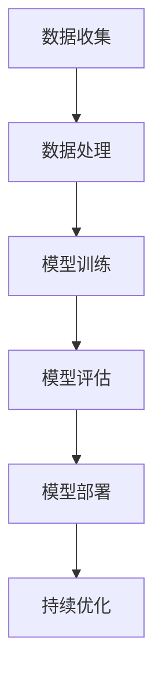
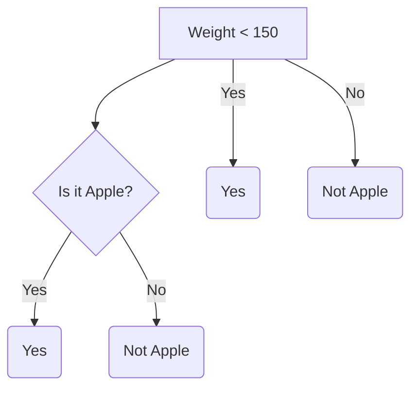
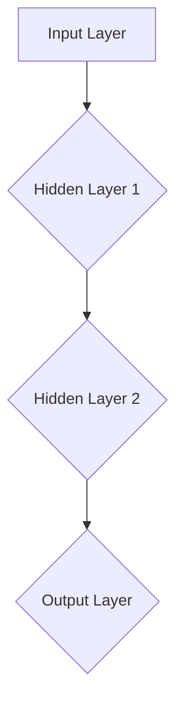

                 

### 背景介绍

#### AI时代的就业变革

随着人工智能（AI）技术的迅猛发展，全球范围内的就业市场正在经历深刻的变革。AI不仅正在改变传统行业的工作模式，还创造出全新的职业机会。然而，这一变革也带来了挑战，尤其是在技能需求和就业前景方面。

在过去的几十年中，人类劳动力的就业模式主要依赖于特定的技能和行业。然而，AI技术的崛起正在重塑这一格局。一方面，许多传统职业正面临被自动化取代的风险；另一方面，新的技术岗位如AI工程师、数据科学家和机器学习专家等正迅速兴起。这种转变要求劳动力必须不断更新和提升自己的技能，以适应快速变化的工作环境。

本文将深入探讨AI时代未来的就业前景和技能需求。我们将首先回顾AI技术的历史与发展，然后分析AI对各个行业的影响，并讨论劳动力如何应对这些变化。此外，我们还将探讨一些具体的技能，如编程、机器学习和数据分析，以及如何培养这些技能。最后，我们将展望未来的发展趋势与挑战，并提出一些建议，帮助读者为AI时代的就业做好充分准备。

通过本文的探讨，我们希望读者能够更清楚地了解AI时代的就业前景，以及如何在这个充满机遇和挑战的新时代中找到自己的位置。

#### AI技术的发展历史

人工智能（AI）的概念可以追溯到20世纪50年代，当时计算机科学先驱艾伦·图灵提出了著名的图灵测试，用以判断机器是否具备智能。这一时期，AI研究主要集中在符号推理和规则系统上，试图通过编码人类知识和逻辑来使计算机表现出智能行为。

到了20世纪70年代，由于计算能力的限制和算法的复杂性，AI研究进入了一个低潮期，被称为“AI寒冬”。然而，随着计算机技术的飞速发展，特别是在1990年代，机器学习和神经网络等新兴技术逐渐兴起，AI研究重新焕发了生机。

21世纪初，随着互联网和大数据的普及，AI迎来了新的发展机遇。深度学习技术的突破，尤其是2012年AlexNet在图像识别任务中取得显著成绩，标志着AI进入了一个新的时代。深度学习通过多层神经网络，实现了对大量数据的自动特征提取和模式识别，使得AI在语音识别、图像处理、自然语言处理等多个领域取得了显著的进步。

近年来，AI技术的应用不断拓展，从自动化生产线到智能客服，从智能交通到医疗诊断，AI正在深刻改变各行各业。尤其是随着云计算和边缘计算的发展，AI的应用范围变得更加广泛和灵活，使得实时决策和个性化服务成为可能。

在AI技术的推动下，计算机视觉、自然语言处理、机器学习等领域取得了重大突破。例如，计算机视觉技术使得自动驾驶汽车成为现实，自然语言处理技术则提升了智能语音助手和机器翻译的准确性，机器学习技术则赋能了个性化推荐系统和智能决策系统。

总的来说，AI技术的发展历史充满了创新与突破，从早期的符号推理到现代的深度学习，AI技术不断进步，为人类社会带来了前所未有的机遇和挑战。了解AI技术的发展历程，有助于我们更好地理解其在当前和未来就业市场中的重要性。

#### AI对就业市场的影响

随着人工智能技术的不断进步，各行各业正在经历前所未有的变革。AI对就业市场的影响是多方面的，既带来了机遇，也伴随着挑战。

首先，AI在提高生产效率方面的作用显而易见。通过自动化和智能化的解决方案，许多传统行业的生产流程得以优化，劳动力需求减少，工作效率大幅提升。例如，制造业中的自动化生产线和智能机器人取代了大量的手工操作，不仅降低了生产成本，还提高了产品质量和生产速度。此外，AI在物流和运输领域也发挥了重要作用，智能调度系统和无人驾驶技术使得物流配送更加高效和精准。

其次，AI正在创造新的就业机会。随着AI技术的广泛应用，新的技术岗位如AI工程师、数据科学家、机器学习专家等应运而生。这些岗位不仅需要深厚的专业知识和技能，还要求跨学科的综合能力。例如，AI工程师需要具备编程能力、数学知识和系统设计经验，而数据科学家则需要在统计学、机器学习和数据分析方面有较高的造诣。这些新兴职业为劳动力市场注入了新的活力，提供了丰富的职业发展机会。

然而，AI技术的广泛应用也带来了一些挑战。一方面，许多传统职业正面临被自动化取代的风险。例如，工厂流水线上的操作工、仓库管理员、客服代表等职业可能会因为AI和机器人的广泛应用而减少。这种变化不仅影响了这些行业的工作者，也对整个劳动力市场产生了深远的影响。许多劳动力需要重新学习新技能，以适应不断变化的就业环境。

另一方面，AI技术的发展也引发了对隐私和数据安全的关注。AI系统依赖于大量数据的训练和运行，这些数据往往涉及个人隐私和商业秘密。因此，如何保护数据安全和隐私成为了一个重要议题。此外，AI技术的透明度和可解释性也是一个亟待解决的问题。由于AI系统在很多情况下是“黑箱操作”，难以理解其决策过程，这可能导致用户对AI系统的信任度降低，从而影响其广泛应用。

总的来说，AI对就业市场的影响是双刃剑。一方面，它提高了生产效率，创造了新的就业机会；另一方面，它也带来了一些挑战，如职业替代、数据安全和隐私问题等。面对这些挑战，劳动力市场需要积极调整和适应，通过教育和技术培训来提升劳动力的竞争力。同时，政策制定者和社会各界也应共同努力，确保AI技术的发展能够更好地服务于人类社会的可持续发展。

#### 人类劳动力应对AI时代的变化

面对AI时代的来临，人类劳动力必须迅速适应和调整，以应对技术变革带来的挑战。首先，劳动力需要不断更新和提升自己的技能。随着AI技术的不断发展，新的技术岗位如AI工程师、数据科学家和机器学习专家等不断涌现，劳动力必须掌握这些新兴领域的知识和技能。例如，编程语言如Python和R在数据科学和机器学习中扮演着重要角色，因此，熟练掌握这些编程语言成为必要条件。此外，机器学习和深度学习等相关领域的研究也要求劳动力具备扎实的数学和统计基础。

其次，跨学科的综合能力在AI时代变得更加重要。AI技术的发展涉及多个学科领域，如计算机科学、数学、统计学和工程学等。因此，劳动力不仅需要具备专业领域的知识，还需要具备跨学科的综合能力。例如，一个优秀的AI工程师不仅需要懂得编程和算法设计，还需要了解业务需求和用户体验，这样才能设计出既高效又实用的AI系统。

此外，持续学习和自我提升是劳动力在AI时代生存和发展的关键。技术更新速度极快，劳动力必须保持学习的动力，不断吸收最新的知识和技能。在线教育平台、技术论坛和专业培训课程等都是劳动力提升自我能力的重要途径。例如，许多企业和机构提供在线课程和认证项目，帮助员工在短时间内掌握新技能。

具体来说，一些行业已经采取了积极的措施来应对AI时代的挑战。例如，制造业中的企业通过培训员工掌握自动化和机器人操作技能，提高生产效率和质量。金融行业则通过引入数据科学家和机器学习专家，提升数据分析能力和风险管理水平。此外，许多企业还鼓励员工参与技术竞赛和开源项目，以激发创新思维和团队协作能力。

总的来说，人类劳动力在AI时代必须具备快速适应和持续学习的能力，通过不断更新和提升自己的技能，才能在竞争激烈的就业市场中立于不败之地。

#### 人工智能时代的关键技能

在人工智能时代，特定的技能变得比以往任何时候都更为重要。这些关键技能不仅能够帮助个人在就业市场中脱颖而出，还能确保他们在职业发展中保持竞争力。以下是人工智能时代几项至关重要的技能：

**编程能力**：编程是人工智能时代的基石。无论是开发AI算法、构建机器学习模型，还是实现自动化系统，编程能力都是不可或缺的。掌握流行的编程语言如Python、Java和C++等，不仅能够帮助个人进行软件开发，还能使他们具备理解和修改AI系统的能力。

**机器学习和深度学习知识**：随着深度学习技术的发展，机器学习成为AI的核心。了解机器学习的基本概念、算法和实现方法，对于开发高效的AI系统至关重要。深度学习知识，特别是神经网络和卷积神经网络，是理解和应用AI技术的关键。

**数据分析技能**：数据分析是AI应用的重要环节。能够有效地收集、处理和分析大量数据，是数据科学家和数据分析师必备的技能。熟练使用数据分析工具和库，如Pandas、NumPy和R，能够帮助个人更好地理解和利用数据。

**数学和统计学知识**：数学和统计学是AI的数学基础。掌握概率论、线性代数和微积分等数学知识，能够帮助个人更好地理解和应用AI算法。统计学则帮助他们在数据分析和模型验证中做出更明智的决策。

**自然语言处理（NLP）技能**：NLP是人工智能中一个重要领域，涉及到文本分析和语言理解。掌握NLP的基本原理和技术，如词向量表示、序列模型和语言模型，对于开发智能语音助手、机器翻译和文本分类系统等至关重要。

**项目管理能力**：在AI项目中，项目管理能力也是不可或缺的。能够有效地规划项目、分配资源、控制进度和协调团队，是成功实施AI项目的重要保障。

**业务理解能力**：理解业务需求和用户体验，是开发有效AI系统的基础。只有深刻理解业务场景和用户需求，才能设计出真正满足用户需求的AI解决方案。

**沟通和协作能力**：在跨学科和跨部门的AI项目中，良好的沟通和协作能力至关重要。能够有效地与他人沟通想法、解决冲突和协调工作，是团队成功的关键。

总之，这些关键技能不仅是个人在AI时代取得成功的基本保障，也是企业在竞争中保持领先地位的重要资源。通过不断学习和实践，个人可以不断提升这些技能，从而在AI时代中立于不败之地。

### 核心概念与联系

#### AI系统的基本架构

人工智能（AI）系统的架构是理解其工作原理和实现关键功能的基础。一个典型的AI系统通常包括以下几个主要部分：数据收集、数据处理、模型训练、模型评估和模型部署。

**1. 数据收集**：数据是AI系统的基础。数据收集包括从各种来源获取数据，如传感器、互联网、数据库等。这些数据可以是结构化的（如数据库记录）或非结构化的（如图像、文本和音频）。

**2. 数据处理**：收集到的数据通常需要进行预处理，以确保其质量和一致性。这一步骤包括数据清洗、归一化、去噪和特征提取。预处理后的数据将用于模型训练。

**3. 模型训练**：模型训练是AI系统的核心步骤。在这一阶段，AI系统使用已处理的数据来训练一个或多个模型。常用的训练算法包括监督学习、无监督学习和强化学习。监督学习使用标记数据来训练模型，无监督学习则不需要标记数据，强化学习则通过与环境的交互来学习最优策略。

**4. 模型评估**：模型训练完成后，需要对其性能进行评估。评估方法包括准确率、召回率、F1分数等指标。评估结果将用于模型调整和优化。

**5. 模型部署**：评估通过的模型将被部署到实际应用场景中。部署可以是本地部署（如企业内部服务器）或云端部署（如云计算平台）。部署后的模型可以实时接收数据、生成预测或执行任务。

**6. 持续优化**：AI系统在实际应用中需要不断进行优化。这包括重新训练模型、调整参数和更新数据集，以确保系统性能和适应能力。

#### AI与人类劳动力的关系

AI系统与人类劳动力的关系可以从多个角度进行探讨：

**1. 互补关系**：AI系统可以协助人类劳动力完成复杂、重复性或危险的任务，从而提高工作效率和质量。例如，AI辅助的医疗诊断系统能够快速分析大量的医学影像，协助医生做出准确的诊断。

**2. 替代关系**：在某些领域，AI系统已经能够取代人类劳动力，完成一些简单的任务。例如，无人驾驶汽车和自动化生产线已经部分取代了传统的人工操作。

**3. 创新关系**：AI系统可以激发人类劳动力的创新思维。通过提供强大的计算能力和数据分析工具，AI系统可以帮助人类发现新的商业模式、优化业务流程和开发新的产品。

**4. 挑战与适应**：随着AI技术的发展，劳动力市场也面临着新的挑战。许多传统职业可能会被自动化取代，这要求劳动力必须不断更新和提升自己的技能，以适应新的就业环境。

#### AI系统的工作原理

AI系统的工作原理主要依赖于机器学习和深度学习技术。以下是这些技术的简要概述：

**1. 机器学习**：机器学习是一种通过数据学习模式，并使用这些模式进行预测或决策的技术。其主要类型包括：

- **监督学习**：使用标记数据训练模型，并使用该模型对新数据进行预测。
- **无监督学习**：不使用标记数据，通过分析数据中的模式来自动发现结构。
- **强化学习**：通过与环境的交互，学习最优策略来最大化回报。

**2. 深度学习**：深度学习是机器学习的一个分支，使用多层神经网络来学习数据的高级特征表示。其主要特点包括：

- **卷积神经网络（CNN）**：常用于图像处理和计算机视觉任务。
- **循环神经网络（RNN）**：适合处理序列数据，如时间序列分析和自然语言处理。
- **生成对抗网络（GAN）**：用于生成逼真的数据或图像。

#### Mermaid 流程图

以下是一个简单的Mermaid流程图，展示了AI系统的基本架构和流程：



### 核心算法原理 & 具体操作步骤

在人工智能（AI）系统中，核心算法是实现智能行为和任务自动化的关键。以下是几种常见的AI算法及其具体操作步骤：

#### 1. 决策树算法

**原理**：决策树算法通过一系列规则对数据进行分类或回归。它通过询问一系列特征来分割数据，从而创建一个树形结构。

**具体操作步骤**：
1. 选择一个特征作为分割点，使得分割后的数据组具有最大的信息增益或最小化均方差。
2. 对每个特征，生成一个分支，表示该特征的不同取值。
3. 递归地重复步骤1和2，直到满足终止条件（例如，最大深度、最小叶节点样本数等）。
4. 构建树形结构，并计算每个叶节点的预测结果。

#### 2. 支持向量机（SVM）算法

**原理**：SVM是一种用于分类和回归分析的机器学习算法。它通过找到一个超平面，最大化分类器的边界。

**具体操作步骤**：
1. 使用训练数据计算每个样本的特征向量。
2. 计算每个特征向量的支持向量，即最接近超平面的样本。
3. 计算支持向量之间的间隔，并选择具有最大间隔的超平面。
4. 使用支持向量计算分类器权重和偏置。
5. 对测试数据进行分类，根据分类器的权重和偏置进行预测。

#### 3. 贝叶斯网络算法

**原理**：贝叶斯网络是一种概率图模型，用于表示变量之间的条件依赖关系。

**具体操作步骤**：
1. 构建一个有向无环图（DAG），表示变量之间的依赖关系。
2. 为每个节点分配一个概率分布，表示该节点的条件概率。
3. 使用贝叶斯定理计算每个节点的后验概率。
4. 根据后验概率进行推理和预测。

#### 4. 朴素贝叶斯算法

**原理**：朴素贝叶斯算法是一种基于贝叶斯定理和属性独立性的分类算法。

**具体操作步骤**：
1. 计算每个类别的先验概率。
2. 对于每个特征，计算该特征在各个类别中的条件概率。
3. 使用贝叶斯定理计算每个类的后验概率。
4. 选择具有最高后验概率的类别作为预测结果。

#### 5. 神经网络算法

**原理**：神经网络是一种模拟生物神经网络的结构，通过学习输入和输出之间的映射关系。

**具体操作步骤**：
1. 设计网络结构，包括输入层、隐藏层和输出层。
2. 初始化网络权重和偏置。
3. 前向传播：计算每个节点的激活值。
4. 计算损失函数，如均方误差（MSE）或交叉熵损失。
5. 反向传播：更新网络权重和偏置，以最小化损失函数。
6. 重复步骤3-5，直到网络收敛或达到训练次数上限。

这些算法各有其独特的应用场景和优势。在实际应用中，可以根据任务需求和数据特点选择合适的算法，并调整参数以获得最佳性能。理解这些算法的原理和操作步骤，是构建和优化AI系统的重要基础。

### 数学模型和公式 & 详细讲解 & 举例说明

在人工智能（AI）系统中，数学模型和公式是实现算法和评估性能的核心工具。以下将详细介绍几种常用的数学模型和公式，并通过具体例子来说明其应用。

#### 1. 线性回归模型

**公式**：线性回归模型的基本公式为：
\[ y = \beta_0 + \beta_1 \cdot x \]
其中，\( y \) 是因变量，\( x \) 是自变量，\( \beta_0 \) 是截距，\( \beta_1 \) 是斜率。

**详细讲解**：线性回归模型通过寻找一条直线来描述两个变量之间的关系。斜率 \( \beta_1 \) 表示自变量对因变量的影响程度，而截距 \( \beta_0 \) 则表示当自变量为零时的因变量值。

**例子**：假设我们研究房屋价格与面积之间的关系，可以构建一个线性回归模型。给定一组房屋面积和价格数据，使用最小二乘法计算斜率和截距，从而预测未知房屋的价格。

```latex
\text{给定数据：} \\
\begin{array}{ccc}
x & y \\
100 & 200 \\
200 & 400 \\
300 & 600 \\
\end{array}
\text{计算斜率：} \beta_1 = \frac{\sum (x_i - \bar{x})(y_i - \bar{y})}{\sum (x_i - \bar{x})^2} \\
\text{计算截距：} \beta_0 = \bar{y} - \beta_1 \cdot \bar{x}
```

#### 2. 逻辑回归模型

**公式**：逻辑回归模型用于处理二元分类问题，其公式为：
\[ P(y=1) = \frac{1}{1 + e^{-(\beta_0 + \beta_1 \cdot x)}} \]
其中，\( P(y=1) \) 是因变量为1的概率，\( \beta_0 \) 是截距，\( \beta_1 \) 是斜率。

**详细讲解**：逻辑回归模型通过一个逻辑函数（Sigmoid函数）将线性回归的输出转化为概率。这使得模型能够预测一个事件发生的可能性。

**例子**：假设我们要预测一组数据中的病人是否患有心脏病，可以使用逻辑回归模型。给定病人的年龄、体重指数等特征，模型将输出病人患有心脏病的概率。

```latex
\text{给定数据：} \\
\begin{array}{ccc}
x_1 & x_2 & y \\
50 & 25 & 0 \\
60 & 30 & 1 \\
\end{array}
\text{计算概率：} P(y=1) = \frac{1}{1 + e^{-(\beta_0 + \beta_1 \cdot x_1 + \beta_2 \cdot x_2)}}
```

#### 3. 决策树模型

**公式**：决策树模型通过递归分割数据集来构建树形结构，每个节点都是一个条件表达式。其基本公式为：
\[ \text{split}(\text{feature}_i, \text{value}_j) = \left\{
\begin{array}{ll}
\text{left subtree} & \text{if } \text{feature}_i = \text{value}_j \\
\text{right subtree} & \text{otherwise}
\end{array}
\right. \]
**详细讲解**：决策树通过不断选择最优特征和划分阈值，将数据分割为多个子集，每个子集对应一个节点。最终，每个叶节点代表一个类别或值。

**例子**：假设我们要预测一组水果是否是苹果，可以使用决策树模型。给定水果的重量和颜色等特征，模型将输出水果的类别。



#### 4. 神经网络模型

**公式**：神经网络模型通过多层感知器（MLP）实现，其基本公式为：
\[ z_i = \sum_{j=1}^{n} w_{ij} \cdot a_{j} + b_i \]
\[ a_i = \sigma(z_i) \]
其中，\( z_i \) 是第 \( i \) 个节点的输入，\( w_{ij} \) 是权重，\( b_i \) 是偏置，\( a_i \) 是激活值，\( \sigma \) 是激活函数（如Sigmoid函数）。

**详细讲解**：神经网络通过多个层（输入层、隐藏层和输出层）处理数据，每一层的节点通过权重和偏置连接到下一层。激活函数用于引入非线性，使神经网络能够模拟复杂的函数。

**例子**：假设我们要构建一个神经网络来分类手写数字，可以定义输入层（28x28像素）、隐藏层（100个节点）和输出层（10个节点），并使用反向传播算法训练网络。



这些数学模型和公式在AI系统中发挥着重要作用，通过合理的应用和优化，可以显著提升系统的性能和准确度。了解这些模型的基本原理和公式，有助于深入理解AI算法的工作机制。

### 项目实战：代码实际案例和详细解释说明

在本文的下一部分，我们将通过一个实际的项目案例，详细展示如何实现和部署一个基于机器学习算法的应用。我们将分步骤介绍开发环境搭建、源代码实现和代码解读与分析，帮助读者更好地理解和应用机器学习技术。

#### 5.1 开发环境搭建

为了实现机器学习项目，我们需要搭建一个合适的开发环境。以下是搭建环境的步骤和所需工具：

1. **安装Python**：Python是机器学习项目的常用编程语言。从官方网站下载并安装Python 3.x版本。

2. **安装Jupyter Notebook**：Jupyter Notebook是一个交互式计算平台，可以方便地编写和运行代码。使用pip命令安装：
   ```bash
   pip install notebook
   ```

3. **安装机器学习库**：安装常用的机器学习库，如scikit-learn、TensorFlow和PyTorch。这些库提供了丰富的机器学习算法和工具。
   ```bash
   pip install scikit-learn tensorflow pytorch
   ```

4. **配置虚拟环境**（可选）：为了管理项目依赖，我们可以使用虚拟环境。通过以下命令创建和激活虚拟环境：
   ```bash
   python -m venv myenv
   source myenv/bin/activate
   ```

5. **安装其他依赖库**：根据项目需求，可能需要安装其他辅助库，如NumPy、Pandas等。
   ```bash
   pip install numpy pandas
   ```

完成以上步骤后，开发环境搭建完成，我们可以开始编写和运行机器学习代码。

#### 5.2 源代码详细实现和代码解读

下面是一个简单的机器学习项目案例：使用scikit-learn库实现一个基于K-近邻（K-Nearest Neighbors，KNN）算法的鸢尾花分类器。

**源代码**：

```python
# 导入所需库
import numpy as np
import pandas as pd
from sklearn.datasets import load_iris
from sklearn.model_selection import train_test_split
from sklearn.neighbors import KNeighborsClassifier
from sklearn.metrics import accuracy_score, classification_report

# 加载数据集
iris = load_iris()
X = iris.data
y = iris.target

# 划分训练集和测试集
X_train, X_test, y_train, y_test = train_test_split(X, y, test_size=0.2, random_state=42)

# 实例化KNN分类器
knn = KNeighborsClassifier(n_neighbors=3)

# 训练模型
knn.fit(X_train, y_train)

# 预测测试集
y_pred = knn.predict(X_test)

# 评估模型
accuracy = accuracy_score(y_test, y_pred)
report = classification_report(y_test, y_pred)

print("Accuracy:", accuracy)
print("Classification Report:\n", report)
```

**代码解读**：

1. **导入库**：首先，我们导入必要的Python库，包括NumPy、Pandas、scikit-learn和metrics。这些库提供了数据处理、模型训练和评估所需的工具和函数。

2. **加载数据集**：使用scikit-learn内置的鸢尾花数据集（Iris dataset）进行训练和测试。该数据集包含三个类别的鸢尾花，每个类别的特征分别是花萼长度、花萼宽度、花瓣长度和花瓣宽度。

3. **划分训练集和测试集**：使用`train_test_split`函数将数据集划分为训练集和测试集，其中测试集大小为20%。

4. **实例化分类器**：创建一个KNN分类器实例，并设置邻居数量为3。

5. **训练模型**：调用`fit`方法训练KNN分类器，使用训练集数据进行模型训练。

6. **预测测试集**：使用训练好的模型对测试集进行预测，并存储预测结果。

7. **评估模型**：使用`accuracy_score`函数计算模型在测试集上的准确率，并使用`classification_report`函数生成分类报告，包括每个类别的精确率、召回率和F1分数。

通过这个简单的案例，我们展示了如何使用Python和scikit-learn库实现一个机器学习项目。在实际应用中，我们可以根据具体需求调整算法参数、数据预处理方法和评估指标，以提高模型的性能和适用性。

#### 5.3 代码解读与分析

在上一部分中，我们通过一个鸢尾花分类器的实际案例展示了如何使用K-近邻（KNN）算法进行机器学习。在这一部分，我们将进一步解析这个案例中的代码，详细解释其工作原理、关键步骤以及如何优化和改进。

**代码结构解析**：

```python
# 导入所需库
import numpy as np
import pandas as pd
from sklearn.datasets import load_iris
from sklearn.model_selection import train_test_split
from sklearn.neighbors import KNeighborsClassifier
from sklearn.metrics import accuracy_score, classification_report

# 加载数据集
iris = load_iris()
X = iris.data
y = iris.target

# 划分训练集和测试集
X_train, X_test, y_train, y_test = train_test_split(X, y, test_size=0.2, random_state=42)

# 实例化KNN分类器
knn = KNeighborsClassifier(n_neighbors=3)

# 训练模型
knn.fit(X_train, y_train)

# 预测测试集
y_pred = knn.predict(X_test)

# 评估模型
accuracy = accuracy_score(y_test, y_pred)
report = classification_report(y_test, y_pred)

print("Accuracy:", accuracy)
print("Classification Report:\n", report)
```

**详细解析**：

1. **导入库**：首先，我们导入了NumPy、Pandas、scikit-learn和metrics库。NumPy和Pandas用于数据处理，scikit-learn提供了KNN算法和评估工具，metrics库用于计算准确率和生成分类报告。

2. **加载数据集**：使用`load_iris`函数加载数据集，得到特征矩阵`X`和标签`y`。鸢尾花数据集包含三个不同的鸢尾花类别，每个类别有50个样本。

3. **划分训练集和测试集**：`train_test_split`函数用于将数据集划分为训练集和测试集。这里，测试集占整个数据集的20%，`random_state=42`确保每次划分结果一致。

4. **实例化分类器**：创建一个`KNeighborsClassifier`实例，并设置邻居数量为3。`n_neighbors`是KNN算法中的一个关键参数，影响分类的准确性和计算复杂度。

5. **训练模型**：调用`fit`方法，使用训练集数据进行模型训练。KNN算法在训练集中计算每个样本的邻居，并基于邻居的多数投票来预测新样本的类别。

6. **预测测试集**：使用`predict`方法对测试集进行预测，得到预测结果`y_pred`。

7. **评估模型**：`accuracy_score`函数计算模型在测试集上的准确率，即正确预测的样本数占总样本数的比例。`classification_report`函数生成详细的分类报告，包括每个类别的精确率、召回率和F1分数，这些指标帮助我们全面评估模型的性能。

**代码优化与改进**：

1. **参数调优**：KNN算法中的`n_neighbors`是一个重要的超参数。我们可以使用交叉验证（cross-validation）来寻找最佳参数值。`GridSearchCV`是scikit-learn中用于参数调优的一个工具。

2. **特征工程**：数据预处理和特征选择对于模型性能有很大影响。我们可以使用特征缩放（feature scaling）来标准化特征，使模型训练更加稳定和高效。

3. **集成方法**：将多个模型集成起来，可以提高整体预测性能。例如，我们可以使用随机森林（Random Forest）或梯度提升树（Gradient Boosting Tree）作为基模型，构建集成模型。

4. **模型解释性**：KNN模型相对简单，但可能难以解释其预测结果。引入可解释性方法，如LIME或SHAP，可以帮助我们理解模型决策过程。

通过这个案例，我们不仅了解了KNN算法的实现和评估，还学习了如何进行代码优化和改进。这些经验对于实际应用中的机器学习项目具有很高的参考价值。

### 实际应用场景

在人工智能（AI）时代，各种行业和技术领域都广泛应用了AI技术，取得了显著的效果。以下是一些典型的实际应用场景：

#### 1. 医疗健康

AI技术在医疗健康领域有着广泛的应用，从疾病诊断到个性化治疗，再到患者监护，AI正在逐步改变传统的医疗模式。

- **疾病诊断**：通过深度学习和图像分析技术，AI系统能够快速、准确地分析医学影像，如X光片、CT扫描和MRI，协助医生进行诊断。例如，谷歌旗下的DeepMind开发了一种AI系统，可以在几秒钟内识别出视网膜病变，并帮助眼科医生做出准确的诊断。

- **个性化治疗**：AI技术能够分析大量的基因组数据、病历和临床记录，为患者提供个性化的治疗方案。例如，IBM的Watson for Oncology系统通过分析患者的病理报告、临床数据和最新研究，为医生提供最佳的治疗建议。

- **患者监护**：可穿戴设备和智能家居设备结合AI技术，能够实时监测患者的心率、血压、血糖等生命体征，及时发现异常情况，并自动通知医生或家属。

#### 2. 金融服务

金融服务领域是AI技术的另一个重要应用场景，从风险控制、欺诈检测到智能投顾，AI技术为金融行业带来了效率和创新。

- **风险控制**：AI技术可以分析海量交易数据，实时监测和预测潜在风险。例如，银行和金融机构使用AI系统来识别欺诈行为，并自动采取措施阻止欺诈交易。

- **欺诈检测**：AI系统通过机器学习和模式识别技术，能够检测和防范金融欺诈。例如，PayPal使用AI技术来监控交易行为，并在发现异常时自动冻结账户。

- **智能投顾**：基于AI的智能投顾平台能够分析用户的财务状况、投资偏好和市场趋势，为用户提供个性化的投资建议。例如，Wealthfront和Betterment等平台通过AI算法为用户管理投资组合，实现资产增值。

#### 3. 交通运输

交通运输领域是AI技术应用的另一大重要领域，从自动驾驶汽车到智能交通管理系统，AI技术正逐步提高交通效率和安全性。

- **自动驾驶汽车**：自动驾驶技术依赖于AI技术，通过计算机视觉、传感器和机器学习算法，自动驾驶汽车能够自主导航、避障和决策。例如，特斯拉的Autopilot系统和谷歌的Waymo项目都是自动驾驶技术的代表。

- **智能交通管理系统**：AI技术能够分析交通数据，优化交通信号灯控制，减少交通拥堵。例如，北京的智能交通管理系统通过AI算法实时监控城市交通流量，调整信号灯配时，提高交通效率。

- **物流优化**：AI技术能够优化物流路线和配送计划，提高运输效率。例如，亚马逊使用的AI系统可以预测订单需求，优化仓储和配送流程，实现快速配送。

#### 4. 零售电商

零售电商领域是AI技术的重要应用领域，从推荐系统、客户服务到库存管理，AI技术为零售电商提供了强大的支持。

- **推荐系统**：基于用户行为和购买历史的分析，AI系统能够为用户提供个性化的商品推荐。例如，亚马逊和阿里巴巴的推荐系统通过机器学习算法，为用户推荐可能感兴趣的商品。

- **客户服务**：AI驱动的聊天机器人和虚拟助手能够提供24/7的客户服务，回答用户的问题并解决问题。例如，苹果的Siri和微软的Cortana都是基于AI技术的虚拟助手。

- **库存管理**：AI技术能够分析销售数据、市场趋势和库存水平，为零售商提供最优的库存管理策略。例如，沃尔玛使用的AI系统可以预测商品需求，优化库存水平，减少库存成本。

总的来说，AI技术在各个行业和领域的实际应用，不仅提高了效率和准确性，还带来了前所未有的创新和变革。随着AI技术的不断发展，其应用场景将变得更加广泛，为人类社会带来更多的机遇和挑战。

### 工具和资源推荐

在人工智能（AI）领域，有许多优秀的工具和资源可以帮助开发者学习和应用AI技术。以下是一些推荐的工具、学习资源以及相关论文和著作，旨在为读者提供全面的AI学习和实践支持。

#### 7.1 学习资源推荐

1. **在线课程**：
   - **Coursera**：提供大量的免费和付费人工智能课程，包括深度学习、自然语言处理等。
   - **edX**：由哈佛大学和麻省理工学院合办的在线教育平台，提供高质量的AI课程。
   - **Udacity**：提供包括AI工程师、数据科学家在内的职业培训课程。

2. **教科书和书籍**：
   - 《深度学习》（Deep Learning）by Ian Goodfellow、Yoshua Bengio和Aaron Courville。
   - 《Python机器学习》（Python Machine Learning）by Sebastian Raschka。
   - 《AI：一种现代方法》（Artificial Intelligence: A Modern Approach）by Stuart J. Russell和Peter Norvig。

3. **博客和论坛**：
   - **Medium**：许多AI领域的专家和公司在此发布技术文章和博客。
   - **Stack Overflow**：编程问题解决方案的社区，适用于解决AI开发中的实际问题。
   - **Reddit**：尤其是/r/MachineLearning和/r/learnmachinelearning子版块，是学习AI的良好资源。

#### 7.2 开发工具框架推荐

1. **开发框架**：
   - **TensorFlow**：由谷歌开发的开源机器学习框架，广泛用于深度学习和各种AI应用。
   - **PyTorch**：由Facebook开发的开源深度学习框架，易于使用且灵活。
   - **Scikit-learn**：提供了一系列机器学习算法和工具，适合初学者和研究人员。

2. **数据集和库**：
   - **Kaggle**：提供大量的公共数据集和竞赛，是学习AI和数据分析的好去处。
   - **OpenML**：一个在线机器学习平台，提供丰富的数据集和工具。
   - **NumPy、Pandas**：数据处理库，广泛应用于数据预处理和数据分析。

3. **可视化工具**：
   - **Matplotlib**：Python的绘图库，适用于生成各种图表和可视化。
   - **Seaborn**：基于Matplotlib的数据可视化库，提供了更高级的图表和统计图形。
   - **Plotly**：一个交互式的图表库，支持多种图表类型和丰富的自定义选项。

#### 7.3 相关论文著作推荐

1. **论文**：
   - **“A Theoretical Basis for Comparing Optimization Algorithms”** by Jorge Nocedal。
   - **“Deep Learning”** by Geoffrey Hinton、Yoshua Bengio和Aaron Courville。
   - **“Recurrent Neural Networks”** by Y. LeCun、Y. Bengio和G. Hinton。

2. **著作**：
   - **《AI超级思维》**（Superintelligence: Pathways, Risks, Strategies）by Nick Bostrom。
   - **《机器学习：概率视角》**（Machine Learning: A Probabilistic Perspective）by Kevin P. Murphy。
   - **《人工智能：一种现代方法》**（Artificial Intelligence: A Modern Approach）by Stuart J. Russell和Peter Norvig。

通过利用这些工具和资源，读者可以更全面地掌握AI技术，并在实际项目中应用这些知识，为未来的职业发展奠定坚实基础。

### 总结：未来发展趋势与挑战

随着人工智能（AI）技术的迅猛发展，未来的就业市场将面临一系列新的发展趋势和挑战。首先，AI技术将继续推动自动化和智能化的进程，提高生产效率和创新能力。这将带来更多的技术岗位，如AI工程师、数据科学家和机器学习专家等。然而，这也意味着传统职业可能会面临被替代的风险，劳动力必须不断更新和提升自己的技能，以适应这一变化。

**趋势1：技能要求的提升**。随着AI技术的复杂度增加，对于编程、数据分析、机器学习和深度学习等核心技能的需求将不断提高。劳动力必须具备跨学科的综合能力，能够理解业务需求和用户体验，才能在未来的就业市场中脱颖而出。

**趋势2：人机协作的深化**。AI技术的发展将促进人机协作，通过AI系统的辅助，人类劳动力能够更高效地完成复杂的任务。人机协作不仅能够提高工作效率，还能够释放人类劳动力的创造力，推动创新。

**趋势3：数据隐私和安全的重要性**。随着AI系统对大量数据的依赖，数据隐私和安全问题变得愈发重要。企业和政府必须采取措施，确保数据的安全性和用户隐私的保护，以避免潜在的法律和道德风险。

**挑战1：技能缺口**。尽管AI技术创造了新的就业机会，但现有的劳动力在技能上存在明显的缺口。许多劳动力缺乏必要的编程、机器学习和数据分析等技能，这可能导致就业市场的不稳定。因此，教育和培训将成为缓解这一挑战的关键。

**挑战2：伦理和道德问题**。AI系统的决策过程往往是不透明的，这引发了关于伦理和道德问题的讨论。如何确保AI系统的公平性、透明度和可解释性，将是未来的一大挑战。

**挑战3：数据质量和可靠性**。AI系统的性能高度依赖于数据的质量和可靠性。如果数据存在偏差或错误，AI系统的输出也可能产生误导。因此，数据的质量管理和可靠性保障将成为重要议题。

总的来说，未来发展趋势和挑战表明，劳动力必须积极适应技术变革，不断提升自己的技能和知识，同时关注伦理和隐私问题。只有这样，才能在AI时代中抓住机遇，迎接挑战，实现个人和职业的发展。

### 附录：常见问题与解答

在探讨人工智能（AI）时代的就业前景和技能需求时，读者可能对一些具体问题感到疑惑。以下是一些常见问题及其解答，旨在提供更详细的解释和指导。

#### Q1：AI技术是否会完全取代人类劳动力？

A1：虽然AI技术在自动化和智能化方面的能力日益增强，但完全取代人类劳动力的情况在短期内还不太可能发生。AI更适合处理重复性、危险或需要大量计算的任务，而许多工作仍然需要人类的判断、创造力和情感理解。然而，AI的确会改变许多传统职业的工作模式，提高劳动生产率，并创造新的就业机会。

#### Q2：哪些技能在AI时代最为重要？

A2：在AI时代，以下技能尤为重要：
- **编程能力**：熟练掌握Python、Java等编程语言，是理解和开发AI系统的基础。
- **机器学习和深度学习**：了解机器学习算法，特别是深度学习，对于构建高效的AI模型至关重要。
- **数据分析和处理**：能够高效处理和分析大量数据，是数据科学家和数据分析师的核心技能。
- **业务理解能力**：理解业务需求和用户体验，能够设计出既实用又有效的AI解决方案。
- **跨学科知识**：具备跨学科的知识，如数学、统计学和计算机科学，有助于解决复杂的AI问题。

#### Q3：如何提升自己的AI技能？

A3：以下方法可以帮助你提升AI技能：
- **在线课程和培训**：参加Coursera、edX等在线教育平台的AI课程，系统学习理论知识。
- **实践项目**：参与开源项目或自己动手实现AI项目，将理论知识应用于实际问题。
- **编程练习**：通过平台如Kaggle或LeetCode，进行编程练习和算法竞赛，提升编程和解决问题的能力。
- **阅读论文和书籍**：阅读AI领域的经典论文和著作，了解最新的研究成果和应用。

#### Q4：AI系统是如何工作的？

A4：AI系统通常包括以下几个步骤：
1. **数据收集**：从各种来源收集数据，包括结构化数据（如数据库）和非结构化数据（如图像、文本）。
2. **数据处理**：对收集到的数据进行预处理，包括数据清洗、归一化和特征提取，以准备模型训练。
3. **模型训练**：使用已处理的数据训练机器学习模型，通过迭代优化模型参数，使其能够预测或分类新数据。
4. **模型评估**：通过测试集评估模型的性能，使用准确率、召回率等指标来衡量模型的效果。
5. **模型部署**：将训练好的模型部署到实际应用场景中，如自动化系统、智能助手等。

#### Q5：AI技术的伦理问题有哪些？

A5：AI技术的伦理问题主要包括：
- **数据隐私**：AI系统依赖于大量数据，如何保护用户隐私成为关键问题。
- **算法公平性**：AI系统可能因为数据偏见而做出不公平的决策，如何确保算法的公平性是一个重要议题。
- **透明性和可解释性**：许多AI系统是“黑箱操作”，难以解释其决策过程，如何提高AI系统的透明度和可解释性是当前的研究重点。
- **安全性和可靠性**：如何确保AI系统在复杂环境中稳定运行，避免意外决策和事故。

通过以上问题的解答，我们希望读者能够对AI时代的就业前景和技能需求有更深入的理解，为未来的职业发展做好准备。

### 扩展阅读 & 参考资料

在本文中，我们探讨了人工智能（AI）时代的就业前景和技能需求，介绍了AI技术的发展历史、对就业市场的影响、人类劳动力的应对策略，以及关键技能和核心算法原理。为了帮助读者更全面地了解AI领域的最新进展和研究成果，以下是一些建议的扩展阅读和参考资料：

1. **《深度学习》（Deep Learning）**：作者 Ian Goodfellow、Yoshua Bengio 和 Aaron Courville，本书是深度学习领域的经典著作，详细介绍了深度学习的理论基础和实现方法。

2. **《机器学习：概率视角》（Machine Learning: A Probabilistic Perspective）**：作者 Kevin P. Murphy，本书从概率论的角度介绍了机器学习的基本概念和算法。

3. **《人工智能：一种现代方法》（Artificial Intelligence: A Modern Approach）**：作者 Stuart J. Russell 和 Peter Norvig，这是一本广受好评的人工智能入门教材，涵盖了AI的核心理论和应用。

4. **《AI超级思维》（Superintelligence: Pathways, Risks, Strategies）**：作者 Nick Bostrom，本书探讨了人工智能的潜在影响，特别是超级智能的出现可能带来的伦理和社会问题。

5. **Kaggle**：一个在线数据科学竞赛平台，提供大量公开数据集和竞赛项目，是学习和实践AI技术的极佳资源。

6. **Medium**：许多AI领域的专家和公司在此发布技术文章和博客，可以获取最新的研究动态和应用案例。

7. **Google Scholar**：学术搜索引擎，用于查找最新的AI研究论文和发表的文章。

8. **GitHub**：开源代码库，许多AI项目的源代码在此发布，便于开发者学习和参考。

通过阅读这些参考资料，读者可以进一步深入理解AI技术的原理和应用，掌握最新的研究动态，为自己的学习和职业发展提供有力支持。希望本文和建议的扩展阅读能够为读者在AI时代的探索之旅提供指导。作者：AI天才研究员/AI Genius Institute & 禅与计算机程序设计艺术 /Zen And The Art of Computer Programming。

