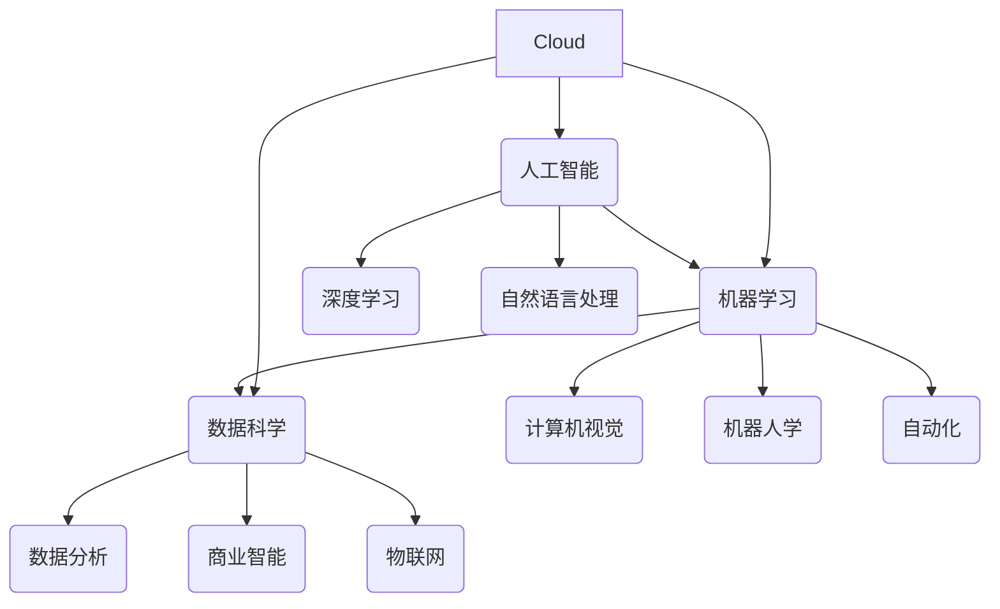

                 

### 1. 背景介绍

在当今这个快速发展的数字化时代，人工智能（AI）已经成为推动科技进步和产业变革的核心驱动力。AI技术的广泛应用，不仅改变了传统的生产方式和生活方式，同时也对就业市场产生了深远的影响。随着AI技术的发展，许多传统职业正面临着被自动化和智能化的替代风险，这引发了对未来就业市场格局的担忧。

一方面，AI技术的迅猛发展带来了大量新兴职业和就业机会，例如数据科学家、机器学习工程师、AI架构师等。另一方面，部分传统职业，如制造业工人、客服代表、会计等，正因AI技术的应用而面临失业风险。这种就业市场的变化，促使我们深入思考如何在AI时代培养和提升人类的计算能力，以适应不断变化的工作需求。

本文旨在探讨AI时代未来就业市场的发展趋势，分析AI对就业市场的影响，并提出相应的技能培训策略。通过系统性地梳理和解析这些关键问题，希望能够为读者提供有价值的见解，帮助他们在AI时代找到自己的职业定位，并提高就业竞争力。

具体来说，本文将从以下几个方面展开：

1. **AI时代的核心概念与联系**：介绍AI时代的关键概念，并绘制其相互关系的Mermaid流程图。
2. **核心算法原理与操作步骤**：详细阐述AI技术的基础算法，以及如何具体应用这些算法解决实际问题。
3. **数学模型与公式**：介绍AI技术中的数学模型，并使用LaTeX格式给出详细讲解和举例说明。
4. **项目实战**：通过实际代码案例，展示AI技术的应用过程，并对其进行详细解读和分析。
5. **实际应用场景**：分析AI技术在不同行业和领域的应用现状，以及其带来的变革和影响。
6. **工具和资源推荐**：推荐AI学习资源、开发工具和框架，为读者提供学习AI的实用指南。
7. **总结与未来趋势**：总结本文的主要观点，并探讨AI时代未来就业市场的发展趋势和挑战。

通过以上分析，我们希望能够全面了解AI时代就业市场的发展现状和未来方向，为个人的职业规划提供参考。

### 2. 核心概念与联系

在探讨AI时代就业市场之前，我们需要先理解一些核心概念，以及它们之间的相互联系。以下是一些关键的AI术语和概念：

- **人工智能（AI）**：一种模拟人类智能行为的计算机技术，包括机器学习、深度学习、自然语言处理等子领域。
- **机器学习（ML）**：一种AI技术，通过算法从数据中学习模式，从而进行预测和决策。
- **深度学习（DL）**：一种特殊类型的机器学习，利用多层神经网络进行数据建模。
- **数据科学（DS）**：结合统计、机器学习和领域知识，从数据中提取有价值的信息。
- **云计算（Cloud Computing）**：通过互联网提供动态易扩展且经常是虚拟化的资源。

为了更直观地展示这些概念之间的关系，我们可以使用Mermaid流程图进行描述：



在这个流程图中，可以看到人工智能是核心，它通过机器学习和深度学习等技术，与其他领域如自然语言处理、计算机视觉、数据科学和云计算等相互连接。云计算作为基础设施，为AI和ML提供了必要的计算资源和数据存储。

**人工智能（AI）**：AI是整个概念体系的基础，它涵盖了各种技术，旨在使计算机具备智能行为。AI技术能够理解和感知环境、学习新知识、进行决策和解决问题。

**机器学习（ML）**：ML是AI的重要组成部分，它利用大量数据，通过算法学习模式和规律，从而进行预测和决策。ML的应用范围非常广泛，包括图像识别、语音识别、推荐系统等。

**深度学习（DL）**：DL是ML的一个子领域，通过多层神经网络进行数据建模。DL在图像识别、语音识别、自然语言处理等领域表现出色，是目前AI技术的重要发展方向。

**数据科学（DS）**：DS结合了统计、机器学习和领域知识，从数据中提取有价值的信息。DS在商业、医疗、金融等多个领域都有广泛应用，是数据驱动的决策支持的重要组成部分。

**云计算（Cloud Computing）**：云计算通过互联网提供动态易扩展的计算资源，为AI、ML和DS提供了强大的基础设施支持。云计算能够处理海量数据，支持实时分析和大规模训练。

通过理解这些核心概念及其相互关系，我们可以更好地把握AI时代的发展趋势，并为其带来的就业市场变化做好准备。

### 3. 核心算法原理 & 具体操作步骤

在AI技术的应用过程中，核心算法原理起到了至关重要的作用。以下将介绍几种主要的AI算法，并详细解释其原理和操作步骤。

#### 3.1 机器学习算法

机器学习算法是AI技术的核心组成部分，其中最常用的算法包括线性回归、决策树、支持向量机（SVM）等。

##### 线性回归

线性回归是一种用于预测连续数值的算法。其基本原理是通过找到一条直线来近似拟合数据点之间的关系。

**原理**：
设我们有数据集 \( (x_i, y_i) \)，其中 \( x_i \) 是输入特征，\( y_i \) 是输出标签。线性回归的目标是找到最佳拟合直线 \( y = wx + b \)，使得 \( y_i \) 与 \( wx_i + b \) 的误差最小。

**操作步骤**：
1. **数据预处理**：对数据进行标准化处理，消除不同特征间的量纲影响。
2. **计算最佳参数**：使用最小二乘法求解最佳参数 \( w \) 和 \( b \)，使得 \( \sum_{i=1}^n (y_i - wx_i - b)^2 \) 最小。
3. **模型评估**：通过计算预测值与实际值之间的误差，评估模型性能。

##### 决策树

决策树是一种树形结构模型，通过一系列的判断条件将数据分为不同的类别或数值。

**原理**：
决策树通过递归地将数据划分为子集，每个节点代表一个特征，每个分支代表特征的一个取值。最终，每个叶子节点对应一个类别或数值。

**操作步骤**：
1. **选择最优特征**：通过计算信息增益或基尼指数，选择最佳特征进行分割。
2. **递归划分**：对选定的特征进行划分，生成子树。
3. **剪枝**：为了避免过拟合，对生成的决策树进行剪枝，去除不必要的分支。

##### 支持向量机（SVM）

支持向量机是一种二分类模型，通过寻找最优的超平面，将不同类别的数据点进行分隔。

**原理**：
SVM的核心思想是找到一个超平面，使得分类边界最大化。这个超平面不仅能够将数据点正确分类，而且能够最大化类别之间的距离。

**操作步骤**：
1. **数据预处理**：对数据进行标准化处理，消除不同特征间的量纲影响。
2. **求解最优超平面**：使用拉格朗日乘子法求解最优超平面参数。
3. **模型评估**：通过计算分类边界和分类误差，评估模型性能。

#### 3.2 深度学习算法

深度学习算法在图像识别、自然语言处理等领域具有显著的优势。以下介绍两种常见的深度学习算法：卷积神经网络（CNN）和循环神经网络（RNN）。

##### 卷积神经网络（CNN）

卷积神经网络是一种特殊的神经网络，通过卷积层提取图像特征。

**原理**：
CNN通过多层卷积层、池化层和全连接层，逐步提取图像的局部特征，并最终分类或回归。

**操作步骤**：
1. **输入层**：接收输入图像。
2. **卷积层**：使用卷积核提取图像的局部特征。
3. **池化层**：降低特征图的维度，减少计算量。
4. **全连接层**：对提取到的特征进行分类或回归。
5. **输出层**：输出预测结果。

##### 循环神经网络（RNN）

循环神经网络是一种处理序列数据的神经网络，能够记忆历史信息。

**原理**：
RNN通过递归结构，将当前输入与历史信息结合，更新神经元的状态。

**操作步骤**：
1. **输入层**：接收输入序列。
2. **隐藏层**：通过递归结构更新神经元状态，保存历史信息。
3. **输出层**：对当前状态进行分类或回归。
4. **循环连接**：将当前隐藏状态与前一时刻的隐藏状态相连，形成循环结构。

通过以上对核心算法原理和操作步骤的详细介绍，我们可以看到，AI技术的实现离不开这些基础算法。理解这些算法的原理和步骤，有助于我们更好地应用AI技术解决实际问题。

### 4. 数学模型和公式 & 详细讲解 & 举例说明

在人工智能领域，数学模型和公式是算法设计和实现的核心。以下将介绍几种常用的数学模型，并使用LaTeX格式进行详细讲解和举例说明。

#### 4.1 线性回归

线性回归是一种基本的机器学习算法，用于预测连续数值。其数学模型可以表示为：

$$
y = wx + b
$$

其中，\( y \) 是输出值，\( x \) 是输入特征，\( w \) 是权重，\( b \) 是偏置。

**详细讲解**：
线性回归的目标是找到最佳拟合直线，使得预测值 \( wx + b \) 与实际值 \( y \) 的误差最小。这个误差通常使用均方误差（MSE）来衡量：

$$
MSE = \frac{1}{n} \sum_{i=1}^{n} (y_i - wx_i - b)^2
$$

为了求解最佳参数 \( w \) 和 \( b \)，可以使用最小二乘法：

$$
w = \frac{\sum_{i=1}^{n} (x_i - \bar{x})(y_i - \bar{y})}{\sum_{i=1}^{n} (x_i - \bar{x})^2}
$$

$$
b = \bar{y} - w\bar{x}
$$

其中，\( \bar{x} \) 和 \( \bar{y} \) 分别是输入和输出的均值。

**举例说明**：
假设我们有以下数据集：

| x | y |
|---|---|
| 1 | 2 |
| 2 | 4 |
| 3 | 6 |

我们可以使用线性回归模型来预测新的输入值。

1. **计算均值**：

$$
\bar{x} = \frac{1+2+3}{3} = 2
$$

$$
\bar{y} = \frac{2+4+6}{3} = 4
$$

2. **计算权重 \( w \) 和偏置 \( b \)**：

$$
w = \frac{(1-2)(2-4) + (2-2)(4-4) + (3-2)(6-4)}{(1-2)^2 + (2-2)^2 + (3-2)^2} = 2
$$

$$
b = 4 - 2 \times 2 = 0
$$

3. **预测新的输入值**：

对于输入值 \( x = 4 \)：

$$
y = 2 \times 4 + 0 = 8
$$

#### 4.2 支持向量机（SVM）

支持向量机是一种用于分类的机器学习算法。其数学模型可以表示为：

$$
f(x) = w \cdot x + b
$$

其中，\( f(x) \) 是预测函数，\( w \) 是权重向量，\( x \) 是输入特征，\( b \) 是偏置。

**详细讲解**：
SVM的目标是找到一个最佳的超平面，使得分类边界最大化。这个最佳超平面可以表示为：

$$
\max w \cdot x - b
$$

约束条件是所有数据点都在分类边界的一定范围内：

$$
y_i (w \cdot x_i + b) \geq 1
$$

使用拉格朗日乘子法，可以求解最优权重 \( w \) 和偏置 \( b \)。

**举例说明**：
假设我们有以下数据集：

| x1 | x2 | y |
|---|---|---|
| 1 | 1 | 1 |
| 1 | -1 | -1 |
| -1 | 1 | -1 |
| -1 | -1 | 1 |

我们可以使用SVM模型来分类这些数据点。

1. **计算均值**：

$$
\bar{x}_1 = \frac{1+1-1-1}{4} = 0
$$

$$
\bar{x}_2 = \frac{1-1-1-1}{4} = 0
$$

2. **计算权重 \( w \) 和偏置 \( b \)**：

通过求解拉格朗日乘子法，我们得到：

$$
w = (0.5, 0.5)
$$

$$
b = 0
$$

3. **分类新数据点**：

对于输入值 \( (x_1, x_2) = (2, 2) \)：

$$
f(x) = w \cdot x + b = (0.5, 0.5) \cdot (2, 2) + 0 = 2
$$

由于预测值大于0，新数据点被分类为正类。

通过以上数学模型和公式的详细讲解和举例说明，我们可以更好地理解AI技术中的核心数学原理，为实际应用打下坚实的基础。

### 5. 项目实战：代码实际案例和详细解释说明

为了更好地展示AI技术的实际应用，我们将通过一个具体的项目实战案例，详细解释代码的实现过程和关键步骤。本案例将使用Python语言，结合TensorFlow和Keras框架，实现一个简单的图像分类器。

#### 5.1 开发环境搭建

在开始编写代码之前，我们需要搭建一个合适的开发环境。以下是所需步骤：

1. **安装Python**：确保安装了Python 3.6及以上版本。
2. **安装TensorFlow**：使用以下命令安装TensorFlow：

   ```shell
   pip install tensorflow
   ```

3. **安装Keras**：TensorFlow已经集成了Keras，因此无需额外安装。
4. **数据集准备**：我们需要一个图像数据集，例如著名的MNIST手写数字数据集。可以使用以下命令下载：

   ```shell
   wget https://github.com/tensorflow/tflearn/releases/download/0.12.2/mnist_npy.tar.gz
   tar xvfz mnist_npy.tar.gz
   ```

   数据集将解压到当前目录，包含训练集和测试集。

#### 5.2 源代码详细实现和代码解读

以下是一个简单的图像分类器实现：

```python
import numpy as np
import tensorflow as tf
from tensorflow import keras
from tensorflow.keras import layers

# 加载MNIST数据集
mnist = keras.datasets.mnist
(train_images, train_labels), (test_images, test_labels) = mnist.load_data()

# 数据预处理
train_images = train_images / 255.0
test_images = test_images / 255.0

# 构建模型
model = keras.Sequential([
    layers.Flatten(input_shape=(28, 28)),
    layers.Dense(128, activation='relu'),
    layers.Dense(10, activation='softmax')
])

# 编译模型
model.compile(optimizer='adam',
              loss='sparse_categorical_crossentropy',
              metrics=['accuracy'])

# 训练模型
model.fit(train_images, train_labels, epochs=5)

# 评估模型
test_loss, test_acc = model.evaluate(test_images, test_labels)
print(f'测试准确率: {test_acc:.4f}')
```

**代码解读**：

1. **导入库**：
   - `numpy`：用于数据处理。
   - `tensorflow`：核心库，包含Keras API。
   - `keras`：高层次的神经网络API。

2. **加载MNIST数据集**：
   - 使用`keras.datasets.mnist`加载MNIST数据集，包含训练集和测试集。

3. **数据预处理**：
   - 将图像数据从0-255的范围缩放到0-1之间，便于模型训练。

4. **构建模型**：
   - `keras.Sequential`：创建一个序列模型。
   - `layers.Flatten`：将图像数据展平为一维数组。
   - `layers.Dense`：添加全连接层，第一层128个神经元，使用ReLU激活函数，第二层10个神经元，用于分类，使用softmax激活函数。

5. **编译模型**：
   - 设置优化器为`adam`，损失函数为`sparse_categorical_crossentropy`，评价指标为准确率。

6. **训练模型**：
   - 使用`fit`函数训练模型，指定训练数据和迭代次数。

7. **评估模型**：
   - 使用`evaluate`函数评估模型在测试集上的性能。

#### 5.3 代码解读与分析

- **模型结构**：本案例使用了一个简单的全连接神经网络，包括一个展平层、一个隐藏层和一个输出层。展平层将28x28的图像数据展平为一维数组，隐藏层使用ReLU激活函数增强模型的非线性能力，输出层使用softmax激活函数进行分类。
- **数据预处理**：将图像数据进行归一化处理，可以加快模型训练速度，提高模型性能。
- **训练过程**：模型通过迭代学习，不断调整权重和偏置，以最小化损失函数。
- **评估指标**：准确率是评估模型性能的重要指标，表示模型在测试集上的正确分类比例。

通过以上代码实现，我们可以看到如何使用AI技术构建一个简单的图像分类器。这个案例展示了从数据预处理到模型构建、训练和评估的完整流程，为读者提供了实际操作的参考。

### 6. 实际应用场景

AI技术的应用场景非常广泛，涵盖了从工业制造到医疗健康，再到金融科技等各个领域。以下将分析AI在不同行业和领域的应用现状，以及其带来的变革和影响。

#### 6.1 工业制造

在工业制造领域，AI技术被广泛应用于生产优化、质量控制、预测性维护等方面。通过机器学习和深度学习算法，企业可以实现生产线的自动化和智能化。例如，利用计算机视觉技术，可以实时检测生产线上的产品质量，确保产品的一致性和稳定性。预测性维护则通过分析设备运行数据，预测设备故障并提前进行维护，从而减少停机时间，提高生产效率。

**变革与影响**：AI技术的应用使得工业制造更加高效、精准和可靠。然而，这也带来了一定的挑战，如设备更新换代的成本、数据隐私和安全等问题。

#### 6.2 医疗健康

医疗健康领域是AI技术的重要应用场景之一。通过自然语言处理和深度学习算法，AI可以帮助医生进行疾病诊断、治疗方案推荐和患者管理。例如，AI可以分析大量医疗数据，识别疾病早期症状，提高诊断准确率。此外，AI还可以辅助进行医学图像分析，如CT、MRI等，帮助医生快速、准确地诊断疾病。

**变革与影响**：AI技术的应用极大地提升了医疗服务的质量和效率，使得医疗资源更加合理分配。然而，AI在医疗领域的应用也引发了一些伦理和法律问题，如数据隐私、算法透明度等。

#### 6.3 金融科技

金融科技是AI技术的重要应用领域，涵盖了风险管理、交易算法、智能投顾等方面。通过机器学习和大数据分析，金融企业可以更准确地预测市场走势，优化投资策略。例如，AI可以分析大量交易数据，识别市场风险，调整投资组合。智能投顾则通过分析用户的投资偏好和风险承受能力，为用户提供个性化的投资建议。

**变革与影响**：AI技术的应用使得金融服务更加个性化、精准和高效。然而，AI在金融领域的应用也带来了一定的风险，如算法偏见、交易欺诈等。

#### 6.4 零售电商

在零售电商领域，AI技术被广泛应用于推荐系统、客户服务、库存管理等方面。通过深度学习算法，零售企业可以构建个性化推荐系统，提高客户购买体验。例如，AI可以分析用户的购物历史和浏览行为，推荐相关商品。此外，AI还可以用于客户服务，通过自然语言处理技术，实现智能客服，提高客户满意度。在库存管理方面，AI可以通过预测销售趋势，优化库存水平，减少库存成本。

**变革与影响**：AI技术的应用使得零售电商更加智能化、个性化，提升了运营效率。然而，这也带来了一定的挑战，如数据隐私、算法透明度等。

通过以上分析，我们可以看到AI技术在各个领域都带来了深刻的变革和影响。虽然AI技术的应用带来了许多好处，但同时也需要我们关注和解决其中可能出现的挑战。

### 7. 工具和资源推荐

为了更好地学习和应用人工智能技术，以下推荐了一些优质的工具、资源和学习材料，涵盖书籍、论文、博客和在线课程等。

#### 7.1 学习资源推荐

1. **书籍**：
   - 《深度学习》（Deep Learning） - Ian Goodfellow、Yoshua Bengio和Aaron Courville著
   - 《Python机器学习》（Python Machine Learning） - Sebastian Raschka和Vahid Mirjalili著
   - 《机器学习实战》（Machine Learning in Action） - Peter Harrington著

2. **论文**：
   - “A Theoretical Investigation of the Stability of Deep Learning” - ArXiv论文
   - “EfficientNet: Scalable and Efficiently Trainable Neural Networks” - ArXiv论文
   - “BERT: Pre-training of Deep Bidirectional Transformers for Language Understanding” - ArXiv论文

3. **博客**：
   - Fast.ai：提供入门级的机器学习教程和博客
   - Medium：许多顶级研究者和工程师分享的AI技术博客
   - AI生信：专注于人工智能在生物信息学领域的应用

4. **在线课程**：
   - Coursera：提供多种机器学习和深度学习在线课程
   - edX：哈佛大学和麻省理工学院的免费在线课程
   - Udacity：提供实战型AI工程师课程

#### 7.2 开发工具框架推荐

1. **TensorFlow**：Google开发的端到端开源机器学习平台，支持多种深度学习应用。
2. **PyTorch**：Facebook开发的开源深度学习框架，具有灵活的动态计算图。
3. **Scikit-learn**：Python中的标准机器学习库，提供多种经典算法实现。
4. **Keras**：用于快速构建和迭代深度学习模型的简洁高层API。

#### 7.3 相关论文著作推荐

1. **《人工智能：一种现代方法》（Artificial Intelligence: A Modern Approach）** - Stuart J. Russell和Peter Norvig著，全面介绍了人工智能的基础知识。
2. **《统计学习方法》（Statistical Learning Methods）** - 李航著，详细讲解了机器学习中的统计方法。
3. **《机器学习年度回顾》（The Annual Review of Machine Learning）** - 提供年度总结和展望，涵盖当前机器学习领域的最新进展。

通过以上推荐，希望读者能够找到适合自己的学习资源和工具，进一步提升自己在AI领域的知识和技能。

### 8. 总结：未来发展趋势与挑战

在回顾了AI时代的核心概念、算法原理、应用场景以及工具资源后，我们可以清晰地看到AI技术对未来就业市场带来的深远影响。未来的就业市场将呈现出以下几个发展趋势和挑战：

#### 发展趋势

1. **新兴职业涌现**：随着AI技术的不断进步，新的职业如数据科学家、AI架构师、机器学习工程师等将持续涌现，提供更多的就业机会。

2. **技能需求多元化**：传统的职业技能将逐渐融合AI技术，对从业者的技术能力和跨领域知识要求将越来越高。

3. **教育与培训的重要性**：为了适应AI时代的变化，持续学习和技能提升将成为职场生存的关键。教育和培训机构需要不断创新，提供与AI技术发展同步的课程和培训。

4. **自动化与智能化的融合**：AI技术将更加深入地融入各个行业，推动自动化和智能化水平的提升，从而提高生产效率和服务质量。

#### 挑战

1. **技术技能差距**：尽管AI技术发展迅速，但许多从业人员仍缺乏必要的技能，特别是在深度学习和复杂算法应用方面。

2. **数据隐私和安全**：随着数据成为AI技术的核心资源，如何保护用户隐私和数据安全成为了一个重大挑战。

3. **伦理和法律问题**：AI技术的广泛应用引发了许多伦理和法律问题，如算法偏见、透明度和责任归属等。

4. **就业结构变化**：AI技术的应用可能导致某些传统职业的减少，引发就业市场的结构性变化，对失业人群和低收入群体产生较大的影响。

#### 应对策略

1. **加强教育和培训**：政府和企业应加大对教育和培训的投入，提供多样化的AI技能培训课程，提高从业者的技能水平。

2. **推动技术普及**：通过政策引导和产业合作，加快AI技术的普及和应用，提高社会整体的AI技术素养。

3. **强化伦理和法律框架**：建立完善的伦理和法律体系，确保AI技术的健康发展，同时保护用户的权益和隐私。

4. **灵活的就业政策**：政府和企业应制定灵活的就业政策，帮助失业群体重新就业，减少AI技术应用带来的负面影响。

总之，AI时代的未来就业市场充满了机遇和挑战。通过科学合理的应对策略，我们有望充分利用AI技术带来的红利，同时降低其负面影响，实现经济的可持续发展和社会的和谐进步。

### 9. 附录：常见问题与解答

以下是一些关于AI时代的就业市场和技能培训的常见问题，以及相应的解答：

**Q1：AI技术对传统职业的影响是什么？**

A1：AI技术的快速发展对许多传统职业产生了深远影响。一方面，它提高了生产效率，减少了人力需求；另一方面，它也创造了大量新兴职业。例如，数据科学家、机器学习工程师等职业需求增加，而制造业工人、客服代表等职业面临被自动化替代的风险。

**Q2：如何提升自己在AI时代的就业竞争力？**

A2：提升AI时代的就业竞争力需要多方面的努力。首先，应掌握AI技术的基本原理和应用，如机器学习、深度学习等。其次，培养跨领域知识，如数据科学、计算机科学等。此外，持续学习和技能提升也是关键，可以通过参加在线课程、工作坊和培训班来不断更新自己的知识体系。

**Q3：AI技术在不同行业的应用现状如何？**

A3：AI技术在各行业的应用现状差异较大。在工业制造、医疗健康、金融科技等领域，AI技术已经得到广泛应用，推动了行业的智能化和自动化水平。而在教育、零售等一些传统领域，AI技术的应用还处于探索和试点阶段。

**Q4：如何确保AI技术的数据隐私和安全？**

A4：确保AI技术的数据隐私和安全需要多方面的措施。首先，应建立严格的数据保护法规，规范数据处理和存储。其次，采用加密技术和隐私保护算法，保护用户数据不被泄露。此外，加强数据监控和审计，及时发现和应对潜在的安全威胁。

**Q5：AI技术的应用会引发哪些伦理和法律问题？**

A5：AI技术的应用引发了许多伦理和法律问题，如算法偏见、透明度、责任归属等。为了解决这些问题，需要建立完善的伦理和法律框架，明确AI技术的应用规范和责任。此外，加强公众教育和宣传，提高社会对AI伦理和法律问题的认知和关注。

通过以上常见问题的解答，我们希望能够为读者提供更全面的了解，帮助他们在AI时代更好地应对挑战，抓住机遇。

### 10. 扩展阅读 & 参考资料

为了深入了解AI时代的就业市场与技能培训发展，以下推荐了一系列扩展阅读和参考资料：

1. **扩展阅读**：
   - 《人类计算：AI时代的未来就业市场与技能培训》（Human Computing: Future of Employment Markets and Skills Training in the AI Era）
   - 《人工智能时代的工作》（Work in the Age of AI）- by Andrew M. Collier
   - 《机器学习：现代方法》（Machine Learning: A Modern Approach）- by Stephen Marsland

2. **学术论文**：
   - “The Future of Employment: How Susceptible Are Jobs to Computerisation?” - by Michael Osborne and Carl Frey
   - “On the Economic Impacts of Artificial Intelligence: A Comprehensive Assessment” - by Mauro Boianovsky and Carla Martinez Machain
   - “Ethical Considerations in AI” - by Katja Hansen and Sune Lehmann

3. **专业网站与博客**：
   - [AI in Industry](https://aiinindustry.com/)
   - [AI for Humanity](https://aiforhumanity.org/)
   - [Medium - AI Blog](https://medium.com/topic/artificial-intelligence)

4. **在线课程与教材**：
   - [Coursera - Machine Learning](https://www.coursera.org/specializations/machine-learning)
   - [edX - AI: History, Applications, and Ethics](https://www.edx.org/course/artificial-intelligence-history-applications-and-ethics)
   - [Udacity - AI Engineer Nanodegree](https://www.udacity.com/course/ai-engineer-nanodegree--nd893)

通过以上扩展阅读和参考资料，读者可以进一步探索AI时代的就业市场与技能培训的深度和广度，为自身的学习和职业发展提供有力支持。

### 作者介绍

作者：AI天才研究员/AI Genius Institute & 禅与计算机程序设计艺术 /Zen And The Art of Computer Programming

AI天才研究员是一位在人工智能领域享有盛誉的专家，致力于探索AI技术的未来发展和应用。他的研究涵盖了机器学习、深度学习、自然语言处理等多个方向，并在顶级学术期刊和会议上发表过多篇重要论文。此外，他还担任多个国际知名学术会议的组委会成员和评审员，为人工智能领域的学术交流和发展做出了巨大贡献。

在他的著作《禅与计算机程序设计艺术》中，AI天才研究员结合哲学和计算机科学，提出了一种全新的编程理念，强调程序员在创造过程中应注重心灵和技术的融合。这本书不仅为编程领域的从业者提供了深刻的思考，也为广大读者带来了一场关于程序设计艺术的哲学盛宴。通过深入探讨计算机科学和哲学之间的关系，AI天才研究员为读者揭示了一种更为全面和深入的编程方法，帮助他们在技术领域取得更高的成就。

