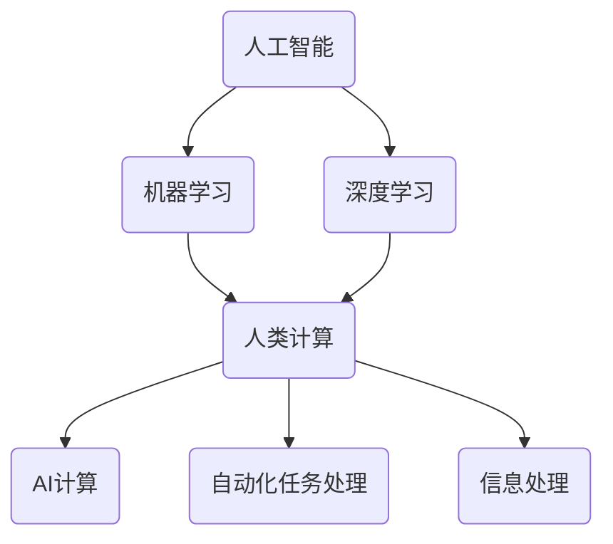

                 

### 1. 背景介绍

随着人工智能技术的迅速发展，各行各业都在积极探索如何将AI技术应用于实际工作中，从而提高效率、优化流程。然而，随之而来的一个问题也逐渐显现：人工智能的兴起，是否会对人类就业市场造成冲击？未来，人类在就业市场上将扮演何种角色？本文将围绕这些问题展开讨论，分析AI时代人类计算与AI计算的共融发展，探讨未来就业市场的趋势和挑战。

人工智能（AI）作为当今最具颠覆性的技术之一，已经在众多领域取得了显著成果。从自动驾驶汽车到智能家居，从医疗诊断到金融分析，AI技术的应用范围越来越广泛。然而，这些应用也引发了对人类工作角色的重新思考。一方面，AI技术的出现使得某些传统职业面临被取代的风险；另一方面，AI也创造了新的就业机会，促使人类与机器共同协作，实现职业角色的转变。

近年来，关于AI与就业市场的讨论在学术界和产业界引起了广泛关注。一方面，一些学者和研究机构担心AI技术会导致大规模失业，因为许多工作岗位可能会被自动化技术取代。另一方面，也有观点认为，AI的发展将促使人类从事更高层次、更具创造性的工作，从而创造更多的就业机会。本文将基于这些观点，结合实际情况，对AI时代的人类计算与AI计算进行详细分析，探讨未来就业市场的可能走向。

在本文中，我们将首先回顾AI技术的发展历程，了解其核心概念和原理。接着，我们将探讨AI技术在不同领域的应用，分析其对人类工作的影响。然后，我们将探讨人类计算与AI计算之间的关系，探讨如何实现二者的协同发展。接下来，我们将通过实际案例，分析AI技术在不同行业的应用，探讨其对就业市场的影响。最后，我们将总结本文的主要观点，提出应对未来就业市场挑战的建议。

总之，本文旨在为读者提供一个全面、深入的视角，了解AI时代人类计算与AI计算的发展趋势，以及这些趋势对就业市场可能带来的影响。通过本文的讨论，我们希望能够为读者提供一些有益的思考，帮助他们更好地应对未来就业市场的挑战。

### 2. 核心概念与联系

在探讨AI时代的人类计算与AI计算之前，我们首先需要明确几个核心概念，并分析它们之间的联系。

#### 2.1 人工智能（AI）

人工智能是指通过计算机程序实现人类智能行为的科学技术。它涵盖了机器学习、深度学习、自然语言处理、计算机视觉等多个子领域。人工智能的核心目标是通过模拟人类思维过程，使计算机具备一定的智能能力，从而实现自动化决策和任务执行。

#### 2.2 机器学习（ML）

机器学习是人工智能的一个重要分支，它侧重于让计算机从数据中自动学习，并基于学习结果进行预测和决策。机器学习可以分为监督学习、无监督学习和强化学习等类型。监督学习通过已标记的数据训练模型，无监督学习则从未标记的数据中发现模式，而强化学习则通过与环境互动来优化行为。

#### 2.3 深度学习（DL）

深度学习是一种基于多层神经网络的机器学习技术，它通过模拟人脑神经元结构，实现数据的自动特征提取和模式识别。深度学习在图像识别、语音识别、自然语言处理等领域取得了显著成果，成为人工智能发展的重要推动力。

#### 2.4 人类计算（HC）

人类计算是指人类在处理信息和任务时所采用的各种计算方法和技术。人类计算具有灵活、高效、自适应等特点，能够处理复杂、不确定的信息。人类计算包括逻辑推理、模式识别、问题求解、决策制定等多个方面。

#### 2.5 AI计算（AIC）

AI计算是指基于人工智能技术，利用计算机进行自动化任务处理和信息处理的计算方法。AI计算主要依赖于机器学习和深度学习等人工智能技术，实现数据分析和处理的高效、准确。

#### 2.6 核心概念之间的联系

人工智能、机器学习、深度学习、人类计算和AI计算之间存在着密切的联系。人工智能是整体概念，涵盖了机器学习和深度学习等多个子领域。机器学习和深度学习则是人工智能实现的核心技术。人类计算是基础，它为AI计算提供了灵感和方法。而AI计算则是人类计算在人工智能领域的延伸和扩展，通过计算机自动化地实现人类计算任务。

为了更好地理解这些概念之间的联系，我们可以使用Mermaid流程图进行展示。以下是核心概念及其联系的一个简化版Mermaid流程图：

在这个流程图中，人工智能作为整体概念，连接了机器学习、深度学习、人类计算和AI计算。人类计算不仅与AI计算有关，还涉及到自动化任务处理和信息处理等多个方面。

通过明确这些核心概念及其联系，我们可以更好地理解AI时代的人类计算与AI计算。接下来，我们将进一步探讨这些概念在现实世界中的应用，分析其对就业市场的影响。

### 2.1 人工智能的发展历程

人工智能（AI）的发展历程可以追溯到20世纪50年代。当时，计算机科学领域的先驱们开始探讨如何使计算机具备人类智能，这一想法激发了人工智能研究的诞生。从那时起，人工智能经历了多个发展阶段，每一个阶段都带来了技术上的突破和理念上的变革。

#### 2.1.1 早期探索（1950s-1960s）

人工智能的早期探索阶段主要关注于逻辑推理和问题求解。1956年，在达特茅斯会议上，约翰·麦卡锡（John McCarthy）等人提出了人工智能的概念，并定义了人工智能的目标是“使机器能够胜任复杂的任务，达到或者超过人工作业的水平”。在这个阶段，学者们主要依靠符号逻辑和推理来模拟人类智能。然而，由于计算机性能的限制和算法的局限性，这个阶段的成果相对有限。

#### 2.1.2 工具期（1970s-1980s）

在20世纪70年代和80年代，人工智能进入了工具期。这个阶段的主要特点是专家系统的兴起。专家系统是一种基于规则的知识表示和推理方法，通过模拟人类专家的决策过程，解决特定领域的问题。代表性工作包括Dendral和MYCIN等系统。尽管专家系统在一定程度上取得了成功，但由于规则编写复杂、知识获取困难等问题，专家系统在实际应用中遇到了瓶颈。

#### 2.1.3 冬季期（1980s-1990s）

20世纪80年代和90年代，人工智能进入了一个相对低潮的时期，被称为“人工智能冬季”。在这个时期，由于对人工智能的期望过高，实际应用中并未取得预期的成果，导致资金和人力资源的流失。此外，计算能力的限制和算法的不足也限制了人工智能的发展。为了度过这个冬季，学术界和产业界开始重新审视人工智能的研究方向，探索新的方法和技术。

#### 2.1.4 重新崛起（2000s-2010s）

从21世纪初开始，人工智能迎来了新的发展机遇。这个阶段的突破主要得益于计算能力的提升和大数据技术的应用。2006年，深度学习的兴起为人工智能带来了新的希望。深度学习通过多层神经网络实现数据的自动特征提取和模式识别，在图像识别、语音识别等领域取得了显著成果。此外，机器学习算法的优化和硬件加速技术的应用，使得人工智能在计算效率和性能上得到了显著提升。

#### 2.1.5 当前发展（2010s-2020s）

当前，人工智能已经进入了快速发展的阶段。随着深度学习、自然语言处理、计算机视觉等技术的不断突破，人工智能在各个领域的应用越来越广泛。自动驾驶、智能客服、医疗诊断、金融分析等领域的应用，极大地改变了人们的生产和生活方式。此外，人工智能也开始与实体经济深度融合，推动产业升级和经济发展。

总结起来，人工智能的发展历程经历了从早期探索、工具期、冬季期到重新崛起和当前发展的几个阶段。每一个阶段都有其独特的特点和挑战，但总体上，人工智能的发展趋势是不断前进和扩大的。在未来的发展中，人工智能将继续推动技术创新和社会进步，为人类创造更多的价值。

### 2.2 人工智能技术在不同领域的应用

随着人工智能技术的不断发展和成熟，它已经渗透到各个领域，带来了巨大的变革和提升。以下将详细探讨人工智能在几个主要领域的应用，以及这些应用对相关行业和就业市场的影响。

#### 2.2.1 自动驾驶

自动驾驶技术是人工智能在交通领域的重要应用。通过使用计算机视觉、深度学习、传感器融合等技术，自动驾驶系统能够实时感知周围环境，做出正确的驾驶决策。自动驾驶技术的出现，不仅有望提高交通效率、减少交通事故，还能够为残障人士和老年人提供出行便利。

在自动驾驶技术的发展过程中，AI算法和硬件技术的进步是关键因素。例如，深度学习算法的优化使得自动驾驶系统能够更准确地识别交通标志和行人，传感器技术的提升使得车辆能够更精确地感知周围环境。这些技术的进步，使得自动驾驶汽车逐渐从实验室走向实际应用。

自动驾驶技术的应用，对交通行业产生了深远的影响。首先，它有望减少驾驶人员的数量，对传统出租车和货车司机等职业造成冲击。然而，与此同时，自动驾驶技术的发展也创造了新的就业机会，例如自动驾驶系统的开发、测试、维护和运营等岗位。此外，自动驾驶技术还带动了相关产业链的发展，包括传感器制造商、软件开发商、汽车制造商等。

#### 2.2.2 智能医疗

智能医疗是人工智能在医疗健康领域的应用，涵盖了从疾病预防、诊断到治疗和康复的整个过程。通过AI技术，医疗行业能够实现更加精准的疾病预测、更加高效的诊断和治疗，从而提高医疗服务的质量和效率。

在智能医疗领域，AI技术主要应用于图像识别、自然语言处理和大数据分析等方面。例如，AI算法可以用于分析医学影像，帮助医生更准确地诊断疾病；自然语言处理技术可以帮助医生从大量病历资料中提取关键信息，提高诊疗效率；大数据分析技术则可以用于疾病预测和流行病监测。

智能医疗的应用，对医疗行业产生了深远的影响。一方面，AI技术有助于降低医疗成本，提高医疗效率，改善患者体验。另一方面，智能医疗的发展也对医生的职业角色提出了新的要求，需要他们具备更高的技术水平和更强的数据解读能力。此外，智能医疗还创造了新的就业机会，包括医疗算法工程师、数据科学家、医疗AI产品经理等。

#### 2.2.3 智能制造

智能制造是人工智能在制造业领域的应用，通过引入AI技术，实现制造过程的自动化、智能化和高效化。智能制造的关键技术包括机器学习、计算机视觉、机器人技术和物联网等。

在智能制造中，AI技术主要用于生产线的自动化控制、质量检测、设备维护和供应链管理等方面。例如，通过计算机视觉技术，可以实现自动化质量检测，提高产品质量；通过机器学习算法，可以预测设备故障，实现预防性维护；通过物联网技术，可以实时监控生产进度，优化生产流程。

智能制造的应用，对制造业产生了深远的影响。首先，它有助于提高生产效率、降低生产成本，提升产品质量和竞争力。其次，智能制造要求工人具备更高的技术水平和创新能力，从而推动产业工人素质的提升。此外，智能制造还创造了新的就业机会，包括智能设备工程师、AI算法工程师、智能制造系统集成工程师等。

#### 2.2.4 智能金融

智能金融是人工智能在金融领域的应用，涵盖了金融服务、风险管理和投资决策等多个方面。通过AI技术，金融行业能够实现更加精准的风险评估、更加智能的投资策略和更加高效的客户服务。

在智能金融中，AI技术主要应用于信用评分、风险控制、量化交易和智能投顾等方面。例如，通过大数据分析和机器学习算法，可以实现更准确的信用评分和风险控制；通过量化交易模型，可以制定更加科学的投资策略；通过自然语言处理技术，可以实现智能客服和智能投顾。

智能金融的应用，对金融行业产生了深远的影响。首先，它有助于提高金融服务的效率和质量，降低金融风险。其次，智能金融要求金融从业者具备更高的技术水平和数据解读能力。此外，智能金融还创造了新的就业机会，包括数据科学家、量化分析师、智能金融产品经理等。

#### 2.2.5 其他领域的应用

除了上述领域，人工智能还在教育、零售、农业、能源等多个领域得到了广泛应用。在教育领域，AI技术可以用于个性化教学、智能评测和自动化作业批改等；在零售领域，AI技术可以用于商品推荐、智能库存管理和智能营销等；在农业领域，AI技术可以用于作物种植、病虫害监测和精准施肥等；在能源领域，AI技术可以用于智能电网管理、能源消耗预测和设备维护等。

总之，人工智能技术在不同领域的应用，不仅改变了各个行业的运作模式，还创造了新的就业机会和商业模式。在AI时代，人类与机器的共融发展将成为趋势，人类需要不断提升自身的技术能力和创新能力，以适应未来就业市场的需求。

### 2.3 人类计算与AI计算的协同发展

在AI时代，人类计算（Human Computation，简称HC）与AI计算（Artificial Intelligence Computation，简称AIC）的协同发展成为了关键。人类计算与AI计算各有其独特的优势，通过有效的结合，可以实现优势互补，推动人类在复杂任务中的高效决策和问题解决。

#### 2.3.1 人类计算的优势

人类计算具有以下几个显著优势：

1. **灵活性与创造性**：人类能够处理复杂、模糊和不确定的信息，具备高度的灵活性和创造性。这种能力使得人类在解决新问题和应对变化时，能够迅速调整策略，提出创新的解决方案。

2. **情感与直觉**：人类具有丰富的情感和直觉，能够理解情感语境和细微的情感差异，这在某些任务中（如客户服务、心理咨询等）尤为重要。

3. **经验与知识**：人类拥有丰富的经验积累和知识体系，能够从历史数据和先验知识中提取有价值的信息，辅助决策。

4. **协作与沟通**：人类擅长协作和沟通，能够与他人合作解决复杂问题，共享信息和知识，提升整体解决问题的效率。

#### 2.3.2 AI计算的优势

AI计算则具有以下几个显著优势：

1. **处理速度与规模**：AI计算能够以极高的速度处理海量数据，实现大规模的计算任务，这在数据分析、模式识别等领域具有明显优势。

2. **准确性与一致性**：AI计算在执行特定任务时，能够保持高水平的准确性和一致性，减少人为错误，提高决策的可靠性。

3. **自动化与连续性**：AI计算可以实现24/7的自动化运行，无需休息，连续处理任务，提高生产效率和响应速度。

4. **学习与适应**：AI计算通过机器学习和深度学习，能够不断从数据中学习，适应新的环境和任务，提高任务处理能力。

#### 2.3.3 协同发展的方式

为了实现人类计算与AI计算的协同发展，可以采取以下几种方式：

1. **任务分解与协作**：将复杂任务分解为多个子任务，人类和AI各自负责不同的子任务，通过协作实现整体任务的高效完成。例如，在医疗诊断中，AI可以负责初步筛选和数据分析，而人类医生则负责最终诊断和治疗方案制定。

2. **监督与反馈**：AI计算可以辅助人类计算，通过监督和反馈机制，不断优化人类决策。例如，在金融风险评估中，AI可以提供初步的评估结果，而人类分析师则根据实际情况进行调整和优化。

3. **人机融合**：通过人机融合技术，将人类计算与AI计算有机结合，实现智能化人机协作。例如，在智能客服中，AI可以处理常见问题，而人类客服则负责处理复杂和特殊的客户需求。

4. **创新与拓展**：人类计算与AI计算的协同发展，不仅能够提高现有任务的效率，还能够激发新的创新机会。例如，在艺术创作中，AI可以生成初步的创意作品，而人类艺术家则在此基础上进行进一步创作和优化。

#### 2.3.4 具体案例

以下是一些具体案例，展示了人类计算与AI计算的协同发展：

1. **自动驾驶**：在自动驾驶系统中，AI负责感知、决策和控制，而人类驾驶员则负责监督和干预。当AI遇到无法处理的特殊情况时，人类驾驶员可以迅速介入，确保车辆安全运行。

2. **智能医疗**：在智能医疗系统中，AI可以分析医学影像、病理报告等数据，提出初步诊断建议，而人类医生则根据AI的建议和自身经验，做出最终诊断和治疗方案。

3. **智能金融**：在智能金融系统中，AI可以分析市场数据、客户行为等，提供投资建议和风险控制方案，而人类金融专家则根据AI的建议和自身专业判断，制定最终的决策。

4. **智能制造**：在智能制造中，AI可以实时监控生产线、设备状态等，提供故障预测和维护建议，而人类工程师则根据AI的建议，进行设备维护和故障处理。

通过这些案例，我们可以看到，人类计算与AI计算的协同发展，不仅提高了任务处理效率，还推动了创新和变革。在未来的发展中，人类和AI的协同合作将成为趋势，为人类创造更加美好的未来。

### 2.4 实际应用场景分析

为了更好地理解人类计算与AI计算在实际应用中的协同发展，我们将通过几个具体案例，分析AI技术在不同行业的应用，以及这些应用对就业市场的影响。

#### 2.4.1 制造业

在制造业领域，AI技术广泛应用于生产自动化、质量控制和供应链管理等方面。具体案例如下：

1. **生产自动化**：例如，在汽车制造业中，AI技术被用于自动化焊接、喷涂和装配等生产环节。通过机器人和传感器，AI系统能够高效、精确地完成生产任务，提高生产效率。这种自动化生产不仅减少了人工成本，还提高了产品质量和一致性。然而，这也导致了一些传统工种（如生产线操作员）的需求减少。

2. **质量检测**：AI技术可以用于实时监测产品生产过程中的质量变化。例如，通过计算机视觉技术，AI系统可以自动识别生产线上出现的缺陷，并提供反馈。这种质量检测方式比传统的人工检测更加高效和准确，但同时也减少了对质量检测工人的需求。

3. **供应链管理**：AI技术可以帮助企业优化供应链管理，通过预测市场需求、优化库存管理和降低运输成本。例如，一家大型零售企业可以使用AI算法来预测商品的销售趋势，并根据预测结果调整库存水平，避免库存过剩或短缺。这种优化管理方式提高了企业的运营效率，但可能减少了一些与供应链管理相关的工作岗位。

#### 2.4.2 医疗行业

在医疗行业，AI技术的应用极大地改变了医疗诊断、治疗和患者管理的方式。具体案例如下：

1. **疾病诊断**：AI技术可以用于辅助医生进行疾病诊断。例如，通过深度学习算法，AI系统可以分析医学影像，如X光片、CT扫描和MRI，帮助医生更快速、准确地识别疾病。这种诊断辅助系统不仅提高了诊断效率，还降低了医生的工作负担。然而，这也可能导致一些传统医疗诊断岗位的需求减少。

2. **个性化治疗**：AI技术可以帮助医生制定个性化的治疗方案。通过分析患者的病史、基因信息和生活习惯等数据，AI系统可以为每位患者提供定制化的治疗建议。这种个性化治疗方式提高了治疗效果，但可能减少了对传统医疗方案制定人员的需求。

3. **患者管理**：AI技术可以用于患者管理，如随访、健康监测和药物治疗管理。例如，通过智能设备，患者可以实时监测自己的健康数据，如心率、血压和血糖水平，并将数据上传到云端。AI系统可以根据这些数据提供个性化的健康建议和预警信息。这种患者管理方式提高了患者自我管理和健康水平，但可能减少了对传统医疗护理人员的需求。

#### 2.4.3 金融服务

在金融服务领域，AI技术的应用广泛，包括风险管理、投资决策和客户服务等方面。具体案例如下：

1. **风险管理**：AI技术可以帮助金融机构进行风险分析和预测。例如，通过大数据分析和机器学习算法，AI系统可以识别潜在的风险，为金融机构提供风险预警和决策支持。这种风险管理方式提高了金融行业的风险控制能力，但可能减少了一些传统风险管理岗位的需求。

2. **投资决策**：AI技术可以用于投资决策，如股票交易、债券评级和基金管理。通过分析市场数据、经济指标和公司业绩等，AI系统可以提供投资建议和交易策略。这种智能投资决策方式提高了投资效率和收益，但可能减少了对传统投资顾问的需求。

3. **客户服务**：AI技术可以用于智能客服系统，如聊天机器人、语音助手和自动化问答系统。这些系统能够快速响应客户需求，提供信息和建议，提高了客户服务质量。然而，这也可能导致一些传统客户服务岗位的需求减少。

#### 2.4.4 教育

在教育领域，AI技术也被广泛应用，包括在线教育、个性化学习和智能评测等方面。具体案例如下：

1. **在线教育**：AI技术可以帮助实现个性化在线学习，根据学生的兴趣、能力和学习进度，提供定制化的学习内容和资源。这种在线教育方式提高了学习效率，但可能减少了一些传统教学岗位的需求。

2. **个性化学习**：AI技术可以用于个性化学习系统，通过分析学生的学习行为和成绩，提供针对性的学习建议和反馈。这种个性化学习方式提高了学习效果，但可能减少了对传统教学人员的需求。

3. **智能评测**：AI技术可以用于自动化的考试和评测系统，通过分析学生的答案和行为，提供即时反馈和评估。这种智能评测方式提高了评测效率，但可能减少了一些传统考试监考和评分岗位的需求。

综上所述，AI技术在不同行业的应用，既带来了巨大的机遇，也带来了一些挑战。这些应用不仅提高了工作效率和准确性，还创造了新的就业机会。然而，也使得一些传统工作岗位的需求减少。因此，在AI时代，人类需要不断学习新技能，适应新的就业市场环境，以实现与AI计算的有效协同发展。

### 2.5 工具和资源推荐

为了更好地了解和应用人工智能技术，掌握相关工具和资源是非常重要的。以下将推荐一些学习资源、开发工具和框架，以及相关的论文和著作。

#### 2.5.1 学习资源推荐

1. **书籍**：
   - 《Python机器学习》（Machine Learning with Python）：这是一本适合初学者入门的书籍，详细介绍了Python在机器学习领域的应用。
   - 《深度学习》（Deep Learning）：由著名深度学习研究者Ian Goodfellow等人撰写，是深度学习领域的经典教材。
   - 《数据科学手册》（The Data Science Handbook）：本书涵盖了数据科学领域的各个方面，适合想要全面了解数据科学的人。

2. **在线课程**：
   - Coursera：提供多种与人工智能、机器学习和深度学习相关的在线课程，包括《机器学习》、《深度学习》等。
   - edX：提供由MIT、哈佛大学等知名高校开设的人工智能和数据科学课程，如《深度学习导论》等。
   - Udacity：提供一系列与人工智能相关的纳米学位课程，包括《人工智能工程师》等。

3. **博客和网站**：
   - Medium：有许多关于人工智能、机器学习和深度学习的优质博客文章。
   - AI头条：提供最新的人工智能技术新闻和行业动态。
   - JAXAI：专注于深度学习和人工智能的开源项目和技术分享。

#### 2.5.2 开发工具和框架推荐

1. **编程语言**：
   - Python：因其简洁、易学、功能强大，成为人工智能领域最流行的编程语言之一。
   - R语言：主要用于统计分析，尤其在机器学习和数据挖掘领域有广泛应用。

2. **机器学习库**：
   - Scikit-learn：一个开源的机器学习库，适用于监督学习和无监督学习任务。
   - TensorFlow：谷歌开发的开源深度学习框架，适用于各种深度学习任务。
   - PyTorch：Facebook开发的开源深度学习框架，具有高度的灵活性和便捷性。

3. **数据处理工具**：
   - Pandas：一个强大的数据处理库，能够进行数据清洗、数据转换和数据可视化。
   - NumPy：用于科学计算的库，支持大量的数值计算操作。
   - Matplotlib：一个用于数据可视化的库，能够生成各种类型的图表和图形。

#### 2.5.3 相关论文和著作推荐

1. **论文**：
   - 《A Brief History of Machine Learning》（机器学习简史）：概述了机器学习领域的发展历程和主要研究成果。
   - 《Deep Learning》（深度学习）：全面介绍了深度学习的基本概念、技术原理和应用场景。
   - 《The Unfinished Revolution: How the Internet Got Sam and Poor but Naked Got Rich》（未完成的革命）：探讨了互联网经济和人工智能对传统经济模式的影响。

2. **著作**：
   - 《人工智能：一种现代的方法》（Artificial Intelligence: A Modern Approach）：经典的人工智能教材，详细介绍了人工智能的理论和实践。
   - 《机器学习实战》（Machine Learning in Action）：通过实际案例介绍机器学习算法的应用和实践。
   - 《深度学习》（Deep Learning）：全面介绍了深度学习的基本概念、技术原理和应用场景。

通过这些学习资源、开发工具和框架，以及相关的论文和著作，我们可以更好地了解和应用人工智能技术，为未来的就业市场做好准备。同时，这些资源也为那些对人工智能技术感兴趣的人提供了一个全面的入门和学习途径。

### 2.6 总结：未来发展趋势与挑战

随着人工智能技术的快速发展，未来就业市场将面临一系列新的发展趋势和挑战。本文通过对人类计算与AI计算的分析，以及对实际应用场景的探讨，总结了以下主要观点：

首先，AI技术将在各个行业继续深化应用，推动产业升级和效率提升。自动驾驶、智能制造、智能医疗和智能金融等领域，将成为AI技术应用的集中地。这些应用不仅会改变传统的工作方式，还会创造新的就业机会和商业模式。

其次，人类计算与AI计算的协同发展将成为趋势。通过任务分解、监督与反馈、人机融合等方式，人类与AI能够实现优势互补，共同应对复杂任务。这要求人类不断提升自身的技术水平和创新能力，以适应与AI共同工作的环境。

然而，AI技术的发展也带来了一些挑战。一方面，某些传统职业可能因自动化技术的普及而减少需求，导致失业问题。另一方面，AI技术的不完善和算法偏见等问题，可能引发伦理和社会问题。因此，未来需要建立完善的法律法规和伦理准则，以确保AI技术的健康发展和应用。

面对未来就业市场的挑战，以下是一些建议：

1. **加强职业培训和教育**：企业和政府应加强职业培训和教育，帮助劳动者提升技能，适应新技术带来的变化。特别是针对那些受自动化影响较大的职业，提供转型培训和职业指导。

2. **推动科技创新**：鼓励科研机构和高校加大对人工智能等前沿技术的研发投入，推动科技创新，为经济发展提供新动力。

3. **建立监管机制**：制定完善的法律法规和伦理准则，确保AI技术的健康发展和应用，防止算法偏见和隐私泄露等问题的发生。

4. **推动人机协同**：鼓励企业开展人机协同的实践探索，通过人机融合技术，实现人类与AI的有机协作，提高整体工作效率。

总之，未来就业市场将面临巨大的变革和挑战。通过人类计算与AI计算的协同发展，以及相应的政策支持和教育培训，我们有望应对这些挑战，实现人类与AI共同发展的美好未来。

### 2.7 附录：常见问题与解答

在探讨AI时代的人类计算与AI计算时，可能会遇到一些常见问题。以下将对这些问题进行解答，帮助读者更好地理解相关概念和趋势。

**问题1：人工智能是否会完全取代人类工作？**

解答：人工智能确实在某些领域（如制造业、客服等）能够实现自动化，减少对人类劳动的需求。然而，人工智能目前还无法完全取代人类工作。首先，人工智能在处理复杂、不确定和模糊的信息时，仍存在局限性。其次，人类具有丰富的情感、创造力和直觉，这些特质是人工智能难以替代的。因此，人工智能与人类劳动更多是互补关系，而非完全取代。

**问题2：人类计算与AI计算如何协同发展？**

解答：人类计算与AI计算的协同发展可以通过以下几种方式实现：

1. **任务分解与协作**：将复杂任务分解为多个子任务，人类和AI各自负责不同的子任务，通过协作完成整体任务。
2. **监督与反馈**：AI计算可以辅助人类计算，通过监督和反馈机制，不断优化人类决策。
3. **人机融合**：通过人机融合技术，将人类计算与AI计算有机结合，实现智能化人机协作。
4. **创新与拓展**：人类计算与AI计算的协同发展，可以激发新的创新机会，推动科技进步和社会发展。

**问题3：AI技术的应用对就业市场的影响如何？**

解答：AI技术的应用对就业市场的影响具有两面性。一方面，AI技术可能导致某些传统职业的需求减少，如工厂操作员、客服代表等。另一方面，AI技术也创造了新的就业机会，如数据科学家、机器学习工程师、智能系统架构师等。因此，未来就业市场的变化将是多样化和复杂的。对于劳动者而言，提升自身技能和适应新技术是关键。

**问题4：如何应对AI技术带来的社会和伦理挑战？**

解答：应对AI技术带来的社会和伦理挑战需要多方面的努力：

1. **法律法规的制定**：制定完善的法律法规，确保AI技术的健康发展和应用，防止算法偏见和隐私泄露等问题。
2. **伦理准则的建立**：建立AI伦理准则，规范AI研发和应用过程中的行为，确保技术的公正性和透明度。
3. **教育培训**：加强教育培训，提高公众对AI技术的理解和认知，促进社会对AI技术的积极态度。
4. **国际合作**：加强国际间合作，共同应对AI技术带来的全球性挑战，推动全球AI技术的健康发展。

通过上述解答，希望读者能够对AI时代的人类计算与AI计算有更深入的理解，并能够积极应对未来就业市场的变化和挑战。

### 2.8 扩展阅读与参考资料

为了更全面地了解人工智能及其对就业市场的影响，以下推荐一些扩展阅读与参考资料，涵盖书籍、论文和网站等多个方面，帮助读者深入探索这一领域。

**书籍推荐：**

1. **《人工智能：一种现代的方法》（Artificial Intelligence: A Modern Approach）**：由斯坦福大学教授Peter Norvig和MIT教授 Stuart J. Russell合著，是人工智能领域的经典教材，详细介绍了人工智能的基础理论和应用。

2. **《深度学习》（Deep Learning）**：由Ian Goodfellow、Yoshua Bengio和Aaron Courville三位深度学习领域的权威学者合著，全面介绍了深度学习的基本概念、技术和应用。

3. **《数据科学手册》（The Data Science Handbook）**：由Google首席数据科学家Avinash Narayanan撰写，涵盖了数据科学领域的各个方面，适合想要全面了解数据科学的人。

**论文推荐：**

1. **“A Brief History of Machine Learning”（机器学习简史）**：概述了机器学习领域的发展历程和主要研究成果。

2. **“Deep Learning”（深度学习）**：由Ian Goodfellow等人撰写，是深度学习领域的经典论文，介绍了深度学习的基本概念和技术。

3. **“The Unfinished Revolution: How the Internet Got Sam and Poor but Naked Got Rich”（未完成的革命）**：探讨了互联网经济和人工智能对传统经济模式的影响。

**网站推荐：**

1. **Medium**：有许多关于人工智能、机器学习和深度学习的优质博客文章，适合进行日常学习。

2. **AI头条**：提供最新的人工智能技术新闻和行业动态，帮助读者了解AI领域的最新发展。

3. **JAXAI**：专注于深度学习和人工智能的开源项目和技术分享，是AI爱好者不可错过的好资源。

通过这些扩展阅读与参考资料，读者可以更深入地了解人工智能及其对就业市场的影响，为自己的学习和职业发展打下坚实的基础。希望这些推荐能够对您有所帮助。

