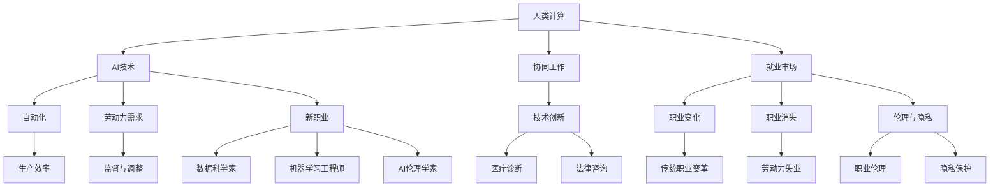

                 

### 背景介绍

在人工智能（AI）技术迅猛发展的背景下，人类计算这一概念逐渐引起了广泛关注。人类计算不仅关注机器如何模拟人类思维过程，更关注人类与机器如何协同工作，共同推动社会进步。随着AI技术不断突破，AI在图像识别、自然语言处理、决策支持等领域的应用越来越广泛，这无疑对传统就业市场产生了深远的影响。

首先，AI技术的发展促使了许多新职业的出现。例如，数据科学家、机器学习工程师、AI伦理学家等职位日益受到关注。这些新兴职业不仅需要深厚的专业背景，还需要不断更新知识，以适应快速变化的技术环境。同时，AI技术的普及也使得一些传统职业面临变革。例如，自动驾驶技术的成熟可能会减少对司机的需求，而机器人技术的发展则可能改变制造业的就业结构。

其次，AI技术对人类劳动力的需求也产生了重大影响。一方面，AI可以自动化许多重复性、低技能的工作，提高生产效率，降低成本。例如，智能客服系统可以处理大量的客户咨询，大大减轻了人工客服的负担。另一方面，AI技术也创造了大量新岗位，需要人类操作和监督。例如，AI系统在医疗诊断、法律咨询等领域的应用，需要专业人员进行培训、调整和优化。

然而，AI技术带来的变革并非全是机遇。随着AI技术的普及，一些职业可能会消失，导致部分劳动力失业。此外，AI技术也引发了关于职业伦理和隐私保护的讨论。如何确保AI技术的发展不会对人类社会造成负面影响，成为了一个亟待解决的问题。

本文将围绕以下问题展开讨论：AI时代如何重新定义就业市场？哪些技能将成为未来的核心竞争力？如何进行有效的技能培训以应对AI带来的挑战？通过深入分析AI时代就业市场的趋势，我们希望能为读者提供有益的启示。

### 核心概念与联系

为了深入理解人类计算在AI时代的作用，我们需要首先明确一些核心概念和它们之间的相互关系。以下是一个简化的Mermaid流程图，用于描述这些概念和它们之间的联系：



#### 1. 人类计算与AI技术

人类计算是指模拟人类思维过程的能力，包括学习、推理、决策等。而AI技术是实现人类计算的主要手段，通过机器学习、深度学习等方法，使计算机能够从数据中学习并做出智能决策。人类计算与AI技术的关系可以用图中的A和B表示。AI技术为人类计算提供了强大的工具，使得人类能够更有效地解决问题。

#### 2. 人类计算与协同工作

在AI时代，人类与机器的协同工作变得越来越重要。协同工作不仅能够提高工作效率，还能够发挥人类和机器各自的优势。例如，在医疗领域，医生可以利用AI系统进行诊断和预测，同时结合自己的经验和专业知识，做出更准确的决策。这种协同工作模式可以用图中的A和C表示。

#### 3. 人类计算与就业市场

就业市场是衡量人类计算和AI技术对社会影响的直接指标。随着AI技术的普及，就业市场发生了显著变化。一方面，AI技术创造了许多新职业，如数据科学家、机器学习工程师等；另一方面，它也导致了一些传统职业的消失，如工厂流水线工人、电话客服等。人类计算与就业市场的关系可以用图中的A和D表示。

#### 4. AI技术与自动化

AI技术的核心优势之一就是其自动化能力。通过自动化，AI能够处理大量重复性、低技能的工作，提高生产效率。然而，自动化也会导致部分劳动力失业，因此需要在推广AI技术的同时，关注劳动力的再培训和再就业问题。AI技术与自动化之间的关系可以用图中的B和E表示。

#### 5. AI技术与劳动力需求

AI技术的发展不仅改变了就业市场的结构，还影响了劳动力的需求。一方面，AI技术需要大量专业人才，如数据科学家、机器学习工程师等；另一方面，它也使得一些职业变得过时，需要劳动力进行转型。AI技术与劳动力需求之间的关系可以用图中的B和F表示。

#### 6. 人类计算与新职业

随着AI技术的普及，许多新职业应运而生。这些职业不仅需要专业技能，还需要不断更新知识，以适应快速变化的技术环境。例如，数据科学家和机器学习工程师等职业，正是AI时代的新兴职业代表。人类计算与新职业的关系可以用图中的A和G表示。

#### 7. 技术创新与实际应用

技术创新是推动人类计算和AI技术发展的重要动力。在医疗、法律、金融等领域的实际应用，不仅展示了AI技术的潜力，也证明了人类计算的重要性。技术创新与实际应用的关系可以用图中的H和Q、R表示。

通过上述流程图，我们可以更清晰地理解人类计算在AI时代的作用和影响。接下来，我们将进一步探讨AI时代的核心算法原理，以及如何通过数学模型和公式来分析和解决问题。

### 核心算法原理 & 具体操作步骤

在探讨AI时代的核心算法原理时，我们需要重点关注机器学习（Machine Learning）和深度学习（Deep Learning）这两种算法。这两种算法在AI领域中扮演着重要角色，不仅能够提高计算机的智能水平，还能够解决许多复杂的问题。

#### 1. 机器学习

机器学习是一种通过数据训练模型，使计算机能够从数据中学习并做出预测或决策的方法。其核心算法包括线性回归（Linear Regression）、决策树（Decision Tree）和支持向量机（Support Vector Machine，SVM）等。

##### 线性回归

线性回归是一种用于预测连续值的模型。其基本原理是寻找一条最佳拟合直线，使数据点到这条直线的距离之和最小。具体操作步骤如下：

1. **数据收集与预处理**：首先收集相关的数据，并进行预处理，包括数据清洗、特征提取等。
2. **模型建立**：使用最小二乘法（Least Squares）或梯度下降法（Gradient Descent）建立线性回归模型。
3. **模型训练**：使用训练数据对模型进行训练，调整模型的参数。
4. **模型评估**：使用测试数据对模型进行评估，计算模型的预测误差。

##### 决策树

决策树是一种用于分类和回归的模型。其基本原理是通过一系列的判断条件将数据划分为不同的类别或值。具体操作步骤如下：

1. **数据收集与预处理**：与线性回归类似，首先收集相关的数据，并进行预处理。
2. **特征选择**：选择对分类或回归有重要影响的特征。
3. **树构建**：使用信息增益（Information Gain）或基尼指数（Gini Index）等指标，递归地划分数据集，建立决策树。
4. **模型评估**：使用测试数据对模型进行评估，计算模型的准确率、召回率等指标。

##### 支持向量机

支持向量机是一种用于分类和回归的模型。其基本原理是寻找一个最佳的超平面，使数据点到超平面的距离最大。具体操作步骤如下：

1. **数据收集与预处理**：与线性回归类似，首先收集相关的数据，并进行预处理。
2. **特征提取**：将数据转换成高维空间，找到最佳的超平面。
3. **模型训练**：使用支持向量机算法训练模型，调整模型的参数。
4. **模型评估**：使用测试数据对模型进行评估，计算模型的预测误差。

#### 2. 深度学习

深度学习是一种基于多层神经网络的机器学习算法。其核心思想是通过多层神经网络的反向传播算法，不断调整网络的权重，使网络能够从大量数据中学习并做出预测。深度学习的应用范围非常广泛，包括图像识别、自然语言处理、语音识别等。

##### 卷积神经网络（CNN）

卷积神经网络是一种用于图像识别的深度学习模型。其基本原理是使用卷积层提取图像特征，然后通过池化层降低数据维度，最后通过全连接层进行分类。具体操作步骤如下：

1. **数据收集与预处理**：收集大量的图像数据，并进行预处理，如归一化、缩放等。
2. **模型建立**：建立卷积神经网络模型，包括卷积层、池化层和全连接层。
3. **模型训练**：使用训练数据对模型进行训练，调整网络的权重。
4. **模型评估**：使用测试数据对模型进行评估，计算模型的准确率。

##### 循环神经网络（RNN）

循环神经网络是一种用于序列数据的深度学习模型。其基本原理是通过循环机制保存序列的信息，使网络能够处理长序列数据。具体操作步骤如下：

1. **数据收集与预处理**：收集序列数据，如文本、语音等，并进行预处理。
2. **模型建立**：建立循环神经网络模型，包括输入层、隐藏层和输出层。
3. **模型训练**：使用训练数据对模型进行训练，调整网络的权重。
4. **模型评估**：使用测试数据对模型进行评估，计算模型的准确率。

通过上述算法和步骤，我们可以看到机器学习和深度学习在AI时代的重要性。这些算法不仅能够提高计算机的智能水平，还能够解决许多复杂的实际问题。接下来，我们将进一步探讨数学模型和公式，以更深入地理解这些算法的工作原理。

### 数学模型和公式 & 详细讲解 & 举例说明

在AI时代，数学模型和公式是理解和实现核心算法的重要工具。以下我们将详细介绍一些常用的数学模型和公式，并通过具体例子来说明它们的应用。

#### 1. 线性回归模型

线性回归模型是一种用于预测连续值的模型，其基本公式如下：

\[ y = \beta_0 + \beta_1x \]

其中，\( y \) 是因变量，\( x \) 是自变量，\( \beta_0 \) 和 \( \beta_1 \) 是模型的参数。

**举例说明**：

假设我们要预测一家商店的月销售额（\( y \)），其影响因素包括广告支出（\( x \)）。根据历史数据，我们得到以下模型：

\[ 销售额 = 5000 + 200 \times 广告支出 \]

若广告支出为1000元，则：

\[ 销售额 = 5000 + 200 \times 1000 = 150000元 \]

这个例子展示了如何使用线性回归模型进行预测。

#### 2. 决策树模型

决策树模型是一种用于分类和回归的模型，其基本公式如下：

\[ y = \sum_{i=1}^{n} \beta_i x_i \]

其中，\( y \) 是因变量，\( x_i \) 是特征变量，\( \beta_i \) 是特征权重。

**举例说明**：

假设我们要预测一个人的年龄（\( y \)），其影响因素包括身高（\( x_1 \)）和体重（\( x_2 \)）。根据历史数据，我们得到以下决策树模型：

\[ 年龄 = \begin{cases} 
20 & \text{if } 身高 > 180 \text{ and } 体重 > 70 \\
30 & \text{if } 身高 > 180 \text{ and } 体重 < 70 \\
40 & \text{if } 身高 < 180 \text{ and } 体重 > 70 \\
50 & \text{if } 身高 < 180 \text{ and } 体重 < 70 
\end{cases} \]

若身高为185厘米，体重为75公斤，则：

\[ 年龄 = 30 \]

这个例子展示了如何使用决策树模型进行分类。

#### 3. 支持向量机模型

支持向量机模型是一种用于分类和回归的模型，其基本公式如下：

\[ y = \sum_{i=1}^{n} \alpha_i y_i K(x_i, x) - b \]

其中，\( y \) 是因变量，\( x_i \) 是支持向量，\( \alpha_i \) 是支持向量的权重，\( y_i \) 是支持向量的标签，\( K(x_i, x) \) 是核函数，\( b \) 是偏置。

**举例说明**：

假设我们要预测一群学生的成绩（\( y \)），其影响因素包括数学成绩（\( x_1 \)）和英语成绩（\( x_2 \)）。根据历史数据，我们得到以下支持向量机模型：

\[ 成绩 = \sum_{i=1}^{n} \alpha_i y_i K(x_i, x) - b \]

其中，\( K(x_i, x) = (x_1 \times x_1 + x_2 \times x_2) \)

若数学成绩为80分，英语成绩为90分，则：

\[ 成绩 = \sum_{i=1}^{n} \alpha_i y_i K(x_i, x) - b \]

这个例子展示了如何使用支持向量机模型进行回归预测。

#### 4. 卷积神经网络模型

卷积神经网络模型是一种用于图像识别的深度学习模型，其基本公式如下：

\[ h_{l} = \sigma(W_{l} \cdot a_{l-1} + b_{l}) \]

其中，\( h_{l} \) 是第 \( l \) 层的输出，\( \sigma \) 是激活函数，\( W_{l} \) 是权重矩阵，\( a_{l-1} \) 是第 \( l-1 \) 层的输入，\( b_{l} \) 是偏置。

**举例说明**：

假设我们要使用卷积神经网络模型对一幅图像进行分类，图像的维度为 \( 28 \times 28 \)。首先，我们将图像输入到卷积层，得到以下模型：

\[ h_1 = \sigma(W_1 \cdot a_0 + b_1) \]

其中，\( a_0 \) 是图像的原始数据，\( W_1 \) 是卷积层的权重矩阵，\( b_1 \) 是卷积层的偏置。

通过多层卷积和池化操作，最终将图像分类为某个类别。例如，若图像被分类为猫，则：

\[ h_L = \sigma(W_L \cdot a_{L-1} + b_L) \]

这个例子展示了如何使用卷积神经网络模型对图像进行分类。

通过上述数学模型和公式的讲解，我们可以看到它们在AI时代的应用非常广泛。接下来，我们将通过一个具体的项目实战，进一步展示如何使用这些算法和模型来解决实际问题。

### 项目实战：代码实际案例和详细解释说明

在本节中，我们将通过一个具体的项目实战来展示如何使用AI技术解决实际问题。我们将使用Python编程语言和相关的AI库（如TensorFlow和Scikit-learn）来实现一个简单的图像分类项目。这个项目将涉及数据收集、模型建立、训练和评估等多个步骤。

#### 开发环境搭建

首先，我们需要搭建一个合适的开发环境。以下是所需的软件和库：

- Python 3.8 或更高版本
- TensorFlow 2.x
- Scikit-learn 0.22 或更高版本

安装这些库的方法如下：

```bash
pip install python==3.8
pip install tensorflow==2.x
pip install scikit-learn==0.22
```

#### 数据收集

接下来，我们需要收集图像数据。这里我们使用著名的MNIST手写数字数据集，该数据集包含60,000个训练图像和10,000个测试图像，每个图像都是28x28的灰度图像。

```python
import tensorflow as tf
mnist = tf.keras.datasets.mnist
(train_images, train_labels), (test_images, test_labels) = mnist.load_data()
```

#### 数据预处理

在训练模型之前，我们需要对图像数据进行预处理，包括归一化和重塑数据形状。以下是具体的预处理步骤：

```python
train_images = train_images / 255.0
test_images = test_images / 255.0
train_images = train_images.reshape((-1, 28, 28, 1))
test_images = test_images.reshape((-1, 28, 28, 1))
```

#### 模型建立

我们将使用卷积神经网络（CNN）来建立图像分类模型。以下是一个简单的CNN模型：

```python
model = tf.keras.Sequential([
  tf.keras.layers.Conv2D(32, (3,3), activation='relu', input_shape=(28, 28, 1)),
  tf.keras.layers.MaxPooling2D(2, 2),
  tf.keras.layers.Conv2D(64, (3,3), activation='relu'),
  tf.keras.layers.MaxPooling2D(2,2),
  tf.keras.layers.Conv2D(64, (3,3), activation='relu'),
  tf.keras.layers.Flatten(),
  tf.keras.layers.Dense(64, activation='relu'),
  tf.keras.layers.Dense(10, activation='softmax')
])
```

#### 模型训练

接下来，我们将使用训练数据来训练模型。以下是训练模型的步骤：

```python
model.compile(optimizer='adam',
              loss='sparse_categorical_crossentropy',
              metrics=['accuracy'])
model.fit(train_images, train_labels, epochs=5)
```

#### 代码解读与分析

在上面的代码中，我们首先导入了TensorFlow库并加载数据集。然后，我们对数据进行归一化和重塑，使其符合模型的输入要求。接下来，我们使用卷积神经网络（CNN）建立了图像分类模型。模型包括两个卷积层和两个池化层，以及两个全连接层。最后，我们使用`compile()`方法设置了优化器和损失函数，并使用`fit()`方法训练模型。

#### 模型评估

训练完成后，我们需要对模型进行评估。以下是评估模型的代码：

```python
test_loss, test_acc = model.evaluate(test_images,  test_labels, verbose=2)
print('\nTest accuracy:', test_acc)
```

#### 代码解读与分析

在上面的代码中，我们使用`evaluate()`方法对模型进行评估。这个方法会计算测试数据的损失和准确率。通过打印结果，我们可以了解模型的性能。

#### 总结

通过上述项目实战，我们展示了如何使用Python和TensorFlow库建立一个简单的图像分类模型。这个项目不仅涵盖了数据收集、预处理、模型建立和训练等步骤，还通过实际代码展示了如何操作和应用这些技术。这个实战项目为我们提供了一个实际应用AI技术的示例，帮助我们更好地理解AI技术在解决实际问题中的应用。

### 实际应用场景

AI技术已经在各个领域取得了显著的应用成果，极大地改变了我们的生活方式和工作模式。以下我们将探讨一些AI技术的实际应用场景，并分析这些应用如何影响就业市场。

#### 1. 医疗

在医疗领域，AI技术已经广泛应用于疾病诊断、治疗建议、药物研发等方面。例如，AI算法可以分析医学影像，如X光片、CT扫描和MRI，帮助医生更准确地诊断疾病。此外，AI还可以根据患者的病史、基因数据和临床表现，为医生提供个性化的治疗建议。这些技术的应用不仅提高了医疗服务的质量，也减轻了医生的工作负担。

**就业市场影响**：随着AI技术在医疗领域的广泛应用，对医疗专业人才的需求也在不断增长。数据科学家、机器学习工程师、AI伦理学家等专业人才的需求量显著增加。然而，这也可能导致一些传统医疗职位，如放射科医生和病理医生，面临就业压力。

#### 2. 制造业

在制造业中，AI技术被用于生产过程的自动化、质量控制、预测性维护等方面。例如，机器视觉系统可以实时监测生产线上的产品质量，检测出次品并进行标记。AI算法还可以分析设备运行数据，预测设备可能出现的故障，从而实现预测性维护，减少设备停机时间和维护成本。

**就业市场影响**：AI技术的自动化应用虽然减少了制造业中的劳动力需求，但同时也创造了新的就业机会。机器人操作员、AI系统维护工程师、智能制造工程师等职位的需求不断增加。此外，AI技术的应用也要求传统制造业工人掌握新的技能，如编程和数据分析。

#### 3. 金融

在金融领域，AI技术被广泛应用于风险管理、欺诈检测、算法交易等方面。例如，AI算法可以分析客户的交易行为，识别潜在的欺诈行为并进行预警。此外，AI还可以根据市场数据和算法模型，进行高效的算法交易，提高投资收益。

**就业市场影响**：AI技术在金融领域的应用显著改变了金融行业的就业结构。数据科学家、机器学习工程师、AI风险管理专家等专业人才的需求量大幅增加。然而，这也可能导致一些传统金融职位，如股票分析师和风险管理专家，面临就业压力。

#### 4. 零售

在零售领域，AI技术被用于客户行为分析、库存管理、个性化推荐等方面。例如，AI算法可以分析客户的购物习惯和行为，为零售商提供个性化的产品推荐。此外，AI还可以根据市场需求和库存情况，优化库存管理，减少库存成本。

**就业市场影响**：AI技术在零售领域的应用不仅提高了零售行业的效率，也创造了新的就业机会。数据分析师、机器学习工程师、AI产品推荐专家等职位的需求显著增加。然而，这也可能导致一些传统零售职位，如售货员和库存管理员，面临就业压力。

#### 5. 教育

在教育领域，AI技术被用于个性化学习、智能评测、教育资源优化等方面。例如，AI算法可以根据学生的学习进度和表现，提供个性化的学习路径和资源。此外，AI还可以通过智能评测系统，自动批改作业和考试，提高教育效率。

**就业市场影响**：AI技术在教育领域的应用对教师职位的需求产生了影响。个性化学习系统虽然减轻了教师的教学负担，但也要求教师掌握新的技能，如编程和数据分析。同时，AI技术在教育资源的优化方面，也创造了新的就业机会，如AI教育产品开发工程师、教育数据分析师等。

通过上述实际应用场景的分析，我们可以看到AI技术对就业市场产生了深远的影响。它不仅创造了新的就业机会，也对传统职位提出了新的要求。对于个人而言，掌握AI相关技能将成为未来的核心竞争力。

### 工具和资源推荐

在AI时代，掌握有效的工具和资源对于技能提升和职业发展至关重要。以下我们将推荐一些学习资源、开发工具和相关的论文著作，以帮助读者在AI领域取得更好的成就。

#### 1. 学习资源推荐

- **书籍**：
  - 《深度学习》（Deep Learning）by Ian Goodfellow, Yoshua Bengio, Aaron Courville
  - 《Python机器学习》（Python Machine Learning）by Sebastian Raschka, Vahid Mirjalili
  - 《动手学深度学习》（Dive into Deep Learning）by Ashvin Kumar, Francis Tsing, Alex Taylor

- **在线课程**：
  - Coursera的《机器学习》课程 by Andrew Ng
  - edX的《深度学习专项课程》by Hadelin de Ponteves
  - Udacity的《AI工程师纳米学位》

- **博客与教程**：
  - Medium上的AI博客，如“ Towards AI”
  - fast.ai的在线教程和博客
  - DataCamp和Kaggle上的实践教程

#### 2. 开发工具推荐

- **编程环境**：
  - Jupyter Notebook：用于数据分析和交互式编程
  - PyCharm：功能强大的Python IDE

- **机器学习库**：
  - TensorFlow：用于构建和训练深度学习模型
  - PyTorch：灵活且易于使用的深度学习库
  - Scikit-learn：用于经典机器学习算法的实现

- **数据分析工具**：
  - Pandas：用于数据清洗和数据分析
  - NumPy：用于科学计算和数据分析

- **版本控制**：
  - Git：用于代码版本控制和团队合作
  - GitHub：用于托管代码和协作开发

#### 3. 相关论文著作推荐

- **经典论文**：
  - "A Theoretical Basis for the Method of Conjugate Gradients" by Hestenes and Stiefel
  - "Backpropagation" by Rumelhart, Hinton, and Williams
  - "A Fast Learning Algorithm for Deep Belief Nets" by Hinton

- **期刊与会议**：
  - 《Nature》期刊的AI相关论文
  - 《Journal of Machine Learning Research》（JMLR）
  - 国际机器学习会议（ICML）、国际计算机视觉会议（CVPR）、神经信息处理系统会议（NeurIPS）

- **技术报告**：
  - Google Research的技术报告
  - DeepMind的技术博客和报告

通过利用这些工具和资源，读者可以系统地学习和掌握AI领域的知识，提升自己的专业技能，为未来的职业发展打下坚实的基础。

### 总结：未来发展趋势与挑战

随着AI技术的不断进步，未来的就业市场将面临一系列新的发展趋势和挑战。首先，AI技术的普及将导致许多新职业的出现，如数据科学家、机器学习工程师、AI伦理学家等。这些新兴职业不仅需要深厚的专业背景，还需要不断更新知识，以适应快速变化的技术环境。

其次，AI技术的自动化能力将进一步提高，自动化生产、自动化客服、自动化金融交易等将成为常态。这将极大地提高生产效率，降低成本，但同时也可能导致一些传统职业的消失，如工厂流水线工人、电话客服等。因此，劳动力需要转型，掌握新的技能，以适应这个变化的环境。

此外，AI技术带来的伦理和隐私问题也将成为未来发展的关键挑战。如何确保AI技术的发展不会对人类社会造成负面影响，是一个亟待解决的问题。例如，如何防止AI系统产生偏见，如何保护个人隐私，都需要引起足够的重视。

为了应对这些发展趋势和挑战，我们需要采取以下策略：

1. **加强技能培训**：针对AI时代的新职业需求，提供专业的培训课程和资源，帮助劳动力转型和提升技能。

2. **促进跨学科合作**：AI技术的发展需要多学科的融合，如计算机科学、生物学、心理学等。通过跨学科合作，可以推动AI技术的创新和应用。

3. **注重伦理和法律监管**：建立健全的AI伦理和法律框架，规范AI技术的研发和应用，确保其不会对人类社会造成负面影响。

4. **培养创新精神**：鼓励创新思维，支持新的创业项目，推动AI技术的商业化应用，创造更多的就业机会。

总之，AI时代为就业市场带来了新的机遇和挑战。通过加强技能培训、促进跨学科合作、注重伦理和法律监管以及培养创新精神，我们可以更好地应对这些变化，推动社会的持续进步。

### 附录：常见问题与解答

以下是一些关于AI时代就业市场的常见问题，以及对应的解答。

#### 1. AI技术会完全取代人类工作吗？

AI技术确实能够自动化许多重复性、低技能的工作，但完全取代人类工作是不可能的。人类在工作中的创造力、复杂决策能力、情感互动等方面是机器难以替代的。未来，人类和机器将更多地实现协同工作，共同提高工作效率。

#### 2. 我应该学习哪些技能来应对AI时代的变化？

学习编程、数据分析、机器学习和深度学习等技能是应对AI时代的关键。此外，掌握跨学科知识，如心理学、社会学等，也有助于更好地理解和应用AI技术。

#### 3. 如何评估自己的AI技能水平？

可以通过参与在线课程、项目实战和竞赛等方式来评估自己的AI技能水平。此外，获得相关证书和认证也是一个有效的评估方法。

#### 4. AI伦理问题如何解决？

解决AI伦理问题需要多方面的努力，包括制定AI伦理准则、建立健全的法律监管框架、加强公众教育和参与等。同时，AI开发者需要具备社会责任感，确保技术的应用不会对人类社会造成负面影响。

#### 5. 普通工人如何转型以适应AI时代？

普通工人可以通过参加职业培训课程、学习新的技能和工具，以及寻求职业转换的机会来适应AI时代。同时，企业和政府也应提供相应的支持，如职业转换补贴、再就业服务等。

### 扩展阅读 & 参考资料

以下是一些关于AI时代就业市场的扩展阅读和参考资料，供读者进一步学习和探讨。

- **书籍**：
  - 《智能时代：从互联网到物联网》（Smart Age: From Internet to Internet of Things），作者：周鸿祎
  - 《人工智能时代：工作与未来的挑战》（The Age of AI: And Our Human Future），作者：Nicolas Colin and The Computing Agency

- **论文与报告**：
  - “The Future of Employment: How Sustainable Employment Will Be Affected by Automation and AI”，作者：Christian F. Webers, 2017
  - “AI, Automation and the Economy”，作者：Stiglitz, J. E., O’Rourke, K. H., & Pfeiffer, P., 2017

- **网站与博客**：
  - “AI Ethics”，https://www.aiethicsinstitute.org/
  - “AI and Society”，https://www.aisociety.org/
  - “AI Trends”，https://ai.trends/

- **期刊与会议**：
  - 《自然》（Nature）
  - 《科学》（Science）
  - 国际计算机视觉会议（CVPR）
  - 神经信息处理系统会议（NeurIPS）

通过阅读这些资料，读者可以更全面地了解AI时代就业市场的现状和未来趋势，为自身的职业发展提供有益的指导。

