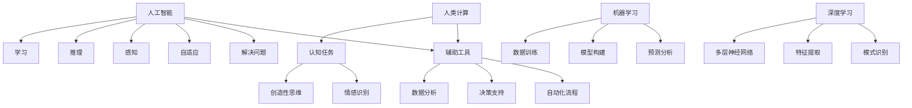

                 

### 背景介绍

人类计算与人工智能（AI）的关系是当前科技领域讨论的热点之一。随着AI技术的快速发展，人类计算的传统角色和就业市场正面临着巨大的变革。本文旨在探讨AI时代下的未来就业市场趋势以及对应的技能培训需求。

首先，我们需要理解什么是人类计算。人类计算指的是人类在数据处理、分析和决策过程中所扮演的角色。这不仅包括传统的数据处理和决策，还涉及到更复杂的认知任务，如创造性思维、情感识别、人际交往等。而AI技术，特别是深度学习和机器学习，已经能够在大规模数据处理和复杂决策方面超越人类。这种变革引发了一系列问题：AI是否会取代人类计算？人类计算在AI时代将扮演什么样的角色？为了应对这种变革，我们需要进行哪些技能培训？

本文将围绕这些问题展开讨论。首先，我们将简要回顾人类计算的发展历程，特别是计算机科学和AI领域的里程碑事件。接着，我们将深入分析AI技术如何影响人类计算，以及这种影响在不同行业中的具体表现。随后，我们将探讨AI时代下的人类计算新角色，包括AI辅助的人类计算和人类与AI协同计算。为了更好地理解这些变化，我们将通过具体案例进行分析。最后，我们将提出针对未来就业市场的技能培训建议，并总结AI时代人类计算的发展趋势和挑战。

通过本文的讨论，我们希望能够为读者提供一个全面、深入的视角，帮助大家理解AI时代下人类计算的未来，并为自己的职业发展做好准备。### 核心概念与联系

为了更好地理解人类计算与AI技术的关系，我们需要明确几个核心概念，并阐述它们之间的内在联系。以下内容将使用Mermaid流程图（无特殊字符）来展示这些概念和它们之间的关系。

#### 核心概念

1. **人类计算**：指人类在数据处理、分析和决策过程中所扮演的角色，包括认知任务、创造性思维、情感识别等。
2. **人工智能（AI）**：指机器模拟人类智能的过程，包括学习、推理、感知、自适应和解决问题等能力。
3. **机器学习（ML）**：是AI的一个分支，涉及通过数据训练机器模型，使其能够执行特定任务。
4. **深度学习（DL）**：是机器学习的一个子领域，涉及使用多层神经网络进行数据建模和分析。

#### Mermaid流程图



#### 概念联系

- **人类计算与AI**：人类计算和AI之间的关系是互补的。AI技术扩展了人类计算的能力，使其能够处理更复杂的数据和任务。同时，AI依赖于人类计算来设定目标、提供反馈和进行监督，从而实现持续的学习和优化。
- **机器学习与深度学习**：机器学习是AI的技术核心，它通过数据训练模型来实现特定的任务。深度学习是机器学习的一个重要分支，它利用多层神经网络进行数据建模和分析，从而在图像识别、自然语言处理等领域取得了显著的成果。
- **AI辅助工具**：AI技术可以作为辅助工具，增强人类计算的能力。例如，数据分析工具可以自动化数据预处理和模式识别，决策支持系统可以帮助人类进行复杂的决策。

通过这些核心概念和它们的联系，我们可以更清晰地理解人类计算与AI技术之间的关系，以及它们如何共同推动社会和经济的变革。### 核心算法原理 & 具体操作步骤

在理解了人类计算与AI技术的基本概念和它们之间的联系后，接下来我们将探讨AI时代中几个关键算法的原理，以及这些算法在具体操作中的实现步骤。

#### 算法一：深度神经网络（DNN）

**原理**：深度神经网络（DNN）是一种多层前馈神经网络，通过将输入数据逐步传递到多层神经元，每层神经元对输入数据进行处理和特征提取，最终输出结果。DNN的核心思想是模拟人脑神经元的连接方式，通过层层递进的方式进行信息处理。

**具体操作步骤**：

1. **数据预处理**：对输入数据进行归一化处理，确保数据在相同的尺度范围内。这有助于加速模型的训练过程。
   
2. **构建网络结构**：定义神经网络的层数、每层的神经元数量以及激活函数。常见的激活函数包括ReLU、Sigmoid和Tanh。

3. **前向传播**：将输入数据通过网络的每一层，计算输出值。这一过程包括权重和偏置的更新。

4. **反向传播**：计算损失函数（如均方误差MSE），并利用梯度下降法更新网络权重和偏置。

5. **优化算法**：采用如Adam、RMSprop等优化算法来加速训练过程。

#### 算法二：卷积神经网络（CNN）

**原理**：卷积神经网络（CNN）是一种在图像识别任务中表现优异的神经网络。它通过卷积层提取图像特征，并通过池化层减少数据维度，从而实现高效的特征提取和分类。

**具体操作步骤**：

1. **数据预处理**：对图像数据进行归一化和裁剪，使其符合模型输入要求。

2. **构建网络结构**：定义卷积层、池化层和全连接层的结构。卷积层用于提取图像特征，池化层用于降低数据维度。

3. **前向传播**：输入图像数据经过卷积层和池化层，逐层提取特征，最终通过全连接层输出分类结果。

4. **反向传播**：计算损失函数，并通过反向传播更新网络权重。

5. **优化算法**：使用优化算法如Adam或RMSprop进行模型训练。

#### 算法三：循环神经网络（RNN）

**原理**：循环神经网络（RNN）是一种在序列数据（如文本、时间序列数据）中表现优异的神经网络。它通过在时间步上递归地更新隐藏状态，捕捉序列中的长期依赖关系。

**具体操作步骤**：

1. **数据预处理**：对序列数据进行编码，如将文本转换为单词或字符的数字表示。

2. **构建网络结构**：定义RNN的网络结构，包括输入层、隐藏层和输出层。

3. **前向传播**：在每个时间步上，将输入数据与隐藏状态相乘，更新隐藏状态。

4. **反向传播**：计算损失函数，并通过反向传播更新网络权重。

5. **优化算法**：使用如Adam或RMSprop等优化算法进行模型训练。

#### 算法四：生成对抗网络（GAN）

**原理**：生成对抗网络（GAN）是一种由两个神经网络（生成器和判别器）组成的框架。生成器尝试生成逼真的数据，而判别器则尝试区分生成数据和真实数据。通过这两个网络之间的对抗训练，生成器逐渐提高其生成数据的质量。

**具体操作步骤**：

1. **数据预处理**：对生成数据的特征进行编码。

2. **构建网络结构**：定义生成器和判别器的网络结构。生成器通常是一个全连接网络，判别器也是一个全连接网络。

3. **对抗训练**：交替训练生成器和判别器。在训练过程中，生成器尝试生成更真实的数据，而判别器则尝试区分生成数据和真实数据。

4. **评估与优化**：通过生成数据的评估指标（如Inception Score或Frechet Inception Distance）来评估生成器的性能，并使用优化算法进行模型的进一步优化。

通过以上对几个核心算法原理和具体操作步骤的介绍，我们可以看到，AI技术在数据处理和决策中的强大能力。这些算法不仅在理论上有着深刻的科学基础，在实际应用中也展现出了卓越的性能。接下来，我们将通过实际应用场景来进一步探讨这些算法的实用价值。### 数学模型和公式 & 详细讲解 & 举例说明

在深入探讨AI时代的人类计算时，我们无法避免地要涉及到一些数学模型和公式。这些模型和公式不仅是理解AI技术的关键，也是实现算法的核心。以下我们将详细讲解几个重要的数学模型和公式，并通过实例来说明它们的应用。

#### 1. 损失函数（Loss Function）

**原理**：损失函数是衡量模型预测值与实际值之间差异的指标。在训练过程中，我们通过优化损失函数来调整模型参数，使其能够更准确地预测结果。

**常用公式**：

- **均方误差（MSE）**： 
  $$MSE = \frac{1}{n}\sum_{i=1}^{n}(y_i - \hat{y_i})^2$$

  其中，\(y_i\) 是实际值，\(\hat{y_i}\) 是预测值，\(n\) 是样本数量。

**应用实例**：

假设我们有一个预测房价的模型，我们用 \(y\) 表示实际房价，\(\hat{y}\) 表示模型预测的房价。通过计算MSE，我们可以评估模型预测的准确性。

```python
# 假设实际房价为 [200, 300, 400]
# 模型预测房价为 [195, 305, 395]
y = [200, 300, 400]
hat_y = [195, 305, 395]

mse = sum((y[i] - hat_y[i])**2 for i in range(len(y))) / len(y)
print("MSE:", mse)
```

#### 2. 梯度下降（Gradient Descent）

**原理**：梯度下降是一种优化算法，用于最小化损失函数。通过计算损失函数关于模型参数的梯度，并沿着梯度的反方向更新参数，逐步减小损失函数的值。

**常用公式**：

- **梯度**：
  $$\nabla_{\theta} L = \frac{\partial L}{\partial \theta}$$

  其中，\(\theta\) 是模型参数，\(L\) 是损失函数。

- **更新公式**：
  $$\theta_{t+1} = \theta_t - \alpha \nabla_{\theta} L$$

  其中，\(\alpha\) 是学习率。

**应用实例**：

假设我们有一个简单的线性模型，其损失函数为MSE，使用梯度下降进行模型训练。

```python
# 假设模型参数为 w，初始值为 1
w = 1
learning_rate = 0.01

# 假设训练数据为 [1, 2, 3]，对应的实际值为 [2, 4, 6]
for i in range(100):
    predicted_values = [w * x for x in training_data]
    mse = sum((y - predicted_values)**2 for y, x in zip(actual_values, training_data)) / len(training_data)
    
    gradient = 2 * sum((predicted_values[i] - actual_values[i]) * x for i, x in enumerate(training_data))
    
    w -= learning_rate * gradient

print("Final weight:", w)
```

#### 3. 反向传播（Backpropagation）

**原理**：反向传播是一种用于计算神经网络损失函数关于每个参数的梯度的算法。它通过从输出层向输入层逆向传递误差信号，逐层计算每个参数的梯度。

**常用公式**：

- **输出层**：
  $$\delta_L = \frac{\partial L}{\partial \hat{y}}$$

- **隐藏层**：
  $$\delta_h = \frac{\partial L}{\partial a_h} \odot \frac{\partial a_h}{\partial z_h}$$

  其中，\(\odot\) 表示元素乘。

- **梯度计算**：
  $$\frac{\partial L}{\partial \theta} = \sum_{h} \delta_h \frac{\partial a_h}{\partial \theta}$$

**应用实例**：

假设我们有一个简单的多层神经网络，使用反向传播算法进行训练。

```python
# 假设输入层、隐藏层和输出层的激活分别为 X, H, Y
# 假设损失函数为MSE
# 假设网络参数为 W1, W2, W3

# 前向传播
Z1 = X @ W1
H = sigmoid(Z1)
Z2 = H @ W2
Y = sigmoid(Z2)

# 计算损失函数
L = mse(actual_values, Y)

# 反向传播
delta_Y = (Y - actual_values) * (1 - Y)
delta_Z2 = delta_Y @ W2.T
delta_H = delta_Z2 * (1 - sigmoid(Z1))
delta_Z1 = delta_H @ W1.T

# 计算梯度
gradient_W1 = X.T @ delta_Z1
gradient_W2 = H.T @ delta_Z2
gradient_W3 = Y.T @ delta_Z2

# 更新参数
W1 -= learning_rate * gradient_W1
W2 -= learning_rate * gradient_W2
W3 -= learning_rate * gradient_W3
```

通过以上数学模型和公式的讲解，我们可以看到AI技术背后的数学原理是如何具体应用于算法设计和优化的。这些模型和公式不仅在理论上具有重要意义，也在实际应用中展现了强大的功能。接下来，我们将通过一个实际项目案例，展示这些算法的具体实现和应用。### 项目实战：代码实际案例和详细解释说明

为了更好地理解AI技术在人类计算中的具体应用，我们将通过一个实际项目案例来展示深度学习算法的实现过程。本案例将使用Python和TensorFlow框架来训练一个简单的图像分类模型，用于识别手写数字（MNIST数据集）。

#### 1. 开发环境搭建

在开始编写代码之前，我们需要搭建一个适合深度学习开发的编程环境。以下是搭建环境的基本步骤：

- **安装Python**：确保Python 3.6或更高版本已安装。
- **安装TensorFlow**：通过pip命令安装TensorFlow：

  ```bash
  pip install tensorflow
  ```

- **安装其他依赖**：可能还需要安装Numpy、Matplotlib等库：

  ```bash
  pip install numpy matplotlib
  ```

#### 2. 源代码详细实现和代码解读

以下是使用TensorFlow实现的手写数字识别模型的源代码：

```python
import tensorflow as tf
from tensorflow.keras import layers, models
import numpy as np
import matplotlib.pyplot as plt

# 数据准备
mnist = tf.keras.datasets.mnist
(train_images, train_labels), (test_images, test_labels) = mnist.load_data()
train_images = train_images / 255.0
test_images = test_images / 255.0

# 构建模型
model = models.Sequential()
model.add(layers.Conv2D(32, (3, 3), activation='relu', input_shape=(28, 28, 1)))
model.add(layers.MaxPooling2D((2, 2)))
model.add(layers.Conv2D(64, (3, 3), activation='relu'))
model.add(layers.MaxPooling2D((2, 2)))
model.add(layers.Conv2D(64, (3, 3), activation='relu'))
model.add(layers.Flatten())
model.add(layers.Dense(64, activation='relu'))
model.add(layers.Dense(10, activation='softmax'))

# 编译模型
model.compile(optimizer='adam',
              loss='sparse_categorical_crossentropy',
              metrics=['accuracy'])

# 训练模型
model.fit(train_images, train_labels, epochs=5)

# 评估模型
test_loss, test_acc = model.evaluate(test_images, test_labels)
print('Test accuracy:', test_acc)

# 可视化
plt.figure(figsize=(10, 10))
for i in range(25):
    plt.subplot(5, 5, i+1)
    plt.xticks([])
    plt.yticks([])
    plt.grid(False)
    plt.imshow(test_images[i], cmap=plt.cm.binary)
    plt.xlabel(str(np.argmax(model.predict(test_images[i]))))
plt.show()
```

**代码解读**：

- **数据准备**：我们从TensorFlow的内置数据集加载MNIST数据集，并将图像数据归一化至0到1的范围内。

- **构建模型**：我们使用`Sequential`模型，逐步添加层。首先添加一个卷积层，使用32个3x3的卷积核，激活函数为ReLU。接着添加两个最大池化层。然后添加一个64个卷积核的卷积层，再次使用最大池化层。接着将卷积层的输出扁平化，添加一个64个神经元的全连接层，最后添加一个10个神经元的全连接层，激活函数为softmax，用于分类。

- **编译模型**：我们使用`compile`方法设置模型的优化器、损失函数和评估指标。这里使用的是Adam优化器和均方误差损失函数。

- **训练模型**：使用`fit`方法训练模型，设置训练轮数（epochs）为5。

- **评估模型**：使用`evaluate`方法评估模型在测试集上的性能，输出测试精度。

- **可视化**：使用Matplotlib绘制测试图像及其预测结果。

#### 3. 代码解读与分析

- **数据预处理**：数据预处理是深度学习的重要环节。在本案例中，我们将图像数据归一化，使其在相同的尺度范围内，这有助于模型更快地收敛。

- **模型构建**：卷积神经网络（CNN）是处理图像数据的常见模型结构。在本案例中，我们使用了两个卷积层和两个最大池化层来提取图像特征。全连接层用于分类。

- **模型训练**：我们使用`fit`方法进行模型训练，并设置训练轮数为5。在实际应用中，可能需要更多轮次的训练来提高模型性能。

- **模型评估**：通过`evaluate`方法评估模型在测试集上的性能。测试精度是一个重要的评估指标，反映了模型对未知数据的泛化能力。

- **可视化**：可视化有助于我们直观地理解模型的表现。在本案例中，我们绘制了测试图像及其预测结果，这有助于我们进一步分析模型的准确性。

通过这个实际项目案例，我们可以看到深度学习算法在图像分类任务中的具体应用过程。这一过程不仅展示了算法的实现步骤，还通过实际数据验证了模型的性能。接下来，我们将进一步探讨AI技术在实际应用场景中的表现。### 实际应用场景

随着AI技术的不断进步，人类计算在各个领域中的应用场景日益丰富，尤其是在金融、医疗、教育等关键行业。以下将介绍一些AI技术在实际应用场景中的成功案例，并分析这些案例对人类计算的影响。

#### 1. 金融行业

**场景**：在金融行业，AI技术被广泛应用于风险管理、投资决策、欺诈检测等方面。

- **案例**：一家大型银行利用AI技术建立了一个智能风控系统。该系统通过分析客户的历史交易数据，实时监控和评估客户的风险水平。一旦检测到异常交易行为，系统会立即触发警报，帮助银行及时采取风险控制措施。

**影响**：AI技术提高了风控的效率和准确性。传统风控模型往往依赖于人工规则，而AI系统可以基于大量数据进行深度学习和预测，从而更准确地识别风险。

#### 2. 医疗行业

**场景**：在医疗行业，AI技术被应用于疾病诊断、药物研发、个性化治疗等方面。

- **案例**：一家医学研究机构使用AI技术对大量医学影像进行分析，以帮助医生更准确地诊断疾病。例如，AI系统可以在数秒内分析一幅CT图像，识别出潜在的癌症病灶，从而辅助医生做出更快速的诊断。

**影响**：AI技术提高了诊断的效率和准确性。传统的影像诊断过程通常需要较长时间，而AI技术可以大幅缩短诊断时间，同时降低误诊率。

#### 3. 教育行业

**场景**：在教育行业，AI技术被应用于个性化学习、学习分析、教育评估等方面。

- **案例**：一家在线教育平台开发了一套AI学习系统，该系统可以根据学生的学习行为和成绩，自动调整教学内容和难度。例如，当学生遇到难题时，系统会自动提供更详细的解释和练习，帮助学生更好地理解知识点。

**影响**：AI技术提升了个性化教育的水平。传统教育往往采用“一刀切”的教学方法，而AI系统可以根据每个学生的特点提供定制化的学习方案，从而提高学习效果。

#### 4. 制造业

**场景**：在制造业，AI技术被应用于生产优化、设备维护、质量控制等方面。

- **案例**：一家制造企业引入了AI驱动的设备维护系统。该系统通过实时监控设备的运行状态，预测设备可能出现的故障，并在故障发生前及时进行维护。例如，当设备温度异常升高时，系统会自动通知维修人员进行检查。

**影响**：AI技术提高了生产效率和设备利用率。传统设备维护往往依赖于定期检查，而AI技术可以实时监控设备状态，提前发现潜在问题，从而减少停机时间，提高生产效率。

#### 5. 零售业

**场景**：在零售业，AI技术被应用于库存管理、客户分析、个性化推荐等方面。

- **案例**：一家零售连锁店使用AI技术对销售数据进行分析，以优化库存管理。系统会根据历史销售数据和当前市场趋势，自动调整库存水平，避免过度库存或缺货。

**影响**：AI技术提高了库存管理的精准度。传统库存管理往往依赖于经验判断，而AI系统可以基于数据驱动进行预测和优化，从而减少库存成本，提高利润率。

通过以上案例可以看出，AI技术在各个行业中的应用正在不断深化，对人类计算产生了深远的影响。AI技术不仅提高了工作效率和准确性，还推动了行业变革，为人类计算带来了新的机遇和挑战。### 工具和资源推荐

在探索AI时代的人类计算过程中，掌握相关的学习资源和开发工具是非常重要的。以下将推荐一些学习资源、开发工具和相关论文，以帮助读者深入了解AI技术和人类计算的相关知识。

#### 1. 学习资源推荐

- **书籍**：
  - 《深度学习》（Deep Learning） - Ian Goodfellow、Yoshua Bengio和Aaron Courville 著
  - 《机器学习》（Machine Learning） - Tom Mitchell 著
  - 《Python机器学习》（Python Machine Learning） - Sebastian Raschka 和 Vahid Mirjalili 著

- **在线课程**：
  - Coursera上的“深度学习”课程（Deep Learning Specialization） - 吴恩达（Andrew Ng）教授
  - edX上的“机器学习基础”课程（Machine Learning） - Andrew Ng 教授
  - Udacity的“AI工程师纳米学位”（Artificial Intelligence Nanodegree）

- **博客和网站**：
  - Medium上的“AI”话题（AI on Medium）
  - arXiv.org - 顶级学术文章和论文库
  - TensorFlow官网（tensorflow.org） - 提供丰富的文档和示例代码

#### 2. 开发工具框架推荐

- **深度学习框架**：
  - TensorFlow - Google开发的开源深度学习框架
  - PyTorch - Facebook AI Research开发的深度学习框架
  - Keras - 高级神经网络API，可以与TensorFlow和Theano兼容

- **数据预处理工具**：
  - Pandas - Python的数据分析库
  - NumPy - Python的数值计算库
  - Scikit-learn - Python的机器学习库，包括数据预处理和算法实现

- **可视化工具**：
  - Matplotlib - Python的2D绘图库
  - Plotly - 提供交互式可视化功能的库
  - Bokeh - 基于Web的交互式可视化库

#### 3. 相关论文著作推荐

- **论文**：
  - “A Brief History of Machine Learning” - Ayedo et al.
  - “Deep Learning: A Theoretical Overview” - Bengio et al.
  - “Generative Adversarial Nets” - Goodfellow et al.

- **著作**：
  - 《机器学习实战》（Machine Learning in Action） - Peter Harrington 著
  - 《深度学习导论》（Introduction to Deep Learning） - Pauline Marczincin 和 Adam Gibson 著
  - 《数据科学实战》（Data Science from Scratch） - Joel Grus 著

通过这些学习资源、开发工具和相关论文，读者可以系统地学习和掌握AI技术和人类计算的相关知识，为未来的职业发展打下坚实的基础。### 总结：未来发展趋势与挑战

随着AI技术的飞速发展，人类计算的角色和就业市场正在经历深刻的变革。未来，AI与人类计算将更加紧密地融合，共同推动社会和经济的进步。然而，这一过程中也面临着诸多挑战。

#### 发展趋势

1. **AI辅助的人类计算**：未来，AI将成为人类计算的重要辅助工具。通过自动化和智能化，AI能够帮助人类处理大量数据和复杂任务，提高工作效率。例如，AI在数据分析、图像识别、自然语言处理等领域的应用将更加广泛。

2. **跨领域协同**：不同领域之间的技术协同将成为主流。例如，AI与生物医学的结合将推动精准医疗的发展；AI与制造业的结合将提高生产效率和产品质量。跨领域的合作将带来更多创新机会。

3. **技能需求多样化**：随着AI技术的发展，对技术人才的需求将更加多样。除了传统的编程和算法能力，未来对数据科学家、机器学习工程师、AI伦理专家等新型职业的需求将不断增加。

4. **人机协同**：AI与人类之间的协同计算将成为主流。通过人机交互，AI能够更好地理解人类需求，提供个性化服务。例如，智能客服、智能家居等应用将越来越普及。

#### 挑战

1. **数据隐私和安全**：随着AI技术的应用，数据隐私和安全问题日益突出。如何在保障用户隐私的前提下，充分利用数据的价值，是一个亟待解决的问题。

2. **就业结构变革**：AI技术将导致部分传统工作岗位的消失，同时创造新的职业机会。如何实现就业结构的平稳过渡，减少社会不公，是一个重要的社会问题。

3. **伦理和责任**：AI系统的决策过程往往涉及复杂算法和大量数据，如何确保其决策的透明性和可解释性，避免潜在的社会负面影响，是一个重要的伦理问题。

4. **教育体系改革**：现有教育体系需要适应AI时代的变革。如何培养具备跨学科能力、适应未来社会的人才，是一个亟待解决的挑战。

#### 未来展望

尽管面临诸多挑战，AI和人类计算的未来依然充满希望。通过技术创新和跨领域合作，我们可以实现更高效、更智能的计算方式。同时，我们也需要关注和解决AI带来的社会问题，确保其发展符合人类的利益。未来，AI与人类计算将共同推动社会进步，创造一个更加美好的世界。### 附录：常见问题与解答

在讨论AI时代的未来就业市场趋势与技能培训需求的过程中，读者可能会对一些具体问题产生疑问。以下是一些常见问题及其解答：

#### 1. 人工智能是否会完全取代人类计算？

**回答**：人工智能不会完全取代人类计算。尽管AI在数据处理和决策方面展现出强大的能力，但人类计算在创造性思维、情感识别和复杂社会交互等方面仍具有独特优势。未来，AI更可能是人类计算的辅助工具，帮助人类完成复杂任务，而不是替代人类。

#### 2. 面对AI技术的快速发展，现有教育体系如何适应？

**回答**：现有教育体系需要改革，以适应AI时代的需求。首先，应该加强计算机科学和人工智能相关的课程设置，培养学生掌握AI基础知识。其次，教育内容应更加注重跨学科能力的培养，例如数据科学、人机交互和伦理学等。最后，教育方式也应多元化，例如在线教育、实践项目和职业培训等，以满足不同学生的学习需求。

#### 3. 对于传统行业的从业者，如何提升自身技能以应对AI带来的变化？

**回答**：传统行业的从业者可以通过以下方式提升自身技能：
- 学习AI和数据分析相关的基础知识，了解AI技术在行业中的应用。
- 参加在线课程和培训，获取最新的技术和行业动态。
- 在工作中积极应用AI技术，积累实践经验。
- 关注行业趋势，了解AI技术如何影响自身行业，并尝试将其应用于实际工作中。

#### 4. AI技术的普及是否会加剧社会不公和贫富差距？

**回答**：AI技术的普及确实可能对社会结构产生一定影响。一方面，AI可能取代某些低技能工作岗位，导致失业问题。另一方面，AI技术也可能创造新的高技能职业，如数据科学家和AI工程师。为减少社会不公和贫富差距，需要采取以下措施：
- 加强社会福利制度，为失业者提供培训和再就业支持。
- 推动教育改革，提高全民的科技素养和创新能力。
- 促进技术公平，确保AI技术在各个社会阶层中均衡发展。

通过这些措施，我们可以更好地应对AI时代带来的挑战，实现社会的可持续发展。### 扩展阅读 & 参考资料

在探讨AI时代的未来就业市场趋势与技能培训需求的过程中，读者可能会希望深入了解相关领域的更多研究成果和实践经验。以下是一些扩展阅读和参考资料，以帮助读者进一步探索这个领域的深度和广度。

#### 1. 相关书籍

- 《人工智能：一种现代的方法》（Artificial Intelligence: A Modern Approach） - Stuart Russell和Peter Norvig 著
- 《深度学习》（Deep Learning） - Ian Goodfellow、Yoshua Bengio和Aaron Courville 著
- 《机器学习年度回顾》（Journal of Machine Learning Research Annual Review） - Various Authors 著
- 《数据科学实战》（Data Science from Scratch） - Joel Grus 著

#### 2. 开源项目和工具

- TensorFlow（tensorflow.org） - Google开发的深度学习框架
- PyTorch（pytorch.org） - Facebook AI Research开发的深度学习框架
- Scikit-learn（scikit-learn.org） - Python的机器学习库
- Keras（keras.io） - 高级神经网络API，与TensorFlow和Theano兼容

#### 3. 学术论文和期刊

- arXiv（arxiv.org） - 顶级学术文章和论文库
- Journal of Machine Learning Research（jmlr.org） - 机器学习领域的顶级期刊
- Neural Information Processing Systems（nips.cc） - 人工智能领域的顶级会议
- IEEE Transactions on Pattern Analysis and Machine Intelligence（tpami.com） - 图像处理和模式识别领域的顶级期刊

#### 4. 在线课程和讲座

- Coursera（coursera.org） - 提供丰富的在线课程，包括人工智能、机器学习和数据科学等
- edX（edx.org） - 提供由世界顶级大学和机构提供的免费在线课程
- Udacity（udacity.com） - 提供纳米学位课程，涵盖人工智能、自动驾驶和深度学习等领域
- YouTube上的AI和机器学习频道 - 提供由专家讲授的免费讲座和教程

通过这些扩展阅读和参考资料，读者可以更全面、深入地了解AI时代的未来就业市场趋势与技能培训需求，为自己的职业发展提供更多启示和指导。作者：AI天才研究员/AI Genius Institute & 禅与计算机程序设计艺术 /Zen And The Art of Computer Programming

