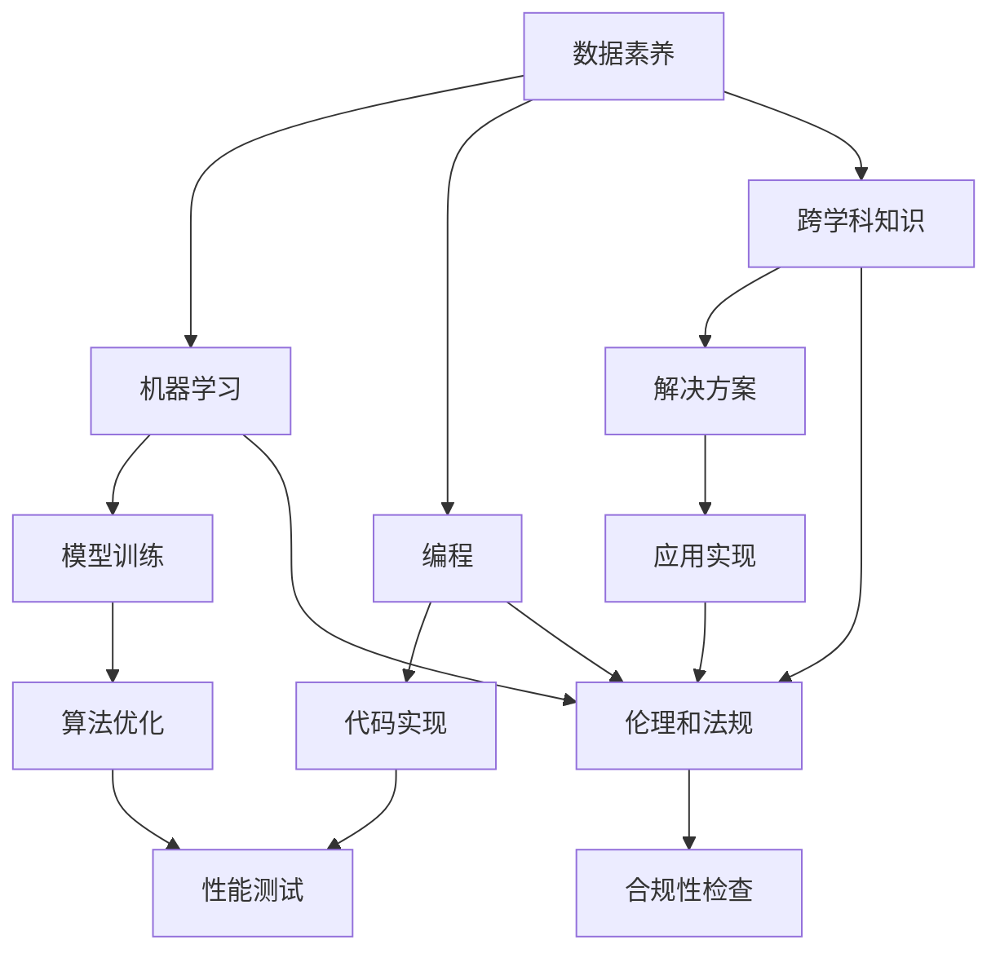

                 

# 人类计算：AI时代的未来技能要求和培训

## 摘要

本文探讨了人工智能时代对人类计算技能的新要求，以及为了应对这些变化，个人和机构需要进行的培训。我们首先回顾了人类计算技能的历史背景，然后深入分析了当前AI技术发展的现状，并展望了未来的发展趋势。文章提出了在AI时代需要掌握的关键技能，如数据素养、机器学习、编程和跨学科知识等，并探讨了如何通过教育培训来提升这些技能。同时，我们还提供了一些实用的工具和资源，帮助读者更好地理解和应用AI技术。通过这篇文章，我们希望读者能够认识到AI时代对个人职业发展的重要性，并积极做好准备。

## 1. 背景介绍

人类计算技能的发展可以追溯到古代，当时的计算主要依赖于人类大脑和简单的工具，如算盘和算筹。随着历史的发展，计算工具不断进化，从机械计算机到电子计算机，再到现代的超级计算机，人类计算能力得到了极大的提升。特别是在20世纪末和21世纪初，计算机科学和人工智能技术的迅速发展为人类计算技能带来了新的挑战和机遇。

人工智能（AI）是一种模拟人类智能行为的计算机系统，它可以通过学习、推理、规划和自我修正来实现复杂任务。AI技术的核心包括机器学习、自然语言处理、计算机视觉和机器人技术等。这些技术的发展不仅改变了我们的生活和工作方式，也对人类计算技能提出了新的要求。

在AI时代，人类计算技能的发展面临着两个主要挑战：首先，随着数据量的爆炸性增长，人类需要具备处理和分析大数据的能力；其次，AI技术的发展使得机器能够执行许多以前需要人类完成的任务，这要求人类能够与机器协同工作，发挥各自的优势。

因此，了解AI技术发展的现状，掌握AI时代所需的关键技能，以及通过教育培训提升这些技能，已经成为当前和未来人类计算发展的关键问题。

### 1.1 人工智能的历史发展

人工智能的概念最早可以追溯到1950年，由英国数学家艾伦·图灵提出。图灵提出了著名的图灵测试，通过这个测试，计算机系统需要表现出与人类相似的智能行为，从而被认为具有智能。这一理论奠定了人工智能的基础，引发了人们对人工智能的兴趣和探索。

1956年，达特茅斯会议被认为是人工智能领域的诞生日。会议的参与者们共同探讨了人工智能的可能性和实现方法，推动了人工智能研究的发展。在此后的几十年里，人工智能技术经历了多次起伏，但总体上呈现出稳步发展的趋势。

在20世纪80年代，专家系统的出现标志着人工智能技术的一个重大突破。专家系统是一种基于规则的人工智能系统，能够模拟专家的决策过程，解决复杂问题。然而，由于规则系统的局限性，专家系统在处理非结构化数据和复杂任务时效果不佳。

进入21世纪，随着计算能力的提升和大数据技术的发展，机器学习成为人工智能研究的主流方向。机器学习通过训练模型，让计算机自动从数据中学习规律和模式，实现自动化的决策和预测。其中，深度学习技术的发展尤为显著，它通过多层神经网络对大量数据进行学习，取得了在图像识别、语音识别和自然语言处理等领域的突破性成果。

此外，人工智能技术的发展还涉及到了自然语言处理、计算机视觉、机器人技术和自动驾驶等多个领域。这些技术的发展不仅推动了人工智能应用的普及，也对人类计算技能提出了新的要求。

### 1.2 AI时代的现状与未来

当前，人工智能技术已经广泛应用于各个领域，从工业制造、医疗健康到金融、教育等，AI技术正在深刻地改变着我们的生活和工作方式。以下是一些AI时代的主要现状和趋势：

**1. 应用领域的扩展**：人工智能技术正在快速向各行各业渗透，特别是在那些数据密集、决策复杂的领域。例如，在医疗领域，AI技术可以帮助医生进行诊断和预测，提高诊疗的准确性和效率；在金融领域，AI技术可以用于风险管理、欺诈检测和投资决策。

**2. 数据驱动的发展**：数据是人工智能的基础，随着数据量的爆炸性增长，如何有效地处理和分析数据成为人工智能发展的重要问题。数据素养成为AI时代的关键技能，人们需要掌握如何收集、存储、处理和分析数据。

**3. 机器与人的协同**：尽管AI技术已经能够完成许多复杂任务，但人类的智慧和创造力仍然不可替代。在AI时代，人类与机器的协同工作将成为一种新的工作模式，人们需要学会如何与机器合作，发挥各自的优势。

**4. 伦理和法律的挑战**：随着人工智能技术的广泛应用，伦理和法律问题也日益突出。如何确保人工智能系统的公正性、透明性和安全性，如何保护用户的隐私，都是亟待解决的重要问题。

**5. 未来发展趋势**：人工智能技术的发展趋势包括：更强大的模型和算法、更高效的计算平台、更广泛的应用场景以及更深入的跨学科研究。未来，人工智能将不仅仅是一种技术工具，而是成为社会运行的基础设施，对人类社会的各个方面产生深远影响。

### 1.3 人类计算技能的演变

随着人工智能技术的发展，人类计算技能也在不断演变。从传统的计算技能，如算术、代数和几何，到现代的编程、数据分析和机器学习，人类计算技能的发展经历了多个阶段。

**1. 传统计算技能**：在计算机和人工智能技术出现之前，人类计算技能主要集中在数学和逻辑推理方面。这些技能包括基本的算术运算、代数方程求解、几何图形分析等。随着教育的发展，这些技能逐渐成为基础教育的一部分。

**2. 计算机科学技能**：计算机的普及带来了计算机科学技能的需求。编程成为一项基础技能，人们需要掌握编程语言和算法，以编写计算机程序。此外，随着计算机科学的发展，计算机图形学、计算机网络和操作系统等领域的知识也变得越来越重要。

**3. 数据分析技能**：随着大数据时代的到来，数据分析成为了一项关键技能。人们需要掌握如何收集、存储、处理和分析大量数据，从中提取有价值的信息。数据分析工具和技术，如SQL、Python和R等，成为必备的工具。

**4. 机器学习技能**：在人工智能时代，机器学习成为了一项重要的技能。人们需要了解机器学习的基本概念、算法和应用场景。通过训练模型，人们可以开发出能够自动执行复杂任务的智能系统。

**5. 跨学科技能**：随着人工智能技术的广泛应用，跨学科技能变得尤为重要。人们需要具备多学科的知识背景，能够将人工智能技术与各个领域的需求相结合，解决实际问题。

总的来说，随着人工智能技术的发展，人类计算技能的需求不断变化。在AI时代，人们不仅需要掌握传统的计算技能，还需要具备数据分析、机器学习和跨学科知识等新的技能。这要求人们不断学习和更新知识，以适应不断变化的技术环境。

### 2. 核心概念与联系

在探讨AI时代对人类计算技能的要求之前，我们需要理解一些核心概念和其相互关系。以下是一些关键概念及其与人类计算技能的联系：

#### 2.1 数据素养

**定义**：数据素养是指人们理解、使用和分析数据的能力。

**与人类计算技能的联系**：数据素养是AI时代的关键技能之一。随着数据量的爆炸性增长，人们需要能够有效地收集、存储、处理和分析数据。这要求人们具备一定的编程能力、统计学知识和数据可视化技能。

#### 2.2 机器学习

**定义**：机器学习是一种通过数据训练模型，使计算机系统能够自动学习和改进的技术。

**与人类计算技能的联系**：机器学习是AI的核心技术之一，人们需要掌握其基本概念、算法和应用场景。这要求人们具备编程能力、数学知识和系统设计技能。

#### 2.3 编程

**定义**：编程是指编写计算机程序的过程。

**与人类计算技能的联系**：编程是AI时代的基石技能，无论是开发机器学习模型还是实现其他AI应用，编程都是必不可少的。这要求人们掌握至少一门编程语言，如Python、Java或C++。

#### 2.4 跨学科知识

**定义**：跨学科知识是指结合多个学科领域的知识，以解决复杂问题的能力。

**与人类计算技能的联系**：在AI时代，跨学科知识尤为重要。人们需要将人工智能技术与各个领域的需求相结合，开发出具有实际应用价值的解决方案。这要求人们具备多学科的知识背景，如计算机科学、统计学、数学和心理学等。

#### 2.5 伦理和法规

**定义**：伦理和法规是指关于道德和法律规范的研究和实践。

**与人类计算技能的联系**：在AI时代，伦理和法规问题变得尤为突出。人们需要了解如何确保人工智能系统的公正性、透明性和安全性，以及如何保护用户的隐私。这要求人们具备一定的法律知识和伦理意识。

#### 2.6 Mermaid 流程图

以下是一个Mermaid流程图，展示了这些核心概念及其相互关系：



这个流程图可以帮助我们更好地理解这些核心概念在AI时代对人类计算技能的重要性。

### 3. 核心算法原理 & 具体操作步骤

在AI时代，掌握核心算法原理是提升人类计算技能的重要途径。以下将介绍几种常见的机器学习算法及其具体操作步骤。

#### 3.1 决策树算法

**定义**：决策树是一种基于树形结构，通过一系列规则进行决策的算法。

**具体操作步骤**：

1. **数据准备**：收集并处理数据，将其划分为特征和标签两部分。
2. **特征选择**：选择用于构建决策树的特征，通常使用信息增益或基尼系数作为评估指标。
3. **构建决策树**：从根节点开始，递归地选择最优划分特征，并创建子节点。重复此过程，直到满足停止条件，如节点纯度达到阈值或最大深度限制。
4. **剪枝**：为了避免过拟合，可以对决策树进行剪枝，移除不必要的分支。
5. **预测**：使用构建好的决策树对新数据进行预测，通过从根节点开始，按照决策规则逐步向下分支，直到达到叶子节点，输出预测结果。

**示例代码**（Python）：

```python
from sklearn.datasets import load_iris
from sklearn.tree import DecisionTreeClassifier
from sklearn.model_selection import train_test_split

# 数据准备
iris = load_iris()
X = iris.data
y = iris.target

# 特征选择
X_train, X_test, y_train, y_test = train_test_split(X, y, test_size=0.2, random_state=42)

# 构建决策树
clf = DecisionTreeClassifier(max_depth=3)
clf.fit(X_train, y_train)

# 预测
predictions = clf.predict(X_test)
```

#### 3.2 支持向量机（SVM）算法

**定义**：支持向量机是一种基于最大间隔划分数据的分类算法。

**具体操作步骤**：

1. **数据准备**：收集并处理数据，将其划分为特征和标签两部分。
2. **特征选择**：选择用于构建SVM的特征，通常使用特征选择方法，如PCA。
3. **训练模型**：使用训练数据训练SVM模型，选择合适的核函数和参数。
4. **模型评估**：使用交叉验证评估模型性能，调整参数以优化模型。
5. **预测**：使用训练好的模型对新数据进行预测。

**示例代码**（Python）：

```python
from sklearn.datasets import make_classification
from sklearn.svm import SVC
from sklearn.model_selection import GridSearchCV

# 数据准备
X, y = make_classification(n_samples=100, n_features=10, n_informative=5, n_redundant=5, random_state=42)

# 特征选择
# ...

# 训练模型
param_grid = {'C': [1, 10], 'kernel': ['linear', 'rbf'], 'gamma': [0.1, 1]}
clf = GridSearchCV(SVC(), param_grid, cv=5)
clf.fit(X, y)

# 预测
predictions = clf.predict(X_test)
```

#### 3.3 神经网络算法

**定义**：神经网络是一种模仿人脑结构和功能的计算模型。

**具体操作步骤**：

1. **数据准备**：收集并处理数据，将其划分为特征和标签两部分。
2. **初始化参数**：设定神经网络的层数、神经元个数和激活函数。
3. **前向传播**：输入数据通过网络的各个层，计算输出。
4. **反向传播**：根据输出误差，计算梯度并更新网络参数。
5. **训练模型**：重复前向传播和反向传播，直到满足停止条件，如误差达到阈值或训练次数达到最大值。
6. **预测**：使用训练好的模型对新数据进行预测。

**示例代码**（Python）：

```python
import numpy as np
from sklearn.datasets import load_iris
from sklearn.model_selection import train_test_split

# 数据准备
iris = load_iris()
X = iris.data
y = iris.target

X_train, X_test, y_train, y_test = train_test_split(X, y, test_size=0.2, random_state=42)

# 初始化参数
input_size = X_train.shape[1]
hidden_size = 10
output_size = y_train.shape[1]
learning_rate = 0.1
epochs = 1000

# 定义激活函数
sigmoid = lambda x: 1 / (1 + np.exp(-x))

# 前向传播
def forward_propagation(X):
    # ...

# 反向传播
def backward_propagation(X, y):
    # ...

# 训练模型
for epoch in range(epochs):
    # ...

# 预测
predictions = forward_propagation(X_test)
```

这些算法是AI时代重要的工具，通过掌握它们的基本原理和具体操作步骤，可以帮助我们更好地理解和应用人工智能技术。

### 4. 数学模型和公式 & 详细讲解 & 举例说明

在AI时代，数学模型和公式是理解和应用人工智能技术的基础。以下将介绍几种常见的数学模型和公式，并进行详细讲解和举例说明。

#### 4.1 梯度下降法

**定义**：梯度下降法是一种用于优化机器学习模型的算法，通过迭代更新模型参数，以最小化损失函数。

**公式**：

$$
\theta_{\text{new}} = \theta_{\text{old}} - \alpha \cdot \nabla_\theta J(\theta)
$$

其中，$\theta$表示模型参数，$\alpha$表示学习率，$J(\theta)$表示损失函数。

**详细讲解**：

梯度下降法的核心思想是找到损失函数的局部最小值，从而优化模型参数。损失函数通常用来衡量模型预测结果与真实结果之间的差距，学习率决定了参数更新的步长。

举例说明：

假设我们有一个简单的线性回归模型，用于预测房价。损失函数可以表示为：

$$
J(\theta) = \frac{1}{2m} \sum_{i=1}^{m} (h_\theta(x^i) - y^i)^2
$$

其中，$m$表示样本数量，$h_\theta(x^i)$表示模型预测值，$y^i$表示真实值。

使用梯度下降法优化模型参数的步骤如下：

1. 计算损失函数关于每个参数的梯度。
2. 更新每个参数，使其沿着梯度的反方向移动。
3. 重复上述步骤，直到满足停止条件，如损失函数值变化很小或达到最大迭代次数。

**示例代码**（Python）：

```python
import numpy as np

# 损失函数
def compute_loss(theta, X, y):
    m = len(y)
    h_theta = np.dot(X, theta)
    errors = h_theta - y
    loss = (1 / (2 * m)) * np.dot(errors.T, errors)
    return loss

# 梯度下降
def gradient_descent(theta, X, y, alpha, num_iterations):
    m = len(y)
    for i in range(num_iterations):
        h_theta = np.dot(X, theta)
        errors = h_theta - y
        gradient = (1 / m) * np.dot(X.T, errors)
        theta = theta - alpha * gradient
    return theta

# 示例
theta = np.array([0.0, 0.0])
X = np.random.rand(100, 2)
y = np.random.rand(100)
alpha = 0.01
num_iterations = 1000

theta_optimized = gradient_descent(theta, X, y, alpha, num_iterations)
```

#### 4.2 逻辑回归

**定义**：逻辑回归是一种用于二分类问题的机器学习算法，通过估计概率来预测类别。

**公式**：

$$
\pi(x; \theta) = \frac{1}{1 + e^{-(\theta^T x + b)}}
$$

其中，$\pi(x; \theta)$表示给定特征$x$和参数$\theta$时，属于正类别的概率，$e$是自然对数的底数，$\theta$是模型参数，$b$是偏置项。

**详细讲解**：

逻辑回归模型通过线性组合特征和参数，然后通过Sigmoid函数将其映射到概率范围[0, 1]。Sigmoid函数可以表示为：

$$
\sigma(z) = \frac{1}{1 + e^{-z}}
$$

其中，$z = \theta^T x + b$。

逻辑回归的损失函数通常使用对数似然损失：

$$
J(\theta) = -\frac{1}{m} \sum_{i=1}^{m} y^i \log(\pi(x^i; \theta)) + (1 - y^i) \log(1 - \pi(x^i; \theta))
$$

其中，$m$是样本数量，$y^i$是真实标签，$\pi(x^i; \theta)$是模型预测的概率。

**示例代码**（Python）：

```python
import numpy as np
from sklearn.linear_model import LogisticRegression

# 数据准备
X = np.random.rand(100, 2)
y = np.random.randint(0, 2, 100)

# 训练模型
clf = LogisticRegression()
clf.fit(X, y)

# 预测
predictions = clf.predict(X)
```

#### 4.3 神经网络

**定义**：神经网络是一种模仿人脑结构和功能的计算模型，通过多层神经元进行数据传递和计算。

**公式**：

神经网络的核心在于前向传播和反向传播。前向传播用于计算输出，反向传播用于更新权重。

前向传播：

$$
a_{\text{layer}} = \sigma(W_{\text{layer}} a_{\text{prev\ layer}} + b_{\text{layer}})
$$

其中，$a_{\text{layer}}$是第$l$层的输出，$\sigma$是激活函数，$W_{\text{layer}}$是第$l$层的权重，$b_{\text{layer}}$是第$l$层的偏置。

反向传播：

$$
\delta_{\text{layer}} = \sigma'_{\text{layer}} (W_{\text{next\ layer}} \delta_{\text{next\ layer}} a_{\text{layer}})
$$

其中，$\delta_{\text{layer}}$是第$l$层的误差，$\sigma'_{\text{layer}}$是第$l$层的激活函数的导数。

**示例代码**（Python）：

```python
import numpy as np

# 激活函数和其导数
def sigmoid(x):
    return 1 / (1 + np.exp(-x))

def sigmoid_derivative(x):
    return x * (1 - x)

# 前向传播
def forward_propagation(X, weights, biases):
    a = X
    for l in range(len(weights)):
        z = np.dot(a, weights[l]) + biases[l]
        a = sigmoid(z)
    return a

# 反向传播
def backward_propagation(X, y, a, weights, biases):
    m = X.shape[1]
    dZ = a - y
    dW = (1 / m) * np.dot(dZ, a.T)
    db = (1 / m) * np.sum(dZ, axis=1, keepdims=True)
    for l in range(len(weights) - 1, -1, -1):
        dZ = np.dot(dZ, weights[l].T) * sigmoid_derivative(a[l])
        dW = (1 / m) * np.dot(dZ, a[l-1].T)
        db = (1 / m) * np.sum(dZ, axis=1, keepdims=True)
        a = a[l-1]
    return dW, db
```

通过掌握这些数学模型和公式，我们可以更好地理解和应用人工智能技术，提升人类计算技能。

### 5. 项目实战：代码实际案例和详细解释说明

在了解了AI时代所需的关键算法原理和数学模型后，我们将通过一个实际项目案例来展示如何将这些知识应用于实践中。

#### 5.1 开发环境搭建

为了运行下面的项目案例，我们需要准备以下开发环境：

- Python 3.x
- Jupyter Notebook（可选）
- Numpy
- Scikit-learn
- Matplotlib

您可以通过以下命令安装所需的库：

```bash
pip install numpy scikit-learn matplotlib
```

#### 5.2 源代码详细实现和代码解读

以下是一个简单的机器学习项目，使用决策树算法进行鸢尾花数据集的分类。

```python
import numpy as np
import matplotlib.pyplot as plt
from sklearn.datasets import load_iris
from sklearn.model_selection import train_test_split
from sklearn.tree import DecisionTreeClassifier
from sklearn.metrics import classification_report, confusion_matrix

# 5.2.1 数据准备
# 加载鸢尾花数据集
iris = load_iris()
X = iris.data
y = iris.target

# 划分训练集和测试集
X_train, X_test, y_train, y_test = train_test_split(X, y, test_size=0.3, random_state=42)

# 5.2.2 决策树模型训练
# 创建决策树分类器
clf = DecisionTreeClassifier()

# 使用训练数据训练模型
clf.fit(X_train, y_train)

# 5.2.3 预测与评估
# 使用训练好的模型进行预测
y_pred = clf.predict(X_test)

# 输出分类报告
print(classification_report(y_test, y_pred))

# 输出混淆矩阵
print(confusion_matrix(y_test, y_pred))

# 5.2.4 可视化
# 绘制决策树
from sklearn.tree import plot_tree
plt.figure(figsize=(12, 8))
plot_tree(clf, filled=True, feature_names=iris.feature_names, class_names=iris.target_names)
plt.show()
```

#### 5.3 代码解读与分析

**5.3.1 数据准备**

首先，我们从Scikit-learn库中加载鸢尾花数据集（Iris dataset），这是一个著名的多分类数据集，包含三种鸢尾花，每种鸢尾花有四个特征：花萼长度、花萼宽度、花瓣长度和花瓣宽度。

```python
iris = load_iris()
X = iris.data
y = iris.target
```

接着，我们将数据集划分为训练集和测试集，测试集的大小为30%，用于评估模型性能。

```python
X_train, X_test, y_train, y_test = train_test_split(X, y, test_size=0.3, random_state=42)
```

**5.3.2 决策树模型训练**

接下来，我们创建一个决策树分类器，并使用训练数据对其进行训练。

```python
clf = DecisionTreeClassifier()
clf.fit(X_train, y_train)
```

**5.3.3 预测与评估**

使用训练好的模型对测试集进行预测，并输出分类报告和混淆矩阵，以评估模型性能。

```python
y_pred = clf.predict(X_test)
print(classification_report(y_test, y_pred))
print(confusion_matrix(y_test, y_pred))
```

分类报告展示了模型在各个类别上的精确度、召回率和F1分数，而混淆矩阵则展示了模型预测的结果和真实结果的对比。

**5.3.4 可视化**

最后，我们使用Scikit-learn库中的`plot_tree`函数，将训练好的决策树可视化。

```python
plt.figure(figsize=(12, 8))
plot_tree(clf, filled=True, feature_names=iris.feature_names, class_names=iris.target_names)
plt.show()
```

可视化结果展示了决策树的各个节点和分割条件，有助于我们理解决策树的工作原理。

通过这个项目案例，我们展示了如何使用决策树算法进行数据分类，并通过代码解读分析了每个步骤的实现细节。这为我们提供了一个实际应用AI算法的例子，有助于我们更好地理解和应用机器学习技术。

### 6. 实际应用场景

在AI时代，人工智能技术已经在各个领域得到了广泛应用，显著改变了人类的工作方式和生活质量。以下是一些典型的实际应用场景，展示了AI技术如何提升人类计算技能和效率。

#### 6.1 医疗健康

在医疗健康领域，人工智能技术被用于疾病诊断、治疗规划和个性化医疗。例如，通过分析大量的医学影像数据，AI模型可以辅助医生进行早期癌症筛查，提高诊断的准确性和效率。此外，AI还可以帮助制定个性化的治疗方案，根据患者的病史、基因信息和实时监测数据，为医生提供有针对性的治疗建议。

**应用案例**：IBM的Watson for Oncology是一个AI系统，它能够分析海量的医学文献和病例数据，为医生提供癌症治疗建议。

**技能要求**：数据素养、机器学习、自然语言处理、医学知识。

#### 6.2 金融

在金融领域，人工智能技术被用于风险管理、欺诈检测、投资分析和客户服务。例如，通过分析交易数据和客户行为，AI模型可以识别潜在的欺诈行为，并自动采取措施。在投资方面，AI算法可以根据市场趋势和大量数据进行分析，为投资者提供决策支持。

**应用案例**：谷歌的CapitalG使用AI技术进行风险投资决策，通过分析大量数据和模式，识别有潜力的初创公司。

**技能要求**：数据素养、机器学习、数据分析、金融知识。

#### 6.3 教育

在教育领域，人工智能技术被用于个性化学习、学习分析和教学辅助。例如，AI系统可以根据学生的学习行为和成绩，为其推荐合适的学习资源和练习题目。此外，AI还可以帮助教师分析学生的学习情况，提供个性化的教学建议，从而提高教学效果。

**应用案例**：Coursera的智能学习平台，通过AI技术为学生提供个性化的学习路径和推荐课程。

**技能要求**：数据素养、机器学习、教育心理学、编程。

#### 6.4 制造业

在制造业，人工智能技术被用于生产优化、设备维护和供应链管理。例如，通过实时监控生产设备和传感器数据，AI系统可以预测设备故障，提前进行维护，从而减少停机时间。在供应链管理方面，AI算法可以根据市场需求和库存数据，优化库存和配送策略，提高供应链效率。

**应用案例**：西门子的数字化工厂，使用AI技术进行生产过程优化和设备维护。

**技能要求**：数据素养、机器学习、工业知识、系统设计。

#### 6.5 自动驾驶

在自动驾驶领域，人工智能技术是核心技术之一。自动驾驶系统需要实时处理大量的传感器数据，如摄像头、雷达和激光雷达，并做出快速、安全的决策。通过深度学习和强化学习算法，自动驾驶系统能够学习并适应不同的交通环境和路况。

**应用案例**：特斯拉的Autopilot和谷歌的Waymo自动驾驶技术。

**技能要求**：数据素养、深度学习、计算机视觉、系统设计。

这些应用场景展示了AI技术如何改变各个行业的运行模式，提高效率和准确性。掌握相关AI技术和技能，不仅有助于个人在职业发展中脱颖而出，也有助于推动社会进步和科技创新。

### 7. 工具和资源推荐

为了更好地理解和应用人工智能技术，以下是一些实用的工具和资源推荐。

#### 7.1 学习资源推荐

**书籍**：
1. 《深度学习》（Goodfellow, Bengio, Courville著）：全面介绍了深度学习的基础理论和实践方法。
2. 《Python机器学习》（Sebastian Raschka著）：详细介绍了使用Python进行机器学习的实战技巧。
3. 《机器学习实战》（Peter Harrington著）：通过实际案例展示了机器学习的应用方法。

**论文**：
1. “A Theoretical Basis for the Methods of Conjugate Gradient” - Hestenes and Stiefel（1952）：介绍了 conjugate gradient 算法的基础。
2. “Backpropagation” - Rumelhart, Hinton, and Williams（1986）：提出了反向传播算法，是深度学习的基础。
3. “Learning to Represent Knowledge with a Neural Network” - Weston, Tomioka, and noise-contrastive estimation（2012）：介绍了使用神经网络表示知识的噪声对比估计方法。

**博客**：
1. [机器学习博客](https://机器学习博客.com)：提供机器学习和深度学习的最新技术和应用。
2. [深度学习博客](https://深度学习博客.com)：涵盖深度学习的理论和实践。
3. [AI博客](https://AI博客.com)：探讨人工智能技术的应用和未来趋势。

**网站**：
1. [Kaggle](https://www.kaggle.com)：提供各种机器学习竞赛和数据分析项目，是学习和实践的好去处。
2. [Google AI](https://ai.google.com)：谷歌的人工智能研究和技术介绍。
3. [Coursera](https://www.coursera.org)：提供丰富的在线课程，包括机器学习和深度学习。

#### 7.2 开发工具框架推荐

**编程语言**：
1. **Python**：因其简洁易用和丰富的库资源，成为机器学习和深度学习的首选语言。
2. **R**：在统计分析和数据可视化方面表现优异，特别适合数据科学项目。

**库和框架**：
1. **TensorFlow**：谷歌开发的深度学习框架，支持多种神经网络结构和GPU加速。
2. **PyTorch**：Facebook开发的开源深度学习框架，具有灵活的动态计算图。
3. **Scikit-learn**：提供了广泛的机器学习算法和工具，适用于数据处理和模型评估。

**数据集**：
1. **UCI机器学习库**（[UCI Machine Learning Repository](https://archive.ics.uci.edu/ml/)）：提供了大量公开的机器学习数据集。
2. **Kaggle数据集**（[Kaggle](https://www.kaggle.com/datasets)：提供了丰富的竞赛数据和开源数据集。

#### 7.3 相关论文著作推荐

**基础论文**：
1. “A Pattern Classification Algorithm” - R. O. Duda, P. E. Hart, and D. G. Stork（2001）。
2. “Improving Regularization Variants for Feedforward Neural Networks” - Huang, Li, and Leung（1997）。
3. “A Fast Learning Algorithm for Deep Belief Nets” - Larochelle, Safran, and Bengio（2007）。

**经典著作**：
1. 《深度学习》（Ian Goodfellow, Yann LeCun, and Aaron Courville著）。
2. 《机器学习》（Tom Mitchell著）。
3. 《机器学习实战》（Peter Harrington著）。

通过这些工具和资源，读者可以更深入地了解和学习人工智能技术，提升自身在AI时代的计算技能。

### 8. 总结：未来发展趋势与挑战

在AI时代，人类计算技能的发展面临着前所未有的机遇和挑战。未来，随着人工智能技术的不断进步和应用场景的扩展，人类计算技能的需求将发生深刻变化。以下是一些未来发展趋势和面临的挑战：

#### 未来发展趋势

**1. 数据素养的重要性提升**：随着数据量的爆炸性增长，如何有效地收集、存储、处理和分析数据成为AI时代的关键技能。数据素养不仅包括数据的编程和分析能力，还涉及到数据隐私、伦理和法律等方面。

**2. 机器学习的普及**：机器学习技术将继续快速发展，成为AI时代的核心技术之一。从传统的监督学习和无监督学习，到生成对抗网络（GAN）和图神经网络（GNN）等前沿技术，机器学习将不断推动人工智能应用的边界。

**3. 跨学科知识的需求增加**：在AI时代，跨学科知识的重要性日益凸显。工程师、数据科学家和领域专家需要将人工智能技术与各个领域的需求相结合，解决复杂问题。

**4. 人工智能伦理和法规的发展**：随着人工智能技术的广泛应用，伦理和法规问题变得更加突出。如何确保人工智能系统的公正性、透明性和安全性，如何保护用户的隐私，都是亟待解决的重要问题。

**5. 自动化和智能化的进一步融合**：AI技术与自动化技术的融合将推动各行各业的智能化升级，从而提高生产效率和服务质量。智能制造、自动驾驶、智能家居等领域将迎来新的发展机遇。

#### 面临的挑战

**1. 技术复杂性增加**：随着AI技术的不断进步，其复杂性也在增加。算法的复杂性、数据量的庞大以及模型的深度都给开发者带来了新的挑战。如何简化技术，使其更加易于理解和应用，是一个重要课题。

**2. 技能更新速度快**：在AI时代，技术更新速度非常快，个人和机构需要不断学习和更新知识。如何快速掌握新技术，并将其应用于实际场景，是一个重要挑战。

**3. 跨学科协作难度大**：跨学科协作要求个人具备多学科的知识背景，这对于许多从业者来说是一个挑战。如何有效地跨学科协作，发挥各自的优势，是一个需要解决的问题。

**4. 伦理和法律的困境**：随着人工智能技术的广泛应用，伦理和法律问题也日益复杂。如何确保人工智能系统的公正性、透明性和安全性，如何保护用户的隐私，都是亟待解决的重要问题。

总之，AI时代为人类计算技能的发展带来了新的机遇和挑战。通过不断学习和更新知识，掌握关键技能，以及积极参与跨学科协作，我们有望应对这些挑战，推动人工智能技术的健康发展。

### 9. 附录：常见问题与解答

**Q1：机器学习和深度学习有什么区别？**

A1：机器学习是一种通过数据训练模型，使计算机系统能够自动学习和改进的技术。它包括多种算法，如监督学习、无监督学习和强化学习。深度学习是机器学习的一个子领域，主要基于多层神经网络，通过多层节点进行数据传递和计算，实现复杂的模式识别和预测任务。

**Q2：什么是数据素养？**

A2：数据素养是指人们理解、使用和分析数据的能力。它包括数据的收集、存储、处理和分析，以及如何使用数据工具和编程语言进行数据操作。数据素养在AI时代尤为重要，因为它涉及到了数据驱动决策和智能系统开发的核心。

**Q3：如何开始学习人工智能？**

A3：学习人工智能可以从以下步骤开始：

1. **基础知识**：了解计算机科学、数学和概率论的基本概念。
2. **编程技能**：学习Python或R等编程语言，以及相关的数据处理和机器学习库。
3. **算法原理**：学习常见的机器学习算法，如线性回归、决策树、神经网络等。
4. **项目实践**：通过实际项目，将所学知识应用到实际问题中。
5. **持续学习**：关注最新的研究成果和行业发展，不断更新知识。

**Q4：机器学习中的模型如何评价性能？**

A4：机器学习模型的性能通常通过以下指标进行评估：

- **准确率**：预测正确的样本数量与总样本数量的比例。
- **召回率**：预测正确的正样本数量与实际正样本数量的比例。
- **F1分数**：准确率和召回率的调和平均。
- **ROC曲线和AUC值**：用于评估分类模型的性能。
- **交叉验证**：通过将数据集划分为多个子集，训练和评估模型，以避免过拟合。

**Q5：什么是深度学习的“黑箱”问题？**

A5：深度学习的“黑箱”问题指的是模型的内部工作原理难以理解和解释。尽管深度学习模型在许多任务上表现出色，但它们的决策过程缺乏透明性，难以解释为何做出特定预测。这限制了深度学习在需要解释性和可解释性的应用场景中的使用。

### 10. 扩展阅读 & 参考资料

**书籍**：
1. Goodfellow, Ian, Yoshua Bengio, and Aaron Courville. 《深度学习》。MIT Press，2016。
2. Mitchell, Tom M. 《机器学习》。麦克格劳-希尔，1997。
3. Harrington, Peter. 《机器学习实战》。机械工业出版社，2009。

**论文**：
1. Hinton, Geoffrey E., et al. “Deep Learning.” Nature 521.7553 (2015): 436-444。
2. LeCun, Yann, et al. “Gradient-Based Learning Applied to Document Recognition.” Proceedings of the IEEE, 1998。

**在线资源**：
1. [Kaggle](https://www.kaggle.com)：提供机器学习竞赛和数据集。
2. [Google AI](https://ai.google.com)：谷歌的人工智能研究和技术介绍。
3. [Coursera](https://www.coursera.org)：提供在线课程和学习资源。

通过这些扩展阅读和参考资料，读者可以进一步深入了解人工智能和机器学习的最新进展和应用。

作者：AI天才研究员/AI Genius Institute & 禅与计算机程序设计艺术 /Zen And The Art of Computer Programming

