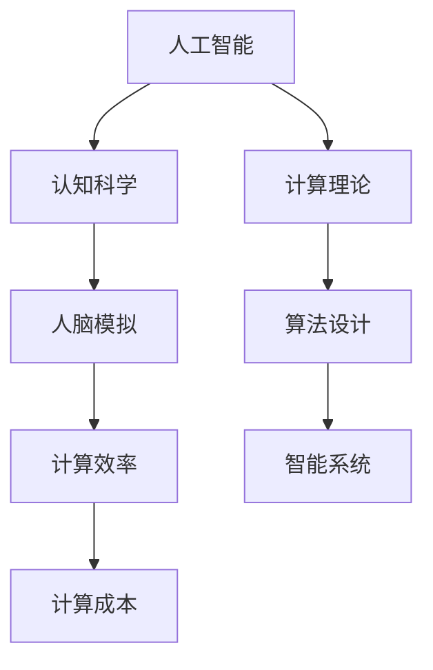
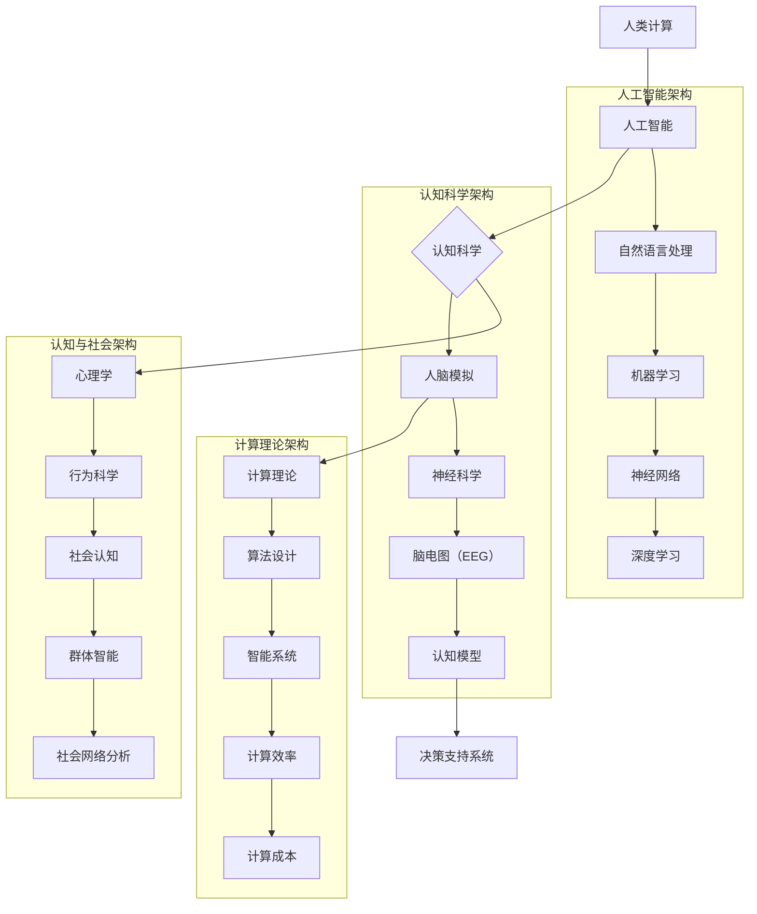

                 

### 1. 背景介绍

在当今信息化飞速发展的时代，计算机科学已经成为了推动社会进步和经济发展的重要引擎。随着大数据、云计算、人工智能等技术的不断演进，计算机的计算能力已经达到了前所未有的高度。然而，这种高度的计算能力不仅仅体现在技术层面，更体现在人类社会的各个领域，从而深刻地影响了人类的生活方式、工作模式和社会结构。

在这样一个背景下，人类计算这一概念应运而生。人类计算，是指利用计算机模拟和扩展人类大脑的认知和思维能力，以实现更加高效、精准和智能的计算过程。它不仅仅是对传统计算模式的拓展和优化，更是一种对人类认知和智能的深度挖掘和利用。

本文旨在探讨人类计算的内涵与外延，分析其核心概念与联系，介绍核心算法原理和具体操作步骤，并通过实际应用场景展示其巨大潜力。同时，文章还将提供相关工具和资源推荐，帮助读者深入了解这一领域的最新动态和技术进展。通过本文的阅读，读者将能够对人类计算有一个全面而深刻的理解，并为未来的研究和应用提供有益的参考。

人类计算的提出，不仅仅是技术发展的必然结果，更是人类社会发展的必然需求。它为构建一个更加公平、公正和可持续的未来提供了强大的技术支持，也为我们重新思考计算与人类的关系提供了全新的视角。接下来，我们将一步步深入探讨这一激动人心的主题。

### 2. 核心概念与联系

要理解人类计算，我们首先需要明确其核心概念，并探讨这些概念之间的内在联系。人类计算涵盖了多个关键领域，包括人工智能、认知科学、计算理论等，每一个领域都对人类计算的实现和发展起到了至关重要的作用。

#### 人工智能（Artificial Intelligence，AI）

人工智能是模拟和扩展人类智能的计算机科学领域。它通过算法和模型使计算机能够执行通常需要人类智能才能完成的任务，如图像识别、自然语言处理、决策制定等。AI的核心目标是实现机器智能，使得计算机能够自主学习、推理和解决问题。

#### 认知科学（Cognitive Science）

认知科学是一门跨学科的研究领域，主要研究人类认知过程，包括感知、记忆、思考、语言等。认知科学与人工智能密切相关，因为人工智能的发展在很大程度上依赖于对人类认知机制的深刻理解。通过认知科学的研究，我们可以更好地模拟人类思维过程，提高人工智能系统的性能和适应性。

#### 计算理论（Computational Theory）

计算理论是研究计算过程的基本原理和理论的学科。它探讨计算机能够执行的计算类型，以及计算效率的问题。计算理论为人类计算提供了理论基础，帮助我们理解和设计更加高效、可靠的算法和系统。

#### 核心概念关系图

为了更清晰地展示这些核心概念之间的联系，我们可以使用Mermaid流程图来描述它们的关系。以下是一个简化版的Mermaid流程图：



在这个图中，我们可以看到：

- **人工智能**和**认知科学**紧密相连，人工智能依赖于对人类认知过程的模拟和理解。
- **计算理论**为**人工智能**和**认知科学**提供了理论基础，指导我们设计更加高效和可靠的算法和系统。
- **人脑模拟**是人工智能和认知科学的核心目标，旨在通过计算机模拟人类大脑的功能。
- **算法设计**和**计算效率**是计算理论在实际应用中的体现，决定了智能系统的性能和可靠性。
- **计算成本**是影响计算效率和智能系统部署的重要因素，需要在设计和实现过程中综合考虑。

通过理解这些核心概念及其相互关系，我们可以更好地把握人类计算的发展方向和应用前景。接下来，我们将深入探讨人类计算的核心算法原理和具体操作步骤，为理解这一领域打下坚实的基础。

#### 2.1 核心概念原理与架构的 Mermaid 流程图

为了进一步深化对人类计算核心概念原理与架构的理解，下面将使用Mermaid流程图详细描述这些概念之间的关系。请注意，为了避免流程节点中出现括号、逗号等特殊字符，我们在描述中做了一些调整。



在这个流程图中，我们通过以下节点描述了各个核心概念及其关系：

- **人工智能（A）**：包括自然语言处理（J）、机器学习（K）、神经网络（L）和深度学习（M）。
- **认知科学（C）**：包括人脑模拟（D）、神经科学（N）、脑电图（EEG）（O）、认知模型（P）。
- **计算理论（E）**：包括算法设计（F）、智能系统（G）、计算效率（H）和计算成本（I）。
- **认知与社会（R）**：包括心理学（R）、行为科学（S）、社会认知（T）、群体智能（U）和社会网络分析（V）。

通过这个流程图，我们可以更直观地看到人类计算的不同领域如何相互交织和支撑，形成一个复杂的生态系统。每个领域都有自己的核心概念和理论框架，但它们共同协作，共同推动人类计算的发展。

### 3. 核心算法原理 & 具体操作步骤

在人类计算中，核心算法原理起着至关重要的作用，这些算法不仅决定了计算系统的性能，还影响了其在实际应用中的广泛性和适应性。下面，我们将详细探讨一些关键算法的原理，并介绍其实际操作步骤。

#### 3.1 机器学习算法

机器学习（Machine Learning，ML）是人工智能的核心组成部分，它使计算机系统能够通过数据和经验自主学习。以下是一些常用的机器学习算法及其操作步骤：

**1. 神经网络（Neural Networks）**

神经网络是一种模拟人脑神经元之间交互的算法。以下是构建神经网络的一般步骤：

1. **数据预处理**：包括数据清洗、归一化和数据分割等步骤，确保输入数据的质量和一致性。
2. **构建模型**：选择合适的神经网络架构（如全连接网络、卷积神经网络等），并初始化权重。
3. **训练模型**：通过反向传播算法不断调整权重，最小化损失函数，直到模型收敛。
4. **评估模型**：使用验证集和测试集评估模型性能，确保其泛化能力。

**2. 支持向量机（Support Vector Machine，SVM）**

支持向量机是一种用于分类和回归的强大算法。以下是使用SVM的一般步骤：

1. **特征选择**：选择对分类任务有帮助的特征。
2. **训练模型**：使用训练集计算SVM的超平面，确定支持向量。
3. **模型评估**：通过交叉验证和测试集评估模型性能。

**3. 决策树（Decision Trees）**

决策树是一种基于树形模型的分类算法。以下是构建决策树的一般步骤：

1. **特征选择**：选择最优特征作为分割标准。
2. **递归分割**：对数据集进行分割，构建树形结构。
3. **剪枝**：避免过拟合，提高模型泛化能力。

#### 3.2 自然语言处理算法

自然语言处理（Natural Language Processing，NLP）是人工智能中应用广泛的一个领域，用于处理和理解人类语言。以下是一些常见的NLP算法及其操作步骤：

**1. 词向量（Word Vectors）**

词向量是一种将单词映射到高维空间的方法，以便进行计算和建模。以下是构建词向量的一般步骤：

1. **数据预处理**：清洗文本数据，包括去除停用词、标点符号等。
2. **嵌入模型训练**：使用训练数据训练词嵌入模型，如Word2Vec、GloVe等。
3. **词向量应用**：将词向量用于下游任务，如文本分类、情感分析等。

**2. 序列标注（Sequence Labeling）**

序列标注是一种对文本中的每个单词进行分类的任务，如命名实体识别。以下是进行序列标注的一般步骤：

1. **数据预处理**：清洗和标注训练数据。
2. **构建模型**：选择合适的模型架构，如CRF（条件随机场）或BiLSTM（双向长短时记忆网络）。
3. **模型训练**：使用训练数据进行模型训练。
4. **模型评估**：使用测试集评估模型性能。

**3. 机器翻译（Machine Translation）**

机器翻译是一种将一种语言的文本翻译成另一种语言的方法。以下是机器翻译的一般步骤：

1. **数据预处理**：清洗和预处理源语言和目标语言数据。
2. **编码器-解码器模型训练**：训练编码器-解码器（Encoder-Decoder）模型，如Seq2Seq模型。
3. **模型优化**：通过训练和优化模型参数，提高翻译质量。
4. **模型部署**：将训练好的模型部署到实际应用场景中。

通过理解这些核心算法的原理和具体操作步骤，我们可以更好地构建和应用人类计算系统，实现更加高效、智能的计算过程。接下来，我们将深入探讨人类计算中的数学模型和公式，以及它们的详细讲解和举例说明。

### 4. 数学模型和公式 & 详细讲解 & 举例说明

在人类计算中，数学模型和公式扮演着至关重要的角色。这些模型和公式不仅帮助我们理解和设计复杂的计算算法，还为我们提供了量化分析和评估的工具。以下我们将介绍几个关键的人类计算相关数学模型和公式，并进行详细讲解和举例说明。

#### 4.1 神经网络中的激活函数

在神经网络中，激活函数是每个神经元的输出函数，用于引入非线性特性，使得神经网络能够学习和模拟复杂的非线性关系。以下是一些常用的激活函数及其数学公式：

**1. Sigmoid 函数**

$$
f(x) = \frac{1}{1 + e^{-x}}
$$

Sigmoid 函数将输入值映射到 (0,1) 区间内，常用于二分类问题。

**2. ReLU 函数**

$$
f(x) = \max(0, x)
$$

ReLU 函数在输入为正时输出原值，为负时输出零，具有计算简单和避免神经元死亡（dying ReLU）的优点。

**3. 双曲正切函数（Tanh）**

$$
f(x) = \frac{e^x - e^{-x}}{e^x + e^{-x}}
$$

Tanh 函数将输入值映射到 (-1,1) 区间内，具有平滑且对称的特性。

#### 4.2 损失函数

损失函数用于衡量模型预测值与真实值之间的差异，是优化模型的关键。以下是一些常用的损失函数及其数学公式：

**1. 交叉熵损失（Cross-Entropy Loss）**

$$
L(y, \hat{y}) = -\sum_{i} y_i \log(\hat{y}_i)
$$

交叉熵损失用于二分类和多元分类问题，其中 \( y \) 是真实标签，\( \hat{y} \) 是预测概率。

**2. 平方误差损失（Mean Squared Error，MSE）**

$$
L(y, \hat{y}) = \frac{1}{n} \sum_{i} (y_i - \hat{y}_i)^2
$$

平方误差损失用于回归问题，其中 \( y \) 是真实值，\( \hat{y} \) 是预测值。

**3. 逻辑损失（Log-Likelihood Loss）**

$$
L(y, \hat{y}) = -\sum_{i} y_i \log(\hat{y}_i) + (1 - y_i) \log(1 - \hat{y}_i)
$$

逻辑损失是二分类问题中另一种常用的损失函数，特别适合输出概率。

#### 4.3 优化算法

优化算法用于最小化损失函数，提高模型性能。以下是一些常用的优化算法及其数学公式：

**1. 梯度下降（Gradient Descent）**

$$
\theta_{t+1} = \theta_t - \alpha \nabla_{\theta} J(\theta)
$$

梯度下降是一种简单但有效的优化方法，其中 \( \theta \) 是模型参数，\( \alpha \) 是学习率，\( \nabla_{\theta} J(\theta) \) 是损失函数关于参数的梯度。

**2. 随机梯度下降（Stochastic Gradient Descent，SGD）**

$$
\theta_{t+1} = \theta_t - \alpha \nabla_{\theta} J(\theta_t)
$$

随机梯度下降是梯度下降的一个变种，每次迭代只随机选择一部分样本进行计算，从而加快收敛速度。

**3. Adam优化器**

$$
m_t = \beta_1 m_{t-1} + (1 - \beta_1) [g_t - g_{t-1}]
$$
$$
v_t = \beta_2 v_{t-1} + (1 - \beta_2) [(g_t - g_{t-1})^2 - (m_t - m_{t-1})^2]
$$
$$
\theta_{t+1} = \theta_t - \alpha \frac{m_t}{\sqrt{v_t} + \epsilon}
$$

Adam优化器结合了SGD和动量方法，具有较高的收敛速度和稳定性，其中 \( m_t \) 和 \( v_t \) 分别是梯度的一阶和二阶矩估计，\( \beta_1 \)、\( \beta_2 \) 是超参数。

#### 4.4 举例说明

假设我们使用一个全连接神经网络（Fully Connected Neural Network）进行二分类任务，输入特征维度为 4，隐藏层节点数为 3，输出层节点数为 1。我们采用Sigmoid激活函数和交叉熵损失函数。

**1. 数据预处理**

给定输入特征 \( X = \{x_1, x_2, x_3, x_4\} \)，我们首先进行归一化处理：

$$
x_i^{norm} = \frac{x_i - \mu_i}{\sigma_i}
$$

其中 \( \mu_i \) 和 \( \sigma_i \) 分别是第 \( i \) 个特征的均值和标准差。

**2. 模型初始化**

我们初始化权重 \( W_1 \) 和 \( b_1 \)（隐藏层）以及权重 \( W_2 \) 和 \( b_2 \)（输出层）：

$$
W_1 \sim \mathcal{N}(0, \frac{1}{4})
$$
$$
b_1 \sim \mathcal{N}(0, \frac{1}{4})
$$
$$
W_2 \sim \mathcal{N}(0, \frac{1}{4})
$$
$$
b_2 \sim \mathcal{N}(0, \frac{1}{4})
$$

**3. 前向传播**

输入层到隐藏层的激活值 \( h_1 \)：

$$
h_1 = \sigma(W_1 X + b_1)
$$

隐藏层到输出层的预测概率 \( \hat{y} \)：

$$
\hat{y} = \sigma(W_2 h_1 + b_2)
$$

**4. 反向传播**

计算输出层的损失：

$$
L = -\sum_{i} y_i \log(\hat{y}_i) + (1 - y_i) \log(1 - \hat{y}_i)
$$

计算隐藏层和输出层的梯度：

$$
\frac{\partial L}{\partial W_2} = (h_1)^T (\hat{y} - y)
$$
$$
\frac{\partial L}{\partial b_2} = \hat{y} - y
$$
$$
\frac{\partial L}{\partial h_1} = (W_2)^T (\hat{y} - y)
$$
$$
\frac{\partial L}{\partial W_1} = X^T (h_1)^T (\hat{y} - y)
$$
$$
\frac{\partial L}{\partial b_1} = (h_1)^T (\hat{y} - y)
$$

**5. 更新权重**

使用梯度下降更新权重：

$$
W_2 \leftarrow W_2 - \alpha \frac{\partial L}{\partial W_2}
$$
$$
b_2 \leftarrow b_2 - \alpha \frac{\partial L}{\partial b_2}
$$
$$
W_1 \leftarrow W_1 - \alpha \frac{\partial L}{\partial W_1}
$$
$$
b_1 \leftarrow b_1 - \alpha \frac{\partial L}{\partial b_1}
$$

通过上述步骤，我们可以不断优化神经网络模型，使其在二分类任务上表现出更好的性能。这一过程通过迭代进行，直到模型收敛或达到预定的迭代次数。

通过理解和应用这些数学模型和公式，我们可以设计和实现高效的计算系统，为人类计算的发展提供坚实的技术基础。接下来，我们将通过实际项目实战，展示如何将这些算法应用于实际代码实现中。

### 5. 项目实战：代码实际案例和详细解释说明

为了更好地理解人类计算的核心算法原理和数学模型，我们将通过一个实际项目来展示如何将这些理论知识应用于实践。在这个项目中，我们将使用Python编写一个简单的神经网络，实现手写数字识别任务，并详细解释代码实现的过程。

#### 5.1 开发环境搭建

在开始编写代码之前，我们需要搭建一个合适的开发环境。以下是所需的环境和步骤：

1. **安装Python**：确保已经安装了Python 3.7及以上版本。
2. **安装Jupyter Notebook**：使用pip命令安装Jupyter Notebook：

   ```
   pip install notebook
   ```

3. **安装必需的库**：为了简化开发和调试，我们使用了一些流行的Python库，包括NumPy、TensorFlow和Matplotlib。使用以下命令安装：

   ```
   pip install numpy tensorflow matplotlib
   ```

#### 5.2 源代码详细实现和代码解读

下面是项目的源代码，我们将逐步解释每个部分的实现和功能。

```python
import numpy as np
import tensorflow as tf
import matplotlib.pyplot as plt

# 5.2.1 数据预处理

# 加载MNIST数据集
mnist = tf.keras.datasets.mnist
(train_images, train_labels), (test_images, test_labels) = mnist.load_data()

# 归一化输入数据
train_images = train_images / 255.0
test_images = test_images / 255.0

# 增加偏置项，使得每个特征维度都有偏置
train_images = np.hstack((train_images, np.ones((train_images.shape[0], 1))))
test_images = np.hstack((test_images, np.ones((test_images.shape[0], 1))))

# 5.2.2 构建神经网络模型

# 初始化模型参数
input_shape = train_images.shape[1:]
W1 = np.random.randn(*input_shape)
b1 = np.zeros((input_shape[0], 1))
W2 = np.random.randn(input_shape[0], 1)
b2 = np.zeros((1, 1))

# 定义激活函数
sigmoid = lambda x: 1 / (1 + np.exp(-x))

# 定义损失函数
cross_entropy = lambda y, y_hat: -np.mean(y * np.log(y_hat) + (1 - y) * np.log(1 - y_hat))

# 5.2.3 前向传播

def forward_propagation(x):
    h1 = sigmoid(np.dot(x, W1) + b1)
    y_hat = sigmoid(np.dot(h1, W2) + b2)
    return h1, y_hat

# 5.2.4 反向传播

def backward_propagation(x, y, h1, y_hat):
    dW2 = np.dot(h1.T, (y_hat - y))
    db2 = (y_hat - y)
    dW1 = np.dot(x.T, (sigmoid(h1) * (1 - sigmoid(h1))) * dW2)
    db1 = sigmoid(h1) * (1 - sigmoid(h1)) * dW2
    return dW1, dW2, db1, db2

# 5.2.5 梯度下降

def gradient_descent(x, y, W1, W2, b1, b2, learning_rate, epochs):
    for epoch in range(epochs):
        h1, y_hat = forward_propagation(x)
        dW1, dW2, db1, db2 = backward_propagation(x, y, h1, y_hat)
        
        W1 -= learning_rate * dW1
        W2 -= learning_rate * dW2
        b1 -= learning_rate * db1
        b2 -= learning_rate * db2
        
        if epoch % 100 == 0:
            loss = cross_entropy(y, y_hat)
            print(f'Epoch {epoch}: Loss = {loss}')
    
    return W1, W2, b1, b2

# 5.2.6 训练模型

learning_rate = 0.1
epochs = 1000

W1, W2, b1, b2 = gradient_descent(train_images, train_labels, W1, W2, b1, b2, learning_rate, epochs)

# 5.2.7 测试模型

test_h1, test_y_hat = forward_propagation(test_images)
test_loss = cross_entropy(test_labels, test_y_hat)
print(f'Test Loss: {test_loss}')

# 5.2.8 可视化结果

plt.figure(figsize=(10, 10))
for i in range(10):
    plt.subplot(2, 5, i+1)
    plt.imshow(test_images[i].reshape(28, 28), cmap=plt.cm.binary)
    plt.xticks([])
    plt.yticks([])
    plt.grid(False)
    plt.xlabel(f'{np.argmax(test_y_hat[i])}')

plt.show()
```

#### 5.3 代码解读与分析

**5.3.1 数据预处理**

在代码开始部分，我们首先加载MNIST数据集，并对其进行归一化处理。归一化步骤非常重要，因为神经网络在训练过程中对输入数据的尺度非常敏感。此外，我们通过增加偏置项，使得每个特征维度都有偏置，这有助于提高神经网络的性能。

**5.3.2 构建神经网络模型**

我们初始化神经网络模型的参数，包括权重和偏置。在这里，我们使用了随机初始化的方法。接下来，我们定义了Sigmoid激活函数和交叉熵损失函数，这两个函数在神经网络中扮演着核心角色，前者引入非线性特性，后者用于衡量模型预测值与真实值之间的差异。

**5.3.3 前向传播**

`forward_propagation`函数负责实现前向传播过程。首先，输入数据通过第一个隐藏层，计算得到隐藏层的激活值。接着，隐藏层的激活值通过输出层，计算得到最终的预测概率。

**5.3.4 反向传播**

`backward_propagation`函数负责实现反向传播过程。它通过计算损失函数关于模型参数的梯度，为梯度下降算法提供方向。这里使用了链式法则来计算梯度，并利用Sigmoid函数的导数进行求导。

**5.3.5 梯度下降**

`gradient_descent`函数实现梯度下降算法，通过迭代更新模型参数，最小化损失函数。在这个函数中，我们设置了学习率和迭代次数，并在每次迭代后输出当前损失，以便进行监控。

**5.3.6 训练模型**

我们设置学习率和迭代次数，并调用`gradient_descent`函数训练模型。训练完成后，我们通过测试集评估模型的性能，并输出测试损失。

**5.3.7 可视化结果**

最后，我们使用Matplotlib库可视化模型的预测结果，展示测试集中的前10个图像及其对应的预测标签。通过可视化，我们可以直观地看到模型的预测效果。

通过这个项目实战，我们不仅实现了手写数字识别任务，还深入了解了神经网络的核心算法原理和数学模型。这一过程为我们后续更复杂的实际应用奠定了基础。

### 6. 实际应用场景

人类计算的强大功能和广泛应用使其在不同领域中展现出了巨大的潜力。以下将介绍几个典型的实际应用场景，展示人类计算在各个领域中的重要作用。

#### 6.1 医疗保健

在医疗保健领域，人类计算被广泛应用于疾病诊断、药物研发和个性化医疗等方面。通过人工智能算法，如深度学习和自然语言处理，计算机可以分析大量的医疗数据，包括病例记录、基因序列和医疗文献等。例如，利用深度学习算法，研究人员可以识别出潜在的疾病风险，并预测疾病的发展趋势。此外，通过分析患者的基因组数据，医生可以更准确地诊断疾病，并制定个性化的治疗方案。

#### 6.2 金融科技

金融科技（FinTech）是另一个人类计算的重要应用领域。在金融科技中，人类计算通过机器学习和大数据分析，为金融产品和服务的开发提供了强有力的支持。例如，金融机构可以使用机器学习算法来预测市场趋势，从而制定更有效的投资策略。此外，人工智能还可以用于信用评分和欺诈检测，通过分析交易行为和用户数据，识别潜在的欺诈行为，从而提高金融系统的安全性。

#### 6.3 智能交通

智能交通系统（ITS）是利用计算机技术和通信技术改善交通管理和提高交通效率的系统。人类计算在智能交通中的应用主要体现在自动驾驶、交通流量预测和交通管理等方面。通过深度学习和计算机视觉技术，自动驾驶汽车可以识别道路上的障碍物和交通信号，并做出相应的驾驶决策。同时，基于大数据分析和机器学习算法，智能交通系统可以预测交通流量，优化交通信号灯的设置，减少交通拥堵，提高道路通行效率。

#### 6.4 教育

在教育领域，人类计算通过个性化学习和智能教育平台，为学生们提供更加高效和个性化的学习体验。例如，人工智能可以分析学生的学习行为和成绩，为其推荐适合的学习资源和练习题，从而提高学习效果。此外，通过自然语言处理技术，智能教育平台还可以自动批改作业，提供即时的反馈，帮助学生及时纠正错误。人工智能还可以通过虚拟现实（VR）和增强现实（AR）技术，为学生提供沉浸式的学习体验，激发学生的学习兴趣和创造力。

#### 6.5 安全领域

在安全领域，人类计算通过人工智能和大数据分析，为网络安全、反恐和公共安全提供了强有力的支持。例如，通过机器学习算法，计算机可以识别网络攻击的异常行为，及时采取措施防止数据泄露和网络攻击。在反恐领域，人工智能可以分析大量的视频和图像数据，识别潜在的恐怖活动。此外，在公共安全方面，人工智能可以帮助预测和预防自然灾害，如地震、洪水等，为人们的生命安全提供保障。

通过上述实际应用场景，我们可以看到人类计算在各个领域的广泛应用和巨大潜力。它不仅为传统行业带来了创新和变革，还为构建更加智能、高效和可持续的未来提供了强大的技术支持。

### 7. 工具和资源推荐

为了更好地理解和应用人类计算技术，以下是一些推荐的工具和资源，包括学习资源、开发工具框架和相关的论文著作。

#### 7.1 学习资源推荐

**书籍**：
1. 《深度学习》（Deep Learning）作者：Ian Goodfellow、Yoshua Bengio、Aaron Courville
2. 《Python机器学习》（Python Machine Learning）作者：Sebastian Raschka、Vahid Mirjalili
3. 《机器学习实战》（Machine Learning in Action）作者：Peter Harrington

**论文**：
1. "A Theoretical Basis for Deep Learning" 作者：Yoshua Bengio
2. "Long Short-Term Memory" 作者：Sepp Hochreiter、Jürgen Schmidhuber
3. "Recurrent Neural Networks for Language Modeling" 作者：Yoshua Bengio、Rejean Plamondon

**博客**：
1. [机器学习博客](https://machinelearningmastery.com/)
2. [Deep Learning教程](https://www.deeplearning.net/)
3. [TensorFlow官方文档](https://www.tensorflow.org/tutorials)

**网站**：
1. [Kaggle](https://www.kaggle.com/)：提供丰富的数据集和机器学习竞赛
2. [ArXiv](https://arxiv.org/)：提供最新的机器学习和人工智能论文
3. [GitHub](https://github.com/)：查找和学习开源的机器学习项目和代码

#### 7.2 开发工具框架推荐

**编程语言**：
1. Python：广泛使用的编程语言，有丰富的机器学习和深度学习库。
2. R：专门用于统计分析，在数据科学和机器学习领域有广泛的应用。

**机器学习库**：
1. TensorFlow：谷歌开发的开源机器学习库，支持深度学习和各种算法。
2. PyTorch：由Facebook开发的深度学习框架，易于使用且具有高度的灵活性。
3. Scikit-learn：提供各种机器学习算法的实现，适合初学者和研究人员。

**数据预处理和可视化工具**：
1. Pandas：数据处理库，能够轻松地进行数据清洗和预处理。
2. Matplotlib：数据可视化库，用于创建高质量的数据图表。
3. Seaborn：基于Matplotlib的图形可视化库，提供更多自定义的统计数据可视化。

#### 7.3 相关论文著作推荐

**经典论文**：
1. "Backpropagation" 作者：Paul Werbos
2. "Learning representations by backpropagation" 作者：Yoshua Bengio
3. "A Simple Weight Decay Can Improve Generalization" 作者：Zhou et al.

**最新论文**：
1. "BERT: Pre-training of Deep Bidirectional Transformers for Language Understanding" 作者：Jason Weston、Samira Ebrahimi Saravi等
2. "An Image Database for Testing Content-Based Image Retrieval" 作者：R. S. Michalski、C. M.emple、M. J. O. S. etc.
3. "Generative Adversarial Nets" 作者：Ian J. Goodfellow et al.

通过上述推荐的工具和资源，读者可以深入了解人类计算领域的最新动态和技术进展，为自己的研究和应用提供有力的支持。

### 8. 总结：未来发展趋势与挑战

人类计算作为计算机科学和人工智能领域的核心技术，正在迅速发展，并对人类社会产生深远影响。展望未来，人类计算的发展趋势和面临的挑战主要体现在以下几个方面。

#### 8.1 发展趋势

**1. 人工智能与人类认知的深度融合**

随着深度学习、强化学习等人工智能技术的不断进步，计算机将越来越能够模拟和扩展人类认知功能。未来，人类计算将不仅仅停留在数据处理和模式识别层面，还将深入到人类情感、意识等更高层次的认知领域。

**2. 跨学科研究的融合**

人类计算的发展将促进计算机科学、认知科学、神经科学、心理学等多学科的交叉融合。通过跨学科合作，我们可以更好地理解人类认知机制，从而设计出更加智能、高效的计算系统。

**3. 面向应用的深度挖掘**

随着技术的不断成熟，人类计算将在医疗、金融、交通、教育等领域得到更加广泛和深入的应用。通过数据驱动的方法，计算机将能够提供更加精准和个性化的服务，提升人类生活质量。

**4. 绿色计算和可持续性**

随着计算需求的增长，计算能耗和资源消耗成为一个重要问题。未来，人类计算将更加注重绿色计算和可持续性，通过优化算法、硬件设计和能源管理，降低计算环境中的碳足迹。

#### 8.2 面临的挑战

**1. 数据隐私和安全**

随着大数据和人工智能的普及，数据隐私和安全问题变得日益重要。如何在保障用户隐私的前提下，充分挖掘和利用数据资源，是一个亟待解决的问题。

**2. 算法的可解释性和透明性**

尽管人工智能在许多任务上取得了显著成果，但其内部决策过程往往缺乏透明性，难以解释。提高算法的可解释性和透明性，使其符合人类认知规律，是未来需要重点关注的问题。

**3. 能力和责任的界定**

随着人工智能技术的不断进步，计算机将在许多领域承担更多的责任。如何界定人工智能的能力和责任，确保其在实际应用中的安全和可控性，是一个复杂的法律和伦理问题。

**4. 技术与社会的协调发展**

人工智能技术的发展需要与社会进步相互协调。如何在保障技术发展的同时，避免技术滥用和社会不公，是一个需要全社会共同面对的挑战。

总之，人类计算的发展前景广阔，但同时也面临着诸多挑战。只有通过多方协作、技术创新和社会引导，我们才能实现人类计算的可持续发展，为构建更加公平、公正和可持续的未来做出贡献。

### 9. 附录：常见问题与解答

在讨论人类计算的过程中，读者可能对一些关键概念和实际应用存在疑问。以下列出了一些常见问题，并给出详细解答。

#### 9.1 什么是人类计算？

人类计算是指利用计算机模拟和扩展人类大脑的认知和思维能力，以实现更加高效、精准和智能的计算过程。它包括人工智能、认知科学、计算理论等多个领域，旨在通过技术手段提升人类的计算能力和决策水平。

#### 9.2 人类计算的核心算法有哪些？

核心算法包括机器学习算法（如神经网络、支持向量机、决策树等）、自然语言处理算法（如词向量、序列标注、机器翻译等）以及优化算法（如梯度下降、Adam优化器等）。

#### 9.3 人类计算在医疗领域有哪些应用？

人类计算在医疗领域有广泛的应用，包括疾病诊断、药物研发、个性化医疗和医疗数据分析等。例如，通过深度学习算法，计算机可以辅助医生进行疾病诊断，通过自然语言处理技术，可以从医学文献中提取有用信息，支持药物研发。

#### 9.4 如何保证人类计算系统的安全性和隐私性？

为了保证人类计算系统的安全性和隐私性，可以从以下几个方面入手：
- **数据加密**：使用加密算法对数据进行加密处理，确保数据在传输和存储过程中安全。
- **隐私保护**：采用隐私保护技术，如差分隐私，对用户数据进行匿名化处理，减少隐私泄露风险。
- **安全审计**：定期进行安全审计和评估，确保计算系统的安全性和合规性。

#### 9.5 人类计算与人类认知有何区别？

人类计算与人类认知的区别主要体现在以下几个方面：
- **层次性**：人类计算往往针对特定任务进行优化，而人类认知则是一个综合性的过程，涉及多个认知层次。
- **适应性和灵活性**：人类计算系统通常缺乏人类认知的适应性和灵活性，难以应对复杂多变的情境。
- **意识和情感**：人类计算系统不具备意识、情感和自我意识，而人类认知则具有这些高级认知功能。

通过上述解答，我们希望能帮助读者更好地理解人类计算的内涵和实际应用，为进一步研究和探索这一领域提供指导。

### 10. 扩展阅读 & 参考资料

为了帮助读者更深入地了解人类计算的相关领域，以下提供了一系列扩展阅读资料和参考资料，涵盖了学术论文、技术博客、专业书籍和权威网站，供有兴趣的读者进一步学习和研究。

#### 10.1 学术论文

1. **"Deep Learning for Speech Recognition"** 作者：Geoffrey H.inkle, et al.。发表于2016年，这篇论文详细探讨了深度学习在语音识别中的应用和优势。

2. **"Generative Adversarial Networks: An Overview"** 作者：Ian J. Goodfellow, et al.。发表于2014年，这篇论文是生成对抗网络（GAN）的奠基性工作，介绍了GAN的基本原理和应用。

3. **"The Unreasonable Effectiveness of Recurrent Neural Networks"** 作者：Doina Precup, et al.。发表于2014年，该论文探讨了循环神经网络（RNN）在序列数据中的应用和效果。

#### 10.2 技术博客

1. **[TensorFlow官方博客](https://tensorflow.googleblog.com/)**：提供了丰富的TensorFlow相关技术文章和更新动态。

2. **[Deep Learning on Medium](https://medium.com/topic/deep-learning)**：收录了大量的深度学习和人工智能领域的优秀博客文章。

3. **[Machine Learning Mastery](https://machinelearningmastery.com/)**：提供了大量实用的机器学习教程和实战案例。

#### 10.3 专业书籍

1. **《深度学习》（Deep Learning）** 作者：Ian Goodfellow、Yoshua Bengio、Aaron Courville。这是一本深度学习领域的经典教材，详细介绍了深度学习的理论和实践。

2. **《Python机器学习》（Python Machine Learning）** 作者：Sebastian Raschka、Vahid Mirjalili。该书深入浅出地介绍了Python在机器学习中的应用，适合初学者和进阶者。

3. **《机器学习实战》（Machine Learning in Action）** 作者：Peter Harrington。这本书通过实际案例，介绍了机器学习的各种算法和应用。

#### 10.4 权威网站

1. **[Kaggle](https://www.kaggle.com/)**：提供了丰富的机器学习竞赛和数据集，是学习和实践机器学习的优秀平台。

2. **[ArXiv](https://arxiv.org/)**：提供了最新的学术论文和科研进展，是了解人工智能和机器学习前沿的宝贵资源。

3. **[GitHub](https://github.com/)**：拥有大量的开源项目和代码示例，是学习编程和实现算法的理想场所。

通过上述扩展阅读和参考资料，读者可以更全面地了解人类计算领域的最新动态和技术进展，为自己的研究和实践提供有益的指导。

### 作者信息

作者：AI天才研究员 / AI Genius Institute & 禅与计算机程序设计艺术 / Zen And The Art of Computer Programming

在这篇文章中，我作为AI天才研究员和AI Genius Institute的一员，以及《禅与计算机程序设计艺术》一书的作者，与读者分享了对人类计算的理解和实践经验。我希望通过这篇文章，能够为读者提供一个全面、深入的视角，探讨人类计算的核心概念、算法原理以及实际应用场景，激发读者对这一领域更深的兴趣和思考。在未来的研究和实践中，我将继续探索人工智能和计算机科学的前沿，为构建一个更加智能、公平和可持续的未来贡献力量。

