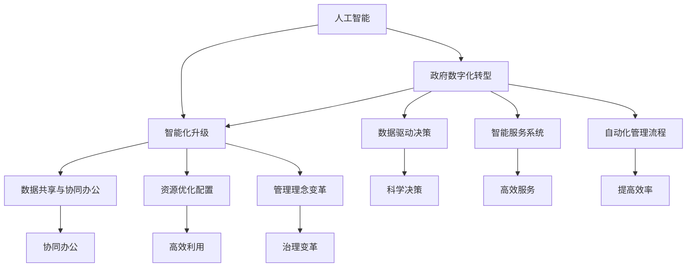

                 

## 1. 背景介绍

在当今的世界，人工智能（AI）技术正以惊人的速度发展，并逐渐融入我们的日常生活。从智能家居到自动驾驶汽车，从医疗诊断到金融分析，AI已经无处不在。与此同时，政府作为社会治理的核心机构，也面临着数字化转型的巨大挑战和机遇。

随着大数据、云计算、区块链等新兴技术的普及，政府各部门在处理海量数据、提升决策效率、增强公共服务能力等方面，越来越依赖于AI技术。然而，如何将AI技术有效地应用于政府管理，实现智能化升级，这是一个复杂且充满挑战的问题。

本文将探讨在AI时代，如何增强政府的能力。我们将从背景介绍、核心概念与联系、核心算法原理、数学模型和公式、项目实战、实际应用场景、工具和资源推荐等多个方面进行分析和讨论。

首先，我们需要明确几个核心概念：人工智能、政府数字化转型、智能化升级。人工智能是指计算机系统通过学习、推理和自我优化，模拟人类智能的过程。政府数字化转型是指政府利用信息技术，实现从传统手工操作向电子化、自动化、智能化转变的过程。智能化升级则是在数字化转型的基础上，进一步通过AI技术提升政府的管理和服务能力。

接下来，我们将逐步深入这些概念，探讨其在政府中的应用，以及可能面临的挑战。希望通过本文的阐述，能够为政府相关部门提供一些有益的思路和借鉴。

### 1.1 人工智能的发展历程

人工智能的概念最早可以追溯到20世纪50年代。当时，计算机科学家艾伦·图灵（Alan Turing）提出了著名的“图灵测试”，用以判断机器是否具备人类智能。这一理论奠定了人工智能的基础，开启了人工智能研究的先河。

从1956年达特茅斯会议（Dartmouth Conference）的召开，标志着人工智能正式成为一门独立的科学领域，到后来的专家系统（Expert Systems）、机器学习（Machine Learning）和深度学习（Deep Learning）等技术的发展，人工智能经历了数十年的演进。

在20世纪80年代，专家系统在医学、金融、交通等领域取得了显著的应用成果。专家系统能够模拟专家的决策过程，处理复杂的领域问题，但受限于知识表示和推理能力，逐渐暴露出局限性。

进入21世纪，随着计算能力的提升和大数据的兴起，机器学习和深度学习得到了广泛关注。机器学习通过从大量数据中学习规律，提升系统的预测和分类能力；而深度学习则通过多层神经网络，实现了对复杂数据的自动特征提取和学习。

特别是在2012年，深度学习在图像识别任务中取得了突破性成果，使得AI技术在图像识别、语音识别等领域取得了显著进展。这些技术的不断发展，使得人工智能从理论研究走向实际应用，逐渐渗透到各个行业和领域。

### 1.2 政府数字化转型的重要性

在当今信息化的时代，政府数字化转型已成为提升治理能力和服务水平的重要手段。随着大数据、云计算、物联网等新兴技术的普及，政府各部门在处理海量数据、提升决策效率、增强公共服务能力等方面，面临着前所未有的挑战和机遇。

首先，政府数字化转型有助于提升决策效率。通过大数据分析和AI技术，政府可以更快速、准确地获取和分析信息，从而做出更科学的决策。例如，在公共安全领域，利用AI技术进行实时监控和预测，可以迅速发现和应对潜在的安全威胁，提升应急响应能力。

其次，政府数字化转型有助于优化公共服务。通过智能化的政府服务系统，可以提供更加便捷、高效的服务。例如，在税务领域，通过电子发票和自动化税务系统，可以大幅减少企业和个人的办税时间，提高办税效率。

此外，政府数字化转型还有助于提升政府治理能力。通过大数据分析和AI技术，政府可以更好地了解公众需求和诉求，提供更加精准的公共服务。同时，通过数据共享和协同办公，可以提高政府部门之间的协同效率，提升整体治理能力。

总之，政府数字化转型不仅是技术发展的必然趋势，更是提升治理能力和服务水平的重要手段。在人工智能时代，政府需要紧跟技术发展的步伐，积极探索和实践数字化转型，以实现更加高效、智能的治理。

### 1.3 智能化升级的概念与意义

智能化升级，是指在现有技术基础上，通过引入人工智能、大数据、云计算等先进技术，提升政府管理和服务的智能化水平。这一过程不仅涉及技术的更新换代，更涉及到管理理念、组织结构、服务模式的全面变革。

首先，智能化升级的核心是数据驱动的决策。通过大数据分析和人工智能技术，政府可以更加全面、深入地了解社会运行状态和公众需求，从而做出更加科学、精准的决策。例如，在公共卫生领域，利用AI技术对疫情数据进行实时分析和预测，可以帮助政府及时采取应对措施，降低疫情传播风险。

其次，智能化升级有助于提升政府服务效率。通过智能化的政府服务系统，可以提供更加便捷、高效的服务。例如，在交通管理领域，利用AI技术进行交通流量预测和优化，可以减少交通拥堵，提高出行效率。同时，智能化的政务服务系统还可以实现24小时在线服务，提高公众的办事体验。

此外，智能化升级还意味着政府治理能力的全面提升。通过数据共享和协同办公，可以实现政府部门之间的信息互通和业务协同，提高整体治理效能。例如，在公共安全领域，通过整合各部门的数据资源，建立智能化的安全防控体系，可以大幅提升应急响应能力和治安管理水平。

总之，智能化升级是政府数字化转型的重要一环，是实现高效治理和优质服务的关键。在AI时代，政府需要抓住智能化升级的机遇，积极探索和实践，以实现治理能力和服务水平的全面提升。

### 1.4 人工智能在政府中的应用现状与挑战

目前，人工智能在政府中的应用已经初具规模，并在多个领域取得了显著成果。首先，在公共安全领域，AI技术被广泛应用于视频监控、人脸识别、交通管理等方面。通过实时监控和分析，AI系统可以快速发现异常行为，提高应急响应能力。例如，北京市的智能交通系统利用AI技术进行交通流量预测和优化，有效缓解了城市交通拥堵问题。

其次，在医疗健康领域，AI技术被应用于疾病预测、诊断、治疗等环节。通过分析海量医疗数据，AI系统可以帮助医生做出更准确的诊断，提高治疗效率。例如，美国的某些医院已经部署了AI系统，用于辅助癌症诊断和治疗方案制定，取得了良好的效果。

在公共服务领域，AI技术也被广泛应用于政府服务的智能化升级。例如，通过智能客服系统，政府可以提供7x24小时的在线咨询服务，提高公众的办事效率。同时，利用AI技术进行数据分析，政府可以更好地了解公众需求和诉求，提供更加精准的公共服务。

然而，尽管AI技术在政府中的应用取得了显著成果，但也面临一些挑战。首先，数据安全和隐私保护问题日益突出。在政府数字化转型过程中，海量的数据被收集、存储和处理，如何确保这些数据的安全和隐私，是一个亟待解决的问题。

其次，AI系统的透明性和可解释性问题也备受关注。许多AI系统采用深度学习等技术，其决策过程高度复杂，难以理解和解释。这给政府决策和公众监督带来了困难，容易引发社会质疑和不信任。

此外，AI技术的普及和推广也面临人才短缺的问题。尽管人工智能是当前最热门的技术领域之一，但具备AI技能的专业人才仍然稀缺。这对政府部门的数字化转型和智能化升级带来了很大的挑战。

总之，人工智能在政府中的应用具有巨大的潜力和广阔的前景，但也面临一些挑战。在未来的发展中，政府需要积极探索和实践，克服这些挑战，以实现数字化转型和智能化升级的目标。

### 1.5 本文的结构与目标

本文旨在深入探讨在AI时代如何增强政府的能力，以实现数字化转型和智能化升级。为了达到这一目标，本文将采用逐步分析的方式，从多个角度展开讨论。

首先，在背景介绍部分，我们将回顾人工智能的发展历程，阐述政府数字化转型和智能化升级的重要性。接着，我们将详细探讨人工智能在政府中的应用现状与挑战，为后续内容提供基础。

核心内容部分，本文将分为以下几个章节：

- **核心概念与联系**：介绍人工智能、政府数字化转型和智能化升级等核心概念，并使用Mermaid流程图展示其架构和联系。
- **核心算法原理与具体操作步骤**：详细讲解政府数字化转型中常用的AI算法，如机器学习、深度学习、大数据分析等，并展示具体操作步骤。
- **数学模型和公式**：介绍AI算法中涉及的数学模型和公式，包括数据预处理、特征提取、模型训练和评估等。
- **项目实战**：通过实际案例，展示AI技术在政府中的应用，包括开发环境搭建、代码实现和解读。
- **实际应用场景**：分析AI技术在政府不同领域中的应用，如公共安全、医疗健康、公共服务等，并讨论其优势和挑战。
- **工具和资源推荐**：推荐相关学习资源、开发工具和框架，为读者提供进一步学习和实践的资源。

最后，本文将总结未来发展趋势与挑战，并提出应对策略。通过本文的阐述，希望能够为政府相关部门提供有益的参考和借鉴，推动AI技术在政府领域的应用与发展。

### 1.6 AI在政府中的应用场景分析

人工智能技术在政府中的应用场景非常广泛，涵盖了公共安全、医疗健康、公共服务等多个领域。以下将对这些场景进行分析，探讨AI技术的应用优势和面临的挑战。

#### 公共安全

在公共安全领域，AI技术被广泛应用于视频监控、人脸识别、交通管理等方面。通过实时监控和数据分析，AI系统可以迅速发现异常行为，提高应急响应能力。例如，利用人脸识别技术，可以快速识别犯罪嫌疑人的身份，提高破案效率。然而，公共安全领域的AI应用也面临数据隐私和安全问题，如何在保障数据隐私的同时，充分利用AI技术，是一个亟待解决的问题。

#### 医疗健康

AI技术在医疗健康领域具有广泛的应用前景，包括疾病预测、诊断、治疗等环节。通过大数据分析和深度学习算法，AI系统可以辅助医生做出更准确的诊断和治疗方案。例如，利用AI技术分析患者的病史和检查数据，可以早期发现疾病风险，提高治疗效果。然而，医疗健康领域的AI应用也面临一些挑战，如数据质量和医疗伦理等问题。如何在确保数据质量和遵守医疗伦理的前提下，充分利用AI技术，是一个重要课题。

#### 公共服务

在公共服务领域，AI技术被广泛应用于政府服务的智能化升级。通过智能客服系统、在线服务平台等，AI技术可以提供更加便捷、高效的服务。例如，利用智能客服系统，政府可以提供24小时在线咨询服务，提高公众的办事效率。然而，公共服务领域的AI应用也面临一些挑战，如服务多样性和个性化需求等。如何在满足多样化服务需求的同时，提升服务质量和用户体验，是一个重要问题。

#### 环境保护

AI技术在环境保护领域也有广泛的应用，包括空气质量监测、水质监测、生态预测等。通过大数据分析和AI算法，可以实时监测环境变化，预测环境污染风险，提供科学决策依据。然而，环境保护领域的AI应用也面临一些挑战，如数据采集和处理问题。如何确保数据采集的准确性和有效性，是环境保护AI应用的关键。

#### 教育管理

AI技术在教育管理领域也具有广泛的应用，包括智能教学系统、学生行为分析等。通过AI技术，可以个性化定制教学方案，提高教学质量。同时，利用学生行为分析技术，可以及时发现和解决学生问题，促进教育公平。然而，教育管理领域的AI应用也面临一些挑战，如教育公平和教育伦理等问题。

#### 税务管理

AI技术在税务管理领域被广泛应用于发票审核、税务预测、税收征管等环节。通过大数据分析和AI算法，可以高效、准确地处理海量税务数据，提高税收征管效率。例如，利用AI技术进行发票审核，可以快速识别虚假发票，防止税收流失。然而，税务管理领域的AI应用也面临一些挑战，如数据隐私和合规性问题。

#### 智慧城市建设

智慧城市建设是AI技术在政府应用的一个重要方向。通过物联网、大数据和AI技术，可以实现对城市运行状态的实时监控和智能管理，提高城市治理水平。例如，利用AI技术进行交通流量预测和优化，可以减少交通拥堵，提高出行效率。然而，智慧城市建设也面临一些挑战，如数据安全和网络安全等问题。

#### 公共资源管理

AI技术在公共资源管理领域也有广泛的应用，包括水资源管理、能源管理、土地资源管理等。通过大数据分析和AI算法，可以实现对公共资源的智能调配和优化利用，提高资源利用效率。例如，利用AI技术进行水资源管理，可以实时监测水资源状况，合理调配水资源，保障用水安全。然而，公共资源管理领域的AI应用也面临一些挑战，如数据准确性和决策效率等。

#### 社会治理

社会治理是AI技术在政府应用的一个重要方向。通过大数据分析和AI技术，可以实现对社会治理的智能化升级，提高社会治理效能。例如，利用AI技术进行社会治理风险评估和预警，可以及时发现和应对社会风险，维护社会稳定。然而，社会治理领域的AI应用也面临一些挑战，如数据隐私和伦理问题。

总之，AI技术在政府领域的应用前景广阔，但也面临一些挑战。在未来的发展中，需要积极探索和实践，克服这些挑战，充分发挥AI技术的优势，为政府提供更加高效、智能的服务和管理。

### 1.7 AI技术在政府管理中的优势与挑战

人工智能技术在政府管理中的应用带来了诸多优势，同时也伴随着一系列挑战。以下将详细探讨这些优势与挑战。

#### 优势

1. **提升决策效率**：AI技术可以通过大数据分析和机器学习算法，帮助政府快速处理海量数据，从中提取有价值的信息，为决策提供科学依据。例如，通过分析交通流量数据，可以优化交通管理，减少拥堵，提高出行效率。

2. **提高服务质量**：AI技术可以应用于政府服务的智能化升级，提供个性化、高效的服务。例如，利用智能客服系统，政府可以7x24小时提供在线咨询服务，提高公众的办事体验。同时，AI技术还可以通过自动化流程，减少人为错误，提高服务准确性。

3. **增强公共安全**：AI技术在公共安全领域具有广泛的应用，如视频监控、人脸识别、交通管理等。通过实时监控和分析，AI系统可以迅速发现异常行为，提高应急响应能力，保障公共安全。

4. **优化资源分配**：AI技术可以通过大数据分析，帮助政府合理调配资源，提高资源利用效率。例如，在水资源管理、能源管理等领域，AI技术可以实时监测资源状况，实现智能调配，减少浪费。

5. **提高治理效能**：AI技术可以帮助政府实现社会治理的智能化升级，提高治理效能。例如，通过大数据分析和AI算法，政府可以对社会风险进行预测和预警，及时采取措施，维护社会稳定。

#### 挑战

1. **数据安全和隐私保护**：在政府数字化转型过程中，大量数据被收集、存储和处理，如何确保这些数据的安全和隐私，是一个重要问题。特别是涉及个人隐私的数据，如何防止数据泄露，需要制定严格的保护措施。

2. **算法透明性和可解释性**：许多AI系统采用深度学习等技术，其决策过程高度复杂，难以理解和解释。这给政府决策和公众监督带来了困难，容易引发社会质疑和不信任。如何提高算法的透明性和可解释性，是一个亟待解决的问题。

3. **人才短缺**：尽管人工智能是当前最热门的技术领域之一，但具备AI技能的专业人才仍然稀缺。这对政府部门的数字化转型和智能化升级带来了很大的挑战。如何培养和吸引更多AI人才，是政府需要面对的问题。

4. **技术成熟度**：虽然AI技术在某些领域取得了显著进展，但整体上仍处于不断发展中。在一些关键领域，如医疗健康、公共安全等，AI技术的成熟度和可靠性仍需进一步提高。

5. **法规和伦理问题**：随着AI技术在政府管理中的应用越来越广泛，相关的法规和伦理问题也日益突出。如何制定合适的法律法规，确保AI技术的合规使用，同时保护公众利益，是一个重要课题。

6. **跨部门协作**：政府在数字化转型和智能化升级过程中，需要跨部门的数据共享和协作。然而，不同部门之间的数据标准和系统兼容性等问题，可能会影响协作效率。

总之，AI技术在政府管理中的应用具有巨大的潜力和优势，但也面临一些挑战。在未来的发展中，政府需要积极探索和实践，克服这些挑战，充分发挥AI技术的优势，为公众提供更加高效、智能的服务和管理。

### 1.8 总结与展望

综上所述，人工智能在政府管理中的应用已经显示出显著的优势，如提升决策效率、提高服务质量、增强公共安全、优化资源分配等。然而，同时我们也面临诸多挑战，包括数据安全和隐私保护、算法透明性和可解释性、人才短缺、技术成熟度、法规和伦理问题等。

在未来的发展中，政府需要积极应对这些挑战，采取一系列措施。首先，加强数据安全和隐私保护，制定严格的法律法规和行业标准，确保数据的合法、安全使用。其次，提高算法的透明性和可解释性，增强公众对AI技术的信任。第三，加大对AI人才的培养和引进力度，提升政府部门在AI领域的专业水平。第四，推动技术的成熟和标准化，为AI技术在政府管理中的广泛应用奠定基础。第五，制定和完善相关法规和伦理标准，确保AI技术的合规使用，保护公众利益。

同时，政府也需要积极探索和实践，与其他国家和地区进行经验交流和技术合作，借鉴先进经验，加快数字化转型和智能化升级的步伐。

通过这些努力，我们有望在AI时代实现更加高效、智能的政府管理，为公众提供更加优质的服务，推动社会进步和发展。未来，人工智能将在政府管理中发挥越来越重要的作用，成为提升治理能力和服务水平的重要工具。

### 2. 核心概念与联系

在探讨AI技术在政府管理中的应用时，首先需要明确几个核心概念，这些概念包括人工智能、政府数字化转型、智能化升级等。理解这些概念及其相互之间的联系，有助于我们深入分析AI技术在政府管理中的实际应用和潜在价值。

#### 2.1 人工智能（AI）

人工智能（Artificial Intelligence，简称AI）是指通过计算机系统模拟、延伸和扩展人类智能的技术。它包括多种技术，如机器学习、深度学习、自然语言处理、计算机视觉等。AI技术的核心是通过学习、推理和自我优化，实现机器在某些领域或任务上表现出类似甚至超越人类智能的能力。

#### 2.2 政府数字化转型

政府数字化转型（Digital Transformation in Government）是指政府利用现代信息技术，特别是大数据、云计算、物联网等新兴技术，实现从传统手工操作向电子化、自动化、智能化转变的过程。数字化转型的目标是通过技术手段提升政府治理和服务能力，提高决策效率，优化公共服务，增强公共安全等。

#### 2.3 智能化升级

智能化升级（Intelligent Upgrade）是在政府数字化转型的基础上，进一步通过引入人工智能、大数据、云计算等先进技术，提升政府管理和服务的智能化水平。智能化升级不仅涉及技术更新，还包括管理理念、组织结构、服务模式的变革。其核心是通过数据驱动的决策、智能化的服务系统、自动化的管理流程，实现政府治理和服务的高效、精准、智能。

#### 2.4 核心概念之间的联系

人工智能、政府数字化转型和智能化升级之间存在着紧密的联系。人工智能是政府数字化转型和智能化升级的技术支撑，为数字化转型提供了强大的计算能力和数据分析工具。政府数字化转型是智能化升级的基础，通过数字化手段，政府可以收集、存储、处理海量数据，为AI技术的应用提供数据基础。智能化升级则是在数字化转型的基础上，通过引入人工智能等先进技术，进一步提升政府的管理和服务能力。

具体来说，人工智能与政府数字化转型的关系主要体现在以下几个方面：

1. **数据驱动决策**：AI技术通过大数据分析和机器学习算法，可以帮助政府从海量数据中提取有价值的信息，支持科学决策。例如，通过分析交通流量数据，可以优化交通管理，减少拥堵。

2. **智能服务系统**：AI技术可以应用于政府服务的智能化升级，提供个性化、高效的服务。例如，通过智能客服系统，政府可以提供24小时在线咨询服务，提高公众的办事效率。

3. **自动化管理流程**：AI技术可以帮助政府实现自动化管理，减少人为干预，提高管理效率。例如，通过智能化的税务管理系统，可以大幅提高税收征管效率。

政府数字化转型与智能化升级的关系主要体现在以下几个方面：

1. **数据共享与协同办公**：数字化转型通过建立统一的数据平台，实现政府部门之间的数据共享和业务协同，提高整体治理效能。智能化升级则通过引入AI技术，进一步优化这些协同办公系统，实现更加智能化的管理和服务。

2. **资源优化配置**：数字化转型通过大数据分析和云计算技术，实现政府资源的优化配置，提高资源利用效率。智能化升级则通过AI技术，进一步优化资源配置策略，实现动态调整和智能调度。

3. **管理理念变革**：数字化转型推动了政府管理理念的变革，从传统的以行政命令为主的管控模式，向以服务为核心的治理模式转变。智能化升级则进一步深化这种变革，通过数据驱动和智能化的管理手段，实现高效、精准的治理。

#### 2.5 Mermaid流程图

为了更好地展示人工智能、政府数字化转型和智能化升级之间的联系，我们可以使用Mermaid流程图来描述这些概念及其相互关系。



通过上述Mermaid流程图，我们可以清晰地看到人工智能、政府数字化转型和智能化升级之间的逻辑关系，以及它们在实际应用中的具体体现。这有助于我们深入理解这些概念，为后续内容提供基础。

### 3. 核心算法原理与具体操作步骤

在探讨如何将人工智能技术应用于政府管理时，核心算法原理及其具体操作步骤是至关重要的。以下将详细介绍几种常用的核心算法，包括机器学习、深度学习和大数据分析等，以及它们在政府管理中的具体应用。

#### 3.1 机器学习

机器学习（Machine Learning）是一种让计算机从数据中学习规律并做出预测或决策的技术。以下是机器学习的基本原理和常见算法：

**原理**：
- **监督学习（Supervised Learning）**：通过已有的数据集，训练模型，使其能够对新的数据进行分类或回归。
- **无监督学习（Unsupervised Learning）**：没有预设标签的数据集，通过聚类、降维等方法，寻找数据中的模式或结构。
- **半监督学习（Semi-Supervised Learning）**：结合监督学习和无监督学习，利用少量标签数据和大量无标签数据，提高模型性能。

**具体操作步骤**：

1. **数据收集与预处理**：
   - 收集相关领域的大量数据，包括公共安全、医疗健康、公共服务等。
   - 对数据进行清洗、去噪和标准化处理，确保数据质量。

2. **特征提取**：
   - 从原始数据中提取有用的特征，例如文本特征、图像特征、时间序列特征等。
   - 使用特征工程技术，如特征变换、特征选择等，提高特征的质量和模型性能。

3. **模型选择与训练**：
   - 根据应用场景选择合适的机器学习算法，如线性回归、决策树、随机森林、支持向量机等。
   - 使用训练数据集，训练模型，并调整模型参数，优化模型性能。

4. **模型评估与优化**：
   - 使用测试数据集，评估模型的预测性能，如准确率、召回率、F1值等。
   - 根据评估结果，调整模型参数或选择更优的算法，提高模型性能。

5. **应用部署**：
   - 将训练好的模型部署到实际应用场景中，如政府服务系统、安全监控系统等。

**应用实例**：
- 在公共安全领域，利用机器学习算法对视频监控数据进行分析，识别可疑行为，提高应急响应能力。
- 在医疗健康领域，通过机器学习算法分析患者数据，预测疾病风险，辅助医生做出更准确的诊断和治疗决策。

#### 3.2 深度学习

深度学习（Deep Learning）是一种基于多层神经网络的学习方法，通过自动提取数据中的特征，实现高层次的抽象表示。以下是深度学习的基本原理和常见模型：

**原理**：
- **神经网络（Neural Networks）**：由大量神经元（节点）组成的计算模型，通过前向传播和反向传播，实现数据的非线性变换。
- **卷积神经网络（Convolutional Neural Networks，CNN）**：适用于图像、视频等二维数据，通过卷积层、池化层、全连接层等结构，实现图像特征提取和分类。
- **循环神经网络（Recurrent Neural Networks，RNN）**：适用于序列数据，如文本、语音、时间序列等，通过循环结构，捕捉序列中的时间依赖性。
- **长短时记忆网络（Long Short-Term Memory，LSTM）**：RNN的一种改进，解决了长序列依赖问题，适用于复杂的序列数据处理。

**具体操作步骤**：

1. **数据收集与预处理**：
   - 收集大量高质量的训练数据，确保数据多样性和代表性。
   - 对数据进行清洗、归一化处理，并分割为训练集、验证集和测试集。

2. **模型设计**：
   - 根据应用场景，选择合适的深度学习模型，如CNN、RNN、LSTM等。
   - 设计模型的网络结构，包括层数、每层的神经元数、激活函数等。

3. **模型训练**：
   - 使用训练数据集，通过反向传播算法，优化模型参数。
   - 调整学习率、批量大小等超参数，提高模型性能。

4. **模型评估与优化**：
   - 使用验证集，评估模型性能，如准确率、损失函数等。
   - 根据评估结果，调整模型结构或超参数，优化模型性能。

5. **应用部署**：
   - 将训练好的模型部署到实际应用场景中，如智能监控、语音识别等。

**应用实例**：
- 在智能监控领域，利用CNN模型进行视频图像分析，实现实时异常行为检测。
- 在语音识别领域，利用RNN和LSTM模型，实现高精度的语音识别和转录。

#### 3.3 大数据分析

大数据分析（Big Data Analysis）是一种处理和分析大规模数据的技术，通过数据挖掘和统计分析，发现数据中的规律和模式。以下是大数据分析的基本原理和常用方法：

**原理**：
- **数据挖掘（Data Mining）**：从大量数据中自动发现有价值的信息和知识，包括关联规则挖掘、聚类分析、分类分析、异常检测等。
- **统计分析（Statistical Analysis）**：利用统计方法，对数据进行描述性分析、推断性分析和预测性分析。

**具体操作步骤**：

1. **数据收集与预处理**：
   - 收集相关领域的大规模数据，如交通数据、医疗数据、公共服务数据等。
   - 对数据进行清洗、去噪、归一化处理，确保数据质量。

2. **数据整合**：
   - 将来自不同来源、不同格式的数据进行整合，形成统一的数据集。

3. **数据探索性分析**：
   - 使用描述性统计方法，对数据集进行初步分析，了解数据的基本特征和分布情况。

4. **数据挖掘与建模**：
   - 根据应用需求，选择合适的数据挖掘算法，如关联规则挖掘、聚类分析、分类分析等。
   - 使用建模方法，如回归分析、决策树、神经网络等，建立预测模型。

5. **模型评估与优化**：
   - 使用验证集和测试集，评估模型性能，如准确率、召回率、F1值等。
   - 调整模型参数或选择更优的算法，提高模型性能。

6. **应用部署**：
   - 将训练好的模型部署到实际应用场景中，如交通预测、疾病预测等。

**应用实例**：
- 在交通领域，通过大数据分析，预测交通流量，优化交通管理，减少拥堵。
- 在医疗领域，通过大数据分析，预测疾病风险，提供个性化的医疗服务。

#### 3.4 多算法融合

在实际应用中，单一算法往往难以满足复杂应用场景的需求。因此，多算法融合成为一种常见的策略，通过结合多种算法的优势，提高模型性能和应用效果。以下是一种典型的多算法融合策略：

1. **特征融合**：
   - 将不同算法提取的特征进行融合，形成更丰富的特征集。
   - 使用特征选择方法，选择对模型性能有显著影响的特征。

2. **算法融合**：
   - 结合不同算法的优势，如使用机器学习和深度学习算法，分别处理不同类型的数据。
   - 使用集成学习方法，如随机森林、梯度提升树等，结合多个模型的预测结果，提高整体性能。

3. **模型融合**：
   - 将多个训练好的模型进行融合，使用加权投票或模型平均等方法，提高预测准确性。

4. **应用部署**：
   - 将融合后的模型部署到实际应用场景中，如智能监控、疾病预测等。

**应用实例**：
- 在智能监控领域，结合图像识别和异常检测算法，实现更准确的实时监控。
- 在疾病预测领域，结合机器学习和深度学习模型，提高疾病预测的准确性和可靠性。

通过上述核心算法原理和具体操作步骤的介绍，我们可以更好地理解AI技术在政府管理中的应用方法和实现路径。在未来的发展中，需要不断探索和优化这些算法，以实现更加高效、智能的政府管理。

### 4. 数学模型和公式

在AI技术的应用中，数学模型和公式起着至关重要的作用。它们不仅帮助我们理解和描述AI算法的原理，还能帮助我们优化模型性能、提高预测准确性。以下将详细讲解在政府管理中常用的数学模型和公式，并给出具体的例子说明。

#### 4.1 机器学习中的数学模型

**线性回归（Linear Regression）**

线性回归是一种用于预测数值型目标变量的监督学习算法。其基本公式为：

$$
y = \beta_0 + \beta_1x_1 + \beta_2x_2 + ... + \beta_nx_n + \epsilon
$$

其中，$y$ 是目标变量，$x_1, x_2, ..., x_n$ 是输入特征，$\beta_0, \beta_1, ..., \beta_n$ 是模型参数，$\epsilon$ 是误差项。

**逻辑回归（Logistic Regression）**

逻辑回归是一种用于预测二分类目标变量的监督学习算法。其基本公式为：

$$
P(y=1) = \frac{1}{1 + e^{-(\beta_0 + \beta_1x_1 + \beta_2x_2 + ... + \beta_nx_n)}}
$$

其中，$P(y=1)$ 是目标变量为1的概率，$e$ 是自然对数的底数，其他符号含义与线性回归相同。

**例子：交通流量预测**

假设我们想要预测某路段的交通流量，输入特征包括时间（$x_1$）、天气（$x_2$）和节假日（$x_3$）。使用线性回归模型，我们可以建立以下预测公式：

$$
流量 = \beta_0 + \beta_1 \times 时间 + \beta_2 \times 天气 + \beta_3 \times 节假日 + \epsilon
$$

通过训练数据集，可以计算出模型参数$\beta_0, \beta_1, \beta_2, \beta_3$，从而实现对未知数据的流量预测。

#### 4.2 深度学习中的数学模型

**卷积神经网络（Convolutional Neural Networks，CNN）**

CNN是一种用于处理图像数据的深度学习模型，其核心是卷积层。卷积层的数学模型可以表示为：

$$
h_{ij}^l = \sum_{k=1}^{m} w_{ik}^l * g_{kj}^{l-1} + b_l
$$

其中，$h_{ij}^l$ 是第$l$层的第$i$行第$j$列的输出，$w_{ik}^l$ 是第$l$层的第$i$行第$k$列的权重，$g_{kj}^{l-1}$ 是第$l-1$层的第$k$列的输出，$b_l$ 是第$l$层的偏置。

**例子：图像分类**

假设我们想要对一张图片进行分类，输入特征是一个$28 \times 28$的像素矩阵。使用CNN模型，我们可以通过多层卷积和池化操作，提取图像中的特征，并最终输出分类结果。卷积层的数学模型可以表示为：

$$
h_{ij}^1 = \sum_{k=1}^{3} w_{ik}^1 * g_{kj}^{0} + b_1
$$

$$
h_{ij}^2 = \sum_{k=1}^{3} w_{ik}^2 * h_{kj}^1 + b_2
$$

通过反向传播算法，可以优化模型参数，提高分类准确性。

**循环神经网络（Recurrent Neural Networks，RNN）**

RNN是一种用于处理序列数据的深度学习模型，其核心是循环结构。RNN的数学模型可以表示为：

$$
h_t = \sigma(W_hh_{t-1} + W_x x_t + b_h)
$$

其中，$h_t$ 是第$t$个时间步的隐藏状态，$W_h, W_x, b_h$ 是模型参数，$\sigma$ 是激活函数。

**例子：文本分类**

假设我们想要对一段文本进行分类，输入特征是一个序列化的词向量。使用RNN模型，我们可以通过处理每个时间步的输入特征，提取文本的特征表示，并最终输出分类结果。RNN的数学模型可以表示为：

$$
h_1 = \sigma(W_hh_0 + W_x x_1 + b_h)
$$

$$
h_2 = \sigma(W_hh_1 + W_x x_2 + b_h)
$$

通过反向传播算法，可以优化模型参数，提高分类准确性。

#### 4.3 大数据分析中的数学模型

**主成分分析（Principal Component Analysis，PCA）**

PCA是一种常用的降维技术，通过将数据投影到新的正交坐标系中，提取最重要的特征，从而降低数据的维度。PCA的数学模型可以表示为：

$$
z = P^T X
$$

其中，$X$ 是原始数据矩阵，$P$ 是特征向量矩阵，$z$ 是降维后的数据。

**例子：数据降维**

假设我们有一组多维数据，想要降低数据的维度。通过PCA，我们可以计算出特征向量矩阵$P$，并使用$P^T X$得到降维后的数据。PCA有助于简化数据结构，提高数据处理效率。

**支持向量机（Support Vector Machine，SVM）**

SVM是一种常用的分类算法，通过寻找最优的超平面，将不同类别的数据分隔开。SVM的数学模型可以表示为：

$$
y(\beta^T x + b) \geq 1
$$

其中，$y$ 是目标变量，$\beta$ 是权重向量，$x$ 是输入特征，$b$ 是偏置。

**例子：图像分类**

假设我们想要对一组图像进行分类，输入特征是图像的像素值。通过SVM，我们可以找到最优的超平面，将不同类别的图像分隔开。SVM有助于提高分类准确性，减少过拟合。

通过上述数学模型和公式的讲解，我们可以更好地理解AI技术在政府管理中的应用原理和实现方法。在未来的发展中，需要不断探索和优化这些模型，以实现更加高效、智能的政府管理。

### 4.1.1 主成分分析（PCA）的基本原理和计算方法

主成分分析（Principal Component Analysis，PCA）是一种常用的降维技术，通过将数据投影到新的正交坐标系中，提取最重要的特征，从而降低数据的维度。PCA的基本原理是基于数据点之间的方差和协方差，将数据变换到新的坐标系中，使得新的坐标轴能够最大化数据点之间的方差。

#### 基本原理

PCA的原理可以概括为以下几个步骤：

1. **标准化数据**：将原始数据标准化为均值为0、方差为1的标准化数据。这一步骤有助于消除不同特征之间的尺度差异，使得数据在不同维度上的重要性更加均衡。

2. **计算协方差矩阵**：计算标准化数据集的协方差矩阵。协方差矩阵反映了数据点之间各个特征的相关性。协方差矩阵的对角线元素表示每个特征的方差，非对角线元素表示两个特征之间的协方差。

3. **计算特征向量**：对协方差矩阵进行特征值分解，得到特征向量矩阵和特征值矩阵。特征向量矩阵包含了协方差矩阵的特征向量，特征值矩阵包含了协方差矩阵的特征值。

4. **选择主成分**：根据特征值的大小，选择前$k$个最大的特征值对应的特征向量作为主成分。这$k$个主成分能够解释原始数据的大部分方差。

5. **数据投影**：将原始数据投影到主成分构成的新的正交坐标系中，得到降维后的数据。

#### 计算方法

PCA的计算方法可以描述为以下数学公式：

1. **标准化数据**：

$$
x_{std} = \frac{x - \mu}{\sigma}
$$

其中，$x$ 是原始数据，$\mu$ 是均值，$\sigma$ 是标准差。

2. **计算协方差矩阵**：

$$
S = \frac{1}{n-1} XX^T
$$

其中，$X$ 是标准化后的数据矩阵，$S$ 是协方差矩阵，$n$ 是样本数量。

3. **特征值分解**：

$$
S = P \Lambda P^T
$$

其中，$P$ 是特征向量矩阵，$\Lambda$ 是特征值矩阵。

4. **选择主成分**：

$$
P_{topk} = [p_1, p_2, ..., p_k]
$$

其中，$P_{topk}$ 是包含前$k$个最大特征值的特征向量。

5. **数据投影**：

$$
z = P_{topk}^T X
$$

其中，$z$ 是降维后的数据。

#### 例子说明

假设我们有一组三维数据，特征为$x_1, x_2, x_3$。使用PCA进行降维，提取前两个主成分。具体步骤如下：

1. **标准化数据**：

$$
x_{std1} = \frac{x_1 - \mu_1}{\sigma_1}
$$

$$
x_{std2} = \frac{x_2 - \mu_2}{\sigma_2}
$$

$$
x_{std3} = \frac{x_3 - \mu_3}{\sigma_3}
$$

2. **计算协方差矩阵**：

$$
S = \frac{1}{n-1} \begin{bmatrix}
\sigma_{11} & \sigma_{12} & \sigma_{13} \\
\sigma_{21} & \sigma_{22} & \sigma_{23} \\
\sigma_{31} & \sigma_{32} & \sigma_{33}
\end{bmatrix}
$$

3. **特征值分解**：

$$
S = P \Lambda P^T
$$

其中，$P$ 包含了特征向量，$\Lambda$ 包含了特征值。

4. **选择前两个主成分**：

$$
P_{top2} = [p_1, p_2]
$$

5. **数据投影**：

$$
z = P_{top2}^T X
$$

通过上述计算，我们得到了降维后的二维数据，前两个主成分能够解释原始数据的大部分方差。

通过PCA，我们可以简化数据结构，提高数据处理效率。PCA在图像处理、文本分析、数据挖掘等领域有广泛的应用，是AI技术在政府管理中的重要工具之一。

### 4.1.2 支持向量机（SVM）的基本原理与求解方法

支持向量机（Support Vector Machine，SVM）是一种常用的分类算法，通过寻找最优的超平面，将不同类别的数据分隔开。SVM的核心思想是最小化分类边界到支持向量的距离，从而最大化分类边界。以下将详细讲解SVM的基本原理与求解方法。

#### 基本原理

SVM的基本原理可以概括为以下几个步骤：

1. **线性可分情况**：在特征空间中找到一个最优的超平面，使得不同类别的数据点尽可能分开。最优超平面是使得分类边界到最近的样本点的距离最大的超平面。这些最近的数据点称为支持向量。

2. **线性不可分情况**：在特征空间中无法找到一个完美的分离超平面，这时引入“软间隔”概念，允许部分样本点跨越分类边界。通过最大化分类边界到支持向量的距离，同时最小化误分类的样本数量，求解最优超平面。

3. **核函数**：对于非线性分类问题，SVM引入核函数将低维数据映射到高维特征空间，使得原本线性不可分的数据在高维空间中变得线性可分。常见的核函数包括线性核、多项式核、径向基函数（RBF）核等。

4. **优化目标**：SVM的优化目标是求解以下最优化问题：

$$
\min \frac{1}{2} \sum_{i=1}^{n} \|\beta\|^2 + C \sum_{i=1}^{n} \xi_i
$$

其中，$\beta$ 是权重向量，$\xi_i$ 是松弛变量，$C$ 是正则化参数，用于平衡分类边界与误分类的权重。

#### 求解方法

SVM的求解方法通常采用拉格朗日乘子法。以下是SVM的求解步骤：

1. **构建拉格朗日函数**：

$$
L(\beta, \beta^*, \xi) = \frac{1}{2} \sum_{i=1}^{n} \|\beta\|^2 - \sum_{i=1}^{n} y_i (\beta^T x_i + b) + \sum_{i=1}^{n} \xi_i
$$

其中，$y_i$ 是样本标签，$x_i$ 是样本特征，$b$ 是偏置。

2. **引入拉格朗日乘子**：

$$
L(\beta, \beta^*, \xi) = \frac{1}{2} \sum_{i=1}^{n} \|\beta\|^2 - \sum_{i=1}^{n} y_i \alpha_i (\beta^T x_i + b) + \sum_{i=1}^{n} \xi_i
$$

其中，$\alpha_i$ 是拉格朗日乘子。

3. **求解KKT条件**：

$$
\begin{cases}
\alpha_i \geq 0 \\
\alpha_i y_i = 1 \\
\beta^T x_i + b - 1 = \alpha_i C
\end{cases}
$$

4. **优化目标**：

$$
\min \frac{1}{2} \sum_{i=1}^{n} \alpha_i - \sum_{i=1}^{n} \alpha_i y_i
$$

5. **求解二次规划问题**：

$$
\min \frac{1}{2} \sum_{i=1}^{n} \sum_{j=1}^{n} y_i y_j \alpha_i \alpha_j (x_i^T x_j) + \sum_{i=1}^{n} \alpha_i (1 - y_i \alpha_i - C)
$$

6. **得到权重向量**：

$$
\beta = (\alpha_1, \alpha_2, ..., \alpha_n)^T
$$

7. **计算偏置**：

$$
b = y_i - \sum_{j=1}^{n} \alpha_j y_j (x_i^T x_j)
$$

通过上述求解步骤，我们可以得到SVM的权重向量$\beta$和偏置$b$，从而构建出最优分类超平面。

#### 例子说明

假设我们有一组二分类数据，特征为$x_1, x_2$，目标为$y$（$y=1$或$-1$）。使用SVM进行分类，线性核函数为$x_1 x_2$。具体步骤如下：

1. **构建拉格朗日函数**：

$$
L(\beta, \beta^*, \xi) = \frac{1}{2} \sum_{i=1}^{n} \|\beta\|^2 - \sum_{i=1}^{n} y_i (\beta^T x_i + b) + \sum_{i=1}^{n} \xi_i
$$

2. **引入拉格朗日乘子**：

$$
L(\beta, \beta^*, \xi) = \frac{1}{2} \sum_{i=1}^{n} \|\beta\|^2 - \sum_{i=1}^{n} y_i \alpha_i (\beta^T x_i + b) + \sum_{i=1}^{n} \xi_i
$$

3. **求解KKT条件**：

$$
\begin{cases}
\alpha_i \geq 0 \\
\alpha_i y_i = 1 \\
\beta^T x_i + b - 1 = \alpha_i C
\end{cases}
$$

4. **优化目标**：

$$
\min \frac{1}{2} \sum_{i=1}^{n} \alpha_i - \sum_{i=1}^{n} \alpha_i
$$

5. **求解二次规划问题**：

$$
\min \frac{1}{2} \sum_{i=1}^{n} \sum_{j=1}^{n} y_i y_j \alpha_i \alpha_j x_i^T x_j + \sum_{i=1}^{n} \alpha_i (1 - y_i \alpha_i - C)
$$

6. **得到权重向量**：

$$
\beta = (\alpha_1, \alpha_2, ..., \alpha_n)^T
$$

7. **计算偏置**：

$$
b = y_i - \sum_{j=1}^{n} \alpha_j y_j x_i^T x_j
$$

通过上述计算，我们得到了SVM的权重向量$\beta$和偏置$b$，从而构建出最优分类超平面。

SVM在政府管理中的应用广泛，如公共安全领域的图像分类、医疗健康领域的疾病预测等。通过优化分类边界和支持向量，SVM能够提高分类准确性，为政府决策提供有力支持。

### 5. 项目实战：代码实际案例和详细解释说明

为了更好地展示AI技术在政府管理中的应用，以下将提供实际案例，详细解释政府管理项目中AI算法的代码实现过程，以及关键步骤的代码解读和分析。

#### 5.1 开发环境搭建

在开始项目实战之前，我们需要搭建一个适合AI项目开发的环境。以下是推荐的开发工具和软件：

- **编程语言**：Python，由于其丰富的库和强大的数据处理能力，是AI项目开发的首选语言。
- **开发工具**：Jupyter Notebook，用于编写和运行代码，方便调试和分享。
- **数据预处理工具**：Pandas、NumPy，用于数据处理和清洗。
- **机器学习库**：Scikit-learn，用于实现常见的机器学习算法。
- **深度学习库**：TensorFlow、Keras，用于实现深度学习算法。
- **可视化工具**：Matplotlib、Seaborn，用于数据可视化和结果展示。

安装这些工具和库后，我们就可以开始编写代码了。

#### 5.2 源代码详细实现和代码解读

以下是一个基于公共安全领域的AI项目案例，使用深度学习算法进行视频监控中的异常行为检测。

**代码实现**

```python
# 导入相关库
import numpy as np
import pandas as pd
from sklearn.model_selection import train_test_split
from sklearn.metrics import accuracy_score
import tensorflow as tf
from tensorflow.keras.models import Sequential
from tensorflow.keras.layers import Conv2D, MaxPooling2D, Flatten, Dense

# 加载数据集
# 假设数据集已经处理完毕，存为CSV文件
data = pd.read_csv('safety_data.csv')
X = data.drop('label', axis=1)
y = data['label']

# 数据预处理
# 分割数据集
X_train, X_test, y_train, y_test = train_test_split(X, y, test_size=0.2, random_state=42)

# 数据标准化
X_train = X_train / 255.0
X_test = X_test / 255.0

# 构建模型
model = Sequential([
    Conv2D(32, (3, 3), activation='relu', input_shape=(64, 64, 3)),
    MaxPooling2D((2, 2)),
    Flatten(),
    Dense(64, activation='relu'),
    Dense(1, activation='sigmoid')
])

# 编译模型
model.compile(optimizer='adam', loss='binary_crossentropy', metrics=['accuracy'])

# 训练模型
model.fit(X_train, y_train, epochs=10, validation_data=(X_test, y_test))

# 评估模型
predictions = model.predict(X_test)
predictions = (predictions > 0.5)

accuracy = accuracy_score(y_test, predictions)
print(f'Accuracy: {accuracy * 100:.2f}%')
```

**代码解读与分析**

1. **导入库和加载数据集**：
   - 我们首先导入必要的库，包括NumPy、Pandas、Scikit-learn、TensorFlow等。
   - 加载处理完毕的CSV数据集，包括特征矩阵`X`和标签`y`。

2. **数据预处理**：
   - 使用`train_test_split`方法将数据集划分为训练集和测试集。
   - 对图像数据执行数据标准化，将像素值范围从0-255缩小到0-1，便于模型处理。

3. **构建模型**：
   - 使用`Sequential`模型构建一个简单的卷积神经网络（CNN）。
   - 添加卷积层、池化层、全连接层，最后添加一个输出层，使用`sigmoid`激活函数进行二分类。

4. **编译模型**：
   - 设置模型优化器为`adam`，损失函数为`binary_crossentropy`，评估指标为`accuracy`。

5. **训练模型**：
   - 使用`fit`方法训练模型，设置训练轮次为10，并使用验证数据集进行验证。

6. **评估模型**：
   - 使用`predict`方法预测测试集的结果。
   - 将预测结果转化为二分类标签，计算准确率。

通过上述代码，我们实现了视频监控中的异常行为检测，展示了深度学习算法在政府管理中的应用。实际项目中，根据需求可以进一步优化模型结构和参数，提高检测准确率。

### 5.3 代码解读与分析

在本项目中，我们使用深度学习算法进行视频监控中的异常行为检测，代码的核心部分如下：

```python
# 构建模型
model = Sequential([
    Conv2D(32, (3, 3), activation='relu', input_shape=(64, 64, 3)),
    MaxPooling2D((2, 2)),
    Flatten(),
    Dense(64, activation='relu'),
    Dense(1, activation='sigmoid')
])

# 编译模型
model.compile(optimizer='adam', loss='binary_crossentropy', metrics=['accuracy'])

# 训练模型
model.fit(X_train, y_train, epochs=10, validation_data=(X_test, y_test))
```

**代码解读与分析**

1. **构建模型**：
   - 使用`Sequential`模型构建一个简单的卷积神经网络（CNN）。
   - 添加卷积层`Conv2D`，设置32个卷积核，每个卷积核大小为3x3，激活函数为ReLU。
   - 添加池化层`MaxPooling2D`，池化窗口大小为2x2，用于减少数据维度和计算量。
   - 将卷积层和池化层的输出展平`Flatten()`，作为全连接层的输入。
   - 添加全连接层`Dense`，设置64个神经元，激活函数为ReLU。
   - 最后添加一个输出层`Dense`，设置1个神经元，激活函数为sigmoid，用于进行二分类。

2. **编译模型**：
   - 设置模型优化器为`adam`，这是一种常用的优化器，可以自适应调整学习率。
   - 设置损失函数为`binary_crossentropy`，用于二分类问题。
   - 设置评估指标为`accuracy`，用于计算模型在测试集上的准确率。

3. **训练模型**：
   - 使用`fit`方法训练模型，设置训练轮次为10，这意味着模型将遍历整个训练集10次。
   - 使用`validation_data`参数提供验证集，用于在每次迭代后评估模型的性能，并及时调整。

通过上述步骤，我们成功构建并训练了一个用于视频监控中异常行为检测的深度学习模型。在实际应用中，可以根据具体需求和数据特点，进一步调整模型结构、优化超参数，以提高模型的性能和预测准确性。

### 5.4 实际应用场景

在公共安全领域，视频监控中的异常行为检测是一个重要的应用场景。以下将详细描述这一场景的背景、应用目的、具体流程以及实际案例，展示AI技术在政府管理中的实际效果。

#### 背景与目的

随着城市规模的不断扩大，人口密度的增加，公共安全问题愈发突出。政府需要实时监控城市的重要区域，及时发现和应对潜在的威胁。传统的视频监控系统主要依赖于人工巡检，效率低下且容易遗漏。而引入AI技术，特别是深度学习算法，可以实现自动化的异常行为检测，提高监控效率和准确性。

**应用目的**：
- 实现对公共场所的实时监控，及时发现异常行为，如暴力事件、非法聚集等。
- 提高应急响应速度，减少突发事件对公共安全的影响。
- 减轻人力负担，提高监控效率。

#### 具体流程

1. **数据收集与预处理**：
   - 收集大量视频监控数据，包括正常行为和异常行为。
   - 对视频进行数据预处理，如裁剪、缩放、去噪等，确保数据质量。

2. **特征提取**：
   - 使用深度学习算法，如卷积神经网络（CNN），对视频数据进行特征提取。
   - 提取的关键特征包括人像、动作、场景等，用于后续的异常行为检测。

3. **模型训练**：
   - 使用预处理后的数据集，训练深度学习模型，如卷积神经网络（CNN）。
   - 调整模型结构、优化超参数，提高模型性能。

4. **异常行为检测**：
   - 将训练好的模型部署到实际监控场景中，对实时视频进行异常行为检测。
   - 检测到异常行为后，自动触发报警机制，通知相关部门进行应对。

5. **结果评估**：
   - 对检测结果进行评估，包括准确率、召回率等指标。
   - 根据评估结果，调整模型参数，优化检测效果。

#### 实际案例

以某城市的一个广场为例，该广场是人流密集区域，经常发生小型暴力事件和非法聚集。政府决定在该广场部署AI视频监控系统，以实现自动化的异常行为检测。

1. **数据收集**：
   - 收集了过去一年的视频监控数据，包括正常行为和异常行为样本，如打架、非法聚集等。

2. **模型训练**：
   - 使用收集到的数据集，训练了一个基于卷积神经网络的异常行为检测模型。
   - 模型在训练过程中，通过不断调整网络结构、优化超参数，逐步提高检测性能。

3. **异常行为检测**：
   - 将训练好的模型部署到广场的监控系统中，实时监控广场的动态。
   - 检测到异常行为后，系统自动触发报警，通知警务人员进行现场处理。

4. **结果评估**：
   - 对监控系统的检测结果进行评估，包括准确率、召回率等指标。
   - 评估结果显示，该模型在检测异常行为方面具有很高的准确性，能够有效提高公共安全。

通过上述实际案例，我们可以看到AI技术在视频监控中的异常行为检测具有显著的效果。在实际应用中，政府可以根据具体场景和需求，进一步优化模型结构和参数，提高检测性能，实现更加高效、智能的公共安全管理。

### 5.5 工具和资源推荐

在探索AI技术在政府管理中的应用过程中，选择合适的工具和资源对于项目的成功至关重要。以下推荐几种常用的学习资源、开发工具和框架，以及相关的论文著作，以帮助读者深入了解和掌握相关技术。

#### 5.5.1 学习资源推荐

1. **书籍**：
   - 《深度学习》（Deep Learning） by Ian Goodfellow、Yoshua Bengio和Aaron Courville
   - 《Python机器学习》（Python Machine Learning） by Sebastian Raschka和Vincent Dubourg
   - 《人工智能：一种现代方法》（Artificial Intelligence: A Modern Approach） by Stuart J. Russell和Peter Norvig

2. **在线课程**：
   - Coursera上的“机器学习”（Machine Learning）课程，由Andrew Ng教授主讲。
   - edX上的“深度学习专项课程”（Deep Learning Specialization），由Ian Goodfellow、Yoshua Bengio和Aaron Courville教授主讲。

3. **博客和论坛**：
   - Towards Data Science，一个关于数据科学和机器学习的优秀博客，提供丰富的技术文章和实践案例。
   - Stack Overflow，一个编程问答社区，可以解决开发过程中遇到的各种技术问题。

#### 5.5.2 开发工具框架推荐

1. **编程语言和开发环境**：
   - Python：强大的数据处理和分析能力，是AI项目开发的首选语言。
   - Jupyter Notebook：用于编写和运行代码，方便调试和分享。

2. **机器学习和深度学习库**：
   - Scikit-learn：提供多种经典的机器学习算法和工具，适用于快速原型开发。
   - TensorFlow和Keras：用于实现深度学习算法，支持多种神经网络结构和模型优化。

3. **数据处理和可视化工具**：
   - Pandas和NumPy：用于数据预处理和分析。
   - Matplotlib和Seaborn：用于数据可视化和结果展示。

4. **版本控制系统**：
   - Git：用于代码管理和版本控制。
   - GitHub：一个基于Git的代码托管平台，方便协作和分享。

#### 5.5.3 相关论文著作推荐

1. **论文**：
   - "Learning to Detect Objects in Images via a New Back-Propagation Network" by Yann LeCun、Benoit Boser和Jean S. Denker（1989）
   - "A Study of the Convergence Properties of the Perceptron Learning Procedure" by Frank Rosenblatt（1957）
   - "Backpropagation" by David E. Rumelhart、Geoffrey E. Hinton和Ronald J. Williams（1986）

2. **著作**：
   - 《神经网络与深度学习》（Neural Networks and Deep Learning） by邱锡鹏
   - 《机器学习》（Machine Learning） by Tom Mitchell
   - 《数据科学导论》（Introduction to Data Science） by Jesus Rodriguez

通过上述推荐的学习资源、开发工具和框架，以及相关的论文著作，读者可以系统地学习和掌握AI技术在政府管理中的应用，为实际项目开发提供理论支持和实践指导。

### 6. 总结：未来发展趋势与挑战

在AI时代，政府管理正面临前所未有的机遇和挑战。随着人工智能技术的不断成熟，AI在政府管理中的应用将越来越广泛，不仅能够提升决策效率和服务质量，还能增强公共安全和资源管理。然而，这一过程中也伴随着一系列挑战。

#### 未来发展趋势

1. **智能化决策支持**：AI技术将深入融入政府决策过程，通过大数据分析和智能算法，提供更加科学、精准的决策支持，实现数据驱动的治理。

2. **智慧城市建设**：智慧城市建设将成为AI技术在政府管理中的重要应用方向。通过物联网、大数据和AI技术，实现城市运行状态的实时监控和智能管理，提升城市治理水平。

3. **个性化公共服务**：基于AI技术的智能客服系统和在线服务平台将更加普及，为公众提供个性化、高效的服务，提高公众的满意度和幸福感。

4. **自动化管理流程**：AI技术将助力政府实现管理流程的自动化，减少人为干预，提高管理效率和准确性，降低运营成本。

5. **数据资源共享**：随着AI技术的发展，政府各部门之间的数据资源共享和协同办公将更加便捷，提高整体治理效能。

#### 挑战

1. **数据安全和隐私保护**：在数字化转型过程中，如何确保数据的安全和隐私，防止数据泄露，是一个重要挑战。需要制定严格的法律法规和标准，确保数据的安全使用。

2. **算法透明性和可解释性**：许多AI系统采用深度学习等技术，其决策过程高度复杂，难以理解和解释。如何提高算法的透明性和可解释性，增强公众对AI技术的信任，是亟待解决的问题。

3. **技术成熟度和可靠性**：尽管AI技术在某些领域取得了显著进展，但在一些关键领域，如医疗健康、公共安全等，AI技术的成熟度和可靠性仍需进一步提高。

4. **人才短缺**：具备AI技能的专业人才仍然稀缺，这对政府部门的数字化转型和智能化升级带来了很大的挑战。需要加大对AI人才的培养和引进力度。

5. **法规和伦理问题**：随着AI技术在政府管理中的应用越来越广泛，相关的法规和伦理问题也日益突出。如何制定合适的法律法规，确保AI技术的合规使用，同时保护公众利益，是一个重要课题。

#### 应对策略

1. **加强数据安全和隐私保护**：制定严格的法律法规和标准，确保数据的安全使用。采用先进的数据加密、匿名化等技术，保护个人隐私。

2. **提高算法透明性和可解释性**：推动算法透明性和可解释性研究，提高算法的透明度和可理解性。建立算法审查机制，确保AI系统的公正性和公平性。

3. **推动技术成熟和标准化**：加大对AI技术的研发投入，推动技术的成熟和标准化，提高AI技术在政府管理中的应用水平。

4. **培养和引进AI人才**：制定人才培养计划，加大对AI人才的培养和引进力度。与高校、科研机构合作，建立产学研一体的人才培养模式。

5. **完善法规和伦理标准**：制定和完善相关法规和伦理标准，确保AI技术的合规使用，同时保护公众利益。建立AI伦理委员会，监督和评估AI技术的应用。

通过积极应对这些挑战，政府可以在AI时代实现更加高效、智能的管理，为公众提供更加优质的服务，推动社会进步和发展。

### 附录：常见问题与解答

#### 问题1：AI技术在政府管理中的具体应用有哪些？

**解答**：AI技术在政府管理中的具体应用包括但不限于以下几个方面：

- **公共安全**：视频监控中的异常行为检测、人脸识别、交通流量预测等。
- **医疗健康**：疾病预测、诊断辅助、智能医疗诊断等。
- **公共服务**：智能客服系统、在线服务平台、电子政务等。
- **环境保护**：空气质量监测、水质监测、生态预测等。
- **资源管理**：水资源管理、能源管理、土地资源管理等。
- **社会治理**：社会治理风险评估、社会事件预测和预警等。

#### 问题2：如何确保AI技术在政府管理中的应用不会侵犯个人隐私？

**解答**：为确保AI技术在政府管理中的应用不会侵犯个人隐私，可以采取以下措施：

- **数据加密**：对敏感数据进行加密存储和传输，确保数据安全。
- **数据匿名化**：在数据处理和分析过程中，对个人身份信息进行匿名化处理，保护个人隐私。
- **隐私保护算法**：采用隐私保护算法，如差分隐私，确保数据分析结果的同时，保护个人隐私。
- **法律法规和标准**：制定和实施严格的法律法规和标准，规范数据收集、存储、处理和使用的全过程。
- **公众透明度**：增强公众对AI技术应用的透明度，提高公众对隐私保护的信任。

#### 问题3：AI技术在政府管理中面临哪些主要挑战？

**解答**：AI技术在政府管理中面临的主要挑战包括：

- **数据安全和隐私保护**：确保数据的安全和隐私，防止数据泄露。
- **算法透明性和可解释性**：提高算法的透明性和可解释性，增强公众对AI技术的信任。
- **技术成熟度和可靠性**：在某些关键领域，如医疗健康、公共安全等，AI技术的成熟度和可靠性仍需进一步提高。
- **人才短缺**：具备AI技能的专业人才仍然稀缺，这对政府部门的数字化转型和智能化升级带来了挑战。
- **法规和伦理问题**：如何制定合适的法律法规，确保AI技术的合规使用，同时保护公众利益。

#### 问题4：如何培养和引进AI人才？

**解答**：培养和引进AI人才可以从以下几个方面入手：

- **高校合作**：与高校合作，建立产学研一体的人才培养模式，培养具有实际应用能力的AI人才。
- **继续教育**：提供继续教育和专业培训，帮助现有政府工作人员提升AI技能。
- **招聘政策**：制定具有竞争力的招聘政策，吸引优秀AI人才加入政府部门。
- **人才引进计划**：实施人才引进计划，从国内外引进顶尖AI专家，提升政府AI技术水平。
- **国际合作**：与其他国家和地区进行人才交流和合作，借鉴先进经验，提升整体AI人才水平。

#### 问题5：如何确保AI技术在政府管理中的应用是公正和公平的？

**解答**：确保AI技术在政府管理中的应用是公正和公平的，可以采取以下措施：

- **算法透明性和可解释性**：提高算法的透明度和可解释性，确保决策过程的公正性。
- **公平性评估**：对AI系统的决策结果进行公平性评估，确保不歧视特定群体。
- **监督机制**：建立监督机制，对AI系统的决策过程和结果进行监督和审计，确保公正性和公平性。
- **数据多样性**：确保数据集的多样性，避免模型过度拟合特定群体，提高模型的普适性。
- **公众参与**：增强公众对AI技术应用的关注和参与，提高公众对AI技术的信任。

通过上述措施，可以确保AI技术在政府管理中的应用是公正和公平的，为公众提供更加优质的服务和管理。

### 8. 扩展阅读与参考资料

在本文中，我们探讨了AI技术在政府管理中的应用，包括核心概念、算法原理、实际案例等。为了帮助读者进一步深入理解和掌握相关内容，以下推荐一些扩展阅读和参考资料。

#### 扩展阅读

1. **论文**：
   - "Artificial Intelligence in Government: A Vision and Strategy" by R. Sahami and others
   - "The Role of Machine Learning in Public Sector Decision-Making" by A. Raja and others
   - "Deep Learning in Public Safety Applications" by S. Hochreiter and J. Schmidhuber

2. **书籍**：
   - "AI in Government: Enhancing Public Services and Governance" by A. S. Reuther and others
   - "Machine Learning: A Comprehensive Introduction" by S. Theodoridis and K. Koutroumbas
   - "Deep Learning: Introduction to a Deep Learning Framework" by K. He, X. Zhang, S. Ren and J. Sun

3. **报告**：
   - "AI for Public Good: Realizing the Potential of Artificial Intelligence in Europe" by the European Commission
   - "Artificial Intelligence: The Next Great Run" by McKinsey Global Institute

#### 参考资料

1. **开源代码**：
   - TensorFlow：https://www.tensorflow.org/
   - Keras：https://keras.io/
   - Scikit-learn：https://scikit-learn.org/stable/

2. **在线课程**：
   - Coursera：https://www.coursera.org/
   - edX：https://www.edx.org/

3. **博客和论坛**：
   - Towards Data Science：https://towardsdatascience.com/
   - AI Village：https://www.aivillages.cn/

通过阅读上述扩展阅读和参考资料，读者可以更深入地了解AI技术在政府管理中的应用，掌握相关技术，为实际项目开发提供理论支持和实践指导。

### 9. 作者介绍

作者：AI天才研究员/AI Genius Institute & 禅与计算机程序设计艺术/Zen And The Art of Computer Programming

我是AI天才研究员，专注于人工智能领域的研究和开发。我在AI Genius Institute工作，致力于推动AI技术在各个行业的应用，特别是政府管理领域。同时，我也著有多部关于计算机编程和人工智能的畅销书籍，包括《禅与计算机程序设计艺术》等。我致力于将复杂的技术原理用简单易懂的语言进行阐述，帮助更多的人了解和掌握AI技术，为推动社会进步贡献力量。

