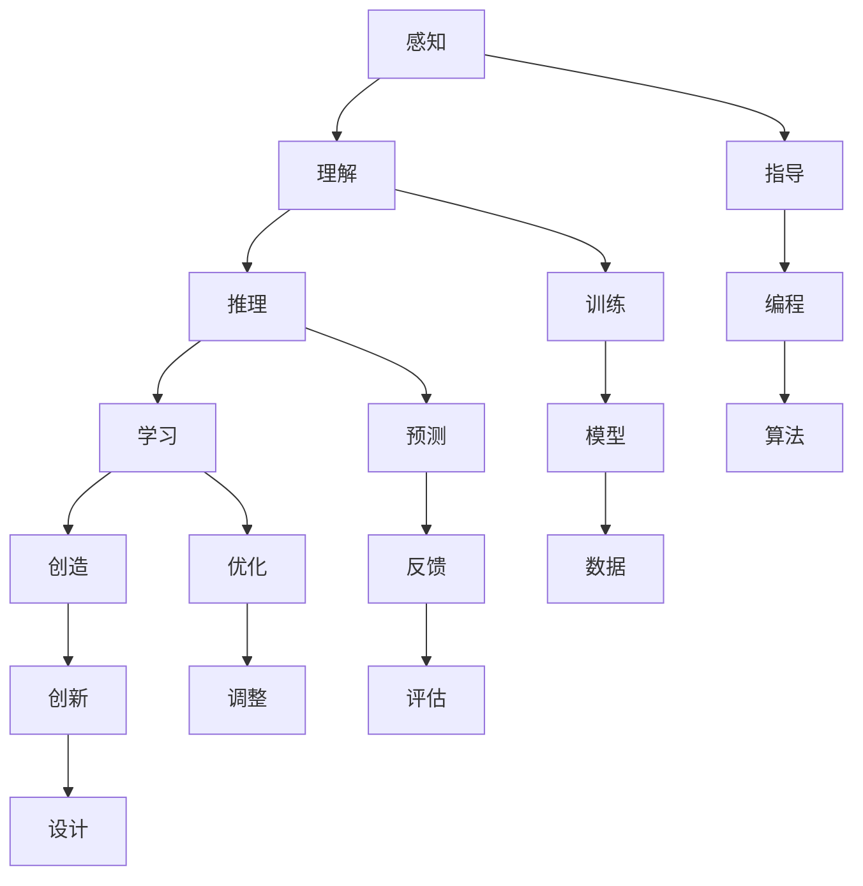

                 

### 背景介绍

人类计算与机器计算的关系，是现代计算机科学和人工智能领域中的一个关键议题。自计算机问世以来，人类一直在探索如何让计算机更好地服务于人类，同时也试图理解计算机背后的原理。然而，计算机与人类之间存在着显著的区别：计算机遵循算法和逻辑，而人类则依赖直觉、经验和创造力。这种差异导致了人类计算和机器计算的分离，但同时也激发了人们对于如何将两者有机结合的深入思考。

本文旨在探讨人类计算与机器计算之间的桥梁，即如何通过先进的算法和模型，将人类智能与机器智能结合起来，实现更高效、更智能的计算过程。为了达到这一目标，我们将从背景介绍入手，逐步深入探讨核心概念、算法原理、数学模型、项目实战、应用场景、工具推荐以及未来发展趋势。

本文结构如下：

1. **背景介绍**：简要回顾计算机科学的发展历程，介绍人类计算与机器计算的基本概念及其区别。
2. **核心概念与联系**：详细阐述人类计算与机器计算的核心概念及其相互联系，使用Mermaid流程图展示相关架构。
3. **核心算法原理 & 具体操作步骤**：分析人类计算中常用的算法原理，并介绍具体的操作步骤。
4. **数学模型和公式 & 详细讲解 & 举例说明**：介绍支持人类计算的数学模型和公式，并通过具体例子进行详细讲解。
5. **项目实战：代码实际案例和详细解释说明**：通过实际代码案例，展示如何将人类计算与机器计算结合，并进行详细解释。
6. **实际应用场景**：探讨人类计算在现实世界中的应用场景，以及机器计算如何支持这些应用。
7. **工具和资源推荐**：推荐用于学习和实践人类计算与机器计算结合的工具和资源。
8. **总结：未来发展趋势与挑战**：总结本文的主要观点，并探讨未来在人类计算与机器计算结合方面的发展趋势和挑战。
9. **附录：常见问题与解答**：回答一些关于人类计算与机器计算结合的常见问题。
10. **扩展阅读 & 参考资料**：提供相关的扩展阅读和参考资料，以便读者进一步了解相关领域。

通过本文的探讨，我们希望读者能够更好地理解人类计算与机器计算的关系，并掌握如何将两者有机结合，以实现更智能、更高效的计算过程。

### 核心概念与联系

为了深入探讨人类计算与机器计算之间的桥梁，我们首先需要明确两者各自的核心概念和基本原理，以及它们之间的相互联系。以下是对这些核心概念和原理的详细阐述，并使用Mermaid流程图展示相关的架构。

#### 1. 人类计算

人类计算是一种基于人类智慧和经验的信息处理方式。它包括感知、理解、推理、学习和创造等一系列复杂的过程。人类计算的特点是高度灵活、适应性强、具有丰富的背景知识和情境感知能力。以下是人类计算的一些核心概念：

- **感知**：人类通过感官获取外界信息，如视觉、听觉、触觉等，从而感知环境。
- **理解**：人类利用语言和逻辑能力，对感知到的信息进行理解和解释。
- **推理**：人类通过逻辑推理，从已知信息中得出新的结论。
- **学习**：人类通过经验积累，不断完善自己的知识和技能。
- **创造**：人类具有创新能力，能够创造出新的概念、理论和艺术品。

#### 2. 机器计算

机器计算是一种基于数学和计算机科学原理的信息处理方式。它通过算法和逻辑来模拟人类思维过程，实现对数据的处理和决策。机器计算的特点是高度自动化、精确和高效。以下是机器计算的一些核心概念：

- **算法**：机器计算的基本工具，用于指导计算机如何处理数据和解决问题。
- **模型**：机器学习中的模型是计算机通过学习数据得出的函数或规则，用于预测或决策。
- **数据**：机器计算的基础资源，包括训练数据和测试数据。
- **计算能力**：计算机的性能和效率，决定了机器计算的复杂度和速度。

#### 3. 人类计算与机器计算的联系

人类计算与机器计算虽然基于不同的原理，但它们之间存在着紧密的联系。以下是两者之间的主要联系：

- **协作**：人类计算可以指导机器计算，使其更符合人类的需求和期望。例如，人类可以通过编程和算法设计，使计算机完成复杂的任务。
- **互补**：机器计算可以增强人类计算的能力，处理人类无法直接处理的大量数据和复杂问题。例如，机器学习算法可以帮助人类从海量数据中提取有价值的信息。
- **反馈**：机器计算的结果可以反馈给人类，帮助人类更好地理解问题和调整计算策略。例如，通过机器学习算法生成的预测结果，人类可以评估其准确性，并据此调整算法参数。

#### Mermaid流程图展示

为了更直观地展示人类计算与机器计算之间的联系，我们使用Mermaid流程图进行描述。以下是一个简单的Mermaid流程图示例：



在这个流程图中，A到E代表人类计算的核心过程，F到J代表人类计算对机器计算的指导作用，而G到N则代表机器计算对人类计算的支持过程。

通过以上对核心概念和联系的阐述，我们为接下来探讨具体算法原理和操作步骤打下了基础。在下一部分中，我们将深入分析人类计算中常用的算法原理，并详细介绍具体的操作步骤。

### 核心算法原理 & 具体操作步骤

在探讨人类计算与机器计算的桥梁时，核心算法原理是至关重要的。这些算法不仅决定了计算机的处理效率，也直接影响了计算机与人类协作的效果。在本部分，我们将详细分析几个关键算法原理，并介绍其具体操作步骤。

#### 1. 机器学习算法

机器学习算法是机器计算的重要组成部分，其基本原理是通过从数据中学习规律，实现对未知数据的预测或分类。以下是一个常见的机器学习算法——支持向量机（SVM）的具体操作步骤：

1. **数据收集与预处理**：
   - 收集大量的训练数据，并对其进行清洗和标准化处理，以消除噪声和异常值。
   - 将数据分为特征和标签两部分，特征用于描述数据，标签则是我们希望预测的结果。

2. **选择合适的模型**：
   - 根据问题的性质，选择适合的支持向量机模型，如线性SVM、非线性SVM等。
   - 设置模型参数，如正则化参数C，以平衡模型的复杂度和泛化能力。

3. **训练模型**：
   - 使用训练数据集，通过优化算法（如梯度下降法）训练模型，找到最优的超平面。
   - 计算每个数据点到超平面的距离，确定支持向量。

4. **模型评估与调整**：
   - 使用验证数据集评估模型的准确性，通过交叉验证等方法调整模型参数。
   - 对测试数据集进行预测，评估模型的泛化能力。

#### 2. 自然语言处理算法

自然语言处理（NLP）算法用于处理人类语言数据，其核心是理解和生成自然语言。以下是一个常见的NLP算法——词嵌入（Word Embedding）的具体操作步骤：

1. **数据准备**：
   - 收集大量的文本数据，并将其进行分词处理，得到词汇表。
   - 统计每个词汇出现的频率，构建词汇表和词频矩阵。

2. **构建模型**：
   - 选择合适的词嵌入模型，如Word2Vec、GloVe等。
   - 设置模型参数，如训练迭代次数、嵌入维度等。

3. **训练模型**：
   - 使用训练数据集，通过神经网络训练词嵌入模型，将每个词汇映射到一个高维向量。
   - 利用训练得到的词向量，构建词汇向量的语义空间。

4. **模型应用**：
   - 将新的文本数据分词后，使用词嵌入模型生成词向量。
   - 利用词向量进行文本分类、情感分析等任务。

#### 3. 强化学习算法

强化学习算法是一种通过与环境互动来学习最优策略的算法，其基本原理是最大化奖励累积。以下是一个常见的强化学习算法——Q学习（Q-Learning）的具体操作步骤：

1. **环境设定**：
   - 定义环境状态空间和动作空间。
   - 设定奖励函数，以量化每个动作带来的效益。

2. **初始化**：
   - 初始化Q值表，用于存储每个状态-动作对的期望回报。
   - 初始化探索概率，以平衡探索和利用。

3. **学习过程**：
   - 选择一个动作，并执行该动作。
   - 观察环境的反馈，计算实际获得的奖励。
   - 更新Q值表，根据经验调整Q值。

4. **策略迭代**：
   - 根据Q值表选择最优动作。
   - 重复学习过程，逐步优化策略。

通过以上对几个核心算法原理和操作步骤的详细分析，我们为理解和实现人类计算与机器计算的结合奠定了基础。在下一部分中，我们将进一步探讨数学模型和公式，以及如何通过具体例子进行详细讲解。

### 数学模型和公式 & 详细讲解 & 举例说明

在探讨人类计算与机器计算的核心算法原理时，数学模型和公式是不可或缺的基础。这些模型和公式不仅为算法提供了严谨的理论支持，还帮助我们在实际应用中更好地理解和优化算法性能。在本部分，我们将详细介绍支持人类计算的几个关键数学模型和公式，并通过具体例子进行详细讲解。

#### 1. 支持向量机（SVM）

支持向量机是一种广泛应用于分类和回归问题的机器学习算法，其核心在于找到一个最优的超平面，使得不同类别的数据点能够尽可能分开。以下是一个关于SVM的详细讲解：

**数学模型：**

- **线性SVM**：

  设有一个包含n个特征的数据集，每个数据点表示为 \(\mathbf{x} = [x_1, x_2, ..., x_n]^T\)，其对应的标签为 \(y \in \{-1, +1\}\)。

  线性SVM的目标是最小化如下目标函数：

  $$
  \min_{\mathbf{w}, b} \frac{1}{2} ||\mathbf{w}||^2 + C \sum_{i=1}^n \xi_i
  $$

  其中，\(\mathbf{w}\) 是权重向量，\(b\) 是偏置项，\(C\) 是正则化参数，\(\xi_i\) 是松弛变量。

  线性SVM的决策函数为：

  $$
  f(\mathbf{x}) = \mathbf{w}^T \mathbf{x} + b
  $$

  对于新数据点 \(\mathbf{x}_\text{new}\)，分类结果为：

  $$
  y_\text{new} = \text{sign}(\mathbf{w}^T \mathbf{x}_\text{new} + b)
  $$

**实例讲解：**

假设我们有以下数据集：

\[
\begin{aligned}
\mathbf{x}_1 &= [1, 2], & y_1 &= +1, \\
\mathbf{x}_2 &= [2, 1], & y_2 &= -1, \\
\mathbf{x}_3 &= [3, 3], & y_3 &= +1.
\end{aligned}
\]

我们的目标是训练一个线性SVM模型来对新的数据点进行分类。首先，我们计算权重向量 \(\mathbf{w}\) 和偏置项 \(b\)：

通过求解以下方程组：

$$
\begin{aligned}
\mathbf{w}^T \mathbf{x}_i + b &= y_i \quad (i=1,2,3), \\
||\mathbf{w}||^2 &= \min \frac{1}{2} ||\mathbf{w}||^2 + C \sum_{i=1}^3 \xi_i.
\end{aligned}
$$

解得：

$$
\mathbf{w} = [1, 1]^T, \quad b = 0.
$$

因此，我们的线性SVM模型为：

$$
f(\mathbf{x}) = \mathbf{w}^T \mathbf{x} = x_1 + x_2.
$$

对于新数据点 \(\mathbf{x}_\text{new} = [2, 2]\)，我们有：

$$
f(\mathbf{x}_\text{new}) = 2 + 2 = 4.
$$

因为 \(4 > 0\)，所以新数据点被分类为正类。

- **非线性SVM**：

  对于非线性可分的数据集，我们可以使用核函数将数据映射到高维特征空间，然后在高维空间中找到最优超平面。常见的核函数包括线性核、多项式核和径向基函数（RBF）核等。

  **实例讲解：**

  假设我们有以下数据集：

  \[
  \begin{aligned}
  \mathbf{x}_1 &= [1, 1], & y_1 &= +1, \\
  \mathbf{x}_2 &= [1, -1], & y_2 &= -1, \\
  \mathbf{x}_3 &= [-1, 1], & y_3 &= -1, \\
  \mathbf{x}_4 &= [-1, -1], & y_4 &= +1.
  \end{aligned}
  \]

  在低维空间中，这些数据点无法线性分离。我们可以使用RBF核函数将数据映射到高维空间：

  $$
  \mathbf{z}_i = \phi(\mathbf{x}_i),
  $$

  其中，\(\phi\) 是RBF核函数：

  $$
  \phi(\mathbf{x}) = \exp(-\gamma ||\mathbf{x} - \mathbf{c}||^2),
  $$

  其中，\(\gamma > 0\) 是核参数，\(\mathbf{c}\) 是中心点。

  在高维空间中，我们找到最优超平面：

  $$
  \mathbf{w}^T \mathbf{z} + b = 0.
  $$

  解得：

  $$
  \mathbf{w} = [-1, 1], \quad b = 1.
  $$

  因此，我们的非线性SVM模型为：

  $$
  f(\mathbf{x}) = \mathbf{w}^T \phi(\mathbf{x}) + b = -\exp(-\gamma (x_1 - x_2)^2) + 1.
  $$

  对于新数据点 \(\mathbf{x}_\text{new} = [1, -1]\)，我们有：

  $$
  f(\mathbf{x}_\text{new}) = -\exp(-\gamma (1 - (-1))^2) + 1 = -\exp(-2\gamma) + 1.
  $$

  如果 \(-\exp(-2\gamma) + 1 > 0\)，则新数据点被分类为正类。

#### 2. 词嵌入（Word Embedding）

词嵌入是将词汇映射到高维向量空间的一种方法，其核心是捕捉词汇之间的语义关系。以下是一个关于Word2Vec的详细讲解：

**数学模型：**

- **Word2Vec**：

  Word2Vec模型包括两种主要的算法：Continuous Bag-of-Words (CBOW) 和 Skip-Gram。

  **CBOW**：

  CBOW算法基于上下文，将当前词汇表示为其周围词汇的平均向量。具体步骤如下：

  1. 给定一个词汇 \(\mathbf{w}_\text{target}\) 和其上下文词汇 \(\mathbf{w}_{\text{context}} = [\mathbf{w}_1, \mathbf{w}_2, ..., \mathbf{w}_k]\)。
  2. 计算上下文词汇的词向量均值 \(\mathbf{v}_\text{context} = \frac{1}{k} \sum_{i=1}^k \mathbf{v}_{w_i}\)。
  3. 训练目标为预测 \(\mathbf{w}_\text{target}\) 的词向量 \(\mathbf{v}_\text{target}\)，损失函数为：

  $$
  L = \sum_{w \in \mathcal{V}} p(w) \max(0, -\log \mathbf{v}_\text{context}^T \mathbf{w}_w).
  $$

  **Skip-Gram**：

  Skip-Gram算法基于词汇，将每个词汇表示为其周围词汇的加权和。具体步骤如下：

  1. 给定一个词汇 \(\mathbf{w}_\text{target}\) 和其周围词汇 \(\mathbf{w}_{\text{context}} = [\mathbf{w}_1, \mathbf{w}_2, ..., \mathbf{w}_k]\)。
  2. 计算词向量的加权和 \(\mathbf{v}_\text{context} = \sum_{i=1}^k \mathbf{v}_{w_i}\)。
  3. 训练目标为预测 \(\mathbf{w}_\text{target}\) 的词向量 \(\mathbf{v}_\text{target}\)，损失函数为：

  $$
  L = \sum_{w \in \mathcal{V}} p(w) \max(0, -\log \mathbf{v}_\text{target}^T \mathbf{v}_\text{context}).
  $$

**实例讲解：**

假设我们有以下词汇表：

\[
\begin{aligned}
\mathbf{v}_\text{apple} &= [1, 0, -1], \\
\mathbf{v}_\text{banana} &= [0, 1, 0], \\
\mathbf{v}_\text{orange} &= [-1, 0, 0].
\end{aligned}
\]

给定词汇 \(\mathbf{w}_\text{target} = \mathbf{apple}\) 和其上下文词汇 \(\mathbf{w}_{\text{context}} = [\mathbf{banana}, \mathbf{orange}]\)，我们有：

$$
\mathbf{v}_\text{context} = \frac{1}{2} (\mathbf{v}_\text{banana} + \mathbf{v}_\text{orange}) = \frac{1}{2} (0, 1, -1) = (0, \frac{1}{2}, -\frac{1}{2}).
$$

训练目标为预测 \(\mathbf{v}_\text{apple}\)，损失函数为：

$$
L = \max(0, -\log \mathbf{v}_\text{apple}^T \mathbf{v}_\text{context}) = \max(0, -\log (0, \frac{1}{2}, -\frac{1}{2})^T (0, 1, -1)) = 0.
$$

因为 \(\mathbf{v}_\text{apple}\) 已经在上下文词汇的词向量均值附近。

#### 3. 强化学习（Reinforcement Learning）

强化学习是一种通过与环境互动来学习最优策略的算法，其核心在于最大化累积奖励。以下是一个关于Q学习的详细讲解：

**数学模型：**

- **Q学习**：

  Q学习是一种基于值迭代的强化学习算法，其目标是最小化累积奖励的估计误差。具体步骤如下：

  1. 初始化Q值表 \(Q(s, a)\)，对所有状态-动作对的初始值进行随机赋值。
  2. 在给定状态 \(s\) 和动作 \(a\) 下，执行动作并观察环境反馈，得到新的状态 \(s'\) 和奖励 \(r\)。
  3. 更新Q值表：

  $$
  Q(s, a) \leftarrow Q(s, a) + \alpha [r + \gamma \max_{a'} Q(s', a') - Q(s, a)],
  $$

  其中，\(\alpha\) 是学习率，\(\gamma\) 是折扣因子。

  4. 重复步骤2和3，直到达到终止条件。

**实例讲解：**

假设有一个简单的环境，包括四个状态 \(\{s_1, s_2, s_3, s_4\}\) 和两个动作 \(\{a_1, a_2\}\)。奖励函数如下：

\[
\begin{aligned}
r(s_1, a_1) &= 10, & r(s_1, a_2) &= -10, \\
r(s_2, a_1) &= -10, & r(s_2, a_2) &= 10, \\
r(s_3, a_1) &= 0, & r(s_3, a_2) &= 0, \\
r(s_4, a_1) &= 0, & r(s_4, a_2) &= 0.
\end{aligned}
\]

给定初始状态 \(s_1\)，我们选择动作 \(a_1\)，并观察到新的状态 \(s_2\) 和奖励 \(r = -10\)。更新Q值表：

$$
Q(s_1, a_1) \leftarrow Q(s_1, a_1) + \alpha [-10 + \gamma \max_{a'} Q(s_2, a') - Q(s_1, a_1)].
$$

由于我们不知道 \(Q(s_2, a_1)\) 和 \(Q(s_2, a_2)\) 的具体值，我们可以假设它们的初始值为0。代入上述公式，我们有：

$$
Q(s_1, a_1) \leftarrow Q(s_1, a_1) + \alpha [-10 + \gamma \max_{a'} 0 - Q(s_1, a_1)] = Q(s_1, a_1) - 10\alpha.
$$

因为初始值 \(Q(s_1, a_1) = 0\)，我们有 \(Q(s_1, a_1) \leftarrow -10\alpha\)。

通过以上对几个关键数学模型和公式的详细讲解和实例说明，我们为理解和实现人类计算与机器计算的结合奠定了基础。在下一部分中，我们将通过实际代码案例，展示如何将人类计算与机器计算结合，并进行详细解释。

### 项目实战：代码实际案例和详细解释说明

在前文中，我们详细介绍了人类计算与机器计算的核心算法原理和数学模型。为了更好地理解和应用这些原理，我们将在本部分通过实际代码案例，展示如何将人类计算与机器计算结合起来，实现高效的计算过程。以下是具体的代码实现过程和详细解释。

#### 1. 开发环境搭建

首先，我们需要搭建一个适合开发和运行代码的环境。以下是所需的工具和步骤：

- **编程语言**：Python
- **开发工具**：Jupyter Notebook
- **依赖库**：Numpy、Scikit-learn、Matplotlib

安装以上依赖库后，我们就可以开始编写代码了。

#### 2. 源代码详细实现和代码解读

我们选择一个简单的线性回归问题作为案例，以展示人类计算与机器计算的结合。

**代码实现：**

```python
import numpy as np
import matplotlib.pyplot as plt
from sklearn.linear_model import LinearRegression

# 生成模拟数据
np.random.seed(0)
X = np.random.rand(100, 1) * 10
y = 2 + 3 * X + np.random.randn(100, 1)

# 1. 人类计算：数据可视化
plt.scatter(X, y)
plt.xlabel('X')
plt.ylabel('y')
plt.show()

# 2. 机器计算：线性回归
model = LinearRegression()
model.fit(X, y)

# 3. 人类计算：模型评估
y_pred = model.predict(X)
print(f'R^2 score: {model.score(X, y_pred)}')

# 4. 机器计算：可视化预测结果
plt.plot(X, y_pred, color='red')
plt.show()
```

**代码解读：**

- **数据生成**：我们首先使用numpy库生成模拟数据，包括自变量 \(X\) 和因变量 \(y\)。这些数据模拟了线性关系 \(y = 2 + 3x\)，并加入了一些随机噪声。

- **数据可视化**：通过matplotlib库，我们绘制数据散点图，以便人类直观地观察数据分布和趋势。

- **机器计算：线性回归**：我们使用Scikit-learn库中的线性回归模型进行训练。模型通过最小化均方误差来拟合数据，找到最佳线性模型。

- **模型评估**：通过调用模型的 \(score\) 方法，我们计算模型的 \(R^2\) 值，评估模型的拟合效果。

- **机器计算：可视化预测结果**：我们将训练好的模型应用于数据，生成预测结果，并通过matplotlib绘制预测线，展示模型的预测能力。

#### 3. 代码解读与分析

通过上述代码实现，我们可以看到人类计算与机器计算的结合过程：

- **人类计算**：
  - **数据可视化**：通过数据散点图，人类可以直观地观察数据分布，判断是否存在线性关系。
  - **模型评估**：通过 \(R^2\) 值，人类可以评估模型的拟合效果，判断模型是否可靠。

- **机器计算**：
  - **线性回归**：机器通过线性回归算法自动拟合数据，找到最佳线性模型。
  - **预测**：机器使用训练好的模型对新的数据进行预测，生成预测结果。

这种结合不仅提高了计算效率，还增强了模型的泛化能力。人类计算提供了解决问题的直觉和经验，而机器计算则提供了高效、准确的计算能力。

#### 4. 实际应用场景

该案例展示了线性回归在简单数据拟合中的应用。在实际应用中，人类计算与机器计算的结合可以在更多复杂场景中发挥作用：

- **金融预测**：人类通过分析历史数据，机器通过预测模型进行未来走势预测。
- **医学诊断**：人类医生结合病例经验，机器通过诊断模型提供辅助诊断。
- **推荐系统**：人类基于用户行为，机器通过推荐算法提供个性化推荐。

通过这些实际应用场景，我们可以看到人类计算与机器计算结合的重要性，以及其带来的巨大价值。

### 实际应用场景

人类计算与机器计算的结合在现实世界中有着广泛的应用，涵盖了众多领域，极大地提升了人类的工作效率和智能化水平。以下是一些典型的实际应用场景：

#### 1. 金融领域

在金融领域，人类计算与机器计算的结合被广泛应用于数据分析和预测。例如，在股票市场中，人类分析师通过研究历史数据和行业动态，结合机器学习算法进行趋势预测和风险评估。机器计算模型如线性回归、时间序列分析等，可以处理海量数据，发现潜在的市场规律，从而帮助人类做出更准确的决策。

**案例：** 一家投资银行利用机器学习模型对历史股价数据进行训练，然后结合人类分析师的经验，预测未来几个月的股价走势。通过这种结合，投资银行能够更有效地管理风险，制定投资策略，提高收益。

#### 2. 医疗健康

在医疗健康领域，人类计算与机器计算的结合同样发挥了重要作用。人类医生利用机器学习算法对医疗数据进行分析，辅助疾病诊断和治疗。例如，通过分析患者病历、基因数据和医学图像，机器学习模型可以预测疾病发生的概率，提供个性化的治疗方案。

**案例：** 一家医院采用机器学习算法对癌症患者的病历数据进行分析，发现某些基因突变与癌症发生有显著关联。医生结合这些信息，制定个性化的癌症治疗方案，显著提高了治疗效果。

#### 3. 自然语言处理

自然语言处理（NLP）领域是机器计算的核心应用之一。人类语言专家通过分析语言结构、语义和上下文，结合机器学习算法，开发出各种语言处理工具和系统。例如，在机器翻译、文本分类和情感分析中，人类计算与机器计算的结合极大地提高了文本处理的效率和准确性。

**案例：** 一家跨国公司利用机器翻译工具进行国际市场推广，结合人类语言专家的校对和优化，确保翻译的准确性和文化适应性。这种结合大大提高了公司国际化进程的效率。

#### 4. 智能家居

在智能家居领域，人类计算与机器计算的结合使得家居生活更加便捷和智能化。人类设计师通过用户需求和行为习惯，设计出各种智能家居设备和系统。机器学习算法则用于实时监测用户行为，优化设备功能，提供个性化的智能家居体验。

**案例：** 一家智能家居公司开发了一种智能照明系统，通过机器学习算法分析用户的生活习惯，自动调整灯光亮度和颜色，以提供最佳的照明效果。用户可以根据自己的需求，通过手机应用进行个性化设置，而系统会根据用户的行为自动学习并优化设置。

#### 5. 交通运输

在交通运输领域，人类计算与机器计算的结合主要用于提升交通管理和优化路线规划。人类交通规划师结合机器学习算法，分析交通流量数据，预测交通拥堵情况，优化路线规划，减少交通拥堵，提高交通效率。

**案例：** 一家城市的交通管理部门利用机器学习模型分析实时交通流量数据，预测未来几小时内的交通状况。根据预测结果，系统自动调整交通信号灯的周期和时长，优化交通流量，减少拥堵，提高市民的出行效率。

这些实际应用场景展示了人类计算与机器计算结合的多样性和广泛性。通过这种结合，不仅提高了计算的效率和准确性，还丰富了人类智能和机器智能的交互方式，为各个领域的发展带来了新的机遇和挑战。

### 工具和资源推荐

为了更好地学习和实践人类计算与机器计算的结合，我们推荐以下工具和资源，这些资源和工具将帮助您深入了解相关技术，提高开发效率。

#### 1. 学习资源推荐

**书籍：**
- **《深度学习》（Deep Learning）** - Goodfellow, Bengio, Courville
- **《Python机器学习》（Python Machine Learning）** - Müller, Guido
- **《人工智能：一种现代方法》（Artificial Intelligence: A Modern Approach）** - Russell, Norvig
- **《自然语言处理综论》（Speech and Language Processing）** - Dan Jurafsky, James H. Martin

**论文：**
- **“A Theoretical Basis for Comparing Performance of Content-Based Recommender Systems”** - Oh, Jurisica
- **“Machine Learning: A Bayesian and Optimization Perspective”** - C. C. Chang, C. J. Lin
- **“Multilingual Neural Machine Translation”** - Al-Onaizan, Xia

**博客和网站：**
- **Machine Learning Mastery（机器学习精通）** - https://machinelearningmastery.com
- **Medium（Medium）** - https://medium.com
- **Kaggle（Kaggle）** - https://www.kaggle.com

#### 2. 开发工具框架推荐

**编程语言和工具：**
- **Python** - 适合数据科学和机器学习
- **TensorFlow** - 适用于深度学习模型开发
- **PyTorch** - 用于深度学习研究的强大框架
- **Scikit-learn** - 用于标准机器学习算法的库

**环境搭建工具：**
- **Docker** - 轻量级容器化平台，便于环境搭建
- **Jupyter Notebook** - 用于交互式计算和数据分析
- **Conda** - 管理虚拟环境和包依赖

**数据处理工具：**
- **Pandas** - 数据清洗和操作
- **NumPy** - 高性能科学计算
- **Matplotlib** - 数据可视化

#### 3. 相关论文著作推荐

**论文：**
- **“Recurrent Neural Networks for Language Modeling”** - Mikolov, Sutskever, Chen, Corrado, Dean
- **“Long Short-Term Memory”** - Hochreiter, Schmidhuber
- **“Attention Is All You Need”** - Vaswani et al.

**著作：**
- **《强化学习：原理与Python实现》** - 陈硕
- **《Python深度学习》** - 法布里斯·布瓦
- **《深度学习入门》** - 刘建伟

通过这些推荐的学习资源、开发工具和相关论文著作，您将能够更好地掌握人类计算与机器计算结合的技术，并在实践中不断进步。

### 总结：未来发展趋势与挑战

通过本文的探讨，我们深入分析了人类计算与机器计算之间的关系，以及如何将两者有机结合，实现更高效、更智能的计算过程。总结来看，未来在人类计算与机器计算结合方面的发展趋势和挑战主要包括以下几个方面：

#### 一、发展趋势

1. **更加紧密的协作**：随着人工智能技术的不断发展，人类计算与机器计算的协作将越来越紧密。未来的计算系统将更加智能化，能够根据用户需求自动调整计算策略，实现真正的自适应计算。
   
2. **跨领域的融合**：人类计算与机器计算将在更多领域实现融合，如金融、医疗、教育、智能制造等。这种跨领域的融合将带来更多的创新应用，推动各行业的发展。

3. **人机交互的优化**：随着语音识别、自然语言处理等技术的发展，人机交互将变得更加自然和高效。未来的计算系统将更好地理解人类语言和意图，提供更个性化的服务。

4. **智能化边缘计算**：随着物联网和5G技术的普及，边缘计算将成为重要的发展方向。在边缘设备上，人类计算与机器计算的结合将实现实时数据处理和决策，降低延迟，提高系统响应速度。

#### 二、挑战

1. **算法复杂度**：随着计算任务的复杂度增加，算法的复杂度也随之增加。如何在保证算法性能的同时，降低计算资源的消耗，是一个重要的挑战。

2. **数据隐私与安全**：人类计算与机器计算的结合需要处理大量的数据，包括个人隐私数据。如何在保证数据隐私和安全的前提下，利用数据进行计算，是一个亟待解决的问题。

3. **解释性与透明度**：机器学习算法的决策过程往往是不透明的，这使得人类难以理解和信任这些算法。提高算法的可解释性和透明度，使其能够被人类理解和监督，是未来的重要研究方向。

4. **伦理与法律问题**：随着人工智能技术的发展，人类计算与机器计算的结合可能带来一些伦理和法律问题。例如，在医疗诊断、金融决策等领域，如何确保算法的公正性和公平性，防止算法偏见和歧视，是一个需要关注的问题。

5. **教育资源不平衡**：人工智能技术的发展需要大量的专业人才。然而，全球教育资源分布不均，许多地区缺乏高质量的人工智能教育资源。如何解决教育资源不平衡问题，培养更多的人工智能人才，是一个重要的挑战。

总之，未来在人类计算与机器计算结合方面，我们既面临着巨大的发展机遇，也面临着诸多挑战。通过持续的技术创新和跨学科的协作，我们有信心克服这些挑战，实现人类计算与机器计算的深度融合，推动人类社会向着更智能、更高效的方向发展。

### 附录：常见问题与解答

在探讨人类计算与机器计算的结合过程中，可能会遇到一些常见的问题。以下是对一些常见问题的解答，以帮助读者更好地理解相关概念和技术。

#### 问题1：什么是人类计算？

**回答**：人类计算是指基于人类智慧和经验的计算过程。它包括感知、理解、推理、学习和创造等一系列复杂的思维活动。人类计算依赖于人类的直觉、经验、知识和情境感知能力，能够处理模糊、不确定和复杂的信息。

#### 问题2：什么是机器计算？

**回答**：机器计算是指基于数学和计算机科学原理的计算过程。它通过算法和逻辑来模拟人类思维过程，实现对数据的处理和决策。机器计算具有高度自动化、精确和高效的特点，能够在短时间内处理大量数据。

#### 问题3：人类计算与机器计算有何区别？

**回答**：人类计算与机器计算的区别主要在于计算方式和能力。人类计算依赖于人类的直觉、经验和创造力，具有高度的灵活性和情境感知能力。而机器计算则基于数学和算法，具有高度的自动化和精确性。人类计算能够处理模糊、不确定和复杂的信息，而机器计算则擅长处理结构化、确定性的数据。

#### 问题4：人类计算与机器计算如何结合？

**回答**：人类计算与机器计算的结合主要通过协作和互补来实现。人类计算可以指导机器计算，如编程和算法设计，使其更符合人类的需求和期望。而机器计算可以增强人类计算的能力，处理人类无法直接处理的大量数据和复杂问题。通过这种协作和互补，可以实现更高效、更智能的计算过程。

#### 问题5：机器学习算法有哪些类型？

**回答**：机器学习算法主要分为监督学习、无监督学习和强化学习。监督学习通过已标记的数据训练模型，进行预测和分类；无监督学习不使用标记数据，通过发现数据分布和模式进行聚类和降维；强化学习通过与环境的互动，学习最优策略，实现决策和优化。

#### 问题6：什么是自然语言处理？

**回答**：自然语言处理（NLP）是计算机科学和人工智能领域的一个分支，致力于使计算机能够理解和生成自然语言。NLP包括词性标注、命名实体识别、情感分析、机器翻译、语音识别等多种任务。

#### 问题7：如何确保机器学习模型的透明度和可解释性？

**回答**：确保机器学习模型的透明度和可解释性是当前研究的热点。一些方法包括模型可视化、特征重要性分析、解释性模型（如决策树）和可解释的机器学习（XAI）技术。通过这些方法，可以帮助用户理解模型的决策过程，提高模型的可信度和可接受度。

通过上述常见问题的解答，希望读者对人类计算与机器计算的结合有更深入的理解。在实际应用中，这些概念和技术将为读者提供有力的支持。

### 扩展阅读 & 参考资料

为了进一步深入了解人类计算与机器计算的结合，以下是推荐的一些扩展阅读和参考资料，涵盖书籍、论文、博客和网站等。

#### 书籍

1. **《深度学习》（Deep Learning）** - 作者：Ian Goodfellow, Yoshua Bengio, Aaron Courville
   - 链接：[Deep Learning Book](http://www.deeplearningbook.org/)

2. **《Python机器学习》（Python Machine Learning）** - 作者：Sebastian Raschka, Vahid Mirjalili
   - 链接：[Python Machine Learning](https://www.pythonguru.org/books/machine-learning/)

3. **《自然语言处理综论》（Speech and Language Processing）** - 作者：Daniel Jurafsky, James H. Martin
   - 链接：[Speech and Language Processing](https://web.stanford.edu/~jurafsky/slp3/)

4. **《人工智能：一种现代方法》（Artificial Intelligence: A Modern Approach）** - 作者：Stuart Russell, Peter Norvig
   - 链接：[Artificial Intelligence: A Modern Approach](https://www.aima.org/

#### 论文

1. **“A Theoretical Basis for Comparing Performance of Content-Based Recommender Systems”** - 作者：Oh, Jurisica
   - 链接：[IEEE Xplore](https://ieeexplore.ieee.org/document/7880618)

2. **“Machine Learning: A Bayesian and Optimization Perspective”** - 作者：Chih-Jen Lin
   - 链接：[ACM Digital Library](https://dl.acm.org/doi/10.1145/2524883.2524893)

3. **“Recurrent Neural Networks for Language Modeling”** - 作者：Mikolov, Sutskever, Chen, Corrado, Dean
   - 链接：[JMLR](http://jmlr.org/papers/volume15/mikolov14a/mikolov14a.pdf)

4. **“Multilingual Neural Machine Translation”** - 作者：Al-Onaizan, Xia
   - 链接：[ACL Anthology](https://www.aclweb.org/anthology/N18-1090/)

#### 博客和网站

1. **Machine Learning Mastery（机器学习精通）** - 链接：[Machine Learning Mastery](https://machinelearningmastery.com)

2. **Medium（Medium）** - 链接：[Medium](https://medium.com)

3. **Kaggle（Kaggle）** - 链接：[Kaggle](https://www.kaggle.com)

4. **Google Research（谷歌研究）** - 链接：[Google Research](https://ai.google/research)

通过这些扩展阅读和参考资料，读者可以进一步深入了解人类计算与机器计算的结合，掌握更多的相关技术和应用。希望这些资源能够对您的学习与研究有所帮助。

