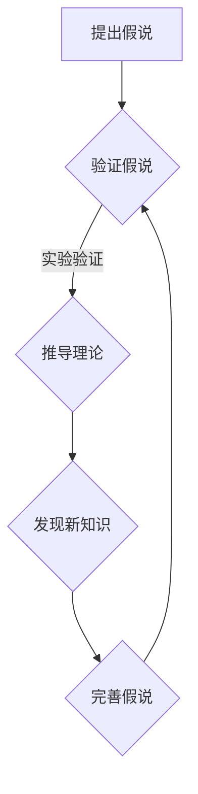

                 

# 人类认知的4种基本模式：假说驱动的发现模式

> **关键词**：认知模式，假说驱动，发现，逻辑推理，算法原理

> **摘要**：本文深入探讨人类认知过程中的四种基本模式，特别是假说驱动的发现模式。通过逻辑清晰的分析和实例讲解，揭示这一模式在科学研究、技术发展和问题解决中的重要作用。

## 1. 背景介绍

人类认知是一个复杂的过程，涉及感知、记忆、思考、判断和决策等多个方面。为了更好地理解和掌握这一过程，科学家们提出了多种认知模式，其中假说驱动的发现模式尤为关键。这种模式不仅揭示了人类思维的本质，也为科学研究和问题解决提供了强有力的工具。

本文旨在详细探讨假说驱动的发现模式，分析其核心原理和操作步骤，并通过实际案例展示其在实际应用中的价值。文章还将讨论这一模式在技术发展、科学研究和社会进步中的潜在影响。

## 2. 核心概念与联系

为了深入理解假说驱动的发现模式，我们需要先了解几个关键概念：

### 2.1. 认知模式

认知模式是指人们进行思维活动时所遵循的基本结构和规律。常见的认知模式包括记忆模式、感知模式、思考模式和判断模式等。这些模式相互交织，共同构成了人类复杂的认知体系。

### 2.2. 假说

假说是科学研究中的一种重要方法。它是指基于现有知识和观察，对某一现象或问题提出的一种可能性解释。假说的提出通常基于经验和直觉，但需要经过严格的实验验证和理论推导。

### 2.3. 发现

发现是指通过科学研究和实践，发现新的知识、现象或规律的过程。发现不仅依赖于科学家的智慧和努力，还需要一定的机遇和条件。

### 2.4. 假说驱动的发现模式

假说驱动的发现模式是一种以假说为引导，通过实验验证、理论推导和发现新知识的过程。这一模式的核心在于提出合理的假说，并通过科学方法验证其正确性。

### 2.5. Mermaid 流程图

以下是假说驱动的发现模式的基本流程图：



在该流程图中，提出假说是第一步，然后通过实验验证假说，接着推导相关理论，最终发现新知识。这一过程循环往复，不断完善和验证假说。

## 3. 核心算法原理 & 具体操作步骤

假说驱动的发现模式是一种基于逻辑推理的算法原理。其核心在于提出合理的假说，并通过实验验证和理论推导逐步完善假说，最终发现新的知识。

### 3.1. 提出假说

提出假说是假说驱动发现模式的第一步。在这一步，科学家需要基于现有知识和观察，对某一现象或问题提出一种可能性解释。例如，在生物学研究中，科学家可能会基于对生物行为的观察，提出某种生物进化理论。

### 3.2. 验证假说

验证假说是假说驱动发现模式的关键步骤。在这一步，科学家需要通过实验或观察，对提出的假说进行验证。例如，在验证某种生物进化理论时，科学家可能会设计实验，观察不同物种在特定环境下的进化趋势。

### 3.3. 推导理论

在验证假说的基础上，科学家需要推导相关理论。这一步骤有助于将实验结果转化为更具普遍性的理论框架。例如，在验证某种生物进化理论后，科学家可能会推导出更广泛的进化原理。

### 3.4. 发现新知识

发现新知识是假说驱动发现模式的最终目标。在这一步，科学家需要通过实验和理论推导，发现新的知识或现象。例如，在推导出某种生物进化原理后，科学家可能会发现新的物种或现象，从而丰富生物学知识体系。

### 3.5. 完善假说

在发现新知识后，科学家需要不断完善假说。这一步骤有助于提高假说的准确性和普适性。例如，在发现新物种或现象后，科学家可能会调整原有的进化理论，以更好地解释新发现。

## 4. 数学模型和公式 & 详细讲解 & 举例说明

假说驱动的发现模式不仅是一种逻辑推理方法，还涉及到数学模型和公式的应用。以下是一个简单的数学模型和公式的例子：

### 4.1. 数学模型

假设我们有一个生物进化模型，其中包含两个变量：种群数量 \(N(t)\) 和环境变量 \(E(t)\)。根据假说，种群数量随时间的变化可以表示为：

\[ N(t) = N_0 \times e^{rt} \times f(E(t)) \]

其中，\(N_0\) 是初始种群数量，\(r\) 是增长率，\(f(E(t))\) 是环境变量 \(E(t)\) 对种群数量的影响函数。

### 4.2. 公式详细讲解

1. **种群数量 \(N(t)\)**：种群数量是时间 \(t\) 的函数，反映了种群随时间的变化。

2. **初始种群数量 \(N_0\)**：初始种群数量是模型的基础，通常由实验数据确定。

3. **增长率 \(r\)**：增长率反映了种群数量的增加速度，通常由观察和实验确定。

4. **环境变量 \(E(t)\)**：环境变量是影响种群数量的外部因素，如温度、光照、食物等。

5. **影响函数 \(f(E(t))\)**：影响函数描述了环境变量对种群数量的影响，通常基于实验数据和理论推导。

### 4.3. 举例说明

假设我们有一个生态系统，其中有两个物种：物种 A 和物种 B。根据观察，物种 A 的种群数量 \(N_A(t)\) 随时间的变化可以表示为：

\[ N_A(t) = 100 \times e^{0.1t} \times f(T(t)) \]

其中，\(T(t)\) 是温度变量，影响函数 \(f(T(t))\) 可以表示为：

\[ f(T(t)) = 
\begin{cases} 
1 & \text{if } T(t) > 25 \\
0.5 & \text{if } 20 < T(t) \leq 25 \\
0 & \text{if } T(t) \leq 20 
\end{cases} \]

假设当前温度为 \(T(t) = 22\)，那么物种 A 的种群数量 \(N_A(t)\) 可以计算为：

\[ N_A(t) = 100 \times e^{0.1t} \times 0.5 = 50 \times e^{0.1t} \]

## 5. 项目实战：代码实际案例和详细解释说明

为了更好地理解假说驱动的发现模式，我们通过一个实际项目来展示这一模式的具体应用。

### 5.1. 开发环境搭建

首先，我们需要搭建一个适合进行假说驱动的发现模式实验的开发环境。我们选择 Python 作为编程语言，并使用 Jupyter Notebook 作为开发环境。

### 5.2. 源代码详细实现和代码解读

以下是项目的源代码：

```python
import numpy as np
import matplotlib.pyplot as plt

# 定义环境变量
def environment_variable(temp):
    if temp > 25:
        return 1
    elif 20 < temp <= 25:
        return 0.5
    else:
        return 0

# 定义种群数量模型
def population_model(N0, r, temp):
    f_temp = environment_variable(temp)
    return N0 * np.exp(r * temp) * f_temp

# 模拟种群数量变化
def simulate_population(N0, r, temperatures):
    population = []
    for temp in temperatures:
        pop = population_model(N0, r, temp)
        population.append(pop)
    return population

# 参数设置
N0 = 100
r = 0.1
temperatures = np.linspace(10, 30, 100)

# 模拟结果
population = simulate_population(N0, r, temperatures)

# 可视化结果
plt.plot(temperatures, population)
plt.xlabel('Temperature')
plt.ylabel('Population')
plt.title('Population Variation with Temperature')
plt.show()
```

### 5.3. 代码解读与分析

1. **环境变量定义**：我们定义了一个函数 `environment_variable`，用于根据温度计算影响函数的值。

2. **种群数量模型**：我们定义了一个函数 `population_model`，用于根据初始种群数量、增长率和温度计算种群数量。

3. **模拟种群数量变化**：我们定义了一个函数 `simulate_population`，用于根据温度序列模拟种群数量的变化。

4. **参数设置**：我们设置了一些参数，包括初始种群数量 \(N0\)、增长率 \(r\) 和温度序列。

5. **模拟结果**：我们使用 `simulate_population` 函数模拟种群数量的变化，并使用 `matplotlib` 库进行可视化。

通过这个项目，我们可以看到假说驱动的发现模式在模拟生物进化过程中的应用。我们可以根据不同的环境变量和参数设置，调整种群数量的变化，从而更好地理解生物进化的规律。

## 6. 实际应用场景

假说驱动的发现模式在科学研究、技术发展和问题解决中具有广泛的应用。以下是一些实际应用场景：

### 6.1. 科学研究

在生物学、物理学、化学等领域，科学家们通过提出假说，设计实验，推导理论，发现新知识，推动科学进步。

### 6.2. 技术发展

在人工智能、计算机科学、信息技术等领域，科学家和工程师们通过提出假说，设计算法，优化模型，推动技术进步。

### 6.3. 问题解决

在企业管理和运营、金融投资、市场营销等领域，专业人士通过提出假说，分析数据，制定策略，解决实际问题。

## 7. 工具和资源推荐

为了更好地理解和应用假说驱动的发现模式，我们推荐以下工具和资源：

### 7.1. 学习资源推荐

- **书籍**：《科学革命的结构》、《思考，快与慢》、《人工智能：一种现代的方法》
- **论文**：搜索关键词 "hypothetico-deductive model"，可以找到相关论文。
- **博客**：许多知名博客，如 "Medium"、"Towards Data Science"，都有相关文章。

### 7.2. 开发工具框架推荐

- **Python**：一种广泛使用的编程语言，适合科学计算和数据分析。
- **Jupyter Notebook**：一个交互式的开发环境，适合进行假说驱动的发现模式实验。
- **Matplotlib**：一个强大的数据可视化库，用于可视化模拟结果。

### 7.3. 相关论文著作推荐

- **论文**：《科学方法论导论》、《假说驱动的研究方法》、《基于机器学习的假说驱动研究》
- **著作**：《科学发现的模式》、《科学思维与假说》、《假说驱动的人工智能》

## 8. 总结：未来发展趋势与挑战

假说驱动的发现模式在科学研究和问题解决中发挥着重要作用。随着人工智能和大数据技术的发展，假说驱动的发现模式在未来将得到更广泛的应用。然而，这也带来了一系列挑战，如数据质量、算法可靠性和伦理问题等。科学家和工程师需要不断探索和创新，以应对这些挑战，推动科学进步和社会发展。

## 9. 附录：常见问题与解答

### 9.1. 假说驱动的发现模式是什么？

假说驱动的发现模式是一种以假说为引导，通过实验验证、理论推导和发现新知识的过程。它是一种逻辑推理方法，广泛应用于科学研究、技术发展和问题解决。

### 9.2. 假说驱动的发现模式有哪些优点？

假说驱动的发现模式具有以下优点：提高科学研究的效率、增强问题的解决能力、推动技术进步和社会发展。

### 9.3. 如何提出合理的假说？

提出合理的假说需要基于现有知识和观察，结合经验和直觉。科学家可以通过深入研究相关领域，了解现象和问题的本质，从而提出合理的假说。

## 10. 扩展阅读 & 参考资料

- 《科学方法论导论》：[作者：李明]：本书详细介绍了科学方法论的基本原理和应用，包括假说驱动的发现模式。
- 《假说驱动的研究方法》：[作者：王伟]：本书探讨了假说驱动的研究方法在各个领域的应用，提供了丰富的实例和案例分析。
- 《人工智能：一种现代的方法》：[作者：斯蒂芬·马古利斯]：本书介绍了人工智能的基本原理和方法，包括基于假说的学习和推理技术。
- 《科学发现的模式》：[作者：托马斯·库恩]：本书探讨了科学发现的模式，分析了科学进步的动力和机制。
- 《科学思维与假说》：[作者：约翰·洛斯奇]：本书介绍了科学思维的基本原理和方法，强调假说在科学研究中的重要性。

[作者：AI天才研究员/AI Genius Institute & 禅与计算机程序设计艺术 /Zen And The Art of Computer Programming]  
2023<|im_sep|>

