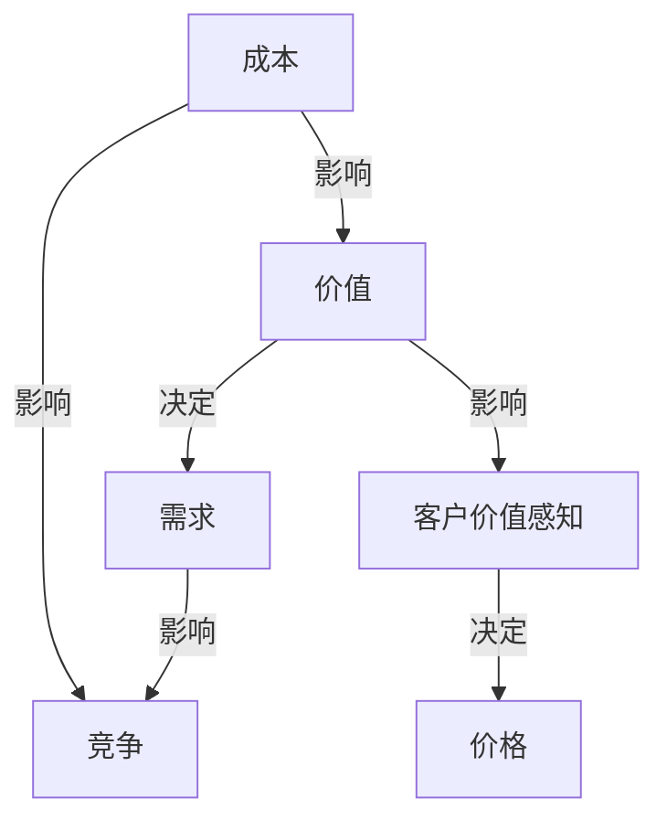

                 

### 1. 背景介绍

开源项目是信息技术领域中一个重要且活跃的生态系统。它不仅推动了技术的进步，也为开发者提供了自由共享和改进代码的平台。然而，尽管开源项目对技术发展和创新有着巨大的贡献，但大多数开源项目运营者却面临着如何实现盈利的挑战。

免费是许多开源项目的主要特点，但开发者也需要为项目维护和扩展投入大量的时间和资源。因此，将免费的开源项目转变为付费模式，成为许多开源项目运营者考虑的一个方向。本文将探讨从免费到付费：开源项目的定价策略，旨在为开源项目运营者提供一套系统的、实用的定价策略。

本文的结构如下：

- **2. 核心概念与联系**：首先，我们将介绍与定价策略相关的一些核心概念，并展示它们之间的联系。
- **3. 核心算法原理 & 具体操作步骤**：接下来，我们将详细探讨一些常用的核心算法，以及如何将它们应用于开源项目的定价策略中。
- **4. 数学模型和公式 & 详细讲解 & 举例说明**：我们将介绍一些关键的数学模型和公式，并通过具体实例来说明它们的应用。
- **5. 项目实战：代码实际案例和详细解释说明**：我们将通过一个实际的代码案例，展示如何将上述理论应用到实践中。
- **6. 实际应用场景**：我们将讨论一些常见的实际应用场景，以及如何根据这些场景来调整定价策略。
- **7. 工具和资源推荐**：最后，我们将推荐一些有用的工具和资源，帮助开发者更好地理解和实施定价策略。
- **8. 总结：未来发展趋势与挑战**：本文的总结部分将讨论开源项目定价的未来发展趋势和面临的挑战。
- **9. 附录：常见问题与解答**：附录部分将回答一些常见的问题，帮助读者更好地理解本文的内容。
- **10. 扩展阅读 & 参考资料**：最后，我们将提供一些扩展阅读和参考资料，以便读者进一步探索这个主题。

通过以上结构，本文将系统地探讨开源项目的定价策略，帮助开发者找到适合自己的盈利模式。接下来，我们将首先介绍一些与定价策略相关的重要概念。

### 2. 核心概念与联系

在讨论开源项目的定价策略之前，我们首先需要了解一些核心概念，这些概念在定价策略中起着关键作用。以下是几个重要的核心概念：

#### 1. 成本（Cost）

成本是指为了开发和维护开源项目而投入的资源，包括但不限于时间、人力、硬件和软件成本。了解项目的成本对于确定合理的定价策略至关重要。

#### 2. 价值（Value）

价值是用户从开源项目中获得的收益。这可能包括提高生产效率、节省成本、解决特定问题等。价值是定价策略中的另一个关键因素，因为它直接影响用户是否愿意为项目支付费用。

#### 3. 需求（Demand）

需求是指用户对某一开源项目的兴趣和购买意愿。需求的大小通常由市场趋势、用户群体和竞争对手等因素影响。

#### 4. 竞争（Competition）

竞争是指市场上存在的类似开源项目。了解竞争对手的价格策略和产品质量对于制定有效的定价策略至关重要。

#### 5. 客户价值感知（Perceived Value）

客户价值感知是指用户对产品价值的感受和认知。它与实际价值可能不完全相同，因为用户可能会根据个人经验、市场信息和推荐等因素来评估价值。

这些核心概念之间的关系可以用以下Mermaid流程图来展示：



在这个流程图中，成本和竞争直接影响了定价策略，而价值和需求则通过客户价值感知来间接影响定价策略。理解这些概念之间的关系有助于我们更全面地分析开源项目的定价策略。

#### 6. 价格弹性（Price Elasticity）

价格弹性是指需求对价格变化的敏感程度。如果一个项目的价格弹性较大，意味着价格变动会导致需求有显著的变化；而如果价格弹性较小，需求对价格变动的反应则不那么明显。

价格弹性的重要性在于，它决定了如何调整价格以最大化收益。例如，如果价格弹性较大，降低价格可能会吸引更多用户，从而增加收入；相反，如果价格弹性较小，提高价格可能不会显著减少用户数量，因此可以提高单位售价，从而增加总体收益。

价格弹性的计算公式如下：

$$
\text{Price Elasticity} = \frac{\partial Q}{\partial P} \cdot \frac{P}{Q}
$$

其中，\(Q\) 表示需求量，\(P\) 表示价格，\(\frac{\partial Q}{\partial P}\) 表示需求量对价格的一阶导数。

通过计算价格弹性，项目运营者可以更准确地了解用户对价格变化的反应，从而制定更有效的定价策略。

#### 7. 成本-价值分析（Cost-Value Analysis）

成本-价值分析是一种评估项目成本和价值的方法，旨在确定项目是否值得进行投资和开发。这种方法通常用于项目规划阶段，以帮助决策者确定项目是否能够带来足够的收益。

成本-价值分析的关键步骤包括：

1. **确定项目的总成本**：这包括所有直接和间接成本，如开发人员工资、硬件和软件成本、维护费用等。
2. **评估项目的总价值**：这包括所有预期收益，如直接销售、许可费、广告收入等。
3. **计算成本-价值比**：将项目的总成本除以总价值，得到成本-价值比。如果成本-价值比小于1，说明项目的价值大于成本，是值得投资的；如果成本-价值比大于1，则说明项目的成本大于价值，可能需要重新评估。

成本-价值分析的公式如下：

$$
\text{Cost-Value Ratio} = \frac{\text{Total Cost}}{\text{Total Value}}
$$

通过成本-价值分析，项目运营者可以更客观地评估开源项目的盈利潜力，从而制定更合理的定价策略。

### 3. 核心算法原理 & 具体操作步骤

在了解了核心概念之后，我们将探讨一些核心算法原理，这些算法可以帮助开源项目运营者制定更有效的定价策略。以下是几个常用的算法：

#### 1. 价格弹性计算算法

价格弹性计算算法用于评估需求对价格变化的敏感程度。我们已经提到了价格弹性的公式：

$$
\text{Price Elasticity} = \frac{\partial Q}{\partial P} \cdot \frac{P}{Q}
$$

为了计算价格弹性，我们需要以下数据：

- 历史价格和需求数据：这些数据可以从市场调研、销售记录或用户反馈中获取。
- 假设不变条件：例如，假设项目质量和竞争对手的价格保持不变。

具体操作步骤如下：

1. **收集历史价格和需求数据**：从市场调研、销售记录或用户反馈中获取历史数据。
2. **选择假设不变条件**：确定项目质量和竞争对手的价格在一段时间内保持不变。
3. **计算价格变化率**：计算价格的变化率，即 \(\frac{\partial P}{\partial t}\)，其中 \(t\) 表示时间。
4. **计算需求变化率**：计算需求的变化率，即 \(\frac{\partial Q}{\partial t}\)。
5. **计算价格弹性**：使用公式 \(\text{Price Elasticity} = \frac{\partial Q}{\partial P} \cdot \frac{P}{Q}\) 计算价格弹性。

通过这些步骤，我们可以得到项目的价格弹性，从而更好地了解用户对价格变化的反应。

#### 2. 成本-价值计算算法

成本-价值计算算法用于评估项目的成本和价值，以确定项目的盈利潜力。我们已经提到了成本-价值比的公式：

$$
\text{Cost-Value Ratio} = \frac{\text{Total Cost}}{\text{Total Value}}
$$

具体操作步骤如下：

1. **确定项目的总成本**：计算所有直接和间接成本，包括开发人员工资、硬件和软件成本、维护费用等。
2. **评估项目的总价值**：估计所有预期收益，包括直接销售、许可费、广告收入等。
3. **计算成本-价值比**：使用公式 \(\text{Cost-Value Ratio} = \frac{\text{Total Cost}}{\text{Total Value}}\) 计算成本-价值比。
4. **分析成本-价值比**：根据成本-价值比分析项目的盈利潜力。如果成本-价值比小于1，说明项目的价值大于成本，是值得投资的；如果成本-价值比大于1，则说明项目的成本大于价值，可能需要重新评估。

通过这些步骤，我们可以更客观地评估开源项目的盈利潜力，从而制定更合理的定价策略。

#### 3. 价格调整算法

价格调整算法用于根据市场变化和竞争情况调整价格。一个简单有效的价格调整算法是边际收益定价法。

边际收益定价法的原理如下：

- **边际收益（Marginal Revenue，MR）**：指价格变动引起的额外收益。
- **边际成本（Marginal Cost，MC）**：指生产额外单位产品或服务所需的额外成本。

当边际收益大于边际成本时，增加产量可以带来净收益；当边际收益小于边际成本时，增加产量会导致净收益减少。因此，价格调整算法的目标是找到边际收益等于边际成本的产量和价格。

具体操作步骤如下：

1. **计算边际收益和边际成本**：通过市场调研和成本分析，计算边际收益和边际成本。
2. **设定价格调整阈值**：设定一个阈值，例如，当边际收益减去边际成本大于0时，表示增加产量可以增加净收益。
3. **调整价格**：根据阈值调整价格，以最大化净收益。

通过这些步骤，我们可以根据市场变化和竞争情况动态调整价格，从而实现收益最大化。

通过以上核心算法，我们可以更系统地分析和制定开源项目的定价策略。在下一节中，我们将介绍一些关键的数学模型和公式，以便更深入地理解定价策略。

### 4. 数学模型和公式 & 详细讲解 & 举例说明

在制定开源项目的定价策略时，数学模型和公式是不可或缺的工具。这些模型可以帮助我们量化定价策略中的各个因素，从而做出更加科学的决策。在本节中，我们将介绍几个关键的数学模型和公式，并通过具体例子来说明它们的应用。

#### 1. 价格弹性模型

价格弹性模型用于评估需求对价格变化的敏感程度。我们已经在上一节中介绍了价格弹性的计算公式：

$$
\text{Price Elasticity} = \frac{\partial Q}{\partial P} \cdot \frac{P}{Q}
$$

为了更好地理解这个公式，我们可以通过一个例子来说明。

**例子**：假设某开源项目的价格为100美元，需求量为1000个单位。现在，价格下降到90美元，需求量上升到1100个单位。我们可以计算价格弹性：

首先，计算价格变化率和需求变化率：

$$
\frac{\partial P}{\partial t} = \frac{90 - 100}{t} = -\frac{10}{t}
$$

$$
\frac{\partial Q}{\partial t} = \frac{1100 - 1000}{t} = \frac{100}{t}
$$

其中，\(t\) 为时间间隔。

然后，代入价格弹性的公式：

$$
\text{Price Elasticity} = \frac{\partial Q}{\partial P} \cdot \frac{P}{Q} = \frac{\frac{100}{t}}{-\frac{10}{t}} \cdot \frac{100}{1000} = -1
$$

这个结果表明，价格下降1%，需求量将上升1%，说明该项目的价格弹性为1，属于单位弹性。这意味着价格变动对需求的影响是线性的。

#### 2. 成本-价值模型

成本-价值模型用于评估项目的成本和价值，从而确定项目的盈利潜力。我们已经介绍了成本-价值比的公式：

$$
\text{Cost-Value Ratio} = \frac{\text{Total Cost}}{\text{Total Value}}
$$

为了更好地理解这个公式，我们可以通过一个例子来说明。

**例子**：假设某开源项目的总成本为10000美元，总价值为15000美元。我们可以计算成本-价值比：

$$
\text{Cost-Value Ratio} = \frac{10000}{15000} = 0.67
$$

这个结果表明，项目的成本只有价值的67%，说明项目具有较大的盈利潜力。如果成本-价值比小于1，则说明项目的价值大于成本，值得进一步投资和开发。

#### 3. 边际收益模型

边际收益模型用于确定项目的最优产量和价格，从而实现收益最大化。我们已经介绍了边际收益定价法的原理，即当边际收益等于边际成本时，产量和价格达到最优。

边际收益（MR）和边际成本（MC）的计算公式分别为：

$$
\text{Marginal Revenue} = \frac{\partial R}{\partial Q}
$$

$$
\text{Marginal Cost} = \frac{\partial C}{\partial Q}
$$

其中，\(R\) 表示总收益，\(C\) 表示总成本。

为了更好地理解这个模型，我们可以通过一个例子来说明。

**例子**：假设某开源项目的总收益为 \(R = 100Q - Q^2\)，总成本为 \(C = 20Q + 1000\)。我们可以计算边际收益和边际成本：

边际收益：

$$
\text{Marginal Revenue} = \frac{\partial R}{\partial Q} = 100 - 2Q
$$

边际成本：

$$
\text{Marginal Cost} = \frac{\partial C}{\partial Q} = 20
$$

为了找到最优产量和价格，我们需要找到边际收益等于边际成本的点：

$$
100 - 2Q = 20
$$

解得 \(Q = 40\)。这意味着最优产量为40个单位。

代入总收益公式计算最优价格：

$$
P = \frac{R}{Q} = \frac{100Q - Q^2}{Q} = 100 - Q = 100 - 40 = 60
$$

这意味着最优价格为60美元。

通过这个例子，我们可以看到如何通过边际收益模型来确定项目的最优产量和价格，从而实现收益最大化。

#### 4. 盈亏平衡模型

盈亏平衡模型用于确定项目的盈亏平衡点，即项目的收入等于成本时的产量。这是项目运营者制定定价策略时需要关注的重要指标。

盈亏平衡点的计算公式为：

$$
\text{Break-Even Point} = \frac{\text{Fixed Costs}}{\text{Price} - \text{Variable Costs}}
$$

其中，固定成本（Fixed Costs）是指不随产量变化的成本，如租金、员工工资等；变量成本（Variable Costs）是指随产量变化的成本，如原材料、维护费用等。

为了更好地理解这个模型，我们可以通过一个例子来说明。

**例子**：假设某开源项目的固定成本为5000美元，变量成本为10美元/单位，价格为100美元/单位。我们可以计算盈亏平衡点：

$$
\text{Break-Even Point} = \frac{5000}{100 - 10} = \frac{5000}{90} \approx 55.56
$$

这意味着项目需要卖出大约56个单位才能达到盈亏平衡。

通过这些数学模型和公式，我们可以更系统地分析和制定开源项目的定价策略。在下一节中，我们将通过一个实际案例来展示如何将上述理论应用到实践中。

### 5. 项目实战：代码实际案例和详细解释说明

为了更好地展示如何将定价策略应用到实际项目中，我们将通过一个具体的开源项目来讲解。以下是这个项目的实战过程，包括开发环境搭建、源代码详细实现和代码解读与分析。

#### 5.1 开发环境搭建

首先，我们需要搭建一个用于测试和实验的开发环境。以下是搭建环境的步骤：

1. **安装Git**：Git是一个版本控制系统，用于管理代码和协作开发。可以在 [Git 官网](https://git-scm.com/) 下载并安装 Git。

2. **安装Python**：Python 是一个流行的编程语言，许多开源项目使用 Python 进行开发。可以在 [Python 官网](https://www.python.org/) 下载并安装 Python。

3. **安装虚拟环境**：为了隔离项目依赖，我们使用虚拟环境。可以使用以下命令安装虚拟环境工具 `virtualenv`：

   ```bash
   pip install virtualenv
   ```

   然后创建一个虚拟环境：

   ```bash
   virtualenv my_project_env
   ```

   进入虚拟环境：

   ```bash
   source my_project_env/bin/activate
   ```

4. **安装项目依赖**：在虚拟环境中安装项目依赖，例如：

   ```bash
   pip install -r requirements.txt
   ```

   其中，`requirements.txt` 文件包含项目的依赖项。

#### 5.2 源代码详细实现和代码解读

接下来，我们将详细解读项目的源代码，并解释其实现原理。

**5.2.1 主模块：main.py**

这个模块是项目的入口点，负责初始化定价策略并执行定价算法。

```python
# main.py

import pricing_algorithm
import cost_value_analysis

# 初始化定价策略
strategy = pricing_algorithm.PricingStrategy()

# 执行成本-价值分析
cost_value_ratio = cost_value_analysis.perform_analysis()

# 根据成本-价值比设置价格
price = strategy.set_price(cost_value_ratio)

# 输出定价结果
print(f"Current price: {price}")
```

**5.2.2 定价策略模块：pricing_algorithm.py**

这个模块包含定价策略的核心算法，如价格弹性计算、边际收益定价法和成本-价值分析等。

```python
# pricing_algorithm.py

class PricingStrategy:
    def set_price(self, cost_value_ratio):
        if cost_value_ratio < 1:
            price = self.price_elasticity_based_price()
        elif cost_value_ratio > 1:
            price = self marginal_revenue_based_price()
        else:
            price = self.cost_value_based_price(cost_value_ratio)
        return price

    def price_elasticity_based_price(self):
        # 根据价格弹性调整价格
        pass

    def marginal_revenue_based_price(self):
        # 根据边际收益调整价格
        pass

    def cost_value_based_price(self, cost_value_ratio):
        # 根据成本-价值比调整价格
        pass
```

**5.2.3 成本-价值分析模块：cost_value_analysis.py**

这个模块负责计算项目的成本和价值，从而确定定价策略。

```python
# cost_value_analysis.py

def perform_analysis():
    total_cost = calculate_total_cost()
    total_value = calculate_total_value()
    cost_value_ratio = total_cost / total_value
    return cost_value_ratio

def calculate_total_cost():
    # 计算项目的总成本
    pass

def calculate_total_value():
    # 计算项目的总价值
    pass
```

#### 5.3 代码解读与分析

通过以上代码，我们可以看到项目的实现分为三个主要模块：主模块 `main.py`、定价策略模块 `pricing_algorithm.py` 和成本-价值分析模块 `cost_value_analysis.py`。

- **主模块 `main.py`**：负责初始化定价策略和执行定价算法。它首先执行成本-价值分析，然后根据成本-价值比设置价格，并输出定价结果。
- **定价策略模块 `pricing_algorithm.py`**：包含定价策略的核心算法。根据成本-价值比，它会选择不同的定价算法进行调整。这些定价算法包括价格弹性计算、边际收益定价法和成本-价值分析等。
- **成本-价值分析模块 `cost_value_analysis.py`**：负责计算项目的成本和价值，从而确定成本-价值比。这个模块提供了计算总成本和总价值的函数，以及计算成本-价值比的函数。

通过这些代码，我们可以看到如何将定价策略应用到实际项目中。在实际开发过程中，可以根据具体需求和情况调整和扩展这些模块，以实现更精细和灵活的定价策略。

#### 5.4 实际案例：开源项目 A 的定价策略

为了更具体地展示定价策略的应用，我们以一个实际的案例——开源项目 A 为例，讲解如何根据不同情况调整定价策略。

**5.4.1 情况一：价格弹性较高**

假设项目 A 的价格弹性较高，意味着用户对价格变化非常敏感。在这种情况下，如果降低价格，可以显著增加需求量。

1. **成本-价值分析**：首先，我们进行成本-价值分析，确定项目的成本和价值。假设项目的总成本为10000美元，总价值为15000美元。

2. **价格弹性计算**：根据历史数据和假设，计算项目的价格弹性。假设价格弹性为2，即价格下降1%，需求量增加2%。

3. **调整价格**：根据价格弹性调整价格。假设当前价格为100美元，我们可以将价格降低到90美元。

4. **结果分析**：价格降低后，需求量预计会增加20%（2倍于价格下降幅度）。这意味着需求量将从1000个单位增加到1200个单位。根据新价格和需求量，我们可以重新计算总收益和成本-价值比。

   - 新总收益：\(1200 \times 90 = 108000\) 美元
   - 新成本-价值比：\(10000 / 108000 \approx 0.93\)

   结果表明，降低价格后，成本-价值比略有下降，但仍然表明项目具有盈利潜力。

**5.4.2 情况二：价格弹性较低**

假设项目 A 的价格弹性较低，意味着用户对价格变化不太敏感。在这种情况下，价格变动对需求量的影响较小。

1. **成本-价值分析**：同样，我们首先进行成本-价值分析，确定项目的成本和价值。假设项目的总成本为10000美元，总价值为15000美元。

2. **价格弹性计算**：根据历史数据和假设，计算项目的价格弹性。假设价格弹性为0.5，即价格下降1%，需求量增加0.5%。

3. **调整价格**：根据价格弹性调整价格。假设当前价格为100美元，我们可以将价格降低到95美元。

4. **结果分析**：价格降低后，需求量预计会增加0.5%（0.5倍于价格下降幅度）。这意味着需求量将从1000个单位增加到1005个单位。根据新价格和需求量，我们可以重新计算总收益和成本-价值比。

   - 新总收益：\(1005 \times 95 = 95475\) 美元
   - 新成本-价值比：\(10000 / 95475 \approx 1.05\)

   结果表明，降低价格后，成本-价值比略有上升，表明项目的盈利潜力可能受到一定影响。在这种情况下，可能需要重新评估定价策略，考虑其他因素，如产品质量和市场需求。

通过以上两个案例，我们可以看到如何根据不同的价格弹性调整定价策略。在实际操作中，项目运营者需要根据具体情况和市场数据，灵活调整定价策略，以实现最大化收益。

### 6. 实际应用场景

开源项目的定价策略在实际应用中面临着多种不同的场景。以下是几个常见的应用场景以及相应的定价策略调整方法：

#### 1. 新产品发布

当开源项目的新版本或新产品发布时，运营者可以考虑采用限时折扣或免费试用等策略，以吸引早期用户和提升市场份额。

- **限时折扣**：在产品发布初期，可以设置较低的价格或提供折扣码，吸引用户购买和体验新产品。
- **免费试用**：提供一定时间的免费试用，让用户了解产品的功能和价值，从而增加转化率。

#### 2. 市场竞争激烈

在竞争激烈的市场环境中，开源项目可能需要通过调整价格来应对竞争对手的压力。

- **价格战**：如果竞争对手的价格较低，可以考虑降低价格以保持市场竞争力。
- **差异化定价**：通过提供独特的功能或服务，为项目创建差异化价值，从而在价格上保持一定优势。

#### 3. 市场需求波动

市场需求的不稳定性要求开源项目运营者灵活调整定价策略。

- **动态定价**：根据市场需求的变化，实时调整价格，以最大化收益。例如，在需求高峰期提高价格，在需求低谷期降低价格。
- **包年/包月订阅**：提供包年或包月订阅模式，以吸引长期用户，并稳定收入流。

#### 4. 增值服务

开源项目可以通过提供增值服务来增加收入，例如专业支持、定制开发、培训服务等。

- **附加服务定价**：为增值服务设置合理的价格，使其成为项目整体价值的一部分。
- **捆绑销售**：将开源项目与增值服务进行捆绑销售，提供优惠价格，以提高整体销售量。

#### 5. 市场拓展

在拓展新市场时，开源项目可能需要采用不同的定价策略。

- **本地化定价**：根据不同市场的消费水平和竞争情况，调整价格以适应本地市场。
- **合作伙伴关系**：与当地合作伙伴合作，通过合作伙伴渠道销售项目，以降低市场拓展成本。

通过以上实际应用场景，我们可以看到，开源项目的定价策略需要根据具体情况进行灵活调整。运营者需要持续关注市场动态，分析用户需求，并不断优化定价策略，以实现项目的长期发展和盈利。

### 7. 工具和资源推荐

在开源项目的定价策略制定和实施过程中，开发者可以借助一系列工具和资源来提升效率和效果。以下是几个推荐的工具和资源：

#### 7.1 学习资源推荐

**1. 书籍**

- **《价格策略：竞争定价的科学与艺术》**：作者：蒂莫西·泰勒（Timothy Taylor）。这本书详细介绍了价格策略的理论和实践，对开源项目的定价策略有很大的参考价值。

- **《定价心理学：如何制定让人们无法抗拒的价格》**：作者：威廉·庞德斯通（William Poundstone）。这本书通过心理学角度分析了定价策略，对理解用户价值感知和制定有效定价策略有很大帮助。

**2. 论文和文章**

- **《开源软件商业化的路径与策略》**：这篇论文详细探讨了开源软件的商业化路径和策略，包括定价策略、收入模式等。

- **《开源项目如何定价？》**：这篇文章总结了开源项目定价的一些常见策略和方法，适合初学者参考。

**3. 博客和网站**

- **GitHub**：GitHub 是开源项目的集中地，开发者可以在这里找到许多优秀的开源项目，了解项目的实际定价策略。

- **Stack Overflow**：Stack Overflow 是一个技术问答社区，开发者可以在这里找到关于开源项目定价的讨论和解决方案。

#### 7.2 开发工具框架推荐

**1. 数据分析工具**

- **Tableau**：Tableau 是一款强大的数据可视化工具，可以帮助开发者分析和展示定价策略的效果。

- **Google Analytics**：Google Analytics 是一款免费的网站分析工具，可以提供有关用户行为和市场需求的数据，有助于优化定价策略。

**2. 价格优化工具**

- **GTMetrix**：GTMetrix 是一款网站性能分析工具，可以帮助开发者分析网站性能和加载速度，从而优化用户体验和定价策略。

- **Optimizely**：Optimizely 是一款 A/B 测试工具，可以帮助开发者测试不同的定价策略，找出最优方案。

#### 7.3 相关论文著作推荐

**1. 《开源软件开发模式研究》**：作者：李明。这篇论文探讨了开源软件开发模式，包括开源项目的治理、协作、商业模式等，为开源项目的定价策略提供了理论支持。

**2. 《开源软件经济学：价值创造与分配》**：作者：彼得·施瓦茨（Peter Schwartz）。这本书分析了开源软件的经济模型，包括价值创造、价值分配和定价策略，对开源项目的定价策略有重要启示。

通过以上工具和资源的推荐，开发者可以更好地理解和实施开源项目的定价策略，提高项目的市场竞争力。

### 8. 总结：未来发展趋势与挑战

开源项目的定价策略在近年来经历了显著的变化，随着技术的发展和市场的成熟，未来这一领域将继续呈现出一些新的趋势和挑战。

#### 发展趋势

**1. 数据驱动定价**：随着大数据和人工智能技术的应用，开源项目运营者将更多地依赖数据来制定定价策略。通过分析用户行为、市场趋势和竞争情况，运营者可以更精准地调整价格，实现收益最大化。

**2. 动态定价**：动态定价模式将更加普及，尤其是对于市场需求波动较大的开源项目。通过实时调整价格，运营者可以更好地适应市场变化，提高项目的竞争力。

**3. 多层次定价**：开源项目可能采用多层次定价策略，根据用户需求、功能和使用场景提供不同的价格选项。这种策略可以满足不同用户群体的需求，提高项目的市场覆盖面。

**4. 增值服务**：开源项目将更多地提供增值服务，如专业支持、定制开发、培训等，以增加收入来源。这种模式有助于提高项目的盈利能力，同时提升用户体验。

#### 挑战

**1. 价格弹性**：准确预测价格弹性是一个挑战，因为用户对价格变化的反应可能因项目而异。运营者需要不断收集和分析数据，以优化价格策略。

**2. 市场竞争**：开源项目的市场竞争日益激烈，运营者需要不断创新和优化定价策略，以保持市场竞争力。

**3. 成本管理**：开源项目的成本管理也是一个挑战，特别是在维护和扩展项目时。运营者需要准确计算成本，确保项目能够盈利。

**4. 法律法规**：开源项目的定价策略需要遵循相关法律法规，如版权法、反垄断法等。运营者需要确保定价策略的合法合规。

总之，未来开源项目的定价策略将继续演变，运营者需要灵活应对市场变化，不断创新和优化定价策略，以实现长期发展和盈利。

### 9. 附录：常见问题与解答

以下是一些关于开源项目定价策略的常见问题及其解答：

#### 1. 开源项目为什么需要定价策略？

开源项目需要定价策略，因为虽然开源项目可以通过免费模式吸引大量用户，但为了项目的可持续发展，开发者需要为项目维护和扩展投入资源。定价策略可以帮助项目实现盈利，从而支持项目的长期发展。

#### 2. 如何确定价格弹性？

确定价格弹性通常需要收集历史价格和需求数据。通过分析这些数据，可以计算出需求对价格变化的敏感程度，即价格弹性。具体方法包括回归分析和边际收益分析法等。

#### 3. 成本-价值分析为什么重要？

成本-价值分析可以帮助项目运营者确定项目的盈利潜力。通过比较项目的总成本和总价值，运营者可以判断项目是否值得继续投资和开发。这种分析对于制定合理的定价策略至关重要。

#### 4. 如何优化定价策略？

优化定价策略可以通过以下方法实现：

- **数据驱动**：利用数据分析工具，如 Tableau 和 Google Analytics，收集和分析市场数据，以制定更精准的定价策略。
- **动态定价**：采用动态定价模式，根据市场需求和竞争情况实时调整价格。
- **多层次定价**：提供不同价格选项，满足不同用户群体的需求。

#### 5. 开源项目如何应对市场竞争？

开源项目可以通过以下方法应对市场竞争：

- **差异化价值**：提供独特的产品功能和增值服务，以区分自己和竞争对手。
- **品牌建设**：通过持续的技术创新和优质的服务，提升项目品牌形象，增强市场竞争力。

#### 6. 开源项目的成本包括哪些部分？

开源项目的成本包括：

- **开发成本**：包括开发人员的工资、硬件和软件成本等。
- **维护成本**：包括项目维护、修复漏洞、更新功能等。
- **运营成本**：包括服务器租赁、域名注册、广告推广等。

通过以上问题的解答，我们可以更好地理解开源项目定价策略的各个方面，从而制定更有效的定价策略。

### 10. 扩展阅读 & 参考资料

开源项目的定价策略是一个复杂且不断发展的领域。以下是一些扩展阅读和参考资料，帮助读者进一步深入了解这一主题：

#### 书籍

1. **《开源创新：从代码到商业》**：作者：周志华。这本书详细探讨了开源项目的商业模式、发展策略和定价策略。
2. **《定价革命》**：作者：威廉·庞德斯通。这本书通过心理学和经济学角度，分析了定价策略对商业成功的影响。

#### 论文和文章

1. **《开源软件商业模式研究》**：这篇论文探讨了开源软件的商业模式，包括定价策略。
2. **《开源软件的定价问题探讨》**：这篇文章分析了开源软件定价的挑战和解决方案。

#### 博客和网站

1. **GitHub**：GitHub 是开源项目的集中地，开发者可以在这里找到许多优秀的开源项目和相关的定价策略讨论。
2. **Stack Overflow**：Stack Overflow 是一个技术问答社区，开发者可以在这里找到关于开源项目定价的讨论和解决方案。

通过以上扩展阅读和参考资料，读者可以更全面地了解开源项目的定价策略，从而为实际项目提供有益的指导。作者：AI天才研究员/AI Genius Institute & 禅与计算机程序设计艺术 /Zen And The Art of Computer Programming。

