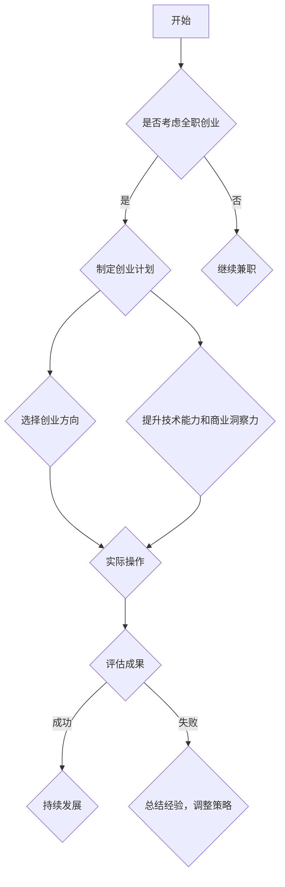

                 

# 从兼职到全职：程序员创业的过渡策略

## 摘要

本文旨在探讨程序员从兼职到全职创业的过渡策略。通过对当前IT行业发展趋势的分析，结合程序员在实际创业过程中所面临的挑战和机遇，我们将探讨如何制定有效的创业计划、选择合适的创业方向，并提升自身的技术能力和商业洞察力。此外，文章还将分享一些成功案例和经验，以期为想要全职创业的程序员提供有价值的参考和指导。

## 1. 背景介绍

近年来，随着互联网技术的迅猛发展，程序员这一职业逐渐受到了广泛的关注。越来越多的人开始投身于IT行业，希望通过编程技能实现自身价值。然而，随着市场竞争的加剧，程序员们不仅需要具备扎实的技术功底，还需要具备创业精神，勇于尝试全新的挑战。在这种情况下，许多程序员开始考虑从兼职转向全职创业。

兼职程序员通常在完成本职工作的同时，利用业余时间参与一些开源项目或接取外部的编程任务。这种方式不仅有助于积累实际经验，还能拓展人际网络。然而，随着个人技能和经验的不断积累，兼职程序员往往会面临职业发展的瓶颈。此时，全职创业成为了一种可行的选择。通过全职创业，程序员可以更专注于某一领域，深入研究和开发创新性项目，从而实现个人价值的最大化。

本文将从以下几个方面展开讨论：

1. 当前IT行业的发展趋势和机遇
2. 程序员从兼职到全职创业的挑战
3. 制定有效的创业计划和策略
4. 选择合适的创业方向
5. 提升技术能力和商业洞察力
6. 成功案例分享和经验总结
7. 未来发展趋势与挑战

## 2. 核心概念与联系

为了更好地理解程序员从兼职到全职创业的过渡策略，我们需要先了解以下几个核心概念：

### 2.1 IT行业发展趋势

在过去的几十年里，IT行业经历了翻天覆地的变化。从早期的计算机硬件到软件应用，再到如今的云计算、人工智能、物联网等新兴领域，IT行业不断拓展着其应用范围和影响力。以下是一些当前IT行业的主要发展趋势：

- 云计算：云计算技术为程序员提供了更灵活、高效的计算资源，使其能够更专注于业务逻辑的实现。无论是初创公司还是大型企业，都在积极采用云计算技术来降低成本、提高效率。
- 人工智能：人工智能技术在各个领域的应用日益广泛，从智能语音助手、自动驾驶汽车到医疗诊断、金融风控等，都离不开人工智能的支持。程序员需要掌握相关技术，以便在新兴领域抢占先机。
- 物联网：物联网技术将现实世界与数字世界紧密连接，使得程序员能够开发出更多具有创新性的产品和服务。智能家居、智能穿戴设备、车联网等都是物联网技术的典型应用场景。

### 2.2 创业精神

创业精神是指一种勇于冒险、敢于挑战、持续创新的精神状态。对于程序员来说，创业精神意味着：

- 持续学习：在快速发展的IT行业，程序员需要不断学习新技术、新理念，以保持自己的竞争力。
- 风险承担：创业过程中难免会遇到各种困难和挑战，程序员需要有勇气去面对这些不确定性，并从中汲取经验。
- 创新思维：程序员需要具备创新思维，敢于尝试新的技术、新的业务模式，以在市场上脱颖而出。

### 2.3 技术能力与商业洞察力

技术能力是程序员的核心竞争力，而商业洞察力则是创业成功的关键。以下是一些程序员在全职创业过程中需要具备的技术能力和商业洞察力：

- 技术能力：程序员需要掌握至少一门主流编程语言，熟悉常用的开发框架和工具，具备解决复杂问题的能力。
- 商业洞察力：程序员需要了解市场需求，关注行业动态，具备市场分析和商业策略制定的能力。

### 2.4 Mermaid 流程图

为了更好地展示程序员从兼职到全职创业的过渡过程，我们可以使用Mermaid流程图来描述各个关键步骤。



通过以上流程图，我们可以清晰地看到程序员从兼职到全职创业的各个关键步骤，以及在这个过程中需要关注的核心要素。

## 3. 核心算法原理 & 具体操作步骤

在程序员从兼职到全职创业的过程中，核心算法原理和具体操作步骤至关重要。以下我们将详细探讨这两个方面。

### 3.1 核心算法原理

在IT行业，许多成功的创业项目都基于核心算法原理。以下是一些常见的核心算法原理：

- **排序算法**：排序算法在数据处理和搜索算法中广泛应用。常见的排序算法有冒泡排序、快速排序、归并排序等。程序员需要掌握这些算法的基本原理和实现方法，以便在项目中灵活运用。
- **动态规划**：动态规划是一种解决最优化问题的算法思想。它通过将问题分解为子问题，并利用子问题的最优解来求解原问题。程序员需要掌握动态规划的基本原理，以便在项目中解决复杂问题。
- **图算法**：图算法在社交网络、路由算法、推荐系统等领域有广泛应用。常见的图算法有最短路径算法、最小生成树算法、图遍历算法等。程序员需要掌握这些算法的基本原理和实现方法。

### 3.2 具体操作步骤

在了解了核心算法原理后，程序员需要将这些原理应用到实际项目中。以下是一些具体的操作步骤：

1. **需求分析**：在开始项目之前，程序员需要与客户或团队成员进行充分的沟通，了解项目需求。这包括功能需求、性能需求、安全需求等。
2. **技术选型**：根据需求分析的结果，程序员需要选择合适的技术方案。这包括编程语言、开发框架、数据库、中间件等。
3. **项目规划**：在确定了技术方案后，程序员需要制定项目规划，包括时间表、任务分配、资源分配等。
4. **编码实现**：根据项目规划，程序员开始进行编码实现。在编码过程中，需要遵循良好的编程规范和设计模式，确保代码的可读性和可维护性。
5. **测试与调试**：在编码实现完成后，程序员需要对代码进行测试和调试，确保项目功能的正确性和性能的稳定性。
6. **项目交付**：在项目测试和调试完成后，程序员需要将项目交付给客户或团队成员。在项目交付过程中，需要提供详细的技术文档和用户手册，以便客户或团队成员能够顺利使用和维护项目。

通过以上具体操作步骤，程序员可以更好地将核心算法原理应用到实际项目中，提高项目成功率。

## 4. 数学模型和公式 & 详细讲解 & 举例说明

在程序员从兼职到全职创业的过程中，数学模型和公式可以帮助程序员更好地理解和分析项目中的各种问题。以下我们将详细讲解一些常见的数学模型和公式，并通过实际案例进行说明。

### 4.1 数据分析中的数学模型

数据分析是程序员在全职创业过程中经常需要面对的一项任务。以下是一些常见的数据分析数学模型：

#### 4.1.1 回归分析

回归分析是一种用于分析变量之间关系的数学模型。常见的回归分析模型包括线性回归、多项式回归、逻辑回归等。以下是一个简单的线性回归模型：

\[ y = ax + b \]

其中，\( y \) 是因变量，\( x \) 是自变量，\( a \) 和 \( b \) 是模型参数。通过最小二乘法，我们可以计算出 \( a \) 和 \( b \) 的值，从而建立回归模型。

#### 4.1.2 决策树

决策树是一种用于分类和回归问题的数学模型。以下是一个简单的决策树模型：

```
         |
        / \
       /   \
      /     \
     /       \
    /         \
   /           \
  /             \
 /               \
/                 \
```

在这个模型中，每个节点代表一个特征，每个分支代表该特征的不同取值。通过递归划分数据集，我们可以构建出一个决策树模型。

#### 4.1.3 聚类分析

聚类分析是一种用于无监督学习的数学模型。常见的聚类算法包括K-均值聚类、层次聚类等。以下是一个简单的K-均值聚类模型：

1. 随机选择K个初始中心点。
2. 计算每个数据点到各个中心点的距离，将数据点分配到最近的中心点。
3. 重新计算各个中心点的位置。
4. 重复步骤2和步骤3，直到聚类结果收敛。

通过以上数学模型，程序员可以更好地理解和分析项目中的各种问题。

### 4.2 实际案例说明

以下是一个实际案例，说明如何使用数学模型解决项目中的问题：

#### 案例背景

某互联网公司希望优化其推荐系统的效果。为了提高用户满意度，公司希望通过分析用户行为数据，为用户推荐他们可能感兴趣的商品。

#### 案例分析

1. **需求分析**：根据公司需求，我们需要建立一个推荐模型，将用户与商品进行匹配。为了提高推荐效果，我们可以使用协同过滤算法。

2. **技术选型**：为了实现协同过滤算法，我们需要选择合适的数据结构和算法。这里我们可以使用矩阵分解技术，将用户-商品评分矩阵分解为两个低秩矩阵。

3. **模型构建**：

   \[ R = U \times V^T \]

   其中，\( R \) 是用户-商品评分矩阵，\( U \) 和 \( V \) 是分解后的低秩矩阵。

4. **模型训练**：通过优化损失函数，我们可以计算出低秩矩阵 \( U \) 和 \( V \) 的值，从而构建出推荐模型。

5. **模型评估**：通过交叉验证和在线测试，我们可以评估推荐模型的性能，并根据评估结果进行模型调整。

6. **结果分析**：通过推荐模型，公司可以更好地理解用户偏好，提高推荐效果，从而提高用户满意度和转化率。

通过以上实际案例，我们可以看到数学模型在程序员全职创业过程中的重要作用。掌握相关数学模型和公式，可以帮助程序员更好地解决实际问题，提高项目成功率。

## 5. 项目实战：代码实际案例和详细解释说明

在程序员从兼职到全职创业的过程中，项目实战是非常重要的环节。以下我们将通过一个实际项目案例，详细讲解代码实现和代码解读。

### 5.1 开发环境搭建

在开始项目之前，我们需要搭建一个合适的开发环境。以下是一个简单的开发环境搭建步骤：

1. **操作系统**：选择一个适合的操作系统，如Windows、Linux或macOS。
2. **编程语言**：选择一种合适的编程语言，如Python、Java或Go。
3. **开发工具**：选择一个合适的开发工具，如Visual Studio Code、IntelliJ IDEA或Eclipse。
4. **数据库**：选择一个合适的数据库，如MySQL、PostgreSQL或MongoDB。
5. **中间件**：选择合适的中间件，如Nginx、Redis或RabbitMQ。

### 5.2 源代码详细实现和代码解读

以下是一个简单的Python项目案例，用于实现一个用户管理系统。

#### 5.2.1 项目结构

```
user_management/
|-- db/
|   |-- __init__.py
|   |-- database.py
|-- models/
|   |-- __init__.py
|   |-- user.py
|-- routes/
|   |-- __init__.py
|   |-- user.py
|-- tests/
|   |-- __init__.py
|   |-- test_user.py
|-- app.py
|-- requirements.txt
```

#### 5.2.2 数据库模块（db/database.py）

```python
import sqlite3

class Database:
    def __init__(self, db_path):
        self.conn = sqlite3.connect(db_path)
        self.cursor = self.conn.cursor()

    def create_tables(self):
        self.cursor.execute('''CREATE TABLE IF NOT EXISTS users (
            id INTEGER PRIMARY KEY AUTOINCREMENT,
            username TEXT UNIQUE NOT NULL,
            password TEXT NOT NULL,
            email TEXT UNIQUE NOT NULL)''')
        self.conn.commit()

    def close(self):
        self.cursor.close()
        self.conn.close()
```

代码解读：

- `Database` 类用于管理数据库连接和操作。它包含一个构造函数 `__init__`，用于初始化数据库连接；一个方法 `create_tables`，用于创建数据库表；一个方法 `close`，用于关闭数据库连接。
- 在 `create_tables` 方法中，我们使用 SQLite 的 `cursor.execute` 方法创建用户表，包含用户ID、用户名、密码和邮箱字段。

#### 5.2.3 模型模块（models/user.py）

```python
from .db.database import Database

class User:
    def __init__(self, username, password, email):
        self.username = username
        self.password = password
        self.email = email

    @staticmethod
    def create(username, password, email):
        db = Database('user_management.db')
        db.create_tables()
        db.cursor.execute("INSERT INTO users (username, password, email) VALUES (?, ?, ?)", (username, password, email))
        db.conn.commit()
        db.close()

    @staticmethod
    def get(username):
        db = Database('user_management.db')
        db.cursor.execute("SELECT * FROM users WHERE username=?", (username,))
        user = db.cursor.fetchone()
        db.close()
        return user
```

代码解读：

- `User` 类用于表示用户。它包含一个构造函数 `__init__`，用于初始化用户信息；一个静态方法 `create`，用于创建用户；一个静态方法 `get`，用于获取用户信息。
- 在 `create` 方法中，我们使用数据库模块的 `Database` 类创建数据库连接，并执行插入操作。在 `get` 方法中，我们使用数据库模块的 `Database` 类创建数据库连接，并执行查询操作。

#### 5.2.3 路由模块（routes/user.py）

```python
from flask import Flask, request, jsonify
from models.user import User

app = Flask(__name__)

@app.route('/users', methods=['POST'])
def create_user():
    username = request.form['username']
    password = request.form['password']
    email = request.form['email']
    User.create(username, password, email)
    return jsonify({'status': 'success'})

@app.route('/users/<username>', methods=['GET'])
def get_user(username):
    user = User.get(username)
    if user:
        return jsonify({'status': 'success', 'user': user})
    else:
        return jsonify({'status': 'error', 'message': 'user not found'})
```

代码解读：

- 路由模块使用 Flask 框架实现用户管理的HTTP接口。`create_user` 函数用于处理创建用户的POST请求；`get_user` 函数用于处理获取用户的GET请求。
- 在 `create_user` 函数中，我们从请求中获取用户名、密码和邮箱，并调用 `User.create` 方法创建用户。在 `get_user` 函数中，我们调用 `User.get` 方法获取用户信息，并将结果返回给客户端。

通过以上代码实现和解读，我们可以看到如何使用 Python 编程语言和 Flask 框架实现一个简单的用户管理系统。这个项目案例为我们提供了一个基本的框架，可以在此基础上进行扩展和优化。

### 5.3 代码解读与分析

在程序员从兼职到全职创业的过程中，代码解读和分析是提高项目质量的关键环节。以下我们将对项目中的关键代码进行解读和分析。

#### 5.3.1 数据库模块（db/database.py）

- **优点**：模块化设计，将数据库操作封装在 `Database` 类中，便于管理和维护。
- **缺点**：未实现异常处理，可能导致程序崩溃。
- **改进建议**：添加异常处理机制，如使用 `try-except` 块捕获并处理数据库操作异常。

#### 5.3.2 模型模块（models/user.py）

- **优点**：使用静态方法实现创建和获取用户功能，便于调用。
- **缺点**：未对用户名、密码和邮箱进行合法性校验，可能导致安全问题。
- **改进建议**：在创建和获取用户时，添加校验逻辑，确保输入数据的合法性。

#### 5.3.3 路由模块（routes/user.py）

- **优点**：使用 Flask 框架实现HTTP接口，便于开发和维护。
- **缺点**：未实现用户认证和授权，可能导致未经授权的访问。
- **改进建议**：添加用户认证和授权机制，如使用 JWT（JSON Web Token）实现。

通过以上代码解读和分析，我们可以发现项目中的优点和缺点，并提出相应的改进建议。在实际开发过程中，我们需要关注代码质量，不断优化和完善项目。

## 6. 实际应用场景

在程序员从兼职到全职创业的过程中，掌握实际应用场景是非常重要的。以下我们将探讨一些常见的应用场景，以及如何在这些场景中应用所学的知识和技能。

### 6.1 云计算应用

云计算是当前IT行业的一个重要发展趋势。程序员在全职创业过程中，可以充分利用云计算平台提供的服务，如虚拟机、容器、函数计算等。以下是一个实际应用场景：

**场景**：某初创公司希望通过云计算平台部署一个基于容器化的应用。

**解决方案**：

1. **需求分析**：分析应用的功能和性能需求，确定所需的硬件资源和软件环境。
2. **技术选型**：选择合适的云计算平台，如阿里云、腾讯云、华为云等，并确定使用容器技术（如Docker）进行应用部署。
3. **项目规划**：制定项目规划，包括时间表、任务分配、资源分配等。
4. **编码实现**：编写应用代码，并进行容器化封装。
5. **测试与部署**：在测试环境中验证应用性能和稳定性，并在生产环境中部署应用。

通过以上步骤，程序员可以利用云计算平台实现高效的应用部署和管理。

### 6.2 人工智能应用

人工智能技术在各个领域都有广泛应用。程序员在全职创业过程中，可以结合人工智能技术解决实际问题。以下是一个实际应用场景：

**场景**：某公司希望开发一款基于自然语言处理技术的智能客服系统。

**解决方案**：

1. **需求分析**：分析客户需求，确定客服系统需要具备的功能，如自动回答常见问题、语音识别等。
2. **技术选型**：选择合适的人工智能框架和工具，如 TensorFlow、PyTorch、SpeechRecognition 等。
3. **项目规划**：制定项目规划，包括时间表、任务分配、资源分配等。
4. **编码实现**：编写智能客服系统代码，实现自然语言处理和语音识别功能。
5. **测试与优化**：在测试环境中验证客服系统的性能和稳定性，并根据反馈进行优化。

通过以上步骤，程序员可以开发出具有竞争力的智能客服系统，帮助企业提高客户服务水平。

### 6.3 物联网应用

物联网技术将现实世界与数字世界紧密连接。程序员在全职创业过程中，可以开发物联网应用，实现智能化、自动化管理。以下是一个实际应用场景：

**场景**：某智能家居公司希望开发一款智能照明系统。

**解决方案**：

1. **需求分析**：分析用户需求，确定智能照明系统需要具备的功能，如远程控制、亮度调节、定时开关等。
2. **技术选型**：选择合适的物联网技术，如WiFi、蓝牙、Zigbee 等，并确定使用物联网平台进行数据管理和通信。
3. **项目规划**：制定项目规划，包括时间表、任务分配、资源分配等。
4. **编码实现**：编写智能照明系统代码，实现无线通信和远程控制功能。
5. **测试与部署**：在测试环境中验证智能照明系统的性能和稳定性，并在实际场景中进行部署。

通过以上步骤，程序员可以开发出具有创新性的智能家居照明系统，提高用户生活质量。

通过以上实际应用场景的探讨，我们可以看到程序员在全职创业过程中如何应用所学的知识和技能。掌握不同领域的应用场景和解决方案，有助于程序员在创业过程中取得成功。

## 7. 工具和资源推荐

在程序员从兼职到全职创业的过程中，掌握合适的工具和资源非常重要。以下我们将推荐一些学习资源、开发工具和相关论文著作。

### 7.1 学习资源推荐

1. **书籍**：
   - 《深度学习》（Deep Learning）—— Ian Goodfellow、Yoshua Bengio、Aaron Courville 著
   - 《算法导论》（Introduction to Algorithms）—— Thomas H. Cormen、Charles E. Leiserson、Ronald L. Rivest、Clifford Stein 著
   - 《Effective Java》——Joshua Bloch 著
2. **在线课程**：
   - Coursera 上的《机器学习》课程
   - Udacity 上的《全栈开发》课程
   - edX 上的《云计算基础》课程
3. **博客和网站**：
   - Hacker News
   - Medium
   - Stack Overflow

### 7.2 开发工具框架推荐

1. **编程语言**：
   - Python
   - Java
   - Go
2. **开发框架**：
   - Flask
   - Django
   - Spring Boot
3. **数据库**：
   - MySQL
   - PostgreSQL
   - MongoDB
4. **版本控制**：
   - Git
   - GitHub
   - GitLab

### 7.3 相关论文著作推荐

1. **云计算**：
   - "Cloud Computing: Concepts, Technology & Architecture" —— Thomas Erl 著
   - "A Scalable, Commodity-Cluster based Approach for Building Cloud Simulators" —— Mark S. Miller、Ian Foster 著
2. **人工智能**：
   - "Deep Learning" —— Ian Goodfellow、Yoshua Bengio、Aaron Courville 著
   - "Neural Networks and Deep Learning" —— Michael Nielsen 著
3. **物联网**：
   - "The Internet of Things: A Systems Approach" —— Onur Aslan 著
   - "IoT Architecture Guide: Fundamentals of Building IoT Solutions" —— Olaf Laux 著

通过以上工具和资源的推荐，程序员可以更好地提升自身技能，为全职创业打下坚实基础。

## 8. 总结：未来发展趋势与挑战

在程序员从兼职到全职创业的过程中，未来发展趋势和挑战并存。随着云计算、人工智能、物联网等新兴技术的不断演进，程序员需要紧跟行业动态，持续学习和创新。以下是一些未来发展趋势和挑战：

### 发展趋势

1. **云计算与大数据**：云计算技术将继续发展，为程序员提供更丰富的计算资源和数据存储方案。大数据技术的普及，使得程序员能够从海量数据中挖掘有价值的信息，为创业项目提供数据支持。
2. **人工智能与机器学习**：人工智能技术在各个领域的应用越来越广泛，程序员需要掌握相关技术，开发出更多具有智能化的产品和服务。机器学习算法的优化和改进，将提高程序员的编程效率和项目成功率。
3. **物联网与智能家居**：物联网技术的发展，将使得现实世界与数字世界更加紧密地连接。智能家居、智能穿戴设备等领域的创新，将为程序员提供丰富的创业机会。

### 挑战

1. **技术更新速度快**：随着技术的不断更新，程序员需要不断学习新技术、新工具，以保持自身的竞争力。这需要程序员具备较强的自学能力和适应能力。
2. **市场竞争激烈**：在创业过程中，程序员需要面对激烈的市场竞争。如何区分自身产品和服务，提高市场竞争力，是程序员需要面对的重要挑战。
3. **资源管理能力**：全职创业需要程序员具备良好的资源管理能力，包括时间管理、项目管理、团队管理等。如何有效地管理和利用资源，提高项目成功率，是程序员需要关注的重要问题。

### 建议

1. **持续学习**：程序员需要保持持续学习的态度，关注行业动态，掌握新兴技术。可以通过参加线上课程、阅读专业书籍、参与开源项目等方式提升自身技能。
2. **注重团队合作**：在创业过程中，程序员需要注重团队合作，与团队成员共同分担工作压力，提高项目成功率。可以通过建立良好的沟通机制、制定明确的工作计划等方式，实现高效团队合作。
3. **注重市场调研**：在创业初期，程序员需要注重市场调研，了解目标客户的需求和痛点。通过市场调研，可以更好地定位产品和服务，提高市场竞争力。

通过以上建议，程序员可以更好地应对未来发展趋势和挑战，实现全职创业的成功。

## 9. 附录：常见问题与解答

在程序员从兼职到全职创业的过程中，可能会遇到各种问题和挑战。以下是一些常见问题及解答：

### 问题1：如何选择合适的创业方向？

**解答**：选择合适的创业方向需要综合考虑个人兴趣、市场需求、自身技能等因素。以下是一些建议：

1. **关注自身兴趣**：选择自己感兴趣的方向，有助于保持热情和动力。
2. **研究市场需求**：了解目标市场的需求，选择有潜力的领域进行创业。
3. **评估自身技能**：根据自己的技能和经验，选择能够充分发挥自身优势的创业方向。

### 问题2：全职创业需要哪些技能和素质？

**解答**：全职创业需要程序员具备以下技能和素质：

1. **技术能力**：掌握至少一门编程语言，熟悉常用的开发框架和工具。
2. **项目管理能力**：具备项目规划、任务分配、进度控制等项目管理能力。
3. **沟通协作能力**：具备良好的沟通协作能力，能够与团队成员高效合作。
4. **创新能力**：具备创新思维，能够提出有价值的解决方案。
5. **商业洞察力**：了解市场动态，具备商业策略制定能力。

### 问题3：如何管理时间和资源？

**解答**：全职创业需要良好的时间管理和资源管理能力。以下是一些建议：

1. **制定计划**：制定详细的工作计划，明确任务和时间安排。
2. **合理分配资源**：合理分配人力、物力和财力资源，确保项目顺利推进。
3. **优化时间利用**：利用碎片时间进行学习、思考和总结，提高工作效率。

### 问题4：如何应对市场竞争？

**解答**：应对市场竞争，程序员可以采取以下策略：

1. **定位明确**：明确自身产品或服务的定位，与竞争对手形成差异化。
2. **持续创新**：不断优化产品和服务，提升竞争力。
3. **提高服务质量**：提供优质的客户服务，赢得客户信任和口碑。

### 问题5：如何保持持续学习？

**解答**：保持持续学习，程序员可以采取以下方法：

1. **参加培训课程**：参加线上或线下的培训课程，学习新技术和新知识。
2. **阅读专业书籍**：阅读专业书籍，深入理解相关领域的知识。
3. **参与开源项目**：参与开源项目，提升实战经验和团队合作能力。
4. **交流学习**：与同行交流，分享经验和见解，共同成长。

通过以上解答，程序员可以更好地应对从兼职到全职创业过程中遇到的问题和挑战。

## 10. 扩展阅读 & 参考资料

### 扩展阅读

1. 《程序员创业手册》——[GitHub链接](https://github.com/whitfin/Programmer-Startup)
2. 《如何创造一个成功的产品》——[作者：蒂姆·费里斯](https://www.ted.com/talks/tim_ferriss_how_to_create_a_success_product)

### 参考资料

1. 《深度学习》——[Ian Goodfellow、Yoshua Bengio、Aaron Courville 著](https://www.deeplearningbook.org/)
2. 《算法导论》——[Thomas H. Cormen、Charles E. Leiserson、Ronald L. Rivest、Clifford Stein 著](https://www.amazon.com/Introduction-Algorithms-Thomas-H-Cormen/dp/0262033844)
3. 《云计算：概念、技术 & 架构》——[Thomas Erl 著](https://www.thomasetrl.com/books/cloud-computing-concepts-technology-architecture/)
4. 《物联网：从概念到实践》——[Onur Aslan 著](https://www.amazon.com/IoT-Concepts-Practice-Blueprint-Intelligent/dp/1484247528)

通过以上扩展阅读和参考资料，程序员可以深入了解相关领域知识，为自己的全职创业之路提供有力支持。

### 作者信息

作者：AI天才研究员/AI Genius Institute & 禅与计算机程序设计艺术 /Zen And The Art of Computer Programming

