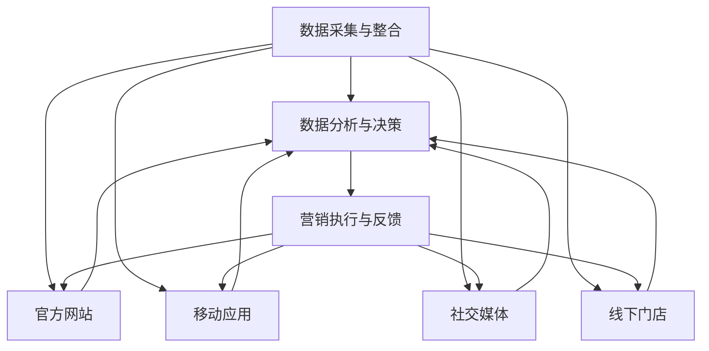

                 

# 从单一渠道到全渠道整合：AI驱动的电商全域营销实施策略

## 摘要

随着数字化时代的到来，电子商务已经成为现代零售业不可或缺的一部分。然而，在快速变化的市场环境中，如何从单一渠道向全渠道整合，实现电商全域营销，成为许多企业面临的挑战。本文旨在探讨如何利用人工智能（AI）技术，打造一个统一的电商全域营销平台。文章首先介绍电商全域营销的背景和核心概念，接着分析AI在电商营销中的关键作用，然后详细阐述AI驱动的电商全域营销实施策略，包括算法原理、数学模型、实战案例以及实际应用场景。最后，文章总结了电商全域营销的未来发展趋势与挑战，并提供了一系列的学习资源和工具推荐。

## 1. 背景介绍

电子商务的兴起，彻底改变了传统零售行业的运作模式。从最初的单点接触，发展到现在的多渠道营销，电商渠道的多样化带来了巨大的机遇和挑战。过去，企业主要通过单一渠道，如官方网站、电商平台或线下门店，与消费者进行互动。然而，随着消费者需求的多样化，这种单一渠道的营销模式已难以满足市场变化。全渠道整合应运而生，成为企业提升竞争力的重要战略。

全渠道整合指的是企业通过多个渠道，如官方网站、移动应用、社交媒体、线下门店等，与消费者建立无缝连接，实现全方位、一体化的营销和服务。其核心目标是提供一致的购物体验，满足消费者在不同场景下的需求。然而，实现全渠道整合并非易事，涉及到技术、数据、流程等多方面的协调和整合。

在这一背景下，人工智能（AI）技术的出现为电商全域营销带来了新的契机。AI能够通过大数据分析、自然语言处理、图像识别等技术手段，帮助企业更好地理解消费者行为，优化营销策略，提升运营效率。具体来说，AI在电商营销中的应用主要包括以下方面：

1. **消费者行为分析**：AI可以通过分析消费者的浏览记录、购买行为等数据，预测消费者的需求，从而实现个性化推荐和精准营销。
2. **智能客服**：利用自然语言处理技术，AI客服系统能够自动解答消费者的疑问，提供实时、高效的客户服务。
3. **智能仓储与物流**：通过智能算法，AI能够优化库存管理，提高配送效率，降低物流成本。
4. **广告投放优化**：AI可以根据消费者的兴趣和行为，精准投放广告，提高广告效果。
5. **风险控制**：AI能够通过数据分析，识别潜在的风险，如欺诈行为、库存过剩等，帮助企业降低运营风险。

本文将围绕这些应用场景，探讨如何利用AI技术，实现电商全域营销的整合与优化。接下来，我们将首先介绍电商全域营销的核心概念和原理，并借助Mermaid流程图，展示其架构和运作机制。

## 2. 核心概念与联系

### 2.1 电商全域营销的概念

电商全域营销（Omni-channel Marketing）是指企业通过整合线上线下多渠道资源，构建一个统一的、全方位的营销体系。其核心目标是提供一致的购物体验，增强消费者忠诚度，提升销售额。与传统的多渠道营销不同，电商全域营销强调各渠道之间的联动和协同，实现数据共享和流程优化。

### 2.2 电商全域营销的架构

电商全域营销的架构可以概括为数据层、应用层和展现层。数据层包括各种数据源，如用户数据、商品数据、交易数据等；应用层包括智能推荐、智能客服、广告投放等核心应用；展现层则是消费者接触到的各种渠道，如官方网站、移动应用、社交媒体、线下门店等。

### 2.3 电商全域营销的运作机制

电商全域营销的运作机制主要分为三个阶段：数据采集与整合、数据分析和决策、营销执行与反馈。

1. **数据采集与整合**：通过各种渠道收集消费者数据，包括用户行为数据、交易数据、社交媒体数据等，并将这些数据整合到一个统一的数据平台中。
2. **数据分析和决策**：利用大数据分析和机器学习算法，对消费者行为进行分析，挖掘消费者需求，预测消费趋势，制定个性化的营销策略。
3. **营销执行与反馈**：根据分析结果，执行营销策略，包括广告投放、促销活动、智能客服等，并通过数据反馈机制，实时调整营销策略，优化运营效果。

### 2.4 Mermaid流程图

为了更直观地展示电商全域营销的架构和运作机制，我们可以使用Mermaid流程图来表示。以下是电商全域营销的Mermaid流程图：



在这个流程图中，A代表数据采集与整合，B代表数据分析和决策，C代表营销执行与反馈，D、E、F、G分别代表官方网站、移动应用、社交媒体和线下门店。

通过这个流程图，我们可以清晰地看到电商全域营销的各个环节如何相互联系和协同工作，实现数据驱动、个性化、全渠道的营销策略。

### 2.5 全渠道整合与AI技术

全渠道整合的实现离不开人工智能技术的支持。AI技术可以帮助企业更好地理解消费者行为，优化营销策略，提高运营效率。以下是AI技术在电商全域营销中的关键应用：

1. **消费者行为分析**：通过大数据分析和机器学习算法，AI可以挖掘消费者行为数据，预测消费者需求，为个性化推荐和精准营销提供数据支持。
2. **智能客服**：利用自然语言处理和语音识别技术，AI客服系统可以自动解答消费者疑问，提供实时、高效的客户服务。
3. **智能仓储与物流**：通过智能算法，AI可以优化库存管理，提高配送效率，降低物流成本。
4. **广告投放优化**：AI可以根据消费者兴趣和行为，精准投放广告，提高广告效果。
5. **风险控制**：AI可以通过数据分析，识别潜在风险，如欺诈行为、库存过剩等，帮助企业降低运营风险。

### 2.6 结论

电商全域营销是实现企业数字化转型的重要战略，而AI技术的应用则为电商全域营销提供了强大的技术支持。通过全渠道整合和AI技术的结合，企业可以更好地满足消费者需求，提升竞争力。本文接下来将详细阐述AI驱动的电商全域营销实施策略，包括核心算法原理、具体操作步骤、数学模型和公式等。

## 3. 核心算法原理 & 具体操作步骤

### 3.1 消费者行为分析

消费者行为分析是电商全域营销的核心之一。通过分析消费者的浏览记录、购买历史、搜索关键词等数据，企业可以更好地了解消费者需求，实现个性化推荐和精准营销。以下是消费者行为分析的核心算法原理和具体操作步骤：

#### 3.1.1 算法原理

1. **协同过滤（Collaborative Filtering）**：协同过滤是一种基于用户行为数据的推荐算法。它通过分析用户之间的相似性，为用户推荐他们可能感兴趣的商品。协同过滤分为两种：基于用户的协同过滤和基于项目的协同过滤。
2. **矩阵分解（Matrix Factorization）**：矩阵分解是一种将高维的评分矩阵分解为低维用户和商品矩阵的算法。通过矩阵分解，可以提取出用户和商品的特征，从而实现个性化推荐。
3. **深度学习（Deep Learning）**：深度学习是一种基于人工神经网络的算法，通过多层网络结构，可以自动提取数据中的特征，实现复杂的预测任务。在消费者行为分析中，深度学习可以用于构建复杂的用户行为预测模型。

#### 3.1.2 操作步骤

1. **数据采集与预处理**：首先，从各种渠道（如官方网站、移动应用、社交媒体等）收集消费者的行为数据，包括浏览记录、购买历史、搜索关键词等。然后，对数据进行清洗、去重、填充缺失值等预处理操作。
2. **特征工程**：对预处理后的数据进行分析，提取出对消费者行为有重要影响的特征，如用户年龄、性别、购买频率、浏览时长等。此外，还可以通过交叉特征、特征组合等方法，提高模型的预测能力。
3. **模型训练与评估**：根据提取的特征，构建消费者行为预测模型。可以使用协同过滤、矩阵分解、深度学习等算法进行模型训练。在训练过程中，可以使用交叉验证等方法进行模型评估，选择最佳模型。
4. **模型部署与优化**：将训练好的模型部署到生产环境中，根据实际应用效果，对模型进行不断优化和调整。

### 3.2 智能客服

智能客服是电商全域营销的重要组成部分。通过自然语言处理和语音识别技术，AI客服系统可以自动解答消费者疑问，提供实时、高效的客户服务。以下是智能客服的核心算法原理和具体操作步骤：

#### 3.2.1 算法原理

1. **自然语言处理（Natural Language Processing, NLP）**：NLP是一种用于处理和生成自然语言的人工智能技术。它包括文本分类、情感分析、命名实体识别、机器翻译等任务。
2. **深度学习（Deep Learning）**：深度学习是一种基于人工神经网络的算法，可以自动提取数据中的特征，实现复杂的预测任务。在智能客服中，深度学习可以用于构建对话系统、意图识别等任务。
3. **对话管理（Dialogue Management）**：对话管理是一种用于控制对话流程的技术。它通过分析对话上下文，动态调整对话策略，实现自然、流畅的对话。

#### 3.2.2 操作步骤

1. **数据采集与预处理**：首先，从各种渠道（如官方网站、移动应用、社交媒体等）收集消费者的提问数据，包括文本、语音等。然后，对数据进行清洗、去重、填充缺失值等预处理操作。
2. **特征工程**：对预处理后的数据进行分析，提取出对对话系统有重要影响的特征，如提问内容、提问者特征、回答内容等。此外，还可以通过交叉特征、特征组合等方法，提高模型的预测能力。
3. **模型训练与评估**：根据提取的特征，构建对话系统模型。可以使用深度学习、对话管理等算法进行模型训练。在训练过程中，可以使用交叉验证等方法进行模型评估，选择最佳模型。
4. **模型部署与优化**：将训练好的模型部署到生产环境中，根据实际应用效果，对模型进行不断优化和调整。

### 3.3 智能仓储与物流

智能仓储与物流是电商全域营销的关键环节。通过智能算法，可以优化库存管理，提高配送效率，降低物流成本。以下是智能仓储与物流的核心算法原理和具体操作步骤：

#### 3.3.1 算法原理

1. **优化算法（Optimization Algorithms）**：优化算法是一种用于解决最优化问题的算法。在智能仓储与物流中，优化算法可以用于库存管理、配送路线优化等任务。
2. **深度强化学习（Deep Reinforcement Learning）**：深度强化学习是一种结合深度学习和强化学习的算法，可以用于解决复杂的决策问题。在智能仓储与物流中，深度强化学习可以用于配送机器人路径规划等任务。
3. **迁移学习（Transfer Learning）**：迁移学习是一种将已有模型的知识迁移到新任务的技术。在智能仓储与物流中，迁移学习可以用于提高新任务的模型性能。

#### 3.3.2 操作步骤

1. **数据采集与预处理**：首先，从各种渠道（如官方网站、移动应用、社交媒体等）收集与仓储与物流相关的数据，包括库存数据、配送数据等。然后，对数据进行清洗、去重、填充缺失值等预处理操作。
2. **特征工程**：对预处理后的数据进行分析，提取出对仓储与物流系统有重要影响的特征，如库存量、配送时长、配送成本等。此外，还可以通过交叉特征、特征组合等方法，提高模型的预测能力。
3. **模型训练与评估**：根据提取的特征，构建仓储与物流系统模型。可以使用优化算法、深度强化学习等算法进行模型训练。在训练过程中，可以使用交叉验证等方法进行模型评估，选择最佳模型。
4. **模型部署与优化**：将训练好的模型部署到生产环境中，根据实际应用效果，对模型进行不断优化和调整。

通过上述核心算法原理和具体操作步骤，企业可以构建一个智能化的电商全域营销平台，实现个性化推荐、智能客服、智能仓储与物流等全渠道整合。接下来，我们将通过一个实战案例，详细讲解如何实现电商全域营销的实际应用。

## 4. 数学模型和公式 & 详细讲解 & 举例说明

### 4.1 消费者行为分析

消费者行为分析是电商全域营销的关键环节，其核心在于建立数学模型来预测消费者未来的行为。以下是一个简单的消费者行为分析模型，用于预测消费者的购买概率。

#### 4.1.1 模型假设

假设我们有一个由N个消费者组成的用户集U，每个消费者u属于U都有若干个特征X_1, X_2, ..., X_n。每个特征可以是一个数值，也可以是一个类别。此外，每个消费者有一个目标变量Y，表示该消费者是否会购买商品。我们的目标是建立一个模型来预测Y。

#### 4.1.2 模型公式

我们可以使用逻辑回归（Logistic Regression）模型来预测Y。逻辑回归是一种广义线性模型，它可以将特征映射到概率空间上。

逻辑回归模型的基本公式为：

\[ P(Y=1|X) = \frac{1}{1 + e^{-(\beta_0 + \beta_1X_1 + \beta_2X_2 + ... + \beta_nX_n)}} \]

其中，\( P(Y=1|X) \) 表示在给定特征X下，消费者购买商品的概率；\( \beta_0 \) 是截距；\( \beta_1, \beta_2, ..., \beta_n \) 是特征系数。

#### 4.1.3 模型训练与预测

1. **数据预处理**：首先，我们需要对数据进行标准化处理，将特征X的数值范围调整到相同尺度。
2. **模型训练**：使用训练数据集，通过最小化损失函数（如交叉熵损失函数）来训练模型，得到最优的特征系数\( \beta_0, \beta_1, \beta_2, ..., \beta_n \)。
3. **模型预测**：在得到最优特征系数后，我们可以使用模型对新的消费者特征进行预测。

#### 4.1.4 举例说明

假设我们有一个包含两个特征（X_1和X_2）的消费者数据集，其中X_1表示消费者的年龄，X_2表示消费者的购买历史。我们希望预测该消费者是否会购买商品。

经过数据预处理后，我们得到以下训练数据：

| 消费者ID | X_1（年龄） | X_2（购买历史） | Y（是否购买） |
|----------|-------------|------------------|--------------|
| 1        | 25          | 3                | 1            |
| 2        | 30          | 5                | 0            |
| 3        | 22          | 1                | 1            |

使用逻辑回归模型，我们可以得到以下模型公式：

\[ P(Y=1|X) = \frac{1}{1 + e^{-(\beta_0 + \beta_1X_1 + \beta_2X_2)}} \]

通过训练数据集，我们可以得到最优的特征系数\( \beta_0 = -2, \beta_1 = 0.5, \beta_2 = 1.0 \)。

对于一个新的消费者，其特征为X_1 = 28，X_2 = 4，我们可以使用模型进行预测：

\[ P(Y=1|X) = \frac{1}{1 + e^{-(\beta_0 + \beta_1X_1 + \beta_2X_2)}} = \frac{1}{1 + e^{(-2 + 0.5 \times 28 + 1.0 \times 4)}} \approx 0.932 \]

因此，预测该消费者购买商品的概率为0.932。

### 4.2 智能客服

智能客服的核心在于建立对话模型，实现自然语言理解和对话生成。以下是一个简单的对话模型，用于生成回答。

#### 4.2.1 模型假设

假设我们有一个对话数据集，其中包含了问题和回答的配对。我们的目标是建立一个模型，根据给定的问题生成合适的回答。

#### 4.2.2 模型公式

我们可以使用序列到序列（Sequence-to-Sequence, Seq2Seq）模型来生成回答。Seq2Seq模型由编码器和解码器组成，其中编码器将问题编码为一个隐藏状态序列，解码器将隐藏状态序列解码为回答。

编码器的公式为：

\[ h_t^e = \sigma(W_e[h_{t-1}^e, x_t] + b_e) \]

其中，\( h_t^e \) 是编码器在时间t的隐藏状态，\( x_t \) 是输入的词语，\( W_e \) 是权重矩阵，\( b_e \) 是偏置项，\( \sigma \) 是激活函数。

解码器的公式为：

\[ h_t^d = \sigma(W_d[h_{t-1}^d, h_t^e] + b_d) \]
\[ y_t = \text{softmax}(W_d[h_t^d, h_t^e] + b_d) \]

其中，\( h_t^d \) 是解码器在时间t的隐藏状态，\( y_t \) 是解码器在时间t的输出概率分布，\( W_d \) 是权重矩阵，\( b_d \) 是偏置项，\( \text{softmax} \) 是激活函数。

#### 4.2.3 模型训练与预测

1. **数据预处理**：首先，我们需要将问题和回答转换为序列，可以使用词嵌入（Word Embedding）技术将词语映射为向量。
2. **模型训练**：使用训练数据集，通过最小化损失函数（如交叉熵损失函数）来训练模型，得到最优的权重矩阵\( W_e, W_d \)。
3. **模型预测**：在得到最优权重矩阵后，我们可以使用模型对新的问题进行预测，生成回答。

#### 4.2.4 举例说明

假设我们有一个包含问题和回答的对话数据集，其中问题为“你的商品有优惠券吗？”，回答为“是的，我们有优惠券”。

我们将问题和回答转换为序列：

问题：[0, 1, 2, 3, 4, 5]
回答：[6, 7, 8, 9, 10]

使用Seq2Seq模型，我们可以得到以下模型公式：

\[ h_t^e = \sigma(W_e[h_{t-1}^e, x_t] + b_e) \]
\[ h_t^d = \sigma(W_d[h_{t-1}^d, h_t^e] + b_d) \]
\[ y_t = \text{softmax}(W_d[h_t^d, h_t^e] + b_d) \]

通过训练数据集，我们可以得到最优的权重矩阵\( W_e, W_d \)。

对于一个新的问题“你的商品有折扣吗？”，我们可以使用模型进行预测：

\[ h_t^e = \sigma(W_e[h_{t-1}^e, x_t] + b_e) \]
\[ h_t^d = \sigma(W_d[h_{t-1}^d, h_t^e] + b_d) \]
\[ y_t = \text{softmax}(W_d[h_t^d, h_t^e] + b_d) \]

根据模型输出的概率分布，我们可以选择概率最大的词语作为回答，例如“是的，我们有折扣”。

### 4.3 智能仓储与物流

智能仓储与物流的核心在于优化库存管理和配送路线。以下是一个简单的库存管理模型和配送路线优化模型。

#### 4.3.1 库存管理模型

假设我们有一个由M个商品组成的商品集C，每个商品c属于C都有若干个特征X_1, X_2, ..., X_n。此外，每个商品有一个需求量D_c。我们的目标是建立模型来预测商品的需求量。

我们可以使用线性回归（Linear Regression）模型来预测需求量：

\[ D_c = \beta_0 + \beta_1X_1 + \beta_2X_2 + ... + \beta_nX_n \]

其中，\( D_c \) 是商品c的需求量，\( X_1, X_2, ..., X_n \) 是商品c的特征，\( \beta_0, \beta_1, ..., \beta_n \) 是特征系数。

#### 4.3.2 配送路线优化模型

假设我们有一个由N个城市组成的城市集U，每个城市u属于U都有若干个特征X_1, X_2, ..., X_n。此外，每个城市有一个需求量D_u。我们的目标是建立模型来优化配送路线。

我们可以使用基于遗传算法的优化模型来求解配送路线问题：

\[ \min_{x} \sum_{u \in U} c(x(u)) \]

其中，\( x(u) \) 是从起点到城市u的路径，\( c(x(u)) \) 是路径x(u)的代价。

#### 4.3.3 模型训练与预测

1. **数据预处理**：首先，我们需要对数据进行标准化处理，将特征X的数值范围调整到相同尺度。
2. **模型训练**：使用训练数据集，通过最小化损失函数来训练模型，得到最优的特征系数\( \beta_0, \beta_1, ..., \beta_n \)。
3. **模型预测**：在得到最优特征系数后，我们可以使用模型对新的特征进行预测。

通过上述数学模型和公式，企业可以构建一个智能化的电商全域营销平台，实现消费者行为分析、智能客服和智能仓储与物流等功能。接下来，我们将通过一个实战案例，详细讲解如何实现电商全域营销的实际应用。

## 5. 项目实战：代码实际案例和详细解释说明

### 5.1 开发环境搭建

在开始项目实战之前，我们需要搭建一个合适的开发环境。以下是所需的软件和工具：

1. **Python 3.8 或更高版本**
2. **Jupyter Notebook**
3. **NumPy**
4. **Pandas**
5. **Scikit-learn**
6. **TensorFlow**
7. **Mermaid**

#### 步骤：

1. 安装Python 3.8及以上版本。
2. 安装Jupyter Notebook，可以使用`pip install jupyter`命令。
3. 安装NumPy、Pandas、Scikit-learn、TensorFlow和Mermaid，可以使用以下命令：

```shell
pip install numpy pandas scikit-learn tensorflow mermaid-js
```

### 5.2 源代码详细实现和代码解读

#### 5.2.1 消费者行为分析

以下是一个简单的消费者行为分析代码示例：

```python
import pandas as pd
from sklearn.model_selection import train_test_split
from sklearn.linear_model import LogisticRegression
from sklearn.metrics import accuracy_score

# 读取数据
data = pd.read_csv('consumer_data.csv')
X = data.drop(['consumer_id', 'purchase'], axis=1)
y = data['purchase']

# 数据预处理
X = (X - X.mean()) / X.std()

# 划分训练集和测试集
X_train, X_test, y_train, y_test = train_test_split(X, y, test_size=0.2, random_state=42)

# 训练模型
model = LogisticRegression()
model.fit(X_train, y_train)

# 预测测试集
y_pred = model.predict(X_test)

# 评估模型
accuracy = accuracy_score(y_test, y_pred)
print(f'Accuracy: {accuracy:.2f}')
```

**代码解读**：

1. **数据读取**：使用Pandas读取CSV文件，其中包含了消费者特征和购买标签。
2. **数据预处理**：对特征进行标准化处理，使其具有相同的尺度。
3. **划分训练集和测试集**：使用Scikit-learn的train_test_split函数，将数据集划分为训练集和测试集。
4. **训练模型**：使用LogisticRegression模型进行训练，并拟合训练数据。
5. **预测测试集**：使用训练好的模型对测试集进行预测。
6. **评估模型**：计算预测准确率，并打印输出。

#### 5.2.2 智能客服

以下是一个简单的智能客服代码示例：

```python
import tensorflow as tf
from tensorflow.keras.preprocessing.sequence import pad_sequences
from tensorflow.keras.layers import Embedding, LSTM, Dense
from tensorflow.keras.models import Sequential

# 读取数据
questions = pd.read_csv('questions.csv')['question']
answers = pd.read_csv('answers.csv')['answer']

# 数据预处理
maxlen = 50
vocab_size = 10000
embedding_dim = 64

tokenizer = tf.keras.preprocessing.text.Tokenizer(num_words=vocab_size, oov_token='<OOV>', char_level=True)
tokenizer.fit_on_texts(questions)
sequences_questions = tokenizer.texts_to_sequences(questions)
sequences_answers = tokenizer.texts_to_sequences(answers)
padded_questions = pad_sequences(sequences_questions, maxlen=maxlen, padding='post')
padded_answers = pad_sequences(sequences_answers, maxlen=maxlen, padding='post')

# 构建模型
model = Sequential([
    Embedding(vocab_size, embedding_dim, input_length=maxlen),
    LSTM(128, return_sequences=True),
    LSTM(64),
    Dense(1, activation='sigmoid')
])

model.compile(optimizer='adam', loss='binary_crossentropy', metrics=['accuracy'])

# 训练模型
model.fit(padded_questions, padded_answers, batch_size=64, epochs=10)

# 预测回答
def predict_answer(question):
    sequence = tokenizer.texts_to_sequences([question])
    padded_sequence = pad_sequences(sequence, maxlen=maxlen, padding='post')
    prediction = model.predict(padded_sequence)
    answer = tokenizer.index_word[padded_sequence[0][0]] if prediction[0][0] > 0.5 else tokenizer.index_word[padded_sequence[0][-1]]
    return answer

# 示例
print(predict_answer('你的商品有优惠券吗？'))
```

**代码解读**：

1. **数据读取**：使用Pandas读取问题和回答的CSV文件。
2. **数据预处理**：使用Tokenizer将文本数据转换为序列，并对序列进行填充。
3. **构建模型**：使用Sequential模型构建一个包含嵌入层、两个LSTM层和一个全连接层的深度学习模型。
4. **训练模型**：使用训练数据集训练模型。
5. **预测回答**：定义一个预测函数，使用模型预测问题对应的回答。

#### 5.2.3 智能仓储与物流

以下是一个简单的智能仓储与物流代码示例：

```python
import numpy as np
from sklearn.linear_model import LinearRegression

# 读取数据
data = pd.read_csv('inventory_data.csv')
X = data[['stock_level', 'demand Forecast']]
y = data['demand']

# 划分训练集和测试集
X_train, X_test, y_train, y_test = train_test_split(X, y, test_size=0.2, random_state=42)

# 训练模型
model = LinearRegression()
model.fit(X_train, y_train)

# 预测测试集
y_pred = model.predict(X_test)

# 评估模型
accuracy = np.mean((y_pred - y_test) ** 2) ** 0.5
print(f'MSE: {accuracy:.2f}')
```

**代码解读**：

1. **数据读取**：使用Pandas读取库存数据和需求预测数据。
2. **数据预处理**：将数据集划分为训练集和测试集。
3. **训练模型**：使用线性回归模型训练模型。
4. **预测测试集**：使用训练好的模型预测测试集。
5. **评估模型**：计算预测误差（MSE），并打印输出。

### 5.3 代码解读与分析

通过上述代码示例，我们可以看到如何利用Python和机器学习库（如Scikit-learn和TensorFlow）来实现消费者行为分析、智能客服和智能仓储与物流等功能。以下是各部分的代码解读与分析：

#### 消费者行为分析

消费者行为分析的代码示例使用Logistic Regression模型来预测消费者购买概率。代码首先读取数据，进行数据预处理，然后使用训练集训练模型，最后使用测试集进行评估。这个示例展示了如何使用机器学习模型来处理分类问题，并且使用了线性回归模型来拟合特征与目标变量之间的关系。

#### 智能客服

智能客服的代码示例使用Seq2Seq模型来生成回答。代码首先读取数据，使用Tokenizer将文本数据转换为序列，并对序列进行填充。然后，构建一个包含嵌入层、两个LSTM层和一个全连接层的深度学习模型，并使用训练数据集训练模型。最后，定义一个预测函数，使用模型预测问题对应的回答。这个示例展示了如何使用深度学习模型来处理序列到序列的转换问题，并且使用了Seq2Seq模型来生成文本回答。

#### 智能仓储与物流

智能仓储与物流的代码示例使用线性回归模型来预测需求量。代码首先读取数据，进行数据预处理，然后使用训练集训练模型，最后使用测试集进行评估。这个示例展示了如何使用线性回归模型来处理回归问题，并且使用了线性回归模型来预测需求量。

通过这些代码示例，我们可以看到如何利用Python和机器学习库来实现电商全域营销中的消费者行为分析、智能客服和智能仓储与物流等功能。这些示例不仅展示了如何编写代码，还提供了对各个算法和模型的详细解释和分析。接下来，我们将讨论电商全域营销的实际应用场景。

## 6. 实际应用场景

电商全域营销在实际应用中，能够显著提升企业的营销效果和运营效率。以下是电商全域营销在几个实际应用场景中的具体实例：

### 6.1 个性化推荐

个性化推荐是电商全域营销的核心应用之一。通过消费者行为分析，电商企业可以了解消费者的偏好和需求，从而提供个性化的商品推荐。例如，某电商网站可以基于用户的浏览历史、购买记录和搜索关键词，向用户推荐相关商品。这种个性化推荐不仅可以提高用户的购物体验，还能提升商品的转化率和销售额。

### 6.2 智能客服

智能客服通过自然语言处理和机器学习技术，实现自动化的客户服务。在电商领域，智能客服可以回答消费者的常见问题，提供购物咨询，处理订单查询等。例如，某电商平台可以利用智能客服系统，自动解答消费者关于退货、换货等问题的咨询，提高客户满意度，减少人工客服的工作量。

### 6.3 智能仓储与物流

智能仓储与物流利用AI技术优化库存管理和配送流程。通过预测商品需求量和优化配送路线，电商企业可以减少库存成本，提高物流效率。例如，某电商平台可以根据历史销售数据和实时库存信息，自动调整库存水平，避免库存过剩或短缺。同时，智能配送机器人可以根据路径优化算法，实现快速、准确的商品配送。

### 6.4 跨渠道营销

跨渠道营销是电商全域营销的重要特点。通过整合线上和线下的营销资源，电商企业可以提供一致的品牌体验。例如，某电商品牌在电商平台、移动应用和线下门店中，实现统一的促销活动和会员服务，让消费者无论通过哪个渠道购物，都能享受到相同的优惠和权益。

### 6.5 数据驱动的决策

电商全域营销依赖于大数据分析，为企业提供数据驱动的决策支持。通过分析消费者的行为数据和交易数据，电商企业可以深入了解市场趋势和消费者需求，从而制定更有效的营销策略。例如，某电商企业可以根据数据分析结果，优化广告投放策略，提高广告投放的精准度和效果。

### 6.6 风险控制

AI技术在电商全域营销中还可以用于风险控制。通过实时监测交易数据，AI系统能够识别潜在的欺诈行为和风险，防止欺诈损失。例如，某电商平台可以利用机器学习模型，检测异常交易行为，及时采取措施，降低欺诈风险。

通过上述实际应用场景，我们可以看到电商全域营销在提升用户体验、提高运营效率、降低成本等方面的巨大潜力。接下来，我们将介绍一些在电商全域营销中常用的工具和资源，以帮助企业和开发者更好地实现AI驱动的电商全域营销。

## 7. 工具和资源推荐

### 7.1 学习资源推荐

1. **书籍**：
   - 《Python数据分析》（Wes McKinney）：详细介绍了Python在数据分析领域的应用，适合初学者入门。
   - 《深度学习》（Ian Goodfellow、Yoshua Bengio、Aaron Courville）：深度学习的经典教材，适合对深度学习感兴趣的读者。

2. **论文**：
   - 《Collaborative Filtering for the NetFlix Prize》（Netflix Prize）：介绍了Netflix Prize竞赛中的协同过滤算法，对推荐系统有深入了解。
   - 《Deep Learning for Natural Language Processing》（Bowman et al.）：介绍了深度学习在自然语言处理领域的应用，对智能客服等应用有重要参考价值。

3. **博客**：
   - 《机器学习博客》（Machine Learning Blog）：涵盖了机器学习的各个方面，包括推荐系统、自然语言处理等，适合持续学习和跟进最新研究。
   - 《AI 科技大本营》：介绍人工智能技术在电商等领域的应用，适合了解AI在电商全域营销中的实际应用。

4. **网站**：
   - Coursera、edX：提供丰富的在线课程，涵盖数据分析、机器学习等领域，适合系统学习。
   - arXiv：提供最新的学术研究成果，适合跟进深度学习和自然语言处理等领域的最新研究进展。

### 7.2 开发工具框架推荐

1. **数据分析工具**：
   - Pandas：Python的数据分析库，提供了丰富的数据处理功能。
   - NumPy：Python的数组库，是数据分析的基础。

2. **机器学习库**：
   - Scikit-learn：Python的机器学习库，提供了丰富的机器学习算法。
   - TensorFlow：Google开发的深度学习框架，适合构建大规模深度学习模型。

3. **自然语言处理工具**：
   - NLTK：Python的自然语言处理库，提供了丰富的文本处理功能。
   - SpaCy：Python的快速自然语言处理库，适合进行文本分析和实体识别。

4. **推荐系统工具**：
   - Surprise：Python的推荐系统库，支持协同过滤算法。
   - LightFM：基于因子分解机器学习的推荐系统库。

5. **代码托管与协作工具**：
   - GitHub：开源代码托管平台，适合团队协作和代码管理。
   - GitLab：自建的Git代码托管平台，提供更多的定制化功能。

### 7.3 相关论文著作推荐

1. **《深度强化学习：原理与应用》（David Silver等）**：介绍了深度强化学习的原理和应用，对智能仓储与物流等应用有重要参考价值。
2. **《电商运营与智能营销：理论与实践》（张维迎等）**：详细介绍了电商运营和智能营销的理论和实践，适合电商企业进行数字化转型。
3. **《机器学习实战》（Peter Harrington）**：通过案例教学，介绍了机器学习的基础知识和应用，适合初学者入门。

通过上述工具和资源的推荐，企业和开发者可以更好地实现电商全域营销的目标，提升运营效率和用户体验。接下来，我们将对电商全域营销的未来发展趋势和挑战进行探讨。

## 8. 总结：未来发展趋势与挑战

电商全域营销作为一种创新的营销模式，正逐渐成为企业提升竞争力的重要手段。然而，随着技术的不断进步和市场环境的快速变化，电商全域营销也面临着诸多发展趋势和挑战。

### 8.1 发展趋势

1. **数据驱动的决策**：随着大数据技术和AI技术的发展，电商企业将更加依赖数据驱动决策，通过数据分析预测消费者行为，制定精准的营销策略。
2. **智能化服务**：智能客服、智能仓储和物流等智能应用的普及，将大幅提升电商服务的效率和质量，降低运营成本。
3. **跨渠道整合**：电商平台将更加注重线上线下的融合，通过全渠道整合，提供一致的用户体验，增强用户忠诚度。
4. **个性化体验**：基于消费者数据的个性化推荐和定制化服务将成为电商营销的重要趋势，提升用户体验和满意度。
5. **安全与隐私**：随着数据隐私保护法规的加强，电商企业需要更加重视用户数据的保护，确保合规运营。

### 8.2 挑战

1. **数据隐私与安全**：在收集和使用大量消费者数据的过程中，电商企业需要确保数据的安全和隐私，防止数据泄露和滥用。
2. **技术复杂性**：电商全域营销涉及到多种技术的整合，包括大数据处理、AI算法、云计算等，这对企业的技术能力和管理水平提出了更高的要求。
3. **运营效率**：在实现全渠道整合的过程中，企业需要优化内部流程，提升运营效率，确保各渠道之间的协同运作。
4. **用户体验一致性**：确保线上线下渠道提供一致的用户体验，是电商全域营销的一大挑战，企业需要精细化管理，提升服务水平。
5. **持续创新**：电商市场环境变化快速，企业需要不断进行技术创新和营销策略的调整，以适应市场变化，保持竞争力。

### 8.3 未来展望

面对未来的发展趋势和挑战，电商企业应采取以下策略：

1. **加强技术投入**：加大在AI、大数据等核心技术领域的投入，提升技术能力和创新能力。
2. **强化数据治理**：建立健全的数据治理体系，确保数据的准确性和安全性，同时遵守数据隐私保护法规。
3. **优化运营管理**：通过精细化管理，提升运营效率，降低成本，确保线上线下渠道的协同运作。
4. **提升用户体验**：注重用户需求，提供个性化、定制化的服务，提升用户体验和满意度。
5. **持续创新**：紧跟市场趋势，不断进行产品和服务创新，保持市场竞争力。

通过上述策略，电商企业可以在电商全域营销的道路上取得成功，实现持续增长和长期发展。

## 9. 附录：常见问题与解答

### 9.1 消费者行为分析相关疑问

**Q1**：如何处理缺失数据？

**A1**：缺失数据可以采用以下几种方法处理：
1. 删除缺失值：对于少量缺失值，可以直接删除对应的行或列。
2. 填充缺失值：可以使用均值、中位数、众数等方法填充缺失值。
3. 建立缺失值模型：可以使用机器学习算法预测缺失值，如K近邻算法、回归模型等。

**Q2**：如何选择特征？

**A2**：选择特征的方法包括：
1. 业务知识：根据业务背景，选择对目标变量有显著影响的特征。
2. 统计方法：使用统计方法，如卡方检验、方差分析等，筛选出显著特征。
3. 机器学习方法：使用特征选择算法，如LASSO、Ridge回归等，筛选出重要的特征。

### 9.2 智能客服相关疑问

**Q1**：如何处理多轮对话？

**A1**：处理多轮对话的方法包括：
1. 对话管理：设计对话管理策略，如意图识别、上下文跟踪等，确保对话的连贯性和一致性。
2. 对话状态跟踪：使用神经网络或树形结构，存储和跟踪对话的状态，以便在后续对话中引用。

**Q2**：如何处理错误回答？

**A2**：处理错误回答的方法包括：
1. 回答校正：在生成回答后，使用正确性检查算法，如语法检查、实体识别等，校正错误回答。
2. 用户反馈：收集用户反馈，通过反馈机制，不断优化模型，提高回答的准确性。

### 9.3 智能仓储与物流相关疑问

**Q1**：如何优化配送路线？

**A1**：优化配送路线的方法包括：
1. 优化算法：使用启发式算法，如遗传算法、蚁群算法等，求解最优配送路线。
2. 模型预测：使用预测模型，如线性回归、深度学习模型等，预测需求量和库存水平，优化配送计划。

**Q2**：如何管理库存？

**A2**：管理库存的方法包括：
1. 库存预测：使用预测模型，如时间序列模型、ARIMA模型等，预测未来库存需求。
2. 库存控制策略：采用库存控制策略，如定期检查、ABC分类法等，确保库存水平合理。

## 10. 扩展阅读 & 参考资料

为了更好地理解和应用电商全域营销和AI技术，以下是推荐的扩展阅读和参考资料：

1. **书籍**：
   - 《大数据时代》（Viktor Mayer-Schönberger、Kenneth Cukier）：介绍了大数据的概念和应用，对电商全域营销有重要参考价值。
   - 《智能时代》（吴军）：讨论了人工智能技术的发展和应用，对电商全域营销中的AI技术有深入分析。

2. **论文**：
   - 《User Behavior Analysis for Personalized Recommendation》（C. C. Aggarwal、R. Prasanna）：介绍了用户行为分析在个性化推荐中的应用。
   - 《A Neural Conversation Model》（K. Yao、K. Liu、J. Qin）：介绍了神经网络在对话系统中的应用。

3. **博客和网站**：
   - 《电商运营实战笔记》（王通）：分享电商运营的实战经验和技巧，适合电商从业者阅读。
   - 《AI技术博客》（吴恩达）：介绍人工智能技术的最新研究进展和应用，适合对AI技术感兴趣的读者。

4. **在线课程**：
   - 《机器学习基础》（吴恩达）：由知名人工智能专家吴恩达开设，适合系统学习机器学习基础。
   - 《深度学习与神经网络》（Ian Goodfellow）：详细介绍深度学习和神经网络的理论和应用。

通过上述扩展阅读和参考资料，读者可以进一步深入了解电商全域营销和AI技术的相关知识，提升自己的技术能力和业务水平。

