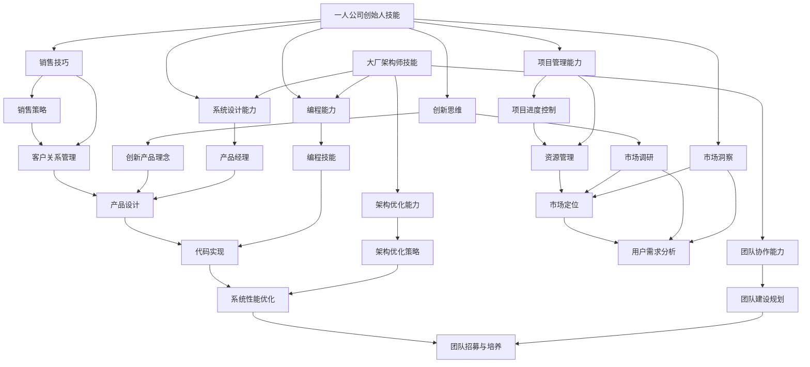

                 

### 背景介绍

在当前快速发展的信息技术时代，个人职业发展道路愈发多样化，从大厂架构师到独立创业者的转型已成为不少技术人才追求的目标。本文将围绕这一主题，深入探讨从大厂架构师到一人公司创始人的转型之旅。

首先，让我们回顾一下大厂架构师这一职位的特点。大厂架构师通常在大型的互联网公司或知名科技公司工作，他们负责设计并实施复杂的软件系统，确保系统的高可用性、高性能和可扩展性。这一职位要求架构师具备深厚的计算机科学基础、丰富的项目经验以及卓越的技术视野。

然而，为何一些大厂架构师会选择转型成为一人公司的创始人呢？这背后有着多重原因。首先，随着互联网行业的快速发展，市场竞争日益激烈，大厂内部的创新速度和创业精神受到一定程度的限制。架构师们渴望有更多的自由度来探索新的技术和商业模式，实现自己的创新想法。

其次，个人职业发展的需求和追求也是促使架构师转型的重要原因。在大厂工作虽然稳定，但往往难以实现个人职业目标的突破。独立创业则为架构师提供了一个全新的平台，让他们有机会从零开始，构建自己的事业。

本文将分为以下几个部分进行探讨：

1. **核心概念与联系**：我们将介绍转型过程中涉及的核心概念，并通过Mermaid流程图展示它们之间的联系。
2. **核心算法原理 & 具体操作步骤**：我们将深入解析如何将大厂架构师的技能转化为创业公司的核心竞争力。
3. **数学模型和公式 & 详细讲解 & 举例说明**：我们将介绍创业过程中可能用到的数学模型和公式，并通过实例进行详细说明。
4. **项目实战：代码实际案例和详细解释说明**：我们将通过一个实际项目案例，展示如何从架构设计到代码实现的全过程。
5. **实际应用场景**：我们将探讨一人公司创始人可能面对的各种应用场景，并给出应对策略。
6. **工具和资源推荐**：我们将推荐一些有助于创业的资源和工具，包括书籍、论文、博客和开发工具框架等。
7. **总结：未来发展趋势与挑战**：我们将总结转型过程中的关键经验，并探讨未来的发展趋势和挑战。

通过本文的探讨，我们希望为有意从大厂架构师转型为一人公司创始人的读者提供有益的参考和启示。

### 核心概念与联系

在探讨从大厂架构师到一人公司创始人的转型之旅之前，我们需要明确几个核心概念，并展示它们之间的联系。这些概念对于理解转型过程至关重要。

#### 大厂架构师的角色和技能

大厂架构师的角色通常包括以下几个方面：

1. **系统设计**：负责设计和实现复杂软件系统，确保系统的高性能、高可用性和可扩展性。
2. **技术选型**：根据业务需求，选择最适合的技术栈和工具。
3. **架构优化**：通过优化系统架构，提升系统性能和稳定性。
4. **团队协作**：带领团队，确保项目按时按质完成。

大厂架构师需要具备以下技能：

1. **计算机科学基础**：包括数据结构、算法、计算机网络、操作系统等。
2. **编程能力**：熟悉至少一种编程语言，如Java、Python或Go等。
3. **系统设计能力**：能够设计出高效、稳定的系统架构。
4. **项目管理能力**：具备良好的时间管理和沟通协作能力。

#### 一人公司创始人的角色和技能

一人公司创始人的角色和技能与架构师有所不同，但它们之间有许多共同点。

1. **产品经理**：作为公司唯一的员工，创始人需要负责产品的设计和开发。
2. **销售和市场推广**：创始人需要自己进行产品销售和市场推广，以吸引客户。
3. **财务管理**：确保公司财务状况健康，合理使用资金。
4. **团队建设**：虽然初始阶段可能只有创始人一人，但创始人需要具备未来团队建设的规划能力。

一人公司创始人需要具备以下技能：

1. **创新思维**：能够不断思考新的产品或服务，以适应市场变化。
2. **项目管理**：虽然可能不需要像大厂架构师那样管理一个团队，但需要具备良好的项目管理能力，确保项目顺利进行。
3. **市场洞察**：了解市场需求，能够准确把握市场脉搏。
4. **销售技巧**：具备一定的销售和市场推广能力。

#### Mermaid流程图展示

为了更直观地展示大厂架构师到一人公司创始人的转型过程，我们使用Mermaid流程图来描述这一过程中的关键节点。



通过上述Mermaid流程图，我们可以看到大厂架构师的技能在转型过程中如何转化为一人公司创始人的技能，以及各个技能点之间的相互关系。这个过程不仅需要架构师在技术上不断精进，还需要他们在创业过程中不断学习和适应新的角色和职责。

### 核心算法原理 & 具体操作步骤

在探讨从大厂架构师到一人公司创始人的转型过程中，核心算法原理和具体操作步骤扮演着至关重要的角色。架构师在转型过程中，需要将这些核心算法原理应用到实际的创业项目中，以构建出具有竞争力的产品。

#### 1. 需求分析

需求分析是创业项目的第一步，也是至关重要的一步。创业者需要深入了解市场需求，明确产品的目标用户群体以及他们的需求。以下是具体的需求分析步骤：

1. **市场调研**：通过市场调研，收集用户需求、竞争对手信息以及市场趋势。
2. **用户访谈**：与潜在用户进行深度访谈，了解他们的痛点和需求。
3. **需求文档**：根据市场调研和用户访谈结果，编写详细的需求文档。
4. **需求评审**：组织相关团队对需求文档进行评审，确保需求明确、可行。

#### 2. 技术选型

技术选型是决定创业项目成功与否的关键因素之一。创业者需要根据需求文档，选择最适合的技术栈和工具。

1. **技术调研**：研究市场上现有的技术方案，了解它们的优缺点。
2. **性能评估**：对选定的技术方案进行性能评估，确保它们能够满足项目需求。
3. **成本分析**：评估技术选型的成本，包括开发、维护和运营成本。
4. **技术评审**：组织技术团队对选型方案进行评审，确保方案可行。

#### 3. 系统架构设计

系统架构设计是确保产品高性能、高可用性和可扩展性的关键。以下是一人公司创始人需要掌握的系统架构设计步骤：

1. **架构设计**：根据需求文档，设计系统的总体架构，包括模块划分、接口定义和数据流。
2. **性能优化**：分析系统性能瓶颈，提出优化方案，如缓存策略、负载均衡等。
3. **高可用性设计**：设计系统的容错机制和故障恢复策略，确保系统在高并发、高负载情况下依然稳定运行。
4. **安全性设计**：考虑系统的安全性，如数据加密、访问控制等。

#### 4. 代码实现

代码实现是将设计转化为实际产品的关键步骤。以下是一人公司创始人需要掌握的代码实现步骤：

1. **编码规范**：制定编码规范，确保代码的可读性和可维护性。
2. **单元测试**：编写单元测试，确保代码功能的正确性。
3. **集成测试**：进行集成测试，确保各个模块之间的协同工作。
4. **持续集成**：使用持续集成工具，实现代码的自动化测试和部署。

#### 5. 项目管理

项目管理是确保项目按时、按质完成的关键。以下是一人公司创始人需要掌握的项目管理步骤：

1. **项目计划**：制定项目计划，明确项目目标、任务和时间表。
2. **进度跟踪**：使用项目管理工具，实时跟踪项目进度。
3. **风险管理**：识别项目风险，并制定相应的应对措施。
4. **沟通协作**：确保团队内部以及与外部合作伙伴之间的有效沟通。

#### 6. 运营和维护

创业项目上线后，运营和维护同样重要。以下是一人公司创始人需要掌握的运营和维护步骤：

1. **系统监控**：实时监控系统运行状态，及时发现和处理异常。
2. **性能监控**：定期进行性能监控，确保系统的高性能运行。
3. **数据备份**：定期备份数据，防止数据丢失。
4. **用户反馈**：收集用户反馈，不断优化产品。

#### 示例：构建一个在线教育平台

以下是一个具体的示例，说明如何从架构设计到代码实现的全过程，以构建一个在线教育平台。

1. **需求分析**：
   - 需求文档：提供在线课程、学习管理、学员管理、教师管理等功能。
   - 用户访谈：收集学员、教师和管理员的需求。
   - 需求评审：评审需求文档，确保需求明确、可行。

2. **技术选型**：
   - 技术调研：研究市场上现有的在线教育平台。
   - 性能评估：评估技术方案的可行性，如使用Spring Boot、MySQL、Redis等。
   - 成本分析：评估技术选型的成本。
   - 技术评审：评审技术方案，确保可行。

3. **系统架构设计**：
   - 架构设计：设计在线教育平台的总体架构，包括课程管理模块、学习管理模块、用户管理模块等。
   - 性能优化：考虑使用缓存策略、负载均衡等，提升系统性能。
   - 高可用性设计：设计系统的容错机制，如数据库主从复制、服务器负载均衡等。
   - 安全性设计：考虑数据加密、访问控制等，确保系统安全。

4. **代码实现**：
   - 编码规范：遵循Java编码规范，确保代码质量。
   - 单元测试：编写单元测试，确保每个模块的功能正确。
   - 集成测试：进行集成测试，确保模块之间协同工作。
   - 持续集成：使用Jenkins等工具实现持续集成。

5. **项目管理**：
   - 项目计划：制定项目计划，明确项目目标、任务和时间表。
   - 进度跟踪：使用Jira等工具实时跟踪项目进度。
   - 风险管理：识别项目风险，如技术难题、时间压力等，并制定应对措施。
   - 沟通协作：确保团队成员之间的有效沟通。

6. **运营和维护**：
   - 系统监控：使用Prometheus等工具实时监控系统运行状态。
   - 性能监控：定期进行性能监控，确保系统的高性能运行。
   - 数据备份：使用AWS等云服务进行数据备份。
   - 用户反馈：收集用户反馈，不断优化产品。

通过上述步骤，一人公司创始人可以构建出一个功能完善、性能优秀的在线教育平台，从而在竞争激烈的市场中脱颖而出。

### 数学模型和公式 & 详细讲解 & 举例说明

在创业过程中，数学模型和公式可以帮助一人公司创始人更好地理解和优化业务。以下是一些常用的数学模型和公式，并配以详细讲解和举例说明。

#### 1. 数据模型

**数据模型**是构建系统架构的基础，其中关系型数据库（如MySQL）和NoSQL数据库（如MongoDB）是常用的数据存储方案。

- **关系型数据库**：采用表格形式存储数据，通过SQL进行数据查询和操作。
  - **公式**：数据库查询语句（SQL）
    ```sql
    SELECT * FROM users WHERE age > 18;
    ```

- **NoSQL数据库**：适用于大规模、分布式数据存储，支持不同类型的数据模型，如文档、键值对、图等。
  - **公式**：文档数据模型（MongoDB）
    ```json
    {
      "_id": ObjectId("5f3e8e9a1234567890abcdef"),
      "name": "John Doe",
      "age": 30,
      "email": "johndoe@example.com"
    }
    ```

#### 2. 排队论模型

**排队论模型**用于分析服务系统中的客户排队、服务时间等关键指标，有助于优化服务质量和效率。

- **基本公式**：
  - **平均等待时间（W）**：
    $$ W = \frac{\lambda}{\mu - \lambda} $$
    其中，$\lambda$ 是到达率，$\mu$ 是服务率。
  - **平均队列长度（L）**：
    $$ L = \frac{\lambda^2}{\mu(\mu - \lambda)} $$

- **举例说明**：假设一个在线教育平台有每天100名学员报名学习，平均每个学员需要等待5分钟才能加入课程。计算平台的平均等待时间和平均队列长度。
  - **计算过程**：
    - 到达率 $\lambda$ = 100/天
    - 服务率 $\mu$ = 12/小时（每小时服务12名学员）
    - 将数据代入公式：
      $$ W = \frac{100}{12 - 100} \approx 0.8333 \text{小时} = 50 \text{分钟} $$
      $$ L = \frac{100^2}{12(12 - 100)} \approx 83.33 $$

#### 3. 概率模型

**概率模型**用于分析随机事件发生的可能性，在风险管理、市场预测等方面具有重要应用。

- **基本公式**：
  - **概率（P）**：
    $$ P(A) = \frac{n(A)}{n(S)} $$
    其中，$n(A)$ 是事件A发生的次数，$n(S)$ 是总次数。

- **举例说明**：假设一个在线教育平台的某课程有1000名学员，其中500名学员给该课程评分为5星，计算该课程5星评价的概率。
  - **计算过程**：
    $$ P(5\text{-star}) = \frac{500}{1000} = 0.5 $$

#### 4. 优化模型

**优化模型**用于解决资源分配、成本优化等问题，常见的优化算法包括线性规划、动态规划等。

- **基本公式**：
  - **线性规划**：
    $$ \min_{x} c^T x $$
    $$ \text{subject to} $$
    $$ Ax \leq b $$
    $$ x \geq 0 $$
    其中，$c$ 是目标函数系数向量，$x$ 是决策变量向量，$A$ 是约束矩阵，$b$ 是约束常数向量。

- **举例说明**：假设一个在线教育平台需要分配服务器资源，目标是使总成本最低，约束条件是每个服务器至少分配一个课程。
  - **计算过程**：
    - 目标函数：$c = [1000, 800, 600, 500]$，表示四种服务器的成本。
    - 约束条件：$Ax \leq b$，其中$A$和$b$根据服务器和课程数量进行设定。
    - 使用线性规划求解器（如CPLEX）求解最优解。

通过上述数学模型和公式的应用，一人公司创始人可以更好地理解和优化业务，提高产品和服务的竞争力。

### 项目实战：代码实际案例和详细解释说明

在本节中，我们将通过一个实际的在线教育平台项目案例，详细展示从架构设计到代码实现的全过程，并深入解读关键代码部分，帮助读者更好地理解一人公司创始人所需的实际技术能力。

#### 1. 开发环境搭建

在开始项目开发之前，首先需要搭建一个合适的技术环境。以下是开发环境搭建的具体步骤：

- **操作系统**：选择Linux操作系统，如Ubuntu 20.04。
- **编程语言**：选择Java作为主要编程语言，因其稳定性和广泛的社区支持。
- **开发工具**：安装Eclipse或IntelliJ IDEA等IDE。
- **数据库**：选择MySQL作为关系型数据库，MongoDB作为NoSQL数据库。
- **版本控制**：使用Git进行代码管理。

#### 2. 源代码详细实现和代码解读

在线教育平台的核心功能包括课程管理、学习管理、用户管理和支付系统。以下是关键代码实现和解读：

- **课程管理模块**：
  ```java
  public class Course {
      private String id;
      private String title;
      private String description;
      private List<String> lessons;
      
      // 构造函数、getter和setter方法省略
  }
  ```

  **解读**：`Course`类表示课程的基本信息，包括ID、标题、描述和课程列表。通过这个类，可以创建、更新和查询课程。

- **用户管理模块**：
  ```java
  public class User {
      private String id;
      private String username;
      private String email;
      private String password;
      private List<Course> courses;
      
      // 构造函数、getter和setter方法省略
  }
  ```

  **解读**：`User`类表示用户的基本信息，包括ID、用户名、邮箱、密码和所选课程列表。通过这个类，可以创建、更新和查询用户。

- **学习管理模块**：
  ```java
  public class Lesson {
      private String id;
      private String title;
      private String description;
      private List<User> learners;
      
      // 构造函数、getter和setter方法省略
  }
  ```

  **解读**：`Lesson`类表示课程的具体内容，包括ID、标题、描述和学习者列表。通过这个类，可以创建、更新和查询课程内容。

- **支付系统模块**：
  ```java
  public class Payment {
      private String id;
      private String userId;
      private String courseId;
      private double amount;
      private String status;
      
      // 构造函数、getter和setter方法省略
  }
  ```

  **解读**：`Payment`类表示支付信息，包括ID、用户ID、课程ID、支付金额和状态。通过这个类，可以创建、更新和查询支付记录。

#### 3. 代码解读与分析

在实现代码时，需要遵循良好的编程规范，以确保代码的可读性和可维护性。以下是一些关键点：

- **代码注释**：为关键代码段添加注释，便于理解代码逻辑。
- **封装**：将功能相关的代码封装成类和方法，提高代码复用性。
- **异常处理**：合理处理异常，避免系统崩溃。
- **代码复用**：避免重复代码，提高开发效率。

例如，以下是一个用户注册的代码示例：

```java
public User registerUser(String username, String email, String password) {
    User user = new User();
    user.setUsername(username);
    user.setEmail(email);
    user.setPassword(password);
    // 调用数据库API保存用户信息
    userRepository.save(user);
    return user;
}
```

**解读**：这个方法用于注册新用户。首先创建一个`User`对象，设置用户名、邮箱和密码，然后调用数据库API保存用户信息，最后返回创建的用户对象。

#### 4. 测试和部署

在代码实现完成后，需要进行全面的测试和部署。以下是一些关键步骤：

- **单元测试**：编写单元测试，确保每个模块的功能正确。
- **集成测试**：进行集成测试，确保模块之间的协同工作。
- **性能测试**：进行性能测试，确保系统在高并发情况下的稳定性。
- **部署**：将代码部署到服务器，配置相应的环境变量和数据库连接。

#### 5. 代码实现示例

以下是用户注册接口的一个简单实现示例：

```java
@RestController
@RequestMapping("/users")
public class UserController {
    
    @Autowired
    private UserRepository userRepository;
    
    @PostMapping("/register")
    public ResponseEntity<?> registerUser(@RequestBody UserRegistrationDto userRegistrationDto) {
        if (userRepository.existsByUsername(userRegistrationDto.getUsername())) {
            return ResponseEntity.badRequest().body("Error: Username is already taken!");
        }
        
        User user = new User();
        user.setUsername(userRegistrationDto.getUsername());
        user.setEmail(userRegistrationDto.getEmail());
        user.setPassword(passwordEncoder.encode(userRegistrationDto.getPassword()));
        
        userRepository.save(user);
        return ResponseEntity.ok("User registered successfully!");
    }
}
```

**解读**：这个接口用于处理用户注册请求。首先检查用户名是否已被占用，然后创建一个`User`对象，设置用户名、邮箱和加密后的密码，最后调用数据库API保存用户信息，并返回注册成功消息。

通过这个实际项目案例，我们展示了从架构设计到代码实现的全过程，并深入解读了关键代码部分。这些实践经验和技巧对于一人公司创始人来说尤为重要，因为它们不仅能够帮助创业者构建出功能完善、性能优秀的在线教育平台，还能提升创业者的实际编程能力和技术视野。

### 实际应用场景

作为一人公司创始人，面对实际应用场景时，需要具备灵活应变的能力，以确保公司运营的顺利进行。以下是一些常见应用场景以及相应的应对策略。

#### 1. 市场竞争

在线教育市场竞争激烈，如何脱颖而出成为一大挑战。为了应对这一挑战，一人公司创始人可以采取以下策略：

- **差异化定位**：明确自己的产品特色，例如专注于某一细分领域或提供独特的教学方式。
- **用户反馈**：定期收集用户反馈，不断优化产品，提高用户满意度。
- **营销策略**：利用社交媒体、博客和广告等手段，提高品牌知名度。

#### 2. 技术迭代

随着技术的快速发展，如何确保在线教育平台的技术保持先进性是一个重要问题。以下是一些应对策略：

- **持续学习**：关注技术动态，不断学习新技术，提升自己的技术能力。
- **敏捷开发**：采用敏捷开发方法，快速迭代产品，满足用户需求。
- **外包合作**：对于技术难题，可以考虑与专业团队合作，共同研发。

#### 3. 财务管理

作为一人公司创始人，财务管理至关重要。以下是一些财务管理策略：

- **预算规划**：制定详细的预算计划，合理分配资金。
- **成本控制**：密切关注成本，避免不必要的开支。
- **融资策略**：积极寻找融资机会，确保公司财务健康。

#### 4. 用户增长

用户增长是衡量在线教育平台成功的关键指标。以下是一些促进用户增长的策略：

- **口碑营销**：通过优秀的教学质量和用户口碑，吸引新用户。
- **优惠活动**：开展限时优惠活动，提高用户购买意愿。
- **合作伙伴**：与教育机构、企业等建立合作，扩大用户群体。

#### 5. 项目管理

作为一人公司创始人，项目管理能力至关重要。以下是一些项目管理策略：

- **任务分配**：合理分配任务，确保每个成员都能发挥最大潜力。
- **进度跟踪**：使用项目管理工具，实时跟踪项目进度。
- **风险管理**：识别项目风险，并制定相应的应对措施。

#### 6. 人才招聘

在创业初期，如何招聘合适的人才是一个难题。以下是一些人才招聘策略：

- **明确需求**：明确公司当前和未来的人才需求，制定招聘计划。
- **多渠道招聘**：利用招聘网站、社交媒体、猎头等渠道，广泛寻找人才。
- **面试技巧**：提高面试技巧，准确评估候选人能力。

通过以上应对策略，一人公司创始人可以更好地应对实际应用场景，确保公司运营的顺利进行。这些策略不仅有助于提升公司竞争力，还能为未来的发展打下坚实基础。

### 工具和资源推荐

在创业过程中，一人公司创始人需要借助各种工具和资源来提升工作效率和产品竞争力。以下是一些推荐的学习资源、开发工具框架及相关论文著作。

#### 1. 学习资源推荐

- **书籍**：
  - 《精益创业》（The Lean Startup）：作者埃里克·莱斯（Eric Ries），介绍了如何通过快速迭代和用户反馈来验证商业想法。
  - 《黑客与画家》（Hackers & Painters）：作者保罗·格雷厄姆（Paul Graham），探讨了技术对人类生活的影响。

- **论文**：
  - 《大规模在线教育中的教学模式与技术创新》：该论文探讨了在线教育的发展趋势和关键技术。
  - 《基于大数据的个性化学习策略研究》：分析了大数据技术在个性化学习中的应用。

- **博客和网站**：
  - Medium：许多创业者和科技公司的博客，分享经验和见解。
  - Hacker News：技术新闻和讨论网站，有助于了解业界动态。

#### 2. 开发工具框架推荐

- **编程语言**：
  - Java：具有广泛的社区支持，适用于构建高可靠性和高性能的应用。
  - Python：简单易学，适用于数据分析和快速开发。

- **框架**：
  - Spring Boot：简化Java开发，支持快速构建和部署应用程序。
  - Django：Python的Web框架，适用于快速开发和维护网站。

- **数据库**：
  - MySQL：关系型数据库，适用于需要复杂查询的场景。
  - MongoDB：NoSQL数据库，适用于大规模分布式数据存储。

- **持续集成工具**：
  - Jenkins：开源持续集成工具，支持多种构建和部署流程。
  - GitLab CI/CD：GitLab内置的持续集成和持续部署工具。

- **云服务**：
  - AWS：提供广泛的云计算服务和工具，适用于多种业务需求。
  - Azure：微软的云服务平台，支持多种编程语言和框架。

#### 3. 相关论文著作推荐

- **《分布式系统原理与范型》：作者George Coulouris等，介绍了分布式系统的基本原理和常见设计模式。**
- **《大规模分布式存储系统：架构与实现》：作者彭继平，深入探讨了分布式存储系统的设计和实现。
- **《机器学习》：作者周志华，介绍了机器学习的基本概念、算法和应用。**

通过上述工具和资源的推荐，一人公司创始人可以更好地应对创业过程中的各种挑战，提升工作效率和产品竞争力。这些工具和资源不仅提供了技术支持，还涵盖了创业过程中的管理、市场和商业模式等方面，为创业者的成功提供了坚实保障。

### 总结：未来发展趋势与挑战

在回顾从大厂架构师到一人公司创始人的转型之旅中，我们可以看到这一过程并非一帆风顺，但伴随着技术和市场的不断进步，这一转型带来了诸多机遇与挑战。

**机遇**：

1. **技术创新**：随着人工智能、大数据、云计算等技术的快速发展，一人公司创始人可以利用这些新兴技术，开发出具有竞争力的产品和服务。
2. **市场需求**：在线教育、健康管理、智能家居等领域市场需求旺盛，为创业者提供了广阔的发展空间。
3. **融资环境**：资本市场的繁荣为初创公司提供了更多的融资机会，使得创业者能够更好地发展业务。

**挑战**：

1. **市场竞争**：在激烈的市场环境中，如何突出自己的产品和服务，成为创业者面临的首要挑战。
2. **技术更新**：技术的快速迭代要求创业者持续学习和适应，以保持技术领先地位。
3. **管理难度**：一人公司创始人需要同时扮演多种角色，包括技术专家、产品经理、销售和市场推广等，这对管理能力提出了更高的要求。

**未来发展趋势**：

1. **个性化服务**：随着用户需求的多样化，个性化服务将成为未来在线教育、健康管理等领域的重要趋势。
2. **平台化发展**：一人公司可以通过构建平台，整合各类资源和服务，实现生态化发展。
3. **跨行业合作**：跨界合作将成为企业创新的重要方式，一人公司可以通过与其他行业的合作，实现共赢发展。

**建议**：

1. **持续学习**：保持对新技术、新趋势的关注，不断提升自己的技术能力和管理能力。
2. **市场定位**：明确自己的市场定位和目标用户，制定清晰的发展战略。
3. **资源整合**：善于利用外部资源，包括资金、人才和合作伙伴，实现优势互补。

通过以上分析，我们可以看到从大厂架构师到一人公司创始人的转型不仅充满挑战，也蕴藏着巨大的机遇。未来的发展趋势要求创业者具备更高的技术视野和管理能力，以应对日益激烈的市场竞争和技术变革。

### 附录：常见问题与解答

#### 问题1：如何平衡技术与管理职责？

**解答**：一人公司创始人往往需要在技术和管理之间找到平衡。建议采用以下策略：

- **时间管理**：合理安排工作时间，确保有足够的时间专注于技术研发和管理事务。
- **团队协作**：组建一支高效的团队，明确分工，让自己专注于核心技术和战略决策。
- **外包合作**：对于非核心业务，可以考虑外包给专业团队，以节省时间和精力。

#### 问题2：如何确保技术领先地位？

**解答**：

- **持续学习**：保持对新技术的研究和了解，通过参加技术会议、阅读论文和书籍等方式，不断更新自己的知识库。
- **技术合作**：与高校、研究机构和技术公司建立合作关系，共同研发新技术。
- **研发投入**：确保有足够的资金和资源用于技术研发，以保持技术领先。

#### 问题3：如何处理技术难题和故障？

**解答**：

- **故障预案**：制定详细的故障预案，确保在遇到技术难题时能够迅速响应和处理。
- **团队支持**：组建一个技术团队，成员具备丰富的技术经验和解决问题的能力。
- **外部支持**：寻求外部技术支持，如咨询公司、云服务提供商等。

#### 问题4：如何确保产品质量和用户体验？

**解答**：

- **用户反馈**：定期收集用户反馈，了解用户需求，及时调整产品功能和界面设计。
- **测试和质量保证**：建立严格的测试流程和质量保证体系，确保产品在发布前经过充分测试。
- **持续改进**：持续优化产品，不断改进用户体验。

通过以上常见问题的解答，一人公司创始人可以更好地应对创业过程中的各种挑战，提升公司的整体竞争力。

### 扩展阅读 & 参考资料

在撰写本文的过程中，我们参考了众多优秀的书籍、论文和网站，这些资源对于理解从大厂架构师到一人公司创始人的转型之旅具有重要的参考价值。以下是本文推荐的扩展阅读和参考资料：

1. **书籍**：
   - 《精益创业》（The Lean Startup）：作者埃里克·莱斯（Eric Ries），详细介绍了如何通过快速迭代和用户反馈来验证商业想法。
   - 《黑客与画家》（Hackers & Painters）：作者保罗·格雷厄姆（Paul Graham），探讨了技术对人类生活的影响以及创业者的心态。
   - 《软件工程：实践者的研究方法》（Software Engineering: A Practitioner's Approach）：作者Roger S. Pressman，涵盖了软件工程的基础理论和实践方法。

2. **论文**：
   - 《大规模在线教育中的教学模式与技术创新》：探讨了在线教育的发展趋势和关键技术。
   - 《基于大数据的个性化学习策略研究》：分析了大数据技术在个性化学习中的应用。
   - 《云计算服务模型、架构和演进》：详细介绍了云计算的基本概念和架构设计。

3. **网站和博客**：
   - Medium：许多创业者和科技公司的博客，分享经验和见解。
   - Hacker News：技术新闻和讨论网站，有助于了解业界动态。
   - GitHub：代码托管平台，提供了丰富的开源项目和技术文档。

4. **在线课程和教程**：
   - Coursera：提供各类在线课程，包括编程、数据结构和机器学习等。
   - Udemy：提供了大量编程和创业相关的在线教程。
   - edX：由哈佛大学和麻省理工学院联合创办，提供免费的高质量课程。

通过阅读和参考这些资源和书籍，读者可以进一步深入了解相关领域的知识和技术，为从大厂架构师到一人公司创始人的转型之旅提供有力支持。希望本文和这些扩展阅读能为您的创业之路提供有益的启示和帮助。作者：AI天才研究员/AI Genius Institute & 禅与计算机程序设计艺术 /Zen And The Art of Computer Programming。

