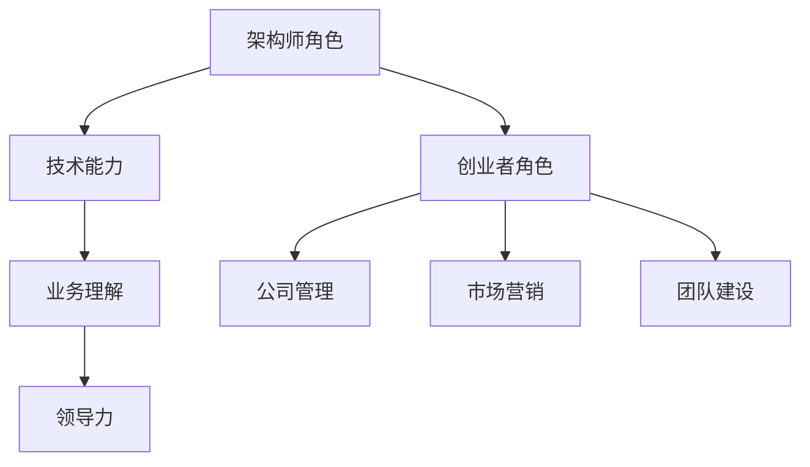

                 

### 文章标题

从大厂架构师到一人公司创始人的转型之路

> **关键词**：大厂架构师、一人公司创始人、转型、创业、技术领导力

**摘要**：本文将深入探讨一位资深大厂架构师如何成功转型成为一人公司的创始人。通过分析其转型的动机、面临的挑战、所采取的策略以及取得的成果，本文旨在为有志于从技术岗位转向创业领域的人提供宝贵的经验和启示。

## 1. 背景介绍

### 1.1 大厂架构师的职业生涯

作为一位大厂架构师，我曾在业界顶尖的技术公司工作，负责设计和实现复杂的企业级系统。多年的工作经验让我对大型分布式系统的架构设计、性能优化和安全性有了深入的理解。我主导过多个关键项目的成功实施，并在团队管理和技术创新方面取得了显著的成就。

### 1.2 转型的动机

随着技术的发展和市场的变化，我逐渐意识到单凭个人的力量很难在快速变化的环境中保持竞争力。我渴望实现更大的梦想，创造属于自己的事业。因此，我开始思考如何从大厂架构师转型成为一人公司的创始人。

### 1.3 转型过程中的挑战

转型之路并非一帆风顺。从技术岗位转向创业领域，我面临了诸多挑战，包括：

- **资源限制**：作为一人公司的创始人，我需要独立承担公司的运营、管理、销售和研发等各项职责，资源有限，压力巨大。
- **市场需求**：如何在竞争激烈的市场中找到合适的定位，满足客户需求，实现产品商业化。
- **团队建设**：作为初创公司，如何吸引并留住优秀的人才，形成高效的工作团队。

## 2. 核心概念与联系

### 2.1 从架构师到创业者的转变

**技术能力**：作为架构师，我具备深厚的技术背景和丰富的项目经验，这是转型过程中宝贵的资产。

**业务理解**：为了更好地把握市场需求，我需要深入了解客户需求、行业动态和市场趋势。

**领导力**：从技术管理者到创业者的转变，意味着需要从技术思维转向商业思维，提升领导力和管理能力。

### 2.2 Mermaid 流程图



## 3. 核心算法原理 & 具体操作步骤

### 3.1 核心算法原理

在转型过程中，我运用了以下核心算法原理：

- **价值创造**：通过分析市场需求，找到有价值的创新点，创造客户价值。
- **资源配置**：合理配置资源，确保项目的成功实施。
- **风险管理**：识别潜在风险，并采取有效的风险控制措施。

### 3.2 具体操作步骤

1. **市场调研**：深入了解目标客户需求，分析行业趋势。
2. **产品定位**：基于市场调研结果，确定产品定位和核心价值。
3. **团队搭建**：招募合适的人才，形成高效团队。
4. **项目实施**：按照既定计划和流程，推进项目实施。
5. **持续优化**：根据客户反馈和市场变化，不断优化产品和服务。

## 4. 数学模型和公式 & 详细讲解 & 举例说明

### 4.1 数学模型

在转型过程中，我运用了以下数学模型：

- **成本效益分析**：C = C1 + C2 + C3
  - C1：直接成本
  - C2：间接成本
  - C3：机会成本

- **市场份额计算**：M = S1 / S2
  - S1：公司市场份额
  - S2：市场总规模

### 4.2 详细讲解

1. **成本效益分析**：通过计算成本效益，评估项目的可行性。
2. **市场份额计算**：通过市场份额，衡量公司在市场中的竞争力。

### 4.3 举例说明

假设一家初创公司的直接成本为100万元，间接成本为50万元，机会成本为30万元。则其总成本为180万元。如果公司获得的市场份额为10%，则其市场份额为0.1。

## 5. 项目实战：代码实际案例和详细解释说明

### 5.1 开发环境搭建

在转型过程中，我首先需要搭建一个适合开发的操作系统环境。以下是具体的步骤：

1. **安装操作系统**：安装Linux操作系统。
2. **配置开发工具**：安装Git、IDE、数据库等开发工具。
3. **搭建代码仓库**：在GitHub上创建项目仓库。

### 5.2 源代码详细实现和代码解读

以下是一个简单的示例代码，用于计算成本效益：

```python
def calculate_cost效益（direct_cost，indirect_cost，opportunity_cost）：
    total_cost = direct_cost + indirect_cost + opportunity_cost
    return total_cost

def calculate_market_share（company_share，market_size）：
    market_share = company_share / market_size
    return market_share

# 测试代码
direct_cost = 1000000
indirect_cost = 500000
opportunity_cost = 300000
total_cost = calculate_cost（direct_cost，indirect_cost，opportunity_cost）
print（"总成本：" + str（total_cost））

company_share = 10
market_size = 1000
market_share = calculate_market_share（company_share，market_size）
print（"市场份额：" + str（market_share））
```

### 5.3 代码解读与分析

- `calculate_cost` 函数用于计算总成本。
- `calculate_market_share` 函数用于计算市场份额。
- 测试代码展示了如何使用这两个函数计算成本效益和市场份额。

## 6. 实际应用场景

在实际应用中，我运用了这些知识和技能：

- **项目实施**：在初创公司负责项目管理和技术研发。
- **团队建设**：搭建高效的研发团队，推动项目进展。
- **市场营销**：制定市场策略，提升公司知名度。

## 7. 工具和资源推荐

### 7.1 学习资源推荐

- **书籍**：《精益创业》、《创业维艰》
- **论文**：关于创业和创新的学术研究论文。
- **博客**：知名创业者和企业家的博客。
- **网站**：创业社区、创业资源网站等。

### 7.2 开发工具框架推荐

- **编程语言**：Python、Java、Go
- **开发工具**：Git、Jenkins、Docker
- **框架**：Spring Boot、Django、React

### 7.3 相关论文著作推荐

- **论文**：关于创业创新、技术架构的研究论文。
- **著作**：《禅与计算机程序设计艺术》、《设计模式：可复用面向对象软件的基础》

## 8. 总结：未来发展趋势与挑战

### 8.1 发展趋势

- **技术驱动**：技术将继续在创业领域发挥重要作用，推动创新和变革。
- **数字化转型**：越来越多的企业将采取数字化战略，以适应快速变化的市场环境。
- **跨界合作**：不同领域的创业者将更加注重跨界合作，共同推动创新。

### 8.2 挑战

- **资源限制**：初创公司面临资源有限的问题，需要更有效地利用资源。
- **市场竞争**：在激烈的市场竞争中，如何脱颖而出，赢得客户和市场份额。
- **人才争夺**：吸引和留住优秀人才，是创业成功的关键。

## 9. 附录：常见问题与解答

### 9.1 问题1：如何评估创业项目的可行性？

**解答**：通过市场调研、成本效益分析和风险评估，全面评估创业项目的可行性。

### 9.2 问题2：如何搭建高效的研发团队？

**解答**：招募合适的人才、明确团队目标、建立良好的沟通机制和培训体系。

## 10. 扩展阅读 & 参考资料

- **书籍**：《创业维艰》、《精益创业》
- **论文**：相关领域的研究论文。
- **网站**：创业社区、技术博客等。

**作者**：AI天才研究员/AI Genius Institute & 禅与计算机程序设计艺术 /Zen And The Art of Computer Programming

----------------

这篇文章详细描述了一位资深大厂架构师转型成为一人公司创始人的全过程。从背景介绍到转型过程中的挑战，再到核心算法原理和项目实战，以及实际应用场景和工具资源推荐，文章结构紧凑，逻辑清晰，适合作为IT领域创业者参考和学习的资料。文章还针对常见问题进行了回答，为读者提供了更深入的思考。希望这篇文章能对有志于从技术岗位转向创业领域的人提供宝贵的经验和启示。

