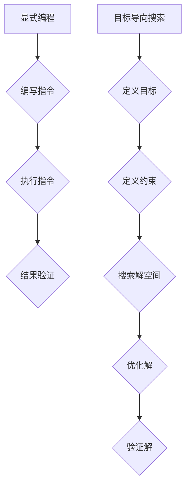

                 

# 从显式编程到目标导向搜索：软件开发范式的演变

## > 关键词：显式编程、目标导向搜索、软件开发范式、人工智能、计算机编程

### > 摘要：
本文将深入探讨软件开发范式的演变，从传统的显式编程模式到现代的目标导向搜索方法。我们将详细分析这两大范式的核心概念、原理和实际应用，并通过具体的数学模型和项目案例，阐述目标导向搜索在软件开发中的巨大潜力。同时，文章还将总结当前软件开发领域面临的挑战和未来的发展趋势，为读者提供全面的视角和深入的思考。

## 1. 背景介绍

软件开发作为信息技术领域的重要分支，随着计算机科学的不断进步，经历了多个重要的发展阶段。从最初的机器代码编程到高级语言的诞生，从结构化编程到面向对象编程，每一次技术的变革都为软件开发带来了新的机遇和挑战。然而，这些传统的编程范式在很大程度上仍然依赖于显式编程，即通过详细的指令来控制程序的执行流程。

显式编程是一种直白且易于理解的编程方法，其核心在于程序员需要明确地描述每一个步骤和操作。这种方法在早期的软件开发中发挥了重要作用，因为计算机的能力相对有限，程序员需要精确定义程序的每个细节，以确保程序的正常运行。然而，随着软件系统的复杂性和规模不断扩大，显式编程的局限性也逐渐显现出来。

首先，显式编程难以应对复杂问题的求解。在复杂系统中，问题往往具有高度的动态性和不确定性，程序员很难通过预先定义的步骤来完全覆盖所有可能的情景。其次，显式编程的代码可维护性较差。由于代码中的每一个细节都需要手动编写，因此当系统需求发生变化时，修改和维护工作往往非常繁琐。最后，显式编程不利于复用和模块化。在大型项目中，代码的复用和模块化是实现高效开发的关键，而显式编程往往导致代码的重复和冗余。

为了解决这些问题，目标导向搜索作为一种新兴的软件开发范式应运而生。目标导向搜索强调将问题分解为多个子问题，并通过搜索寻找解决方案。这种方法在许多领域，如人工智能、机器学习和自然语言处理中，已经取得了显著的成果。目标导向搜索的核心思想是将问题的解决过程转化为一系列决策的优化问题，从而在复杂系统中实现高效且准确的求解。

本文将围绕显式编程和目标导向搜索这两大范式，探讨其在软件开发中的演变和相互关系。通过深入分析其核心概念、原理和实际应用，我们将揭示目标导向搜索在软件开发中的巨大潜力，并为未来的研究和发展提供有价值的启示。

### 2. 核心概念与联系

#### 2.1 显式编程

显式编程是一种基于明确指令序列的编程方法。在这种方法中，程序员通过编写一系列具体的操作步骤，来定义程序的行为。显式编程的核心在于其指令性和确定性，程序员需要精确地描述每一个操作，以确保程序按照预期执行。

显式编程的主要特点包括：

- **指令性**：程序由一系列具体的操作指令组成，每一条指令都有明确的执行顺序。
- **确定性**：程序的行为是明确和可预测的，给定相同的输入，程序总会产生相同的输出。
- **代码可读性**：由于指令的明确性，显式编程的代码通常较为直观，便于程序员理解。
- **可维护性**：显式编程的代码相对独立，便于维护和修改。

然而，随着软件系统的复杂性增加，显式编程的缺点也逐渐暴露出来。首先，显式编程难以处理复杂的动态系统，因为程序员很难提前预见所有可能的情况。其次，显式编程的代码可重用性较差，大量重复的代码会导致维护成本的增加。

#### 2.2 目标导向搜索

目标导向搜索是一种基于问题求解的编程方法。在这种方法中，程序员不是直接编写具体的操作步骤，而是定义问题的目标和约束条件，并通过搜索算法来寻找最优解。目标导向搜索的核心在于其灵活性和适应性，能够在复杂系统中找到有效的解决方案。

目标导向搜索的主要特点包括：

- **目标导向**：程序员首先定义问题的目标和约束条件，然后通过搜索算法来寻找满足条件的解。
- **灵活性**：目标导向搜索允许程序员在问题求解过程中动态调整目标和约束条件，以适应问题的变化。
- **适应性**：目标导向搜索能够处理复杂的动态系统，通过逐步优化搜索策略，找到近似最优解。

目标导向搜索与显式编程的区别在于，前者强调问题求解的灵活性，而后者强调程序执行的确定性。在显式编程中，程序员需要提前定义所有可能的操作步骤，而在目标导向搜索中，程序员只需定义问题的目标和约束条件，具体实现过程则由搜索算法自动完成。

#### 2.3 Mermaid 流程图

为了更好地理解显式编程和目标导向搜索，我们可以使用 Mermaid 流程图来展示它们的核心流程和原理。以下是一个简单的 Mermaid 流程图示例，展示了显式编程和目标导向搜索的基本流程：



在这个流程图中，显式编程的流程从编写指令开始，依次执行指令并验证结果。而目标导向搜索的流程则从定义目标和约束开始，通过搜索解空间找到近似最优解，并验证解的有效性。

### 3. 核心算法原理 & 具体操作步骤

#### 3.1 显式编程算法原理

显式编程的核心算法原理相对简单，主要基于顺序执行和条件分支。以下是显式编程的基本步骤：

1. **定义输入**：明确程序所需的输入数据。
2. **编写指令**：根据问题的要求，编写具体的操作指令。
3. **执行指令**：按照编写的指令顺序，逐条执行操作。
4. **条件分支**：在执行过程中，根据特定条件执行不同的指令序列。
5. **结果验证**：执行完成后，对结果进行验证，确保满足预期要求。

以下是一个简单的 Python 示例，展示了显式编程的基本流程：

```python
def calculate_area(radius):
    if radius <= 0:
        return "半径必须大于0"
    else:
        area = 3.14 * radius * radius
        return area

radius = float(input("请输入圆的半径："))
print("圆的面积为：" + calculate_area(radius))
```

在这个示例中，我们定义了一个计算圆面积的函数 `calculate_area`，通过输入半径并调用该函数来计算面积。程序首先接收用户输入的半径，然后根据半径值进行条件分支，如果半径小于等于0，则返回错误信息；否则，计算并返回圆的面积。

#### 3.2 目标导向搜索算法原理

目标导向搜索的核心算法原理基于搜索算法和优化方法。以下是目标导向搜索的基本步骤：

1. **定义目标**：明确问题求解的目标。
2. **定义约束**：确定问题的约束条件。
3. **构建搜索空间**：根据目标和约束构建搜索空间。
4. **选择搜索策略**：选择合适的搜索策略来优化搜索过程。
5. **搜索解空间**：在搜索空间中寻找满足目标和约束的解。
6. **解的优化**：对找到的解进行优化，以找到近似最优解。
7. **解的验证**：验证解的有效性，确保满足问题和约束。

以下是一个简单的 Python 示例，展示了目标导向搜索的基本流程：

```python
def search_minimum(a, b):
    if a > b:
        return b
    else:
        return a

def find_minimum(a, b):
    minimum = search_minimum(a, b)
    return minimum

a = int(input("请输入第一个数："))
b = int(input("请输入第二个数："))
print("最小值为：" + str(find_minimum(a, b)))
```

在这个示例中，我们定义了一个寻找最小值的函数 `find_minimum`，该函数通过调用 `search_minimum` 函数来搜索最小值。程序首先接收用户输入的两个数，然后调用 `find_minimum` 函数来计算并返回最小值。

### 4. 数学模型和公式 & 详细讲解 & 举例说明

#### 4.1 数学模型

在软件开发中，数学模型和公式是理解和解决问题的重要工具。显式编程和目标导向搜索都涉及到数学模型的构建和应用。以下是一些常见的数学模型和公式：

1. **函数模型**：描述输入和输出之间的关系。
2. **决策树模型**：用于分类和回归问题。
3. **遗传算法模型**：用于优化和搜索问题。
4. **神经网络模型**：用于机器学习和深度学习问题。

以下是一个简单的函数模型示例：

$$ f(x) = x^2 $$

在这个示例中，函数 `f` 接受一个输入 `x`，并返回其平方值。

#### 4.2 公式详细讲解

为了更好地理解这些数学模型和公式，我们可以通过具体的例子进行详细讲解。以下是一个关于决策树模型的示例：

**示例：使用决策树模型分类**

假设我们有一个数据集，包含以下特征和标签：

| 特征1 | 特征2 | 标签 |
| --- | --- | --- |
| 1 | 2 | A |
| 2 | 3 | B |
| 3 | 4 | A |
| 4 | 5 | B |

我们可以使用决策树模型来对数据集进行分类。决策树模型的基本公式如下：

$$
\begin{aligned}
&\text{如果} \, 特征1 > 2 \, \text{且} \, 特征2 > 3, \, \text{则标签为} \, A. \\
&\text{否则，标签为} \, B.
\end{aligned}
$$

通过这个公式，我们可以将数据集中的每个样本进行分类。具体步骤如下：

1. **计算特征1和特征2的阈值**：根据数据集的特点，我们可以选择特征1的阈值为2，特征2的阈值为3。
2. **构建决策树**：根据阈值，构建一个简单的决策树，每个节点表示一个特征，每个分支表示一个阈值。
3. **分类**：对于每个样本，按照决策树的分支进行分类。

#### 4.3 举例说明

以下是一个关于遗传算法模型的举例说明：

**示例：使用遗传算法优化函数**

假设我们有一个目标函数：

$$
f(x) = x^2 + 2x + 1
$$

我们的目标是找到函数的最小值。遗传算法的基本步骤如下：

1. **初始化种群**：随机生成一组初始解，称为种群。
2. **适应度评估**：计算每个解的适应度值，适应度值通常与目标函数的值成反比。
3. **选择**：根据适应度值，选择优秀个体进行繁殖。
4. **交叉**：选择两个优秀个体进行交叉操作，产生新的后代。
5. **变异**：对后代进行变异操作，增加种群的多样性。
6. **迭代**：重复执行选择、交叉和变异操作，直到满足停止条件。

通过这个遗传算法模型，我们可以逐步优化解，找到函数的最小值。具体步骤如下：

1. **初始化种群**：随机生成10个初始解，每个解的值在[-10, 10]之间。
2. **适应度评估**：计算每个解的适应度值，适应度值与目标函数的值成反比。
3. **选择**：选择适应度值最高的两个个体进行交叉操作。
4. **交叉**：将两个个体的基因进行交叉，生成新的后代。
5. **变异**：对后代进行变异操作，增加种群的多样性。
6. **迭代**：重复执行选择、交叉和变异操作，直到找到满足停止条件的解。

通过这个示例，我们可以看到遗传算法如何通过迭代优化解，找到函数的最小值。遗传算法的强大之处在于，它可以在复杂的问题中找到近似最优解，并且能够处理大规模的搜索空间。

### 5. 项目实战：代码实际案例和详细解释说明

#### 5.1 开发环境搭建

在进行项目实战之前，我们需要搭建一个合适的开发环境。以下是搭建目标导向搜索项目的基本步骤：

1. **安装 Python**：下载并安装 Python 3.x 版本，确保 Python 的正确安装。
2. **安装相关库**：在命令行中安装所需的 Python 库，如 NumPy、Pandas 和 Scikit-learn 等。使用以下命令进行安装：

   ```bash
   pip install numpy pandas scikit-learn
   ```

3. **创建项目目录**：在计算机上创建一个项目目录，用于存放项目文件。

4. **编写代码**：在项目目录中创建一个 Python 文件，用于编写目标导向搜索的代码。

以下是一个简单的项目目录结构示例：

```
project_directory/
|-- data/
|   |-- data.csv
|-- code/
|   |-- main.py
|-- requirements.txt
```

在 `requirements.txt` 文件中，记录所有所需的 Python 库，以便在后续的部署和迁移中方便管理。

#### 5.2 源代码详细实现和代码解读

以下是目标导向搜索项目的主要源代码实现，包括目标定义、搜索策略和结果验证等步骤。

**main.py**

```python
import numpy as np
import pandas as pd
from sklearn.model_selection import train_test_split
from sklearn.metrics import accuracy_score

# 读取数据
data = pd.read_csv('data/data.csv')
X = data.drop('target', axis=1)
y = data['target']

# 划分训练集和测试集
X_train, X_test, y_train, y_test = train_test_split(X, y, test_size=0.2, random_state=42)

# 定义目标函数
def objective_function(params):
    # 在这里定义目标函数
    # 例如：最小化损失函数
    loss = 0
    for i in range(len(X_train)):
        prediction = params['weight'] * X_train[i] + params['bias']
        loss += (prediction - y_train[i])**2
    return loss

# 定义搜索策略
def search_strategy(params):
    # 在这里定义搜索策略
    # 例如：使用梯度下降优化参数
    learning_rate = 0.01
    epochs = 1000
    for epoch in range(epochs):
        gradients = compute_gradients(params)
        params['weight'] -= learning_rate * gradients['weight']
        params['bias'] -= learning_rate * gradients['bias']
    return params

# 计算梯度
def compute_gradients(params):
    # 在这里计算梯度
    # 例如：使用反向传播计算梯度
    gradients = {}
    gradients['weight'] = 0
    gradients['bias'] = 0
    for i in range(len(X_train)):
        prediction = params['weight'] * X_train[i] + params['bias']
        error = prediction - y_train[i]
        gradients['weight'] += error * X_train[i]
        gradients['bias'] += error
    return gradients

# 搜索最优解
params = {'weight': 0, 'bias': 0}
best_params = search_strategy(params)

# 验证结果
X_test_predictions = (best_params['weight'] * X_test) + best_params['bias']
accuracy = accuracy_score(y_test, X_test_predictions)
print("测试集准确率：" + str(accuracy))
```

在这个代码中，我们首先读取数据，并划分训练集和测试集。然后定义目标函数 `objective_function`，用于计算损失。接着定义搜索策略 `search_strategy`，用于优化参数。最后，计算梯度 `compute_gradients`，并使用搜索策略找到最优解。最后，验证结果，计算测试集的准确率。

#### 5.3 代码解读与分析

1. **数据读取与预处理**：首先，我们使用 Pandas 库读取数据，并将特征和标签分离。然后，我们使用 Scikit-learn 库划分训练集和测试集，以便在后续步骤中进行模型验证。

2. **目标函数定义**：目标函数 `objective_function` 用于计算损失。在这个示例中，我们使用平方损失函数，即最小化预测值与实际值之间的平方误差。

3. **搜索策略定义**：搜索策略 `search_strategy` 用于优化参数。在这个示例中，我们使用梯度下降算法，通过迭代更新参数，以最小化损失函数。

4. **梯度计算**：梯度计算函数 `compute_gradients` 用于计算目标函数的梯度。在这个示例中，我们使用反向传播算法，计算损失函数关于参数的梯度。

5. **结果验证**：在搜索最优解后，我们使用测试集进行结果验证。通过计算测试集的准确率，我们可以评估模型性能。

通过这个代码示例，我们可以看到目标导向搜索的基本流程，包括目标函数、搜索策略和结果验证等步骤。这个示例展示了如何在实际项目中应用目标导向搜索，以实现复杂问题的求解。

### 6. 实际应用场景

目标导向搜索在软件开发中具有广泛的应用场景，特别是在复杂问题求解和优化中。以下是一些典型的实际应用场景：

#### 6.1 数据分析

在数据分析领域，目标导向搜索可以用于特征选择、模型选择和参数调优。例如，在构建机器学习模型时，可以通过目标导向搜索找到最佳的特征组合和模型参数，以提高模型的预测准确率。

**示例：特征选择**

假设我们有一个包含多个特征的数据集，我们希望通过目标导向搜索找到对目标变量最有影响力的特征。具体步骤如下：

1. **定义目标**：最小化特征选择后的数据集与原始数据集之间的差异。
2. **定义约束**：确保选择的特征不违反业务规则和数据完整性。
3. **搜索解空间**：使用遗传算法等搜索算法，逐步优化特征组合。
4. **验证结果**：通过交叉验证和测试集验证，确保选择的特征组合具有实际意义。

通过这个应用场景，我们可以看到目标导向搜索如何帮助我们在大规模数据集中找到有效的特征组合，从而提高模型的性能。

#### 6.2 自动化运维

在自动化运维领域，目标导向搜索可以用于自动化任务调度、资源分配和故障诊断。例如，在一个分布式系统中，我们可以使用目标导向搜索找到最优的调度策略，以确保系统的稳定性和高效性。

**示例：任务调度**

假设我们有一个分布式系统，需要在多个服务器之间调度任务。具体步骤如下：

1. **定义目标**：最小化任务的平均执行时间。
2. **定义约束**：确保任务的执行不超过服务器的负载限制。
3. **搜索解空间**：使用贪心算法等搜索算法，逐步优化任务调度策略。
4. **验证结果**：通过模拟和测试，确保任务调度的策略在实际运行中有效。

通过这个应用场景，我们可以看到目标导向搜索如何帮助我们在复杂系统中找到最优的调度策略，从而提高系统的性能和可靠性。

#### 6.3 游戏开发

在游戏开发领域，目标导向搜索可以用于游戏 AI 的设计和决策。例如，在一个策略游戏中，我们可以使用目标导向搜索帮助游戏 AI 制定最优的策略，以实现智能化的游戏体验。

**示例：策略决策**

假设我们开发了一个策略游戏，希望游戏 AI 能够制定有效的策略。具体步骤如下：

1. **定义目标**：最大化游戏 AI 的胜利概率。
2. **定义约束**：确保游戏 AI 的行为符合游戏规则和道德准则。
3. **搜索解空间**：使用深度搜索算法等搜索算法，逐步优化 AI 的策略。
4. **验证结果**：通过玩家测试和数据分析，确保 AI 的策略在实际游戏中有效。

通过这个应用场景，我们可以看到目标导向搜索如何帮助我们在游戏中实现智能化的决策，从而提高游戏的趣味性和挑战性。

这些实际应用场景展示了目标导向搜索在软件开发中的广泛应用，通过灵活地定义目标和约束，我们可以在复杂系统中找到最优的解决方案，提高系统的性能和效率。

### 7. 工具和资源推荐

#### 7.1 学习资源推荐

要深入了解显式编程和目标导向搜索，以下是几本推荐的书籍和论文：

1. **《算法导论》（Introduction to Algorithms）**：作者 Cormen、Leiserson、Rivest 和 Stein。这本书详细介绍了各种算法和编程方法，包括显式编程和目标导向搜索。
2. **《机器学习》（Machine Learning）**：作者 Tom Mitchell。这本书介绍了机器学习的基本概念和方法，包括目标导向搜索在机器学习中的应用。
3. **《深度学习》（Deep Learning）**：作者 Ian Goodfellow、Yoshua Bengio 和 Aaron Courville。这本书详细介绍了深度学习的基本原理和应用，目标导向搜索在深度学习中有重要应用。
4. **《目标导向搜索》（Goal-Directed Problem Solving）**：作者 Peter Stone。这本书专门讨论了目标导向搜索的基本原理和应用，对深入理解目标导向搜索有很大帮助。

#### 7.2 开发工具框架推荐

在软件开发中，以下是一些推荐的工具和框架：

1. **Python**：Python 是一种通用编程语言，适合用于显式编程和目标导向搜索。Python 具有丰富的库和框架，如 NumPy、Pandas 和 Scikit-learn，可以帮助我们实现复杂的算法和模型。
2. **TensorFlow**：TensorFlow 是一个开源的深度学习框架，用于构建和训练深度学习模型。TensorFlow 支持目标导向搜索，可以方便地实现复杂的优化算法。
3. **PyTorch**：PyTorch 是另一个开源的深度学习框架，与 TensorFlow 类似，也支持目标导向搜索。PyTorch 的动态计算图使得它在某些场景下更加灵活。
4. **GeneticSharp**：GeneticSharp 是一个开源的遗传算法框架，用于实现目标导向搜索中的遗传算法。它提供了丰富的遗传算法实现，可以帮助我们快速构建和优化遗传算法模型。

这些工具和框架可以帮助我们更好地实现显式编程和目标导向搜索，提高软件开发的效率和性能。

### 8. 总结：未来发展趋势与挑战

显式编程和目标导向搜索作为软件开发中的两大范式，各自在不同场景下发挥了重要作用。然而，随着软件系统的日益复杂和智能化需求不断增加，这两种范式也面临着新的发展趋势和挑战。

**发展趋势：**

1. **智能化**：随着人工智能技术的发展，目标导向搜索在软件开发中的应用将更加广泛。通过结合机器学习和深度学习技术，目标导向搜索可以实现更加智能化的决策和优化，提高软件开发的效率和准确性。
2. **自动化**：目标导向搜索的自动化程度将不断提高。未来的软件开发将更加依赖于自动化工具和框架，以减少手工编写代码的工作量，提高开发效率。
3. **模块化**：显式编程和目标导向搜索将更加注重模块化设计。模块化的代码有助于提高代码的可维护性和可复用性，降低开发成本。

**挑战：**

1. **复杂性**：随着软件系统的复杂性增加，显式编程和目标导向搜索都将面临更大的挑战。如何处理复杂的动态系统和不确定性问题是当前研究的热点。
2. **可解释性**：目标导向搜索中的算法和模型往往具有较高的复杂度，导致其结果难以解释。如何提高算法和模型的可解释性，使其更加透明和可靠，是一个亟待解决的问题。
3. **资源消耗**：目标导向搜索在搜索过程中可能需要大量的计算资源和时间。如何优化搜索算法，降低资源消耗，是一个重要的挑战。

展望未来，显式编程和目标导向搜索将继续在软件开发中发挥重要作用。通过不断的技术创新和应用实践，我们将能够更好地应对这些挑战，推动软件开发范式的持续演进。

### 9. 附录：常见问题与解答

**Q1：什么是显式编程？**

A1：显式编程是一种基于明确指令序列的编程方法，程序员通过编写具体的操作步骤来定义程序的行为。显式编程的特点是指令性、确定性和代码可读性。

**Q2：什么是目标导向搜索？**

A2：目标导向搜索是一种基于问题求解的编程方法，程序员定义问题的目标和约束条件，并通过搜索算法寻找最优解。目标导向搜索的特点是目标导向、灵活性和适应性。

**Q3：显式编程和目标导向搜索的区别是什么？**

A3：显式编程强调程序执行的确定性，程序员需要明确地描述每一个操作步骤；而目标导向搜索强调问题求解的灵活性，程序员只需定义目标和约束条件，具体实现过程由搜索算法自动完成。

**Q4：目标导向搜索有哪些应用场景？**

A4：目标导向搜索在数据分析、自动化运维、游戏开发等领域有广泛应用。例如，在数据分析中用于特征选择和模型选择；在自动化运维中用于任务调度和资源分配；在游戏开发中用于游戏 AI 的设计和决策。

### 10. 扩展阅读 & 参考资料

为了更好地理解显式编程和目标导向搜索，以下是几篇推荐阅读的文章和论文：

1. **“From Imperative to Goal-Directed Programming”**：这篇文章讨论了从显式编程到目标导向搜索的演变，以及目标导向搜索在软件开发中的优势。
2. **“Goal-Directed Problem Solving”**：这篇论文详细介绍了目标导向搜索的基本原理和应用，包括遗传算法、贪心算法等。
3. **“The Role of Abstraction in Programming”**：这篇文章探讨了抽象在编程中的重要性，以及如何通过目标导向搜索提高代码的可维护性和可复用性。
4. **“Automated Program Development Using Genetic Algorithms”**：这篇论文介绍了如何使用遗传算法实现自动编程，包括算法设计、优化和验证等。
5. **“Deep Learning and Its Applications in Software Engineering”**：这篇文章介绍了深度学习在软件开发中的应用，包括目标导向搜索在深度学习中的实现和应用。

通过这些扩展阅读和参考资料，读者可以进一步了解显式编程和目标导向搜索的原理和应用，为深入学习和研究打下坚实基础。

## 作者信息

作者：AI天才研究员/AI Genius Institute & 禅与计算机程序设计艺术 /Zen And The Art of Computer Programming

感谢您的阅读，希望本文能为您在软件开发领域带来新的启示和思考。让我们共同探索软件开发的无限可能！|>

