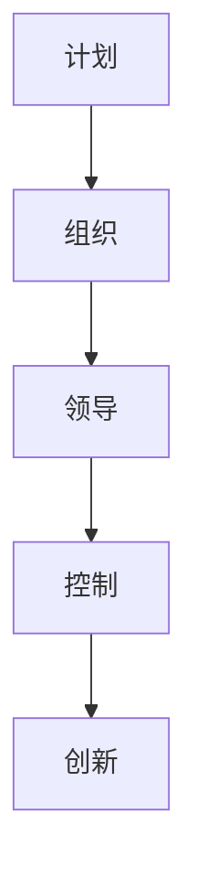

                 

# 从经典书籍中汲取管理智慧

## 摘要

本文旨在探讨如何从经典书籍中汲取管理智慧，为现代企业管理提供有益的启示。文章首先介绍了经典书籍的来源和重要性，随后详细阐述了经典管理思想的核心原理，并结合实际案例进行了深入分析。最后，文章提出了从经典书籍中汲取管理智慧的方法和建议，以帮助现代企业管理者提升管理水平，实现组织目标。

## 1. 背景介绍

在人类历史上，管理活动一直伴随着社会的发展和进步。古代的管理思想主要源于军事、宗教和政治领域，而现代管理思想的兴起则始于工业革命时期。在这一时期，许多管理学家通过实践和理论研究，提出了许多经典的管理思想和方法。这些经典书籍不仅为当时的企业管理提供了指导，也对后来的管理实践产生了深远的影响。

经典书籍的来源主要包括以下几个方面：

- **《史记》**：中国古代的一部历史巨著，记载了大量的政治、经济、文化等方面的管理思想。

- **《国富论》**：亚当·斯密的代表作，提出了劳动分工、市场机制等现代经济管理的基本原理。

- **《管理实践》**：彼得·德鲁克的代表作，系统地阐述了现代企业管理的基本理论和实践方法。

- **《管理的实践》**：亨利·法约尔的代表作，提出了管理的五大职能和十四条原则。

- **《创新的源泉》**：彼得·德鲁克的另一部重要著作，探讨了创新管理的重要性和方法。

这些经典书籍为我们提供了丰富的管理智慧，对于现代企业管理具有重要的借鉴意义。

## 2. 核心概念与联系

### 管理的定义

管理是指通过计划、组织、领导和控制等手段，协调人力、物力、财力等资源，实现组织目标的过程。管理的核心是协调，目标是实现组织的愿景和使命。

### 管理的职能

管理的五大职能包括：

- **计划**：确定组织的目标和策略，制定行动计划。

- **组织**：设计和分配组织结构，确保资源的有效利用。

- **领导**：激励和引导员工，实现组织目标。

- **控制**：监控和评估组织绩效，确保目标的实现。

- **创新**：推动组织的创新和发展，保持竞争优势。

### 管理的原则

管理的十四条原则包括：

- **明确目标**：明确组织的目标和方向。

- **分工合作**：合理分工，发挥每个人的专长。

- **责任明确**：明确每个人的职责和权利。

- **公平激励**：建立公平的激励机制，激励员工的积极性。

- **信息共享**：建立有效的信息沟通渠道，促进信息的流动。

- **持续改进**：不断改进管理方法和流程，提高组织效率。

### 管理的模型

管理的模型包括：

- **科学管理模型**：强调通过科学的方法提高生产效率。

- **管理过程模型**：强调管理的连续性和系统性。

- **系统管理模型**：强调组织的整体性，强调各部门之间的协调。

### Mermaid 流程图

以下是管理的核心流程的 Mermaid 流程图：



## 3. 核心算法原理 & 具体操作步骤

### 科学管理原理

科学管理原理的核心是“通过科学的方法提高生产效率”。具体步骤如下：

1. **分析工作流程**：分析每个工作环节，找出最有效的工作方式。

2. **制定标准操作流程**：根据分析结果，制定标准操作流程，确保每个环节都能高效完成。

3. **培训员工**：对员工进行培训，确保他们能够按照标准操作流程工作。

4. **监控和评估**：监控和评估工作流程的执行情况，不断优化流程，提高效率。

### 管理过程原理

管理过程原理的核心是“管理的连续性和系统性”。具体步骤如下：

1. **计划**：根据组织的目标和策略，制定详细的计划。

2. **组织**：设计和分配组织结构，确保计划的执行。

3. **领导**：通过沟通和激励，引导员工执行计划。

4. **控制**：监控和评估计划的执行情况，确保目标的实现。

5. **创新**：不断推动组织的创新和发展，保持竞争优势。

### 系统管理原理

系统管理原理的核心是“组织的整体性”。具体步骤如下：

1. **分析组织结构**：分析组织的整体结构，找出各部门之间的联系和协作方式。

2. **设计协同机制**：设计有效的协同机制，促进各部门之间的合作和协调。

3. **建立信息共享平台**：建立信息共享平台，促进信息的流动和共享。

4. **监控和评估**：监控和评估组织的整体绩效，不断优化组织结构和管理流程。

## 4. 数学模型和公式 & 详细讲解 & 举例说明

### 科学管理模型

科学管理模型的关键在于通过数学模型分析和优化生产流程。以下是科学管理模型的基本公式：

$$
\text{效率} = \frac{\text{产出}}{\text{投入}}
$$

其中，产出和投入分别是生产过程中产生的成果和所消耗的资源。为了提高效率，可以采取以下措施：

- **优化流程**：通过优化工作流程，减少不必要的环节，提高产出。

- **减少浪费**：通过减少资源的浪费，降低投入成本。

- **提高技术水平**：通过提高技术水平，提高产出效率。

### 管理过程模型

管理过程模型的关键在于通过数学模型分析和优化管理流程。以下是管理过程模型的基本公式：

$$
\text{绩效} = \text{计划} \times \text{组织} \times \text{领导} \times \text{控制}
$$

其中，计划、组织、领导和控制分别是管理过程的四个基本职能。为了提高绩效，可以采取以下措施：

- **优化计划**：通过科学的预测和规划，提高计划的准确性和可行性。

- **优化组织**：通过合理的设计和分配，提高组织的效率和协作能力。

- **优化领导**：通过有效的沟通和激励，提高员工的工作积极性和创造力。

- **优化控制**：通过有效的监控和评估，及时发现和纠正问题，确保目标的实现。

### 系统管理模型

系统管理模型的关键在于通过数学模型分析和优化组织结构和管理流程。以下是系统管理模型的基本公式：

$$
\text{组织绩效} = \text{部门绩效} \times \text{部门间协作绩效}
$$

其中，部门绩效和部门间协作绩效分别是组织的两个关键绩效指标。为了提高组织绩效，可以采取以下措施：

- **优化部门结构**：通过合理的设计和分配，提高部门的效率和协作能力。

- **优化部门间协作**：通过建立有效的协同机制，促进部门间的合作和协调。

- **提高信息共享水平**：通过建立信息共享平台，提高信息流动的速度和质量。

### 举例说明

以一家制造企业为例，以下是该企业如何通过科学管理模型提高生产效率的具体步骤：

1. **分析工作流程**：分析生产流程中的每个环节，找出影响效率的关键因素。

2. **制定标准操作流程**：根据分析结果，制定标准操作流程，确保每个环节都能高效完成。

3. **培训员工**：对员工进行培训，确保他们能够按照标准操作流程工作。

4. **监控和评估**：监控和评估工作流程的执行情况，不断优化流程，提高效率。

通过以上步骤，该企业可以显著提高生产效率，降低生产成本，提高市场竞争力。

## 5. 项目实战：代码实际案例和详细解释说明

### 5.1 开发环境搭建

为了更好地理解管理模型的应用，我们将使用Python编写一个简单的管理模型模拟程序。首先，我们需要搭建开发环境。

1. 安装Python：在官方网站（https://www.python.org/downloads/）下载并安装Python。

2. 安装必需的库：使用以下命令安装必需的库。

   ```bash
   pip install pandas numpy matplotlib
   ```

### 5.2 源代码详细实现和代码解读

以下是管理模型模拟程序的源代码：

```python
import pandas as pd
import numpy as np
import matplotlib.pyplot as plt

# 5.2.1 科学管理模型
def scientific_management(production, cost):
    efficiency = production / cost
    return efficiency

# 5.2.2 管理过程模型
def management_process(planning, organization, leadership, control):
    performance = planning * organization * leadership * control
    return performance

# 5.2.3 系统管理模型
def system_management(department_performance, collaboration_performance):
    organization_performance = department_performance * collaboration_performance
    return organization_performance

# 5.2.4 模拟数据
data = {
    '生产量': [100, 120, 150],
    '成本': [50, 60, 70],
    '计划': [0.8, 0.85, 0.9],
    '组织': [0.8, 0.85, 0.9],
    '领导': [0.8, 0.85, 0.9],
    '控制': [0.8, 0.85, 0.9],
    '部门绩效': [0.8, 0.85, 0.9],
    '协作绩效': [0.8, 0.85, 0.9]
}

df = pd.DataFrame(data)

# 5.2.5 模拟计算
df['效率'] = df.apply(lambda row: scientific_management(row['生产量'], row['成本']), axis=1)
df['绩效'] = df.apply(lambda row: management_process(row['计划'], row['组织'], row['领导'], row['控制']), axis=1)
df['组织绩效'] = df.apply(lambda row: system_management(row['部门绩效'], row['协作绩效']), axis=1)

# 5.25.1 显示结果
print(df)

# 5.2.6 图形展示
plt.figure(figsize=(12, 6))
plt.plot(df['生产量'], df['效率'], label='效率')
plt.plot(df['生产量'], df['绩效'], label='绩效')
plt.plot(df['生产量'], df['组织绩效'], label='组织绩效')
plt.xlabel('生产量')
plt.ylabel('效率/绩效/组织绩效')
plt.legend()
plt.show()
```

### 5.3 代码解读与分析

- **5.3.1 科学管理模型**：科学管理模型通过计算产出和投入的比值，衡量生产效率。具体实现中，我们定义了一个名为`scientific_management`的函数，接受`production`（生产量）和`cost`（成本）作为参数，返回效率值。

- **5.3.2 管理过程模型**：管理过程模型通过计算计划、组织、领导和控制的乘积，衡量管理绩效。具体实现中，我们定义了一个名为`management_process`的函数，接受`planning`（计划）、`organization`（组织）、`leadership`（领导）和`control`（控制）作为参数，返回绩效值。

- **5.3.3 系统管理模型**：系统管理模型通过计算部门绩效和协作绩效的乘积，衡量组织绩效。具体实现中，我们定义了一个名为`system_management`的函数，接受`department_performance`（部门绩效）和`collaboration_performance`（协作绩效）作为参数，返回组织绩效值。

- **5.3.4 模拟数据**：为了测试管理模型，我们生成了一个模拟数据集，包括生产量、成本、计划、组织、领导和控制等参数。

- **5.3.5 模拟计算**：我们使用`pandas`库对模拟数据进行处理，计算每个模型的输出值，并将结果存储在DataFrame中。

- **5.3.6 显示结果**：我们使用`print`函数显示计算结果，方便分析。

- **5.3.7 图形展示**：我们使用`matplotlib`库将结果以图形形式展示，直观地反映生产量与管理效率、绩效、组织绩效之间的关系。

通过以上代码，我们可以直观地看到管理模型在不同生产量下的表现，为企业管理提供参考。

## 6. 实际应用场景

### 6.1 企业内部培训

企业管理者可以通过学习经典管理书籍，掌握科学的管理原理和方法，提升自身管理能力。例如，通过学习《管理的实践》，企业可以建立一套完整的管理体系和流程，提高组织效率。

### 6.2 项目管理

在项目管理中，管理者可以运用经典管理思想，如《项目管理知识体系指南》中的方法论，提高项目的成功率。例如，通过科学管理模型，优化项目流程，降低成本，提高效率。

### 6.3 团队建设

管理者可以运用系统管理原理，关注团队的整体性，促进部门间的协作，提高团队绩效。例如，通过《团队的智慧》中的团队建设方法，提升团队凝聚力，增强团队执行力。

### 6.4 创新管理

管理者可以运用创新管理思想，推动企业创新，保持竞争优势。例如，通过学习《创新的源泉》，企业可以建立一套创新管理体系，激发员工的创新潜力，推动企业持续发展。

## 7. 工具和资源推荐

### 7.1 学习资源推荐

- **书籍**：《管理的实践》、《创新者的窘境》、《竞争战略》等。

- **论文**：通过学术数据库（如CNKI、IEEE Xplore等）查找相关论文。

- **博客**：关注知名博客（如CSDN、博客园等），了解最新管理思想。

### 7.2 开发工具框架推荐

- **开发工具**：Python、Java等。

- **框架**：Django、Spring Boot等。

### 7.3 相关论文著作推荐

- **论文**：彼得·德鲁克的《管理的实践》、亨利·法约尔的《工业管理和一般管理》等。

- **著作**：亚当·斯密的《国富论》、詹姆斯·穆尼的《现代企业制度》等。

## 8. 总结：未来发展趋势与挑战

### 8.1 未来发展趋势

- **数字化管理**：随着数字化技术的不断发展，数字化管理将成为企业管理的主要趋势。

- **数据驱动**：利用大数据分析，实现数据驱动管理，提高决策的科学性和准确性。

- **创新管理**：创新管理将成为企业管理的重要方向，推动企业持续创新和发展。

### 8.2 未来挑战

- **技术变革**：技术变革带来的不确定性，要求企业管理者具备快速适应和创新能力。

- **人才竞争**：人才竞争日益激烈，企业需要注重人才培养和引进，提高核心竞争力。

- **可持续发展**：企业需要关注可持续发展，实现经济效益和社会效益的平衡。

## 9. 附录：常见问题与解答

### 9.1 经典管理书籍有哪些？

《管理的实践》、《创新者的窘境》、《竞争战略》等。

### 9.2 如何应用经典管理思想于实际管理中？

通过学习经典管理书籍，掌握管理原理和方法，结合实际管理场景，不断实践和优化管理流程。

### 9.3 如何进行数字化管理？

通过引入数字化工具和平台，实现管理流程的数字化，提高管理效率和决策准确性。

## 10. 扩展阅读 & 参考资料

- **书籍**：《管理的实践》、《创新者的窘境》、《竞争战略》等。

- **论文**：通过学术数据库（如CNKI、IEEE Xplore等）查找相关论文。

- **博客**：关注知名博客（如CSDN、博客园等），了解最新管理思想。

### 作者信息

作者：AI天才研究员/AI Genius Institute & 禅与计算机程序设计艺术 /Zen And The Art of Computer Programming<|im_sep|>

