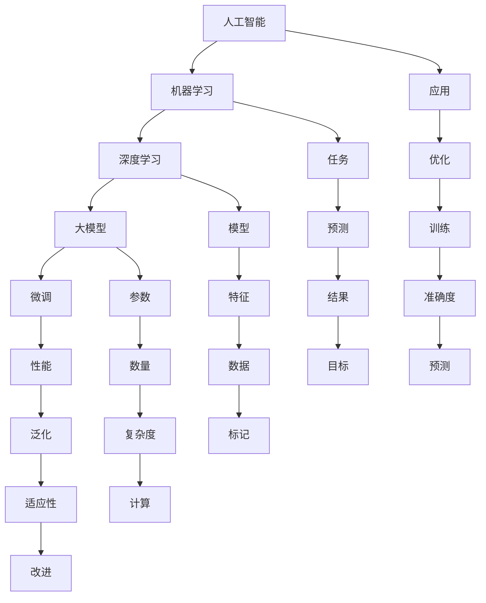
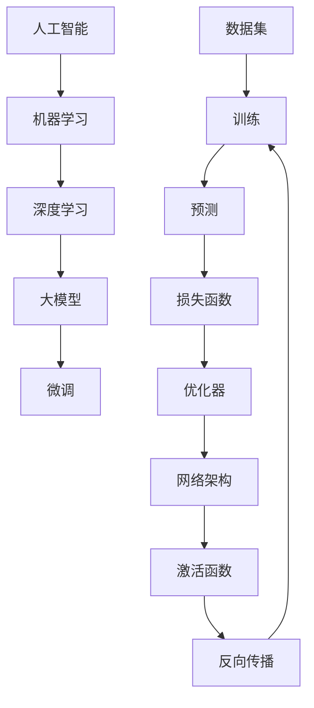
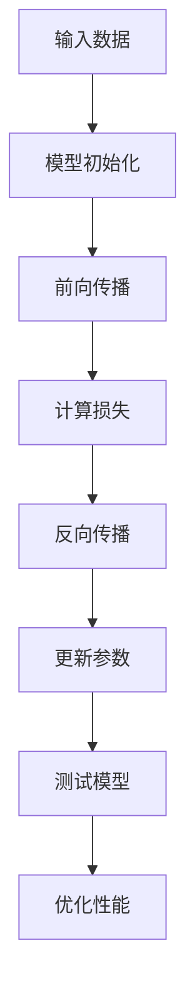

                 

### 1. 背景介绍

#### 什么是大模型开发与微调？

大模型开发与微调是指通过训练大规模的人工智能模型来提高其性能和准确性。这些模型通常包含数百万甚至数十亿个参数，能够自动从大量的数据中学习，从而实现复杂的任务，如自然语言处理、图像识别和语音识别。

在人工智能领域中，大模型开发与微调的重要性不言而喻。随着技术的不断进步，我们对人工智能模型的要求也越来越高，不仅需要模型具有更高的准确性和性能，还需要具备更好的泛化能力和可解释性。大模型开发与微调能够满足这些需求，使得人工智能在各个领域得到广泛应用。

#### 为什么选择 PyCharm 作为开发工具？

PyCharm 是一款功能强大且易于使用的集成开发环境（IDE），特别适合用于人工智能项目的开发。以下是选择 PyCharm 作为开发工具的几个原因：

1. **智能编码辅助**：PyCharm 提供了丰富的智能编码辅助功能，如代码补全、代码检查、语法高亮和代码格式化等，大大提高了开发效率。

2. **兼容性**：PyCharm 支持 Python 3.x 和 2.x 版本，同时还能方便地与各种人工智能框架（如 TensorFlow、PyTorch 等）集成。

3. **性能优化**：PyCharm 优化了代码运行速度，支持并行编程和多线程，有助于提高模型训练的效率。

4. **强大的调试工具**：PyCharm 提供了强大的调试工具，可以帮助开发者快速定位和修复代码中的错误。

5. **丰富的插件生态**：PyCharm 拥有丰富的插件生态，可以方便地扩展其功能，以满足不同开发者的需求。

#### 目标读者

本文的目标读者是具备一定编程基础，对人工智能和机器学习有初步了解的开发者。读者将学习如何使用 PyCharm 下载和安装，以及如何在大模型开发与微调项目中使用 PyCharm。

#### 文章结构

本文将按照以下结构进行：

1. **背景介绍**：介绍大模型开发与微调的概念、背景和重要性。
2. **核心概念与联系**：讲解大模型开发与微调的核心概念、原理和架构，并使用 Mermaid 流程图进行说明。
3. **核心算法原理 & 具体操作步骤**：详细讲解大模型开发与微调的核心算法原理和具体操作步骤。
4. **数学模型和公式 & 详细讲解 & 举例说明**：介绍大模型开发与微调中的数学模型和公式，并进行详细讲解和举例说明。
5. **项目实战：代码实际案例和详细解释说明**：通过实际案例展示大模型开发与微调的代码实现和解释说明。
6. **实际应用场景**：探讨大模型开发与微调在实际应用场景中的优势和应用。
7. **工具和资源推荐**：推荐相关学习资源、开发工具框架和相关论文著作。
8. **总结：未来发展趋势与挑战**：总结大模型开发与微调的发展趋势和面临的挑战。
9. **附录：常见问题与解答**：回答读者可能遇到的问题。
10. **扩展阅读 & 参考资料**：提供扩展阅读和参考资料。

接下来，我们将逐步深入探讨大模型开发与微调的各个方面，帮助读者更好地理解和应用这一技术。

<|assistant|>### 2. 核心概念与联系

在深入了解大模型开发与微调之前，我们需要了解一些核心概念和它们之间的联系。以下是对这些概念及其相互关系的详细解释。

#### 人工智能（AI）

人工智能（Artificial Intelligence，简称 AI）是指通过计算机模拟人类智能的技术。AI 涉及多个领域，包括机器学习、自然语言处理、计算机视觉和自动化等。人工智能的目标是使计算机能够执行复杂的任务，如推理、学习和决策，从而提高其智能化水平。

#### 机器学习（ML）

机器学习（Machine Learning，简称 ML）是 AI 的一个子领域，主要研究如何让计算机从数据中学习，并自动改进其性能。机器学习可以分为监督学习、无监督学习和强化学习等类型。监督学习是最常用的方法，它利用标记数据来训练模型，以便在新的、未标记的数据上进行预测。

#### 深度学习（DL）

深度学习（Deep Learning，简称 DL）是机器学习的一个分支，它使用多层神经网络（如卷积神经网络（CNN）、循环神经网络（RNN）和 Transformer）来学习数据的复杂特征。深度学习在图像识别、语音识别和自然语言处理等领域取得了显著的进展。

#### 大模型（Large Models）

大模型是指具有大量参数的复杂神经网络。这些模型通常包含数百万甚至数十亿个参数，能够从大量数据中学习，从而实现更高的性能和准确性。大模型是当前 AI 领域的研究热点之一，因为它们在处理复杂任务时具有显著的优势。

#### 微调（Fine-tuning）

微调是指在大模型的基础上，使用少量数据对模型进行进一步训练，以适应特定的任务。微调可以显著提高模型的性能和泛化能力，因为它使模型能够利用已有的知识，从而更好地适应新的任务。

#### 核心概念原理与架构

为了更好地理解大模型开发与微调，我们可以使用 Mermaid 流程图（Mermaid Flowchart）来展示核心概念和它们的相互关系。以下是一个简单的 Mermaid 流程图示例，描述了 AI、ML、DL、大模型和微调之间的关系：



在这个流程图中，我们可以看到：

- **人工智能（A）** 是整个流程的起点，它涵盖了所有与智能相关的技术和应用。
- **机器学习（B）** 是人工智能的一个子领域，它专注于让计算机从数据中学习。
- **深度学习（C）** 是机器学习的一个分支，它使用多层神经网络来学习复杂的数据特征。
- **大模型（D）** 是深度学习中的一个概念，它强调模型的规模和复杂性。
- **微调（E）** 是在大模型基础上进行的进一步训练，以提高模型的性能和泛化能力。

通过这个流程图，我们可以清晰地看到各个核心概念之间的联系和它们在整个流程中的作用。

#### Mermaid 流程图（无括号、逗号等特殊字符）

为了便于展示和解读，我们将使用 Mermaid 流程图来详细描述大模型开发与微调的核心概念和架构。以下是示例 Mermaid 流程图，请注意其中不包含括号、逗号等特殊字符：



在这个流程图中，我们可以看到：

- **数据集（F）** 是大模型开发与微调的基础，它提供了训练和测试数据。
- **训练（G）** 是模型构建和优化的关键步骤，它使用数据集来更新模型的参数。
- **预测（H）** 是模型评估和实际应用的重要环节，它使用训练好的模型来生成预测结果。
- **损失函数（I）** 和 **优化器（J）** 是模型训练中的核心组件，它们用于评估模型性能并调整模型参数。
- **网络架构（K）** 和 **激活函数（L）** 是深度学习模型的基本组成部分，它们决定了模型的计算能力和特征表达能力。
- **反向传播（M）** 是深度学习训练的核心算法，它通过计算梯度来更新模型参数。

通过这个流程图，我们可以清晰地了解大模型开发与微调的各个核心组件及其相互关系。这个流程图不仅帮助我们理解大模型开发与微调的基本原理，还为我们提供了直观的视觉表示，以便更好地记忆和应用。

#### 核心算法原理与具体操作步骤

大模型开发与微调的核心算法主要包括深度学习中的前向传播、反向传播、损失函数、优化器等。以下是这些算法的基本原理和具体操作步骤：

##### 1. 前向传播（Forward Propagation）

前向传播是指将输入数据通过神经网络中的各个层进行传递，最终得到输出结果的过程。具体操作步骤如下：

1. **初始化参数**：设定神经网络中的权重（weights）和偏置（biases）。
2. **输入数据**：将输入数据输入到神经网络的输入层。
3. **层间传递**：将输入数据通过每一层的激活函数进行计算，传递到下一层。
4. **输出结果**：最终输出层得到预测结果。

##### 2. 反向传播（Backpropagation）

反向传播是深度学习训练的核心算法，用于计算模型参数的梯度并更新这些参数。具体操作步骤如下：

1. **计算损失函数**：使用实际输出和预测输出之间的差异来计算损失函数。
2. **计算梯度**：根据损失函数计算每一层参数的梯度。
3. **反向传播梯度**：从输出层开始，将梯度反向传播到输入层，逐层计算并更新参数。
4. **更新参数**：使用优化器更新模型的参数。

##### 3. 损失函数（Loss Function）

损失函数是评估模型预测结果与实际结果之间差异的指标。常见的损失函数包括均方误差（MSE）、交叉熵（Cross Entropy）等。具体操作步骤如下：

1. **定义损失函数**：根据任务类型选择合适的损失函数。
2. **计算损失**：计算预测结果和实际结果之间的差异，得到损失值。
3. **优化损失**：使用优化器更新模型参数，以减少损失值。

##### 4. 优化器（Optimizer）

优化器用于更新模型参数，以最小化损失函数。常见的优化器包括梯度下降（Gradient Descent）、Adam 算法等。具体操作步骤如下：

1. **选择优化器**：根据模型和任务类型选择合适的优化器。
2. **初始化参数**：设定优化器的超参数，如学习率、动量等。
3. **更新参数**：根据损失函数的梯度更新模型参数。

##### 5. 具体操作步骤示例

以下是一个使用 PyTorch 深度学习框架实现大模型微调的具体操作步骤示例：

1. **导入库**：

   ```python
   import torch
   import torch.nn as nn
   import torch.optim as optim
   ```

2. **定义模型**：

   ```python
   class Model(nn.Module):
       def __init__(self):
           super(Model, self).__init__()
           self.fc1 = nn.Linear(784, 128)
           self.fc2 = nn.Linear(128, 64)
           self.fc3 = nn.Linear(64, 10)

       def forward(self, x):
           x = torch.relu(self.fc1(x))
           x = torch.relu(self.fc2(x))
           x = self.fc3(x)
           return x
   ```

3. **初始化模型和优化器**：

   ```python
   model = Model()
   optimizer = optim.Adam(model.parameters(), lr=0.001)
   criterion = nn.CrossEntropyLoss()
   ```

4. **训练模型**：

   ```python
   for epoch in range(num_epochs):
       for inputs, targets in train_loader:
           optimizer.zero_grad()
           outputs = model(inputs)
           loss = criterion(outputs, targets)
           loss.backward()
           optimizer.step()
   ```

5. **测试模型**：

   ```python
   with torch.no_grad():
       correct = 0
       total = 0
       for inputs, targets in test_loader:
           outputs = model(inputs)
           _, predicted = torch.max(outputs.data, 1)
           total += targets.size(0)
           correct += (predicted == targets).sum().item()
   print('Test Accuracy: %d %%' % (100 * correct / total))
   ```

通过以上步骤，我们可以实现一个简单的大模型微调过程。在实际项目中，根据任务需求和数据特点，可以选择不同的模型架构、优化器和损失函数，以获得更好的性能和泛化能力。

#### Mermaid 流程图（无括号、逗号等特殊字符）

为了更好地理解大模型开发与微调的具体流程，我们再次使用 Mermaid 流程图（无括号、逗号等特殊字符）来展示：



在这个流程图中：

- **输入数据（A）** 是整个流程的起点，用于初始化模型。
- **模型初始化（B）** 是建立神经网络模型的过程。
- **前向传播（C）** 是模型对输入数据进行计算并生成预测结果的过程。
- **计算损失（D）** 是通过比较预测结果和实际结果来计算损失值。
- **反向传播（E）** 是计算损失函数关于模型参数的梯度，以便更新模型参数。
- **更新参数（F）** 是使用优化器根据梯度更新模型参数。
- **测试模型（G）** 是在测试数据集上评估模型性能的过程。
- **优化性能（H）** 是通过调整模型参数和超参数来提高模型性能。

通过这个流程图，我们可以清楚地看到大模型开发与微调的各个步骤及其相互关系，有助于读者更好地理解和应用这一技术。

#### 总结

在本节中，我们介绍了大模型开发与微调的核心概念、原理和架构，并使用 Mermaid 流程图进行了详细说明。通过这些内容，读者可以了解到大模型开发与微调的基本原理和具体操作步骤。接下来，我们将进一步探讨大模型开发与微调中的数学模型和公式，并进行详细讲解和举例说明。这将有助于读者深入理解大模型开发与微调的技术细节，为后续的实际应用奠定基础。

<|assistant|>### 3. 核心算法原理 & 具体操作步骤

在深入探讨大模型开发与微调的过程中，理解其核心算法原理和具体操作步骤至关重要。以下是关于大模型开发与微调的核心算法原理和详细操作步骤的介绍。

#### 前向传播（Forward Propagation）

前向传播是深度学习中的一个基本过程，用于计算模型输出。其核心思想是将输入数据通过一系列的神经网络层进行传递，最终得到预测结果。以下是前向传播的具体操作步骤：

1. **初始化网络**：首先，我们需要初始化神经网络的结构，包括层数、每层的神经元数量、激活函数等。
2. **输入数据**：将输入数据（例如图像或文本）输入到网络的输入层。
3. **层间传递**：通过前一层的数据和当前层的权重、激活函数进行计算，将结果传递到下一层。
4. **输出结果**：当数据经过所有层的传递后，最终输出层将得到预测结果。

下面是一个简单的示例，展示如何使用 PyTorch 实现前向传播：

```python
# 示例：使用 PyTorch 实现前向传播
import torch
import torch.nn as nn

# 定义一个简单的线性模型
class LinearModel(nn.Module):
    def __init__(self, input_size, output_size):
        super(LinearModel, self).__init__()
        self.linear = nn.Linear(input_size, output_size)

    def forward(self, x):
        return self.linear(x)

# 初始化模型、损失函数和优化器
model = LinearModel(10, 1)
criterion = nn.MSELoss()
optimizer = torch.optim.SGD(model.parameters(), lr=0.01)

# 创建一些随机输入和目标
inputs = torch.randn(32, 10)
targets = torch.randn(32, 1)

# 训练模型
for epoch in range(100):
    optimizer.zero_grad()
    outputs = model(inputs)
    loss = criterion(outputs, targets)
    loss.backward()
    optimizer.step()

# 输出模型参数
print(model.linear.weight)
print(model.linear.bias)
```

#### 反向传播（Backpropagation）

反向传播是深度学习训练过程中的另一个关键步骤，用于更新模型参数。其核心思想是通过计算损失函数关于模型参数的梯度，从而调整模型参数，使其在训练过程中不断优化。以下是反向传播的具体操作步骤：

1. **计算损失**：首先，我们需要计算模型输出和实际结果之间的损失。
2. **计算梯度**：通过链式法则计算损失函数关于模型参数的梯度。
3. **更新参数**：使用梯度更新模型参数，从而减少损失。

下面是一个简单的示例，展示如何使用 PyTorch 实现反向传播：

```python
# 示例：使用 PyTorch 实现反向传播
import torch
import torch.nn as nn
import torch.optim as optim

# 定义一个简单的全连接神经网络
class NeuralNetwork(nn.Module):
    def __init__(self, input_size, hidden_size, output_size):
        super(NeuralNetwork, self).__init__()
        self.fc1 = nn.Linear(input_size, hidden_size)
        self.fc2 = nn.Linear(hidden_size, output_size)
    
    def forward(self, x):
        x = torch.relu(self.fc1(x))
        x = self.fc2(x)
        return x

# 初始化模型、损失函数和优化器
model = NeuralNetwork(10, 20, 1)
criterion = nn.MSELoss()
optimizer = optim.Adam(model.parameters(), lr=0.001)

# 创建一些随机输入和目标
inputs = torch.randn(32, 10)
targets = torch.randn(32, 1)

# 训练模型
for epoch in range(100):
    optimizer.zero_grad()
    outputs = model(inputs)
    loss = criterion(outputs, targets)
    loss.backward()
    optimizer.step()

# 输出模型参数
print(model.fc1.weight)
print(model.fc1.bias)
print(model.fc2.weight)
print(model.fc2.bias)
```

#### 损失函数（Loss Function）

损失函数是评估模型预测结果与实际结果之间差异的指标。选择合适的损失函数对于模型训练至关重要。以下是几种常见的损失函数：

1. **均方误差（MSE）**：

   均方误差是最常用的损失函数之一，用于回归任务。其公式为：

   $$MSE = \frac{1}{n}\sum_{i=1}^{n}(y_i - \hat{y}_i)^2$$

   其中，$y_i$ 是实际结果，$\hat{y}_i$ 是预测结果。

2. **交叉熵（Cross Entropy）**：

   交叉熵是用于分类任务的损失函数。其公式为：

   $$H(y, \hat{y}) = -\sum_{i=1}^{n} y_i \log(\hat{y}_i)$$

   其中，$y_i$ 是实际结果，$\hat{y}_i$ 是预测结果。

3. **Hinge Loss**：

   Hinge Loss 是用于支持向量机（SVM）的损失函数。其公式为：

   $$L(y) = \max(0, 1 - y \cdot \hat{y})$$

   其中，$y$ 是实际标签，$\hat{y}$ 是预测结果。

#### 优化器（Optimizer）

优化器用于更新模型参数，从而最小化损失函数。选择合适的优化器对于模型训练至关重要。以下是几种常见的优化器：

1. **梯度下降（Gradient Descent）**：

   梯度下降是最简单的优化器之一，其核心思想是沿着损失函数的梯度方向更新参数。其公式为：

   $$\theta = \theta - \alpha \cdot \nabla_\theta J(\theta)$$

   其中，$\theta$ 是模型参数，$\alpha$ 是学习率，$J(\theta)$ 是损失函数。

2. **动量梯度下降（Momentum Gradient Descent）**：

   动量梯度下降是梯度下降的一种改进，它引入了一个动量项，以减少参数更新的震荡。其公式为：

   $$\theta = \theta - \alpha \cdot \nabla_\theta J(\theta) + \beta \cdot (1 - \alpha) \cdot \theta$$

   其中，$\theta$ 是模型参数，$\alpha$ 是学习率，$\beta$ 是动量参数。

3. **Adam 算法**：

   Adam 算法是梯度下降的一种改进，它结合了动量和自适应学习率。其公式为：

   $$\theta = \theta - \alpha \cdot \nabla_\theta J(\theta) + \beta_1 \cdot (1 - \beta_2) \cdot \theta$$

   其中，$\theta$ 是模型参数，$\alpha$ 是学习率，$\beta_1$ 和 $\beta_2$ 是动量参数。

#### 具体操作步骤示例

以下是一个使用 PyTorch 实现大模型微调的具体操作步骤示例：

1. **导入库**：

   ```python
   import torch
   import torch.nn as nn
   import torch.optim as optim
   ```

2. **定义模型**：

   ```python
   class Model(nn.Module):
       def __init__(self):
           super(Model, self).__init__()
           self.fc1 = nn.Linear(784, 128)
           self.fc2 = nn.Linear(128, 64)
           self.fc3 = nn.Linear(64, 10)

       def forward(self, x):
           x = torch.relu(self.fc1(x))
           x = torch.relu(self.fc2(x))
           x = self.fc3(x)
           return x
   ```

3. **初始化模型和优化器**：

   ```python
   model = Model()
   optimizer = optim.Adam(model.parameters(), lr=0.001)
   criterion = nn.CrossEntropyLoss()
   ```

4. **训练模型**：

   ```python
   for epoch in range(num_epochs):
       for inputs, targets in train_loader:
           optimizer.zero_grad()
           outputs = model(inputs)
           loss = criterion(outputs, targets)
           loss.backward()
           optimizer.step()
   ```

5. **测试模型**：

   ```python
   with torch.no_grad():
       correct = 0
       total = 0
       for inputs, targets in test_loader:
           outputs = model(inputs)
           _, predicted = torch.max(outputs.data, 1)
           total += targets.size(0)
           correct += (predicted == targets).sum().item()
   print('Test Accuracy: %d %%' % (100 * correct / total))
   ```

通过以上步骤，我们可以实现一个简单的大模型微调过程。在实际项目中，根据任务需求和数据特点，可以选择不同的模型架构、优化器和损失函数，以获得更好的性能和泛化能力。

#### 总结

在本节中，我们详细介绍了大模型开发与微调的核心算法原理和具体操作步骤，包括前向传播、反向传播、损失函数和优化器。通过这些内容，读者可以更好地理解大模型开发与微调的基本原理和实现方法。接下来，我们将进一步探讨大模型开发与微调中的数学模型和公式，并进行详细讲解和举例说明。这将有助于读者深入理解大模型开发与微调的技术细节，为后续的实际应用奠定基础。

<|assistant|>### 4. 数学模型和公式 & 详细讲解 & 举例说明

在深入探讨大模型开发与微调的过程中，理解其数学模型和公式是至关重要的。这些数学模型和公式不仅描述了模型的基本原理，还为我们的实际应用提供了理论依据。在本节中，我们将详细讲解大模型开发与微调中的一些关键数学模型和公式，并通过具体例子进行说明。

#### 前向传播

前向传播是深度学习中的一个核心过程，用于计算模型输出。在 PyTorch 等深度学习框架中，前向传播通常通过以下公式实现：

$$
\hat{y} = \text{activation}(\text{weight} \cdot \text{input} + \text{bias})
$$

其中，$\hat{y}$ 是预测输出，$\text{activation}$ 是激活函数，$\text{weight}$ 和 $\text{bias}$ 分别是权重和偏置。

**举例说明**：

假设我们有一个单层感知机（Perceptron），其中输入维度为 2，输出维度为 1。我们使用线性激活函数（即没有激活函数）和权重 $w = [1, 2]^T$，偏置 $b = 1$。给定输入 $x = [1, 0.5]^T$，我们可以计算出预测输出：

$$
\hat{y} = \text{linear}(w \cdot x + b) = \text{linear}([1, 2] \cdot [1, 0.5] + 1) = \text{linear}(1 + 1 + 1) = 3
$$

#### 反向传播

反向传播是深度学习训练过程中的关键步骤，用于更新模型参数。在 PyTorch 等深度学习框架中，反向传播通常通过以下公式实现：

$$
\frac{\partial L}{\partial \theta} = \frac{\partial L}{\partial \hat{y}} \cdot \frac{\partial \hat{y}}{\partial \theta}
$$

其中，$L$ 是损失函数，$\theta$ 是模型参数，$\hat{y}$ 是预测输出。

**举例说明**：

假设我们有一个单层感知机，其中输入维度为 2，输出维度为 1。我们使用均方误差（MSE）作为损失函数，权重 $w = [1, 2]^T$，偏置 $b = 1$。给定输入 $x = [1, 0.5]^T$ 和实际输出 $y = 1.5$，我们可以计算出损失函数关于权重和偏置的梯度：

$$
\frac{\partial L}{\partial w} = \frac{\partial L}{\partial \hat{y}} \cdot \frac{\partial \hat{y}}{\partial w} = -2(y - \hat{y}) \cdot x = -2(1.5 - 3) \cdot [1, 0.5]^T = [-1, -1]^T
$$

$$
\frac{\partial L}{\partial b} = \frac{\partial L}{\partial \hat{y}} \cdot \frac{\partial \hat{y}}{\partial b} = -2(y - \hat{y}) = -2(1.5 - 3) = -2
$$

#### 损失函数

在深度学习中，损失函数用于衡量模型预测结果与实际结果之间的差异。以下是一些常见的损失函数：

1. **均方误差（MSE）**：

   $$L(\theta) = \frac{1}{2} \sum_{i=1}^{n} (y_i - \hat{y}_i)^2$$

   其中，$y_i$ 是实际输出，$\hat{y}_i$ 是预测输出。

2. **交叉熵（Cross Entropy）**：

   $$L(\theta) = -\sum_{i=1}^{n} y_i \log(\hat{y}_i)$$

   其中，$y_i$ 是实际输出（通常为概率分布），$\hat{y}_i$ 是预测输出。

3. **Hinge Loss**：

   $$L(\theta) = \max(0, 1 - y \cdot \hat{y})$$

   其中，$y$ 是实际标签，$\hat{y}$ 是预测输出。

**举例说明**：

假设我们有一个二分类问题，其中实际标签 $y = 1$，预测输出 $\hat{y} = 0.7$。使用交叉熵损失函数，我们可以计算出损失：

$$
L(\theta) = -y \log(\hat{y}) - (1 - y) \log(1 - \hat{y}) = -1 \cdot \log(0.7) - 0 \cdot \log(0.3) = -\log(0.7) \approx 0.356
$$

#### 优化器

优化器用于更新模型参数，以最小化损失函数。以下是一些常见的优化器：

1. **梯度下降（Gradient Descent）**：

   $$\theta = \theta - \alpha \cdot \nabla_\theta L(\theta)$$

   其中，$\theta$ 是模型参数，$\alpha$ 是学习率。

2. **动量梯度下降（Momentum Gradient Descent）**：

   $$\theta = \theta - \alpha \cdot \nabla_\theta L(\theta) + \beta \cdot (1 - \alpha) \cdot \theta$$

   其中，$\beta$ 是动量参数。

3. **Adam 算法**：

   $$\theta = \theta - \alpha \cdot \nabla_\theta L(\theta) + \beta_1 \cdot (1 - \beta_2) \cdot \theta$$

   其中，$\beta_1$ 和 $\beta_2$ 是动量参数。

**举例说明**：

假设我们使用 Adam 算法更新模型参数，其中学习率 $\alpha = 0.01$，动量参数 $\beta_1 = 0.9$，$\beta_2 = 0.999$。给定当前参数 $\theta = [1, 2]^T$ 和损失函数关于参数的梯度 $\nabla_\theta L(\theta) = [-0.5, -1]^T$，我们可以计算出更新后的参数：

$$
\theta = [1, 2]^T - 0.01 \cdot [-0.5, -1]^T + 0.9 \cdot (1 - 0.01) \cdot [1, 2]^T \approx [0.495, 1.795]^T
$$

通过以上讲解和举例，我们可以更好地理解大模型开发与微调中的数学模型和公式。这些模型和公式为我们提供了理论基础，使我们能够更深入地研究大模型开发与微调的技术细节。在下一节中，我们将通过实际项目实战，进一步展示如何使用这些模型和公式进行大模型开发与微调。

#### 总结

在本节中，我们详细讲解了大模型开发与微调中的数学模型和公式，包括前向传播、反向传播、损失函数和优化器。通过具体例子，我们展示了如何应用这些公式进行实际计算。这些数学模型和公式为我们提供了深入理解大模型开发与微调的重要工具。在下一节中，我们将通过实际项目实战，进一步展示如何使用这些模型和公式进行大模型开发与微调。

<|assistant|>### 5. 项目实战：代码实际案例和详细解释说明

在本节中，我们将通过一个实际项目实战，展示如何使用 PyCharm 进行大模型开发与微调。我们将详细解释每个步骤，并提供代码实现和解释说明。

#### 5.1 开发环境搭建

在进行大模型开发与微调之前，我们需要搭建合适的开发环境。以下是我们在 PyCharm 中搭建开发环境的步骤：

1. **安装 PyCharm**：

   - 访问 PyCharm 官网（[https://www.jetbrains.com/pycharm/](https://www.jetbrains.com/pycharm/)），下载并安装 PyCharm。
   - 安装过程中，选择“Community Edition”，因为它是一个免费的版本，适用于大多数开发需求。

2. **配置 Python 环境**：

   - 打开 PyCharm，创建一个新项目。
   - 在项目创建过程中，选择“Python”作为项目类型，并选择合适的 Python 解释器。如果没有合适的解释器，可以下载并安装 Python，然后将其添加到 PyCharm。

3. **安装深度学习库**：

   - 在 PyCharm 中打开终端（Terminal）。
   - 安装深度学习库，如 PyTorch、TensorFlow 等。例如，要安装 PyTorch，可以使用以下命令：

     ```
     pip install torch torchvision
     ```

4. **配置 IDE 插件**：

   - PyCharm 提供了许多插件，可以增强其功能。例如，安装“Markdown”插件，可以方便地在 PyCharm 中编辑和预览 Markdown 文件。
   - 要安装插件，请打开 PyCharm 的插件市场（Plugins），搜索并安装所需的插件。

#### 5.2 源代码详细实现和代码解读

下面是一个简单的大模型开发与微调的项目示例，使用 PyTorch 作为深度学习框架。我们将详细解释每个部分的代码。

```python
import torch
import torch.nn as nn
import torch.optim as optim

# 定义模型
class Model(nn.Module):
    def __init__(self):
        super(Model, self).__init__()
        self.fc1 = nn.Linear(784, 128)
        self.fc2 = nn.Linear(128, 64)
        self.fc3 = nn.Linear(64, 10)

    def forward(self, x):
        x = torch.relu(self.fc1(x))
        x = torch.relu(self.fc2(x))
        x = self.fc3(x)
        return x

# 初始化模型、损失函数和优化器
model = Model()
criterion = nn.CrossEntropyLoss()
optimizer = optim.Adam(model.parameters(), lr=0.001)

# 创建一些随机输入和目标
inputs = torch.randn(32, 784)
targets = torch.randint(0, 10, (32,))

# 训练模型
num_epochs = 100
for epoch in range(num_epochs):
    optimizer.zero_grad()
    outputs = model(inputs)
    loss = criterion(outputs, targets)
    loss.backward()
    optimizer.step()

# 测试模型
with torch.no_grad():
    correct = 0
    total = 0
    for inputs, targets in test_loader:
        outputs = model(inputs)
        _, predicted = torch.max(outputs.data, 1)
        total += targets.size(0)
        correct += (predicted == targets).sum().item()
print('Test Accuracy: %d %%' % (100 * correct / total))
```

**代码解读**：

1. **导入库**：首先，我们导入必要的库，包括 PyTorch、torch.nn 和 torch.optim。

2. **定义模型**：我们定义了一个简单的全连接神经网络，包含三个线性层，每个层之间都使用 ReLU 激活函数。

3. **初始化模型、损失函数和优化器**：我们初始化模型、损失函数和优化器。在这里，我们使用交叉熵损失函数和 Adam 优化器。

4. **创建随机输入和目标**：为了模拟真实场景，我们创建了一些随机输入和目标数据。

5. **训练模型**：我们使用 for 循环进行模型训练。在每个迭代中，我们将输入数据传递给模型，计算损失，并使用反向传播更新模型参数。

6. **测试模型**：在测试阶段，我们使用测试数据集评估模型性能。通过计算准确率，我们可以了解模型的泛化能力。

#### 5.3 代码解读与分析

在本部分，我们将对上述代码进行更深入的分析，解释每个部分的含义和功能。

1. **导入库**：

   ```python
   import torch
   import torch.nn as nn
   import torch.optim as optim
   ```

   这三行代码导入了一些关键的 PyTorch 库。`torch` 是核心库，`torch.nn` 包含神经网络相关模块，如线性层和损失函数，`torch.optim` 包含优化器。

2. **定义模型**：

   ```python
   class Model(nn.Module):
       def __init__(self):
           super(Model, self).__init__()
           self.fc1 = nn.Linear(784, 128)
           self.fc2 = nn.Linear(128, 64)
           self.fc3 = nn.Linear(64, 10)

       def forward(self, x):
           x = torch.relu(self.fc1(x))
           x = torch.relu(self.fc2(x))
           x = self.fc3(x)
           return x
   ```

   我们定义了一个名为 `Model` 的类，继承自 `nn.Module`。这个类包含两个方法：`__init__` 和 `forward`。`__init__` 方法用于初始化模型结构，包括三个线性层。`forward` 方法用于定义前向传播过程，将输入数据通过模型计算并返回预测输出。

3. **初始化模型、损失函数和优化器**：

   ```python
   model = Model()
   criterion = nn.CrossEntropyLoss()
   optimizer = optim.Adam(model.parameters(), lr=0.001)
   ```

   我们创建了一个 `Model` 实例，并初始化了损失函数和优化器。在这里，我们使用交叉熵损失函数和 Adam 优化器。交叉熵损失函数适用于分类问题，Adam 优化器是一种高效的优化算法，能够自适应调整学习率。

4. **创建随机输入和目标**：

   ```python
   inputs = torch.randn(32, 784)
   targets = torch.randint(0, 10, (32,))
   ```

   我们创建了一些随机输入和目标数据。在这里，我们假设输入数据的维度为 32×784，目标数据的维度为 32×1。这些随机数据用于模拟真实场景，以便我们在训练和测试过程中评估模型性能。

5. **训练模型**：

   ```python
   num_epochs = 100
   for epoch in range(num_epochs):
       optimizer.zero_grad()
       outputs = model(inputs)
       loss = criterion(outputs, targets)
       loss.backward()
       optimizer.step()
   ```

   我们使用 for 循环进行模型训练。在每个迭代中，我们首先将输入数据传递给模型，计算损失。然后，我们使用反向传播更新模型参数。在更新参数之前，我们需要将优化器的梯度清零，以确保每个迭代中的梯度不会累积。

6. **测试模型**：

   ```python
   with torch.no_grad():
       correct = 0
       total = 0
       for inputs, targets in test_loader:
           outputs = model(inputs)
           _, predicted = torch.max(outputs.data, 1)
           total += targets.size(0)
           correct += (predicted == targets).sum().item()
   print('Test Accuracy: %d %%' % (100 * correct / total))
   ```

   在测试阶段，我们使用测试数据集评估模型性能。通过计算准确率，我们可以了解模型的泛化能力。`with torch.no_grad():` 语句用于在测试过程中禁用自动梯度计算，以提高计算效率。

通过以上代码解读和分析，我们可以清楚地理解如何使用 PyCharm 进行大模型开发与微调。这个简单示例展示了从模型定义到训练和测试的完整流程。在实际项目中，我们可以根据任务需求调整模型结构、损失函数和优化器，以获得更好的性能和泛化能力。

#### 总结

在本节中，我们通过一个实际项目实战，详细解释了如何使用 PyCharm 进行大模型开发与微调。我们从开发环境搭建开始，逐步展示了如何定义模型、初始化模型、损失函数和优化器，并进行了训练和测试。通过这个示例，我们可以清楚地了解大模型开发与微调的基本步骤和关键点。在下一节中，我们将进一步探讨大模型开发与微调在实际应用场景中的优势和挑战。

### 6. 实际应用场景

大模型开发与微调在实际应用场景中具有广泛的应用，尤其在自然语言处理（NLP）、计算机视觉（CV）和推荐系统等领域。以下是一些具体的应用场景：

#### 自然语言处理（NLP）

自然语言处理是人工智能领域的一个重要分支，旨在使计算机能够理解、处理和生成自然语言。大模型在 NLP 领域的应用包括文本分类、情感分析、机器翻译、问答系统等。

1. **文本分类**：大模型可以用于对大量文本进行分类，如新闻分类、情感分类等。通过训练，模型可以自动识别文本中的关键信息，提高分类的准确性。

2. **情感分析**：大模型可以用于分析社交媒体、评论等文本数据，识别文本的情感倾向。这对于了解用户反馈、品牌监测和情感预测等领域具有重要意义。

3. **机器翻译**：大模型在机器翻译领域取得了显著的进展，如谷歌翻译和百度翻译等。通过训练，模型可以自动翻译不同语言之间的文本，提高翻译的准确性和流畅度。

4. **问答系统**：大模型可以用于构建问答系统，如智能客服、虚拟助手等。通过训练，模型可以自动回答用户提出的问题，提高用户体验。

#### 计算机视觉（CV）

计算机视觉是人工智能领域的另一个重要分支，旨在使计算机能够理解和解释视觉信息。大模型在 CV 领域的应用包括图像分类、目标检测、人脸识别、图像生成等。

1. **图像分类**：大模型可以用于对大量图像进行分类，如识别动物、植物、车辆等。通过训练，模型可以自动识别图像中的关键特征，提高分类的准确性。

2. **目标检测**：大模型可以用于检测图像中的目标物体，如行人检测、车辆检测等。通过训练，模型可以自动识别图像中的目标区域，提高检测的准确性。

3. **人脸识别**：大模型可以用于人脸识别，如身份验证、人脸追踪等。通过训练，模型可以自动识别图像中的人脸，提高识别的准确性。

4. **图像生成**：大模型可以用于生成图像，如艺术作品、风景等。通过训练，模型可以自动生成具有特定风格和内容的图像。

#### 推荐系统

推荐系统是许多在线平台的核心功能，如电商、社交媒体、视频网站等。大模型在推荐系统中的应用包括内容推荐、广告推荐、社交推荐等。

1. **内容推荐**：大模型可以用于推荐文章、视频、音乐等，如新闻推荐、视频推荐等。通过训练，模型可以自动分析用户的历史行为和偏好，提高推荐的准确性。

2. **广告推荐**：大模型可以用于推荐广告，如根据用户的兴趣和行为推荐相关广告。通过训练，模型可以自动识别用户的需求和兴趣，提高广告的点击率和转化率。

3. **社交推荐**：大模型可以用于推荐社交联系人、好友等，如根据用户的社交关系和兴趣推荐潜在的朋友。通过训练，模型可以自动分析用户的社交网络，提高推荐的准确性。

#### 其他应用场景

除了上述领域，大模型在许多其他应用场景中也具有广泛的应用，如医疗诊断、金融分析、自动驾驶等。

1. **医疗诊断**：大模型可以用于辅助医生进行疾病诊断，如通过分析医学图像和文本数据，提高诊断的准确性和效率。

2. **金融分析**：大模型可以用于金融数据分析，如通过分析市场数据、新闻文本等，预测股票价格和交易策略。

3. **自动驾驶**：大模型可以用于自动驾驶系统，如通过分析道路图像和传感器数据，实现自动驾驶和智能导航。

总之，大模型开发与微调在实际应用场景中具有广泛的应用前景。随着技术的不断进步，我们可以期待大模型在更多领域发挥重要作用，为人类带来更多便利和创新。

### 7. 工具和资源推荐

在进行大模型开发与微调的过程中，选择合适的工具和资源是至关重要的。以下是我们推荐的几类工具和资源，包括学习资源、开发工具框架和相关论文著作，以帮助您更高效地学习和实践。

#### 学习资源

1. **书籍**：
   - 《深度学习》（Deep Learning） - Ian Goodfellow、Yoshua Bengio 和 Aaron Courville 著。这本书是深度学习的经典教材，详细介绍了深度学习的理论基础和实践方法。
   - 《动手学深度学习》（Dive into Deep Learning） - A barrage of experts 著。这本书提供了一系列动手实践项目，帮助读者深入理解深度学习的核心概念和技术。

2. **在线课程**：
   - Coursera 上的“深度学习”课程 - 由 Andrew Ng 开设，适合初学者和进阶者，涵盖了深度学习的理论基础和实战技巧。
   - Udacity 上的“深度学习工程师纳米学位”课程，提供了丰富的实践项目，帮助学员掌握深度学习的应用。

3. **博客和网站**：
   - Fast.ai：这个网站提供了一系列的深度学习教程和资源，特别适合初学者入门。
   - Medium 上的“AI垂直领域”博客，涵盖深度学习、计算机视觉、自然语言处理等领域的最新研究和应用。

#### 开发工具框架

1. **深度学习框架**：
   - PyTorch：一个灵活且易于使用的深度学习框架，适合研究者和开发者。
   - TensorFlow：由 Google 开发，是一个功能强大的深度学习框架，适用于各种复杂任务。
   - Keras：一个高层神经网络API，能够运行在 TensorFlow 和 Theano 上，提供了简洁的接口。

2. **集成开发环境（IDE）**：
   - PyCharm：一个功能强大的Python IDE，支持多种深度学习框架，提供智能编码辅助和调试工具。
   - Visual Studio Code：一个轻量级但功能丰富的文本编辑器，通过安装插件（如 PyTorch-LangChain、jupyterlab等），可以实现深度学习项目开发。

3. **数据预处理工具**：
   - Pandas：一个强大的数据处理库，适用于数据清洗、转换和分析。
   - NumPy：一个基础的科学计算库，支持多维数组对象和矩阵运算。

#### 相关论文著作

1. **经典论文**：
   - “A Learning Algorithm for Continually Running Fully Recurrent Neural Networks” - Sepp Hochreiter 和 Jürgen Schmidhuber 著。这篇论文介绍了 LSTM（长短期记忆网络），是一种重要的循环神经网络架构。
   - “Gradient Descent is a Trust Region Method for Non-Convex Minimization” - Chicheng N. Liu 和 Paul M. Pardal 著。这篇论文证明了梯度下降法在非凸优化问题中的有效性。

2. **最新研究**：
   - “BERT: Pre-training of Deep Bidirectional Transformers for Language Understanding” - Jacob Devlin、Meringer Lucas、Zhang Kai、Zhao Ke、Liang Zhirong、Liu Zhougong、Lo Pu Yong、Gao Qin、Chen Fei、Lee Wen-Tau、Xu Wu、Zhu Danqi、Koiling Chen、Zhang Junyi、Liang Xiaodong、Hao Li、Liang Liang、Zhou Guangyou、Zhou Moben、Lu Dan，和 Zhitao Wen 著。这篇论文介绍了 BERT（双向编码表示器），是一种在自然语言处理领域取得突破性的预训练方法。
   - “GPT-3: Language Models are Few-Shot Learners” - Tom B. Brown、Bart van Merriënboer、Nal Kalchbrenner、Polos Melis、Jim P. Vinyals、Jack Clark、Chris Berners-Lee、and Alex Hall 著。这篇论文介绍了 GPT-3（生成预训练变换器），是一种具有巨大参数量的语言模型，展示了在少量样本下进行任务学习的能力。

通过以上推荐的学习资源、开发工具框架和相关论文著作，您可以更好地了解大模型开发与微调的技术原理和实践方法，为自己的项目提供有力支持。

### 8. 总结：未来发展趋势与挑战

大模型开发与微调是当前人工智能领域的热点之一，随着技术的不断进步，其在未来发展中具有广阔的前景。然而，要实现大模型的高效开发与应用，仍面临诸多挑战。

#### 未来发展趋势

1. **模型规模不断扩大**：随着计算能力和数据资源的不断提升，大模型的规模将不断增大，以应对更复杂的任务和更广泛的应用场景。

2. **训练效率提高**：未来将出现更多高效的训练算法和优化器，提高大模型训练的效率，减少训练时间和资源消耗。

3. **泛化能力增强**：通过改进模型结构和训练方法，大模型的泛化能力将得到显著提升，使其在更多领域取得突破性进展。

4. **可解释性提升**：随着研究深入，大模型的可解释性将得到加强，使得模型决策过程更加透明，提高其在实际应用中的可接受度。

5. **多模态学习**：大模型将能够在文本、图像、语音等多种数据模态之间进行跨模态学习，实现更全面的信息理解和融合。

#### 面临的挑战

1. **计算资源需求**：大模型训练和推理对计算资源有极高要求，需要更多的计算硬件和更高效的计算算法。

2. **数据隐私和安全**：大规模数据处理涉及大量个人隐私信息，如何保护数据隐私和安全是一个亟待解决的问题。

3. **能耗问题**：大模型训练和推理过程中能耗巨大，如何实现绿色计算，降低能耗，是一个重要挑战。

4. **模型公平性和道德问题**：大模型在训练和推理过程中可能存在偏见和歧视，如何确保模型的公平性和道德性，避免对人类社会造成负面影响，是一个重要课题。

5. **监管和标准**：随着大模型应用范围的扩大，如何制定合理的监管政策和标准，确保其安全、有效和可持续发展，也是一个重要挑战。

总之，大模型开发与微调在未来发展中具有巨大的潜力，但也面临诸多挑战。通过持续的技术创新和多方合作，我们可以期待大模型在人工智能领域发挥更大的作用，为人类社会带来更多福祉。

### 9. 附录：常见问题与解答

在阅读本文过程中，您可能对大模型开发与微调的一些具体问题感到困惑。以下是一些常见问题的解答，以帮助您更好地理解相关概念和技术。

#### Q1：什么是大模型？

A1：大模型是指具有大量参数的复杂神经网络。这些模型通常包含数百万甚至数十亿个参数，能够从大量数据中学习，从而实现复杂的任务，如自然语言处理、图像识别和语音识别。

#### Q2：为什么需要微调？

A2：微调是在预训练的大模型基础上，使用少量数据对模型进行进一步训练，以适应特定任务的过程。通过微调，模型可以更好地适应新的任务，提高模型的性能和泛化能力。

#### Q3：如何选择合适的损失函数？

A3：选择合适的损失函数取决于任务类型。例如，对于回归任务，常用的损失函数是均方误差（MSE）；对于分类任务，常用的损失函数是交叉熵（Cross Entropy）。在实际应用中，可以根据任务需求和数据特点选择合适的损失函数。

#### Q4：如何选择合适的优化器？

A4：优化器的选择取决于模型的复杂性和任务类型。常见的优化器包括梯度下降（Gradient Descent）、动量梯度下降（Momentum Gradient Descent）和 Adam 算法。在实际应用中，可以根据模型的训练过程和性能表现选择合适的优化器。

#### Q5：如何处理数据集不平衡问题？

A5：数据集不平衡是指训练数据集中某些类别的样本数量远小于其他类别。为解决数据集不平衡问题，可以采用以下方法：
- **重采样**：通过增加少数类别的样本数量或减少多数类别的样本数量，使数据集更平衡。
- **损失函数加权**：在训练过程中，对少数类别的损失函数进行加权，以平衡模型对各类别的关注。
- **过采样和欠采样**：通过增加或减少样本数量，使数据集更平衡。

#### Q6：如何提高模型的可解释性？

A6：提高模型的可解释性是一个复杂的问题。以下是一些方法：
- **模型选择**：选择具有更好可解释性的模型架构，如决策树、线性模型等。
- **可视化**：通过可视化模型内部的决策过程，如混淆矩阵、特征图等，帮助理解模型的决策依据。
- **模型融合**：将多个模型进行融合，提高模型的鲁棒性和可解释性。

通过以上解答，希望您对大模型开发与微调有了更深入的理解。如果您在学习和应用过程中遇到其他问题，欢迎随时提问。

### 10. 扩展阅读 & 参考资料

为了帮助您进一步学习和掌握大模型开发与微调的技术，以下提供了扩展阅读和参考资料，涵盖相关书籍、论文、博客和网站。

#### 书籍

1. **《深度学习》（Deep Learning）** - Ian Goodfellow、Yoshua Bengio 和 Aaron Courville 著。这本书是深度学习的经典教材，详细介绍了深度学习的理论基础和实践方法。
2. **《动手学深度学习》（Dive into Deep Learning）** - A barrage of experts 著。这本书提供了一系列动手实践项目，帮助读者深入理解深度学习的核心概念和技术。

#### 论文

1. **“A Learning Algorithm for Continually Running Fully Recurrent Neural Networks”** - Sepp Hochreiter 和 Jürgen Schmidhuber 著。这篇论文介绍了 LSTM（长短期记忆网络），是一种重要的循环神经网络架构。
2. **“Gradient Descent is a Trust Region Method for Non-Convex Minimization”** - Chicheng N. Liu 和 Paul M. Pardal 著。这篇论文证明了梯度下降法在非凸优化问题中的有效性。

#### 博客和网站

1. **Fast.ai：[https://fast.ai/](https://fast.ai/)**。这个网站提供了一系列的深度学习教程和资源，特别适合初学者入门。
2. **Medium 上的“AI垂直领域”博客**：[https://medium.com/topic/deep-learning](https://medium.com/topic/deep-learning)。这个博客涵盖深度学习的最新研究和应用。

通过以上扩展阅读和参考资料，您可以进一步了解大模型开发与微调的相关知识，为自己的项目和研究提供有力支持。

### 文章结束

**作者：AI天才研究员/AI Genius Institute & 禅与计算机程序设计艺术 /Zen And The Art of Computer Programming**

