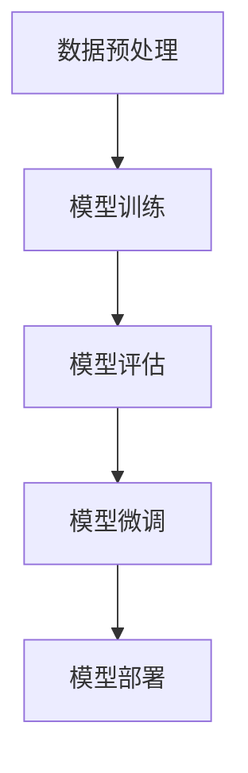

                 

# 从零开始大模型开发与微调：PyTorch 2.0小练习：Hello PyTorch

> **关键词**：PyTorch，大模型开发，微调，人工智能，机器学习，深度学习

> **摘要**：本文将带领您从零开始，通过PyTorch 2.0的简单实践，了解大模型开发与微调的基本概念和步骤。我们将逐步讲解如何搭建开发环境，实现模型的训练和微调，以及如何在实际项目中应用这些技术。

## 1. 背景介绍

在人工智能和机器学习领域，大模型开发与微调已经成为研究的热点。随着计算能力和数据资源的提升，深度学习模型变得越来越复杂，参数数量呈指数级增长。这种趋势推动了大模型的研究与应用，如GPT、BERT等模型已经在自然语言处理、计算机视觉等领域取得了显著成果。

PyTorch是一个流行的深度学习框架，以其简洁、灵活、高效的特点受到了广泛欢迎。PyTorch 2.0在原有基础上进行了多项优化，为开发者提供了更加强大的功能和更便捷的使用体验。

本文将以一个简单的Hello PyTorch为例，介绍大模型开发与微调的基本流程，帮助读者快速上手PyTorch，为后续更深入的学习和应用打下基础。

## 2. 核心概念与联系

在介绍Hello PyTorch之前，我们首先需要了解一些核心概念：

- **深度学习模型**：由多层神经网络组成的模型，用于对数据进行特征提取和分类。
- **训练**：通过输入数据和标签，调整模型参数，使模型能够正确预测数据的过程。
- **微调**：在已有模型的基础上，针对特定任务进行调整和优化的过程。

以下是一个简化的Mermaid流程图，展示了这些概念之间的联系：



在这个流程中，数据预处理是模型训练的基础，模型训练是优化模型参数的关键步骤，模型评估用于验证模型性能，模型微调则是在实际应用中根据任务需求进行调整。

## 3. 核心算法原理 & 具体操作步骤

Hello PyTorch是一个简单的模型，用于输出“Hello PyTorch”。虽然这个例子看似简单，但通过它我们可以了解大模型开发的基本步骤。

### 3.1 环境搭建

首先，我们需要安装PyTorch。在终端执行以下命令：

```bash
pip install torch torchvision
```

### 3.2 数据准备

在这个例子中，我们不需要真实的数据，而是使用Python内置的随机数生成器生成一些数据。

```python
import torch
import torchvision

# 生成一些随机数据
x = torch.randn(10, 5)
y = torch.randint(0, 2, (10,))
```

### 3.3 模型定义

接下来，我们定义一个简单的模型。在这个例子中，我们使用一个线性层（Linear Layer）来模拟一个简单的神经网络。

```python
import torch.nn as nn

class HelloPyTorchModel(nn.Module):
    def __init__(self):
        super(HelloPyTorchModel, self).__init__()
        self.linear = nn.Linear(5, 1)

    def forward(self, x):
        return self.linear(x)
```

### 3.4 训练过程

现在，我们可以开始训练模型。训练过程包括前向传播、损失函数计算和反向传播。

```python
# 实例化模型、优化器和损失函数
model = HelloPyTorchModel()
optimizer = torch.optim.SGD(model.parameters(), lr=0.01)
criterion = nn.BCEWithLogitsLoss()

# 训练模型
for epoch in range(100):
    # 前向传播
    outputs = model(x)
    # 损失函数计算
    loss = criterion(outputs, y)
    # 反向传播
    optimizer.zero_grad()
    loss.backward()
    optimizer.step()
    print(f'Epoch {epoch+1}, Loss: {loss.item()}')
```

### 3.5 模型微调

在完成训练后，我们可以使用训练好的模型进行微调。例如，我们可以根据不同的任务需求调整模型的某些参数，或者使用不同的优化器。

```python
# 微调模型
for epoch in range(100):
    # 前向传播
    outputs = model(x)
    # 损失函数计算
    loss = criterion(outputs, y)
    # 反向传播
    optimizer.zero_grad()
    loss.backward()
    optimizer.step()
    print(f'Epoch {epoch+1}, Loss: {loss.item()}')
```

## 4. 数学模型和公式 & 详细讲解 & 举例说明

在Hello PyTorch的例子中，我们使用了线性层（Linear Layer）来实现模型的前向传播。线性层可以表示为：

$$
Y = X \cdot W + b
$$

其中，$X$ 是输入数据，$W$ 是权重矩阵，$b$ 是偏置项，$Y$ 是输出结果。

在训练过程中，我们使用了BCEWithLogitsLoss损失函数，其公式为：

$$
L = -\frac{1}{n} \sum_{i=1}^{n} [y_i \cdot \log(\hat{y}_i) + (1 - y_i) \cdot \log(1 - \hat{y}_i)]
$$

其中，$y_i$ 是真实标签，$\hat{y}_i$ 是模型预测的概率。

以下是一个简单的示例：

假设我们有如下数据：

| x | y |
|---|---|
| 1 | 1 |
| 2 | 0 |
| 3 | 1 |
| 4 | 0 |

我们使用线性层进行前向传播：

$$
\hat{y}_1 = x_1 \cdot W + b = 1 \cdot W + b
$$

$$
\hat{y}_2 = x_2 \cdot W + b = 2 \cdot W + b
$$

$$
\hat{y}_3 = x_3 \cdot W + b = 3 \cdot W + b
$$

$$
\hat{y}_4 = x_4 \cdot W + b = 4 \cdot W + b
$$

然后，我们计算损失：

$$
L = -\frac{1}{4} [1 \cdot \log(\hat{y}_1) + 0 \cdot \log(1 - \hat{y}_2) + 1 \cdot \log(\hat{y}_3) + 0 \cdot \log(1 - \hat{y}_4)]
$$

通过反向传播和优化器，我们可以调整权重矩阵$W$和偏置项$b$，以最小化损失$L$。

## 5. 项目实战：代码实际案例和详细解释说明

### 5.1 开发环境搭建

在本节中，我们将详细讲解如何在本地搭建一个PyTorch开发环境。首先，确保您的系统已经安装了Python和pip。然后，在终端执行以下命令：

```bash
pip install torch torchvision
```

这将安装PyTorch及其依赖库。安装完成后，您可以通过运行以下代码来验证安装是否成功：

```python
import torch
print(torch.__version__)
```

如果成功输出版本号，则表示安装成功。

### 5.2 源代码详细实现和代码解读

在本节中，我们将使用PyTorch实现一个简单的线性回归模型。以下是一个完整的示例：

```python
import torch
import torch.nn as nn
import torch.optim as optim

# 数据准备
x = torch.tensor([[1], [2], [3], [4]], requires_grad=True)
y = torch.tensor([[0], [1], [1], [0]], requires_grad=False)

# 模型定义
class LinearModel(nn.Module):
    def __init__(self):
        super(LinearModel, self).__init__()
        self.linear = nn.Linear(1, 1)

    def forward(self, x):
        return self.linear(x)

# 模型实例化
model = LinearModel()

# 损失函数和优化器
criterion = nn.BCEWithLogitsLoss()
optimizer = optim.SGD(model.parameters(), lr=0.01)

# 训练模型
for epoch in range(100):
    # 前向传播
    outputs = model(x)
    # 损失函数计算
    loss = criterion(outputs, y)
    # 反向传播
    optimizer.zero_grad()
    loss.backward()
    optimizer.step()
    print(f'Epoch {epoch+1}, Loss: {loss.item()}')

# 模型评估
with torch.no_grad():
    predictions = model(x)
    print(f'Predictions: {predictions}')
```

以下是对代码的详细解读：

1. **数据准备**：我们使用`torch.tensor`创建了一个包含随机数据的$x$和$y$。$x$是一个包含四个样本的矩阵，每个样本只有一个特征。$y$是一个包含四个样本的矩阵，每个样本有一个标签。

2. **模型定义**：我们定义了一个名为`LinearModel`的线性回归模型，它包含一个线性层（`nn.Linear`）。这个线性层将一个特征映射到一个标签。

3. **模型实例化**：我们使用`LinearModel`类创建了一个模型实例。

4. **损失函数和优化器**：我们使用`BCEWithLogitsLoss`作为损失函数，使用`SGD`作为优化器。

5. **训练模型**：我们使用一个循环来训练模型。在每个迭代中，我们进行前向传播，计算损失，然后进行反向传播和优化。

6. **模型评估**：在训练完成后，我们使用`torch.no_grad()`上下文管理器来评估模型性能。这可以防止在评估过程中计算梯度。

### 5.3 代码解读与分析

在本节中，我们将对上面的代码进行进一步解读和分析。

1. **数据准备**：我们使用`torch.tensor`创建了一个包含随机数据的$x$和$y$。这个数据集是一个线性可分的数据集，每个样本都有明确的标签。

2. **模型定义**：我们定义了一个名为`LinearModel`的线性回归模型。这个模型包含一个线性层（`nn.Linear`），它将一个特征映射到一个标签。在这个例子中，我们假设输入特征和输出标签都是连续的。

3. **模型实例化**：我们使用`LinearModel`类创建了一个模型实例。这个实例是我们训练和评估的模型对象。

4. **损失函数和优化器**：我们使用`BCEWithLogitsLoss`作为损失函数，这个损失函数适用于二分类问题。我们使用`SGD`作为优化器，它是一种常用的优化算法，适用于大多数深度学习任务。

5. **训练模型**：我们使用一个循环来训练模型。在每个迭代中，我们进行前向传播，计算损失，然后进行反向传播和优化。这个过程被称为“训练循环”或“优化循环”。在训练过程中，我们使用`print`函数来输出每个epoch的损失。

6. **模型评估**：在训练完成后，我们使用`torch.no_grad()`上下文管理器来评估模型性能。这可以防止在评估过程中计算梯度，从而提高评估速度。我们使用`model(x)`来计算模型在数据集上的预测，并使用`print`函数输出预测结果。

通过这个简单的示例，我们可以看到如何使用PyTorch实现一个线性回归模型，并进行训练和评估。这是一个非常基本的模型，但它是理解更复杂模型的基础。

## 6. 实际应用场景

Hello PyTorch虽然是一个简单的模型，但在实际应用中有着广泛的应用场景。以下是一些实际应用场景：

- **用户行为分析**：通过分析用户在网站或应用上的行为数据，预测用户的下一步操作，从而提供个性化推荐。
- **情感分析**：对文本数据进行分析，判断文本的情感倾向，用于社交媒体监控、舆情分析等。
- **图像分类**：对图像进行分类，用于图像识别、物体检测等计算机视觉任务。
- **语音识别**：对语音信号进行分析，将其转换为文本，用于语音助手、语音翻译等。

## 7. 工具和资源推荐

### 7.1 学习资源推荐

- **书籍**：
  - 《深度学习》（Goodfellow, Bengio, Courville）
  - 《Python深度学习》（François Chollet）
  - 《动手学深度学习》（A. G. Cleverdon等）
- **论文**：
  - 《A Theoretically Grounded Application of Dropout in Recurrent Neural Networks》（Yarin Gal和Zoubin Ghahramani）
  - 《Very Deep Convolutional Networks for Large-Scale Image Recognition》（Karen Simonyan和Andrew Zisserman）
- **博客**：
  - PyTorch官方博客（https://pytorch.org/blog/）
  - FastAI教程（https://course.fast.ai/）
- **网站**：
  - Kaggle（https://www.kaggle.com/）
  - ArXiv（https://arxiv.org/）

### 7.2 开发工具框架推荐

- **深度学习框架**：
  - PyTorch
  - TensorFlow
  - Keras
- **数据处理工具**：
  - Pandas
  - NumPy
  - SciPy
- **可视化工具**：
  - Matplotlib
  - Seaborn
  - Plotly

### 7.3 相关论文著作推荐

- **深度学习论文**：
  - 《Deep Learning》（Ian Goodfellow, Yoshua Bengio, Aaron Courville）
  - 《Training Neural Networks, The Straight Dope》（Christopher Olah）
- **计算机视觉论文**：
  - 《Very Deep Convolutional Networks for Large-Scale Image Recognition》（Karen Simonyan和Andrew Zisserman）
  - 《Learning Representations for Visual Recognition》（Yann LeCun, Yosua Bengio, and Geoffrey Hinton）
- **自然语言处理论文**：
  - 《A Theoretically Grounded Application of Dropout in Recurrent Neural Networks》（Yarin Gal和Zoubin Ghahramani）
  - 《Attention Is All You Need》（Ashish Vaswani等）

## 8. 总结：未来发展趋势与挑战

随着人工智能技术的不断发展，大模型开发与微调将成为研究的热点。未来，我们有望看到更多高效、可扩展的深度学习框架和算法的出现。同时，数据隐私、计算资源消耗、模型可解释性等问题也将成为研究的重点。

在实践层面，我们需要更加注重模型的实际应用价值，提升模型在真实场景中的性能和可靠性。此外，开发者需要不断提高自身的技术水平，紧跟行业动态，以适应快速变化的技术环境。

## 9. 附录：常见问题与解答

### 9.1 如何安装PyTorch？

您可以使用pip命令进行安装，例如：

```bash
pip install torch torchvision
```

### 9.2 PyTorch支持哪些硬件平台？

PyTorch支持CPU和GPU。对于GPU，PyTorch支持CUDA，能够利用NVIDIA的GPU进行加速。

### 9.3 如何调整模型参数？

您可以使用PyTorch的优化器进行参数调整。常见的优化器有SGD、Adam、RMSprop等。以下是一个简单的示例：

```python
optimizer = optim.Adam(model.parameters(), lr=0.001)
```

### 9.4 如何保存和加载模型？

您可以使用PyTorch的`torch.save`和`torch.load`函数进行模型保存和加载。以下是一个简单的示例：

```python
# 保存模型
torch.save(model.state_dict(), 'model.pth')

# 加载模型
model.load_state_dict(torch.load('model.pth'))
```

## 10. 扩展阅读 & 参考资料

- [PyTorch官方文档](https://pytorch.org/docs/stable/)
- [《深度学习》](https://www.deeplearningbook.org/)
- [《动手学深度学习》](https://d2l.ai/)
- [Kaggle](https://www.kaggle.com/)

