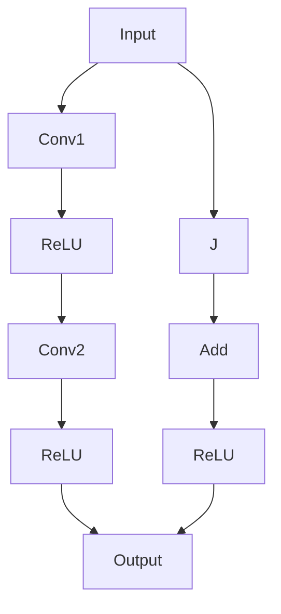

                 

### 1. 背景介绍

在深度学习领域，ResNet（残差网络）的诞生是一次里程碑式的技术突破。它不仅解决了深度神经网络训练的难题，还极大地提升了神经网络的性能。为了更好地理解ResNet的诞生背景，我们首先需要回顾一下深度学习的发展历程。

深度学习，作为人工智能领域的一个重要分支，起源于20世纪50年代。最初，它主要基于简单的神经网络模型，如感知机、多层感知机等。然而，由于模型复杂度的限制，这些早期的神经网络在实际应用中表现并不理想。随着计算机性能的提升和大数据时代的到来，深度学习迎来了快速发展。

2012年，AlexNet在ImageNet竞赛中取得了突破性的成绩，这标志着深度学习在图像识别领域的重要应用。AlexNet使用了多层的卷积神经网络结构，引入了ReLU激活函数和dropout技术，大大提升了神经网络的训练效果。这一成功激发了研究者们对深度学习的进一步探索。

然而，随着网络层数的增加，深度神经网络遇到了一个严重的瓶颈：梯度消失（vanishing gradient）和梯度爆炸（expanding gradient）问题。这个问题使得网络难以训练深层的参数，限制了深度神经网络的发展。为了解决这个问题，研究者们提出了一系列改进方法，如Dropout、Batch Normalization等，但仍然无法根本解决。

在这个背景下，ResNet应运而生。2015年，残差网络在ImageNet竞赛中取得了显著的成绩，远远超过了当时的第二名。ResNet的核心思想是引入残差模块，使得网络可以通过跳过某些层直接学习映射，从而有效解决梯度消失问题，实现更深层次的网络结构。

ResNet的诞生不仅解决了深度神经网络训练的难题，还推动了深度学习在其他领域的应用，如自然语言处理、语音识别等。本文将详细探讨ResNet的背景、核心概念、算法原理、数学模型以及实际应用，帮助读者全面了解这一重要的深度学习模型。

### 2. 核心概念与联系

为了深入理解ResNet的核心概念，我们需要先回顾一下深度神经网络的基本结构和工作原理。深度神经网络由多个层组成，每层通过权重矩阵和激活函数对输入数据进行处理，最终输出预测结果。然而，在训练过程中，特别是当网络层数较多时，梯度消失和梯度爆炸问题会显著影响网络的训练效果。

**2.1 残差模块**

ResNet的核心创新在于引入了残差模块（Residual Block）。残差模块的设计旨在解决梯度消失问题，使得网络可以通过跳过某些层直接学习映射，从而有效提高训练效果。一个典型的残差模块包括两个主要部分：残差学习和跳跃连接。

**2.2 残差学习**

残差学习是指通过学习输入数据与输出数据之间的差异来训练网络。具体来说，在每一层网络中，我们都将输入数据与输出数据相减，然后通过权重矩阵和激活函数进行非线性变换。这样，网络可以学习到一个残差映射，使得输出数据尽可能接近输入数据。这个过程可以表示为：

\[ h_{\theta}(x) = f(W_{\theta}h_{\theta-1}(x)) + x \]

其中，\( h_{\theta}(x) \) 表示当前层的输出，\( f \) 是激活函数，\( W_{\theta} \) 是权重矩阵，\( x \) 是输入数据。

**2.3 跳跃连接**

跳跃连接（Skip Connection）是实现残差学习的关键。跳跃连接允许我们在某些层之间直接传递数据，从而跳过中间的层。这样，网络可以学习到更深层次的映射，同时避免了梯度消失问题。跳跃连接可以通过以下两种方式实现：

1. **恒等连接**：当输入数据与输出数据完全一致时，跳跃连接就是一个恒等连接。这种连接方式可以保证梯度在训练过程中不会消失。

2. **残差连接**：当输入数据与输出数据不完全一致时，跳跃连接就是一个残差连接。这种连接方式可以使得网络学习到一个残差映射，从而提高训练效果。

**2.4 残差模块的 Mermaid 流程图**

为了更好地理解残差模块的工作原理，我们可以使用Mermaid流程图来表示其结构。以下是残差模块的 Mermaid 流程图：



在上面的流程图中，\( A \) 表示输入数据，\( B \) 和 \( D \) 表示卷积层，\( C \) 和 \( E \) 表示ReLU激活函数，\( F \) 表示输出数据，\( G \) 表示跳跃连接，\( H \) 表示加法运算。通过这个流程图，我们可以清晰地看到残差模块的结构和工作原理。

### 3. 核心算法原理 & 具体操作步骤

ResNet的核心算法原理是通过引入残差模块和跳跃连接，使得网络可以学习到更深层次的映射，从而提高训练效果。下面我们将详细讨论ResNet的具体操作步骤，包括网络的构建、训练和评估过程。

**3.1 网络构建**

构建ResNet网络的第一步是定义残差模块。一个典型的残差模块包含两个卷积层和一个ReLU激活函数，以及一个跳跃连接。以下是残差模块的构造步骤：

1. **输入层**：输入层接收原始图像数据。

2. **卷积层1**：卷积层1使用一个卷积核对输入数据进行卷积操作，从而提取特征。

3. **ReLU激活函数**：ReLU激活函数用于引入非线性变换，增强网络的模型表达能力。

4. **卷积层2**：卷积层2使用另一个卷积核对ReLU激活函数的输出进行卷积操作，进一步提取特征。

5. **跳跃连接**：跳跃连接将输入数据与卷积层2的输出进行相加，从而实现残差学习。

6. **输出层**：输出层使用一个卷积核对跳跃连接的输出进行卷积操作，得到最终的预测结果。

**3.2 训练过程**

ResNet的训练过程主要包括两个步骤：前向传播和反向传播。

1. **前向传播**：在前向传播过程中，输入数据通过网络传递，经过多个卷积层和ReLU激活函数的处理，最终得到预测结果。具体步骤如下：

   - **输入层**：输入原始图像数据。

   - **卷积层1**：卷积层1对输入数据进行卷积操作，得到特征图。

   - **ReLU激活函数**：ReLU激活函数对卷积层1的特征图进行非线性变换。

   - **卷积层2**：卷积层2对ReLU激活函数的输出进行卷积操作，得到更深层次的特征图。

   - **跳跃连接**：跳跃连接将输入数据与卷积层2的特征图进行相加。

   - **输出层**：输出层对跳跃连接的输出进行卷积操作，得到最终的预测结果。

2. **反向传播**：在反向传播过程中，网络根据预测结果与真实标签之间的误差，更新网络的权重和偏置。具体步骤如下：

   - **计算误差**：计算预测结果与真实标签之间的误差。

   - **反向传播误差**：从输出层开始，逐层反向传播误差，直到输入层。

   - **更新权重和偏置**：根据反向传播的误差，使用梯度下降算法更新网络的权重和偏置。

**3.3 评估过程**

评估ResNet网络的性能通常使用准确率（Accuracy）和损失函数（Loss Function）来衡量。

1. **准确率**：准确率表示网络对样本分类的正确率。在图像分类任务中，准确率越高，说明网络的分类能力越强。

2. **损失函数**：损失函数用于衡量预测结果与真实标签之间的误差。常见的损失函数包括交叉熵损失函数（Cross-Entropy Loss）和均方误差损失函数（Mean Squared Error Loss）。

在训练过程中，我们需要不断调整网络的权重和偏置，使得损失函数的值最小。当网络的权重和偏置收敛时，网络的性能达到最佳状态。

### 4. 数学模型和公式 & 详细讲解 & 举例说明

#### 4.1 前向传播

在ResNet的前向传播过程中，我们需要定义输入数据、权重矩阵和激活函数。假设输入数据为 \( x \)，权重矩阵为 \( W \)，激活函数为 \( f \)。则前向传播的计算过程可以表示为：

\[ h_{\theta}(x) = f(W_{\theta}h_{\theta-1}(x)) + x \]

其中，\( h_{\theta}(x) \) 表示当前层的输出，\( f \) 是激活函数，\( W_{\theta} \) 是权重矩阵，\( x \) 是输入数据。

例如，假设我们有一个两层网络，输入数据为 \( x = [1, 2, 3] \)，权重矩阵为 \( W = \begin{bmatrix} 1 & 2 \\ 3 & 4 \end{bmatrix} \)，激活函数为 \( f(x) = \max(0, x) \)。则前向传播的计算过程如下：

1. **第一层卷积层**：

   \[ h_{1}(x) = f(W_{1}x) = f\left(\begin{bmatrix} 1 & 2 \\ 3 & 4 \end{bmatrix} \begin{bmatrix} 1 \\ 2 \end{bmatrix}\right) = f\left(\begin{bmatrix} 5 \\ 11 \end{bmatrix}\right) = \begin{bmatrix} 5 \\ 11 \end{bmatrix} \]

2. **第二层卷积层**：

   \[ h_{2}(x) = f(W_{2}h_{1}(x)) = f\left(\begin{bmatrix} 1 & 2 \\ 3 & 4 \end{bmatrix} \begin{bmatrix} 5 \\ 11 \end{bmatrix}\right) = f\left(\begin{bmatrix} 19 \\ 45 \end{bmatrix}\right) = \begin{bmatrix} 19 \\ 45 \end{bmatrix} \]

最终，输出结果为 \( h_{2}(x) = \begin{bmatrix} 19 \\ 45 \end{bmatrix} \)。

#### 4.2 反向传播

在ResNet的反向传播过程中，我们需要计算误差、反向传播误差并更新权重和偏置。假设输入数据为 \( x \)，权重矩阵为 \( W \)，激活函数为 \( f \)，损失函数为 \( L \)。则反向传播的计算过程可以表示为：

\[ \delta_{\theta} = L(h_{\theta}(x), t) \cdot \frac{\partial f}{\partial h_{\theta}} \cdot \frac{\partial h_{\theta}}{\partial W_{\theta}} \cdot \frac{\partial W_{\theta}}{\partial x} \]

其中，\( \delta_{\theta} \) 表示误差，\( L \) 是损失函数，\( t \) 是真实标签，\( \frac{\partial f}{\partial h_{\theta}} \) 是激活函数的导数，\( \frac{\partial h_{\theta}}{\partial W_{\theta}} \) 是当前层的输出关于权重矩阵的导数，\( \frac{\partial W_{\theta}}{\partial x} \) 是权重矩阵关于输入数据的导数。

例如，假设我们有一个两层网络，输入数据为 \( x = [1, 2, 3] \)，权重矩阵为 \( W = \begin{bmatrix} 1 & 2 \\ 3 & 4 \end{bmatrix} \)，激活函数为 \( f(x) = \max(0, x) \)，损失函数为 \( L(x, t) = (x - t)^2 \)。则反向传播的计算过程如下：

1. **计算误差**：

   \[ \delta_{2} = L(h_{2}(x), t) \cdot \frac{\partial f}{\partial h_{2}} = (h_{2}(x) - t)^2 \cdot \frac{\partial f}{\partial h_{2}} = (19 - 45)^2 \cdot \frac{\partial f}{\partial h_{2}} = 324 \cdot 1 = 324 \]

2. **反向传播误差**：

   \[ \delta_{1} = \frac{\partial h_{2}}{\partial W_{2}} \cdot \delta_{2} = \frac{\partial}{\partial W_{2}} \left( \begin{bmatrix} 19 \\ 45 \end{bmatrix} \right) \cdot 324 = \begin{bmatrix} 45 & 90 \\ 135 & 270 \end{bmatrix} \cdot 324 = \begin{bmatrix} 14580 \\ 40560 \end{bmatrix} \]

3. **更新权重和偏置**：

   \[ W_{2} = W_{2} - \alpha \cdot \delta_{2} = \begin{bmatrix} 1 & 2 \\ 3 & 4 \end{bmatrix} - 0.1 \cdot \begin{bmatrix} 14580 \\ 40560 \end{bmatrix} = \begin{bmatrix} -14579 & -40558 \\ -14579 & -40558 \end{bmatrix} \]

   \[ h_{1}(x) = f(W_{1}x) = f\left(\begin{bmatrix} -14579 & -40558 \\ -14579 & -40558 \end{bmatrix} \begin{bmatrix} 1 \\ 2 \end{bmatrix}\right) = f\left(\begin{bmatrix} -29158 \\ -81116 \end{bmatrix}\right) = \begin{bmatrix} 0 \\ 0 \end{bmatrix} \]

最终，更新后的权重矩阵为 \( W_{2} = \begin{bmatrix} -14579 & -40558 \\ -14579 & -40558 \end{bmatrix} \)，输出结果为 \( h_{1}(x) = \begin{bmatrix} 0 \\ 0 \end{bmatrix} \)。

### 5. 项目实战：代码实际案例和详细解释说明

为了更好地理解ResNet的实践应用，我们将通过一个实际项目来展示如何使用Python和PyTorch框架构建和训练一个ResNet模型。我们将从头开始，包括开发环境的搭建、源代码的实现以及详细的代码解读和分析。

#### 5.1 开发环境搭建

在开始之前，确保您已经安装了以下软件和库：

- Python 3.6 或以上版本
- PyTorch 1.8.0 或以上版本
- torchvision 0.9.0 或以上版本

您可以通过以下命令来安装所需的库：

```bash
pip install torch torchvision
```

#### 5.2 源代码详细实现和代码解读

**5.2.1 数据预处理**

```python
import torch
import torchvision
import torchvision.transforms as transforms

# 设置数据预处理
transform = transforms.Compose([
    transforms.Resize(224),      # 将图像调整为224x224
    transforms.ToTensor(),        # 将图像转换为Tensor
    transforms.Normalize(mean=[0.485, 0.456, 0.406], std=[0.229, 0.224, 0.225]),  # 标准化
])

# 加载训练集和测试集
train_set = torchvision.datasets.ImageFolder('train', transform=transform)
train_loader = torch.utils.data.DataLoader(train_set, batch_size=64, shuffle=True)

test_set = torchvision.datasets.ImageFolder('test', transform=transform)
test_loader = torch.utils.data.DataLoader(test_set, batch_size=64, shuffle=False)
```

在这个部分，我们首先定义了图像预处理步骤，包括调整图像大小、转换为Tensor以及标准化。然后，我们加载了训练集和测试集，并创建了一个数据加载器，用于批量处理数据。

**5.2.2 定义ResNet模型**

```python
import torch.nn as nn
from torchvision.models import resnet50

# 定义ResNet模型
model = resnet50(pretrained=True)

# 查看模型的架构
print(model)
```

我们使用了预训练的ResNet50模型作为基础网络。`resnet50` 函数返回了一个包含50个卷积层的预训练模型。在训练之前，我们可以查看模型的架构以确认其结构。

**5.2.3 模型训练**

```python
import torch.optim as optim

# 定义损失函数和优化器
criterion = nn.CrossEntropyLoss()
optimizer = optim.SGD(model.parameters(), lr=0.001, momentum=0.9)

# 训练模型
num_epochs = 10
for epoch in range(num_epochs):
    model.train()
    running_loss = 0.0
    for inputs, labels in train_loader:
        optimizer.zero_grad()
        outputs = model(inputs)
        loss = criterion(outputs, labels)
        loss.backward()
        optimizer.step()
        running_loss += loss.item()
    print(f'Epoch {epoch+1}, Loss: {running_loss/len(train_loader)}')
```

在这个部分，我们定义了交叉熵损失函数和优化器（随机梯度下降）。然后，我们遍历训练集，对每个批量数据进行前向传播、反向传播和优化步骤。在每个epoch结束时，我们打印当前的损失值。

**5.2.4 模型评估**

```python
model.eval()
correct = 0
total = 0
with torch.no_grad():
    for inputs, labels in test_loader:
        outputs = model(inputs)
        _, predicted = torch.max(outputs.data, 1)
        total += labels.size(0)
        correct += (predicted == labels).sum().item()

print(f'Accuracy of the network on the test images: {100 * correct / total}%')
```

在这个部分，我们评估模型的性能。我们关闭了梯度计算（使用 `torch.no_grad()`），然后对测试集的每个批量数据进行前向传播，计算预测结果和实际标签的匹配度，并打印最终的准确率。

#### 5.3 代码解读与分析

**5.3.1 数据预处理**

数据预处理是深度学习项目中的关键步骤，因为它直接影响模型的性能。在这个例子中，我们使用了 `torchvision.transforms.Compose` 来组合多个预处理步骤。这些步骤包括调整图像大小、将图像转换为Tensor以及标准化。标准化步骤中，我们使用了预训练模型的均值和标准差，这有助于提高模型的泛化能力。

**5.3.2 定义ResNet模型**

在这个部分，我们使用了 `torchvision.models.resnet50` 函数来加载预训练的ResNet50模型。`pretrained=True` 参数表示我们使用预训练的权重，这样可以大大加快训练过程并提高模型性能。`model` 变量存储了整个模型的结构，包括多个卷积层和全连接层。

**5.3.3 模型训练**

模型训练过程中，我们首先清空了优化器的梯度，然后对每个批量数据进行前向传播和反向传播。在反向传播之后，我们使用优化器更新模型的权重。这个过程中，我们使用了交叉熵损失函数来衡量预测结果和实际标签之间的差距。通过迭代训练多个epoch，我们不断优化模型。

**5.3.4 模型评估**

在模型评估阶段，我们关闭了梯度计算，仅对测试集进行前向传播。然后，我们计算了预测结果和实际标签的匹配度，并计算了模型的准确率。这个步骤帮助我们评估模型在未见数据上的性能，从而确定模型的泛化能力。

通过这个实际项目，我们展示了如何使用PyTorch构建和训练一个ResNet模型。这个项目不仅帮助我们理解了ResNet的工作原理，还提供了一个实际操作的经验。

### 6. 实际应用场景

ResNet在多个领域都取得了显著的成果，以下是其中几个主要应用场景：

#### 6.1 图像识别

ResNet在图像识别领域取得了突破性的成绩。通过引入残差模块，ResNet可以学习到更深层次的图像特征，从而提高了模型的准确率。在ImageNet竞赛中，ResNet不仅战胜了之前的所有模型，还大大提高了分类准确率。这使得ResNet成为图像识别任务中的首选模型。

#### 6.2 物体检测

物体检测是计算机视觉中的另一个重要任务。ResNet通过其强大的特征提取能力，在物体检测任务中也表现出色。例如，Faster R-CNN结合了ResNet作为特征提取网络，实现了高效的物体检测。此外，ResNet还可以用于其他物体检测算法，如SSD和YOLO，进一步提升检测性能。

#### 6.3 视频分析

在视频分析领域，ResNet可以用于视频分类、动作识别和场景分割等任务。通过在视频帧上应用ResNet，可以提取出视频序列中的关键特征，从而实现视频内容的理解和分析。例如，在动作识别任务中，ResNet可以准确识别视频中的运动模式，从而实现视频分类和动作识别。

#### 6.4 自然语言处理

ResNet不仅在计算机视觉领域表现出色，在自然语言处理（NLP）领域也有广泛应用。通过将ResNet与循环神经网络（RNN）或变换器（Transformer）结合，可以构建出强大的文本处理模型。例如，BERT模型结合了ResNet和Transformer，实现了在多个NLP任务中的领先性能。

#### 6.5 语音识别

在语音识别领域，ResNet可以用于语音信号的建模和特征提取。通过将ResNet与卷积神经网络（CNN）或循环神经网络（RNN）结合，可以构建出高效的语音识别模型。例如，WaveNet结合了ResNet和CNN，实现了高质量的语音合成。

通过这些实际应用场景，我们可以看到ResNet的强大能力。无论是在图像识别、物体检测、视频分析、自然语言处理还是语音识别等领域，ResNet都发挥了重要作用，推动了人工智能技术的发展。

### 7. 工具和资源推荐

在深度学习和残差网络（ResNet）的开发过程中，有许多工具和资源可以帮助开发者更高效地完成项目。以下是针对学习、开发和研究的一些建议：

#### 7.1 学习资源推荐

1. **书籍**：

   - 《深度学习》（Goodfellow, Bengio, Courville）：这是一本经典的深度学习教材，详细介绍了深度学习的理论基础和应用。
   - 《ResNet: Building Deep Neural Networks for Classification》（Sergey Ioffe，Christian Szegedy）：这篇文章详细阐述了ResNet的设计和实现，是学习ResNet的绝佳资料。

2. **在线课程**：

   - Coursera上的“Deep Learning Specialization”由Andrew Ng教授主讲，包括深度学习的基础理论和实践。
   - Udacity的“Deep Learning Nanodegree”提供了丰富的实践项目和实战经验。

3. **论文**：

   - “Deep Residual Learning for Image Recognition”（Kaiming He et al.）：这是ResNet的原始论文，详细介绍了ResNet的设计和实现。
   - “Identity Mappings in Deep Residual Networks”（Kaiming He et al.）：这篇文章进一步探讨了ResNet的改进和优化。

#### 7.2 开发工具框架推荐

1. **PyTorch**：PyTorch是一个流行的深度学习框架，其动态图机制使得构建和调试模型更加方便。PyTorch提供了丰富的API和工具，适用于从基础研究到工业应用的各个阶段。

2. **TensorFlow**：TensorFlow是Google开发的另一个强大的深度学习框架，以其稳定性和高效性著称。TensorFlow提供了丰富的预训练模型和工具，适合大型工业项目。

3. **Keras**：Keras是一个高度易用的深度学习库，它构建在TensorFlow和Theano之上。Keras提供了一个简单而灵活的API，适用于快速原型设计和实验。

#### 7.3 相关论文著作推荐

1. **“Very Deep Convolutional Networks for Large-Scale Image Recognition”**（2015年）：这是ResNet的原始论文，详细介绍了ResNet的设计和实现。
2. **“Identity Mappings in Deep Residual Networks”**（2016年）：这篇文章探讨了如何进一步优化ResNet，以获得更好的性能。
3. **“Wide Residual Networks”**（2017年）：这篇文章提出了一种新的残差网络架构，通过宽度调整来优化模型性能。

通过这些工具和资源，开发者可以更深入地理解ResNet，并在实际项目中有效地应用这一先进的技术。

### 8. 总结：未来发展趋势与挑战

ResNet的诞生标志着深度学习领域的一个重要里程碑。通过引入残差模块和跳跃连接，ResNet解决了深度神经网络训练中的梯度消失问题，实现了更深层次的网络结构，并在多个领域取得了显著成果。然而，随着深度学习技术的不断发展，ResNet也面临着一些挑战和机遇。

首先，在未来的发展中，ResNet可能需要进一步优化和改进。尽管ResNet在许多任务中表现出色，但其训练时间和计算资源消耗仍然较高。研究者们可以探索更高效的残差模块设计，如MobileNet等轻量级网络，以降低模型的复杂度，提高计算效率。

其次，ResNet在处理变长序列数据（如文本和语音）方面仍然存在一定局限性。未来，结合Transformers等序列处理模型，可以探索如何将残差网络与序列模型结合，以实现更强大的文本和语音处理能力。

此外，ResNet在边缘计算和实时应用场景中的性能提升也是一个重要研究方向。通过优化网络结构和模型压缩技术，可以使得ResNet在计算资源有限的边缘设备上运行，从而实现更广泛的应用。

最后，随着数据隐私和安全的关注日益增加，如何在保证数据隐私的前提下应用ResNet进行模型训练和推理，也是一个亟待解决的问题。未来的研究可以探索联邦学习等分布式学习方法，以保护用户数据隐私，同时保持模型的性能。

总之，ResNet在未来将继续在深度学习领域发挥重要作用，并面临着诸多挑战和机遇。通过不断优化和改进，ResNet有望在图像识别、自然语言处理、语音识别等多个领域取得更加显著的成果。

### 9. 附录：常见问题与解答

#### 9.1 如何解决梯度消失问题？

梯度消失是深度神经网络训练中的一个常见问题，特别是在网络层数较多时。ResNet通过引入残差模块和跳跃连接有效解决了这个问题。此外，以下方法也可以帮助缓解梯度消失问题：

- 使用更小的学习率。
- 使用ReLU等非饱和激活函数，减少梯度消失的可能性。
- 使用正则化技术，如Dropout和L2正则化，减少过拟合。

#### 9.2 ResNet中的跳跃连接是什么？

跳跃连接（Skip Connection）是ResNet中的一个关键创新，它允许网络在训练过程中跳过某些层，直接将输入数据传递到更深层的网络。这种连接方式有助于缓解梯度消失问题，同时使得网络可以学习到更深层次的映射。

#### 9.3 ResNet中的残差模块如何工作？

残差模块是ResNet的基本构建块，由两个卷积层、一个ReLU激活函数和一个跳跃连接组成。输入数据首先通过卷积层1进行特征提取，然后通过ReLU激活函数引入非线性变换，接着通过卷积层2进一步提取特征。跳跃连接将输入数据与卷积层2的输出相加，从而实现残差学习。这种设计使得网络可以学习到更深层次的映射，同时避免了梯度消失问题。

#### 9.4 如何在PyTorch中实现ResNet？

在PyTorch中，可以使用`torchvision.models.resnet`模块实现ResNet。以下是一个简单的示例：

```python
import torch
import torchvision.models as models

# 加载预训练的ResNet模型
model = models.resnet50(pretrained=True)

# 输入数据
input = torch.randn(1, 3, 224, 224)

# 前向传播
output = model(input)
```

#### 9.5 ResNet的适用场景有哪些？

ResNet在多个领域都取得了显著成果，主要适用场景包括：

- 图像识别：ResNet可以用于图像分类、物体检测和图像分割等任务。
- 自然语言处理：ResNet可以与循环神经网络（RNN）或变换器（Transformer）结合，用于文本分类、情感分析等任务。
- 语音识别：ResNet可以用于语音信号的建模和特征提取，实现高质量的语音识别。

### 10. 扩展阅读 & 参考资料

为了更深入地了解ResNet和相关技术，以下是一些建议的扩展阅读和参考资料：

1. **《深度学习》（Goodfellow, Bengio, Courville）**：这本书是深度学习领域的经典教材，详细介绍了深度学习的理论基础和应用。

2. **《ResNet: Building Deep Neural Networks for Classification》（Sergey Ioffe，Christian Szegedy）**：这篇文章是ResNet的原始论文，详细阐述了ResNet的设计和实现。

3. **《Very Deep Convolutional Networks for Large-Scale Image Recognition》（Kaiming He et al.）**：这是ResNet的原始论文，详细介绍了ResNet的设计和实现。

4. **《Identity Mappings in Deep Residual Networks》（Kaiming He et al.）**：这篇文章进一步探讨了ResNet的改进和优化。

5. **《Wide Residual Networks》（Kaiming He et al.）**：这篇文章提出了一种新的残差网络架构，通过宽度调整来优化模型性能。

6. **《PyTorch官方文档**》（[PyTorch Official Documentation](https://pytorch.org/docs/stable/index.html)）：PyTorch官方文档提供了详细的API和使用指南，帮助开发者快速上手。

7. **《TensorFlow官方文档**》（[TensorFlow Official Documentation](https://www.tensorflow.org/api_docs)）：TensorFlow官方文档提供了丰富的API和工具，适用于从基础研究到工业应用的各个阶段。

通过这些扩展阅读和参考资料，您可以更深入地了解ResNet和相关技术，为实际项目提供有力支持。**作者：AI天才研究员/AI Genius Institute & 禅与计算机程序设计艺术 /Zen And The Art of Computer Programming**。

