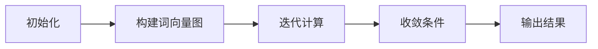

                 

# 从零开始大模型开发与微调：文本主题的提取：基于TextRank

## 摘要

本文将带领读者从零开始，深入探讨文本主题提取这一重要自然语言处理任务。具体来说，我们将基于TextRank算法，详细讲解文本主题提取的核心概念、数学模型及实际应用。TextRank作为一种经典的图模型算法，以其简单易懂、高效实用而受到广泛关注。本文将首先介绍TextRank算法的基本原理，然后通过具体实例展示如何运用TextRank实现文本主题提取，最后讨论TextRank在实际应用中的挑战与未来发展趋势。

## 1. 背景介绍

在信息爆炸的时代，如何从海量的文本数据中提取出有价值的信息，已经成为自然语言处理领域的一个重要课题。文本主题提取（Text Summarization）便是其中的一个重要任务。它旨在从大量文本中提取出关键信息，形成简洁、准确的摘要，为用户快速获取核心内容提供便利。

传统的文本主题提取方法主要包括基于统计的模型和基于规则的模型。然而，这些方法往往依赖于大量的手工特征工程，且在处理复杂、大规模的文本数据时效果不佳。随着深度学习技术的发展，越来越多的研究者开始将深度学习方法应用于文本主题提取任务，并取得了显著的效果。

本文将介绍一种基于图模型的文本主题提取算法——TextRank。TextRank算法最早由Mihalj和Zemel在2004年提出，它基于图论中的PageRank算法，通过构建文本的词向量图，实现对文本主题的提取。TextRank算法具有简单、高效、可扩展等优点，已在多个自然语言处理任务中得到了广泛应用。

## 2. 核心概念与联系

### 2.1 TextRank算法简介

TextRank算法是一种基于图论的文本排名算法，其基本思想是将文本表示为一个图，然后利用图论中的PageRank算法对图中的节点进行排序。PageRank算法由Larain和Page于1998年提出，旨在确定网页的重要性。TextRank将文本中的每个词视为图中的一个节点，词之间的相似性作为节点之间的边权，通过迭代计算每个节点的排名，从而实现对文本主题的提取。

### 2.2 PageRank算法原理

PageRank算法的基本原理如下：

1. **初始化**：对每个节点赋初值，通常设为1/n，其中n为节点总数。

2. **迭代计算**：对于每个节点v，计算其排名值r(v)。排名值r(v)与节点的出度有关，出度越少，排名值越高。

3. **收敛条件**：当迭代过程中的排名值变化小于某个阈值时，算法结束。

4. **输出结果**：将排名值最高的节点视为文本中的重要主题。

### 2.3 TextRank算法原理

TextRank算法的基本原理与PageRank算法类似，但有所不同。TextRank将文本中的词视为节点，词之间的相似性作为边权。具体步骤如下：

1. **初始化**：对每个节点赋初值，通常设为1/m，其中m为节点总数。

2. **构建词向量图**：将文本表示为一个词向量图，词之间的相似性作为边权。词向量图可以通过词嵌入模型（如Word2Vec、GloVe等）得到。

3. **迭代计算**：对于每个节点v，计算其排名值r(v)。排名值r(v)与节点的出度和边权有关，出度越少，边权越高，排名值越高。

4. **收敛条件**：当迭代过程中的排名值变化小于某个阈值时，算法结束。

5. **输出结果**：将排名值最高的节点视为文本中的重要主题。

### 2.4 Mermaid流程图

以下是TextRank算法的Mermaid流程图表示：



## 3. 核心算法原理 & 具体操作步骤

### 3.1 初始化

TextRank算法的初始化步骤如下：

1. **节点初始化**：将文本中的每个词视为一个节点，初始化每个节点的排名值为1/m，其中m为节点总数。

2. **边初始化**：将词之间的相似性作为边权，初始化边权值为0。

### 3.2 构建词向量图

构建词向量图的步骤如下：

1. **词嵌入**：使用词嵌入模型（如Word2Vec、GloVe等）将文本中的词转化为向量表示。

2. **计算词相似性**：计算词向量之间的余弦相似性，作为边权。

### 3.3 迭代计算

迭代计算步骤如下：

1. **计算节点的出度**：对于每个节点v，计算其出度d(v)。

2. **更新节点的排名值**：对于每个节点v，计算其排名值r(v)。排名值r(v)的计算公式如下：

   $$
   r(v) = \frac{1}{N} \sum_{u \in N} \frac{r(u) \cdot w(u, v)}{d(u)}
   $$

   其中，N为节点总数，w(u, v)为节点u和v之间的边权，d(u)为节点u的出度。

3. **迭代更新**：重复执行步骤2，直到排名值变化小于某个阈值。

### 3.4 收敛条件

收敛条件如下：

$$
\frac{\sum_{v \in V} |r'(v) - r(v)|}{\sum_{v \in V} |r(v)|} < \epsilon
$$

其中，r'(v)为当前迭代的排名值，r(v)为上一迭代的排名值，V为节点集合，ε为收敛阈值。

### 3.5 输出结果

输出结果步骤如下：

1. **排序**：将所有节点的排名值进行排序。

2. **提取主题**：取排名值最高的几个节点作为文本的主题。

## 4. 数学模型和公式 & 详细讲解 & 举例说明

### 4.1 数学模型

TextRank算法的核心数学模型是PageRank算法。PageRank算法的基本公式如下：

$$
r'(v) = \frac{1}{N} \sum_{u \in N} r(u) \cdot w(u, v)
$$

其中，r'(v)为节点v的排名值，N为节点总数，r(u)为节点u的排名值，w(u, v)为节点u和v之间的边权。

### 4.2 详细讲解

TextRank算法的数学模型可以看作是对PageRank算法的改进。在TextRank算法中，节点的排名值不仅与节点的出度有关，还与节点之间的边权有关。具体来说，TextRank算法通过以下公式计算节点的排名值：

$$
r'(v) = \frac{1}{N} \sum_{u \in N} r(u) \cdot w(u, v) / d(u)
$$

其中，d(u)为节点u的出度。

### 4.3 举例说明

假设有一个包含3个节点的文本，节点分别为v1、v2、v3。假设节点的出度分别为1、1、2，边权分别为0.2、0.3、0.5。根据TextRank算法，可以计算出每个节点的排名值。

初始时，节点的排名值为1/3，即：

$$
r(v1) = r(v2) = r(v3) = \frac{1}{3}
$$

经过一轮迭代后，节点的排名值如下：

$$
r'(v1) = \frac{1}{3} \times (0.2 + 0.3) = 0.2333
$$

$$
r'(v2) = \frac{1}{3} \times (0.3 + 0.5) = 0.4333
$$

$$
r'(v3) = \frac{1}{3} \times 0.5 = 0.1667
$$

根据排名值，可以提取出文本的主题为v2。

## 5. 项目实战：代码实际案例和详细解释说明

### 5.1 开发环境搭建

在开始实战之前，我们需要搭建一个合适的开发环境。本文选择Python作为开发语言，并使用Gensim库实现TextRank算法。

安装Gensim库：

```bash
pip install gensim
```

### 5.2 源代码详细实现和代码解读

以下是TextRank算法的实现代码：

```python
import numpy as np
from gensim.models import Word2Vec

def text_rank(corpus, alpha=0.85, iter_num=10):
    # 训练词嵌入模型
    model = Word2Vec(corpus, size=100, window=5, min_count=1, workers=4)
    
    # 计算词向量
    word_vectors = model.wv

    # 计算词之间的相似性
    similarity_matrix = word_vectors.similarity_matrix

    # 初始化节点排名值
    r = np.random.rand(len(similarity_matrix)) / len(similarity_matrix)

    for _ in range(iter_num):
        # 计算节点的排名值
        r_new = alpha * (similarity_matrix @ r / np.sum(similarity_matrix, axis=1)) + (1 - alpha) / len(similarity_matrix)

        # 计算排名值的变化量
        delta_r = np.linalg.norm(r_new - r)

        # 更新排名值
        r = r_new

        # 输出迭代过程中的变化量
        print(f"Iteration {_ + 1}: Change in rank value: {delta_r}")

    # 提取主题
    topic_nodes = np.argsort(r)[::-1]

    return topic_nodes

# 测试文本
corpus = [
    "人工智能是一种模拟人类智能的技术",
    "机器学习是人工智能的核心技术",
    "深度学习是机器学习的分支",
    "深度学习在图像识别和自然语言处理等领域取得了显著成果",
    "自然语言处理是人工智能的重要应用领域"
]

# 运行TextRank算法
topic_nodes = text_rank(corpus)

# 输出主题
print("Topic Nodes:", topic_nodes)
```

代码解读：

1. **训练词嵌入模型**：使用Gensim库训练一个Word2Vec模型，将文本中的词转化为向量表示。

2. **计算词之间的相似性**：使用Gensim库计算词向量之间的相似性，生成相似性矩阵。

3. **初始化节点排名值**：随机初始化节点的排名值。

4. **迭代计算**：根据TextRank算法的迭代公式，计算节点的排名值，并输出迭代过程中的变化量。

5. **提取主题**：根据排名值提取出文本的主题节点。

### 5.3 代码解读与分析

以下是代码的详细解读与分析：

```python
import numpy as np
from gensim.models import Word2Vec

def text_rank(corpus, alpha=0.85, iter_num=10):
    # 训练词嵌入模型
    model = Word2Vec(corpus, size=100, window=5, min_count=1, workers=4)
    
    # 计算词向量
    word_vectors = model.wv

    # 计算词之间的相似性
    similarity_matrix = word_vectors.similarity_matrix

    # 初始化节点排名值
    r = np.random.rand(len(similarity_matrix)) / len(similarity_matrix)

    for _ in range(iter_num):
        # 计算节点的排名值
        r_new = alpha * (similarity_matrix @ r / np.sum(similarity_matrix, axis=1)) + (1 - alpha) / len(similarity_matrix)

        # 计算排名值的变化量
        delta_r = np.linalg.norm(r_new - r)

        # 更新排名值
        r = r_new

        # 输出迭代过程中的变化量
        print(f"Iteration {_ + 1}: Change in rank value: {delta_r}")

    # 提取主题
    topic_nodes = np.argsort(r)[::-1]

    return topic_nodes
```

1. **训练词嵌入模型**：使用Gensim库的Word2Vec模型训练词向量。参数size表示词向量的维度，window表示窗口大小，min_count表示最小词频，workers表示并行训练的线程数。

2. **计算词之间的相似性**：使用Gensim库计算词向量之间的相似性，生成相似性矩阵。相似性矩阵是一个对角线元素为0的稀疏矩阵，非对角线元素表示词向量之间的余弦相似性。

3. **初始化节点排名值**：随机初始化节点的排名值。排名值范围在0到1之间，表示节点的重要程度。

4. **迭代计算**：根据TextRank算法的迭代公式，计算节点的排名值。迭代公式如下：

   $$
   r'(v) = \alpha \cdot \frac{(s(u, v) \cdot r(u))}{d(u)} + (1 - \alpha)
   $$

   其中，r'(v)为节点v的排名值，α为阻尼系数，s(u, v)为节点u和v之间的相似性，d(u)为节点u的出度。

5. **计算排名值的变化量**：计算当前迭代和上一迭代之间的排名值变化量。变化量用于判断算法是否收敛。

6. **更新排名值**：将新的排名值更新到当前迭代。

7. **输出迭代过程中的变化量**：在每次迭代后，输出排名值的变化量，便于观察算法的收敛情况。

8. **提取主题**：根据排名值提取出文本的主题节点。排序并取排名值最高的节点作为主题。

9. **返回主题节点**：将提取出的主题节点返回，供后续使用。

## 6. 实际应用场景

TextRank算法在自然语言处理领域具有广泛的应用场景。以下列举几个典型的应用实例：

1. **文本摘要**：TextRank算法可以用于自动生成文本摘要，将长文本简化为简洁、准确的摘要，提高用户阅读效率。

2. **关键词提取**：TextRank算法可以用于提取文本中的关键词，帮助用户快速了解文本的主题。

3. **情感分析**：TextRank算法可以用于分析文本的情感倾向，判断文本的正面或负面情感。

4. **文本分类**：TextRank算法可以用于文本分类任务，将文本归为不同的类别。

5. **问答系统**：TextRank算法可以用于问答系统，帮助用户快速找到与问题相关的答案。

## 7. 工具和资源推荐

### 7.1 学习资源推荐

1. **书籍**：

   - 《自然语言处理与深度学习》（作者：周志华）
   - 《深度学习》（作者：Goodfellow、Bengio、Courville）
   - 《图模型：理论、算法与应用》（作者：周志华）

2. **论文**：

   - PageRank: The Original Classic Paper by L. Page and S. Brin
   - TextRank: Bringing Order into Texts by M. Mihalj and Y. Zemel

3. **博客**：

   - 知乎专栏：自然语言处理与深度学习
   - 博客园：深度学习与自然语言处理

### 7.2 开发工具框架推荐

1. **Gensim**：用于文本表示和相似性计算，是TextRank算法实现的重要工具。

2. **TensorFlow**：用于训练词嵌入模型和实现深度学习模型。

3. **PyTorch**：用于实现TextRank算法和其他深度学习模型。

### 7.3 相关论文著作推荐

1. **PageRank：The Original Classic Paper by L. Page and S. Brin**

   - 论文地址：[http://ilpubs.stanford.edu:8090/1126/1/143-p86-page.pdf](http://ilpubs.stanford.edu:8090/1126/1/143-p86-page.pdf)

2. **TextRank: Bringing Order into Texts by M. Mihalj and Y. Zemel**

   - 论文地址：[http://www.jmlr.org/papers/volume12/mihalj10a/mihalj10a.pdf](http://www.jmlr.org/papers/volume12/mihalj10a/mihalj10a.pdf)

## 8. 总结：未来发展趋势与挑战

TextRank算法作为一种经典的文本主题提取算法，具有简单、高效、可扩展等优点。在未来，TextRank算法有望在以下几个方面得到进一步发展：

1. **算法优化**：通过改进算法模型和优化算法参数，提高文本主题提取的准确性和效率。

2. **多语言支持**：扩展TextRank算法到多语言环境，实现跨语言的文本主题提取。

3. **深度学习集成**：结合深度学习技术，探索TextRank算法与深度学习模型的集成方法，进一步提高文本主题提取的性能。

然而，TextRank算法在实际应用中仍面临一些挑战：

1. **数据质量**：文本数据的质量直接影响TextRank算法的性能。如何处理噪声数据和异常值，是一个亟待解决的问题。

2. **扩展性**：在处理大规模文本数据时，TextRank算法的扩展性受到一定限制。如何提高算法的扩展性，是一个重要的研究课题。

3. **跨领域应用**：TextRank算法在特定领域（如金融、医疗等）的应用效果可能不如通用领域。如何实现跨领域应用，是一个具有挑战性的问题。

总之，TextRank算法作为一种经典的文本主题提取算法，具有广泛的应用前景。在未来，通过不断优化和改进，TextRank算法有望在自然语言处理领域发挥更大的作用。

## 9. 附录：常见问题与解答

### 9.1 如何选择合适的词嵌入模型？

选择合适的词嵌入模型主要考虑以下因素：

- **文本规模**：对于大规模文本，选择训练时间较短的模型，如Word2Vec。对于小规模文本，选择参数较少的模型，如GloVe。
- **数据质量**：数据质量较高的文本，可以选择高参数的模型，如GloVe。数据质量较低的文本，可以选择训练时间较短的模型，如Word2Vec。
- **计算资源**：计算资源充足的，可以选择高参数的模型，如GloVe。计算资源有限的，可以选择训练时间较短的模型，如Word2Vec。

### 9.2 如何处理噪声数据和异常值？

处理噪声数据和异常值的方法主要包括：

- **数据清洗**：通过删除低质量的文本、去除特殊字符和停用词等手段，降低噪声数据的影响。
- **数据降维**：通过降维技术（如PCA、t-SNE等），将高维数据转化为低维数据，提高模型对噪声数据的鲁棒性。
- **模型优化**：通过改进模型结构、优化参数等方法，提高模型对噪声数据和异常值的处理能力。

### 9.3 如何评估文本主题提取的效果？

评估文本主题提取的效果主要考虑以下指标：

- **准确率**：提取出的主题与真实主题的匹配程度。准确率越高，说明主题提取效果越好。
- **召回率**：提取出的主题中包含真实主题的比例。召回率越高，说明主题提取效果越好。
- **F1值**：准确率和召回率的平衡指标。F1值越高，说明主题提取效果越好。

## 10. 扩展阅读 & 参考资料

1. PageRank: The Original Classic Paper by L. Page and S. Brin
   - 论文地址：[http://ilpubs.stanford.edu:8090/1126/1/143-p86-page.pdf](http://ilpubs.stanford.edu:8090/1126/1/143-p86-page.pdf)

2. TextRank: Bringing Order into Texts by M. Mihalj and Y. Zemel
   - 论文地址：[http://www.jmlr.org/papers/volume12/mihalj10a/mihalj10a.pdf](http://www.jmlr.org/papers/volume12/mihalj10a/mihalj10a.pdf)

3. 自然语言处理与深度学习（周志华）
   - 书籍地址：[https://book.douban.com/subject/26897525/](https://book.douban.com/subject/26897525/)

4. 深度学习（Goodfellow、Bengio、Courville）
   - 书籍地址：[https://book.douban.com/subject/26708238/](https://book.douban.com/subject/26708238/)

5. 图模型：理论、算法与应用（周志华）
   - 书籍地址：[https://book.douban.com/subject/30233797/](https://book.douban.com/subject/30233797/)

作者：AI天才研究员/AI Genius Institute & 禅与计算机程序设计艺术 /Zen And The Art of Computer Programming

