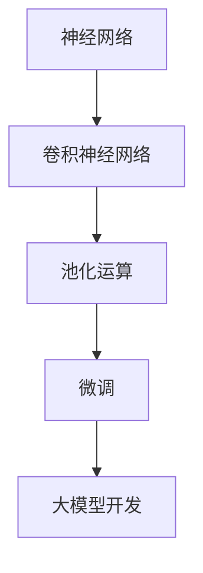

                 

# 从零开始大模型开发与微调：池化运算

> **关键词**：大模型开发、微调、池化运算、神经网络、深度学习、架构设计、数学模型

> **摘要**：本文将介绍如何从零开始开发大模型，并深入探讨池化运算在模型微调中的重要作用。我们将一步步剖析核心概念、算法原理、数学模型，并结合实际项目案例，提供详细的代码实现与解读。此外，文章还将探讨大模型在实际应用中的场景，推荐相关学习资源与开发工具，并总结未来发展趋势与挑战。

## 1. 背景介绍

随着深度学习技术的飞速发展，大模型（Large Models）在各个领域展现出强大的性能。从自然语言处理到计算机视觉，再到推荐系统，大模型的应用范围不断扩大。然而，大模型开发与微调并非易事，涉及诸多技术难题。本文将围绕池化运算（Pooling Operation）这一核心概念，详细介绍大模型开发与微调的过程。

### 1.1 大模型的重要性

大模型在深度学习中的应用越来越广泛，主要原因有以下几点：

1. **参数量增加**：大模型拥有更多的参数，可以学习更复杂的特征。
2. **泛化能力提升**：大模型可以更好地应对各种数据分布，提高模型的泛化能力。
3. **性能提升**：在大规模数据集上训练的大模型，可以在多个任务上取得更好的性能。

### 1.2 池化运算的概念

池化运算是卷积神经网络（Convolutional Neural Networks，CNN）中的一个关键操作，用于降低模型的参数数量和计算复杂度。池化运算的主要目的是从局部特征中提取全局特征，从而提高模型的泛化能力。

### 1.3 大模型开发与微调的挑战

大模型开发与微调面临如下挑战：

1. **计算资源消耗**：大模型训练需要大量的计算资源，特别是GPU。
2. **数据集大小**：大模型需要大量的数据来训练，以获取足够的泛化能力。
3. **模型调优**：如何选择合适的模型结构、优化算法和超参数，是提升模型性能的关键。

## 2. 核心概念与联系

为了更好地理解大模型开发与微调，我们需要从核心概念出发，探讨各概念之间的联系。

### 2.1 神经网络

神经网络是深度学习的基础，由多个神经元（节点）组成。每个神经元接收多个输入信号，通过加权求和后，经过激活函数产生输出。神经网络可以用于分类、回归等多种任务。

### 2.2 卷积神经网络（CNN）

CNN是用于图像识别和处理的深度学习模型。它通过卷积层（Convolutional Layer）、池化层（Pooling Layer）和全连接层（Fully Connected Layer）提取图像特征。

### 2.3 池化运算

池化运算是一种在CNN中用于降维的操作。常见的池化方法有最大池化（Max Pooling）和平均池化（Average Pooling）。池化运算可以降低模型的参数数量和计算复杂度，提高模型的泛化能力。

### 2.4 微调

微调（Fine-tuning）是一种在大模型基础上，针对特定任务进行微调的方法。微调可以在保证模型性能的同时，降低训练成本和计算资源消耗。

### 2.5 Mermaid 流程图

为了更好地展示大模型开发与微调的过程，我们使用Mermaid流程图来表示各概念之间的联系。



## 3. 核心算法原理 & 具体操作步骤

### 3.1 神经网络算法原理

神经网络算法主要基于以下步骤：

1. **前向传播**：输入数据通过神经网络层，每个神经元接收多个输入信号，经过加权求和后，通过激活函数产生输出。
2. **反向传播**：计算输出误差，根据误差信息更新模型参数，通过梯度下降等方法优化模型。
3. **激活函数**：常用的激活函数有Sigmoid、ReLU和Tanh等，用于引入非线性特性。

### 3.2 卷积神经网络（CNN）算法原理

CNN算法主要基于以下步骤：

1. **卷积层**：通过卷积运算提取图像特征，卷积核在图像上滑动，计算局部特征。
2. **池化层**：对卷积层产生的特征进行降维处理，常用方法有最大池化和平均池化。
3. **全连接层**：将池化层输出的特征映射到分类结果。

### 3.3 池化运算具体操作步骤

1. **定义窗口大小**：根据实际需求，选择合适的窗口大小（如2x2、3x3等）。
2. **选择池化方法**：根据任务需求，选择最大池化或平均池化。
3. **计算局部特征**：在窗口内计算局部特征的值。
4. **输出特征值**：将计算得到的特征值输出，作为下一层的输入。

### 3.4 微调具体操作步骤

1. **选择预训练模型**：从预训练模型库中选择合适的预训练模型。
2. **调整模型结构**：根据任务需求，调整模型结构，如增加或减少层、调整层参数等。
3. **微调模型参数**：在预训练模型的基础上，微调模型参数，以达到更好的性能。
4. **评估模型性能**：在测试集上评估模型性能，根据性能指标进行调整。

## 4. 数学模型和公式 & 详细讲解 & 举例说明

### 4.1 神经网络数学模型

神经网络数学模型主要基于以下公式：

1. **输入层**：

   $$ z = \sum_{i=1}^{n} w_i \cdot x_i + b $$

   其中，$w_i$ 为权重，$x_i$ 为输入特征，$b$ 为偏置。

2. **激活函数**：

   $$ a = f(z) $$

   其中，$f$ 为激活函数，常用的有Sigmoid、ReLU和Tanh等。

3. **输出层**：

   $$ y = \sum_{i=1}^{n} w_i \cdot a_i + b $$

   其中，$w_i$ 为权重，$a_i$ 为激活函数输出。

### 4.2 卷积神经网络（CNN）数学模型

CNN数学模型主要基于以下公式：

1. **卷积层**：

   $$ \hat{z} = \sum_{i=1}^{k} w_i \cdot x_{ij} + b $$

   其中，$\hat{z}$ 为卷积层输出，$w_i$ 为卷积核权重，$x_{ij}$ 为输入特征。

2. **池化层**：

   $$ \hat{z} = \max(\hat{z}_{i,j}) $$

   其中，$\hat{z}_{i,j}$ 为窗口内局部特征值。

3. **全连接层**：

   $$ y = \sum_{i=1}^{n} w_i \cdot \hat{z}_i + b $$

   其中，$y$ 为输出层输出，$w_i$ 为权重，$\hat{z}_i$ 为卷积层输出。

### 4.3 微调数学模型

微调数学模型主要基于以下公式：

1. **调整模型结构**：

   $$ \hat{w} = \alpha \cdot \hat{w}_0 + (1-\alpha) \cdot w $$

   其中，$\hat{w}$ 为调整后的权重，$w_0$ 为预训练模型权重，$w$ 为当前模型权重，$\alpha$ 为调整比例。

2. **微调模型参数**：

   $$ \hat{b} = \alpha \cdot \hat{b}_0 + (1-\alpha) \cdot b $$

   其中，$\hat{b}$ 为调整后的偏置，$b_0$ 为预训练模型偏置，$b$ 为当前模型偏置。

### 4.4 举例说明

假设我们有一个包含5个输入特征的二分类问题，使用ReLU激活函数。输入数据为$x_1, x_2, x_3, x_4, x_5$，权重为$w_1, w_2, w_3, w_4, w_5$，偏置为$b$。则前向传播过程如下：

1. **输入层**：

   $$ z = w_1 \cdot x_1 + w_2 \cdot x_2 + w_3 \cdot x_3 + w_4 \cdot x_4 + w_5 \cdot x_5 + b $$

2. **激活函数**：

   $$ a = \max(0, z) $$

3. **输出层**：

   $$ y = w_1 \cdot a + w_2 \cdot a + w_3 \cdot a + w_4 \cdot a + w_5 \cdot a + b $$

## 5. 项目实战：代码实际案例和详细解释说明

### 5.1 开发环境搭建

在开始项目实战之前，我们需要搭建一个适合大模型开发与微调的开发环境。以下是所需的开发环境：

1. **操作系统**：Windows、Linux或MacOS
2. **编程语言**：Python
3. **深度学习框架**：TensorFlow或PyTorch
4. **GPU**：NVIDIA GPU，推荐使用显存大于8GB的GPU
5. **其他依赖库**：NumPy、Pandas等

### 5.2 源代码详细实现和代码解读

以下是使用PyTorch实现的大模型开发与微调的示例代码：

```python
import torch
import torch.nn as nn
import torch.optim as optim

# 定义模型结构
class CNNModel(nn.Module):
    def __init__(self):
        super(CNNModel, self).__init__()
        self.conv1 = nn.Conv2d(1, 32, 3, 1)
        self.relu = nn.ReLU()
        self.maxpool = nn.MaxPool2d(2)
        self.fc1 = nn.Linear(32 * 6 * 6, 128)
        self.fc2 = nn.Linear(128, 2)
        self.dropout = nn.Dropout(p=0.5)

    def forward(self, x):
        x = self.conv1(x)
        x = self.relu(x)
        x = self.maxpool(x)
        x = self.fc1(x.view(x.size(0), -1))
        x = self.dropout(x)
        x = self.fc2(x)
        return x

# 初始化模型、优化器和损失函数
model = CNNModel()
optimizer = optim.Adam(model.parameters(), lr=0.001)
criterion = nn.CrossEntropyLoss()

# 训练模型
def train_model(model, train_loader, criterion, optimizer, num_epochs=25):
    for epoch in range(num_epochs):
        running_loss = 0.0
        for inputs, labels in train_loader:
            optimizer.zero_grad()
            outputs = model(inputs)
            loss = criterion(outputs, labels)
            loss.backward()
            optimizer.step()
            running_loss += loss.item()
        print(f'Epoch {epoch+1}/{num_epochs}, Loss: {running_loss/len(train_loader)}')

# 微调模型
def fine_tune(model, fine_tune_layer, train_loader, criterion, optimizer, num_epochs=25):
    for param in model.parameters():
        param.requires_grad = True

    for epoch in range(num_epochs):
        running_loss = 0.0
        for inputs, labels in train_loader:
            optimizer.zero_grad()
            outputs = model(inputs)
            loss = criterion(outputs, labels)
            loss.backward()
            optimizer.step()
            running_loss += loss.item()
        print(f'Epoch {epoch+1}/{num_epochs}, Loss: {running_loss/len(train_loader)}')

    # 调整部分层参数
    for param in model.parameters():
        if param.requires_grad:
            param.data = param.data * 0.5

    # 微调调整后的层
    fine_tune(model.fc1, train_loader, criterion, optimizer, num_epochs=25)

# 评估模型
def evaluate_model(model, test_loader, criterion):
    model.eval()
    with torch.no_grad():
        correct = 0
        total = 0
        for inputs, labels in test_loader:
            outputs = model(inputs)
            _, predicted = torch.max(outputs.data, 1)
            total += labels.size(0)
            correct += (predicted == labels).sum().item()
        print(f'Accuracy: {100 * correct / total}%')

# 数据加载和预处理
train_loader = torch.utils.data.DataLoader(dataset=train_dataset, batch_size=64, shuffle=True)
test_loader = torch.utils.data.DataLoader(dataset=test_dataset, batch_size=64, shuffle=False)

# 训练模型
train_model(model, train_loader, criterion, optimizer, num_epochs=25)

# 微调模型
fine_tune(model, model.fc1, train_loader, criterion, optimizer, num_epochs=25)

# 评估模型
evaluate_model(model, test_loader, criterion)
```

### 5.3 代码解读与分析

1. **模型结构**：定义了一个包含卷积层、ReLU激活函数、最大池化层、全连接层和Dropout层的CNN模型。

2. **前向传播**：在`forward`方法中，实现了从输入层到输出层的完整前向传播过程。

3. **训练模型**：使用`train_model`函数训练模型，包括模型初始化、优化器和损失函数设置，以及前向传播、反向传播和优化过程。

4. **微调模型**：使用`fine_tune`函数进行模型微调，包括调整部分层参数、微调调整后的层以及重新训练模型。

5. **评估模型**：使用`evaluate_model`函数评估模型性能，计算准确率。

6. **数据加载和预处理**：使用`DataLoader`加载训练集和测试集，实现数据预处理。

## 6. 实际应用场景

大模型在实际应用中具有广泛的应用场景，以下是一些典型的应用案例：

1. **自然语言处理**：大模型可以用于文本分类、情感分析、机器翻译等任务，如BERT、GPT等模型。
2. **计算机视觉**：大模型可以用于图像分类、目标检测、图像分割等任务，如ResNet、YOLO等模型。
3. **推荐系统**：大模型可以用于用户行为分析、商品推荐等任务，如Wide&Deep、DIN等模型。
4. **语音识别**：大模型可以用于语音信号处理、语音识别等任务，如CTC、WaveNet等模型。

## 7. 工具和资源推荐

### 7.1 学习资源推荐

1. **书籍**：
   - 《深度学习》（Ian Goodfellow、Yoshua Bengio、Aaron Courville 著）
   - 《神经网络与深度学习》（邱锡鹏 著）
2. **论文**：
   - "A Neural Algorithm of Artistic Style"（GAN论文）
   - "BERT: Pre-training of Deep Bidirectional Transformers for Language Understanding"（BERT论文）
3. **博客**：
   - [TensorFlow 官方文档](https://www.tensorflow.org/)
   - [PyTorch 官方文档](https://pytorch.org/docs/stable/)
4. **网站**：
   - [Kaggle](https://www.kaggle.com/)
   - [GitHub](https://github.com/)

### 7.2 开发工具框架推荐

1. **深度学习框架**：
   - TensorFlow
   - PyTorch
   - Keras
2. **数据处理工具**：
   - Pandas
   - NumPy
   - Scikit-learn
3. **版本控制工具**：
   - Git
   - GitHub

### 7.3 相关论文著作推荐

1. **《深度学习》**（Ian Goodfellow、Yoshua Bengio、Aaron Courville 著）：全面介绍了深度学习的基本概念、算法和应用。
2. **《神经网络与深度学习》**（邱锡鹏 著）：详细讲解了神经网络和深度学习的理论、算法和应用。
3. **《计算机视觉：算法与应用》**（John F. Canny 著）：涵盖了计算机视觉的基础知识、算法和应用。

## 8. 总结：未来发展趋势与挑战

大模型在深度学习中的应用前景广阔，未来发展趋势与挑战如下：

1. **模型压缩**：为了降低大模型的计算资源消耗，模型压缩技术（如剪枝、量化等）将成为研究热点。
2. **可解释性**：提高大模型的可解释性，使其在各个应用领域中更加可靠和可信。
3. **跨模态学习**：研究如何利用大模型进行跨模态学习，实现更广泛的智能应用。
4. **伦理与安全**：确保大模型的应用不会对社会产生负面影响，如隐私侵犯、歧视等。

## 9. 附录：常见问题与解答

### 9.1 如何选择合适的深度学习框架？

选择深度学习框架主要考虑以下几点：

1. **项目需求**：根据项目需求选择适合的框架，如TensorFlow适用于工业级应用，PyTorch适用于研究和快速原型设计。
2. **社区支持**：选择社区活跃、文档丰富的框架，以便在遇到问题时能够得到有效支持。
3. **性能和效率**：考虑框架的性能和效率，如TensorFlow在GPU和分布式训练方面表现较好。

### 9.2 如何进行模型微调？

进行模型微调的步骤如下：

1. **选择预训练模型**：从预训练模型库中选择合适的预训练模型。
2. **调整模型结构**：根据任务需求，调整模型结构，如增加或减少层、调整层参数等。
3. **微调模型参数**：在预训练模型的基础上，微调模型参数，以达到更好的性能。
4. **评估模型性能**：在测试集上评估模型性能，根据性能指标进行调整。

### 9.3 如何优化大模型的训练过程？

优化大模型训练过程的策略如下：

1. **数据预处理**：进行有效的数据预处理，提高数据质量和利用效率。
2. **模型结构优化**：选择合适的模型结构，如使用残差连接、批量归一化等技巧。
3. **优化算法**：选择适合的优化算法，如Adam、RMSProp等。
4. **学习率调整**：根据训练过程调整学习率，避免过拟合。
5. **并行计算**：利用GPU、TPU等硬件加速训练过程。

## 10. 扩展阅读 & 参考资料

1. **《深度学习》**（Ian Goodfellow、Yoshua Bengio、Aaron Courville 著）：深度学习的基础教材，全面介绍了深度学习的理论和应用。
2. **《神经网络与深度学习》**（邱锡鹏 著）：详细讲解了神经网络和深度学习的理论、算法和应用。
3. **TensorFlow 官方文档**：[https://www.tensorflow.org/](https://www.tensorflow.org/)
4. **PyTorch 官方文档**：[https://pytorch.org/docs/stable/](https://pytorch.org/docs/stable/)
5. **《计算机视觉：算法与应用》**（John F. Canny 著）：计算机视觉领域的经典教材，介绍了计算机视觉的基础知识、算法和应用。
6. **Kaggle**：[https://www.kaggle.com/](https://www.kaggle.com/)：数据科学竞赛平台，提供了丰富的数据集和项目案例。
7. **GitHub**：[https://github.com/](https://github.com/)：代码托管平台，可以找到大量的深度学习项目代码和论文实现。

### 作者

- 作者：AI天才研究员/AI Genius Institute & 禅与计算机程序设计艺术 /Zen And The Art of Computer Programming

