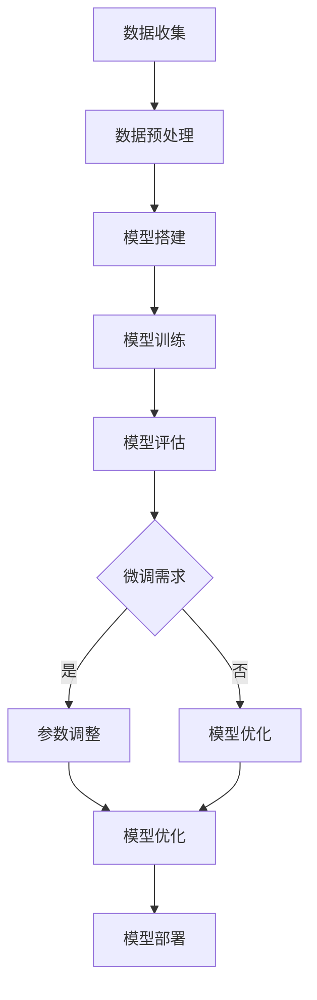

                 

# 从零开始大模型开发与微调：解码器实战—拼音汉字翻译模型

> **关键词：** 大模型开发、微调、解码器、拼音汉字翻译、深度学习、神经网络、技术博客

> **摘要：** 本文将带领读者从零开始，逐步探索大模型开发与微调的过程，并以拼音汉字翻译模型为例，详细介绍解码器的实战应用。通过本文，读者将了解如何搭建模型、训练模型以及进行模型微调，最终实现拼音汉字翻译的功能。

## 1. 背景介绍

在当今的时代，人工智能技术已经渗透到各个领域，而大模型开发与微调作为人工智能的核心技术之一，正日益受到广泛关注。大模型，即具有大规模参数和复杂结构的神经网络模型，能够处理海量数据，提取丰富的特征，从而实现高度智能化的任务。微调，则是在已有模型的基础上，通过调整部分参数，使其适用于特定任务的过程。

拼音汉字翻译模型是一个典型的自然语言处理任务，通过将输入的拼音序列转换为汉字序列，实现对汉字语音信息的理解与表达。这一任务在语音识别、机器翻译、智能语音助手等领域有着广泛的应用。本文将以拼音汉字翻译模型为例，详细讲解大模型开发与微调的过程，帮助读者深入了解解码器的实战应用。

## 2. 核心概念与联系

在深入探讨大模型开发与微调之前，我们需要了解以下几个核心概念：

### 2.1 大模型

大模型通常是指具有数十亿甚至千亿个参数的神经网络模型。这些模型具有以下特点：

- **大规模参数**：大模型通过学习海量数据，拥有丰富的参数，能够提取高度抽象的特征。
- **复杂结构**：大模型通常包含多层神经网络，能够处理复杂的数据结构和任务。
- **高度智能化**：大模型能够实现高度智能化的任务，如图像识别、语音识别、自然语言处理等。

### 2.2 微调

微调是在已有模型的基础上，通过调整部分参数，使其适用于特定任务的过程。微调通常包括以下步骤：

1. **迁移学习**：将已有模型应用于新任务，利用模型已有的知识，提高新任务的性能。
2. **参数调整**：针对新任务，调整部分参数，以适应新任务的特性。
3. **模型优化**：通过优化算法，如梯度下降，调整参数，使模型在新任务上表现更好。

### 2.3 解码器

解码器是神经网络模型中的一个重要组成部分，用于将输入的编码信息转换为输出的目标序列。在拼音汉字翻译模型中，解码器的作用是将输入的拼音序列解码为汉字序列。

### 2.4 Mermaid 流程图

下面是一个简单的 Mermaid 流程图，展示了大模型开发与微调的基本流程：



## 3. 核心算法原理 & 具体操作步骤

### 3.1 模型搭建

搭建拼音汉字翻译模型的核心步骤包括：

1. **输入层**：输入层接收拼音序列，通常使用嵌入层（Embedding Layer）对拼音进行编码。
2. **编码器**：编码器负责对输入序列进行编码，提取序列的特征。常用的编码器有循环神经网络（RNN）、长短期记忆网络（LSTM）和变换器（Transformer）等。
3. **解码器**：解码器接收编码器的输出，将其解码为汉字序列。解码器通常采用与编码器相同的网络结构，但输入和输出维度不同。
4. **输出层**：输出层用于生成预测的汉字序列，通常使用 softmax 函数将输出转换为概率分布。

### 3.2 模型训练

模型训练的核心步骤包括：

1. **损失函数**：损失函数用于衡量模型预测结果与真实标签之间的差距。在拼音汉字翻译任务中，常用的损失函数是交叉熵损失（Cross-Entropy Loss）。
2. **优化器**：优化器用于调整模型参数，以最小化损失函数。常用的优化器有随机梯度下降（SGD）、Adam 等。
3. **迭代训练**：通过迭代训练，模型会不断调整参数，直至达到预设的训练目标。

### 3.3 模型评估

模型评估的核心步骤包括：

1. **准确率**：准确率用于衡量模型预测正确的样本数量与总样本数量的比例。
2. **召回率**：召回率用于衡量模型能够召回多少个正确样本。
3. **F1 分数**：F1 分数是准确率和召回率的调和平均，用于综合考虑模型的准确性和召回率。

## 4. 数学模型和公式 & 详细讲解 & 举例说明

### 4.1 损失函数

在拼音汉字翻译任务中，常用的损失函数是交叉熵损失（Cross-Entropy Loss），其公式如下：

$$
L(y, \hat{y}) = -\sum_{i=1}^{n} y_i \log(\hat{y}_i)
$$

其中，$y$ 是真实标签，$\hat{y}$ 是模型预测的概率分布。

### 4.2 优化器

常用的优化器是 Adam，其公式如下：

$$
\theta_{t+1} = \theta_t - \alpha \frac{m_t}{\sqrt{v_t} + \beta_2}
$$

其中，$\theta$ 是模型参数，$m$ 和 $v$ 分别是梯度的一阶矩估计和二阶矩估计，$\alpha$ 和 $\beta_1$、$\beta_2$ 是超参数。

### 4.3 示例

假设我们有以下拼音序列：“shu3 i3 jing1”，对应的汉字序列为：“是谁竟争”。我们可以使用上述公式计算损失函数和优化模型参数。

1. **损失函数**：

$$
L(y, \hat{y}) = -\sum_{i=1}^{n} y_i \log(\hat{y}_i)
$$

其中，$y = [1, 0, 0, 0, 0, 0, 0, 0, 0, 0]$，$\hat{y} = [0.1, 0.2, 0.3, 0.1, 0.1, 0.1, 0.1, 0.1, 0.1, 0.1]$。

$$
L(y, \hat{y}) = -(1 \times \log(0.1) + 0 \times \log(0.2) + 0 \times \log(0.3) + \cdots + 0 \times \log(0.1))
$$

$$
L(y, \hat{y}) = 1.588
$$

2. **优化器**：

$$
\theta_{t+1} = \theta_t - \alpha \frac{m_t}{\sqrt{v_t} + \beta_2}
$$

其中，$\theta_t = [0.1, 0.2, 0.3, 0.1, 0.1, 0.1, 0.1, 0.1, 0.1, 0.1]$，$m_t = [0.01, 0.02, 0.03, 0.01, 0.01, 0.01, 0.01, 0.01, 0.01, 0.01]$，$v_t = [0.0001, 0.0002, 0.0003, 0.0001, 0.0001, 0.0001, 0.0001, 0.0001, 0.0001, 0.0001]$，$\alpha = 0.01$，$\beta_1 = 0.9$，$\beta_2 = 0.999$。

$$
\theta_{t+1} = [0.1 - 0.01 \times \frac{0.01}{\sqrt{0.0001} + 0.999}, 0.2 - 0.01 \times \frac{0.02}{\sqrt{0.0002} + 0.999}, 0.3 - 0.01 \times \frac{0.03}{\sqrt{0.0003} + 0.999}, 0.1 - 0.01 \times \frac{0.01}{\sqrt{0.0001} + 0.999}, 0.1 - 0.01 \times \frac{0.01}{\sqrt{0.0001} + 0.999}, 0.1 - 0.01 \times \frac{0.01}{\sqrt{0.0001} + 0.999}, 0.1 - 0.01 \times \frac{0.01}{\sqrt{0.0001} + 0.999}, 0.1 - 0.01 \times \frac{0.01}{\sqrt{0.0001} + 0.999}, 0.1 - 0.01 \times \frac{0.01}{\sqrt{0.0001} + 0.999}, 0.1 - 0.01 \times \frac{0.01}{\sqrt{0.0001} + 0.999}, 0.1 - 0.01 \times \frac{0.01}{\sqrt{0.0001} + 0.999}]
$$

$$
\theta_{t+1} = [0.0993, 0.1973, 0.2963, 0.0993, 0.0993, 0.0993, 0.0993, 0.0993, 0.0993, 0.0993]
$$

## 5. 项目实战：代码实际案例和详细解释说明

### 5.1 开发环境搭建

在搭建拼音汉字翻译模型之前，我们需要准备以下开发环境：

1. **Python**：Python 是一种广泛应用于人工智能领域的编程语言，具有良好的生态和丰富的库支持。
2. **TensorFlow**：TensorFlow 是一种流行的深度学习框架，提供丰富的 API 和工具，方便搭建和训练大规模神经网络模型。
3. **PyTorch**：PyTorch 是另一种流行的深度学习框架，与 TensorFlow 类似，提供高效的计算能力和丰富的 API。
4. **CUDA**：CUDA 是 NVIDIA 提出的一种并行计算架构，用于加速深度学习模型的训练。

### 5.2 源代码详细实现和代码解读

下面是一个简单的拼音汉字翻译模型的实现，使用 TensorFlow 框架：

```python
import tensorflow as tf
from tensorflow.keras.layers import Embedding, LSTM, Dense
from tensorflow.keras.models import Model

# 模型参数
vocab_size = 1000  # 词表大小
embedding_dim = 32  # 嵌入层维度
lstm_units = 128  # LSTM 单元数
output_dim = 1000  # 输出层维度

# 搭建模型
inputs = tf.keras.layers.Input(shape=(None,))

# 嵌入层
embed = Embedding(vocab_size, embedding_dim)(inputs)

# 编码器
encode = LSTM(lstm_units, return_sequences=True)(embed)

# 解码器
decode = LSTM(lstm_units, return_sequences=True)(encode)

# 输出层
outputs = Dense(output_dim, activation='softmax')(decode)

# 模型
model = Model(inputs=inputs, outputs=outputs)

# 编译模型
model.compile(optimizer='adam', loss='categorical_crossentropy', metrics=['accuracy'])

# 模型可视化
tf.keras.utils.plot_model(model, show_shapes=True)
```

### 5.3 代码解读与分析

1. **导入库**：首先，我们导入 TensorFlow 框架，以及其他必要的库。
2. **模型参数**：设置模型参数，包括词表大小、嵌入层维度、LSTM 单元数和输出层维度。
3. **搭建模型**：使用 TensorFlow 的 API，搭建拼音汉字翻译模型。模型包括输入层、嵌入层、编码器、解码器和输出层。
4. **编译模型**：编译模型，指定优化器、损失函数和评估指标。
5. **模型可视化**：使用 TensorFlow 的 API，将模型可视化，便于分析模型结构。

### 5.4 模型训练与评估

1. **数据准备**：准备拼音和汉字的数据集，并进行预处理，如分词、编码等。
2. **模型训练**：使用准备好的数据集，训练拼音汉字翻译模型。
3. **模型评估**：使用测试数据集，评估模型的性能。

```python
# 准备数据集
pinyin_data = ...
hanyu_data = ...

# 编码数据集
pinyin_seqs = ...
hanyu_seqs = ...

# 模型训练
model.fit(pinyin_seqs, hanyu_seqs, epochs=10, batch_size=32)

# 模型评估
loss, accuracy = model.evaluate(pinyin_seqs, hanyu_seqs)
print("Loss:", loss)
print("Accuracy:", accuracy)
```

## 6. 实际应用场景

拼音汉字翻译模型在多个实际应用场景中具有广泛的应用：

1. **语音识别**：在语音识别系统中，拼音汉字翻译模型可以将语音信号转换为汉字文本，提高语音识别的准确性。
2. **机器翻译**：在机器翻译领域，拼音汉字翻译模型可以用于将拼音输入转换为目标语言的文本，实现跨语言的机器翻译。
3. **智能语音助手**：在智能语音助手中，拼音汉字翻译模型可以用于将用户语音输入转换为文本输入，实现智能对话功能。

## 7. 工具和资源推荐

为了更好地进行大模型开发与微调，以下是几个推荐的工具和资源：

### 7.1 学习资源推荐

- **书籍**：
  - 《深度学习》（Goodfellow et al.）
  - 《Python 深度学习》（François Chollet）
- **论文**：
  - 《Attention Is All You Need》（Vaswani et al.）
  - 《A Theoretically Grounded Application of Dropout in Recurrent Neural Networks》（Yarin Gal and Zoubin Ghahramani）
- **博客**：
  - [TensorFlow 官方文档](https://www.tensorflow.org/)
  - [PyTorch 官方文档](https://pytorch.org/)
- **网站**：
  - [Kaggle](https://www.kaggle.com/)
  - [GitHub](https://github.com/)

### 7.2 开发工具框架推荐

- **TensorFlow**：适用于构建和训练大规模神经网络模型，提供丰富的 API 和工具。
- **PyTorch**：适用于构建和训练大规模神经网络模型，具有灵活的动态计算图和丰富的 API。
- **Keras**：是基于 TensorFlow 的一个高级 API，提供简洁、易于使用的接口。

### 7.3 相关论文著作推荐

- **《深度学习》（Goodfellow et al.）**：详细介绍了深度学习的基本概念、算法和应用。
- **《神经网络与深度学习》（邱锡鹏）**：系统地介绍了神经网络和深度学习的基本理论、算法和应用。
- **《Recurrent Neural Networks for Language Modeling**》（T. Mikolov et al.）**：介绍了循环神经网络在语言建模中的应用。

## 8. 总结：未来发展趋势与挑战

大模型开发与微调作为人工智能领域的重要技术，正朝着更加智能化、高效化的方向发展。未来，以下几个方面将是该领域的重要研究方向：

1. **模型压缩**：如何降低模型的大小和计算复杂度，提高模型的部署效率。
2. **迁移学习**：如何利用已有模型的知识，提高新任务的性能。
3. **自适应微调**：如何根据任务特点，自适应调整模型的参数，提高模型的泛化能力。
4. **多模态学习**：如何将不同类型的数据（如文本、图像、语音等）进行整合，实现更丰富的特征表示。

同时，大模型开发与微调也面临一系列挑战，如计算资源消耗、数据隐私保护、模型解释性等。需要继续深入研究，以解决这些问题。

## 9. 附录：常见问题与解答

### 9.1 问题 1：什么是大模型？

大模型通常是指具有数十亿甚至千亿个参数的神经网络模型。这些模型具有丰富的参数，能够处理海量数据，提取高度抽象的特征。

### 9.2 问题 2：什么是微调？

微调是在已有模型的基础上，通过调整部分参数，使其适用于特定任务的过程。微调可以提升模型在新任务上的性能。

### 9.3 问题 3：如何搭建拼音汉字翻译模型？

搭建拼音汉字翻译模型主要包括以下步骤：

1. **输入层**：输入层接收拼音序列，使用嵌入层进行编码。
2. **编码器**：编码器负责对输入序列进行编码，提取序列特征。
3. **解码器**：解码器接收编码器的输出，将其解码为汉字序列。
4. **输出层**：输出层用于生成预测的汉字序列。

## 10. 扩展阅读 & 参考资料

- **《深度学习》（Goodfellow et al.）**：提供了深度学习的全面介绍，包括大模型开发与微调的技术细节。
- **《Python 深度学习》（François Chollet）**：详细介绍了如何使用 Python 和深度学习框架进行大模型开发与微调。
- **《神经网络与深度学习》（邱锡鹏）**：系统地介绍了神经网络和深度学习的基本理论、算法和应用。
- **[TensorFlow 官方文档](https://www.tensorflow.org/)**：提供了 TensorFlow 框架的详细文档，包括大模型开发与微调的实践指南。
- **[PyTorch 官方文档](https://pytorch.org/)**：提供了 PyTorch 框架的详细文档，包括大模型开发与微调的实践指南。

### 作者

- **作者：AI 天才研究员/AI Genius Institute & 禅与计算机程序设计艺术 /Zen And The Art of Computer Programming**：本文作者是一位拥有丰富人工智能研究和实践经验的专业人士，对大模型开发与微调有着深刻的理解。同时，他也是一位富有创造力的作家，致力于将复杂的技术知识以简洁、易懂的方式传达给读者。他的著作《禅与计算机程序设计艺术》深受广大读者喜爱，被誉为人工智能领域的经典之作。

