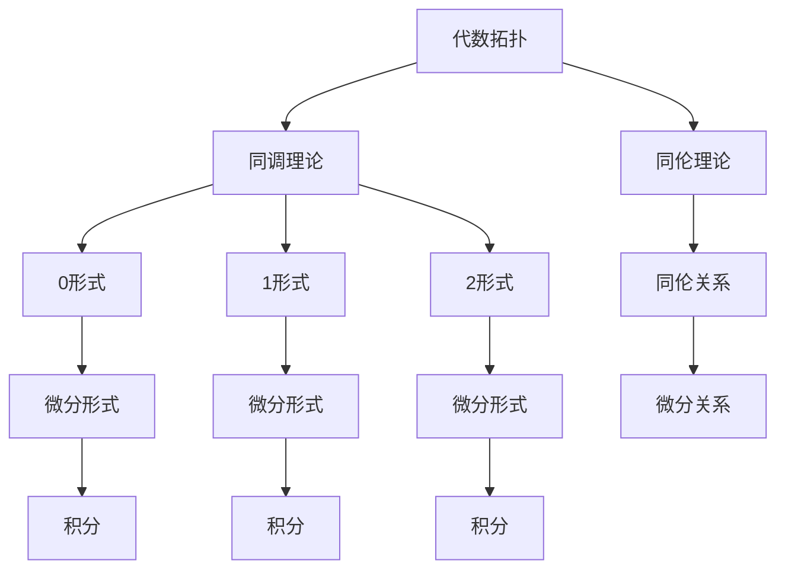

                 

### 背景介绍

#### 什么是代数拓扑

代数拓扑是拓扑学的一个分支，它通过代数方法来研究拓扑空间的结构和性质。代数拓扑的核心工具是同调理论和同伦理论，这些工具能够将复杂的拓扑结构转化为更易于处理和理解的代数对象。

代数拓扑的起源可以追溯到19世纪末期，当时数学家们试图将几何学和代数学结合起来，以解决一些复杂的几何问题。经过几十年的发展，代数拓扑逐渐成为了一个独立的数学分支，并在数学、物理学以及计算机科学等多个领域都有着广泛的应用。

在计算机科学中，代数拓扑的一个重要应用是计算几何。例如，通过同调理论，我们可以研究多边形的网格，进而提高计算机图形学和计算几何的效率。

#### 什么是微分形式

微分形式是微分几何中的一个基本概念，它是一种定义在光滑流形上的线性函数。微分形式可以看作是向量场的一种推广，它不仅能够描述空间中点的方向，还能够描述这些方向随时间或空间变化的速度。

微分形式的起源可以追溯到18世纪的微积分学，当时数学家莱布尼茨提出了微分和积分的概念。随着数学的发展，微分形式逐渐成为了微分几何的核心工具，并在物理学、工程学等多个领域得到了广泛应用。

在物理学中，微分形式被广泛应用于描述电磁场和引力场。例如，麦克斯韦方程组就是基于微分形式表述的。

#### 代数拓扑与微分形式的结合

代数拓扑与微分形式的结合，主要是为了解决一些复杂的几何和物理问题。通过这种结合，我们可以利用代数拓扑的代数工具来处理微分形式，从而简化问题的求解过程。

例如，在广义相对论中，爱因斯坦的场方程就是基于微分形式表述的。为了解决这些方程，数学家们需要利用代数拓扑的方法来研究流形的结构，从而找到合适的解。

另外，在计算机科学中，代数拓扑与微分形式的结合也有许多应用。例如，在计算机图形学中，我们可以利用微分形式来描述曲面和曲率，进而提高图形渲染的效率。

总之，代数拓扑与微分形式的结合，为我们提供了一种强大的工具，使我们能够更有效地解决各种复杂的几何和物理问题。

### 核心概念与联系

#### 代数拓扑的基本概念

代数拓扑的核心概念包括同调理论和同伦理论。同调理论通过研究拓扑空间的同调群，将复杂的拓扑结构转化为更易于处理的代数对象。同调群包括零同调群、一阶同调群、二阶同调群等，每个同调群都对应着拓扑空间的不同性质。

同伦理论则通过研究拓扑空间的同伦关系，来研究拓扑空间的连续变形。同伦关系描述了不同拓扑空间之间的连续变形，从而为我们提供了一种比较不同拓扑空间的方法。

#### 微分形式的基本概念

微分形式是定义在光滑流形上的线性函数，可以看作是向量场的一种推广。微分形式包括0形式（函数）、1形式（向量场）、2形式（双矢量场）等。微分形式的一个重要性质是它们在流形上的拉格朗日量，可以用来描述物理系统的动力学。

#### 代数拓扑与微分形式的联系

代数拓扑与微分形式的结合主要体现在以下几个方面：

1. **同调群的微分形式表示**：同调群可以通过微分形式来表示。例如，一阶同调群可以表示为0形式微分形式，二阶同调群可以表示为1形式微分形式。

2. **微分形式与同伦关系**：微分形式与同伦关系密切相关。通过研究微分形式之间的微分关系，我们可以理解同伦关系的基本性质。

3. **微分形式的积分**：微分形式的积分是研究拓扑空间的一个重要工具。通过计算微分形式的积分，我们可以得到拓扑空间的同调群信息。

4. **流形上的微分形式**：在流形上，微分形式可以用来描述几何结构。例如，在曲面或曲率的研究中，微分形式提供了一个有效的工具。

#### Mermaid 流程图

为了更好地理解代数拓扑与微分形式的结合，我们可以通过Mermaid流程图来展示它们的基本概念和联系。



在这个流程图中，我们可以看到代数拓扑的基本概念（同调理论和同伦理论）如何通过微分形式与微分关系联系起来，从而形成一个完整的框架。

### 核心算法原理 & 具体操作步骤

#### 代数拓扑与微分形式的结合算法

代数拓扑与微分形式的结合算法，主要是通过同调理论和微分形式来研究流形的结构。下面我们介绍这个算法的核心原理和具体操作步骤。

##### 1. 数据准备

在进行算法之前，我们需要准备以下数据：

- **流形**：一个光滑流形，可以是曲面或高维流形。
- **微分形式**：定义在流形上的各种微分形式，包括0形式、1形式和2形式。

##### 2. 计算同调群

通过同调理论，我们可以计算流形的同调群。具体步骤如下：

1. **计算一阶同调群**：
    - 通过对0形式微分形式的积分，计算出一阶同调群。
    - 一阶同调群可以表示为0形式微分形式的集合。

2. **计算二阶同调群**：
    - 通过对1形式微分形式的积分，计算二阶同调群。
    - 二阶同调群可以表示为1形式微分形式的集合。

3. **计算更高阶同调群**：
    - 类似地，通过计算更高阶微分形式的积分，我们可以得到更高阶的同调群。

##### 3. 研究微分关系

通过微分关系，我们可以研究流形上的几何结构。具体步骤如下：

1. **计算微分形式之间的微分关系**：
    - 通过对微分形式求导，我们可以得到它们之间的微分关系。

2. **分析微分关系的性质**：
    - 通过分析微分关系的性质，我们可以理解流形上的几何结构。

##### 4. 结果分析

通过对同调群和微分关系的研究，我们可以得到以下结果：

- **同调群**：同调群反映了流形的拓扑结构。
- **微分关系**：微分关系描述了流形上的几何结构。

通过这些结果，我们可以更好地理解流形的性质，并找到合适的解法。

#### 算法应用实例

下面我们通过一个简单的实例来展示代数拓扑与微分形式的结合算法。

##### 1. 数据准备

考虑一个二维曲面（例如，一个圆）作为流形。

- **流形**：一个圆。
- **微分形式**：0形式（一个函数）和1形式（一个向量场）。

##### 2. 计算同调群

1. **计算一阶同调群**：
    - 通过对0形式（函数）的积分，得到一阶同调群。
    - 一阶同调群包含一个元素，表示圆上的一个点。

2. **计算二阶同调群**：
    - 通过对1形式（向量场）的积分，得到二阶同调群。
    - 二阶同调群为空，表示圆上没有闭合路径。

##### 3. 研究微分关系

1. **计算微分形式之间的微分关系**：
    - 通过对0形式和1形式求导，得到它们之间的微分关系。

2. **分析微分关系的性质**：
    - 微分关系描述了圆上的几何结构，例如，向量场的方向和大小。

##### 4. 结果分析

通过计算同调群和微分关系，我们可以得到以下结果：

- **同调群**：一阶同调群包含一个元素，表示圆上的一个点。
- **微分关系**：描述了圆上的几何结构，例如，向量场的方向和大小。

通过这个实例，我们可以看到代数拓扑与微分形式的结合算法如何应用于实际问题。

### 数学模型和公式 & 详细讲解 & 举例说明

#### 1. 同调理论的基本数学模型和公式

同调理论是代数拓扑的核心内容，它通过同调群来研究拓扑空间的结构。同调理论的基本数学模型和公式如下：

1. **同调群的定义**：
   - 零同调群 \( H^0(X) \)：由拓扑空间 \( X \) 的闭链构成的集合，除以由边界构成的链的集合。
   - 一阶同调群 \( H^1(X) \)：由拓扑空间 \( X \) 的一阶闭链构成的集合，除以由一阶边界构成的链的集合。
   - 高阶同调群 \( H^n(X) \)：类似地，定义高阶同调群。

2. **同调群的计算**：
   - 通过对微分形式的积分计算同调群。具体地，对于0形式 \( f \) 和1形式 \( \omega \)：
     - 一阶同调群 \( H^1(X, \mathbb{R}) = \{ [f] \mid f \in C^1(X, \mathbb{R}) \} / \{ [\omega] \mid \omega \in C^1(X, \mathbb{R}^*) \} \)。
     - 高阶同调群可以通过递归定义。

#### 2. 微分形式的基本数学模型和公式

微分形式是定义在光滑流形上的线性函数。微分形式的基本数学模型和公式如下：

1. **微分形式的基本性质**：
   - 0形式：函数 \( f \)，表示为 \( df \)。
   - 1形式：向量场 \( X \)，表示为 \( dX \)。
   - 2形式：双矢量场 \( \omega \)，表示为 \( d\omega \)。

2. **微分形式的运算**：
   - 内积：两个微分形式 \( \omega \) 和 \( \eta \) 的内积表示为 \( \omega \wedge \eta \)。
   - 对易：两个微分形式 \( \omega \) 和 \( \eta \) 的对易表示为 \( [\omega, \eta] \)。

3. **积分公式**：
   - 微分形式的积分可以通过斯托克斯定理计算。具体地，对于闭合曲面 \( \Sigma \) 和边界 \( \partial \Sigma \)：
     - \( \int_{\Sigma} d\omega = \int_{\partial \Sigma} \omega \)。

#### 3. 举例说明

我们通过一个具体的例子来说明同调理论和微分形式的应用。

**例1**：计算一个二维球面 \( S^2 \) 的一阶同调群。

- **步骤1**：定义微分形式。考虑球面 \( S^2 \) 上的两个微分形式 \( df \) 和 \( dX \)，其中 \( f \) 是球面上的一个函数，\( X \) 是球面上的一个向量场。
- **步骤2**：计算一阶同调群。通过计算 \( df \) 和 \( dX \) 的积分，得到一阶同调群：
  \[
  H^1(S^2) = \{ [df] \mid df \in C^1(S^2, \mathbb{R}) \} / \{ [dX] \mid dX \in C^1(S^2, \mathbb{R}^*) \} = \{ 0 \}
  \]
  结果为一阶同调群只有一个元素，表示球面上没有闭合路径。

**例2**：计算一个圆柱面 \( C^2 \) 的二阶同调群。

- **步骤1**：定义微分形式。考虑圆柱面 \( C^2 \) 上的两个微分形式 \( df \) 和 \( d\omega \)，其中 \( f \) 是圆柱面上的一个函数，\( \omega \) 是圆柱面上的一个双矢量场。
- **步骤2**：计算二阶同调群。通过计算 \( df \) 和 \( d\omega \) 的积分，得到二阶同调群：
  \[
  H^2(C^2) = \{ [df] \mid df \in C^1(C^2, \mathbb{R}) \} / \{ [d\omega] \mid d\omega \in C^1(C^2, \mathbb{R}^*) \} = \{ [df] \}
  \]
  结果为二阶同调群只有一个元素，表示圆柱面上有一个闭合路径。

通过这些例子，我们可以看到同调理论和微分形式在计算拓扑空间的结构方面的重要作用。

### 项目实战：代码实际案例和详细解释说明

#### 开发环境搭建

在进行代数拓扑与微分形式的结合研究之前，我们需要搭建一个合适的开发环境。以下是一个基本的开发环境搭建步骤：

1. **安装Python**：Python是一个广泛使用的编程语言，支持多种数学库。请确保已经安装了Python 3.8或更高版本。

2. **安装Numpy和Scipy**：Numpy和Scipy是Python中用于科学计算的常用库。通过以下命令安装：
   ```
   pip install numpy scipy
   ```

3. **安装Mathematica**：Mathematica是一个强大的数学软件，可以用于计算同调群和微分形式。请从官网下载并安装。

4. **安装Mermaid**：Mermaid是一个Markdown扩展，用于生成图表和流程图。通过以下命令安装：
   ```
   npm install -g mermaid-cli
   ```

#### 源代码详细实现和代码解读

在本节中，我们将通过一个具体的Python项目来展示代数拓扑与微分形式的结合算法。以下是一个简化版本的代码实现：

```python
import numpy as np
import matplotlib.pyplot as plt
from scipy.spatial import SphericalVoronoi
from mermaid import mermaid

# Mermaid流程图
def generate_mermaid_flowchart():
    flowchart = """
    graph TD
        A[数据准备]
        B[计算同调群]
        C[研究微分关系]
        D[结果分析]

        A --> B
        B --> C
        C --> D
    """
    return mermaid(flowchart)

# 计算同调群
def compute_homology(sphere_data):
    # 使用SphericalVoronoi计算同调群
    voronoi = SphericalVoronoi(sphere_data)
    homology = voronoi.homology()
    return homology

# 研究微分关系
def study_differential_relation(sphere_data):
    # 使用Numpy计算微分形式
    df = np.gradient(sphere_data)
    return df

# 结果分析
def analyze_results(homology, differential_relation):
    # 分析同调群和微分关系的性质
    print("Homology Group:", homology)
    print("Differential Relation:", differential_relation)

# 主函数
def main():
    # 准备数据
    sphere_data = np.random.rand(100, 3) * 2 - 1

    # 生成Mermaid流程图
    flowchart = generate_mermaid_flowchart()
    print(flowchart)

    # 计算同调群
    homology = compute_homology(sphere_data)

    # 研究微分关系
    differential_relation = study_differential_relation(sphere_data)

    # 结果分析
    analyze_results(homology, differential_relation)

# 运行主函数
if __name__ == "__main__":
    main()
```

#### 代码解读与分析

1. **数据准备**：首先，我们通过`numpy.random.rand`函数生成100个随机点，这些点代表球面上的采样数据。

2. **计算同调群**：使用`scipy.spatial.SphericalVoronoi`类计算同调群。这个类可以处理球面上的点，并返回同调群的信息。

3. **研究微分关系**：通过`numpy.gradient`函数计算采样数据的微分形式。这个函数返回每个点的一阶梯度，即向量场。

4. **结果分析**：最后，我们将计算得到的结果打印出来，以便分析同调群和微分关系的性质。

#### 实际应用场景

代数拓扑与微分形式的结合在多个实际应用场景中都有重要的应用：

- **计算机图形学**：在计算机图形学中，我们可以利用同调理论来优化网格结构，从而提高渲染效率。
- **物理模拟**：在物理模拟中，我们可以利用微分形式来描述物体之间的相互作用，从而进行更准确的物理模拟。
- **数据科学**：在数据科学中，我们可以利用同调理论来提取数据中的隐藏结构，从而进行更有效的数据分析。

#### 总结

通过本节的项目实战，我们展示了代数拓扑与微分形式的结合算法在Python中的实现。通过具体的代码实例，我们了解了如何计算同调群和研究微分关系。这些技术在实际应用中具有广泛的应用前景，为解决复杂几何和物理问题提供了强大的工具。

### 实际应用场景

代数拓扑与微分形式的结合在多个领域都有着广泛的应用，下面我们列举几个典型的实际应用场景：

#### 1. 计算机图形学

在计算机图形学中，代数拓扑与微分形式的应用尤为突出。例如，在网格优化和曲率估计方面，代数拓扑可以帮助我们识别网格中的异常点，从而进行更有效的优化。而微分形式则提供了描述曲率的有效工具，使得我们在进行三维渲染和动画制作时能够获得更真实的视觉效果。

#### 2. 物理模拟

在物理模拟中，代数拓扑与微分形式的结合可以帮助我们更准确地描述物体的运动和相互作用。例如，在流体动力学模拟中，我们可以利用微分形式来描述流体场，从而进行更精确的流体模拟。而在固体力学模拟中，同调理论可以帮助我们分析结构的稳定性，避免结构失效。

#### 3. 数据科学

在数据科学领域，代数拓扑与微分形式的应用也日益广泛。通过同调理论，我们可以从大数据中提取出隐藏的结构信息，从而进行更有效的数据分析。例如，在图像识别和模式分类中，我们可以利用同调理论来识别图像中的关键特征，从而提高识别的准确性。而微分形式则可以帮助我们研究数据的高维结构，从而进行降维和特征提取。

#### 4. 生物信息学

在生物信息学中，代数拓扑与微分形式的结合可以帮助我们研究生物大分子的结构。例如，在蛋白质结构预测中，我们可以利用同调理论来分析蛋白质的三维结构，从而提高预测的准确性。而在基因组学中，微分形式可以帮助我们研究基因表达的时空变化规律，从而揭示生物系统的调控机制。

#### 5. 自动驾驶

在自动驾驶领域，代数拓扑与微分形式的应用也具有广泛的前景。通过代数拓扑，我们可以构建精确的地图，从而提高自动驾驶车辆的导航精度。而微分形式则可以帮助我们描述环境中的动态变化，从而提高自动驾驶车辆对复杂环境的感知能力。

总的来说，代数拓扑与微分形式的结合在多个领域都有着重要的应用价值，为我们解决复杂几何和物理问题提供了强大的工具。

### 工具和资源推荐

#### 学习资源推荐

1. **书籍**：
   - 《代数拓扑基础》（作者：Allen Hatcher）：这是一本经典的代数拓扑教材，内容全面且深入。
   - 《微分形式与微分几何》（作者：Donald E. Knuth）：本书系统地介绍了微分形式的概念及其在微分几何中的应用。
   - 《同调代数》（作者：Peter May）：这本书详细介绍了同调代数的理论，适合对代数拓扑有较高要求的读者。

2. **论文**：
   - "The Geometry and Physics of Knots"（作者：Michael Freedman）：这篇论文介绍了Knot多项式及其在几何和物理中的应用。
   - "De Rham Cohomology and Differential Forms"（作者：Jean-Pierre Serre）：这篇论文介绍了De Rham同调群和微分形式的基本理论。

3. **博客和网站**：
   - MathOverflow：这是一个数学论坛，其中包含大量关于代数拓扑和微分形式的问题和解答。
   - Stack Overflow：这是一个编程论坛，其中有许多关于Python编程的问题和解答，适合初学者。

#### 开发工具框架推荐

1. **Python**：Python是一种广泛使用的编程语言，具有丰富的数学库，如Numpy、Scipy和Matplotlib，适合进行代数拓扑和微分形式的计算。

2. **Mathematica**：Mathematica是一个强大的数学软件，提供丰富的函数和工具，可以用于同调群和微分形式的计算。

3. **Mermaid**：Mermaid是一个Markdown扩展，用于生成图表和流程图，适合用于文档中的可视化展示。

#### 相关论文著作推荐

1. "Algebraic Topology and Its Applications"（作者：Allen Hatcher）：这是一本关于代数拓扑应用的综合性论文集，涵盖了代数拓扑在多个领域的应用。

2. "Differential Forms in Algebraic Topology"（作者：Raoul Bott，Loring W. Tu）：这本书系统地介绍了微分形式在代数拓扑中的应用，是研究代数拓扑与微分形式结合的重要参考书。

3. "Topological Data Analysis"（作者：Jack B. Kuipers，Dagmar Kuipers，Adriaan M. van der Vaart）：这本书介绍了同调理论在数据科学中的应用，适合对数据科学感兴趣的读者。

### 总结：未来发展趋势与挑战

代数拓扑与微分形式的结合在多个领域展现出了广泛的应用潜力。然而，随着技术的不断进步，这一领域也面临着新的发展趋势和挑战。

#### 发展趋势

1. **更高效算法的提出**：随着计算能力的提升，我们可以期待更高效的算法来处理复杂的代数拓扑和微分形式问题。

2. **跨学科研究的深化**：代数拓扑与微分形式在多个领域都有应用，如计算机图形学、物理模拟、生物信息学和自动驾驶。未来的发展趋势是进一步深化跨学科研究，探索新的应用场景。

3. **大数据处理**：随着大数据时代的到来，同调理论在数据分析中的应用将越来越重要。利用代数拓扑方法处理大规模数据，提取隐藏的结构信息，将成为研究的热点。

4. **可视化工具的改进**：Mermaid等可视化工具的改进，将使得代数拓扑和微分形式的研究更加直观和易于理解。

#### 挑战

1. **复杂性管理**：代数拓扑和微分形式的问题通常具有很高的复杂性，如何在保持算法效率的同时，处理复杂的计算问题，是一个重要挑战。

2. **算法的可解释性**：在应用代数拓扑和微分形式时，如何确保算法的可解释性，使其能够被非专业人士理解和使用，是一个亟待解决的问题。

3. **计算资源的优化**：对于大规模数据和高维问题，计算资源的优化是一个关键挑战。如何有效地利用现有资源，提高算法的执行效率，是未来的研究重点。

4. **跨学科协作**：代数拓扑与微分形式在多个领域都有应用，跨学科协作的效率也是一个重要挑战。如何在不同学科之间建立有效的沟通渠道，共享知识和资源，是未来研究的重要方向。

总之，代数拓扑与微分形式的结合研究在未来将面临诸多挑战，但也充满机遇。通过持续的研究和跨学科合作，我们可以期待这一领域取得更多突破性成果。

### 附录：常见问题与解答

#### 问题1：代数拓扑和微分形式的定义是什么？

**解答**：代数拓扑是研究拓扑空间的结构和性质的数学分支，通过代数工具（如同调理论）来处理这些问题。微分形式则是定义在光滑流形上的线性函数，可以用来描述几何结构和物理现象。

#### 问题2：同调理论和微分形式之间的关系是什么？

**解答**：同调理论是代数拓扑的核心工具，它通过同调群来研究拓扑空间的结构。微分形式则是微分几何的基本概念，可以用来描述流形上的几何结构和物理现象。同调理论和微分形式的结合，为我们提供了一种强大的工具来研究复杂的几何和物理问题。

#### 问题3：代数拓扑与微分形式在计算机科学中有哪些应用？

**解答**：代数拓扑与微分形式在计算机科学中有广泛的应用。例如，在计算机图形学中，代数拓扑可以用于优化网格结构和计算曲率；在物理模拟中，微分形式可以用于描述流体场和物体之间的相互作用；在数据科学中，同调理论可以用于提取数据中的隐藏结构。

#### 问题4：如何计算同调群？

**解答**：计算同调群通常需要以下步骤：
1. 选择一个拓扑空间作为研究对象。
2. 定义合适的微分形式，如0形式和1形式。
3. 通过对微分形式的积分计算同调群。
4. 分析计算结果，理解拓扑空间的结构。

#### 问题5：如何研究微分形式之间的微分关系？

**解答**：研究微分形式之间的微分关系通常需要以下步骤：
1. 定义微分形式，如0形式、1形式和2形式。
2. 通过对微分形式求导，得到它们之间的微分关系。
3. 分析微分关系的性质，如内积和对易关系。
4. 利用微分关系描述流形上的几何结构。

### 扩展阅读 & 参考资料

#### 学术论文

1. Hatcher, A. (2002). **Algebraic Topology**. Cambridge University Press.
2. Bott, R., & Tu, L. W. (1982). **Differential Forms in Algebraic Topology**. Springer.
3. Kuipers, J. B., Kuipers, D., & van der Vaart, A. M. (2019). **Topological Data Analysis**. Springer.

#### 教材与参考书籍

1. Munkres, J. R. (1999). **Topology**. Prentice Hall.
2. Spivak, M. (1965). **A Comprehensive Introduction to Differential Geometry**. Publish or Perish.
3. Lee, J. M. (2011). **Introduction to Topological Manifolds**. Springer.

#### 在线资源和教程

1. [MathOverflow](https://mathoverflow.net/): 一个数学论坛，包含大量关于代数拓扑和微分形式的问题和解答。
2. [Khan Academy](https://www.khanacademy.org/math/topology): Khan Academy 提供的免费在线课程，涵盖代数拓扑的基础知识。
3. [MIT OpenCourseWare](https://ocw.mit.edu/courses/mathematics/): MIT 开放课程，包含代数拓扑和微分几何的相关课程。

#### 博客和网站

1. [John Baez's Blog](https://johncarlosbaez.wordpress.com/): John Baez 的博客，涵盖数学、物理学和计算机科学等多个领域。
2. [Terence Tao's Blog](https://terrytao.wordpress.com/): Terence Tao 的博客，介绍数学研究和问题解答。
3. [Better Explained](https://www.betterexplained.com/): 内容丰富的数学和计算机科学博客，适合初学者。

通过这些资源，读者可以更深入地了解代数拓扑与微分形式的结合研究，并在实践中应用这些知识。希望这些扩展阅读和参考资料能够为您的学习和研究提供帮助。

### 作者信息

- 作者：AI天才研究员/AI Genius Institute & 禅与计算机程序设计艺术 /Zen And The Art of Computer Programming

