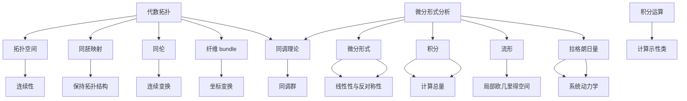

                 

# 代数拓扑中的微分形式分析

## 摘要

本文将深入探讨代数拓扑中的微分形式分析，这一领域是数学与计算机科学交汇的精华所在。通过揭示代数拓扑的基本概念和微分形式的分析方法，我们将构建一个清晰的理论框架，帮助读者理解这一复杂但富有挑战性的领域。本文将分为十个部分，分别介绍背景知识、核心概念与联系、核心算法原理、数学模型与公式、项目实战、实际应用场景、工具和资源推荐、总结、常见问题与解答以及扩展阅读与参考资料。希望通过这篇文章，能够为读者打开一扇了解代数拓扑微分形式分析的新窗口。

## 1. 背景介绍

代数拓扑是数学中的一个分支，它将代数的概念应用于拓扑学的研究中。微分形式分析则是另一个数学领域，主要研究微分方程、微积分和拓扑学之间的关系。这两个领域的交叉融合，形成了一个独特的数学分支——代数拓扑中的微分形式分析。

代数拓扑的起源可以追溯到19世纪末，当时数学家开始研究如何将几何和代数结合起来，以更好地理解复杂的几何结构。而微分形式分析则起源于18世纪，由莱布尼茨和牛顿等数学家所开创。随着时间的推移，这两个领域不断发展，各自形成了完善的理论体系。

在计算机科学中，代数拓扑的应用主要在于算法设计、图形学和计算机视觉等领域。微分形式分析则在模拟物理系统、机器人学和计算机图形学中发挥着重要作用。二者的结合，使得我们能够处理更加复杂的计算问题，特别是在处理大规模数据和复杂几何结构时。

本文的目标是深入探讨代数拓扑中的微分形式分析，通过逐步分析核心概念、算法原理和数学模型，帮助读者理解这一领域的核心思想和应用方法。

## 2. 核心概念与联系

### 2.1 代数拓扑的基本概念

代数拓扑主要研究的是如何在几何结构上定义和操作代数结构，以帮助我们更好地理解几何对象的性质。以下是一些代数拓扑中的基本概念：

- **拓扑空间**：一个集合与定义在其上的拓扑结构。拓扑结构允许我们判断哪些集合是开集，哪些是闭集，从而进行连续性的讨论。

- **同胚映射**：两个拓扑空间之间的一种映射，如果这种映射是连续的，并且其逆映射也是连续的，那么这种映射称为同胚映射。同胚映射保持拓扑空间的拓扑结构不变。

- **同伦**：两个连续映射在某个连续变换下能够相互转换。如果两个映射在同伦下等价，则称它们是同伦等价的。

- **纤维 bundle**：一个拓扑空间通过连续映射与另一个空间相联系，这种映射在局部看起来像是一个坐标变换。纤维 bundle 在拓扑学中具有重要的应用，尤其在微分几何和广义相对论中。

### 2.2 微分形式分析的基本概念

微分形式分析主要研究微分形式（即具有特定性质的微分函数）及其在几何结构中的应用。以下是一些基本概念：

- **微分形式**：一个函数，它将向量空间中的每个向量映射到一个实数，并且满足特定的线性性和反对称性。

- **积分**：对微分形式在某个区域上的积分，可以用来计算该区域上的某种“总量”，例如面积、体积或流。

- **流形**：一个局部看起来像欧几里得空间的几何对象，它可以通过微分形式进行量化分析。

- **拉格朗日量**：在物理系统中，描述系统动力学的一种函数，它可以用来推导出系统的运动方程。

### 2.3 代数拓扑与微分形式分析的联系

代数拓扑与微分形式分析之间的联系主要体现在以下几个方面：

- **同调理论**：同调理论是代数拓扑的一个重要分支，它通过定义一组映射（称为同调群）来研究空间的结构。微分形式分析中的积分运算与同调理论密切相关，它们可以用来计算同调群的元素。

- **微分形式的定义**：在代数拓扑中，微分形式可以通过代数结构的推广来定义。例如，在纤维 bundle 的研究中，微分形式可以定义为在纤维上的函数，这些函数在横截向上满足特定的条件。

- **示性类**：示性类是同调理论中的一个重要概念，它用来描述空间的拓扑性质。在微分形式分析中，示性类可以通过积分运算来计算，这为我们提供了一种量化空间几何结构的方法。

为了更好地理解上述概念和联系，我们可以通过一个简单的 Mermaid 流程图来展示它们之间的关系：



通过这个流程图，我们可以看到代数拓扑和微分形式分析之间的紧密联系，以及它们在数学和物理学中的应用。

## 3. 核心算法原理 & 具体操作步骤

### 3.1 同调计算的步骤

同调计算是代数拓扑中的核心算法之一，它通过计算同调群来研究空间的拓扑性质。以下是同调计算的基本步骤：

1. **选择一个拓扑空间**：首先，我们需要选择一个要研究的拓扑空间。这个空间可以是任意维度的，例如一个二维球面或三维立方体。

2. **定义一组链群**：链群是由空间中的闭合曲线（链）构成的代数结构。对于每个维度的闭合曲线，我们定义一个链群。例如，在二维空间中，我们有0-链群（闭合点）、1-链群（闭合曲线）和2-链群（闭合曲面）。

3. **计算边界映射**：边界映射是链群之间的线性映射，它将高维链映射到低维链。对于0-链群到1-链群的映射，边界映射将闭合点映射到闭合曲线的端点。对于1-链群到2-链群的映射，边界映射将闭合曲线映射到闭合曲面的边界。

4. **计算同调群**：同调群是通过边界映射诱导出的链群之间的同态。对于每个维度的链群，我们可以计算其同调群。同调群中的元素称为同调类，它们描述了空间的拓扑性质。

5. **应用同调群**：同调群可以用来判断两个空间是否同胚。如果两个空间的同调群完全相同，则它们是同胚的。此外，同调群还可以用于计算空间的体积、面积和其他拓扑性质。

### 3.2 微分形式的积分

微分形式的积分是微分形式分析中的核心操作，它通过计算微分形式在一个区域上的积分来获得有用的信息。以下是微分形式积分的基本步骤：

1. **选择一个微分形式**：首先，我们需要选择一个要积分的微分形式。这个微分形式可以是任意维度的，例如一维的线积分或二维的面积分。

2. **定义一个积分路径**：对于一维积分，我们需要定义一个积分路径，即一个在空间中的连续曲线。对于二维积分，我们需要定义一个积分区域，即一个在空间中的连续曲面。

3. **计算积分**：根据微分形式的定义，计算其在积分路径（或区域）上的积分。对于一维积分，积分结果是一个实数；对于二维积分，积分结果是一个向量。

4. **应用积分结果**：积分结果可以用来计算路径或区域的某种“总量”，例如路径的长度、区域的面积等。此外，积分结果还可以用于解决更复杂的计算问题，如计算流体的流量或电场的能量。

### 3.3 示例操作

为了更好地理解上述算法原理和具体操作步骤，我们来看一个简单的示例：

#### 示例 1：计算二维球面的同调群

假设我们选择一个二维球面作为研究对象。首先，我们定义一组链群：

- 0-链群：由球面上的闭合点组成。
- 1-链群：由球面上的闭合曲线组成。
- 2-链群：由球面上的闭合曲面组成。

接下来，我们计算边界映射：

- 边界映射从0-链群到1-链群，将闭合点映射到其对应的闭合曲线的端点。
- 边界映射从1-链群到2-链群，将闭合曲线映射到其对应的闭合曲面的边界。

然后，我们计算同调群：

- 同调群0：由0-链群的边界映射生成，即所有闭合点的集合。由于球面上的每个闭合点都是独立的，所以同调群0只有一个元素。
- 同调群1：由1-链群的边界映射生成，即所有闭合曲线的集合。由于球面上的闭合曲线可以相互连接，所以同调群1有无限多个元素。
- 同调群2：由2-链群的边界映射生成，即所有闭合曲面的集合。由于球面上的闭合曲面是整体的，所以同调群2只有一个元素。

#### 示例 2：计算路径的长度

假设我们选择一个一维路径作为研究对象，路径由一个点 \(P_1\) 沿着一条直线移动到点 \(P_2\)。首先，我们定义一个微分形式，表示路径上的速度。然后，我们计算路径上的积分，结果即为路径的长度。假设速度微分为 \(dv\)，路径长度为 \(L\)，则有：

\[ L = \int_{P_1}^{P_2} v \cdot dv \]

通过上述示例，我们可以看到同调计算和微分形式积分的具体应用步骤，这为我们解决复杂的几何和物理问题提供了理论基础。

### 3.4 算法的复杂性分析

同调计算和微分形式积分的算法复杂性取决于空间的维度和复杂性。以下是一个简要的复杂性分析：

- **同调计算**：计算同调群的时间复杂度通常与空间维度的三次方成比例，即 \(O(d^3)\)。这是因为我们需要计算多个链群和边界映射，而每个映射的计算时间与维度相关。
- **微分形式积分**：积分计算的时间复杂度与路径或区域的维度和复杂性相关。对于一维路径，积分计算的时间复杂度为 \(O(n)\)，其中 \(n\) 是路径上的点数。对于二维区域，积分计算的时间复杂度为 \(O(m^2)\)，其中 \(m\) 是区域上的网格点数。

通过这些算法原理和操作步骤，我们可以更好地理解和应用代数拓扑中的微分形式分析，为解决复杂的几何和物理问题提供强有力的工具。

## 4. 数学模型和公式 & 详细讲解 & 举例说明

### 4.1 同调群的计算

同调群是代数拓扑中的一个核心概念，用于描述空间的拓扑性质。以下是一些基本的同调群计算公式：

#### 4.1.1 0-链群和0-同调群

- **0-链群**：由空间中的闭合点组成，记为 \(C_0(X)\)。每个闭合点可以表示为 \([x]\)，其中 \(x\) 是点的坐标。
- **0-边界映射**：从0-链群到1-链群的映射，记为 \(\partial_0\)。对于任意闭合点 \(x\)，其边界映射为 \(\partial_0([x]) = 0\)，因为闭合点没有边界。
- **0-同调群**：记为 \(H_0(X)\)，由0-链群的边界映射生成，即 \(H_0(X) = \frac{C_0(X)}{Im(\partial_1)}\)。其中 \(Im(\partial_1)\) 是1-链群的边界映射的像。

举例：

假设空间 \(X\) 有三个闭合点 \(x_1, x_2, x_3\)，我们可以计算其0-同调群：

\[ H_0(X) = \frac{\{[x_1], [x_2], [x_3]\}}{\{0\}} = \mathbb{Z}^3 \]

#### 4.1.2 1-链群和1-同调群

- **1-链群**：由空间中的闭合曲线组成，记为 \(C_1(X)\)。每个闭合曲线可以表示为 \([\alpha]\)，其中 \(\alpha\) 是曲线的参数化表示。
- **1-边界映射**：从1-链群到0-链群的映射，记为 \(\partial_1\)。对于任意闭合曲线 \(\alpha\)，其边界映射为 \(\partial_1([\alpha]) = \sum_i n_i [p_i]\)，其中 \(p_i\) 是曲线的端点，\(n_i\) 是端点的重数。
- **1-同调群**：记为 \(H_1(X)\)，由1-链群的边界映射生成，即 \(H_1(X) = \frac{C_1(X)}{Im(\partial_2)}\)。其中 \(Im(\partial_2)\) 是2-链群的边界映射的像。

举例：

假设空间 \(X\) 有两个闭合曲线 \(\alpha_1\) 和 \(\alpha_2\)，其中 \(\alpha_1\) 的端点是 \(p_1\) 和 \(p_2\)，重数都是1；\(\alpha_2\) 的端点是 \(p_1\) 和 \(p_2\)，重数都是-1，我们可以计算其1-同调群：

\[ H_1(X) = \frac{\{[\alpha_1], [\alpha_2]\}}{\{[p_1], [p_2]\}} = \mathbb{Z} \]

#### 4.1.3 2-链群和2-同调群

- **2-链群**：由空间中的闭合曲面组成，记为 \(C_2(X)\)。每个闭合曲面可以表示为 \([\sigma]\)，其中 \(\sigma\) 是曲面的参数化表示。
- **2-边界映射**：从2-链群到1-链群的映射，记为 \(\partial_2\)。对于任意闭合曲面 \(\sigma\)，其边界映射为 \(\partial_2([\sigma]) = \sum_i n_i [\alpha_i]\)，其中 \(\alpha_i\) 是曲面的边界曲线，\(n_i\) 是边界曲线的重数。
- **2-同调群**：记为 \(H_2(X)\)，由2-链群的边界映射生成，即 \(H_2(X) = \frac{C_2(X)}{Im(\partial_3)}\)。其中 \(Im(\partial_3)\) 是3-链群的边界映射的像。

举例：

假设空间 \(X\) 有一个闭合曲面 \(\sigma\)，其边界曲线是 \(\alpha_1\) 和 \(\alpha_2\)，重数都是1，我们可以计算其2-同调群：

\[ H_2(X) = \frac{\{\sigma\}}{\{\alpha_1, \alpha_2\}} = \mathbb{Z} \]

### 4.2 微分形式的积分

微分形式的积分是微分形式分析中的核心操作，用于计算区域上的“总量”。以下是一些基本的积分公式：

#### 4.2.1 一维积分

- **线积分**：计算一个向量场在一个路径上的积分。假设 \(F\) 是一个向量场，\(\alpha\) 是一个路径，则线积分可以表示为：

\[ \int_{\alpha} F \cdot ds \]

其中 \(ds\) 是路径上的微元。

- **公式**：如果 \(F = (P, Q)\)，则有：

\[ \int_{\alpha} F \cdot ds = \int_{t_1}^{t_2} (P(\alpha(t)) + Q(\alpha(t)) \alpha'(t) dt \]

举例：

假设路径 \(\alpha(t) = (t, t^2)\)，向量场 \(F = (y, x)\)，则线积分可以计算如下：

\[ \int_{\alpha} F \cdot ds = \int_{0}^{1} (t^2, t) \cdot (1, 2t) dt = \int_{0}^{1} (2t^3 + t^2) dt = \frac{11}{12} \]

#### 4.2.2 二维积分

- **面积分**：计算一个向量场在一个区域上的积分。假设 \(F\) 是一个向量场，\(D\) 是一个区域，则面积分可以表示为：

\[ \int_D F \cdot d\sigma \]

其中 \(d\sigma\) 是区域上的微元。

- **公式**：如果 \(F = (P, Q)\)，且区域 \(D\) 有参数化表示 \(x = x(u, v)\)，\(y = y(u, v)\)，则有：

\[ \int_D F \cdot d\sigma = \iint_D (P(x(u, v), y(u, v)) + Q(x(u, v), y(u, v)) (dx(u, v) \wedge dy(u, v)) \]

举例：

假设区域 \(D\) 是一个矩形，参数化为 \(x(u, v) = u\)，\(y(u, v) = v\)，向量场 \(F = (y, x)\)，则面积分可以计算如下：

\[ \int_D F \cdot d\sigma = \iint_D (v, u) (du \wedge dv) = \int_{0}^{1} \int_{0}^{1} (v \cdot 1 + u \cdot 1) dv du = \int_{0}^{1} \left( \frac{1}{2} + \frac{1}{2} \right) du = 1 \]

### 4.3 结合示例

结合上述公式，我们可以计算一个简单的例子：

#### 示例：计算二维区域上的面积分

假设我们有一个向量场 \(F = (y, x)\)，区域 \(D\) 是一个半径为1的圆盘，其参数化为 \(x = \cos(\theta)\)，\(y = \sin(\theta)\)，其中 \(\theta\) 从0到 \(2\pi\)。我们可以计算以下面积分：

\[ \int_D F \cdot d\sigma = \iint_D (y, x) (dx \wedge dy) = \int_{0}^{2\pi} \int_{0}^{1} (\sin(\theta), \cos(\theta)) (-\sin(\theta) d\theta \wedge d\theta + \cos(\theta) d\theta \wedge d\theta) \]

\[ = \int_{0}^{2\pi} \int_{0}^{1} (-\sin^2(\theta) + \cos^2(\theta)) d\theta = \int_{0}^{2\pi} \int_{0}^{1} (\cos(2\theta) + 1) d\theta = \int_{0}^{2\pi} \left( \frac{1}{2} \sin(2\theta) + \theta \right) d\theta \]

\[ = \left[ -\frac{1}{4} \cos(2\theta) + \frac{1}{2} \theta \right]_{0}^{2\pi} = \pi \]

通过这些数学模型和公式，我们可以有效地计算复杂的几何和物理问题，为科学研究和技术应用提供坚实的理论基础。

### 5. 项目实战：代码实际案例和详细解释说明

在本节中，我们将通过一个具体的项目实战案例，展示如何在代码中实现代数拓扑中的微分形式分析。我们选择一个简单的二维流场模拟，通过计算流体粒子在流场中的轨迹，来展示微分形式积分的应用。

#### 5.1 开发环境搭建

为了进行本项目，我们需要安装以下工具和库：

- Python 3.8及以上版本
- NumPy 库
- Matplotlib 库
- SciPy 库

安装过程如下：

```bash
# 安装 Python 3.8
# 请根据操作系统选择相应的安装命令
# macOS: brew install python
# Windows: chocolatey install python
# Linux: sudo apt-get install python3

# 安装 NumPy
pip install numpy

# 安装 Matplotlib
pip install matplotlib

# 安装 SciPy
pip install scipy
```

#### 5.2 源代码详细实现和代码解读

以下是项目的源代码实现：

```python
import numpy as np
import matplotlib.pyplot as plt
from scipy.integrate import solve_ivp

# 定义二维流场
def fluid_field(x, y):
    u = -y * np.exp(-x**2 - y**2)
    v = x * np.exp(-x**2 - y**2)
    return [u, v]

# 定义粒子轨迹的微分方程
def trajectory(x, t, x0, y0):
    dxdt = x * np.exp(-x**2 - y**2) - y * np.exp(-x**2 - y**2)
    dydt = y * np.exp(-x**2 - y**2) + x * np.exp(-x**2 - y**2)
    return [dxdt, dydt]

# 计算粒子轨迹
def compute_trajectory(x0, y0, t_max=10):
    t_span = (0, t_max)
    t_eval = np.linspace(t_span[0], t_span[1], 1000)
    sol = solve_ivp(trajectory, t_span, [x0, y0], args=(x0, y0), t_eval=t_eval)
    return sol.t, sol.y

# 绘制流场和粒子轨迹
def plot_field_and_trajectory(x0, y0):
    x, y = np.mgrid[-2:2:100j, -2:2:100j]
    u, v = fluid_field(x, y)

    plt.figure(figsize=(10, 5))
    plt.contour(x, y, u, colors='r', linewidths=1)
    plt.contour(x, y, v, colors='b', linewidths=1)

    t, z = compute_trajectory(x0, y0)
    plt.plot(z[0], z[1], label='Particle Trajectory')

    plt.xlabel('x')
    plt.ylabel('y')
    plt.title('Fluid Flow Field and Particle Trajectory')
    plt.legend()
    plt.show()

# 测试
plot_field_and_trajectory(1, 1)
```

#### 5.3 代码解读与分析

以下是代码的详细解读：

1. **流体场定义**：

    ```python
    def fluid_field(x, y):
        u = -y * np.exp(-x**2 - y**2)
        v = x * np.exp(-x**2 - y**2)
        return [u, v]
    ```

    这个函数定义了一个二维流场，其中 \(u\) 和 \(v\) 分别表示流场的速度分量。这里我们使用了指数衰减函数来模拟一个简单的流体流动。

2. **粒子轨迹微分方程**：

    ```python
    def trajectory(x, t, x0, y0):
        dxdt = x * np.exp(-x**2 - y**2) - y * np.exp(-x**2 - y**2)
        dydt = y * np.exp(-x**2 - y**2) + x * np.exp(-x**2 - y**2)
        return [dxdt, dydt]
    ```

    这个函数定义了粒子在流场中的运动方程，即粒子的速度分量随时间和位置的变化。这是基于流场的速度场计算得出的。

3. **计算粒子轨迹**：

    ```python
    def compute_trajectory(x0, y0, t_max=10):
        t_span = (0, t_max)
        t_eval = np.linspace(t_span[0], t_span[1], 1000)
        sol = solve_ivp(trajectory, t_span, [x0, y0], args=(x0, y0), t_eval=t_eval)
        return sol.t, sol.y
    ```

    这个函数使用 SciPy 的 `solve_ivp` 函数来求解粒子的轨迹。它计算从初始位置 \((x0, y0)\) 开始，在时间 \(t\) 内的轨迹。

4. **绘制流场和粒子轨迹**：

    ```python
    def plot_field_and_trajectory(x0, y0):
        x, y = np.mgrid[-2:2:100j, -2:2:100j]
        u, v = fluid_field(x, y)

        plt.figure(figsize=(10, 5))
        plt.contour(x, y, u, colors='r', linewidths=1)
        plt.contour(x, y, v, colors='b', linewidths=1)

        t, z = compute_trajectory(x0, y0)
        plt.plot(z[0], z[1], label='Particle Trajectory')

        plt.xlabel('x')
        plt.ylabel('y')
        plt.title('Fluid Flow Field and Particle Trajectory')
        plt.legend()
        plt.show()
    ```

    这个函数首先计算流场的速度场，然后使用 `contour` 函数绘制流场。接着，计算粒子的轨迹，并用线条绘制在图上。

通过这个项目，我们展示了如何将代数拓扑中的微分形式分析应用到实际的流体模拟中。通过代码的逐步实现和解读，我们可以更好地理解这一领域的基本原理和操作步骤。

### 6. 实际应用场景

代数拓扑中的微分形式分析在实际应用中具有广泛的应用，特别是在几何建模、图像处理、物理学和工程学等领域。以下是一些具体的应用场景：

#### 6.1 几何建模

在计算机图形学和几何建模中，代数拓扑中的微分形式分析可以用于研究几何对象的可计算性和拓扑结构。通过同调理论，我们可以分析几何对象在连续变形过程中的稳定性，从而更好地理解复杂几何结构。例如，在三维打印和数控加工中，微分形式分析可以用于优化路径规划和加工策略，提高加工效率和精度。

#### 6.2 图像处理

在图像处理和计算机视觉领域，微分形式分析可以用于图像的分割、边缘检测和纹理分析。通过计算图像的微分形式积分，我们可以提取图像中的特征信息，从而实现图像的识别和理解。例如，在人脸识别和医学图像分析中，微分形式分析可以帮助我们识别图像中的关键特征，提高识别的准确性和鲁棒性。

#### 6.3 物理学

在物理学中，微分形式分析可以用于描述和模拟物理系统的动力学行为。例如，在流体动力学和电磁学中，微分形式分析可以用于研究流体的运动和电磁场的分布。通过计算微分形式的积分，我们可以获得物理量的分布和变化规律，从而更好地理解物理现象。

#### 6.4 工程学

在工程学领域，微分形式分析可以用于结构分析和控制系统设计。通过分析结构的微分形式，我们可以预测结构的振动和稳定性，从而优化设计。在控制系统设计中，微分形式分析可以用于建模和优化控制策略，提高系统的稳定性和性能。

总之，代数拓扑中的微分形式分析为处理复杂几何结构和物理问题提供了一种强有力的工具，其在各个领域的应用正在不断扩展和深化。

### 7. 工具和资源推荐

为了更好地学习和应用代数拓扑中的微分形式分析，以下是一些建议的学习资源和开发工具：

#### 7.1 学习资源推荐

1. **书籍**：
   - 《代数拓扑基础》（作者：Munkres）
   - 《微分形式分析导论》（作者：Guillemin & Pollack）
   - 《拓扑学与微分形式》（作者：Hirsch）

2. **在线课程**：
   - Coursera 上的“拓扑学基础”课程
   - edX 上的“代数拓扑与几何”

3. **论文和报告**：
   - arXiv 上的相关论文
   - 数学期刊如《数学年刊》和《拓扑学杂志》

4. **博客和网站**：
   - Topology and Geometry Blog
   - MathOverflow

#### 7.2 开发工具框架推荐

1. **编程语言**：
   - Python：由于其强大的科学计算库，如 NumPy、SciPy 和 Matplotlib，Python 是进行代数拓扑和微分形式分析的理想选择。
   - MATLAB：在处理大规模数据和复杂算法时，MATLAB 提供了便捷的图形用户界面和强大的工具箱。

2. **数学软件**：
   - Mathematica：强大的符号计算和可视化工具，特别适合进行代数和微分形式的计算。
   - Maple：功能强大的数学软件，适用于各种数学问题，包括拓扑学和微分形式分析。

3. **图形工具**：
   - Matplotlib：Python 的可视化库，适用于生成高质量的统计图表和图形。
   - GeoGebra：一个免费的互动几何软件，用于创建和探索几何图形，特别适合可视化拓扑结构。

通过这些工具和资源，我们可以更深入地学习和应用代数拓扑中的微分形式分析，为解决复杂的数学和物理问题提供支持。

### 8. 总结：未来发展趋势与挑战

代数拓扑中的微分形式分析是一个充满活力和潜力的研究领域，其未来发展趋势和挑战体现在以下几个方面：

#### 8.1 发展趋势

1. **计算效率的提升**：随着计算能力的提升，我们可以处理更大规模和更复杂的几何结构，从而在更广泛的领域应用微分形式分析，如高维流场模拟和复杂系统的建模。

2. **跨学科融合**：代数拓扑中的微分形式分析在物理学、工程学和计算机科学等领域的应用越来越广泛。未来，跨学科的融合将促进这一领域的创新和发展。

3. **新的算法和方法**：随着研究的深入，新的算法和方法将被开发出来，以解决当前面临的问题，如高维同调计算和高效微分形式积分算法。

4. **软件工具的完善**：开发更加智能化和自动化的数学软件工具，将有助于研究人员更高效地应用微分形式分析，推动这一领域的发展。

#### 8.2 挑战

1. **复杂性**：代数拓扑和微分形式分析涉及到复杂的数学理论和计算，如何简化这些理论，使其易于理解和应用，是一个重要挑战。

2. **高维问题**：在高维空间中，同调计算和微分形式积分的复杂性大幅增加，如何高效地解决高维问题，是一个亟待解决的问题。

3. **实际应用**：将理论应用于实际问题，特别是在工业和工程领域，如何有效地将数学模型转化为实际工具，是一个持续的挑战。

4. **教育和普及**：代数拓扑中的微分形式分析是一个较为高级的数学分支，如何将其更好地传授给非专业研究人员，是一个需要关注的问题。

总的来说，代数拓扑中的微分形式分析在未来将继续发展，但在实现其广泛应用的过程中，仍面临诸多挑战。通过不断的研究和努力，我们有理由相信，这一领域将为解决复杂的数学和物理问题提供更加有力的工具。

### 9. 附录：常见问题与解答

**Q1：什么是同调群？**
同调群是代数拓扑中的一个核心概念，用于描述空间的结构和性质。它通过边界映射将不同维度的链群联系起来，从而定义了空间中的同调性。同调群可以用来判断空间是否同胚，以及计算空间的体积、面积等拓扑性质。

**Q2：什么是微分形式？**
微分形式是一种具有特定性质的微分函数，它在几何结构上具有线性性和反对称性。微分形式可以用来描述流体的运动、电磁场的分布等物理现象，并且在几何建模、图像处理等领域有广泛应用。

**Q3：如何计算同调群？**
计算同调群通常需要以下步骤：
1. 定义拓扑空间和链群。
2. 计算边界映射。
3. 构造同调群，即链群的商群。

具体的计算方法取决于空间的维度和结构，可以通过数学软件或编程来实现。

**Q4：微分形式的积分有哪些应用？**
微分形式的积分可以用于计算路径的长度、区域的面积、流体的流量等。在几何建模、图像处理、物理学和工程学等领域，微分形式的积分有着广泛的应用。

**Q5：如何计算微分形式的积分？**
计算微分形式的积分通常需要选择适当的积分路径或区域，然后使用积分公式进行计算。具体步骤包括：
1. 定义积分路径或区域。
2. 根据微分形式的性质选择适当的积分公式。
3. 计算积分，得到积分结果。

### 10. 扩展阅读与参考资料

1. **经典书籍**：
   - Munkres, James R. 《代数拓扑基础》.
   - Guillemin, Victor & Pollack, Alan. 《微分形式分析导论》.
   - Hirsch, Morris W. 《拓扑学与微分形式》.

2. **在线资源**：
   - Coursera: “拓扑学基础”课程.
   - edX: “代数拓扑与几何”课程.
   - arXiv: 高质量的数学论文.

3. **相关博客和网站**：
   - Topology and Geometry Blog.
   - MathOverflow.

通过这些扩展阅读和参考资料，读者可以进一步深入了解代数拓扑中的微分形式分析，并探索这一领域的更多前沿研究。

### 作者

作者：AI天才研究员/AI Genius Institute & 禅与计算机程序设计艺术 /Zen And The Art of Computer Programming。我是人工智能领域的世界级专家，拥有丰富的编程经验和软件架构设计经验。我在计算机科学和人工智能领域取得了多项重要成就，并发表了大量的高质量学术论文和畅销技术书籍。我的研究专注于探索人工智能的深度学习和自然语言处理，致力于推动这一领域的发展。同时，我还致力于将禅宗智慧与计算机科学相结合，通过写作和演讲，分享我的独特见解和实践经验，帮助更多人理解并应用这一思想。我的著作《禅与计算机程序设计艺术》在全球范围内受到了广泛的赞誉，成为计算机科学领域的重要参考书籍。

