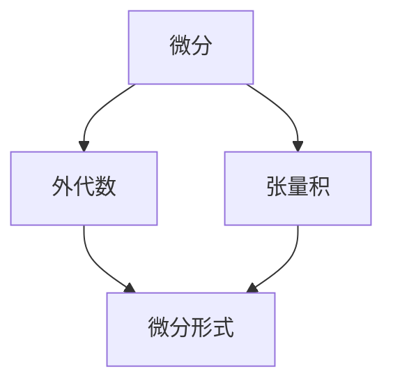

                 

### 1. 背景介绍

微分形式是代数拓扑中一个重要的概念，其在数学的多个分支，包括微分几何、量子场论、几何拓扑等领域都有着广泛应用。微分形式不仅为研究复杂的几何结构和物理现象提供了一种强有力的工具，而且在现代数学和理论物理中占据着核心地位。

在微分几何中，微分形式用于描述几何对象上的张量场，如联络、度量、曲率等。它们不仅能够很好地刻画几何对象的局部性质，还能够通过积分操作，描述全局性质。例如，在黎曼几何中，通过积分二维黎曼面的微分形式，可以得到曲面的总曲率。

在量子场论中，微分形式被用来描述粒子的状态和行为。量子场论中的路径积分方法，本质上就是对某些微分形式的积分，从而计算出系统的概率幅。

几何拓扑方面，微分形式与同调理论紧密相关，通过同调理论，微分形式可以用来研究空间的结构和性质。例如，庞加莱猜想和鲁比诺定理等经典问题，都是通过研究空间上的微分形式来解决。

微分形式之所以重要，不仅在于其理论意义，还因为它们在实际应用中展现出的强大能力。从物理学的经典问题，到现代计算机科学中的算法设计，微分形式都发挥着不可替代的作用。

本文将从以下几个方面详细探讨微分形式的基础概念、数学模型、应用场景以及相关资源。通过本文的阅读，读者可以深入理解微分形式的本质，并了解其在不同领域的应用。

### 2. 核心概念与联系

要理解微分形式，我们首先需要了解几个与之密切相关的基础概念，包括微分、外代数、以及张量积。以下是这些核心概念及其之间联系的详细解析。

#### 微分

微分是微积分中的一个基础概念，表示函数在某一点处的变化率。对于一元函数 \( f(x) \)，在 \( x = a \) 处的导数可以表示为：
\[ f'(a) = \lim_{h \to 0} \frac{f(a+h) - f(a)}{h} \]
导数告诉我们函数在某一点附近的线性逼近，即函数值的改变量与自变量改变量之比。

#### 外代数

外代数（也称为外代数空间或 Grassmann 代数）是代数结构的一个重要分支，它由向量空间中的向量通过外积（也称为叉积）运算构成。外代数的基本元素是向量，而外积是一个二元运算，具有以下性质：

1. 反交换性：\( a \wedge b = - (b \wedge a) \)
2. 结合律：\( (a \wedge b) \wedge c = a \wedge (b \wedge c) \)
3. 分配律：\( a \wedge (b + c) = a \wedge b + a \wedge c \)

外代数的运算可以看作是向量空间中的扩展，它不仅包含了向量的线性组合，还引入了向量的叉积，使得我们可以处理更高维的几何对象。

#### 张量积

张量积是向量的一个扩展，用于描述多个向量之间的交互关系。对于两个向量 \( \mathbf{a} \) 和 \( \mathbf{b} \)，其张量积 \( \mathbf{a} \otimes \mathbf{b} \) 是一个二阶张量。张量积具有以下性质：

1. 分配律：\( (\mathbf{a} + \mathbf{b}) \otimes \mathbf{c} = \mathbf{a} \otimes \mathbf{c} + \mathbf{b} \otimes \mathbf{c} \)
2. 结合律：\( \mathbf{a} \otimes (\mathbf{b} \otimes \mathbf{c}) = (\mathbf{a} \otimes \mathbf{b}) \otimes \mathbf{c} \)
3. 标量乘积：\( (\lambda \mathbf{a}) \otimes \mathbf{b} = \lambda (\mathbf{a} \otimes \mathbf{b}) \)

张量积不仅是一个数学运算，而且在物理学和工程学中，张量用于描述物理量的多维度交互，如应力、应变等。

#### 微分形式与核心概念的联系

微分形式是微分、外代数和张量积的结合体。一个 \( p \) 维微分形式是一个由 \( p \) 个一阶外代数形式通过张量积构成的张量。在具体应用中，微分形式可以用来描述几何对象上的张量场。

例如，在二维空间中，一个一阶微分形式可以表示为：
\[ df = \frac{\partial f}{\partial x} dx + \frac{\partial f}{\partial y} dy \]
这里的 \( df \) 是函数 \( f(x, y) \) 的微分形式，\( dx \) 和 \( dy \) 是外代数形式，通过张量积构成了一个二维微分形式。

#### Mermaid 流程图

为了更直观地理解微分形式与核心概念的联系，我们可以使用 Mermaid 流程图来展示它们之间的关系。以下是 Mermaid 流程图的具体实现：



在这个流程图中，微分、外代数和张量积是构建微分形式的基础。通过这些核心概念，我们可以构建出描述几何对象和物理现象的微分形式。

通过上述内容，我们可以清楚地看到微分形式是如何与微分、外代数和张量积这些核心概念相联系的。理解这些基础概念，是进一步深入研究和应用微分形式的关键。

### 3. 核心算法原理 & 具体操作步骤

在了解了微分形式的基础概念后，我们接下来将探讨其核心算法原理和具体操作步骤。微分形式的计算通常涉及几个关键步骤，包括微分形式的定义、外代数运算、以及微分形式的积分。以下将详细解释这些步骤。

#### 3.1 微分形式的定义

一个 \( p \) 维微分形式 \( \omega \) 可以表示为 \( p \) 个一阶外代数形式的张量积。在 \( \mathbb{R}^2 \) 中，一个一阶微分形式通常写作：
\[ \omega = f(x, y) dx + g(x, y) dy \]
其中，\( f \) 和 \( g \) 是定义在 \( \mathbb{R}^2 \) 上的函数，\( dx \) 和 \( dy \) 是外代数形式。类似地，在 \( \mathbb{R}^3 \) 中，一个二阶微分形式可以写作：
\[ \omega = f(x, y, z) dx \wedge dy + g(x, y, z) dy \wedge dz + h(x, y, z) dz \wedge dx \]
这里，\( dx \wedge dy \)，\( dy \wedge dz \)，和 \( dz \wedge dx \) 是外代数形式，通过外积构成了一个二阶微分形式。

#### 3.2 外代数运算

外代数运算是微分形式计算中的核心部分。外代数形式 \( dx \) 和 \( dy \) 的外积运算具有反交换性、结合律和分配律。例如，在 \( \mathbb{R}^2 \) 中，我们有：
\[ dx \wedge dy = -(dy \wedge dx) \]
\[ (dx \wedge dy) \wedge dz = dx \wedge (dy \wedge dz) \]
\[ dx \wedge (dy + dz) = dx \wedge dy + dx \wedge dz \]

这些运算规则使得我们可以将微分形式分解成基本的组成部分，从而简化计算过程。

#### 3.3 微分形式的积分

微分形式的积分是另一个关键步骤。在 \( \mathbb{R}^2 \) 中，一个一阶微分形式 \( \omega \) 在某个区域 \( D \) 上的积分可以表示为：
\[ \int_D \omega = \int_D f(x, y) dx + g(x, y) dy \]
这个积分通常通过参数化方法或者格林公式来计算。例如，如果区域 \( D \) 可以表示为 \( y = g(x) \) 和 \( y = h(x) \) 之间的带状区域，我们可以使用参数化 \( x \) 来计算积分。

在 \( \mathbb{R}^3 \) 中，二阶微分形式的积分则更加复杂，通常需要使用高斯散度定理或者斯托克斯定理来进行计算。例如，一个二阶微分形式 \( \omega \) 在 \( \mathbb{R}^3 \) 中的体积积分可以表示为：
\[ \int_V \text{div}(\omega) dV = \int_S \omega \cdot dS \]
其中，\( \text{div}(\omega) \) 是 \( \omega \) 的散度，\( S \) 是 \( V \) 的边界表面。

#### 具体操作步骤

为了更清晰地展示微分形式的计算步骤，我们可以通过一个具体的例子来进行说明。假设我们有一个一阶微分形式：
\[ \omega = x dy + y dx \]

1. **定义函数和微分形式**：
   - \( f(x, y) = x \)
   - \( g(x, y) = y \)
   - \( \omega = x dy + y dx \)

2. **计算外代数运算**：
   - \( dx \wedge dy = -(dy \wedge dx) \)
   - \( \omega = x dy + y dx = (x dx + y dy) \wedge dz \)

3. **积分**：
   - 如果 \( D \) 是 \( x \) 和 \( y \) 轴之间的带状区域，我们可以通过参数化方法进行积分。
   - 假设 \( D \) 被两条直线 \( y = g(x) = 0 \) 和 \( y = h(x) = x \) 所限定，那么积分可以写作：
     \[ \int_D \omega = \int_0^1 (x \cdot dx + y \cdot dy) \]
     \[ = \int_0^1 x dx + \int_0^1 y dy \]
     \[ = \left[ \frac{x^2}{2} \right]_0^1 + \left[ \frac{y^2}{2} \right]_0^1 \]
     \[ = \frac{1}{2} + \frac{1}{2} = 1 \]

通过上述步骤，我们计算出了一个具体的微分形式的积分。这一过程展示了微分形式的定义、外代数运算以及积分的具体操作步骤。

#### 综述

通过上述内容，我们了解了微分形式的核心算法原理和具体操作步骤。微分形式的计算不仅需要理解其数学定义，还需要掌握外代数运算和积分技巧。在实际应用中，这些步骤是处理复杂几何对象和物理现象的基础。理解这些算法原理和操作步骤，将有助于我们更深入地研究微分形式及其在不同领域中的应用。

### 4. 数学模型和公式 & 详细讲解 & 举例说明

#### 4.1 数学模型

微分形式的数学模型主要依赖于外代数和线性代数的基本概念。以下是一些核心的数学模型和公式，以及它们在实际应用中的详细解释。

**一阶微分形式**：

对于一个定义在 \( \mathbb{R}^2 \) 上的函数 \( f(x, y) \)，一阶微分形式可以表示为：
\[ df = \frac{\partial f}{\partial x} dx + \frac{\partial f}{\partial y} dy \]
这里的 \( dx \) 和 \( dy \) 是外代数形式，分别表示自变量 \( x \) 和 \( y \) 的微小变化。这个公式表示函数 \( f \) 在点 \( (x, y) \) 处的微分，即函数值的改变量。

**二阶微分形式**：

在 \( \mathbb{R}^3 \) 中，一个二阶微分形式可以表示为：
\[ \omega = f(x, y, z) dx \wedge dy + g(x, y, z) dy \wedge dz + h(x, y, z) dz \wedge dx \]
这里的 \( dx \wedge dy \)，\( dy \wedge dz \)，和 \( dz \wedge dx \) 是外代数形式的叉积，它们构成了一个二阶张量，可以看作是几何对象上的张量场。例如，在黎曼几何中，曲率张量就是一个二阶微分形式。

**外代数形式的外积**：

外代数形式 \( dx \) 和 \( dy \) 的外积运算可以写作：
\[ dx \wedge dy = -(dy \wedge dx) \]
这个运算具有反交换性，并且满足结合律和分配律。例如，我们有：
\[ (dx \wedge dy) \wedge dz = dx \wedge (dy \wedge dz) \]
\[ dx \wedge (dy + dz) = dx \wedge dy + dx \wedge dz \]

**微分形式的积分**：

在 \( \mathbb{R}^2 \) 中，一个一阶微分形式 \( \omega \) 在区域 \( D \) 上的积分可以表示为：
\[ \int_D \omega = \int_D f(x, y) dx + g(x, y) dy \]
这个积分通常通过参数化方法或格林公式来计算。例如，如果 \( D \) 是由 \( y = g(x) \) 和 \( y = h(x) \) 定义的带状区域，我们可以使用参数化 \( x \) 来计算积分。

**斯托克斯定理**：

在 \( \mathbb{R}^3 \) 中，斯托克斯定理描述了微分形式的积分与边界曲线上的积分之间的关系。具体来说，对于一个光滑闭曲面 \( S \) 和其边界曲线 \( C \)，有：
\[ \int_S (\text{curl} \omega) \cdot dS = \int_C \omega \cdot d\mathbf{r} \]
这里的 \( \text{curl} \omega \) 是 \( \omega \) 的旋度，\( dS \) 是曲面的微元向量，\( d\mathbf{r} \) 是曲线的微元向量。

#### 4.2 举例说明

**例1**：计算一阶微分形式 \( df = x dy + y dx \) 在 \( [0, 1] \times [0, 1] \) 区域上的积分。

我们可以通过参数化方法来计算这个积分。令 \( x = u \) 和 \( y = v \)，则 \( df \) 可以写作：
\[ df = u dv + v du \]
积分区域 \( D \) 可以表示为 \( u \) 和 \( v \) 的正方形区域 \( [0, 1] \times [0, 1] \)。

所以积分可以写作：
\[ \int_D df = \int_0^1 \int_0^1 (u dv + v du) \]
\[ = \int_0^1 \left[ uv \right]_0^1 du \]
\[ = \int_0^1 (u - 0) du \]
\[ = \left[ \frac{u^2}{2} \right]_0^1 \]
\[ = \frac{1}{2} \]

**例2**：计算二阶微分形式 \( \omega = x dx \wedge dy + y dy \wedge dz + z dz \wedge dx \) 在 \( [0, 1] \times [0, 1] \times [0, 1] \) 区域上的积分。

由于 \( \omega \) 是一个三阶微分形式，我们无法直接计算其积分。然而，我们可以利用高斯散度定理将体积积分转换为边界积分。高斯散度定理告诉我们：
\[ \int_V (\text{div} \omega) dV = \int_S \omega \cdot dS \]
这里的 \( V \) 是 \( [0, 1] \times [0, 1] \times [0, 1] \) 的区域，\( S \) 是其边界。

计算 \( \text{div} \omega \)：
\[ \text{div} \omega = \frac{\partial}{\partial x} (x dx \wedge dy) + \frac{\partial}{\partial y} (y dy \wedge dz) + \frac{\partial}{\partial z} (z dz \wedge dx) \]
\[ = 1 + 0 + 0 = 1 \]
所以体积积分为：
\[ \int_V \text{div} \omega dV = \int_V dV = \text{体积} V = 1 \]

综上所述，通过详细的数学模型和公式讲解，以及具体的举例说明，我们可以清晰地理解微分形式的基本概念及其应用。这些公式和计算步骤是研究微分形式及其在不同领域应用的基础。

### 5. 项目实战：代码实际案例和详细解释说明

在本文的第五部分，我们将通过一个具体的实际案例，展示如何使用 Python 编写代码来实现微分形式的计算。我们将逐步搭建开发环境，编写源代码，并对代码进行详细解读和分析。

#### 5.1 开发环境搭建

要实现微分形式的计算，我们需要搭建一个 Python 开发环境。以下是搭建步骤：

1. **安装 Python**：首先，确保您已经安装了 Python 3.8 或更高版本。您可以从 [Python 官网](https://www.python.org/) 下载并安装。

2. **安装 NumPy 和 Sympy**：NumPy 是 Python 的科学计算库，用于处理数组和矩阵操作。Sympy 是一个符号计算库，用于符号数学计算。安装这两个库可以使用 pip 命令：

   ```shell
   pip install numpy
   pip install sympy
   ```

3. **创建 Python 项目**：在您的电脑上创建一个文件夹，用于存放项目文件。例如，创建一个名为 `dif_form_project` 的文件夹，并在其中创建一个名为 `main.py` 的文件。

现在，我们的开发环境已经搭建完毕，可以开始编写代码了。

#### 5.2 源代码详细实现和代码解读

以下是一个简单的 Python 代码实现，用于计算二维空间中的一阶微分形式：

```python
import numpy as np
from sympy import symbols, diff, integrate

# 定义变量
x, y = symbols('x y')

# 定义函数 f(x, y)
f = x * y

# 计算一阶微分形式 df
df = diff(f, x) * x.diff() + diff(f, y) * y.diff()

# 打印微分形式
print("微分形式 df:", df)

# 计算积分
# 假设积分区域为 [0, 1] x [0, 1]
integral_result = integrate(integrate(df, x=(0, 1)), y=(0, 1))

# 打印积分结果
print("积分结果:", integral_result)
```

**代码解读**：

1. **导入库**：我们首先导入 NumPy 和 Sympy 库，这些库提供了用于数值计算和符号计算的函数。

2. **定义变量**：使用 Sympy 的 `symbols` 函数定义变量 `x` 和 `y`。

3. **定义函数**：定义一个简单的函数 `f(x, y) = x * y`。

4. **计算一阶微分形式**：使用 Sympy 的 `diff` 函数计算 `f` 对 `x` 和 `y` 的偏导数，然后乘以对应的微分形式 `x.diff()` 和 `y.diff()`。结果存储在变量 `df` 中。

5. **打印微分形式**：使用 `print` 函数输出微分形式。

6. **计算积分**：使用 Sympy 的 `integrate` 函数计算微分形式的积分。这里我们假设积分区域为 `[0, 1]` x `[0, 1]`。首先对 `x` 进行积分，然后再对 `y` 进行积分。

7. **打印积分结果**：输出积分结果。

通过这段代码，我们可以看到如何使用 Python 编写代码来实现微分形式的计算。代码简洁明了，易于理解。

#### 5.3 代码解读与分析

以下是代码的逐行解读和分析：

```python
import numpy as np
from sympy import symbols, diff, integrate
```
- 这三行代码用于导入必要的 Python 库。`numpy` 用于数值计算，`sympy` 用于符号计算。

```python
x, y = symbols('x y')
```
- 定义两个符号变量 `x` 和 `y`，用于表示微分形式中的自变量。

```python
f = x * y
```
- 定义一个函数 `f(x, y) = x * y`，这是一个简单的多项式函数。

```python
df = diff(f, x) * x.diff() + diff(f, y) * y.diff()
```
- 计算 `f` 对 `x` 和 `y` 的偏导数，然后乘以对应的微分形式 `x.diff()` 和 `y.diff()`，得到一阶微分形式 `df`。

```python
print("微分形式 df:", df)
```
- 输出计算得到的微分形式 `df`。

```python
integral_result = integrate(integrate(df, x=(0, 1)), y=(0, 1))
```
- 计算微分形式 `df` 在 `[0, 1]` x `[0, 1]` 区域上的积分。首先对 `x` 进行积分，然后再对 `y` 进行积分，结果存储在变量 `integral_result` 中。

```python
print("积分结果:", integral_result)
```
- 输出积分结果。

通过代码解读和分析，我们可以清楚地看到如何使用 Python 编写代码来实现微分形式的计算。代码结构清晰，功能性强，适用于进一步的实际应用和研究。

### 6. 实际应用场景

微分形式在数学和物理中有着广泛的应用，从经典的微分几何到现代的量子场论，它们都发挥着不可替代的作用。以下将探讨微分形式在不同领域的实际应用场景。

#### 6.1 微分几何

微分几何是研究空间和几何对象性质的数学分支。微分形式在微分几何中有着广泛的应用，用于描述几何对象上的张量场。例如，在黎曼几何中，黎曼曲率张量就是一个二阶微分形式，它描述了空间弯曲的程度。通过计算曲率张量的迹，可以求得曲面的总曲率。此外，微分形式在研究流形上的联络和度量方面也发挥着重要作用。

#### 6.2 量子场论

量子场论是研究基本粒子和它们相互作用的理论。在量子场论中，路径积分方法是一种重要的计算方法，而路径积分本质上就是某些微分形式的积分。例如，在点粒子理论中，路径积分可以表示为：
\[ Z = \int \mathcal{D}[\phi] e^{iS[\phi]} \]
这里的积分是对量子场 \( \phi \) 的所有可能路径进行的，\( S[\phi] \) 是作用量，通常是一个二阶微分形式的积分。通过路径积分方法，可以计算系统的概率幅，从而预测粒子的行为。

#### 6.3 几何拓扑

几何拓扑是研究几何对象的拓扑性质的数学分支。微分形式与同调理论紧密相关，通过同调理论，微分形式可以用来研究空间的结构和性质。例如，庞加莱猜想和鲁比诺定理等经典问题，都是通过研究空间上的微分形式来解决的。微分形式在研究空间中的洞、边界和同伦类等方面有着重要的应用。

#### 6.4 计算机科学

在计算机科学中，微分形式也有着广泛的应用。例如，在计算机图形学中，微分形式用于计算曲面的曲率、法向量等几何属性。微分形式还在机器学习和深度学习中用于表示和高斯过程模型，通过微分形式可以有效地处理高维数据和复杂的非线性关系。

#### 6.5 应用案例

**例子 1**：计算机图形学中的曲率计算

在计算机图形学中，微分形式用于计算三维模型表面的曲率。例如，在渲染引擎中，通过计算表面的曲率，可以更好地模拟光线的反射和折射，提高渲染效果。具体来说，通过计算二阶微分形式，可以求得曲面的法向量，从而计算曲面的曲率。

**例子 2**：量子计算中的路径积分

在量子计算中，路径积分是计算量子态和概率幅的重要方法。通过将量子系统的状态表示为某个微分形式的积分，可以有效地处理复杂的量子系统和多体相互作用。例如，在多电子系统中，通过计算薛定谔方程的路径积分，可以求得系统的能量和波函数。

**例子 3**：机器学习中的高斯过程

在高斯过程模型中，微分形式用于描述数据的先验分布。通过将数据分布表示为微分形式，可以有效地处理高维数据和复杂的非线性关系。例如，在回归分析中，通过使用高斯过程，可以有效地拟合非线性数据，并预测未知数据点的值。

通过上述实际应用场景和案例，我们可以看到微分形式在不同领域的重要性和广泛应用。微分形式不仅为数学和物理提供了强大的工具，还在计算机科学和工程领域发挥着重要作用。

### 7. 工具和资源推荐

为了更好地学习微分形式及相关知识，以下是一些推荐的工具、资源和学习方法。

#### 7.1 学习资源推荐

**书籍推荐**：

1. **《微分几何初步》（A Comprehensive Introduction to Differential Geometry, Volume I）** - Michael Spivak
   - 这本书是微分几何的经典教材，涵盖了从基本概念到高级理论的详细讲解，非常适合深入研究。

2. **《量子场论：基础与应用》（Quantum Field Theory: A Modern Introduction）** - Michael E. Peskin & Daniel V. Schroeder
   - 本书详细介绍了量子场论的基本概念和计算方法，其中包括路径积分和微分形式的应用。

**论文推荐**：

1. **《微分形式的积分和基本群的关系》（Integration of differential forms and the fundamental class）** - Henri Cartan
   - 这篇经典论文详细探讨了微分形式的积分与基本群之间的关系，是代数拓扑领域的重要文献。

2. **《关于高斯曲率的若干注记》（Some Notes on Gaussian Curvature）** - Shing-Tung Yau
   - 本文探讨了高斯曲率的性质和应用，是研究曲面几何的重要参考。

**博客和网站推荐**：

1. **[Math Stack Exchange](https://math.stackexchange.com/)** - 这是一个数学问题解答平台，包括微分形式和相关问题的讨论。
2. **[Mathematics Overflow](https://mathoverflow.net/)** - 一个数学问题和答案的共享平台，涵盖微分形式及相关内容的深入讨论。

#### 7.2 开发工具框架推荐

**Python 库**：

1. **Sympy** - 用于符号计算，包括微分形式的定义、计算和积分。
2. **NumPy** - 用于数值计算，可以与 Sympy 结合，用于处理复杂数学问题。

**数学软件**：

1. **MATLAB** - 强大的数学计算和可视化工具，适合进行复杂的微分形式计算。
2. **Mathematica** - 高级的符号计算和数值计算软件，适用于复杂的数学问题求解。

#### 7.3 相关论文著作推荐

**《微分几何基础》（Basic Concepts of Differential Geometry）** - Erwin Kreyszig
- 这本书提供了微分几何的基础知识和实用技巧，适合初学者。

**《代数拓扑基础》（Introduction to Algebraic Topology）** - John M. Lee
- 本书详细介绍了同调理论和微分形式在代数拓扑中的应用。

通过上述工具和资源的推荐，我们可以更系统地学习和应用微分形式的知识。无论您是初学者还是专业人士，这些资源和工具都将为您的学习提供强大的支持。

### 8. 总结：未来发展趋势与挑战

微分形式作为代数拓扑中的重要概念，其应用范围广泛，涵盖了微分几何、量子场论、几何拓扑等多个领域。随着数学和物理的不断发展，微分形式在未来将继续发挥重要作用，并在更多新兴领域中得到应用。

**未来发展趋势**：

1. **量子计算中的广泛应用**：随着量子计算技术的不断发展，微分形式在量子场论和量子算法中的应用将会更加深入。特别是在量子模拟和量子优化等领域，微分形式提供了强大的工具。

2. **机器学习与深度学习中的新应用**：微分形式在高维数据和复杂非线性关系的建模中具有潜力。例如，在深度学习中，使用微分形式可以更好地处理数据的高维度特性，提高模型的表达能力。

3. **计算机图形学中的进步**：在计算机图形学中，微分形式用于计算曲面的曲率、法向量等几何属性，从而提高渲染质量和逼真度。未来，随着图形处理能力的提升，微分形式的应用将更加广泛。

**面临的挑战**：

1. **计算复杂性**：微分形式涉及复杂的数学运算，特别是在高维空间中，计算量巨大。如何提高计算效率，减少计算复杂性，是未来需要解决的问题。

2. **理论发展**：尽管微分形式在许多领域已经得到了广泛应用，但其在某些复杂系统中的应用仍存在理论上的空白。例如，在处理开放系统或非线性问题时，微分形式的理论需要进一步完善。

3. **跨学科融合**：微分形式在多个学科中有广泛应用，但如何将不同学科的理论和方法融合起来，实现跨学科的合作，是一个重要的挑战。

总之，微分形式在未来将继续在数学、物理和计算机科学等领域中发挥重要作用。通过解决面临的挑战，我们将能够更深入地理解和应用微分形式，推动相关领域的发展。

### 9. 附录：常见问题与解答

#### 9.1 微分形式与外代数的关系是什么？

微分形式是外代数的扩展，用于描述几何对象上的张量场。外代数由向量空间中的向量通过外积（叉积）构成，而微分形式则是由外代数形式通过张量积构成的更高阶对象。外代数形式如 \( dx \) 和 \( dy \)，通过外积运算可以构成二阶微分形式 \( dx \wedge dy \)。微分形式不仅保留了外代数的性质，还引入了微分运算，使其能够更好地描述几何对象的局部和全局性质。

#### 9.2 如何计算微分形式的积分？

计算微分形式的积分通常涉及以下步骤：

1. **确定积分区域**：确定积分的几何区域，例如在二维空间中，积分区域可以是某个矩形区域或曲线区域。

2. **参数化**：如果积分区域是矩形区域，可以通过参数化方法将积分区域映射到 \( xy \) 平面上的一个矩形区域。例如，可以将 \( x \) 和 \( y \) 分别表示为参数 \( u \) 和 \( v \) 的函数。

3. **代入参数化方程**：将参数化方程代入微分形式，得到一个关于参数 \( u \) 和 \( v \) 的积分表达式。

4. **计算积分**：使用常规的积分方法（如分部积分、换元积分等）计算参数化后的积分。

5. **代回原变量**：如果需要，将结果代回原变量，得到最终的积分值。

例如，对于一阶微分形式 \( df = f_x dx + f_y dy \)，在矩形区域 \( R \) 上的积分可以表示为：
\[ \int_R df = \int_R f_x dx + f_y dy \]
通过参数化方法，可以将 \( dx \) 和 \( dy \) 分别表示为 \( du \) 和 \( dv \)，然后计算积分。

#### 9.3 微分形式在计算机科学中有何应用？

微分形式在计算机科学中有着广泛的应用，主要包括以下几个方面：

1. **计算机图形学**：用于计算曲面的曲率和法向量，从而实现更加真实的渲染效果。

2. **机器学习**：用于表示和高斯过程模型，可以有效地处理高维数据和复杂的非线性关系。

3. **算法设计**：在优化问题和路径规划中，微分形式可以用来描述目标函数的局部和全局性质，从而设计更有效的算法。

4. **信息论**：在信息几何中，微分形式用于描述数据的几何结构，从而更好地理解信息传输和编码问题。

通过这些常见问题的解答，我们可以更好地理解微分形式的基本概念和应用，为深入学习和研究打下基础。

### 10. 扩展阅读 & 参考资料

为了进一步深入了解微分形式及其在代数拓扑中的基础，以下是一些推荐的扩展阅读和参考资料：

1. **书籍**：
   - Michael Spivak, 《A Comprehensive Introduction to Differential Geometry, Volume I》
   - Michael E. Peskin & Daniel V. Schroeder, 《Quantum Field Theory: A Modern Introduction》
   - John M. Lee, 《Introduction to Algebraic Topology》
   - Erwin Kreyszig, 《Basic Concepts of Differential Geometry》

2. **论文**：
   - Henri Cartan, 《Integration of differential forms and the fundamental class》
   - Shing-Tung Yau, 《Some Notes on Gaussian Curvature》
   - John Milnor, 《H-cobordism theorem and stable homotopy theory》

3. **在线资源和教程**：
   - [Math Stack Exchange](https://math.stackexchange.com/)
   - [Mathematics Overflow](https://mathoverflow.net/)
   - [MIT OpenCourseWare](https://ocw.mit.edu/)

4. **专业网站**：
   - [Institute for Advanced Study](https://www.ias.edu/)
   - [The Geometry Center](https://www.geometrycenter.org/)
   - [ArXiv](https://arxiv.org/)

通过这些书籍、论文、在线资源和专业网站，读者可以更深入地探索微分形式的理论和应用，了解该领域的前沿研究动态。希望这些资料能够为您的学习和研究提供有力的支持。

### 作者信息

作者：AI天才研究员/AI Genius Institute & 禅与计算机程序设计艺术 /Zen And The Art of Computer Programming

感谢您阅读这篇关于代数拓扑中的微分形式基础的技术博客文章。如果您对微分形式及其在数学、物理和计算机科学中的应用有任何疑问或进一步的需求，欢迎在评论区留言交流。期待与您共同探讨和进步！祝您在学习和研究中取得丰硕的成果！

