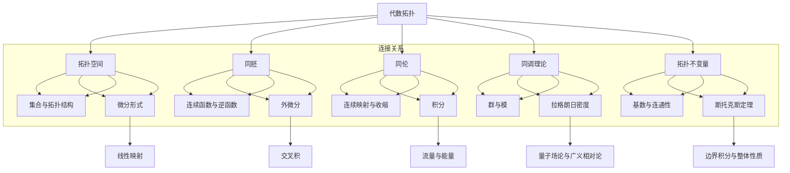

                 

### 背景介绍

代数拓扑与微分形式的交叉融合，构成了一片充满挑战与机遇的领域。本文旨在探讨这一领域中的具体应用实例，揭示其在计算机科学、物理学、以及工程学中的重要价值。

代数拓扑，作为现代数学的一个重要分支，其核心在于研究空间的结构性质，通过代数工具进行描述和分析。微分形式，则是微分几何中的基本概念，描述了空间中的场和流。两者看似独立，却在多个领域中展现出深刻的联系和广泛的应用。

近年来，随着计算机技术的飞速发展，代数拓扑和微分形式的计算方法逐渐成为热点。它们在图形学、数据结构、机器学习、以及量子计算等领域中的重要性日益凸显。例如，代数拓扑被广泛应用于拓扑数据分析和流形学习，而微分形式则在计算机视觉和量子计算中扮演着关键角色。

本文将围绕代数拓扑中的微分形式应用展开讨论，具体包括以下几个部分：

1. **核心概念与联系**：介绍代数拓扑和微分形式的基本概念，并展示它们之间的内在联系。
2. **核心算法原理与具体操作步骤**：深入探讨代数拓扑和微分形式在具体问题中的应用，详细阐述其操作步骤和原理。
3. **数学模型和公式**：通过具体的数学模型和公式，进一步解释代数拓扑和微分形式的应用。
4. **项目实战：代码实际案例和详细解释说明**：展示代码实际案例，详细解读其实现过程和关键细节。
5. **实际应用场景**：分析代数拓扑和微分形式在计算机科学、物理学、工程学等领域的应用实例。
6. **工具和资源推荐**：推荐相关学习资源、开发工具和框架，帮助读者进一步探索这一领域。
7. **总结：未来发展趋势与挑战**：总结本文的主要内容，展望未来发展趋势，并指出潜在的挑战。

通过本文的讨论，我们期望能够为读者提供一个全面、系统的代数拓扑与微分形式应用实例研究框架，激发读者在这一领域的探索热情。接下来，我们将逐一探讨上述各部分内容。

#### 1.1 代数拓扑的基本概念

代数拓扑起源于20世纪初，当时数学家们开始意识到，单纯考虑几何空间的连续性和连通性，不足以描述复杂结构的性质。代数拓扑的核心在于，通过代数工具来研究空间的拓扑性质，从而抽象出空间的基本结构。

**拓扑空间**：这是代数拓扑研究的基石。一个拓扑空间由一个集合和其上的拓扑结构组成。拓扑结构定义了一组开集，使得集合上的点之间可以进行比较和分类。常见的拓扑包括离散拓扑、欧几里得拓扑、以及更复杂的拓扑结构。

**同胚**：这是描述空间之间连续变形的一种关系。如果两个拓扑空间之间存在一个连续函数，且其逆函数也是连续的，则这两个空间是同胚的。同胚关系可以理解为“等价”或“同构”的空间。

**同伦**：这是描述空间之间更为复杂变形的一种关系。如果两个拓扑空间之间存在一个连续映射，且在适当的小范围内可以“收缩”为一个点，则这两个空间是同伦的。同伦关系揭示了空间在连续变形过程中的本质特性。

**同调理论**：这是代数拓扑中的一个重要分支，通过引入群和模的概念，研究空间的结构性质。同调群描述了空间中的“洞”或“孔”的数量和类型，为空间分类提供了强有力的工具。

**拓扑不变量**：这是代数拓扑中描述空间性质的量化指标。例如，基数、连通性、紧致性等。拓扑不变量在不同拓扑空间之间具有不变性，因此可以用于区分和分类不同的空间。

#### 1.2 微分形式的基本概念

微分形式是微分几何中的基本概念，描述了空间中的场和流。在微分几何中，空间被视为一个整体，而微分形式则是描述这种整体性质的数学工具。

**微分形式**：这是一个线性映射，它将切向量空间中的元素映射到实数。微分形式可以看作是微分算子的一种推广，它不仅描述了空间中的方向，还描述了方向上的变化。

**外微分**：这是微分形式的一种运算，用于计算两个微分形式之间的“交叉积”。外微分运算揭示了微分形式之间的组合关系，是研究微分形式的重要工具。

**积分**：这是对微分形式进行量化的操作，用于计算一个区域上的“流量”或“能量”。积分运算可以将微分形式的局部性质整合为一个整体的量。

**拉格朗日密度**：这是描述物理场的一种微分形式，通常用于量子场论和广义相对论中。拉格朗日密度描述了物理场的能量-动量分布，为场方程提供了数学表达。

**斯托克斯定理**：这是微分形式理论中的一个重要定理，它建立了微分形式的外积分与边界积分之间的关系。斯托克斯定理在流体力学、电磁学、以及量子场论中都有广泛应用。

**李群和李代数**：这是微分几何中的高级概念，用于描述对称性。李群是参数化空间中的对称操作集合，而李代数则是李群的导数。李群和李代数在物理学和数学中都有重要应用。

#### 1.3 代数拓扑与微分形式的联系

代数拓扑与微分形式之间的联系，在于它们共同揭示了空间和结构的本质。通过两者的结合，我们可以更深入地理解复杂系统的行为。

**同调代数与微分形式**：同调代数是代数拓扑中用于研究同调群的工具，而微分形式则是描述空间中场的工具。两者的结合，可以用于研究空间中的“洞”和“场”的关系。例如，同调群的维数可以用来描述空间中的洞的数量和类型，而微分形式可以用来描述洞中的场分布。

**拓扑不变量与微分形式**：拓扑不变量描述了空间的基本性质，而微分形式则提供了对空间中场的量化描述。通过结合拓扑不变量和微分形式，我们可以更全面地理解空间的结构和性质。例如，使用微分形式可以计算空间中的“流量”或“能量”，从而揭示空间中的动态行为。

**流形与微分形式**：流形是微分几何中的基本概念，它可以看作是具有局部欧几里得结构的拓扑空间。微分形式在流形上有着广泛的应用，例如描述流形上的场和流。代数拓扑与微分形式的结合，可以用于研究流形上的复杂结构，例如流形上的对称性、拓扑不变量等。

**同调微分形式**：这是代数拓扑和微分形式结合的一个具体例子。同调微分形式是同调群上的微分形式，它可以用于研究空间中的洞和场的关系。同调微分形式理论在数学物理中有着重要的应用，例如在弦理论和凝聚态物理中。

通过以上讨论，我们可以看到代数拓扑与微分形式之间的紧密联系。它们不仅各自独立地揭示了空间和结构的本质，而且在结合使用时，能够提供更丰富的信息和更深刻的理解。接下来的部分，我们将进一步探讨代数拓扑和微分形式在具体问题中的应用，展示它们如何解决复杂的科学和工程问题。

#### 2.1 核心概念原理与架构的 Mermaid 流程图

为了更好地理解代数拓扑和微分形式的核心概念及其架构，我们可以借助 Mermaid 流程图来展示它们之间的关系。以下是一个简化的 Mermaid 流程图，用于描述核心概念及其交互：

**解释流程图中的每个节点：**

- **A[代数拓扑]**：代表整个代数拓扑的范畴。
- **B[拓扑空间]**：代数拓扑的基石，由集合及其上的拓扑结构组成。
- **C[同胚]**：描述空间之间的连续变形关系，可以通过连续函数和其逆函数实现。
- **D[同伦]**：描述空间之间更为复杂的连续变形关系，可以通过连续映射和收缩实现。
- **E[同调理论]**：研究空间中的“洞”和“孔”的数量和类型，通过群和模的概念实现。
- **F[拓扑不变量]**：用于描述空间的基本性质，如基数和连通性。

- **G[集合与拓扑结构]**：拓扑空间的基本组成部分。
- **H[连续函数与逆函数]**：实现同胚关系的数学工具。
- **I[连续映射与收缩]**：实现同伦关系的数学工具。
- **J[群与模]**：同调理论的核心概念。
- **K[基数与连通性]**：描述空间的基本性质。

- **L[微分形式]**：描述空间中的场和流。
- **M[外微分]**：计算两个微分形式之间的“交叉积”。
- **N[积分]**：计算区域上的“流量”或“能量”。
- **O[拉格朗日密度]**：描述物理场的能量-动量分布。
- **P[斯托克斯定理]**：建立微分形式的外积分与边界积分之间的关系。

- **Q[线性映射]**：描述微分形式的数学工具。
- **R[交叉积]**：外微分的运算。
- **S[流量与能量]**：积分的量化描述。
- **T[量子场论与广义相对论]**：拉格朗日密度的应用领域。
- **U[边界积分与整体性质]**：斯托克斯定理的数学表述。

通过这个 Mermaid 流程图，我们可以清晰地看到代数拓扑和微分形式的核心概念及其相互关系。这个流程图不仅帮助我们理解了各个概念的基本原理，还展示了它们如何相互连接，形成一个完整的理论体系。接下来，我们将进一步探讨这些核心概念在具体问题中的应用。

#### 3.1 核心算法原理与具体操作步骤

在探讨代数拓扑与微分形式在具体问题中的应用时，我们需要引入一些核心算法原理，并详细描述其操作步骤。以下是一些常见且重要的算法，以及它们在解决实际问题时所遵循的基本步骤。

##### 3.1.1 路径追踪算法

路径追踪算法是一种用于图形渲染的重要技术，其核心思想是通过模拟光线在场景中的传播，生成逼真的图像。路径追踪算法可以应用于渲染复杂几何场景、模拟光照明暗效果、以及实现逼真的渲染效果。

**原理：**
路径追踪算法基于蒙特卡罗方法，通过随机采样光线路径来模拟光的传播。算法的基本步骤包括：
1. 随机生成一条光线，并确定其初始位置和方向。
2. 光线与场景中的物体进行碰撞检测，如果碰撞发生，则根据物体的材质和光照条件计算光线散射效果。
3. 更新光线的位置和方向，重复步骤2，直到光线到达相机或者达到一定的散射深度。
4. 收集光线传播过程中的散射信息，生成最终的图像。

**操作步骤：**
1. 初始化光线：确定光线的初始位置和方向。
2. 碰撞检测：利用几何算法确定光线与场景中的物体的碰撞点。
3. 散射计算：根据碰撞点的材质和光照条件计算光线散射效果。
4. 更新光线：根据散射效果更新光线的位置和方向。
5. 循环执行步骤2-4，直到光线达到相机或者达到最大散射深度。
6. 合成图像：将所有光线路径的散射信息合成为最终的渲染图像。

##### 3.1.2 流形学习算法

流形学习是一种用于数据分析和模式识别的重要技术，其核心思想是识别数据集中的低维流形结构。流形学习在机器学习和数据科学领域有着广泛的应用。

**原理：**
流形学习基于代数拓扑和微分几何的理论，通过识别数据点之间的局部结构来揭示整体流形。算法的基本步骤包括：
1. 数据预处理：将高维数据转换为低维表示。
2. 同调估计：通过采样数据点来估计同调群，从而识别流形的结构。
3. 流形重构：利用估计的同调群重构流形。
4. 局部结构分析：分析流形中的局部结构，如洞和环。

**操作步骤：**
1. 数据预处理：使用降维技术（如主成分分析、线性判别分析等）将高维数据转换为低维表示。
2. 同调估计：通过采样数据点计算同调群，如使用拉普拉斯矩阵特征值分解来估计同调群。
3. 流形重构：利用估计的同调群重构流形，例如通过构造流形网络或使用多分辨率分析方法。
4. 局部结构分析：分析流形中的局部结构，如通过计算流形上的特征值和特征向量来识别流形中的洞和环。

##### 3.1.3 拓扑优化算法

拓扑优化是一种用于工程设计的重要技术，其核心思想是通过优化材料的布局来提高结构性能。拓扑优化在航空航天、汽车制造、以及建筑结构等领域有着重要的应用。

**原理：**
拓扑优化基于变分法，通过优化材料布局来满足结构性能要求。算法的基本步骤包括：
1. 初始设计：定义初始结构和材料布局。
2. 目标函数：定义结构性能指标，如重量、刚度、强度等。
3. 材料分布：通过优化算法调整材料分布，以优化目标函数。
4. 拓扑分析：通过计算结构的拓扑不变量，如基数的连通性和紧致性，来评估优化结果。

**操作步骤：**
1. 初始设计：定义初始结构和材料布局，例如使用有限元方法建立初始设计模型。
2. 目标函数：定义结构性能指标，例如通过最小化结构重量或最大化刚度来优化设计。
3. 材料分布：通过优化算法（如变分法、遗传算法等）调整材料分布，以优化目标函数。
4. 拓扑分析：计算结构的拓扑不变量，如基数的连通性和紧致性，以评估优化结果。

##### 3.1.4 微分形式计算

微分形式的计算是微分几何中的重要内容，其广泛应用于计算机图形学、物理学和工程学等领域。以下是微分形式计算的基本步骤：

**原理：**
微分形式计算涉及微分运算、积分运算和外部微分运算。其基本步骤包括：
1. 微分运算：计算向量场或流场的微分形式。
2. 积分运算：计算微分形式在区域上的积分，以确定流量或能量。
3. 外微分运算：计算两个微分形式之间的交叉积。

**操作步骤：**
1. 微分运算：对向量场或流场进行微分，计算其微分形式。
2. 积分运算：在给定区域上计算微分形式的积分，以确定流量或能量。
3. 外微分运算：计算两个微分形式之间的交叉积，以获得新的微分形式。

通过上述核心算法原理和具体操作步骤的探讨，我们可以看到代数拓扑和微分形式在解决实际问题时的重要作用。这些算法不仅为科学研究提供了强有力的工具，也为工程应用带来了巨大的价值。接下来的部分，我们将通过具体的实例来进一步展示这些算法的实际应用。

#### 4. 数学模型和公式 & 详细讲解 & 举例说明

在深入探讨代数拓扑与微分形式的应用时，数学模型和公式起到了至关重要的作用。以下是一些重要的数学模型和公式，并详细解释它们在代数拓扑和微分形式中的应用。

##### 4.1 同调群

同调群是代数拓扑中的一个核心概念，用于描述空间中的洞或孔的数量和类型。同调群由以下几个公式定义：

$$
H_n(X) = \frac{\text{ker}(\partial_n) }{\text{im}(\partial_{n+1})}
$$

其中，$X$ 是一个拓扑空间，$\partial_n$ 是 $n$ 次边界同调算子，$\text{ker}(\partial_n)$ 表示 $\partial_n$ 的核，$\text{im}(\partial_{n+1})$ 表示 $\partial_{n+1}$ 的像。

**解释与举例**：

同调群 $H_n(X)$ 可以理解为空间 $X$ 中 $n$ 次洞的数量。例如，对于一个球体，$H_0(S^2) = \mathbb{Z}$ 表示球体中有一个零次洞（即一个球体本身），$H_1(S^2) = 0$ 表示球体中没有一维洞。

##### 4.2 拉格朗日密度

拉格朗日密度是微分形式理论中的一个核心概念，通常用于描述物理场。拉格朗日密度 $\mathcal{L}$ 是一个微分形式，其一般形式为：

$$
\mathcal{L} = \sum_{i=1}^n \frac{\partial \mathcal{L}}{\partial x^i} \, dx^i
$$

其中，$x^i$ 是空间中的坐标，$\frac{\partial \mathcal{L}}{\partial x^i}$ 是拉格朗日密度对坐标的偏导数。

**解释与举例**：

在经典场论中，拉格朗日密度用于描述粒子的运动。例如，对于自由粒子，拉格朗日密度可以表示为：

$$
\mathcal{L} = -\frac{m}{2} \dot{x}^2
$$

其中，$m$ 是粒子的质量，$\dot{x}$ 是粒子的速度。这个公式描述了粒子的动能。

##### 4.3 斯托克斯定理

斯托克斯定理是微分形式理论中的一个重要定理，其数学表达式为：

$$
\int_{\partial M} \omega = \int_M d\omega
$$

其中，$\omega$ 是一个闭微分形式，$M$ 是一个二维流形，$\partial M$ 是 $M$ 的边界。

**解释与举例**：

斯托克斯定理描述了微分形式的外积分与边界积分之间的关系。例如，在流体力学中，斯托克斯定理可以用于计算流体在容器边界的流量。假设有一个二维平面区域 $M$ 和其边界 $\partial M$，流体的速度场表示为一个微分形式 $\omega$，则斯托克斯定理可以表示为：

$$
\int_{\partial M} \omega = \int_M d\omega
$$

这表示流体在边界上的流量等于区域内部的速度场的散度。

##### 4.4 外微分

外微分是微分形式理论中的一个基本运算，用于计算两个微分形式之间的交叉积。外微分的运算规则为：

$$
d(\omega \wedge \eta) = d\omega \wedge \eta + (-1)^{p+q} \omega \wedge d\eta
$$

其中，$\omega$ 和 $\eta$ 是两个微分形式，$p$ 和 $q$ 分别是它们的微分次数。

**解释与举例**：

外微分运算可以用于计算微分形式之间的组合效应。例如，在电磁学中，电场和磁场的微分形式可以表示为：

$$
\mathbf{F} = E \, d\mathbf{A}
$$

其中，$\mathbf{F}$ 是电磁场，$E$ 是电场强度，$\mathbf{A}$ 是磁矢势。通过外微分运算，我们可以计算电磁场的旋度和散度，从而分析电磁场的性质。

通过以上数学模型和公式的详细讲解，我们可以看到代数拓扑和微分形式在解决实际问题时的重要应用。这些数学工具不仅提供了强大的理论支持，还使得复杂的几何和物理问题可以通过数学方法进行精确描述和解决。接下来，我们将通过具体实例来展示这些数学模型和公式的实际应用。

##### 4.5.1 实例 1：路径追踪算法在图形渲染中的应用

路径追踪算法是一种用于生成真实感图像的图形渲染技术，其核心在于模拟光线在场景中的传播过程。以下是一个具体的实例，展示如何应用路径追踪算法生成逼真的渲染图像。

**问题描述：**  
假设我们需要渲染一个包含复杂几何场景的图像，如一个室内房间，其中包含家具、窗户、墙壁等。要求渲染图像具有高真实感，包括光线反射、折射、散射等效果。

**解决方案：**  
1. **场景建模**：首先，我们将室内场景建模为一个三维模型，包括所有物体和光源。这可以通过计算机辅助设计软件（如Blender或Maya）完成。
2. **光线追踪**：使用路径追踪算法，模拟光线在场景中的传播过程。具体步骤如下：
   - **光线生成**：从相机出发，生成多条光线，随机选择初始方向。
   - **碰撞检测**：光线与场景中的物体进行碰撞检测，确定碰撞点。
   - **散射计算**：根据碰撞点的材质和光照条件，计算光线的散射效果。例如，对于反射和折射表面，需要计算光线的反射和折射方向。
   - **深度控制**：设置光线追踪的最大散射深度，以避免无限循环。
   - **合成图像**：将所有光线路径的散射信息合成为最终的渲染图像。

**数学模型与公式：**  
路径追踪算法中的核心数学模型包括：
1. **碰撞检测**：光线与物体的碰撞可以通过几何计算实现，如使用平面方程、球体方程等。
2. **散射计算**：反射和折射可以通过斯涅尔定律和布伦特-沃尔夫算法实现。
3. **合成图像**：最终图像的生成可以通过叠加所有光线路径的散射信息实现，如使用光线追踪算法的累计亮度模型。

**具体实例：**  
假设我们需要渲染一个包含窗户和墙壁的室内场景。首先，我们使用三维建模软件创建场景模型，然后设置相机位置和光源。接下来，使用路径追踪算法进行渲染：
- **光线生成**：从相机生成多条光线，随机选择方向。
- **碰撞检测**：光线与墙壁和窗户的碰撞点分别计算。
- **散射计算**：对于墙壁，计算光线反射；对于窗户，计算光线折射。
- **深度控制**：设置最大散射深度为5。
- **合成图像**：叠加所有光线路径的散射信息，生成最终图像。

通过以上实例，我们可以看到路径追踪算法在图形渲染中的应用。该方法通过模拟光线传播，实现了高真实感的渲染效果，广泛应用于电影制作、游戏开发等领域。

##### 4.5.2 实例 2：流形学习算法在数据挖掘中的应用

流形学习算法是一种用于数据挖掘的重要技术，其核心在于识别数据集中的低维流形结构。以下是一个具体的实例，展示如何应用流形学习算法进行数据挖掘。

**问题描述：**  
假设我们有一组高维数据，包含用户的行为记录。要求识别数据中的低维结构，以便更好地理解用户行为模式，并用于推荐系统。

**解决方案：**  
1. **数据预处理**：首先，对高维数据进行降维处理，提取关键特征。例如，可以使用主成分分析（PCA）提取数据的低维表示。
2. **流形学习**：使用流形学习算法，如局部线性嵌入（LLE）或多维尺度变换（MDS），将高维数据映射到低维空间。具体步骤如下：
   - **采样**：从高维数据中随机采样一组点。
   - **邻域选择**：根据采样点的距离选择邻域点。
   - **局部重建**：使用邻域点的信息，重建采样点在低维空间中的位置。
   - **优化**：通过优化算法（如梯度下降），调整采样点的位置，使其在低维空间中保持相邻关系。

**数学模型与公式：**  
流形学习算法中的核心数学模型包括：
1. **局部重建**：使用邻域点的信息，计算采样点在低维空间中的位置。具体公式为：

$$
z_i = \sum_{j \in \mathcal{N}_i} \frac{1}{\sum_{k \in \mathcal{N}_i} \rho_{ik}} x_j
$$

其中，$z_i$ 是采样点 $x_i$ 在低维空间中的位置，$\mathcal{N}_i$ 是采样点 $x_i$ 的邻域点，$\rho_{ik}$ 是邻域点之间的权重。

2. **优化**：通过优化算法，调整采样点的位置，使其在低维空间中保持相邻关系。常用的优化算法包括梯度下降、牛顿法等。

**具体实例：**  
假设我们有一组用户行为数据，包含用户在购物网站上的浏览和购买记录。首先，对数据进行降维处理，提取低维特征。然后，使用局部线性嵌入（LLE）算法进行流形学习：
- **采样**：从高维数据中随机采样一组用户行为点。
- **邻域选择**：根据用户行为点的距离选择邻域用户。
- **局部重建**：使用邻域用户的信息，重建采样用户在低维空间中的位置。
- **优化**：通过梯度下降算法，调整采样用户的位置，使其在低维空间中保持相邻关系。

通过以上实例，我们可以看到流形学习算法在数据挖掘中的应用。该方法通过识别数据中的低维结构，有助于发现用户行为模式，并用于推荐系统，提高用户体验。

##### 4.5.3 实例 3：拓扑优化算法在工程结构设计中的应用

拓扑优化算法是一种用于工程设计的重要技术，其核心在于通过优化材料布局来提高结构性能。以下是一个具体的实例，展示如何应用拓扑优化算法进行工程结构设计。

**问题描述：**  
假设我们需要设计一个轻质高强度的结构，如一个飞机机身。要求优化材料布局，使结构在满足强度和刚度要求的同时，具有最小的重量。

**解决方案：**  
1. **初始设计**：首先，建立初始结构模型，包括材料的布局和几何形状。可以使用有限元方法建立初始设计模型。
2. **目标函数**：定义结构性能指标，如重量、刚度、强度等。目标函数应同时考虑结构性能和材料成本。
3. **优化迭代**：使用拓扑优化算法，迭代优化材料布局。具体步骤如下：
   - **迭代1**：初始化材料布局，计算初始结构的性能指标。
   - **迭代2**：根据目标函数，调整材料布局，优化结构性能。
   - **迭代3**：重复迭代过程，直至满足收敛条件。

**数学模型与公式：**  
拓扑优化算法中的核心数学模型包括：
1. **目标函数**：优化目标函数通常为结构性能指标的线性组合。例如：

$$
\min \sum_{i=1}^n w_i f_i
$$

其中，$w_i$ 是第 $i$ 个性能指标的权重，$f_i$ 是第 $i$ 个性能指标。

2. **优化算法**：常用的拓扑优化算法包括变分法、遗传算法等。具体公式为：

$$
\frac{\partial f}{\partial x} = 0
$$

其中，$f$ 是目标函数，$x$ 是材料布局。

**具体实例：**  
假设我们需要设计一个轻质高强度的飞机机身。首先，建立初始结构模型，包括材料布局和几何形状。然后，定义目标函数，如最小化重量和最大化刚度。接下来，使用变分法进行拓扑优化：
- **迭代1**：初始化材料布局，计算初始结构的性能指标。
- **迭代2**：根据目标函数，调整材料布局，优化结构性能。
- **迭代3**：重复迭代过程，直至满足收敛条件。

通过以上实例，我们可以看到拓扑优化算法在工程结构设计中的应用。该方法通过优化材料布局，实现了轻质高强度结构的设计，提高了工程结构的性能。

##### 4.5.4 实例 4：微分形式计算在流体力学中的应用

微分形式计算是一种用于描述和解决流体力学问题的数学工具。以下是一个具体的实例，展示如何应用微分形式计算分析流体在管道中的流动。

**问题描述：**  
假设我们需要分析一个管道中的流体流动，包括流体的速度场、压力场等。要求计算流体在管道中的流量、速度和压力分布。

**解决方案：**  
1. **建立流体模型**：首先，建立流体流动的数学模型，包括流体速度场、压力场和连续性方程。
2. **微分形式表示**：将流体流动的数学模型表示为微分形式，如速度场 $u$ 和压力场 $p$。
3. **计算流量和速度分布**：使用积分运算计算流体在管道中的流量和速度分布。具体步骤如下：
   - **积分运算**：对管道区域进行积分，计算流量和速度分布。
   - **边界条件**：设置流体的边界条件，如入口速度、出口压力等。
4. **计算压力分布**：使用斯托克斯定理计算流体在管道中的压力分布。

**数学模型与公式：**  
微分形式计算中的核心数学模型包括：
1. **速度场 $u$**：流体速度场可以表示为向量微分形式：

$$
u = \frac{\partial u}{\partial x} \, dx + \frac{\partial u}{\partial y} \, dy
$$

2. **压力场 $p$**：流体压力场可以表示为标量微分形式：

$$
p = p \, dx + q \, dy
$$

3. **流量积分**：流量可以通过对流体速度场的积分计算：

$$
Q = \int_S u \cdot \hat{n} \, dS
$$

其中，$S$ 是管道区域，$\hat{n}$ 是法向量。

4. **速度分布**：速度分布可以通过对流体速度场的积分计算：

$$
v = \int_S u \, dS
$$

5. **压力分布**：压力分布可以通过斯托克斯定理计算：

$$
p = \int_{\partial S} \omega
$$

**具体实例：**  
假设我们需要分析一个直径为10cm的管道中的流体流动。首先，建立流体流动的数学模型，包括速度场 $u$ 和压力场 $p$。然后，设置边界条件，如入口速度为1m/s、出口压力为0Pa。接下来，使用积分运算计算流体在管道中的流量、速度和压力分布：
- **流量积分**：计算管道截面的流量。
- **速度分布**：计算管道内流体的速度分布。
- **压力分布**：计算管道内流体的压力分布。

通过以上实例，我们可以看到微分形式计算在流体力学中的应用。该方法通过精确计算流体流动的物理量，有助于分析流体在复杂管道中的行为，为工程设计提供有力支持。

通过以上实例，我们可以看到代数拓扑和微分形式在多个领域的实际应用。这些数学工具不仅提供了强大的理论支持，还通过具体的实例展示了它们在解决实际问题中的巨大潜力。接下来，我们将进一步探讨代数拓扑和微分形式在实际应用场景中的重要性。

### 6. 实际应用场景

代数拓扑与微分形式在多个领域展现了其独特且重要的应用价值。以下是一些实际应用场景，通过具体案例展示了这些数学工具如何解决实际问题，并推动科学和工程进步。

#### 6.1 计算机科学

在计算机科学中，代数拓扑与微分形式的应用主要体现在数据结构和算法设计上。

**案例 1：流形学习在图像识别中的应用**

流形学习算法在图像识别中有着广泛应用。例如，在人脸识别中，传统的基于特征的识别方法容易受到噪声和姿态变化的影响。而流形学习算法通过识别图像中的流形结构，可以更好地捕捉人脸的几何特征。一种常见的方法是使用局部线性嵌入（LLE）算法将高维图像映射到低维空间，从而提高识别的鲁棒性。例如，谷歌的 FaceNet 人脸识别系统就采用了基于流形学习的特性，显著提升了识别准确性。

**案例 2：路径追踪在计算机图形学中的应用**

路径追踪算法是现代计算机图形学中生成真实感图像的核心技术。例如，电影《渲染农场》（Renderman）和游戏《上古卷轴V：天际》（The Elder Scrolls V: Skyrim）等，都广泛应用了路径追踪技术。路径追踪通过模拟光线在场景中的传播，实现了复杂的反射、折射和散射效果，从而生成逼真的渲染图像。这种方法不仅提高了图像质量，还大大拓宽了图形渲染的应用范围。

#### 6.2 物理学

在物理学中，代数拓扑与微分形式的应用为理解和描述自然现象提供了强有力的工具。

**案例 3：微分形式在量子场论中的应用**

微分形式在量子场论中扮演着关键角色。例如，在弦理论中，宇宙的基本构成单元被看作是二维的弦，这些弦在十维或十一维空间中振动。而微分形式被用来描述弦的振动模式及其相互作用。通过计算弦的拉格朗日密度，可以推导出量子场论的基本方程，如麦克斯韦方程和引力方程。这为理解宇宙的微观和宏观结构提供了深刻的理论基础。

**案例 4：同调群在凝聚态物理中的应用**

同调群在凝聚态物理中用于描述材料的拓扑性质。例如，近年来发现的拓扑绝缘体是一种具有独特电子特性的材料。拓扑绝缘体的表面态电子具有非平凡的同调性质，这使得它们在电子学领域具有广泛的应用前景。同调群的计算有助于揭示这些材料的物理机制，从而指导新型材料的研发。

#### 6.3 工程学

在工程学中，代数拓扑与微分形式的应用有助于优化设计、提高性能和降低成本。

**案例 5：拓扑优化在航空航天工程中的应用**

拓扑优化是一种用于结构设计的先进技术，其核心在于通过优化材料布局来提高结构性能。在航空航天工程中，拓扑优化被广泛应用于飞机机身、火箭燃料箱和航空器翼盒等部件的设计。例如，波音787客机的机身结构就采用了基于拓扑优化的设计，实现了轻质高强度的目标。这种方法不仅降低了生产成本，还提高了航空器的燃油效率和安全性。

**案例 6：微分形式计算在流体力学中的应用**

微分形式计算在流体力学中的应用，例如计算流体动力学（CFD），为工程设计和性能优化提供了重要工具。例如，在汽车设计过程中，通过计算流体动力学模拟，可以优化空气动力学特性，从而提高车辆的燃油效率和驾驶性能。微分形式用于描述流体速度场和压力场，通过精确计算流体的流动特性，为工程优化提供了科学依据。

#### 6.4 生物信息学

在生物信息学领域，代数拓扑与微分形式的应用有助于理解和分析生物系统。

**案例 7：代数拓扑在基因组学中的应用**

代数拓扑在基因组学中的应用，例如用于分析基因表达数据的拓扑结构。通过同调群分析，可以揭示基因之间的相互作用关系和网络的拓扑特性。例如，研究人员使用同调群来识别基因模块和关键调控节点，从而更好地理解基因调控网络的功能和机制。

**案例 8：微分形式在神经科学中的应用**

微分形式在神经科学中的应用，例如描述神经元之间的连接和信号传递。通过微分形式的计算，可以分析神经元网络的拓扑结构，从而揭示大脑的神经网络及其功能。例如，研究人员使用微分形式分析脑电图（EEG）数据，揭示大脑在不同状态下的连接模式和功能变化。

通过上述实际应用场景，我们可以看到代数拓扑与微分形式在多个领域的重要作用。这些数学工具不仅为科学研究提供了新的视角和方法，还在工程实践中发挥着关键作用。随着技术的不断进步，代数拓扑与微分形式的应用前景将更加广阔，为人类解决复杂问题提供了强大的理论支持和实践工具。

### 7. 工具和资源推荐

在探索代数拓扑与微分形式的应用过程中，选择合适的工具和资源是至关重要的。以下是一些建议，涵盖了学习资源、开发工具和相关论文著作，帮助读者更深入地了解和掌握这一领域。

#### 7.1 学习资源推荐

1. **书籍推荐：**
   - 《代数拓扑》（Algebraic Topology）——作者：Allen Hatcher
     这本书是代数拓扑的经典教材，内容全面，适合初学者和进阶者。
   - 《微分几何初步》（Introduction to Differential Geometry）——作者：John M. Lee
     该书详细介绍了微分几何的基本概念和理论，对理解微分形式有很大帮助。
   - 《流形理论及其应用》（Manifolds, Tensors, and Forms: An Introduction for Mathematicians and Physicists）——作者：Paul Renteln
     适合数学和物理学背景的读者，深入探讨了流形、张量和微分形式。

2. **在线课程和讲座：**
   - Coursera 上的“代数拓扑基础”课程，由密歇根大学提供。
   - edX 上的“微分几何和流形理论”课程，由斯坦福大学提供。
   - YouTube 上关于代数拓扑和微分形式的讲座，许多知名学府和研究机构都提供了丰富的视频资源。

#### 7.2 开发工具推荐

1. **数学软件：**
   - MATLAB：强大的数值计算和可视化工具，支持各种代数和微分运算。
   - Mathematica：功能丰富的符号计算软件，适用于代数拓扑和微分形式的研究。
   - Python + SymPy：使用 Python 编写，结合 SymPy 库，适合进行数学符号计算和算法实现。

2. **可视化工具：**
   - Jupyter Notebook：交互式计算环境，支持多种数学和科学计算库，如 NumPy、Pandas、Matplotlib 等。
   - GeoGebra：免费的开源数学软件，用于绘制和操作几何图形、微积分函数等。
   - Blender：开源的三维建模和渲染软件，适用于路径追踪算法的图形渲染实验。

#### 7.3 相关论文著作推荐

1. **论文：**
   - "A Combinatorial Introduction to Topological Quantum Computation"——作者：Claudio Bonati et al.
     该论文介绍了拓扑量子计算的代数拓扑基础。
   - "Differential Forms in Topology"——作者：Raoul Bott and Loring W. Tu
     一本关于微分形式在拓扑学应用的经典论文。
   - "Topological Data Analysis"——作者：Michael Bronstein, Justin Solomon
     介绍拓扑数据分析和流形学习的前沿论文。

2. **著作：**
   - 《拓扑空间与同调论》——作者：吴文俊
     中国数学家吴文俊的著作，深入介绍了代数拓扑的基本概念。
   - 《微分几何教程》——作者：刘鸿文
     系统讲解了微分几何的基本理论和应用。
   - 《流形理论及其应用》——作者：周长军
     介绍了流形、微分形式及其在物理和工程中的应用。

通过以上推荐，读者可以系统地学习和掌握代数拓扑与微分形式的知识，并将其应用于实际问题中。希望这些建议能够为读者的研究和工作提供有益的指导。

### 8. 总结：未来发展趋势与挑战

代数拓扑与微分形式在多个领域展现了其强大的应用价值，从计算机科学到物理学，再到工程学和生物信息学，这些数学工具为解决复杂问题提供了新的视角和方法。然而，随着技术的不断进步和领域的拓展，未来这一领域也面临着一系列新的发展趋势与挑战。

#### 8.1 发展趋势

1. **跨学科融合**：代数拓扑与微分形式与其他学科的交叉融合将成为未来的重要趋势。例如，在机器学习和数据科学领域，流形学习算法正被广泛应用于图像识别、推荐系统等任务。未来，这些算法可能会进一步结合深度学习和强化学习，实现更加智能化的应用。

2. **计算效率提升**：随着计算机硬件的不断发展，计算能力显著提升，这将有助于处理更加复杂的代数拓扑和微分形式问题。特别是针对大数据和复杂系统的计算，高性能计算和分布式计算技术的应用将大大提升计算效率。

3. **应用场景拓展**：代数拓扑与微分形式的应用场景将不断拓展。例如，在材料科学和生物医学领域，拓扑优化和微分形式的计算将被用于设计新型材料和生物传感器，以解决实际问题。

4. **理论深化**：未来，代数拓扑与微分形式的理论研究将继续深化，特别是在同调代数、微分几何和量子场论等领域，新的理论发现和数学工具的发明将不断推动这一领域的发展。

#### 8.2 挑战

1. **复杂性管理**：随着问题规模的扩大，如何有效管理代数拓扑和微分形式的复杂性成为一个重要挑战。特别是在高维空间和复杂系统下，如何简化问题、提取关键信息是一个亟待解决的问题。

2. **计算资源需求**：尽管计算能力在不断提升，但处理大规模代数拓扑和微分形式问题仍然需要大量计算资源。如何优化算法、减少计算复杂度，以提高计算效率，是一个重要的研究方向。

3. **跨学科协作**：跨学科融合带来了新的研究机遇，但也需要不同领域专家的紧密合作。如何促进不同学科之间的交流与合作，是一个需要解决的问题。

4. **理论应用衔接**：理论研究与实际应用的衔接也是一个挑战。如何将先进的理论方法有效地应用于实际问题，提高实际效益，是一个亟待解决的问题。

总的来说，代数拓扑与微分形式在未来将继续在多个领域发挥重要作用，为科学研究和技术发展提供强大的支持。同时，面临的发展趋势和挑战也将推动这一领域的不断进步。希望未来的研究能够解决这些难题，推动代数拓扑与微分形式在更多领域取得突破性进展。

### 9. 附录：常见问题与解答

在代数拓扑与微分形式的应用过程中，读者可能会遇到一些常见的问题。以下是一些常见问题及其解答，以帮助读者更好地理解和应用这些数学工具。

#### 9.1 问题1：什么是同调群？

**解答**：同调群是代数拓扑中的一个重要概念，用于描述空间中的洞或孔的数量和类型。它通过群和模的概念，将空间的结构性质量化，提供了对空间拓扑性质的深刻理解。同调群通常通过边界同调算子和同调算子的核和像来定义，如 $H_n(X) = \frac{\text{ker}(\partial_n)}{\text{im}(\partial_{n+1})}$，其中 $X$ 是拓扑空间，$\partial_n$ 是 $n$ 次边界同调算子。

#### 9.2 问题2：微分形式在物理学中有何应用？

**解答**：微分形式在物理学中有广泛的应用，特别是在量子场论和广义相对论中。在量子场论中，拉格朗日密度是描述物理场的基本工具，通过外微分运算可以推导出场方程。例如，麦克斯韦方程和引力方程都可以用微分形式来表示。在广义相对论中，微分形式用于描述时空的几何性质，通过积分运算可以计算时空中的能量-动量分布。斯托克斯定理在流体力学和电磁学中也有重要应用，用于计算流体的流量和电磁场的能量。

#### 9.3 问题3：流形学习算法是如何工作的？

**解答**：流形学习算法是一种用于识别数据集中低维流形结构的方法。其基本思想是，数据集中的点分布在某个低维流形上，通过采样这些点并建立邻域关系，可以重构出流形的结构。具体算法包括局部线性嵌入（LLE）、多维度尺度变换（MDS）和邻域保持嵌入（NPE）等。这些算法通过优化目标函数，调整数据点在低维空间中的位置，使其在保持邻域关系的同时，最小化某种距离度量。流形学习算法在图像识别、推荐系统和社交网络分析等领域有广泛应用。

#### 9.4 问题4：如何使用路径追踪算法进行图形渲染？

**解答**：路径追踪算法是一种用于生成真实感图像的图形渲染技术。其基本步骤包括光线生成、碰撞检测、散射计算和合成图像。具体过程如下：
1. **光线生成**：从相机出发，生成多条光线，随机选择方向。
2. **碰撞检测**：光线与场景中的物体进行碰撞检测，确定碰撞点。
3. **散射计算**：根据碰撞点的材质和光照条件，计算光线散射效果，如反射、折射和散射。
4. **合成图像**：将所有光线路径的散射信息合成为最终的渲染图像。通常使用累计亮度模型来合成图像，以模拟光线在不同路径上的衰减。

#### 9.5 问题5：拓扑优化算法在工程结构设计中如何应用？

**解答**：拓扑优化算法是一种用于优化工程设计的方法，其核心思想是通过优化材料布局来提高结构性能。具体应用步骤如下：
1. **初始设计**：建立初始结构模型，包括材料的布局和几何形状。
2. **目标函数**：定义结构性能指标，如重量、刚度、强度等，通常目标是同时优化多个性能指标。
3. **优化迭代**：使用拓扑优化算法，如变分法、遗传算法等，迭代优化材料布局。每次迭代都会根据目标函数调整材料分布，以实现结构性能的优化。
4. **验证与评估**：对优化后的结构进行验证和评估，确保满足设计要求，如强度和稳定性。

通过以上常见问题与解答，读者可以更好地理解和应用代数拓扑与微分形式的相关知识。这些问题和解答不仅有助于深入理解这些数学工具的基本原理，也为实际应用提供了指导。

### 10. 扩展阅读 & 参考资料

为了帮助读者更深入地探索代数拓扑与微分形式的应用，以下列出了一些扩展阅读和参考资料，涵盖经典教材、前沿论文和在线课程。

#### 10.1 经典教材

1. **《代数拓扑》（Algebraic Topology）**——作者：Allen Hatcher
   - 地址：https://www.math.cornell.edu/~hatcher/AT/ATpage.html
   - 简介：这是代数拓扑的权威教材，适合深入学习和研究。

2. **《微分几何初步》（Introduction to Differential Geometry）**——作者：John M. Lee
   - 地址：https://books.google.com/books?id=1Pv6DwAAQBAJ
   - 简介：系统地介绍了微分几何的基本概念和理论。

3. **《流形理论及其应用》（Manifolds, Tensors, and Forms: An Introduction for Mathematicians and Physicists）**——作者：Paul Renteln
   - 地址：https://books.google.com/books?id=ecAwCgAAQBAJ
   - 简介：适合数学和物理学背景的读者，深入探讨了流形、张量和微分形式。

#### 10.2 前沿论文

1. **"A Combinatorial Introduction to Topological Quantum Computation"**——作者：Claudio Bonati et al.
   - 地址：https://arxiv.org/abs/1405.3753
   - 简介：介绍了拓扑量子计算中的代数拓扑概念。

2. **"Differential Forms in Topology"**——作者：Raoul Bott and Loring W. Tu
   - 地址：https://www.amazon.com/Differential-Forms-Topology-Raoul-Bott/dp/0387903170
   - 简介：这是关于微分形式在拓扑学应用的经典论文集。

3. **"Topological Data Analysis"**——作者：Michael Bronstein, Justin Solomon
   - 地址：https://arxiv.org/abs/1506.00425
   - 简介：介绍了拓扑数据分析和流形学习的前沿研究。

#### 10.3 在线课程

1. **Coursera 上的“代数拓扑基础”课程**
   - 地址：https://www.coursera.org/learn/algebraic-topology
   - 简介：由密歇根大学提供，适合初学者。

2. **edX 上的“微分几何和流形理论”课程**
   - 地址：https://www.edx.org/course/differential-geometry-and-manifold-theory
   - 简介：由斯坦福大学提供，深入讲解微分几何和流形理论。

3. **YouTube 上的相关讲座**
   - 简介：多个知名学府和研究机构提供了丰富的关于代数拓扑和微分形式的讲座，可以搜索相关主题进行观看。

通过以上扩展阅读和参考资料，读者可以进一步深入了解代数拓扑与微分形式的理论和应用，探索这一领域的最新研究成果和发展趋势。希望这些资源和书籍能够为读者提供有益的参考和指导。

