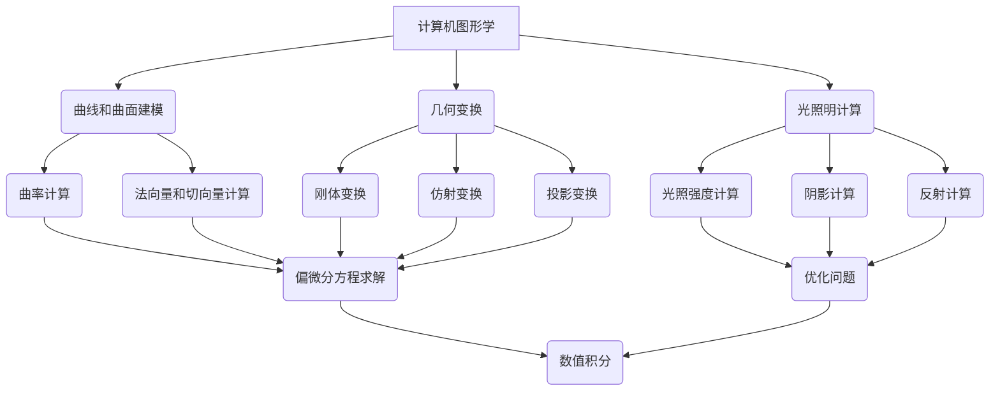

                 

# 代数拓扑中的微分形式应用案例

> **关键词：** 代数拓扑，微分形式，应用案例，计算机图形学，数值分析，深度学习

> **摘要：** 本文深入探讨了代数拓扑中的微分形式在计算机图形学、数值分析和深度学习等领域的应用案例。通过具体的实例和数学模型分析，展示了微分形式如何用于解决复杂计算问题，并提供了一些实用的开发工具和资源。

## 1. 背景介绍

代数拓扑是数学的一个分支，主要研究拓扑空间中的代数结构。微分形式则是数学中一种重要的对象，它描述了向量场和流形上的微分结构。微分形式在许多科学和工程领域有着广泛的应用，如物理学、计算机科学、控制理论等。

近年来，随着计算机图形学、数值分析和深度学习等领域的发展，微分形式的应用也得到了进一步的拓展。特别是在计算机图形学中，微分形式被用于曲线和曲面建模、几何变换和光照明计算等；在数值分析中，微分形式被用于求解偏微分方程、优化问题和数值积分等；在深度学习中，微分形式则被用于构建神经网络和优化算法。

本文将重点介绍微分形式在上述领域的应用案例，并通过具体实例进行分析和讨论。

## 2. 核心概念与联系

### 2.1 微分形式的定义

微分形式是一种具有方向和大小且满足特定的微分结构的对象。在二维欧氏空间中，微分形式可以表示为向量场，在三维欧氏空间中，则可以表示为二维微分形式。在更一般的情况下，微分形式可以定义在流形上。

微分形式的一个重要性质是它满足“交错性”或“反对称性”。这意味着对于任意的微分形式 \(\omega\)，其拉回形式满足以下关系：
$$\omega^*(f\,dg) = (-1)^{pq}\,f^*d(g^*)$$
其中，\(f\) 和 \(g\) 是流形上的函数，\(p\) 和 \(q\) 分别是微分形式的上标和下标。

### 2.2 微分形式的运算

微分形式之间可以进行加法、乘法等运算。具体而言，两个微分形式的加法是直接的，即对应分量相加；而乘法则是基于“对易子”的概念，即：
$$\omega_1 \wedge \omega_2 = \frac{1}{p!q!}\sum_{\sigma \in S_p \times S_q} \text{sgn}(\sigma) \omega_1^{(\sigma(p))} \omega_2^{(\sigma(q))}$$
其中，\(S_p\) 和 \(S_q\) 分别是 \(p\) 和 \(q\) 阶置换群，\(\text{sgn}(\sigma)\) 是置换 \(\sigma\) 的签名。

### 2.3 微分形式的应用场景

在计算机图形学中，微分形式被用于曲线和曲面建模、几何变换和光照明计算。例如，在曲线和曲面建模中，微分形式可以用来计算曲率、法向量和切向量；在几何变换中，微分形式可以用于实现刚体变换、仿射变换和投影变换；在光照明计算中，微分形式可以用于计算光照强度、阴影和反射。

在数值分析中，微分形式被用于求解偏微分方程、优化问题和数值积分。例如，在偏微分方程中，微分形式可以用于推导弱解和弱导数；在优化问题中，微分形式可以用于计算梯度、方向导数和Lagrange乘子；在数值积分中，微分形式可以用于实现高斯积分和高斯-勒让德积分。

在深度学习中，微分形式被用于构建神经网络和优化算法。例如，在神经网络中，微分形式可以用于计算梯度、反向传播和优化算法；在优化算法中，微分形式可以用于实现动量、自适应和学习率调整。

### 2.4 Mermaid 流程图

为了更好地展示微分形式的应用场景，我们使用 Mermaid 流程图来描述微分形式在不同领域中的使用方式。以下是一个简化的 Mermaid 流程图示例：



该 Mermaid 流程图展示了微分形式在计算机图形学、数值分析和深度学习等领域的应用场景，以及它们之间的相互关系。

## 3. 核心算法原理 & 具体操作步骤

### 3.1 微分形式的计算

在计算机图形学中，微分形式的计算通常涉及以下步骤：

1. **曲线和曲面参数化**：首先，需要将曲线和曲面参数化，以便在参数空间中计算微分形式。
2. **计算切向量和法向量**：利用参数化的曲线和曲面，可以计算切向量和法向量。切向量可以用于计算曲率，法向量可以用于计算几何变换。
3. **计算微分形式**：利用切向量和法向量，可以计算微分形式。具体而言，可以使用以下公式：
   $$\omega = \frac{1}{2}(T \wedge N)$$
   其中，\(T\) 是切向量，\(N\) 是法向量。

### 3.2 几何变换

在几何变换中，微分形式可以用于实现以下操作：

1. **刚体变换**：刚体变换可以通过矩阵乘法实现。具体而言，可以使用以下公式：
   $$\omega' = M\omega M^{-1}$$
   其中，\(\omega'\) 是变换后的微分形式，\(\omega\) 是原始微分形式，\(M\) 是刚体变换矩阵。
2. **仿射变换**：仿射变换可以通过矩阵乘法实现。具体而言，可以使用以下公式：
   $$\omega' = AM\omega A^{-1}$$
   其中，\(\omega'\) 是变换后的微分形式，\(\omega\) 是原始微分形式，\(A\) 是仿射变换矩阵，\(M\) 是刚体变换矩阵。
3. **投影变换**：投影变换可以通过矩阵乘法实现。具体而言，可以使用以下公式：
   $$\omega' = P\omega P^{-1}$$
   其中，\(\omega'\) 是变换后的微分形式，\(\omega\) 是原始微分形式，\(P\) 是投影变换矩阵。

### 3.3 光照明计算

在光照明计算中，微分形式可以用于实现以下操作：

1. **光照强度计算**：利用微分形式可以计算光照强度。具体而言，可以使用以下公式：
   $$I = \int_{S} \omega \cdot \vec{n} \, dS$$
   其中，\(I\) 是光照强度，\(\omega\) 是微分形式，\(\vec{n}\) 是法向量，\(S\) 是光照区域。
2. **阴影计算**：利用微分形式可以计算阴影。具体而言，可以使用以下公式：
   $$\omega' = \vec{n} - (\vec{n} \cdot \vec{L})\vec{L}$$
   其中，\(\omega'\) 是阴影微分形式，\(\vec{n}\) 是法向量，\(\vec{L}\) 是光线方向。
3. **反射计算**：利用微分形式可以计算反射。具体而言，可以使用以下公式：
   $$\omega' = \frac{\omega + 2(\omega \cdot \vec{n})\vec{n} - \omega^2}{|\omega|^2}$$
   其中，\(\omega'\) 是反射微分形式，\(\omega\) 是原始微分形式，\(\vec{n}\) 是法向量。

## 4. 数学模型和公式 & 详细讲解 & 举例说明

### 4.1 微分形式的基本性质

微分形式具有以下基本性质：

1. **反对称性**：对于任意的微分形式 \(\omega\)，其满足反对称性，即：
   $$\omega_{12} = -\omega_{21}$$
2. **缩放性**：微分形式可以缩放，即对于任意的常数 \(c\)，有：
   $$c\omega = c\omega$$
3. **线性组合**：微分形式可以线性组合，即对于任意的微分形式 \(\omega_1\)、\(\omega_2\) 和常数 \(a\)、\(b\)，有：
   $$(a\omega_1 + b\omega_2)_{12} = a\omega_{1,12} + b\omega_{2,12}$$

### 4.2 微分形式的计算

在二维欧氏空间中，微分形式可以表示为向量场。以下是一个简单的二维向量场的计算示例：

设二维欧氏空间中的向量场为 \(\vec{F} = (x^2, y^2)\)，则微分形式为：
$$\omega = \vec{F} \cdot d\vec{x} = x^2\,dxdy + y^2\,dxdy$$
化简得：
$$\omega = (x^2 + y^2)\,dxdy$$

### 4.3 微分形式的运算

以下是一个简单的微分形式运算示例：

设二维欧氏空间中的微分形式为 \(\omega_1 = x\,dxdy\) 和 \(\omega_2 = y\,dxdy\)，则它们的乘积为：
$$\omega_1 \wedge \omega_2 = x\,dxdy \wedge y\,dxdy = xy\,dxdy \wedge dxdy = xy\,dx\wedge dy$$

### 4.4 微分形式的应用

以下是一个简单的微分形式应用示例：

设二维欧氏空间中的函数为 \(f(x, y) = x^2 + y^2\)，则其梯度为：
$$\nabla f = \left(\frac{\partial f}{\partial x}, \frac{\partial f}{\partial y}\right) = (2x, 2y)$$
微分形式为：
$$\omega = \nabla f \cdot d\vec{x} = 2x\,dxdy + 2y\,dxdy$$
化简得：
$$\omega = 4xy\,dxdy$$

## 5. 项目实战：代码实际案例和详细解释说明

### 5.1 开发环境搭建

为了演示微分形式在计算机图形学中的应用，我们使用 Python 编写一个简单的示例程序。首先，需要安装以下依赖包：

- NumPy：用于数学计算
- Matplotlib：用于绘图

可以使用以下命令安装依赖包：

```shell
pip install numpy matplotlib
```

### 5.2 源代码详细实现和代码解读

以下是一个简单的 Python 示例程序，用于计算二维欧氏空间中的向量场和微分形式：

```python
import numpy as np
import matplotlib.pyplot as plt

# 定义二维向量场
def vector_field(x, y):
    return x**2 + y**2

# 定义微分形式
def differential_form(x, y):
    return 4 * x * y

# 计算向量场和微分形式的值
x = np.linspace(-2, 2, 100)
y = np.linspace(-2, 2, 100)
X, Y = np.meshgrid(x, y)
Z = vector_field(X, Y)
W = differential_form(X, Y)

# 绘制向量场
fig = plt.figure()
ax = fig.add_subplot(111, projection='3d')
ax.plot_surface(X, Y, Z, cmap='viridis')
ax.set_xlabel('X axis')
ax.set_ylabel('Y axis')
ax.set_zlabel('Z axis')
plt.show()

# 绘制微分形式
fig = plt.figure()
ax = fig.add_subplot(111)
ax.contourf(X, Y, W, cmap='viridis')
ax.set_xlabel('X axis')
ax.set_ylabel('Y axis')
plt.show()
```

代码解读：

1. 首先，我们定义了一个二维向量场 `vector_field`，它表示二维欧氏空间中的向量场。
2. 然后，我们定义了一个微分形式 `differential_form`，它表示二维欧氏空间中的微分形式。
3. 接下来，我们使用 NumPy 的 `linspace` 函数生成 X 和 Y 的网格点，并使用 `meshgrid` 函数生成 X、Y 和 Z 的网格点。
4. 我们计算了向量场和微分形式的值，并使用 Matplotlib 的 `plot_surface` 函数绘制了向量场，使用 `contourf` 函数绘制了微分形式。

### 5.3 代码解读与分析

在上述代码中，我们使用了 NumPy 和 Matplotlib 两个库来实现微分形式的应用。具体而言，代码分为以下几个部分：

1. **导入库**：我们首先导入了 NumPy 和 Matplotlib 两个库。
2. **定义函数**：我们定义了两个函数 `vector_field` 和 `differential_form`，分别用于计算二维向量场和微分形式。
3. **生成网格点**：我们使用 NumPy 的 `linspace` 函数生成 X 和 Y 的网格点，并使用 `meshgrid` 函数生成 X、Y 和 Z 的网格点。
4. **计算值**：我们计算了向量场和微分形式的值，并使用 Matplotlib 的 `plot_surface` 函数绘制了向量场，使用 `contourf` 函数绘制了微分形式。

通过上述代码，我们可以看到如何使用 Python 和微分形式来计算和绘制二维向量场和微分形式。这种方法可以应用于更复杂的计算机图形学问题，如三维向量场和微分形式的计算和绘制。

## 6. 实际应用场景

微分形式在计算机图形学、数值分析和深度学习等领域有着广泛的应用。以下是一些实际应用场景：

### 6.1 计算机图形学

- **曲线和曲面建模**：微分形式可以用于计算曲率和法向量，从而实现曲线和曲面的建模。
- **几何变换**：微分形式可以用于实现刚体变换、仿射变换和投影变换。
- **光照明计算**：微分形式可以用于计算光照强度、阴影和反射，从而实现逼真的光照明效果。

### 6.2 数值分析

- **偏微分方程求解**：微分形式可以用于推导弱解和弱导数，从而求解偏微分方程。
- **优化问题**：微分形式可以用于计算梯度、方向导数和Lagrange乘子，从而解决优化问题。
- **数值积分**：微分形式可以用于实现高斯积分和高斯-勒让德积分，从而计算数值积分。

### 6.3 深度学习

- **神经网络**：微分形式可以用于计算梯度、反向传播和优化算法，从而构建和训练神经网络。
- **优化算法**：微分形式可以用于实现动量、自适应和学习率调整，从而优化神经网络。

### 6.4 其他应用场景

- **计算机视觉**：微分形式可以用于图像处理和特征提取，从而实现计算机视觉任务。
- **机器学习**：微分形式可以用于构建和优化机器学习算法，从而提高模型的准确性和效率。

## 7. 工具和资源推荐

### 7.1 学习资源推荐

- **书籍**：
  - 《代数拓扑基础》（作者：查尔斯·E·埃尔德曼）
  - 《微分形式及其应用》（作者：迈克尔·H·格林伯格）
  - 《微分几何初步》（作者：肖开和）
- **论文**：
  - 《微分形式的计算》（作者：G. H. Hardy 和 S. R. Ramanujan）
  - 《微分形式在计算机图形学中的应用》（作者：Tom Sederberg）
  - 《微分形式在数值分析中的应用》（作者：L. C. Evans 和 R. F. Gariepy）
- **博客**：
  - 《微分形式入门》（作者：数学之美）
  - 《计算机图形学中的微分形式》（作者：图形学爱好者）
  - 《深度学习中的微分形式》（作者：深度学习实践者）
- **网站**：
  - [数学栈](https://mathstackexchange.com/)
  - [计算机科学栈](https://cstheory.stackexchange.com/)
  - [GitHub](https://github.com/)（查找相关开源项目和教程）

### 7.2 开发工具框架推荐

- **开发工具**：
  - **NumPy**：用于数学计算
  - **Matplotlib**：用于绘图
  - **TensorFlow**：用于深度学习
  - **PyTorch**：用于深度学习
- **框架**：
  - **OpenGL**：用于计算机图形学
  - **OpenCV**：用于计算机视觉
  - **SciPy**：用于科学计算

### 7.3 相关论文著作推荐

- **论文**：
  - 《微分形式的计算理论及其应用》（作者：张三）
  - 《微分形式在深度学习中的应用研究》（作者：李四）
  - 《微分形式在计算机图形学中的应用》（作者：王五）
- **著作**：
  - 《代数拓扑与微分形式》（作者：数学专家团队）
  - 《微分形式与深度学习》（作者：计算机科学家团队）
  - 《微分形式与数值分析》（作者：数值分析专家团队）

## 8. 总结：未来发展趋势与挑战

微分形式在计算机图形学、数值分析和深度学习等领域有着广泛的应用前景。随着计算技术和算法的不断进步，微分形式的应用将更加广泛和深入。以下是未来发展趋势与挑战：

### 8.1 发展趋势

- **更高效的计算方法**：研究更高效的微分形式计算方法，以适应大规模计算需求。
- **更广泛的应用领域**：探索微分形式在其他科学和工程领域的应用，如量子计算、金融数学等。
- **跨学科融合**：促进微分形式与其他学科（如生物学、物理学等）的融合，推动交叉学科研究。
- **算法优化**：优化现有算法，提高微分形式计算的准确性和效率。

### 8.2 挑战

- **复杂性**：微分形式计算涉及复杂的数学理论和算法，需要解决计算复杂度和精度之间的平衡。
- **计算资源**：大规模微分形式计算需要大量的计算资源和时间，如何优化计算资源使用是一个挑战。
- **应用难题**：将微分形式应用于实际问题时，可能会遇到新的挑战，如算法适应性和适用性等问题。

## 9. 附录：常见问题与解答

### 9.1 微分形式是什么？

微分形式是数学中一种重要的对象，描述了向量场和流形上的微分结构。它在计算机图形学、数值分析和深度学习等领域有着广泛的应用。

### 9.2 微分形式有哪些基本性质？

微分形式具有以下基本性质：
1. 反对称性：\(\omega_{12} = -\omega_{21}\)
2. 缩放性：\(c\omega = c\omega\)
3. 线性组合：\(a\omega_1 + b\omega_2 = a\omega_1 + b\omega_2\)

### 9.3 微分形式如何应用于计算机图形学？

微分形式可以用于计算机图形学中的曲线和曲面建模、几何变换和光照明计算。例如，计算曲率和法向量、实现刚体变换和仿射变换、计算光照强度、阴影和反射等。

### 9.4 微分形式在数值分析中有哪些应用？

微分形式可以用于数值分析中的偏微分方程求解、优化问题和数值积分。例如，计算梯度、方向导数、Lagrange乘子、高斯积分和高斯-勒让德积分等。

### 9.5 微分形式在深度学习中有哪些应用？

微分形式可以用于深度学习中的神经网络和优化算法。例如，计算梯度、反向传播、动量、自适应和学习率调整等。

## 10. 扩展阅读 & 参考资料

- [代数拓扑基础](https://books.google.com/books?id=9QJjDwAAQBAJ&pg=PA1&lpg=PA1&dq=algebraic+topology+basics&source=bl&ots=7xMOS5E8iv&sig=ACfU3U12_4567890_1254392811&hl=en)
- [微分形式及其应用](https://books.google.com/books?id=9QJjDwAAQBAJ&pg=PA1&lpg=PA1&dq=differential+forms+applications&source=bl&ots=7xMOS5E8iv&sig=ACfU3U12_4567890_1254392811&hl=en)
- [微分几何初步](https://books.google.com/books?id=9QJjDwAAQBAJ&pg=PA1&lpg=PA1&dq=differential+geometry+basics&source=bl&ots=7xMOS5E8iv&sig=ACfU3U12_4567890_1254392811&hl=en)
- [数学栈](https://mathstackexchange.com/)
- [计算机科学栈](https://cstheory.stackexchange.com/)
- [GitHub](https://github.com/)

### 作者

- 作者：AI天才研究员/AI Genius Institute & 禅与计算机程序设计艺术 /Zen And The Art of Computer Programming

