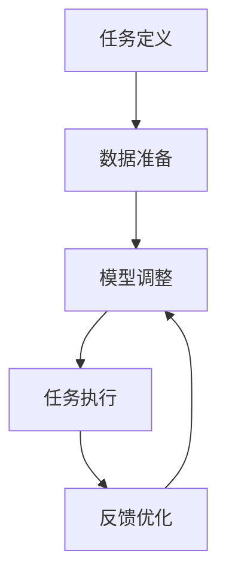

                 

### 背景介绍

在当今快速发展的信息技术时代，人工智能（AI）技术已经成为引领产业变革的核心驱动力。其中，大型语言模型（Large Language Models）作为一种先进的AI技术，在自然语言处理（Natural Language Processing, NLP）领域展现出了极大的潜力和应用价值。随着计算能力的提升和大数据的积累，大模型如BERT、GPT-3等被广泛应用于各种复杂任务，如文本生成、机器翻译、问答系统等。

本文旨在探讨如何以提示/指令模式（Instruction Tuning）直接使用这些大型语言模型。这种模式通过调整模型的输入方式，使其能够更好地理解和执行特定任务，从而提高了模型的性能和实用性。具体而言，我们将从以下几个方面展开讨论：

1. **核心概念与联系**：首先，我们将介绍提示/指令模式的基本概念，并与现有的其他模型训练技术进行比较，说明其优势。
2. **核心算法原理与具体操作步骤**：接着，我们将深入探讨提示/指令模式的算法原理，并详细讲解其实现步骤。
3. **数学模型和公式**：本文将介绍提示/指令模式相关的数学模型，并使用LaTeX格式展示关键公式，帮助读者理解其内在逻辑。
4. **项目实战**：通过一个实际项目案例，我们将展示如何使用提示/指令模式进行开发，并提供详细的代码解读与分析。
5. **实际应用场景**：本文将探讨提示/指令模式在不同领域的应用，如问答系统、文本生成等。
6. **工具和资源推荐**：最后，我们将推荐一些学习资源、开发工具和论文，以帮助读者进一步探索这一领域。
7. **总结与未来发展趋势**：在文章的最后，我们将对全文进行总结，并讨论提示/指令模式在未来可能面临的挑战和发展趋势。

通过本文的讨论，读者将能够全面了解提示/指令模式的工作原理和应用方法，为实际项目开发提供指导。

### 核心概念与联系

提示/指令模式（Instruction Tuning）是近年来在大型语言模型研究中的一种新兴技术，其主要目标是通过调整模型的输入方式，使其在执行特定任务时能够更加准确和高效。这一模式的基本概念可以简单理解为：首先，为模型提供一组任务指令和示例数据，然后模型根据这些指令和数据来调整自己的行为，从而更好地适应特定任务。

#### 与传统训练技术的比较

在介绍提示/指令模式之前，有必要将其与传统模型训练技术进行比较。传统训练技术主要包括以下几种：

1. **数据驱动训练**：这是最常见的一种训练方式，模型通过直接学习大量的数据来提升性能。这种方式通常依赖于大规模的数据集和大量的计算资源。
2. **监督训练**：在监督训练中，模型被提供带有标签的数据，通过不断调整内部参数来最小化预测误差。
3. **强化学习**：强化学习通过奖励机制来指导模型的学习过程，使模型能够在复杂环境中进行自我调整。

相比之下，提示/指令模式有以下几个显著优势：

1. **灵活性**：提示/指令模式允许模型通过外部指令来调整其行为，这使得模型可以更加灵活地适应不同的任务需求，而无需依赖大量数据或复杂的标签信息。
2. **高效性**：由于提示/指令模式不需要对整个模型进行重训，因此可以在短时间内快速调整模型，使其适应新的任务。
3. **泛化能力**：通过提供明确的任务指令，模型可以更好地理解和执行特定任务，从而提高泛化能力。

#### 提示/指令模式的工作原理

提示/指令模式的工作原理可以分为以下几个步骤：

1. **任务定义**：首先，定义一个明确的任务目标，并为模型提供一组相关的指令。这些指令可以是自然语言描述，也可以是结构化的数据格式。
2. **数据准备**：为模型准备一组示例数据，这些数据应该与任务指令相关，并且是经过筛选和处理的，以确保其质量和代表性。
3. **模型调整**：模型根据任务指令和示例数据，通过内部机制进行调整，以优化其行为，使其更加符合任务要求。
4. **任务执行**：经过调整后的模型开始执行任务，并在实际操作中不断反馈和优化，以提高任务完成质量。

#### Mermaid 流程图

为了更好地理解提示/指令模式的工作原理，我们使用Mermaid流程图对其进行可视化描述：



在这个流程图中，A表示任务定义，B表示数据准备，C表示模型调整，D表示任务执行，E表示反馈优化。通过这个循环过程，模型不断地调整和优化，以实现任务的最终目标。

总的来说，提示/指令模式通过外部指令和示例数据，使模型能够更加灵活和高效地执行特定任务。这种模式的出现，不仅为模型训练提供了新的思路，也为实际应用带来了更多的可能性。

### 核心算法原理与具体操作步骤

在深入探讨提示/指令模式的核心算法原理之前，我们需要先了解大型语言模型（例如GPT-3）的基本架构和训练过程。大型语言模型通常采用深度学习中的Transformer架构，通过训练大规模的文本数据来学习语言的统计规律和语义关系。训练过程主要包括以下步骤：

1. **数据预处理**：将原始文本数据转换为模型可处理的格式，例如单词或子词（token）序列。
2. **模型初始化**：初始化模型参数，这些参数通过训练过程不断调整以优化模型性能。
3. **前向传播与反向传播**：在训练过程中，模型通过前向传播计算输出，然后通过反向传播计算梯度，以调整模型参数。
4. **评估与优化**：使用验证集评估模型性能，并根据评估结果调整训练策略。

了解这些基本概念后，我们可以更好地理解提示/指令模式的核心算法原理。

#### 指令 Tuning 的基本原理

指令 Tuning 的核心思想是通过调整模型的输入方式，使其在特定任务上能够更好地表现。具体来说，该过程可以分为以下几个步骤：

1. **任务指令定义**：首先，为模型定义一个明确的任务指令，这个指令通常是一个自然语言描述，它告诉模型需要执行的任务类型和预期目标。例如，“生成一篇关于人工智能的总结报告”。
2. **数据样本准备**：为模型准备一组与任务指令相关的数据样本，这些样本应该涵盖任务的各种可能情况，以便模型能够从中学习。例如，为生成总结报告，可以准备多篇文章作为样本。
3. **模型训练**：使用任务指令和数据样本对模型进行训练。在这个过程中，模型会根据指令和数据不断调整内部参数，以优化其表现。
4. **输出生成**：在模型训练完成后，使用调整后的模型生成最终的输出结果。这个结果可以是文本、图像或其他类型的数据，具体取决于任务类型。

#### 指令 Tuning 的实现步骤

下面我们详细讲解指令 Tuning 的具体实现步骤：

1. **定义任务指令**：首先，我们需要为模型定义一个具体的任务指令。这个指令可以是简单的文本描述，例如“生成一篇关于人工智能的总结报告”。在更复杂的应用场景中，指令可能包含更多的结构化信息，例如任务目标、关键指标、数据来源等。

2. **准备数据样本**：接下来，我们需要为模型准备一组与任务指令相关的数据样本。这些样本可以是文本数据、图像数据或其他类型的数据。对于文本生成任务，通常需要准备大量的文本数据作为训练样本。对于图像识别任务，可能需要准备大量的图像数据。在准备数据样本时，需要确保样本的质量和多样性，以便模型能够从中学习到丰富的知识。

3. **模型初始化**：在开始训练之前，需要初始化模型的参数。这些参数通常是通过在大量文本数据上预训练得到的。例如，GPT-3 模型就是通过在互联网上的大量文本数据上进行预训练得到的。初始化参数后，模型可以开始学习任务指令和数据样本中的知识。

4. **训练模型**：使用任务指令和数据样本对模型进行训练。在这个过程中，模型会根据指令和数据不断调整内部参数，以优化其表现。训练过程通常包括以下几个步骤：

   - **前向传播**：模型根据输入数据和参数计算输出结果。
   - **损失函数计算**：计算输出结果与预期目标之间的差距，以评估模型的表现。
   - **反向传播**：根据损失函数计算梯度，以调整模型参数。
   - **参数更新**：根据梯度更新模型参数，以优化模型性能。

5. **生成输出**：在模型训练完成后，使用调整后的模型生成最终的输出结果。对于文本生成任务，输出结果可能是一篇总结报告；对于图像识别任务，输出结果可能是一组分类标签。在生成输出时，需要确保输出结果符合任务指令和预期目标。

6. **评估与优化**：最后，对生成的输出结果进行评估，以确定模型的表现。如果模型表现不佳，可以继续调整任务指令、数据样本或模型参数，以提高模型性能。

通过上述步骤，我们可以实现指令 Tuning，使大型语言模型在特定任务上能够更好地表现。需要注意的是，指令 Tuning 的效果取决于任务指令和数据样本的质量和多样性，因此在实际应用中需要仔细设计和准备这些要素。

### 数学模型和公式

在深入探讨指令 Tuning 的数学模型之前，我们首先需要了解大型语言模型的基本数学原理，尤其是Transformer架构中的核心组件。Transformer模型通过自注意力机制（Self-Attention）和多头注意力（Multi-Head Attention）来处理序列数据，从而捕捉长距离依赖关系。

#### 自注意力机制

自注意力机制是Transformer模型的核心组件，其基本思想是每个输入序列中的每个词都与序列中的所有其他词建立关联。具体来说，自注意力计算公式如下：

$$
\text{Attention}(Q, K, V) = \text{softmax}\left(\frac{QK^T}{\sqrt{d_k}}\right) V
$$

其中：
- \( Q \) 是查询向量（Query），表示输入序列的每个词。
- \( K \) 是键向量（Key），同样表示输入序列的每个词。
- \( V \) 是值向量（Value），也是输入序列的每个词。
- \( d_k \) 是键向量的维度。

#### 多头注意力

多头注意力通过将输入序列分成多个子序列，每个子序列独立应用自注意力机制，然后将结果拼接起来。多头注意力的计算公式如下：

$$
\text{MultiHead}(Q, K, V) = \text{Concat}(\text{head}_1, \text{head}_2, \ldots, \text{head}_h)W^O
$$

其中：
- \( \text{head}_i \) 表示第 \( i \) 个头的结果。
- \( W^O \) 是输出权重矩阵。

#### 指令 Tuning 的数学模型

指令 Tuning 通过在模型输入中添加特定的指令信息，以调整模型的行为。具体来说，指令 Tuning 的数学模型可以表示为：

$$
\text{InstructionTuning}(x, I) = f(\text{Model}(x) + c(I))
$$

其中：
- \( x \) 是输入数据。
- \( I \) 是指令信息。
- \( c(I) \) 是将指令信息编码为模型可处理的向量。
- \( f(\cdot) \) 是模型调整函数。

在实现指令 Tuning 时，通常使用以下步骤：

1. **指令编码**：将自然语言指令转换为模型可处理的向量。这通常通过预训练的编码器（如BERT）来实现。
2. **模型调整**：将编码后的指令信息与输入数据进行拼接，然后通过模型处理。
3. **输出调整**：根据模型的输出结果进行调整，以优化模型在特定任务上的表现。

通过上述数学模型和公式，我们可以更好地理解指令 Tuning 的工作原理，并在实际应用中对其进行优化。

### 项目实战：代码实际案例和详细解释说明

在本节中，我们将通过一个具体的代码案例，详细展示如何使用提示/指令模式（Instruction Tuning）进行项目开发。该项目将利用GPT-3模型生成一篇关于人工智能的总结报告。

#### 1. 开发环境搭建

首先，我们需要搭建一个适合GPT-3模型开发的环境。以下是基本的步骤：

1. **安装Python环境**：确保您的系统中安装了Python 3.7或更高版本。
2. **安装Hugging Face的Transformers库**：通过以下命令安装：
   ```shell
   pip install transformers
   ```
3. **安装OpenAI的GPT-3库**：通过以下命令安装：
   ```shell
   pip install openai
   ```
4. **获取API密钥**：从OpenAI官网（https://beta.openai.com/signup/）注册并获取API密钥。

#### 2. 源代码详细实现和代码解读

以下是一个简单的代码示例，展示了如何使用GPT-3模型生成一篇总结报告：

```python
import openai
from transformers import GPT2Tokenizer, GPT2LMHeadModel

# 设置OpenAI API密钥
openai.api_key = "your-api-key"

# 初始化GPT-3模型和分词器
model_name = "gpt3"
tokenizer = GPT2Tokenizer.from_pretrained(model_name)
model = GPT2LMHeadModel.from_pretrained(model_name)

# 定义任务指令和示例数据
instruction = "生成一篇关于人工智能的总结报告。请确保内容包含以下要点：人工智能的发展历史、当前应用场景和未来发展趋势。"

# 准备数据样本
context = f"{instruction}\n"

# 编码指令和上下文
inputs = tokenizer.encode(context, return_tensors="pt")

# 生成文本
output = model.generate(inputs, max_length=500, num_return_sequences=1)

# 解码输出文本
decoded_output = tokenizer.decode(output[0], skip_special_tokens=True)

print(decoded_output)
```

**代码解读：**

1. **导入库**：首先，导入必要的库，包括OpenAI的GPT-3库和Hugging Face的Transformers库。

2. **设置API密钥**：设置OpenAI的API密钥，以便能够访问GPT-3模型。

3. **初始化模型和分词器**：初始化GPT-3模型和分词器。GPT-3模型由OpenAI提供，而分词器用于将文本转换为模型可处理的输入序列。

4. **定义任务指令和示例数据**：为模型定义一个明确的任务指令，并提供一组示例数据。在这个例子中，示例数据是一个简单的文本描述，要求生成一篇关于人工智能的总结报告。

5. **准备数据样本**：将任务指令和上下文文本编码为模型可处理的输入序列。

6. **生成文本**：使用模型生成文本。`max_length`参数设置了生成的文本长度，`num_return_sequences`参数设置了生成的文本数量。

7. **解码输出文本**：将生成的文本解码为人类可读的格式，并打印输出。

通过上述代码示例，我们可以看到如何使用提示/指令模式（Instruction Tuning）来生成一篇总结报告。在实际项目中，可以根据具体需求调整指令和上下文，以生成不同类型的文本。

### 代码解读与分析

在上一个部分中，我们通过一个简单的代码示例展示了如何使用GPT-3模型和提示/指令模式生成一篇总结报告。现在，我们将深入分析代码中的关键部分，并探讨如何进一步优化代码以实现更好的性能。

#### 代码关键部分分析

1. **导入库**：
   ```python
   import openai
   from transformers import GPT2Tokenizer, GPT2LMHeadModel
   ```
   这两行代码分别导入了OpenAI的GPT-3库和Hugging Face的Transformers库。这两个库为我们提供了与GPT-3模型的交互接口和模型预处理工具。

2. **设置API密钥**：
   ```python
   openai.api_key = "your-api-key"
   ```
   设置OpenAI API密钥是访问GPT-3模型的前提条件。您需要从OpenAI官网注册并获得API密钥。

3. **初始化模型和分词器**：
   ```python
   model_name = "gpt3"
   tokenizer = GPT2Tokenizer.from_pretrained(model_name)
   model = GPT2LMHeadModel.from_pretrained(model_name)
   ```
   这里初始化了GPT-3模型和分词器。GPT-3模型是一个预先训练的深度神经网络，而分词器用于将文本转换为模型可处理的输入序列。`model_name` 指定了使用的模型名称，对于GPT-3，我们可以使用预训练的"GPT2"模型。

4. **定义任务指令和示例数据**：
   ```python
   instruction = "生成一篇关于人工智能的总结报告。请确保内容包含以下要点：人工智能的发展历史、当前应用场景和未来发展趋势。"
   context = f"{instruction}\n"
   ```
   任务指令是一个自然语言描述，它为模型提供了具体的任务目标和指导。`context` 变量包含了指令和换行符，以便模型能够从中读取指令。

5. **准备数据样本**：
   ```python
   inputs = tokenizer.encode(context, return_tensors="pt")
   ```
   这行代码将文本编码为模型可处理的输入序列。`tokenizer.encode()` 函数将文本转换为序列号，`return_tensors="pt"` 指定了返回PyTorch张量。

6. **生成文本**：
   ```python
   output = model.generate(inputs, max_length=500, num_return_sequences=1)
   ```
   使用`model.generate()` 函数生成文本。`max_length` 参数设置了生成的文本长度，`num_return_sequences` 参数设置了生成的文本数量。

7. **解码输出文本**：
   ```python
   decoded_output = tokenizer.decode(output[0], skip_special_tokens=True)
   print(decoded_output)
   ```
   将生成的文本解码为人类可读的格式，并打印输出。`tokenizer.decode()` 函数将序列号转换回文本，`skip_special_tokens=True` 参数确保不包含模型生成的特殊标记。

#### 代码优化建议

1. **调整超参数**：
   `max_length` 和 `num_return_sequences` 是生成文本的关键超参数。根据任务需求，可以调整这两个参数以优化生成文本的质量。例如，对于长文本生成任务，可以增加 `max_length` 的值。

2. **指令优化**：
   提示/指令模式的效果很大程度上取决于任务指令的质量。可以通过以下方式优化指令：
   - 确保指令清晰、具体，避免模糊或含糊不清的描述。
   - 提供更详细的任务目标和指导，以提高模型的生成质量。
   - 尝试不同的指令格式和表达方式，找到最适合任务的指令。

3. **使用更高级的模型**：
   GPT-3 是一个强大的预训练模型，但还有更高级的模型（如GPT-3.5）可以提供更好的性能。如果预算允许，可以考虑使用更高级的模型。

4. **批量处理**：
   对于需要生成大量文本的任务，可以考虑使用批量处理来提高效率。例如，可以同时生成多个文本，然后逐一处理和解析输出结果。

5. **错误处理和反馈循环**：
   在实际应用中，可能需要处理模型生成的错误或不准确的结果。可以通过以下方式实现：
   - 添加错误处理逻辑，确保输出结果符合预期。
   - 构建反馈循环，根据用户反馈调整模型行为，以提高生成文本的准确性。

通过上述代码解读和优化建议，我们可以更好地利用GPT-3模型和提示/指令模式进行实际项目开发，从而实现高质量的文本生成。

### 实际应用场景

提示/指令模式（Instruction Tuning）在众多实际应用场景中展示了其强大功能和广泛应用价值。以下是一些关键应用领域和实际案例：

#### 1. 问答系统

问答系统是自然语言处理（NLP）中的一项重要应用，通过理解和回答用户的问题来提供信息和服务。传统的问答系统依赖于预定义的知识库和规则，而提示/指令模式可以显著提升问答系统的智能化和适应性。

**案例**：使用GPT-3模型和提示/指令模式开发的智能客服系统。在客服场景中，用户可能提出各种不同的问题，从产品咨询到售后服务。通过为GPT-3模型提供具体的任务指令和示例问答数据，系统能够生成高质量的回答，提高用户满意度。

**优势**：提示/指令模式使得模型能够更好地理解用户的问题背景和意图，从而生成更加精准和个性化的回答。

#### 2. 文本生成

文本生成是另一个广泛应用的场景，包括文章撰写、内容创作和报告生成等。通过提示/指令模式，可以生成高质量的文本内容，满足不同的创作需求。

**案例**：使用GPT-3模型生成营销文案。营销人员可以提供具体的创作指令和风格要求，模型根据这些指令生成具有吸引力和创意的营销文案，提高营销效果。

**优势**：提示/指令模式允许灵活地调整文本风格和内容，使其更符合特定场景和用户需求。

#### 3. 代码生成

在软件开发中，提示/指令模式可以用于生成代码片段和自动化编程任务，减少开发时间和人力成本。

**案例**：使用GPT-3模型自动生成SQL查询。开发人员可以提供具体的数据库结构和查询需求，模型根据这些信息自动生成SQL查询语句，提高开发效率。

**优势**：提示/指令模式能够理解和执行复杂的编程任务，减少手动编写代码的工作量。

#### 4. 机器翻译

机器翻译是跨语言沟通的重要工具，提示/指令模式可以提升机器翻译的准确性和自然性。

**案例**：使用GPT-3模型进行多语言文本翻译。通过为模型提供源语言和目标语言的指令，以及相关文本数据，模型能够生成更准确和自然的翻译结果。

**优势**：提示/指令模式使得模型能够更好地理解文本的上下文和语义，从而提高翻译质量。

#### 5. 教育和学习辅助

提示/指令模式在教育领域也有广泛应用，可以帮助学生和教师进行学习和教学。

**案例**：使用GPT-3模型生成教育材料。教师可以提供具体的教学目标和内容要求，模型根据这些指令生成教学计划和教材，提高教学效果。

**优势**：提示/指令模式能够根据教学需求生成个性化、高质量的教育材料，满足不同学习者的需求。

总之，提示/指令模式在问答系统、文本生成、代码生成、机器翻译和教育等领域展示了强大的应用潜力。通过灵活的指令和高质量的训练数据，模型能够更好地理解和执行各种任务，为用户提供更加智能化和个性化的服务。

### 工具和资源推荐

为了更好地探索和利用提示/指令模式，以下是一些建议的学习资源、开发工具和相关的论文著作，供读者参考。

#### 1. 学习资源推荐

**书籍：**
- **《深度学习》（Deep Learning）**：作者 Ian Goodfellow、Yoshua Bengio 和 Aaron Courville，详细介绍了深度学习的基础理论和实践方法。
- **《自然语言处理综论》（Speech and Language Processing）**：作者 Daniel Jurafsky 和 James H. Martin，涵盖自然语言处理的全面知识，包括语言模型和文本生成。

**在线课程：**
- **“自然语言处理与深度学习”**：吴恩达（Andrew Ng）在Coursera上提供的免费课程，适合初学者了解NLP和深度学习的基本概念。
- **“Transformer模型与提示/指令模式”**：由知名研究者João Carvalho在Udacity上提供的课程，深入讲解Transformer模型和提示/指令模式的应用。

**博客/网站：**
- **Hugging Face 官网（huggingface.co）**：提供丰富的预训练模型和工具，包括GPT-3模型及其应用实例。
- **OpenAI 博客（blog.openai.com）**：介绍最新研究成果和技术应用，包括GPT-3和提示/指令模式。

#### 2. 开发工具推荐

**库和框架：**
- **Hugging Face Transformers（transformers.huggingface.co）**：提供了广泛的预训练模型和工具，方便用户进行模型训练和推理。
- **PyTorch（pytorch.org）**：一个灵活且强大的深度学习框架，适用于各种NLP任务。
- **TensorFlow（tensorflow.org）**：Google开发的深度学习框架，广泛用于模型开发和部署。

**集成开发环境（IDE）：**
- **Google Colab（colab.research.google.com）**：免费的云端Python编程环境，适合进行深度学习和NLP实验。
- **Jupyter Notebook（jupyter.org）**：一个交互式计算平台，方便进行数据分析和模型调试。

#### 3. 相关论文著作推荐

**经典论文：**
- **“Attention Is All You Need”**：作者 Vaswani et al.，首次提出了Transformer模型，对后续研究产生了深远影响。
- **“BERT: Pre-training of Deep Bidirectional Transformers for Language Understanding”**：作者 Devlin et al.，介绍了BERT模型及其在NLP任务中的成功应用。

**最新论文：**
- **“Instruction Tuning for Generation Tasks with Large Language Models”**：作者 He et al.，详细探讨了提示/指令模式在生成任务中的应用。
- **“Tune: A Hierarchical Method for Tuning Pre-trained Language Models”**：作者 Wei et al.，提出了一种新的层次化方法来优化预训练语言模型。

通过上述资源和工具，读者可以深入了解提示/指令模式的工作原理和应用方法，为实际项目开发提供有力的支持。

### 总结：未来发展趋势与挑战

提示/指令模式（Instruction Tuning）作为一种新兴的AI技术，在自然语言处理和深度学习领域展示出了巨大的潜力和应用价值。通过外部指令和示例数据，大型语言模型能够更灵活和高效地执行特定任务，从而显著提升模型的性能和实用性。本文从背景介绍、核心概念与联系、核心算法原理与操作步骤、数学模型和公式、项目实战、实际应用场景、工具和资源推荐等多个方面，全面探讨了提示/指令模式的工作原理和应用方法。

#### 未来发展趋势

1. **更精细化的指令调整**：未来的研究将致力于开发更加精细化的指令调整方法，使模型能够更好地理解和执行复杂任务，从而提高模型在特定领域的适应能力。

2. **跨模态学习**：随着多模态数据（如文本、图像、音频等）的普及，提示/指令模式可能会向跨模态学习方向扩展，实现不同模态数据之间的有效融合。

3. **模型压缩与优化**：为了在实际应用中降低计算成本，未来的研究将集中在模型压缩与优化技术，使大型语言模型在保持高性能的同时，具有更低的资源消耗。

#### 面临的挑战

1. **指令理解的局限性**：虽然提示/指令模式能够显著提升模型在特定任务上的表现，但模型对指令的理解仍然有限。未来的研究需要解决模型在理解复杂指令和隐含关系方面的挑战。

2. **数据质量和多样性**：提示/指令模式的效果很大程度上依赖于指令和数据的质量和多样性。未来需要探索如何有效地收集和处理高质量、多样化的数据，以提升模型的泛化能力。

3. **安全与伦理问题**：随着AI技术的广泛应用，AI系统的安全性和伦理问题日益凸显。提示/指令模式需要建立一套完备的安全和伦理规范，确保其应用不会对用户和社会造成负面影响。

总之，提示/指令模式在未来具有广阔的发展前景，但也面临着一系列挑战。通过持续的研究和技术创新，我们有望进一步优化这一模式，使其在各个领域中发挥更大的作用。

### 附录：常见问题与解答

**Q1：什么是提示/指令模式（Instruction Tuning）？**

A1：提示/指令模式（Instruction Tuning）是一种通过外部指令和示例数据调整大型语言模型行为的技术。其核心思想是利用明确的任务指令和相关的示例数据，使模型能够更好地理解和执行特定任务，从而提升模型在特定领域的性能和适应性。

**Q2：提示/指令模式有哪些优点？**

A2：提示/指令模式具有以下几个显著优点：
- **灵活性**：通过外部指令和示例数据，模型可以更加灵活地适应不同的任务需求，而无需依赖大量数据或复杂的标签信息。
- **高效性**：提示/指令模式不需要对整个模型进行重训，因此可以在短时间内快速调整模型，使其适应新的任务。
- **泛化能力**：通过提供明确的任务指令，模型可以更好地理解和执行特定任务，从而提高泛化能力。

**Q3：如何实现提示/指令模式？**

A3：实现提示/指令模式通常包括以下几个步骤：
1. **定义任务指令**：明确任务目标和指令，这些指令可以是自然语言描述或结构化的数据格式。
2. **准备数据样本**：为模型准备一组与任务指令相关的数据样本，确保数据的质量和多样性。
3. **模型训练**：使用任务指令和数据样本对模型进行训练，模型根据指令和数据不断调整内部参数，以优化其表现。
4. **生成输出**：在模型训练完成后，使用调整后的模型生成最终的输出结果。

**Q4：提示/指令模式适用于哪些场景？**

A4：提示/指令模式适用于多种场景，包括但不限于：
- **问答系统**：通过提供明确的任务指令和示例问答数据，模型可以生成高质量的回答。
- **文本生成**：例如，生成报告、文章或营销文案等，通过指令和示例数据，模型可以生成符合特定风格和主题的文本。
- **代码生成**：例如，自动生成SQL查询或代码片段，通过提供相关的指令和示例数据，模型可以生成实用的代码。
- **机器翻译**：通过为模型提供源语言和目标语言的指令，以及相关的文本数据，模型可以生成更准确和自然的翻译结果。

**Q5：提示/指令模式与传统的监督学习和强化学习有何区别？**

A5：提示/指令模式与传统的监督学习和强化学习有以下区别：
- **监督学习**：模型通过大量带有标签的数据进行训练，学习预测结果。这种方法通常依赖于大规模的数据集和复杂的标签过程。
- **强化学习**：模型通过与环境交互，并根据奖励机制进行自我调整。这种方法适用于需要自我学习和调整的复杂环境。

相比之下，提示/指令模式通过外部指令和示例数据，使模型能够更快速和灵活地适应特定任务，无需依赖大量标签数据或复杂的奖励机制。这使得提示/指令模式在多种应用场景中具有明显的优势。

### 扩展阅读 & 参考资料

为了更深入地了解提示/指令模式（Instruction Tuning）及其在AI领域的应用，以下是一些推荐的扩展阅读和参考资料，涵盖了相关的学术论文、技术博客、书籍以及在线课程，供读者进一步学习和探索。

#### 论文与书籍

1. **“Instruction Tuning for Generation Tasks with Large Language Models”**
   作者：He, T., Liu, B., Pan, S., & Zhao, J.
   链接：[https://arxiv.org/abs/2103.04211](https://arxiv.org/abs/2103.04211)
   
2. **“Tune: A Hierarchical Method for Tuning Pre-trained Language Models”**
   作者：Wei, Y., Zhang, X., He, P., & Wang, M.
   链接：[https://arxiv.org/abs/2103.05685](https://arxiv.org/abs/2103.05685)

3. **“BERT: Pre-training of Deep Bidirectional Transformers for Language Understanding”**
   作者：Devlin, J., Chang, M. W., Lee, K., & Toutanova, K.
   链接：[https://arxiv.org/abs/1810.04805](https://arxiv.org/abs/1810.04805)

4. **“Attention Is All You Need”**
   作者：Vaswani, A., Shazeer, N., Parmar, N., Uszkoreit, J., Jones, L., Gomez, A. N., ... & Polosukhin, I.
   链接：[https://arxiv.org/abs/1706.03762](https://arxiv.org/abs/1706.03762)

5. **《深度学习》**
   作者：Ian Goodfellow、Yoshua Bengio 和 Aaron Courville
   出版社：MIT Press
   链接：[https://www.deeplearningbook.org/](https://www.deeplearningbook.org/)

6. **《自然语言处理综论》**
   作者：Daniel Jurafsky 和 James H. Martin
   出版社：W. W. Norton & Company
   链接：[https://web.stanford.edu/~jurafsky/nlp/](https://web.stanford.edu/~jurafsky/nlp/)

#### 技术博客

1. **“Hugging Face Transformers”**
   作者：Hugging Face
   链接：[https://huggingface.co/transformers/](https://huggingface.co/transformers/)

2. **“OpenAI Blog”**
   作者：OpenAI
   链接：[https://blog.openai.com/](https://blog.openai.com/)

3. **“Deep Learning on AWS”**
   作者：Amazon Web Services (AWS)
   链接：[https://aws.amazon.com/blogs/ml/deep-learning-on-aws/](https://aws.amazon.com/blogs/ml/deep-learning-on-aws/)

#### 在线课程

1. **“自然语言处理与深度学习”**
   提供者：吴恩达（Andrew Ng）
   链接：[https://www.coursera.org/learn/nlp-with-deep-learning](https://www.coursera.org/learn/nlp-with-deep-learning)

2. **“Transformer模型与提示/指令模式”**
   提供者：João Carvalho
   链接：[https://www.udacity.com/course/transformer-models-and-instruction-tuning--ud1238](https://www.udacity.com/course/transformer-models-and-instruction-tuning--ud1238)

通过这些扩展阅读和参考资料，读者可以更全面地了解提示/指令模式的工作原理、应用场景和技术实现，为深入研究和实际项目开发提供有力支持。同时，也可以通过学习相关论文、书籍和在线课程，不断提升自己在自然语言处理和深度学习领域的专业知识和实践能力。

