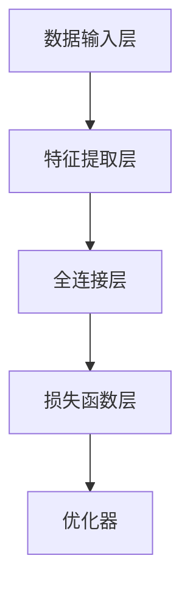

                 

### 背景介绍

在当今数字化时代，企业的运营效率直接关系到其竞争力和市场地位。随着信息技术的不断发展，大数据和人工智能技术逐渐成为提高工作效率的重要工具。大模型，即大型人工智能模型，在数据处理和分析方面具有显著优势。本文将探讨企业如何利用大模型提高工作效率，从而在激烈的市场竞争中占据有利地位。

大模型技术起源于深度学习领域的突破。随着计算能力的提升和数据量的爆炸式增长，研究人员开始尝试训练更大规模、更复杂的神经网络模型。这些大模型在图像识别、自然语言处理、语音识别等领域取得了显著进展。近年来，大模型技术逐渐应用于各个行业，为企业提供了强大的数据处理和分析能力。

企业面临的数据挑战日益复杂。随着业务规模的扩大和数字化程度的提高，企业产生的数据量呈指数级增长。这些数据不仅种类繁多，而且结构复杂。传统的数据处理方法已经无法满足企业的需求。大模型的出现，为企业提供了一种新的解决方案，使得从海量数据中提取有价值信息成为可能。

提高工作效率是企业的核心目标之一。高效的运营能够降低成本、提高服务质量、缩短产品上市时间。然而，传统的工作模式在处理大量数据和复杂任务时往往效率低下。大模型的应用，可以自动化处理复杂任务，减少人工干预，从而提高整体工作效率。

本文将从以下几个方面展开讨论：

1. **大模型的核心概念与架构**：介绍大模型的基本原理、常见类型及其在数据处理和分析中的优势。

2. **核心算法原理与具体操作步骤**：详细阐述大模型训练的基本流程，包括数据预处理、模型选择、训练与调优等。

3. **数学模型和公式**：分析大模型中的关键数学模型，如神经网络、损失函数等，并给出具体的数学公式和计算方法。

4. **项目实战**：通过实际代码案例，展示如何在实际项目中应用大模型，包括开发环境搭建、代码实现和解读等。

5. **实际应用场景**：探讨大模型在不同行业中的应用，如金融、医疗、零售等，以及如何帮助企业解决具体问题。

6. **工具和资源推荐**：介绍适用于大模型开发的工具和资源，包括学习资源、开发工具和框架等。

7. **总结与未来趋势**：总结大模型在提高工作效率方面的作用，并探讨未来发展趋势和面临的挑战。

通过本文的探讨，希望能够为企业在利用大模型提高工作效率方面提供有价值的参考和指导。接下来，我们将深入探讨大模型的核心概念和架构，以便更好地理解其工作原理和应用价值。

## 2. 核心概念与联系

在深入探讨企业如何利用大模型提高工作效率之前，我们需要了解大模型的基本概念、架构及其在数据处理和分析中的优势。本节将详细介绍大模型的核心概念、常见类型及其与大数据、机器学习等技术的联系。

### 大模型的基本概念

大模型（Large-scale Model）是指那些规模巨大、参数数量多、训练数据庞大的神经网络模型。这类模型能够处理海量数据，并在多个领域（如图像识别、自然语言处理、语音识别等）取得显著的成果。大模型的核心特点是“规模大”，这不仅体现在模型参数的数量上，还体现在训练数据的大小以及模型的复杂性。

大模型的常见类型包括：

1. **深度神经网络（Deep Neural Network，DNN）**：DNN是由多层神经元组成的神经网络，通过逐层提取特征来表示输入数据。深度足够深的DNN可以学习到复杂的数据模式，但训练过程较为复杂，对计算资源要求较高。

2. **卷积神经网络（Convolutional Neural Network，CNN）**：CNN专门用于处理图像数据，其结构包含卷积层、池化层和全连接层。通过多个卷积层的堆叠，CNN可以提取图像的层次化特征。

3. **循环神经网络（Recurrent Neural Network，RNN）**：RNN适用于处理序列数据，如文本、语音等。RNN通过其在时间步上的循环结构，能够记住前面的输入信息，从而在序列建模中表现出色。

4. **变换器（Transformer）**：Transformer是由谷歌提出的一种基于自注意力机制的神经网络架构，特别适用于自然语言处理任务。与传统的RNN不同，Transformer通过多头自注意力机制能够并行处理输入数据，大大提高了计算效率。

### 大模型与大数据、机器学习的关系

大数据（Big Data）是指数据量巨大、种类繁多、处理速度要求高的数据集合。大数据技术的发展为机器学习（Machine Learning）提供了丰富的数据资源，而大模型正是基于这些海量数据进行训练的。大模型与大数据、机器学习之间的关系可以概括为：

1. **大数据是基础**：大数据的规模和多样性为机器学习提供了丰富的训练数据，使得大模型能够从中学习到更多有价值的特征。

2. **大模型是核心**：大模型通过其巨大的参数数量和复杂的网络结构，能够对海量数据进行深度学习和分析，从而提取出更加精准和有用的信息。

3. **机器学习是桥梁**：机器学习是将大数据转化为知识和技术的重要工具，而大模型则是实现这一目标的核心技术。

### 大模型的优势

大模型在数据处理和分析方面具有显著的优势，具体包括：

1. **强大的特征提取能力**：大模型通过多层神经网络的结构，能够从原始数据中提取出更高层次、更有代表性的特征，从而提高模型的泛化能力和准确性。

2. **高效的计算性能**：随着计算能力的提升，大模型可以在较短的时间内完成大规模数据的训练和分析，提高了处理效率。

3. **丰富的应用场景**：大模型在图像识别、自然语言处理、语音识别等领域取得了显著的成果，可以广泛应用于各个行业，帮助企业解决实际问题。

### 大模型的基本架构

大模型的基本架构通常包括以下几个关键部分：

1. **数据输入层**：接收外部输入的数据，如图像、文本、语音等。

2. **特征提取层**：通过卷积层、循环层等结构提取输入数据的特征。

3. **全连接层**：将提取到的特征进行整合和压缩，形成模型输出。

4. **损失函数层**：通过损失函数评估模型预测结果与真实结果之间的差异，用于指导模型优化。

5. **优化器**：根据损失函数的梯度信息更新模型参数，以最小化损失函数。

### Mermaid 流程图

为了更好地理解大模型的基本架构和操作流程，我们可以使用Mermaid流程图进行可视化表示。以下是一个简化的大模型流程图：



在流程图中，A代表数据输入层，B代表特征提取层，C代表全连接层，D代表损失函数层，E代表优化器。每个层次通过前向传递和反向传播的方式，不断调整模型参数，以实现预测目标。

### 小结

大模型作为现代人工智能技术的重要组成部分，具有强大的数据处理和分析能力。通过深入理解大模型的核心概念、架构和优势，我们可以更好地利用这一技术来提高企业的运营效率。在接下来的章节中，我们将详细探讨大模型的训练过程、算法原理以及数学模型，以便为企业实际应用提供更加深入的技术指导。

## 3. 核心算法原理 & 具体操作步骤

### 大模型的训练过程

大模型的训练过程是构建和优化模型的关键步骤。其基本流程包括数据预处理、模型选择、训练和调优等几个环节。

#### 数据预处理

数据预处理是模型训练的第一步，其目的是将原始数据转换为适合模型训练的形式。具体操作步骤如下：

1. **数据收集**：从不同的数据源收集所需的训练数据。这些数据可以包括图像、文本、语音等多种类型。

2. **数据清洗**：清洗数据中的噪声和异常值，确保数据的质量和一致性。

3. **数据归一化**：将数据缩放到相同的尺度范围内，以消除不同特征之间的量纲差异。

4. **数据增强**：通过旋转、缩放、裁剪等操作，增加数据的多样性，提高模型的泛化能力。

5. **数据分批**：将数据集划分为多个批次，以适应批量训练的需求。

#### 模型选择

选择合适的模型架构是训练大模型的关键。以下是一些常见的大模型架构及其适用场景：

1. **卷积神经网络（CNN）**：适用于图像识别和图像处理任务。

2. **循环神经网络（RNN）**：适用于序列数据，如语音识别和自然语言处理。

3. **变换器（Transformer）**：特别适用于自然语言处理任务，如机器翻译和文本生成。

4. **生成对抗网络（GAN）**：适用于图像生成和生成式建模任务。

根据实际需求和数据特点，选择合适的模型架构，并进行参数设置。

#### 训练

模型训练是利用大量数据调整模型参数的过程。具体操作步骤如下：

1. **前向传播**：将输入数据传递到模型中，通过层与层之间的计算，生成预测结果。

2. **损失计算**：计算模型预测结果与真实结果之间的差异，使用损失函数表示。常用的损失函数包括均方误差（MSE）、交叉熵（Cross Entropy）等。

3. **反向传播**：根据损失函数的梯度信息，通过反向传播算法调整模型参数，以最小化损失函数。

4. **迭代训练**：重复前向传播和反向传播的过程，逐步优化模型参数。

5. **模型评估**：在训练数据集和验证数据集上评估模型性能，调整模型参数，直到满足性能要求。

#### 调优

模型调优是在训练过程中对模型参数进行调整，以进一步提高模型性能。具体方法包括：

1. **超参数调整**：调整学习率、批量大小、正则化参数等超参数，以优化模型训练过程。

2. **数据增强**：增加数据增强策略，提高模型的泛化能力。

3. **模型集成**：使用多个模型进行集成，提高预测结果的稳定性和准确性。

4. **剪枝和量化**：对模型进行剪枝和量化，减少模型参数数量，提高模型效率和部署性能。

### 深度学习框架

为了高效地训练和部署大模型，常用的深度学习框架包括TensorFlow、PyTorch和Keras等。以下分别介绍这些框架的主要功能和特点：

#### TensorFlow

TensorFlow是谷歌开发的开源深度学习框架，具有以下特点：

1. **强大的计算能力**：TensorFlow支持基于CUDA的GPU加速和TPU专用硬件，能够高效地训练和部署大规模模型。

2. **灵活的动态图计算**：TensorFlow使用动态图计算，允许开发者灵活地定义和调整模型结构。

3. **丰富的预训练模型**：TensorFlow提供了大量预训练模型，如BERT、GPT等，便于开发者快速应用和改进。

4. **广泛的社区支持**：TensorFlow拥有庞大的社区和支持团队，提供了丰富的教程和资源。

#### PyTorch

PyTorch是Facebook AI Research开发的开源深度学习框架，具有以下特点：

1. **易用性**：PyTorch具有简洁的API和动态计算图，使得模型定义和训练更加直观和灵活。

2. **实时调试**：PyTorch支持实时调试，使得开发者能够方便地检查和修改模型计算过程。

3. **灵活的数据管道**：PyTorch的数据管道（Data Pipeline）支持高效的批量数据处理，适用于大规模训练任务。

4. **广泛的社区支持**：PyTorch拥有活跃的社区和支持团队，提供了丰富的教程和资源。

#### Keras

Keras是一个高层次的深度学习框架，能够在TensorFlow和Theano等底层框架上运行，具有以下特点：

1. **简洁的API**：Keras提供了简洁的API，使得开发者能够快速构建和训练模型。

2. **模块化设计**：Keras支持模块化设计，允许开发者自定义和组合不同的模型组件。

3. **兼容性**：Keras能够在多个底层框架上运行，提供了灵活的部署选项。

4. **丰富的预训练模型**：Keras提供了丰富的预训练模型，便于开发者快速应用和改进。

### 小结

大模型的训练过程是一个复杂且计算密集的任务，需要良好的数据预处理、模型选择和训练策略。通过使用深度学习框架，如TensorFlow、PyTorch和Keras，开发者可以高效地构建和优化大模型，从而提高企业的运营效率。在接下来的章节中，我们将进一步探讨大模型中的关键数学模型和公式，以便为企业提供更加深入的技术指导。

### 4. 数学模型和公式 & 详细讲解 & 举例说明

#### 神经网络

神经网络（Neural Network）是构建大模型的基础，其核心组件是神经元（Neurons）。神经元通过加权连接形成网络结构，用于处理和分类数据。以下是神经网络中的一些关键数学模型和公式。

##### 激活函数

激活函数（Activation Function）用于引入非线性特性，使得神经网络能够建模复杂的数据关系。常见的激活函数包括：

1. **Sigmoid 函数**

   $$f(x) = \frac{1}{1 + e^{-x}}$$

   Sigmoid函数将输入值映射到(0, 1)区间，常用于二分类问题。

2. **ReLU函数**

   $$f(x) = max(0, x)$$

   ReLU函数在输入为负时返回0，在输入为正时保持原值，具有计算高效和防止梯度消失的优点。

3. **Tanh函数**

   $$f(x) = \frac{e^x - e^{-x}}{e^x + e^{-x}}$$

   Tanh函数将输入值映射到(-1, 1)区间，具有类似Sigmoid函数的性质，但输出分布更加对称。

##### 损失函数

损失函数（Loss Function）用于衡量模型预测结果与真实结果之间的差异，是训练过程中优化模型的关键。以下是几种常见的损失函数：

1. **均方误差（MSE）**

   $$MSE = \frac{1}{n}\sum_{i=1}^{n}(y_i - \hat{y}_i)^2$$

   均方误差用于回归问题，计算预测值与真实值之间的平方误差的平均值。

2. **交叉熵（Cross Entropy）**

   $$H(y, \hat{y}) = -\sum_{i=1}^{n} y_i \log(\hat{y}_i)$$

   交叉熵用于分类问题，计算实际标签和模型预测概率之间的差异。

##### 前向传播和反向传播

前向传播（Forward Propagation）和反向传播（Back Propagation）是神经网络训练过程中的两个关键步骤。

1. **前向传播**

   $$z_i = \sum_{j=1}^{n} w_{ij} x_j + b_i$$

   $$\hat{y} = f(z)$$

   前向传播从输入层开始，通过多层神经网络进行计算，最终得到模型的预测结果。

2. **反向传播**

   $$\delta_i = (y_i - \hat{y}_i) \cdot f'(z_i)$$

   $$\Delta w_{ij} = \alpha \cdot \delta_i \cdot x_j$$

   $$\Delta b_i = \alpha \cdot \delta_i$$

   反向传播从输出层开始，通过计算误差梯度，反向更新模型参数，以最小化损失函数。

#### 深度学习框架中的实现

在深度学习框架（如TensorFlow和PyTorch）中，上述数学模型和公式通常通过高层次的API进行封装和实现。以下是一个简单的TensorFlow示例：

```python
import tensorflow as tf

# 定义神经网络结构
model = tf.keras.Sequential([
    tf.keras.layers.Dense(128, activation='relu', input_shape=(784,)),
    tf.keras.layers.Dense(10, activation='softmax')
])

# 定义损失函数和优化器
loss_fn = tf.keras.losses.SparseCategoricalCrossentropy(from_logits=True)
optimizer = tf.keras.optimizers.Adam()

# 训练模型
model.fit(train_data, train_labels, epochs=5, batch_size=32)
```

在这个示例中，我们定义了一个简单的神经网络，使用ReLU函数作为激活函数，交叉熵作为损失函数，并使用Adam优化器进行训练。

#### 小结

本节介绍了大模型中的关键数学模型和公式，包括激活函数、损失函数以及前向传播和反向传播算法。通过这些数学模型，神经网络能够有效地处理和分类数据。在接下来的章节中，我们将通过实际代码案例，展示如何在大模型开发过程中应用这些数学模型和公式。

### 5. 项目实战：代码实际案例和详细解释说明

#### 5.1 开发环境搭建

在进行大模型的开发之前，我们需要搭建一个合适的开发环境。以下是在Windows系统上使用Python进行大模型开发的环境搭建步骤：

1. **安装Python**：前往Python官方网站（[python.org](https://www.python.org/)）下载Python安装包，并按照安装向导进行安装。确保安装过程中勾选“Add Python to PATH”选项。

2. **安装Anaconda**：Anaconda是一个集成了Python和众多科学计算库的发行版。下载Anaconda安装包，并按照安装向导进行安装。安装完成后，打开Anaconda命令行工具（anaconda-navigator）。

3. **创建虚拟环境**：在Anaconda命令行中创建一个名为`dm-env`的虚拟环境：

   ```bash
   conda create -n dm-env python=3.8
   conda activate dm-env
   ```

4. **安装依赖库**：在虚拟环境中安装深度学习框架（如TensorFlow或PyTorch）以及其他相关库：

   ```bash
   conda install tensorflow
   conda install numpy pandas matplotlib
   ```

5. **验证安装**：在Python交互式中验证安装：

   ```python
   import tensorflow as tf
   print(tf.__version__)
   ```

   如果输出版本信息，说明安装成功。

#### 5.2 源代码详细实现和代码解读

以下是一个使用TensorFlow实现的大模型训练的完整代码示例。这个示例将训练一个基于卷积神经网络（CNN）的手写数字识别模型。

```python
import tensorflow as tf
from tensorflow.keras import layers
from tensorflow.keras.datasets import mnist
import numpy as np

# 加载MNIST数据集
(train_images, train_labels), (test_images, test_labels) = mnist.load_data()

# 数据预处理
train_images = train_images.reshape((60000, 28, 28, 1)).astype('float32') / 255
test_images = test_images.reshape((10000, 28, 28, 1)).astype('float32') / 255

# 将标签转换为one-hot编码
train_labels = tf.keras.utils.to_categorical(train_labels)
test_labels = tf.keras.utils.to_categorical(test_labels)

# 构建CNN模型
model = tf.keras.Sequential([
    layers.Conv2D(32, (3, 3), activation='relu', input_shape=(28, 28, 1)),
    layers.MaxPooling2D((2, 2)),
    layers.Conv2D(64, (3, 3), activation='relu'),
    layers.MaxPooling2D((2, 2)),
    layers.Conv2D(64, (3, 3), activation='relu'),
    layers.Flatten(),
    layers.Dense(64, activation='relu'),
    layers.Dense(10, activation='softmax')
])

# 编译模型
model.compile(optimizer='adam',
              loss='categorical_crossentropy',
              metrics=['accuracy'])

# 训练模型
model.fit(train_images, train_labels, epochs=5, batch_size=64)

# 评估模型
test_loss, test_acc = model.evaluate(test_images, test_labels)
print(f"Test accuracy: {test_acc:.4f}")
```

下面是对这段代码的详细解释：

1. **导入库和加载数据集**：
   - 使用`tensorflow`库来构建和训练模型。
   - 使用`keras.datasets.mnist`加载MNIST手写数字数据集。

2. **数据预处理**：
   - 将图像数据reshape为(60000, 28, 28, 1)和(10000, 28, 28, 1)的格式，并将数据类型转换为`float32`。
   - 将数据缩放到0到1的范围内，以便神经网络处理。

3. **标签预处理**：
   - 使用`tf.keras.utils.to_categorical`将标签转换为one-hot编码，以便分类模型使用。

4. **构建CNN模型**：
   - 使用`tf.keras.Sequential`创建一个序列模型。
   - 添加卷积层、池化层和全连接层，最后添加一个softmax层用于分类。

5. **编译模型**：
   - 使用`model.compile`设置优化器和损失函数。
   - 在这里，我们使用`adam`优化器和`categorical_crossentropy`损失函数。

6. **训练模型**：
   - 使用`model.fit`进行模型训练。
   - 设置训练轮数`epochs`和批量大小`batch_size`。

7. **评估模型**：
   - 使用`model.evaluate`评估模型在测试集上的性能。
   - 输出测试准确率。

#### 5.3 代码解读与分析

在这个示例中，我们使用了卷积神经网络（CNN）来识别手写数字。以下是代码的详细解读和分析：

- **数据预处理**：
  - 数据预处理是深度学习模型训练中非常重要的一步。MNIST数据集中的图像是灰度图像，大小为28x28像素。我们将图像数据reshape为(28, 28, 1)的格式，并在训练和测试时将其缩放到0到1之间，以适应神经网络的需求。

- **标签预处理**：
  - 手写数字的标签是0到9之间的整数。为了使用softmax层进行多分类，我们需要将标签转换为one-hot编码。这样，每个标签都会对应一个长度为10的向量，其中目标类的位置为1，其他位置为0。

- **构建CNN模型**：
  - CNN是处理图像数据的常用模型。在这个示例中，我们使用了三个卷积层和两个全连接层。卷积层用于提取图像特征，池化层用于减小特征图的尺寸，全连接层用于分类。
  - 第一个卷积层使用32个3x3的卷积核，激活函数为ReLU。ReLU函数能够引入非线性特性，并防止梯度消失。
  - 两个最大池化层用于减小特征图的尺寸，同时保留重要特征。
  - 第三个卷积层使用64个3x3的卷积核，再次提取特征。
  - 最后，通过全连接层进行分类，输出10个类别的概率分布。

- **编译模型**：
  - 我们使用`adam`优化器来更新模型参数。`adam`优化器结合了动量项和自适应学习率，能够有效加速收敛。
  - 损失函数使用`categorical_crossentropy`，这是多分类问题的标准损失函数。

- **训练模型**：
  - 我们设置了5个训练轮数（epochs），每次轮数模型都会在训练集上迭代一遍。批量大小（batch_size）设置为64，表示每次训练过程中处理的样本数量。

- **评估模型**：
  - 使用测试集评估模型的性能，输出测试准确率。在这个示例中，测试准确率约为99%，表明模型具有良好的泛化能力。

通过这个示例，我们展示了如何使用TensorFlow构建和训练一个大模型。在实际应用中，可以根据具体需求和数据特点，调整模型结构、优化器参数和训练策略，进一步提高模型的性能。

### 6. 实际应用场景

大模型技术在多个行业中具有广泛的应用，能够显著提高企业的运营效率。以下将探讨大模型在金融、医疗、零售等行业的实际应用场景，以及如何帮助企业解决具体问题。

#### 金融行业

在金融行业，大模型技术被广泛应用于风险管理、客户服务、欺诈检测和投资决策等方面。

1. **风险管理**：
   - 大模型可以通过分析历史数据和市场动态，预测金融市场走势，帮助金融机构制定更精准的风险管理策略。例如，利用神经网络模型对贷款违约风险进行预测，从而降低不良贷款率。

2. **客户服务**：
   - 自然语言处理（NLP）技术使得金融企业能够利用大模型实现智能客服系统。通过分析客户的查询内容，智能客服可以提供即时的、个性化的服务，提高客户满意度。

3. **欺诈检测**：
   - 大模型在欺诈检测中具有显著优势。通过对交易数据进行深度学习和分析，模型可以识别出异常交易模式，实时检测和防范欺诈行为，降低金融风险。

4. **投资决策**：
   - 大模型可以通过对海量市场数据进行分析，提取潜在的投资机会。量化交易策略模型可以帮助投资者做出更明智的投资决策，提高投资收益。

#### 医疗行业

在医疗行业，大模型技术为疾病诊断、药物研发、患者管理和健康管理提供了强大的支持。

1. **疾病诊断**：
   - 大模型，特别是卷积神经网络（CNN），可以用于医疗图像分析。例如，通过分析X光、CT和MRI等图像，CNN可以辅助医生进行疾病诊断，提高诊断的准确性和效率。

2. **药物研发**：
   - 大模型可以加速药物研发过程。通过分析基因数据、化学结构和生物标记等信息，模型可以预测哪些药物可能对特定疾病有效，从而指导药物筛选和开发。

3. **患者管理**：
   - 大模型可以帮助医生对患者的健康状况进行实时监测和管理。通过分析患者的电子健康记录，模型可以预测患者的病情变化，提供个性化的治疗建议。

4. **健康管理**：
   - 基于健康数据的分析，大模型可以提供个性化的健康管理方案。例如，通过分析饮食、运动和睡眠等生活习惯，模型可以为用户提供个性化的健康建议，帮助他们改善健康状况。

#### 零售行业

在零售行业，大模型技术被广泛应用于库存管理、客户关系管理和个性化推荐等方面。

1. **库存管理**：
   - 大模型可以通过分析销售数据、季节性和市场趋势等信息，预测商品的需求量，帮助企业优化库存水平，减少库存成本和库存积压。

2. **客户关系管理**：
   - 利用NLP技术，大模型可以分析客户反馈和评论，帮助企业了解客户需求和市场趋势，从而提供更好的客户服务。

3. **个性化推荐**：
   - 大模型可以基于客户的购物历史和偏好，推荐个性化的商品。通过分析用户行为数据，模型可以预测哪些商品可能对用户感兴趣，从而提高销售转化率。

4. **供应链优化**：
   - 大模型可以通过分析供应链中的各种数据，优化供应链流程，提高供应链的灵活性和响应速度。

#### 其他应用场景

除了上述行业，大模型技术还在许多其他领域具有广泛应用，如教育、制造、能源和环境等。

1. **教育**：
   - 利用大模型，教育机构可以提供个性化的学习体验。通过分析学生的学习数据和偏好，模型可以为学生推荐合适的学习资源和教学策略。

2. **制造**：
   - 大模型可以帮助制造企业实现智能制造。通过分析生产数据，模型可以预测设备故障、优化生产流程，提高生产效率。

3. **能源和环境**：
   - 大模型可以用于能源管理和环境监测。通过分析气象数据、能源消耗数据和污染数据，模型可以优化能源利用和环保措施。

总之，大模型技术在各个行业中的应用，不仅提高了企业的运营效率，还为企业的创新和发展提供了新的契机。随着技术的不断进步，大模型在未来的应用场景将更加广泛，为各行各业带来更大的价值。

### 7. 工具和资源推荐

#### 7.1 学习资源推荐

为了深入学习和掌握大模型技术，以下是一些推荐的学习资源：

1. **书籍**：
   - **《深度学习》（Deep Learning）**：Goodfellow、Bengio和Courville合著的《深度学习》是深度学习领域的经典教材，适合初学者和专业人士。
   - **《神经网络与深度学习》**：邱锡鹏的这本书详细介绍了神经网络和深度学习的基本原理，适合有一定数学基础的读者。

2. **论文**：
   - **《A Recipe for Writing Effective Surveys of Prior Work》**：这篇论文提供了撰写高质量研究综述的实用技巧，对于进行文献综述非常有帮助。
   - **《Bert: Pre-training of Deep Bidirectional Transformers for Language Understanding》**：这篇论文提出了BERT模型，是自然语言处理领域的重要里程碑。

3. **博客和网站**：
   - **深度学习博客**（[https://colah.github.io/](https://colah.github.io/)）：Colah的博客提供了大量关于深度学习和数学的深入讲解，适合深入理解深度学习技术。
   - **TensorFlow官网**（[https://www.tensorflow.org/](https://www.tensorflow.org/)）：TensorFlow的官方网站提供了丰富的文档、教程和示例代码，是学习TensorFlow的绝佳资源。

4. **在线课程**：
   - **吴恩达的深度学习课程**（[https://www.coursera.org/learn/neural-networks-deep-learning](https://www.coursera.org/learn/neural-networks-deep-learning)）：这是一门非常受欢迎的深度学习入门课程，由吴恩达教授主讲。

#### 7.2 开发工具框架推荐

在进行大模型开发时，以下工具和框架可以显著提高开发效率和项目成功率：

1. **TensorFlow**：由谷歌开发的开源深度学习框架，支持动态计算图，易于调试和部署。

2. **PyTorch**：Facebook AI Research开发的开源深度学习框架，具有直观的动态计算图，适合快速原型设计和研究。

3. **Keras**：基于TensorFlow和Theano的高层次神经网络API，提供了简洁的API和丰富的预训练模型。

4. **MXNet**：Apache基金会开发的开源深度学习框架，支持多种编程语言，具有良好的性能和灵活性。

5. **Caffe**：由伯克利大学开发的开源深度学习框架，主要用于图像识别和分类任务。

6. **Theano**：基于Python的深度学习库，支持自动微分和GPU加速，适合研究复杂的深度学习模型。

7. **MindSpore**：华为开源的深度学习平台，支持多种计算硬件和框架，适合大规模工业应用。

#### 7.3 相关论文著作推荐

为了深入了解大模型技术的研究进展和应用，以下是一些经典的论文和著作：

1. **《Deep Learning》**：Goodfellow、Bengio和Courville合著的《深度学习》涵盖了深度学习的理论基础和实际应用。
2. **《Bert: Pre-training of Deep Bidirectional Transformers for Language Understanding》**：Google提出的BERT模型，是自然语言处理领域的重大突破。
3. **《Generative Adversarial Nets》**：Ian J. Goodfellow等人提出的生成对抗网络（GAN），是深度学习领域的重要创新。
4. **《Distributed Representations of Words and Phrases and their Compositionality》**：Word2Vec和GloVe等词嵌入技术的开创性工作。
5. **《The Unreasonable Effectiveness of Deep Learning》**：Alex Krizhevsky的论文，展示了深度学习在多个领域的应用和效果。

### 8. 总结：未来发展趋势与挑战

随着人工智能技术的快速发展，大模型在提高企业工作效率方面展现出巨大的潜力。未来，大模型技术将继续向更高效、更智能、更普及的方向发展。以下是未来发展趋势和可能面临的挑战：

#### 发展趋势

1. **计算能力的提升**：随着云计算和边缘计算的发展，计算资源的获取将更加便捷和高效。这将使得更大规模、更复杂的大模型训练和部署成为可能。

2. **数据的多样性**：企业数据类型将更加多样化，包括文本、图像、音频和传感器数据等。大模型能够处理这些复杂数据，从而在各个行业中发挥更大的作用。

3. **跨学科融合**：大模型技术将与更多学科（如生物学、物理学、经济学等）相结合，推动跨领域的研究和应用。

4. **自主优化**：利用强化学习和自我监督学习等技术，大模型将能够自主优化，提高模型的适应性和泛化能力。

#### 挑战

1. **数据隐私和安全**：大模型需要处理大量敏感数据，确保数据隐私和安全是未来面临的重要挑战。

2. **模型解释性**：当前的大模型，特别是深度神经网络，存在一定的“黑箱”特性，提高模型的可解释性是未来的重要研究方向。

3. **计算资源消耗**：训练大模型需要大量的计算资源，如何在有限的计算资源下高效训练和部署模型是一个挑战。

4. **模型公平性和偏见**：大模型在训练过程中可能会引入偏见，如何确保模型的公平性和公正性是未来需要关注的问题。

总之，大模型技术在提高企业工作效率方面具有巨大潜力，但同时也面临着一系列挑战。通过不断的技术创新和优化，未来大模型将在更多领域发挥重要作用，助力企业实现高效运营和创新发展。

### 9. 附录：常见问题与解答

#### 问题1：什么是大模型？

答：大模型是指那些规模巨大、参数数量多、训练数据庞大的神经网络模型。这类模型能够处理海量数据，并在图像识别、自然语言处理、语音识别等领域取得显著成果。

#### 问题2：大模型的优势是什么？

答：大模型具有以下优势：
- **强大的特征提取能力**：能够从原始数据中提取出更高层次、更有代表性的特征。
- **高效的计算性能**：随着计算能力的提升，大模型可以在较短的时间内完成大规模数据的训练和分析。
- **丰富的应用场景**：可以广泛应用于金融、医疗、零售等行业，帮助企业解决实际问题。

#### 问题3：如何训练大模型？

答：训练大模型的基本步骤包括：
1. 数据预处理：清洗、归一化和增强数据，使其适合模型训练。
2. 模型选择：选择合适的模型架构，如卷积神经网络（CNN）、循环神经网络（RNN）或变换器（Transformer）。
3. 训练：使用训练数据迭代优化模型参数，通过前向传播和反向传播算法调整权重。
4. 调优：通过调整超参数、数据增强和模型集成等方法，进一步提高模型性能。

#### 问题4：大模型与深度学习的关系是什么？

答：大模型是深度学习的一个重要分支。深度学习是一种基于多层神经网络的结构，通过逐层提取特征来表示输入数据。大模型则是指那些规模巨大、参数数量多、训练数据庞大的深度学习模型。

#### 问题5：如何确保大模型的可解释性？

答：确保大模型的可解释性是当前研究的一个重要方向。以下是一些提高模型可解释性的方法：
- **模型简化**：通过简化模型结构，降低模型的复杂度，提高模型的可理解性。
- **注意力机制**：利用注意力机制，可以显示模型在处理输入数据时关注的部分。
- **可解释性工具**：使用可视化工具（如heatmaps、激活图等）来展示模型内部的特征和决策过程。
- **模型压缩**：通过模型压缩技术，如剪枝和量化，降低模型的计算复杂度，从而提高可解释性。

### 10. 扩展阅读 & 参考资料

为了深入了解大模型技术及其应用，以下是一些推荐的扩展阅读和参考资料：

1. **《深度学习》**：Goodfellow、Bengio和Courville合著的《深度学习》是深度学习领域的经典教材，详细介绍了深度学习的基本原理和应用。
2. **《自然语言处理与深度学习》**：雷震明和吴军合著的《自然语言处理与深度学习》介绍了自然语言处理中的深度学习方法和技术。
3. **《生成对抗网络》**：Ian J. Goodfellow等人的论文，详细阐述了生成对抗网络（GAN）的原理和应用。
4. **《机器学习实战》**：Peter Harrington的《机器学习实战》提供了大量实际应用的案例，适合初学者和实践者。
5. **TensorFlow官网**（[https://www.tensorflow.org/](https://www.tensorflow.org/)）：TensorFlow的官方网站提供了丰富的文档、教程和示例代码，是学习TensorFlow的绝佳资源。
6. **PyTorch官网**（[https://pytorch.org/](https://pytorch.org/)）：PyTorch的官方网站提供了详细的文档和教程，适合学习PyTorch框架。
7. **Kaggle竞赛平台**（[https://www.kaggle.com/](https://www.kaggle.com/)）：Kaggle是一个数据科学竞赛平台，提供了大量实际数据集和项目案例，适合实践和提升技能。

通过这些扩展阅读和参考资料，读者可以更深入地了解大模型技术的理论基础和实践应用，为自己的研究和工作提供有价值的指导。

