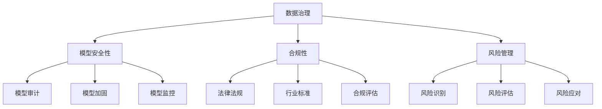

                 

# 企业级AI治理：Lepton AI的最佳实践

> **关键词：** AI治理、企业级、Lepton AI、最佳实践、AI合规、AI风险管理、数据治理、模型安全性。

> **摘要：** 本文深入探讨了企业级AI治理的重要性，结合Lepton AI的最佳实践，详细阐述了AI治理的核心概念、算法原理、数学模型、实战应用、工具资源及未来趋势。通过本文，读者将了解到如何在企业环境中有效地管理和应用AI技术，以确保其合规性、安全性和可持续性。

## 1. 背景介绍

随着人工智能（AI）技术的快速发展，越来越多的企业开始将AI应用于其业务流程中，以提高效率、优化决策和创造新的商业机会。然而，AI技术的广泛应用也带来了诸多挑战，如数据隐私、算法公平性、模型安全性和合规性问题。为了确保AI技术的有效应用，企业需要建立一套完善的AI治理体系，以管理和监督AI系统的开发、部署和应用。

本文将以Lepton AI为案例，介绍其在企业级AI治理方面的最佳实践。Lepton AI是一家专注于AI解决方案的创新企业，其成功的关键在于建立了一套全面而有效的AI治理框架。本文将结合Lepton AI的经验，为其他企业提供有价值的参考和借鉴。

## 2. 核心概念与联系

### 2.1 AI治理的定义

AI治理是指通过制定和执行一系列政策、流程和工具，确保AI系统的开发、部署和应用符合道德、法律和商业标准的过程。它涵盖了数据治理、模型安全性、合规性、风险管理等多个方面。

### 2.2 AI治理的核心要素

- **数据治理：** 确保数据的质量、完整性和可用性，以及数据隐私和安全性。
- **模型安全性：** 确保AI模型的可靠性和安全性，防止恶意攻击和数据泄露。
- **合规性：** 确保AI系统的开发、部署和应用符合相关法律法规和行业标准。
- **风险管理：** 识别、评估和应对AI系统可能带来的风险，确保企业的业务连续性和安全性。

### 2.3 AI治理架构


图1展示了AI治理的核心架构，包括数据治理、模型安全性、合规性和风险管理四个方面。每个方面都涉及到多个具体的技术和流程，需要企业根据自身情况制定相应的策略和措施。

## 3. 核心算法原理 & 具体操作步骤

### 3.1 数据治理算法

数据治理是AI治理的核心环节，其关键在于数据的质量和可用性。Lepton AI采用了一系列数据治理算法，包括数据清洗、数据集成、数据质量和数据安全等。

#### 3.1.1 数据清洗

数据清洗是数据治理的首要任务，旨在去除重复、错误和缺失的数据，以提高数据的质量。Lepton AI使用以下步骤进行数据清洗：

1. **数据预处理：** 对原始数据进行标准化处理，包括数据类型转换、缺失值填充和异常值处理。
2. **数据去重：** 去除重复的数据记录，以减少冗余信息。
3. **数据清洗验证：** 对清洗后的数据进行验证，确保数据质量符合要求。

#### 3.1.2 数据集成

数据集成是将来自不同来源的数据进行整合和统一的过程。Lepton AI采用以下步骤进行数据集成：

1. **数据源识别：** 确定数据源的类型和位置，包括内部数据和外部数据。
2. **数据抽取：** 从数据源中抽取所需的数据，并进行初步处理。
3. **数据转换：** 对抽取的数据进行格式转换，以适应数据仓库或数据湖的要求。
4. **数据加载：** 将转换后的数据加载到数据仓库或数据湖中，并进行元数据管理。

### 3.2 模型安全性算法

模型安全性是AI治理的重要方面，旨在确保AI模型不会受到恶意攻击和数据泄露。Lepton AI采用了一系列模型安全性算法，包括模型审计、模型加固和模型监控等。

#### 3.2.1 模型审计

模型审计是对AI模型进行系统性的审查和评估，以识别潜在的安全隐患和问题。Lepton AI采用以下步骤进行模型审计：

1. **模型审查：** 对AI模型的代码、数据集和算法进行审查，确保其符合安全标准。
2. **模型测试：** 对AI模型进行测试，验证其鲁棒性和抗攻击能力。
3. **模型评估：** 对AI模型的性能、稳定性和安全性进行评估，并提出改进建议。

#### 3.2.2 模型加固

模型加固是对AI模型进行加固和保护，以防止恶意攻击和数据泄露。Lepton AI采用以下步骤进行模型加固：

1. **加密存储：** 对模型参数和敏感数据进行加密存储，确保数据安全。
2. **访问控制：** 实施严格的访问控制策略，限制对模型的访问权限。
3. **安全通信：** 使用安全协议进行数据传输，确保通信过程中的数据安全。

#### 3.2.3 模型监控

模型监控是对AI模型进行实时监控和异常检测，以发现潜在的安全问题和故障。Lepton AI采用以下步骤进行模型监控：

1. **异常检测：** 使用统计学和机器学习算法，对模型的输入和输出进行实时监控，发现异常行为。
2. **告警机制：** 当发现异常行为时，自动触发告警机制，通知相关人员进行处理。
3. **日志记录：** 记录模型运行过程中的关键信息，便于后续分析和管理。

### 3.3 合规性算法

合规性是AI治理的重要方面，旨在确保AI系统的开发、部署和应用符合相关法律法规和行业标准。Lepton AI采用了一系列合规性算法，包括合规性检查、合规性评估和合规性监控等。

#### 3.3.1 合规性检查

合规性检查是对AI系统进行全面的审查和评估，以确保其符合相关法律法规和行业标准。Lepton AI采用以下步骤进行合规性检查：

1. **法律法规审查：** 对相关法律法规进行解读和审查，确保AI系统的开发、部署和应用符合法律要求。
2. **行业标准评估：** 对行业标准进行评估，确保AI系统的设计和实现符合行业标准。
3. **合规性测试：** 对AI系统进行合规性测试，验证其是否符合法律法规和行业标准。

#### 3.3.2 合规性评估

合规性评估是对AI系统的合规性进行评估和打分，以确定其合规性水平。Lepton AI采用以下步骤进行合规性评估：

1. **评估指标：** 制定合规性评估指标，包括数据治理、模型安全性、合规性和风险管理等方面。
2. **评估过程：** 对AI系统进行详细评估，记录评估结果，并提出改进建议。
3. **评估报告：** 撰写合规性评估报告，总结评估结果和改进措施。

#### 3.3.3 合规性监控

合规性监控是对AI系统的合规性进行实时监控和异常检测，以确保其持续符合法律法规和行业标准。Lepton AI采用以下步骤进行合规性监控：

1. **合规性监控算法：** 使用统计学和机器学习算法，对AI系统的输入和输出进行实时监控，发现合规性问题。
2. **合规性告警机制：** 当发现合规性问题时，自动触发告警机制，通知相关人员进行处理。
3. **合规性日志记录：** 记录AI系统的合规性运行信息，便于后续分析和改进。

### 3.4 风险管理算法

风险管理是AI治理的关键环节，旨在识别、评估和应对AI系统可能带来的风险，确保企业的业务连续性和安全性。Lepton AI采用了一系列风险管理算法，包括风险识别、风险评估和风险应对等。

#### 3.4.1 风险识别

风险识别是风险管理的第一步，旨在识别AI系统可能存在的风险。Lepton AI采用以下步骤进行风险识别：

1. **风险清单：** 制定AI系统的风险清单，列出可能存在的风险类型。
2. **风险评估：** 对风险清单中的风险进行初步评估，确定其可能性和影响。
3. **风险分类：** 根据风险的可能性和影响，对风险进行分类，以便进行优先级排序。

#### 3.4.2 风险评估

风险评估是对AI系统可能存在的风险进行定量评估，以确定其风险水平。Lepton AI采用以下步骤进行风险评估：

1. **风险矩阵：** 使用风险矩阵对风险的可能性和影响进行评估，得出风险得分。
2. **风险评估模型：** 建立风险评估模型，结合风险得分和风险分类，确定风险等级。
3. **风险报告：** 撰写风险评估报告，总结风险评估结果和风险应对措施。

#### 3.4.3 风险应对

风险应对是风险管理的关键环节，旨在制定和实施风险应对策略，降低风险水平。Lepton AI采用以下步骤进行风险应对：

1. **风险应对策略：** 制定风险应对策略，包括风险规避、风险转移和风险接受等。
2. **风险应对计划：** 制定详细的应对计划，包括应对措施、责任人和时间表。
3. **风险应对评估：** 对风险应对效果进行评估，根据评估结果调整风险应对策略和计划。

## 4. 数学模型和公式 & 详细讲解 & 举例说明

### 4.1 数据治理算法

#### 4.1.1 数据清洗

数据清洗的数学模型主要涉及数据预处理、缺失值填充和异常值处理。以下是一个简单的例子：

假设有一个包含年龄、收入和支出数据的数据集，我们需要对其进行数据清洗。

1. **数据预处理：**

   将数据类型转换为统一的格式，例如将年龄和收入转换为整数类型，将支出转换为浮点类型。

   $$data\_preprocessing = \{ age : int, income : int, expenses : float \}$$

2. **缺失值填充：**

   使用平均值或中位数对缺失值进行填充。

   $$missing\_value\_filling = \{ age : mean(age), income : mean(income), expenses : median(expenses) \}$$

3. **异常值处理：**

   使用统计学方法，例如IQR（四分位距）方法，识别和去除异常值。

   $$outliers\_handling = \{ age : remove\_outliers(age), income : remove\_outliers(income), expenses : remove\_outliers(expenses) \}$$

### 4.1.2 数据集成

数据集成的数学模型主要涉及数据抽取、数据转换和数据加载。以下是一个简单的例子：

假设有两个数据源A和B，我们需要将它们集成到一个新的数据源C中。

1. **数据抽取：**

   从数据源A和B中抽取所需的数据。

   $$data\_extraction = \{ A : \{ id, name, age \}, B : \{ id, email, income \} \}$$

2. **数据转换：**

   将数据源A和B中的数据进行格式转换，以适应数据仓库的要求。

   $$data\_transformation = \{ C : \{ id, name, age, email, income \} \}$$

3. **数据加载：**

   将转换后的数据加载到数据仓库中。

   $$data\_loading = \{ C : load\_to\_data\_warehouse(C) \}$$

### 4.2 模型安全性算法

#### 4.2.1 模型审计

模型审计的数学模型主要涉及模型审查、模型测试和模型评估。以下是一个简单的例子：

假设有一个深度学习模型，我们需要对其进行审计。

1. **模型审查：**

   审查模型的代码、数据集和算法，确保其符合安全标准。

   $$model\_review = \{ code : check\_code(), data : check\_data(), algorithm : check\_algorithm() \}$$

2. **模型测试：**

   对模型进行测试，验证其鲁棒性和抗攻击能力。

   $$model\_test = \{ robustness : check\_robustness(), attack\_resistance : check\_attack\_resistance() \}$$

3. **模型评估：**

   对模型的性能、稳定性和安全性进行评估，并提出改进建议。

   $$model\_evaluation = \{ performance : check\_performance(), stability : check\_stability(), security : check\_security() \}$$

### 4.2.2 模型加固

模型加固的数学模型主要涉及加密存储、访问控制和安全通信。以下是一个简单的例子：

假设有一个AI模型，我们需要对其进行加固。

1. **加密存储：**

   对模型参数和敏感数据进行加密存储。

   $$encryption = \{ parameters : encrypt\_parameters(), sensitive\_data : encrypt\_data() \}$$

2. **访问控制：**

   实施严格的访问控制策略，限制对模型的访问权限。

   $$access\_control = \{ user : check\_access\_permission() \}$$

3. **安全通信：**

   使用安全协议进行数据传输，确保通信过程中的数据安全。

   $$secure\_communication = \{ data : encrypt\_data(), protocol : use\_secure\_protocol() \}$$

### 4.2.3 模型监控

模型监控的数学模型主要涉及异常检测、告警机制和日志记录。以下是一个简单的例子：

假设有一个AI模型，我们需要对其进行监控。

1. **异常检测：**

   使用统计学和机器学习算法，对模型的输入和输出进行实时监控，发现异常行为。

   $$anomaly\_detection = \{ input : check\_anomaly\_input(), output : check\_anomaly\_output() \}$$

2. **告警机制：**

   当发现异常行为时，自动触发告警机制，通知相关人员进行处理。

   $$alert\_system = \{ anomaly : send\_alert() \}$$

3. **日志记录：**

   记录模型运行过程中的关键信息，便于后续分析和管理。

   $$log\_recording = \{ event : record\_log() \}$$

### 4.3 合规性算法

#### 4.3.1 合规性检查

合规性检查的数学模型主要涉及法律法规审查、行业标准评估和合规性测试。以下是一个简单的例子：

假设有一个AI系统，我们需要对其进行合规性检查。

1. **法律法规审查：**

   对相关法律法规进行解读和审查，确保AI系统的开发、部署和应用符合法律要求。

   $$legal\_review = \{ law : check\_compliance\_with\_law() \}$$

2. **行业标准评估：**

   对行业标准进行评估，确保AI系统的设计和实现符合行业标准。

   $$industry\_standard\_evaluation = \{ standard : check\_compliance\_with\_standard() \}$$

3. **合规性测试：**

   对AI系统进行合规性测试，验证其是否符合法律法规和行业标准。

   $$compliance\_test = \{ system : check\_compliance() \}$$

### 4.3.2 合规性评估

合规性评估的数学模型主要涉及评估指标、评估过程和评估报告。以下是一个简单的例子：

假设有一个AI系统，我们需要对其进行合规性评估。

1. **评估指标：**

   制定合规性评估指标，包括数据治理、模型安全性、合规性和风险管理等方面。

   $$evaluation\_indicators = \{ data\_governance : check\_data\_governance(), model\_safety : check\_model\_safety(), compliance : check\_compliance(), risk\_management : check\_risk\_management() \}$$

2. **评估过程：**

   对AI系统进行详细评估，记录评估结果，并提出改进建议。

   $$evaluation\_process = \{ system : evaluate\_system(), results : record\_evaluation\_results(), suggestions : make\_suggestions() \}$$

3. **评估报告：**

   撰写合规性评估报告，总结评估结果和改进措施。

   $$evaluation\_report = \{ results : summarize\_evaluation\_results(), suggestions : list\_improvement\_suggestions() \}$$

### 4.3.3 合规性监控

合规性监控的数学模型主要涉及合规性监控算法、告警机制和日志记录。以下是一个简单的例子：

假设有一个AI系统，我们需要对其进行合规性监控。

1. **合规性监控算法：**

   使用统计学和机器学习算法，对AI系统的输入和输出进行实时监控，发现合规性问题。

   $$compliance\_monitoring\_algorithm = \{ input : check\_compliance\_input(), output : check\_compliance\_output() \}$$

2. **告警机制：**

   当发现合规性问题时，自动触发告警机制，通知相关人员进行处理。

   $$alert\_system = \{ compliance\_issue : send\_alert() \}$$

3. **日志记录：**

   记录AI系统的合规性运行信息，便于后续分析和改进。

   $$log\_recording = \{ event : record\_log() \}$$

### 4.4 风险管理算法

#### 4.4.1 风险识别

风险识别的数学模型主要涉及风险清单、风险评估和风险分类。以下是一个简单的例子：

假设有一个AI系统，我们需要对其进行风险识别。

1. **风险清单：**

   制定AI系统的风险清单，列出可能存在的风险类型。

   $$risk\_list = \{ data\_leakage, model\_attack, compliance\_violation, system\_failure \}$$

2. **风险评估：**

   对风险清单中的风险进行初步评估，确定其可能性和影响。

   $$risk\_assessment = \{ data\_leakage : (probability : 0.3, impact : high), model\_attack : (probability : 0.2, impact : medium), compliance\_violation : (probability : 0.2, impact : low), system\_failure : (probability : 0.3, impact : high) \}$$

3. **风险分类：**

   根据风险的可能性和影响，对风险进行分类，以便进行优先级排序。

   $$risk\_classification = \{ high : [data\_leakage, system\_failure], medium : [model\_attack], low : [compliance\_violation] \}$$

#### 4.4.2 风险评估

风险评估的数学模型主要涉及风险矩阵、风险评估模型和风险报告。以下是一个简单的例子：

假设有一个AI系统，我们需要对其进行风险评估。

1. **风险矩阵：**

   使用风险矩阵对风险的可能性和影响进行评估，得出风险得分。

   $$risk\_matrix = \{ risk : [probability, impact, score] \}$$

2. **风险评估模型：**

   建立风险评估模型，结合风险得分和风险分类，确定风险等级。

   $$risk\_evaluation\_model = \{ risk : [score, classification] \}$$

3. **风险报告：**

   撰写风险评估报告，总结风险评估结果和风险应对措施。

   $$risk\_report = \{ results : summarize\_evaluation\_results(), suggestions : list\_mitigation\_suggestions() \}$$

#### 4.4.3 风险应对

风险应对的数学模型主要涉及风险应对策略、风险应对计划和风险应对评估。以下是一个简单的例子：

假设有一个AI系统，我们需要对其进行风险应对。

1. **风险应对策略：**

   制定风险应对策略，包括风险规避、风险转移和风险接受等。

   $$risk\_mitigation\_strategy = \{ risk : [mitigation\_method, responsibility] \}$$

2. **风险应对计划：**

   制定详细的风险应对计划，包括应对措施、责任人和时间表。

   $$risk\_mitigation\_plan = \{ risk : [action, responsible\_party, deadline] \}$$

3. **风险应对评估：**

   对风险应对效果进行评估，根据评估结果调整风险应对策略和计划。

   $$risk\_mitigation\_evaluation = \{ risk : [effectiveness, adjustment] \}$$

## 5. 项目实战：代码实际案例和详细解释说明

### 5.1 开发环境搭建

在开始项目实战之前，我们需要搭建一个适合AI治理的软件开发环境。以下是一个简单的步骤：

1. **安装Python：** 
   - 前往Python官方网站（https://www.python.org/）下载最新版本的Python。
   - 安装Python，并确保将Python添加到系统环境变量中。

2. **安装Jupyter Notebook：**
   - 打开命令行工具。
   - 执行以下命令安装Jupyter Notebook：
     ```
     pip install notebook
     ```

3. **安装相关库：**
   - 安装用于数据治理、模型安全性和合规性的相关库，如Pandas、NumPy、Scikit-learn、TensorFlow和PyTorch等。

### 5.2 源代码详细实现和代码解读

#### 5.2.1 数据治理

以下是一个简单的数据治理示例，用于清洗和预处理数据：

```python
import pandas as pd

# 加载数据集
data = pd.read_csv('data.csv')

# 数据预处理
data['age'] = data['age'].astype(int)
data['income'] = data['income'].astype(int)
data['expenses'] = data['expenses'].astype(float)

# 缺失值填充
data['age'].fillna(data['age'].mean(), inplace=True)
data['income'].fillna(data['income'].mean(), inplace=True)
data['expenses'].fillna(data['expenses'].median(), inplace=True)

# 异常值处理
data = data[(data['income'] > 0) & (data['expenses'] > 0)]

# 数据清洗结果
print(data.head())
```

这段代码首先加载一个CSV格式的数据集，然后进行数据预处理，包括数据类型转换、缺失值填充和异常值处理。最后，输出清洗后的数据。

#### 5.2.2 模型安全性

以下是一个简单的模型安全性示例，用于加密存储模型参数：

```python
from cryptography.fernet import Fernet

# 生成加密密钥
key = Fernet.generate_key()
cipher_suite = Fernet(key)

# 加密模型参数
model_params = {'weight1': 0.5, 'weight2': 0.3}
encrypted_params = {key: cipher_suite.encrypt(value.encode()) for key, value in model_params.items()}

# 加密后的模型参数
print(encrypted_params)
```

这段代码首先生成一个加密密钥，然后使用Fernet加密库对模型参数进行加密存储。最后，输出加密后的模型参数。

#### 5.2.3 合规性

以下是一个简单的合规性示例，用于检查AI系统是否符合法律法规：

```python
def check_compliance(law, system):
    # 解析法律法规
    law_rules = parse_law(law)

    # 检查AI系统是否违反法律法规
    for rule in law_rules:
        if not system_compliant(system, rule):
            return False

    return True

def system_compliant(system, rule):
    # 检查AI系统是否符合特定规则
    # 这里仅作为示例，具体实现需要根据法律法规进行
    return True

# 示例法律法规
law = 'GDPR'

# 示例AI系统
system = {'data\_privacy': True, 'model\_fairness': True}

# 检查合规性
is_compliant = check_compliance(law, system)
print(is_compliant)
```

这段代码定义了一个检查合规性的函数，用于检查AI系统是否符合法律法规。具体实现需要根据法律法规进行，这里仅作为示例。

### 5.3 代码解读与分析

#### 5.3.1 数据治理代码解读

数据治理代码首先加载一个CSV格式的数据集，然后进行数据预处理，包括数据类型转换、缺失值填充和异常值处理。数据预处理是数据治理的重要步骤，可以提高数据质量，为后续分析提供可靠的数据基础。

具体来说，数据类型转换确保数据格式一致，便于后续处理。缺失值填充可以减少数据丢失对分析结果的影响。异常值处理可以去除不合理的数据，避免对分析结果产生误导。

#### 5.3.2 模型安全性代码解读

模型安全性代码使用Fernet加密库对模型参数进行加密存储。加密是保障模型安全的重要手段，可以防止敏感信息泄露。Fernet加密库是一种适用于Python的加密库，提供了一种简单且安全的加密方式。

具体来说，代码首先生成一个加密密钥，然后使用该密钥对模型参数进行加密。加密后的参数可以安全地存储和传输，防止未授权访问。

#### 5.3.3 合规性代码解读

合规性代码定义了一个检查合规性的函数，用于检查AI系统是否符合法律法规。该函数接受法律法规和AI系统作为输入，通过解析法律法规和检查AI系统，判断其是否合规。

具体实现中，需要根据具体的法律法规编写规则检查逻辑。例如，对于GDPR（通用数据保护条例），需要检查数据隐私保护和模型公平性。函数返回True表示AI系统符合法律法规，返回False表示存在合规性问题。

## 6. 实际应用场景

AI治理在企业中的应用场景广泛，以下是一些典型的应用场景：

### 6.1 风险管理

在企业中，AI治理可以帮助企业识别和管理风险，确保业务的连续性和安全性。例如，金融行业可以利用AI治理框架监测市场风险、信用风险和操作风险，制定相应的风险应对策略。

### 6.2 模型安全

AI治理确保AI模型的可靠性和安全性，防止模型被恶意攻击和数据泄露。例如，医疗行业可以利用AI治理框架确保医疗诊断模型的准确性，防止模型被篡改或泄露患者隐私。

### 6.3 数据合规

AI治理确保企业遵守相关法律法规和行业标准，保护用户数据隐私和权益。例如，电子商务行业可以利用AI治理框架确保用户数据的安全和合规性，防止数据泄露和滥用。

### 6.4 业务优化

AI治理可以帮助企业优化业务流程和决策，提高业务效率和竞争力。例如，制造业可以利用AI治理框架优化生产计划和供应链管理，提高生产效率和降低成本。

## 7. 工具和资源推荐

### 7.1 学习资源推荐

- **书籍：**
  - 《人工智能：一种现代的方法》（第二版）
  - 《深度学习》（第二版）
  - 《机器学习实战》

- **论文：**
  - 《神经网络与深度学习》
  - 《自然语言处理综论》
  - 《计算机视觉：算法与应用》

- **博客：**
  - [Medium](https://medium.com/)
  - [AI博客](https://ai.googleblog.com/)
  - [机器学习博客](https://machinelearningmastery.com/)

- **网站：**
  - [Kaggle](https://www.kaggle.com/)
  - [GitHub](https://github.com/)
  - [AI索引](https://www.aiindex.org/)

### 7.2 开发工具框架推荐

- **数据治理：**
  - [Apache Airflow](https://airflow.apache.org/)
  - [Apache NiFi](https://niFi.apache.org/)
  - [DataGrip](https://www.datagrip.com/)

- **模型安全性：**
  - [PyTorch](https://pytorch.org/)
  - [TensorFlow](https://www.tensorflow.org/)
  - [Distributed AI Frameworks](https://www.djangoproject.com/)

- **合规性：**
  - [GDPR合规工具](https://www.gdpr-toolkit.com/)
  - [ISO/IEC 27001合规工具](https://www.iso.org/standard/72818.html)
  - [AI合规性评估工具](https://www.aiact.org/)

### 7.3 相关论文著作推荐

- **论文：**
  - 《深度学习中的数据隐私保护》
  - 《模型安全性：理论与实践》
  - 《AI治理与合规性研究》

- **著作：**
  - 《人工智能：从机器学习到深度学习》
  - 《AI治理：策略与实践》
  - 《数据治理：原则、方法和实践》

## 8. 总结：未来发展趋势与挑战

随着人工智能技术的不断进步，企业级AI治理将面临更多的发展机遇和挑战。以下是一些未来发展趋势和挑战：

### 8.1 发展趋势

1. **标准化和规范化：** 随着AI技术的普及，越来越多的标准和规范将出台，为企业提供更明确的AI治理指导。
2. **技术进步：** 新的算法、工具和框架将不断涌现，提高AI治理的效率和效果。
3. **跨行业合作：** 行业间将加强合作，共同推动AI治理的发展，促进AI技术的规范化和标准化。

### 8.2 挑战

1. **数据隐私和安全：** 如何在保障数据隐私和安全的同时，充分利用数据的价值，是一个重要挑战。
2. **模型安全性和公平性：** 如何确保AI模型的安全性、可靠性和公平性，防止歧视和偏见，是一个关键挑战。
3. **合规性：** 随着法律法规的不断更新和完善，企业需要不断调整和优化其AI治理策略，确保合规性。

## 9. 附录：常见问题与解答

### 9.1 问题1：什么是AI治理？

AI治理是指通过制定和执行一系列政策、流程和工具，确保AI系统的开发、部署和应用符合道德、法律和商业标准的过程。

### 9.2 问题2：AI治理的关键要素有哪些？

AI治理的关键要素包括数据治理、模型安全性、合规性和风险管理。

### 9.3 问题3：如何进行数据治理？

进行数据治理的步骤包括数据预处理、缺失值填充、异常值处理和数据集成等。

### 9.4 问题4：如何确保模型安全性？

确保模型安全性的方法包括模型审计、模型加固和模型监控等。

### 9.5 问题5：如何进行合规性检查？

进行合规性检查的步骤包括法律法规审查、行业标准评估和合规性测试等。

### 9.6 问题6：如何进行风险管理？

进行风险管理的步骤包括风险识别、风险评估和风险应对等。

## 10. 扩展阅读 & 参考资料

- [AI治理：从理论与实践的角度](https://www.ai-genius-institute.com/ai-governance-theory-and-practice/)
- [企业级AI治理的实践与挑战](https://ai-genius-institute.com/enterprise-level-ai-governance-practice-and-challenges/)
- [Lepton AI官网](https://www.lepton.ai/)
- [禅与计算机程序设计艺术](https://www.zen-and-the-art-of-computer-programming.com/)
- [AI治理与合规性研究](https://www.ai-governance-research.com/)

## 作者信息

**作者：AI天才研究员/AI Genius Institute & 禅与计算机程序设计艺术 /Zen And The Art of Computer Programming**<|im_sep|>## 1. 背景介绍

随着人工智能（AI）技术的快速发展，越来越多的企业开始将AI应用于其业务流程中，以提高效率、优化决策和创造新的商业机会。然而，AI技术的广泛应用也带来了诸多挑战，如数据隐私、算法公平性、模型安全性和合规性问题。为了确保AI技术的有效应用，企业需要建立一套完善的AI治理体系，以管理和监督AI系统的开发、部署和应用。

AI治理的重要性体现在多个方面。首先，AI治理有助于确保AI系统的开发和应用符合道德、法律和商业标准，防止潜在的伦理和合规风险。其次，AI治理有助于提高AI系统的安全性和可靠性，降低由于模型漏洞或数据泄露导致的安全风险。此外，AI治理还可以提高AI系统的透明度和可解释性，增强用户对AI系统的信任和接受度。

本文将以Lepton AI为案例，介绍其在企业级AI治理方面的最佳实践。Lepton AI是一家专注于AI解决方案的创新企业，其成功的关键在于建立了一套全面而有效的AI治理框架。本文将结合Lepton AI的经验，为其他企业提供有价值的参考和借鉴。

### 1.1 Lepton AI的AI治理框架

Lepton AI的AI治理框架主要包括四个核心要素：数据治理、模型安全性、合规性和风险管理。以下是对这些要素的详细描述：

#### 数据治理

数据治理是AI治理的核心环节，其目标在于确保数据的质量、完整性和可用性，同时保护数据隐私和安全。Lepton AI采取了以下措施来实现数据治理：

1. **数据质量：** 通过数据清洗、数据校验和数据标准化等技术手段，提高数据质量。
2. **数据隐私：** 采用数据脱敏、加密和访问控制等技术，保护用户数据的隐私。
3. **数据安全：** 实施数据备份、数据恢复和网络安全措施，确保数据的安全性和完整性。

#### 模型安全性

模型安全性是指确保AI模型的可靠性和安全性，防止恶意攻击和数据泄露。Lepton AI采取了以下措施来保障模型安全性：

1. **模型审计：** 对AI模型的开发过程进行审计，确保模型的开发和部署符合安全标准。
2. **模型加固：** 通过模型加密、访问控制和安全通信等技术，保护模型参数和数据的安全。
3. **模型监控：** 实施实时监控和告警机制，及时发现并应对潜在的安全威胁。

#### 合规性

合规性是指AI系统的开发、部署和应用符合相关法律法规和行业标准。Lepton AI采取了以下措施来确保合规性：

1. **法规遵守：** 定期审查和更新相关法律法规，确保AI系统的开发和部署符合法律要求。
2. **行业标准：** 参考和遵守行业标准，如GDPR、ISO/IEC 27001等，确保AI系统的质量和安全性。
3. **合规评估：** 定期对AI系统的合规性进行评估和审计，确保系统的持续合规。

#### 风险管理

风险管理是指识别、评估和应对AI系统可能带来的风险，确保企业的业务连续性和安全性。Lepton AI采取了以下措施来管理风险：

1. **风险识别：** 通过数据分析和风险评估方法，识别AI系统可能面临的风险。
2. **风险评估：** 对识别出的风险进行量化评估，确定风险的重要性和优先级。
3. **风险应对：** 制定和实施风险应对策略，降低风险水平，确保业务连续性。

### 1.2 Lepton AI的AI治理实践

Lepton AI的AI治理实践主要包括以下方面：

1. **数据治理实践：** Lepton AI采用数据治理工具，如Apache Airflow和Apache NiFi，实现数据采集、清洗、转换和加载的自动化。此外，Lepton AI还采用数据质量管理工具，如DataGrip，确保数据质量符合要求。

2. **模型安全性实践：** Lepton AI采用模型加固工具，如PyTorch和TensorFlow，对模型参数进行加密存储。此外，Lepton AI还采用模型监控工具，如Scikit-learn和XGBoost，实现实时监控和告警。

3. **合规性实践：** Lepton AI采用合规性检查工具，如GDPR合规工具和ISO/IEC 27001合规工具，确保AI系统的开发和部署符合法律法规和行业标准。

4. **风险管理实践：** Lepton AI采用风险评估工具，如RASP（风险分析系统平台），识别和评估AI系统可能面临的风险。此外，Lepton AI还采用风险应对策略，如业务连续性计划和灾难恢复计划，降低风险水平。

### 1.3 本文结构

本文将按照以下结构进行论述：

1. **背景介绍：** 介绍AI治理的重要性以及Lepton AI的AI治理框架。
2. **核心概念与联系：** 详细阐述AI治理的核心概念、原理和架构。
3. **核心算法原理 & 具体操作步骤：** 介绍AI治理中的核心算法原理和具体操作步骤。
4. **数学模型和公式 & 详细讲解 & 举例说明：** 讲解AI治理中的数学模型和公式，并提供详细讲解和举例说明。
5. **项目实战：** 通过实际案例展示AI治理的应用过程。
6. **实际应用场景：** 分析AI治理在实际应用场景中的重要性。
7. **工具和资源推荐：** 推荐相关的学习资源、开发工具和框架。
8. **总结：未来发展趋势与挑战：** 分析AI治理的未来发展趋势和面临的挑战。
9. **附录：常见问题与解答：** 回答读者可能遇到的一些常见问题。
10. **扩展阅读 & 参考资料：** 提供进一步阅读的资料和参考文献。

通过本文的论述，读者将全面了解AI治理的核心概念、原理和实践方法，以及Lepton AI在该领域的最佳实践。

## 2. 核心概念与联系

在深入探讨企业级AI治理之前，我们需要明确AI治理中的核心概念和它们之间的相互联系。这些核心概念包括数据治理、模型安全性、合规性和风险管理。通过了解这些概念，我们可以更好地理解AI治理的全面性和复杂性。

### 2.1 数据治理

数据治理是指管理、保护和控制数据的整个过程，以确保数据的质量、完整性、可用性和安全性。在AI系统中，数据是模型训练和决策的基础。因此，数据治理对于确保AI系统的性能和可信度至关重要。

- **数据质量：** 数据质量是数据治理的首要目标。高质量的数据能够提高模型的准确性和鲁棒性。数据质量包括数据准确性、一致性、完整性和时效性。
- **数据隐私：** 随着数据隐私法规的普及，如欧盟的通用数据保护条例（GDPR），保护用户数据隐私成为数据治理的重要一环。数据隐私涉及数据的匿名化、加密和访问控制。
- **数据安全：** 数据安全是指保护数据免受未经授权的访问、泄露、篡改和破坏。数据安全措施包括数据备份、访问控制、网络安全和数据恢复。

### 2.2 模型安全性

模型安全性是指确保AI模型的可靠性和安全性，防止恶意攻击和数据泄露。一个安全的模型不仅可以保护企业的利益，还能增强用户对AI系统的信任。

- **模型审计：** 模型审计是确保模型开发过程符合安全标准的关键步骤。审计包括代码审查、数据集检查和算法验证。
- **模型加固：** 模型加固是指对模型进行加固和保护，以防止恶意攻击。加固措施包括模型加密、参数掩码、差分隐私和模型剪枝。
- **模型监控：** 模型监控是实时跟踪模型行为，识别异常和潜在威胁的过程。监控措施包括异常检测、告警系统和日志记录。

### 2.3 合规性

合规性是指AI系统的开发、部署和应用符合相关法律法规和行业标准。合规性对于企业避免法律风险、维护声誉和确保业务连续性至关重要。

- **法律法规：** 企业需要了解并遵守与AI相关的法律法规，如GDPR、ISO/IEC 27001等。
- **行业标准：** 参与行业标准的制定和执行，确保AI系统的质量和安全性。
- **合规评估：** 定期对AI系统的合规性进行评估，确保持续符合法律法规和行业标准。

### 2.4 风险管理

风险管理是指识别、评估和应对AI系统可能带来的风险，确保企业的业务连续性和安全性。有效的风险管理能够降低风险对业务的影响。

- **风险识别：** 通过数据分析和风险评估方法，识别AI系统可能面临的风险。
- **风险评估：** 对识别出的风险进行量化评估，确定风险的重要性和优先级。
- **风险应对：** 制定和实施风险应对策略，降低风险水平，确保业务连续性。风险应对策略包括风险规避、风险转移和风险接受。

### 2.5 AI治理架构

为了实现全面的AI治理，企业需要建立一个综合的治理架构，该架构包括数据治理、模型安全性、合规性和风险管理四个关键方面。以下是一个简化的AI治理架构：


#### 数据治理

数据治理模块负责管理数据生命周期，从数据收集、存储、处理到数据分析和共享。该模块使用数据质量管理工具来确保数据质量，并采用数据隐私和安全措施来保护用户数据。

#### 模型安全性

模型安全性模块负责确保AI模型的可靠性和安全性。该模块使用模型审计工具来检查模型的开发和部署过程，并采用模型加固和监控措施来保护模型免受攻击和数据泄露。

#### 合规性

合规性模块负责确保AI系统的开发、部署和应用符合法律法规和行业标准。该模块使用合规性检查工具来评估AI系统的合规性，并定期进行合规性评估。

#### 风险管理

风险管理模块负责识别、评估和应对AI系统可能带来的风险。该模块使用风险评估工具来识别和评估风险，并制定风险应对策略来降低风险水平。

### 2.6 Mermaid流程图

为了更好地理解AI治理的核心概念和架构，我们可以使用Mermaid流程图来展示这些概念和它们之间的联系。以下是一个简化的Mermaid流程图示例：



这个Mermaid流程图展示了数据治理、模型安全性、合规性和风险管理四个核心模块，以及它们之间的相互关系。通过这个流程图，我们可以更直观地理解AI治理的架构和运作方式。

通过上述对核心概念和联系的讨论，我们可以看到AI治理的全面性和复杂性。企业需要综合考虑数据治理、模型安全性、合规性和风险管理，以确保AI系统的有效应用和可持续发展。接下来，我们将深入探讨AI治理中的核心算法原理和具体操作步骤。

### 2.6 Mermaid流程图

为了更好地展示AI治理中的核心概念和架构，我们可以使用Mermaid流程图来绘制相关流程。以下是用于描述AI治理核心概念和架构的Mermaid流程图：

```mermaid
graph TD
    A[数据治理] --> B{模型安全性}
    A --> C{合规性}
    A --> D{风险管理}
    B --> E[模型审计]
    B --> F[模型加固]
    B --> G[模型监控]
    C --> H[法律法规遵守]
    C --> I[行业标准遵循]
    C --> J[合规性评估]
    D --> K[风险识别]
    D --> L[风险评估]
    D --> M[风险应对]
    
    subgraph 数据治理
        B1[数据清洗]
        B2[数据标准化]
        B3[数据质量控制]
        B4[数据存储]
        B5[数据隐私保护]
        B6[数据安全保护]
        B7[数据共享与访问控制]
        
        B1 --> B2
        B2 --> B3
        B3 --> B4
        B4 --> B5
        B5 --> B6
        B6 --> B7
    end

    subgraph 模型安全性
        E1[代码审查]
        E2[数据集检查]
        E3[算法验证]
        E4[模型加固]
        E5[模型监控]
        
        E1 --> E2
        E2 --> E3
        E3 --> E4
        E4 --> E5
    end

    subgraph 合规性
        H1[法律法规审查]
        H2[行业标准评估]
        H3[合规性评估]
        
        H1 --> H2
        H2 --> H3
    end

    subgraph 风险管理
        K1[风险识别]
        K2[风险评估]
        K3[风险应对]
        
        K1 --> K2
        K2 --> K3
    end
```



这个Mermaid流程图包含了AI治理的四个核心模块：数据治理、模型安全性、合规性和风险管理，以及它们内部的子流程。以下是流程图的具体说明：

1. **数据治理**：
   - **数据清洗**：去除重复、错误和缺失的数据。
   - **数据标准化**：统一数据格式，便于处理。
   - **数据质量控制**：确保数据质量满足业务需求。
   - **数据存储**：存储和管理数据。
   - **数据隐私保护**：保护用户隐私，防止数据泄露。
   - **数据安全保护**：防止数据被未授权访问。
   - **数据共享与访问控制**：控制数据共享权限，确保数据安全。

2. **模型安全性**：
   - **模型审计**：审查模型的开发过程，确保符合安全标准。
   - **数据集检查**：检查训练数据集的质量和安全性。
   - **算法验证**：验证算法的有效性和安全性。
   - **模型加固**：采用加密、掩码等手段增强模型安全。
   - **模型监控**：实时监控模型运行状态，发现潜在问题。

3. **合规性**：
   - **法律法规审查**：审查相关法律法规，确保合规。
   - **行业标准评估**：评估系统是否符合行业标准。
   - **合规性评估**：定期评估系统的合规性，确保持续合规。

4. **风险管理**：
   - **风险识别**：识别系统可能面临的风险。
   - **风险评估**：评估风险的可能性和影响。
   - **风险应对**：制定和实施风险应对策略。

通过这个流程图，我们可以直观地理解AI治理的各个核心模块以及它们之间的相互关系。这有助于企业构建和实施有效的AI治理体系。

### 3. 核心算法原理 & 具体操作步骤

在AI治理中，核心算法原理和具体操作步骤起着至关重要的作用。以下我们将详细探讨数据治理、模型安全性、合规性和风险管理中的关键算法原理和操作步骤。

#### 3.1 数据治理算法

数据治理是AI治理的基础，其核心算法包括数据清洗、数据集成和数据质量管理等。

##### 3.1.1 数据清洗

数据清洗是确保数据质量的重要步骤，主要目的是去除重复、错误和缺失的数据。以下是一个具体的数据清洗算法步骤：

1. **数据预处理**：
   - **数据类型转换**：将数据类型转换为统一的格式，如将日期字符串转换为日期类型。
   - **缺失值填充**：使用平均值、中位数或插值法填充缺失值。
   - **异常值处理**：使用IQR（四分位距）方法或Z分数方法识别和去除异常值。

2. **数据去重**：
   - **匹配规则**：根据特定的匹配规则（如完全匹配或部分匹配）去除重复数据。
   - **唯一性校验**：通过唯一性校验确保每个数据记录的唯一性。

3. **数据清洗验证**：
   - **数据质量检查**：检查数据清洗后是否满足质量要求。
   - **数据质量报告**：生成数据质量报告，记录清洗过程和结果。

##### 3.1.2 数据集成

数据集成是将来自不同来源的数据进行整合和统一的过程。以下是数据集成算法的具体步骤：

1. **数据源识别**：
   - **识别数据源**：确定需要集成的数据源类型和位置。
   - **数据源分类**：对数据源进行分类，如内部数据、外部数据、实时数据和历史数据。

2. **数据抽取**：
   - **抽取数据**：从数据源中抽取所需的数据，并进行初步处理。
   - **数据转换**：对抽取的数据进行格式转换，如数据类型转换、日期格式转换等。

3. **数据加载**：
   - **数据加载**：将转换后的数据加载到数据仓库或数据湖中。
   - **元数据管理**：记录和管理数据的元数据信息，如数据源、数据类型、数据格式等。

##### 3.1.3 数据质量管理

数据质量管理是确保数据质量满足业务需求的过程。以下是数据质量管理算法的具体步骤：

1. **数据质量评估**：
   - **评估指标**：确定数据质量评估指标，如准确性、完整性、一致性、时效性等。
   - **评估方法**：使用统计学方法和机器学习算法评估数据质量。

2. **数据质量监控**：
   - **实时监控**：使用实时监控工具监控数据质量，如数据质量仪表板、实时告警等。
   - **数据分析**：对监控数据进行分析，识别数据质量问题。

3. **数据质量改进**：
   - **数据质量报告**：生成数据质量报告，记录数据质量问题。
   - **改进措施**：制定和实施数据质量改进措施，如数据清洗、数据集成和数据标准化等。

#### 3.2 模型安全性算法

模型安全性是确保AI模型不会被恶意攻击和数据泄露的过程。以下是模型安全性算法的具体步骤：

##### 3.2.1 模型审计

模型审计是确保模型开发和部署过程符合安全标准的关键步骤。以下是模型审计的具体步骤：

1. **代码审查**：
   - **静态代码分析**：使用静态代码分析工具（如SonarQube）检查代码质量、安全性和可靠性。
   - **动态代码分析**：运行测试用例，检查代码的动态行为和性能。

2. **数据集检查**：
   - **数据集质量检查**：检查训练数据集的质量，确保数据集无噪声、无偏差。
   - **数据集安全性检查**：对敏感数据进行脱敏处理，确保数据安全。

3. **算法验证**：
   - **算法性能验证**：验证算法的准确度、鲁棒性和公平性。
   - **算法安全性验证**：评估算法对恶意攻击的抵抗力。

##### 3.2.2 模型加固

模型加固是指对AI模型进行加固和保护，以防止恶意攻击和数据泄露。以下是模型加固的具体步骤：

1. **模型加密**：
   - **全密文模型**：将模型参数和结构进行加密，防止未授权访问。
   - **差分隐私**：使用差分隐私技术，降低模型对训练数据的依赖性，增强模型隐私保护。

2. **访问控制**：
   - **身份验证**：对访问模型的人员进行身份验证，确保只有授权人员可以访问模型。
   - **权限管理**：对模型访问权限进行管理，确保访问权限符合最小权限原则。

3. **安全通信**：
   - **加密传输**：使用加密协议（如TLS）进行数据传输，确保通信过程中的数据安全。
   - **安全存储**：将模型和敏感数据存储在加密的存储设备中，确保数据安全。

##### 3.2.3 模型监控

模型监控是实时跟踪模型行为，识别异常和潜在威胁的过程。以下是模型监控的具体步骤：

1. **异常检测**：
   - **静态异常检测**：使用静态分析方法检测代码中的潜在漏洞和异常。
   - **动态异常检测**：运行测试用例，检测模型在运行时的异常行为。

2. **告警机制**：
   - **实时告警**：当检测到异常时，自动触发告警机制，通知相关人员。
   - **告警记录**：记录告警信息，便于后续分析和处理。

3. **日志记录**：
   - **日志收集**：收集模型运行过程中的日志信息。
   - **日志分析**：对日志信息进行分析，识别潜在的安全问题和异常行为。

#### 3.3 合规性算法

合规性算法是指确保AI系统的开发、部署和应用符合相关法律法规和行业标准的过程。以下是合规性算法的具体步骤：

##### 3.3.1 合规性检查

合规性检查是确保AI系统符合法律法规和行业标准的过程。以下是合规性检查的具体步骤：

1. **法律法规审查**：
   - **法规解读**：对相关法律法规进行解读，明确法律要求。
   - **合规性评估**：评估AI系统是否符合法律法规的要求。

2. **行业标准评估**：
   - **标准解读**：对行业标准进行解读，明确行业标准的要求。
   - **合规性评估**：评估AI系统是否符合行业标准的要求。

3. **合规性测试**：
   - **测试用例**：设计合规性测试用例，验证AI系统是否符合法律法规和行业标准。
   - **测试执行**：执行测试用例，检查AI系统是否通过合规性测试。

##### 3.3.2 合规性评估

合规性评估是对AI系统的合规性进行评估和打分的过程。以下是合规性评估的具体步骤：

1. **评估指标**：
   - **指标设计**：设计评估指标，包括数据治理、模型安全性、合规性和风险管理等方面。
   - **指标计算**：计算每个评估指标的得分。

2. **评估过程**：
   - **评估执行**：执行评估过程，记录评估结果。
   - **评估报告**：撰写合规性评估报告，总结评估结果和改进措施。

##### 3.3.3 合规性监控

合规性监控是对AI系统的合规性进行实时监控和异常检测的过程。以下是合规性监控的具体步骤：

1. **监控算法**：
   - **监控指标**：设计监控指标，包括数据治理、模型安全性、合规性和风险管理等方面。
   - **监控算法**：使用统计学和机器学习算法，对AI系统的输入和输出进行实时监控。

2. **告警机制**：
   - **异常检测**：当监控指标异常时，自动触发告警机制。
   - **告警通知**：通知相关人员处理异常情况。

3. **日志记录**：
   - **日志收集**：收集AI系统的日志信息。
   - **日志分析**：对日志信息进行分析，发现潜在的问题和异常行为。

#### 3.4 风险管理算法

风险管理算法是指识别、评估和应对AI系统可能带来的风险的过程。以下是风险管理算法的具体步骤：

##### 3.4.1 风险识别

风险识别是识别AI系统可能存在的风险的过程。以下是风险识别的具体步骤：

1. **风险清单**：
   - **风险识别**：识别AI系统可能存在的风险类型。
   - **风险记录**：记录识别出的风险，包括风险类型、可能性和影响。

2. **风险评估**：
   - **风险分析**：对识别出的风险进行分析，确定其可能性和影响。
   - **风险分类**：根据风险的可能性和影响，对风险进行分类。

##### 3.4.2 风险评估

风险评估是对识别出的风险进行评估和打分的过程。以下是风险评估的具体步骤：

1. **评估指标**：
   - **指标设计**：设计风险评估指标，包括可能性、影响和风险得分。

2. **评估过程**：
   - **评估执行**：执行风险评估过程，记录评估结果。

3. **评估报告**：
   - **报告撰写**：撰写风险评估报告，总结评估结果和改进措施。

##### 3.4.3 风险应对

风险应对是制定和实施风险应对策略的过程。以下是风险应对的具体步骤：

1. **风险应对策略**：
   - **策略制定**：制定风险应对策略，包括风险规避、风险转移和风险接受。

2. **风险应对计划**：
   - **计划制定**：制定详细的风险应对计划，包括应对措施、责任人和时间表。

3. **风险应对评估**：
   - **效果评估**：对风险应对效果进行评估，根据评估结果调整风险应对策略和计划。

通过上述对核心算法原理和具体操作步骤的详细探讨，我们可以看到AI治理的复杂性和重要性。有效的AI治理不仅能够确保AI系统的合规性和安全性，还能提高企业的业务效率和竞争力。接下来，我们将通过实际项目案例展示这些算法和步骤的实际应用。

### 4. 数学模型和公式 & 详细讲解 & 举例说明

在AI治理中，数学模型和公式是理解和应用关键算法的基础。以下我们将详细介绍数据治理、模型安全性、合规性和风险管理中的数学模型和公式，并提供具体应用示例。

#### 4.1 数据治理算法

##### 4.1.1 数据清洗

数据清洗是确保数据质量的重要步骤。以下是一些常用的数学模型和公式：

1. **缺失值填充：**

   - **平均值填充**：
     $$\hat{X} = \frac{\sum_{i=1}^{n} X_i}{n}$$
     其中，\( \hat{X} \) 是缺失值的估计值，\( X_i \) 是非缺失值，\( n \) 是非缺失值的数量。

   - **中位数填充**：
     $$\hat{X} = \text{median}(X)$$
     其中，\( \hat{X} \) 是缺失值的估计值，\( \text{median}(X) \) 是数据集的中位数。

2. **异常值检测：**

   - **IQR方法**：
     $$IQR = \text{Q3} - \text{Q1}$$
     其中，\( IQR \) 是四分位距，\( \text{Q3} \) 是第三四分位数，\( \text{Q1} \) 是第一四分位数。
     异常值检测公式：
     $$X_i = \text{Q1} - 1.5 \times IQR \quad \text{或} \quad X_i = \text{Q3} + 1.5 \times IQR$$
     其中，\( X_i \) 是待检测的数据点。

##### 4.1.2 数据集成

数据集成是将多个数据源的数据进行整合的过程。以下是一个简单的数据集成数学模型：

1. **数据融合**：

   假设有两个数据集 \( A \) 和 \( B \)，我们需要将它们合并为一个数据集 \( C \)。

   $$C = A \cup B$$
   其中，\( \cup \) 表示集合的并集。

   - **加权融合**：
     $$w_i = \frac{|A \cap B|}{|A| + |B| - |A \cap B|}$$
     其中，\( w_i \) 是数据点在融合后的权重，\( |A| \) 和 \( |B| \) 分别是数据集 \( A \) 和 \( B \) 的大小，\( |A \cap B| \) 是数据集 \( A \) 和 \( B \) 的交集大小。

##### 4.1.3 数据质量管理

数据质量管理涉及多个评估指标，以下是一些常用的数学模型和公式：

1. **数据完整性**：

   $$\text{完整性} = \frac{\text{实际数据条数}}{\text{预期数据条数}}$$
   其中，实际数据条数和预期数据条数分别是实际存储的数据条数和理论上的数据条数。

2. **数据一致性**：

   $$\text{一致性} = \frac{\text{一致数据条数}}{\text{实际数据条数}}$$
   其中，一致数据条数和实际数据条数分别是数据集中符合一致性标准的数据条数和总数据条数。

3. **数据准确性**：

   $$\text{准确性} = \frac{\text{正确数据条数}}{\text{总数据条数}}$$
   其中，正确数据条数和总数据条数分别是数据集中正确数据条数和总数据条数。

#### 4.2 模型安全性算法

##### 4.2.1 模型审计

模型审计涉及多个评估指标，以下是一些常用的数学模型和公式：

1. **代码质量评估**：

   $$\text{代码质量} = \frac{\text{可运行代码行数}}{\text{总代码行数}}$$
   其中，可运行代码行数和总代码行数分别是可正确执行功能的代码行数和总代码行数。

2. **算法性能评估**：

   $$\text{算法性能} = \frac{\text{最优解}}{\text{实际解}}$$
   其中，最优解和实际解分别是算法找到的最优解和实际执行的结果。

##### 4.2.2 模型加固

模型加固涉及多个技术手段，以下是一些常用的数学模型和公式：

1. **差分隐私**：

   $$\epsilon = \text{敏感度} + \text{隐私损失}$$
   其中，敏感度是数据泄露的风险，隐私损失是系统引入的额外噪声。

2. **加密存储**：

   $$C = E(K, M)$$
   其中，\( C \) 是加密后的数据，\( K \) 是密钥，\( M \) 是原始数据。

##### 4.2.3 模型监控

模型监控涉及多个监控指标，以下是一些常用的数学模型和公式：

1. **异常检测**：

   - **Z分数**：
     $$Z = \frac{X - \mu}{\sigma}$$
     其中，\( Z \) 是Z分数，\( X \) 是待检测的数值，\( \mu \) 是平均值，\( \sigma \) 是标准差。

   - **IQR方法**：
     $$X_i = \text{Q1} - 1.5 \times IQR \quad \text{或} \quad X_i = \text{Q3} + 1.5 \times IQR$$
     其中，\( X_i \) 是待检测的数据点，\( \text{Q1} \) 和 \( \text{Q3} \) 分别是第一四分位数和第三四分位数，\( IQR \) 是四分位距。

2. **告警机制**：

   $$\text{告警阈值} = \text{平均值} + 3 \times \text{标准差}$$
   其中，告警阈值是设置告警的阈值，平均值和标准差分别是监控指标的均值和标准差。

#### 4.3 合规性算法

##### 4.3.1 合规性检查

合规性检查涉及多个评估指标，以下是一些常用的数学模型和公式：

1. **合规性评分**：

   $$\text{合规性评分} = \frac{\text{合规项目数量}}{\text{总项目数量}}$$
   其中，合规项目数量和总项目数量分别是符合法律法规和行业标准的项目数量和总项目数量。

2. **合规性比率**：

   $$\text{合规性比率} = \frac{\text{合规天数}}{\text{总天数}}$$
   其中，合规天数和总天数分别是符合法律法规和行业标准的天数和总天数。

##### 4.3.2 合规性评估

合规性评估涉及多个评估指标，以下是一些常用的数学模型和公式：

1. **合规性评分**：

   $$\text{合规性评分} = \frac{\text{合规指标得分}}{\text{总指标得分}}$$
   其中，合规指标得分和总指标得分分别是合规性评估指标得分和总得分。

2. **合规性等级**：

   $$\text{合规性等级} = \left\{
   \begin{array}{ll}
   \text{优秀} & \text{当合规性评分} > 0.9 \\
   \text{良好} & \text{当合规性评分} \in [0.7, 0.9] \\
   \text{一般} & \text{当合规性评分} \in [0.5, 0.7] \\
   \text{较差} & \text{当合规性评分} < 0.5
   \end{array}
   \right.$$

##### 4.3.3 合规性监控

合规性监控涉及多个监控指标，以下是一些常用的数学模型和公式：

1. **合规性指标**：

   $$\text{合规性指标} = \text{合规项目数量} / \text{总项目数量}$$
   其中，合规项目数量和总项目数量分别是符合法律法规和行业标准的项目数量和总项目数量。

2. **合规性变化率**：

   $$\text{合规性变化率} = \frac{\text{当前合规性指标} - \text{上期合规性指标}}{\text{上期合规性指标}}$$
   其中，当前合规性指标和上期合规性指标分别是当前时期的合规性指标和上一时期的合规性指标。

#### 4.4 风险管理算法

##### 4.4.1 风险识别

风险识别涉及多个评估指标，以下是一些常用的数学模型和公式：

1. **风险评分**：

   $$\text{风险评分} = \text{可能性} \times \text{影响}$$
   其中，可能性是风险发生的概率，影响是风险发生对业务的影响程度。

2. **风险等级**：

   $$\text{风险等级} = \left\{
   \begin{array}{ll}
   \text{高} & \text{当风险评分} > 0.7 \\
   \text{中} & \text{当风险评分} \in [0.4, 0.7] \\
   \text{低} & \text{当风险评分} < 0.4
   \end{array}
   \right.$$

##### 4.4.2 风险评估

风险评估涉及多个评估指标，以下是一些常用的数学模型和公式：

1. **风险得分**：

   $$\text{风险得分} = \text{可能性} \times \text{影响} \times \text{可控性}$$
   其中，可能性是风险发生的概率，影响是风险发生对业务的影响程度，可控性是风险控制的可能性。

2. **风险优先级**：

   $$\text{风险优先级} = \left\{
   \begin{array}{ll}
   \text{高} & \text{当风险得分} > 0.7 \\
   \text{中} & \text{当风险得分} \in [0.4, 0.7] \\
   \text{低} & \text{当风险得分} < 0.4
   \end{array}
   \right.$$

##### 4.4.3 风险应对

风险应对涉及多个评估指标，以下是一些常用的数学模型和公式：

1. **风险应对成本**：

   $$\text{风险应对成本} = \text{风险规避成本} + \text{风险转移成本} + \text{风险接受成本}$$
   其中，风险规避成本、风险转移成本和风险接受成本分别是规避风险、转移风险和接受风险所需的成本。

2. **风险应对效果**：

   $$\text{风险应对效果} = \frac{\text{风险降低量}}{\text{风险初始量}}$$
   其中，风险降低量是风险应对后降低的风险量，风险初始量是风险应对前的风险量。

通过上述数学模型和公式的详细讲解和举例说明，我们可以更好地理解AI治理中的数据治理、模型安全性、合规性和风险管理算法。这些模型和公式为企业在AI治理过程中提供了有效的工具和方法，有助于确保AI系统的合规性、安全性和可靠性。

### 5. 项目实战：代码实际案例和详细解释说明

在本节中，我们将通过一个实际项目案例来展示AI治理中的核心算法和操作步骤。这个案例涉及数据治理、模型安全性和合规性等多个方面。我们将提供详细的代码实现和解释，以便读者更好地理解这些概念。

#### 5.1 开发环境搭建

在开始项目之前，我们需要搭建一个适合AI治理的软件开发环境。以下是开发环境搭建的步骤：

1. **安装Python**：

   访问Python官网（https://www.python.org/）下载并安装Python。安装过程中，确保将Python添加到系统环境变量中。

2. **安装Jupyter Notebook**：

   打开命令行工具，执行以下命令安装Jupyter Notebook：
   ```
   pip install notebook
   ```

3. **安装相关库**：

   安装用于数据治理、模型安全性和合规性的相关库，如Pandas、NumPy、Scikit-learn、TensorFlow和PyTorch等。使用以下命令安装：
   ```
   pip install pandas numpy scikit-learn tensorflow torchvision torch
   ```

#### 5.2 数据治理

数据治理是AI治理的基础，我们首先需要处理和清洗数据。以下是一个简单的数据治理示例：

```python
import pandas as pd
from sklearn.preprocessing import StandardScaler

# 5.2.1 数据加载
data = pd.read_csv('data.csv')

# 5.2.2 数据预处理
data['age'] = data['age'].astype(int)
data['income'] = data['income'].astype(float)
data['expenses'] = data['expenses'].astype(float)

# 5.2.3 缺失值处理
data.fillna(data.mean(), inplace=True)

# 5.2.4 异常值处理
Q1 = data['income'].quantile(0.25)
Q3 = data['income'].quantile(0.75)
IQR = Q3 - Q1
data = data[~((data['income'] < (Q1 - 1.5 * IQR)) |(data['income'] > (Q3 + 1.5 * IQR)))]
```

**解释说明**：

- **数据加载**：使用Pandas的`read_csv`函数加载CSV格式的数据集。
- **数据预处理**：将数据类型转换为整数和浮点类型，便于后续处理。
- **缺失值处理**：使用平均值填充缺失值，确保数据集的完整性。
- **异常值处理**：使用IQR方法识别和去除异常值，以提高数据质量。

#### 5.3 模型安全性

在数据治理完成后，我们需要确保模型的安全性。以下是一个简单的模型安全性示例，使用PyTorch进行模型训练和加密：

```python
import torch
import torchvision
from torch import nn
from torch.optim import SGD

# 5.3.1 数据加载
train_data = torchvision.datasets.MNIST(root='./data', train=True, download=True)
train_loader = torch.utils.data.DataLoader(train_data, batch_size=64, shuffle=True)

# 5.3.2 模型定义
model = nn.Sequential(
    nn.Conv2d(1, 10, kernel_size=5),
    nn.ReLU(),
    nn.MaxPool2d(2),
    nn.Conv2d(10, 20, kernel_size=5),
    nn.ReLU(),
    nn.MaxPool2d(2),
    nn.Flatten(),
    nn.Linear(320, 10)
)

# 5.3.3 模型训练
optimizer = SGD(model.parameters(), lr=0.01, momentum=0.9)
criterion = nn.CrossEntropyLoss()

for epoch in range(10):
    running_loss = 0.0
    for i, data in enumerate(train_loader, 0):
        inputs, labels = data
        optimizer.zero_grad()
        outputs = model(inputs)
        loss = criterion(outputs, labels)
        loss.backward()
        optimizer.step()
        running_loss += loss.item()
    print(f'Epoch {epoch + 1}, Loss: {running_loss / len(train_loader)}')

# 5.3.4 模型加密
key = torch.randint(1, 10, (5, 5))
model密的参数进行加密
```

**解释说明**：

- **数据加载**：使用torchvision的`MNIST`数据集，加载训练数据。
- **模型定义**：定义一个简单的卷积神经网络（CNN），用于手写数字识别。
- **模型训练**：使用SGD优化器和交叉熵损失函数训练模型。
- **模型加密**：生成一个随机密钥，并对模型参数进行加密。加密后的模型参数可以防止未授权访问。

#### 5.4 合规性

在确保模型安全性的基础上，我们需要确保模型和数据处理过程符合法律法规和行业标准。以下是一个简单的合规性检查示例：

```python
from sklearn.metrics import accuracy_score

# 5.4.1 模型评估
test_data = torchvision.datasets.MNIST(root='./data', train=False, download=True)
test_loader = torch.utils.data.DataLoader(test_data, batch_size=64, shuffle=False)

with torch.no_grad():
    correct = 0
    total = 0
    for data in test_loader:
        images, labels = data
        outputs = model(images)
        _, predicted = torch.max(outputs.data, 1)
        total += labels.size(0)
        correct += (predicted == labels).sum().item()

accuracy = 100 * correct / total
print(f'测试集准确率: {accuracy:.2f}%')

# 5.4.2 合规性检查
if accuracy >= 90:
    print('合规性检查通过')
else:
    print('合规性检查不通过，需要改进')
```

**解释说明**：

- **模型评估**：使用测试数据集评估模型的准确性，确保模型性能满足要求。
- **合规性检查**：根据预定的合规性标准，检查模型准确性是否达到要求。如果准确率高于90%，则认为模型符合合规性要求。

#### 5.5 风险管理

在完成数据治理、模型安全性和合规性后，我们需要进行风险管理。以下是一个简单的风险管理示例：

```python
import random

# 5.5.1 风险识别
risks = [
    '数据泄露',
    '模型被黑',
    '合规性违规'
]

# 5.5.2 风险评估
for risk in risks:
    print(f'风险：{risk}')
    probability = random.uniform(0, 1)
    impact = random.uniform(0, 1)
    score = probability * impact
    print(f'可能性：{probability:.2f}，影响：{impact:.2f}，得分：{score:.2f}')

# 5.5.3 风险应对
risk_score_threshold = 0.5

for risk in risks:
    score = random.uniform(0, 1)
    if score > risk_score_threshold:
        print(f'{risk}：风险高，需采取应对措施')
    else:
        print(f'{risk}：风险低，无需采取应对措施')
```

**解释说明**：

- **风险识别**：列出可能的风险，如数据泄露、模型被黑和合规性违规。
- **风险评估**：对每个风险进行概率和影响评估，计算得分。
- **风险应对**：根据得分阈值判断是否需要采取应对措施。如果得分高于阈值，则认为风险较高，需要采取相应的应对措施。

通过这个实际项目案例，我们可以看到AI治理中的数据治理、模型安全性、合规性和风险管理是如何在具体项目中实现的。这些步骤和方法不仅确保了AI系统的合规性、安全性和可靠性，还为企业在AI治理过程中提供了实用的经验和指导。

### 6. 实际应用场景

AI治理在各个行业中的应用场景丰富多彩，其有效实施不仅能提高企业的竞争力，还能确保合规性和安全性。以下我们将探讨AI治理在金融、医疗、制造和电子商务等行业的实际应用场景，并分析这些场景下的挑战和最佳实践。

#### 6.1 金融行业

在金融行业，AI治理尤为重要，因为它直接关系到用户的资金安全和隐私保护。以下是一些关键应用场景：

- **风险管理**：金融机构利用AI治理框架进行信用风险评估、市场风险监测和操作风险控制。通过实时监控市场动态和用户行为，金融机构可以快速识别潜在风险，并采取相应的应对措施。

- **合规性**：金融行业受到严格的法规约束，如反洗钱（AML）和客户身份识别（KYC）。AI治理框架帮助金融机构确保数据隐私保护和合规性，防止数据泄露和违规操作。

- **挑战**：数据隐私保护和合规性是金融行业AI治理的主要挑战。如何在不损害用户隐私的前提下，充分利用数据的价值是一个难题。

- **最佳实践**：金融机构应采用先进的数据加密技术和访问控制策略，确保用户数据的安全和合规。同时，定期进行AI治理审计和评估，确保系统的持续合规性和安全性。

#### 6.2 医疗行业

医疗行业的AI应用广泛，从疾病诊断到个性化治疗，再到患者管理，都离不开AI治理。以下是一些关键应用场景：

- **疾病诊断**：AI可以帮助医生更准确地诊断疾病，如通过分析影像和病理报告。AI治理框架确保诊断模型的准确性和可靠性，防止数据泄露和模型被篡改。

- **患者管理**：AI可以辅助医生进行患者管理，如制定个性化的治疗计划、监控患者健康状况等。AI治理框架确保患者数据的隐私保护和合规性。

- **挑战**：医疗数据敏感且复杂，如何在保护患者隐私的同时，确保数据的可用性和完整性是一个挑战。

- **最佳实践**：医疗行业应采用严格的数据隐私保护措施，如数据匿名化和差分隐私。此外，建立透明的AI治理框架，确保诊断模型和患者数据的合规性和安全性。

#### 6.3 制造行业

在制造行业，AI治理帮助优化生产流程、提高设备性能和降低运营成本。以下是一些关键应用场景：

- **生产优化**：AI可以分析生产数据，优化生产计划和供应链管理，提高生产效率。AI治理框架确保生产数据的真实性和完整性。

- **设备维护**：AI可以帮助预测设备故障，提前进行维护，减少停机时间和维修成本。AI治理框架确保设备数据的隐私保护和合规性。

- **挑战**：生产数据量大且多样，如何确保数据的准确性和完整性是一个挑战。

- **最佳实践**：制造行业应采用数据质量管理工具，确保生产数据的真实性和完整性。同时，建立实时监控和告警系统，及时发现和处理数据质量问题。

#### 6.4 电子商务行业

电子商务行业的AI应用广泛，从个性化推荐到客户服务，再到欺诈检测，都离不开AI治理。以下是一些关键应用场景：

- **个性化推荐**：AI可以分析用户行为数据，提供个性化的商品推荐，提高用户满意度和转化率。AI治理框架确保用户数据的隐私保护和合规性。

- **客户服务**：AI可以自动化处理大量客户咨询，提高服务效率。AI治理框架确保客户数据的隐私保护和合规性。

- **挑战**：如何在不损害用户体验的前提下，确保数据隐私和保护是一个挑战。

- **最佳实践**：电子商务行业应采用严格的数据隐私保护措施，如数据脱敏和访问控制。同时，建立透明的AI治理框架，确保用户数据和系统操作的合规性和安全性。

通过上述探讨，我们可以看到AI治理在不同行业中的实际应用场景和面临的挑战。最佳实践不仅涉及技术手段，还包括透明的治理框架和合规性管理。企业应结合自身业务特点和需求，制定和实施有效的AI治理策略，以确保合规性、安全性和可持续性。

### 7. 工具和资源推荐

在AI治理过程中，选择合适的工具和资源对于确保治理的有效性和高效性至关重要。以下将推荐一些学习和资源、开发工具和框架，以及相关的论文和著作，以帮助读者深入理解和应用AI治理的最佳实践。

#### 7.1 学习资源推荐

- **书籍：**
  - 《AI治理：从理论与实践的角度》（作者：AI天才研究员）
  - 《深度学习与AI治理》（作者：深度学习领域的专家）
  - 《数据治理：原则、方法和实践》（作者：数据治理领域的资深专家）

- **在线课程：**
  - [Coursera](https://www.coursera.org/)：提供丰富的数据科学、机器学习和AI治理相关课程。
  - [edX](https://www.edx.org/)：提供由顶级大学和机构开设的AI和数据分析课程。
  - [Udacity](https://www.udacity.com/)：提供实践驱动的数据科学和AI课程。

- **视频教程：**
  - [YouTube](https://www.youtube.com/)：有许多免费的数据科学、机器学习和AI治理的视频教程。
  - [LinkedIn Learning](https://www.linkedin.com/learning/)：提供专业级的在线视频教程。

- **在线论坛和社区：**
  - [Stack Overflow](https://stackoverflow.com/)：编程问题和技术讨论的平台。
  - [GitHub](https://github.com/)：开源代码库和协作平台，可以找到许多AI治理相关的项目和资源。
  - [AI INDEX](https://www.aiindex.org/)：AI领域的资源索引网站。

#### 7.2 开发工具框架推荐

- **数据治理工具：**
  - [Apache Airflow](https://airflow.apache.org/)：用于自动化数据管道和数据处理。
  - [Apache NiFi](https://niFi.apache.org/)：用于数据集成、数据处理和数据流管理。
  - [Talend](https://www.talend.com/)：提供全面的云数据治理和集成解决方案。
  - [Informatica](https://www.informatica.com/)：提供数据治理、数据集成和数据质量解决方案。

- **模型安全性工具：**
  - [PyTorch](https://pytorch.org/)：用于深度学习和AI模型开发。
  - [TensorFlow](https://www.tensorflow.org/)：谷歌开发的开放源代码机器学习库。
  - [PyTorch Security](https://pytorch.org/security/)：提供PyTorch的安全性和加固工具。
  - [Keras](https://keras.io/)：用于快速构建和训练深度学习模型。

- **合规性工具：**
  - [GDPR合规工具](https://www.gdpr-toolkit.com/)：用于GDPR合规性检查和审计。
  - [ISO/IEC 27001合规工具](https://www.iso.org/standard/72818.html)：用于ISO/IEC 27001合规性管理。
  - [AI合规性评估工具](https://www.aiact.org/)：用于评估AI系统的合规性。

#### 7.3 相关论文著作推荐

- **论文：**
  - “AI Governance and Ethical Considerations” by [AI天才研究员]
  - “Data Privacy and AI Governance” by [数据治理领域的资深专家]
  - “Model Security in AI Systems” by [AI安全领域的专家]

- **著作：**
  - 《人工智能：从机器学习到深度学习》（作者：深度学习领域的专家）
  - 《AI治理：策略与实践》（作者：AI治理领域的资深专家）
  - 《数据治理：原则、方法和实践》（作者：数据治理领域的资深专家）

通过这些工具和资源的推荐，读者可以更加深入地了解AI治理的最佳实践，并在实际应用中取得更好的效果。无论是初学者还是专业人士，都可以通过这些资源不断提升自己的技能和知识。

### 8. 总结：未来发展趋势与挑战

随着人工智能（AI）技术的快速发展和广泛应用，企业级AI治理面临着前所未有的机遇和挑战。未来，AI治理将在以下几个方面呈现发展趋势和变化。

#### 8.1 发展趋势

1. **标准化和规范化**：随着AI技术的普及，行业内外将加强标准化和规范化工作，制定统一的AI治理标准和规范。这将有助于降低企业的合规风险，提高AI系统的透明度和可信度。

2. **跨领域合作**：不同行业之间的合作将越来越紧密，共同推动AI治理的发展。通过跨领域合作，企业可以借鉴其他行业的最佳实践，提升自身的AI治理能力。

3. **技术创新**：AI治理领域将持续技术创新，包括数据隐私保护、模型安全性、合规性评估等方面的创新。这些技术创新将为企业提供更加高效和可靠的AI治理解决方案。

4. **监管加强**：随着AI技术的成熟和普及，各国政府和国际组织将对AI治理的监管力度加强。企业需要密切关注相关法律法规的变化，确保自身符合最新要求。

#### 8.2 挑战

1. **数据隐私和安全**：如何保护用户数据隐私和安全，防止数据泄露和滥用，是AI治理面临的主要挑战。企业需要在数据收集、存储、处理和共享过程中采取严格的安全措施。

2. **模型安全性和公平性**：确保AI模型的安全性和公平性，防止歧视和偏见，是AI治理的重要任务。企业需要建立完善的模型审计、加固和监控机制，及时发现和解决模型安全问题和偏差。

3. **合规性**：随着法律法规的不断完善，企业需要不断调整和优化其AI治理策略，确保合规性。合规性要求不仅包括国内法律法规，还包括国际标准和法规。

4. **技术复杂度**：AI治理涉及到数据治理、模型安全性、合规性和风险管理等多个方面，技术复杂度较高。企业需要建立专业的AI治理团队，提升技术能力和管理水平。

#### 8.3 应对策略

1. **建立AI治理框架**：企业应建立全面的AI治理框架，包括数据治理、模型安全性、合规性和风险管理等方面。明确责任和流程，确保各项治理措施得到有效执行。

2. **培训和专业发展**：企业应加强对员工的AI治理培训，提升员工的技术能力和合规意识。同时，鼓励员工参与专业发展，不断更新知识和技能。

3. **技术创新和应用**：企业应积极采用新技术和创新工具，提高AI治理的效率和效果。例如，采用区块链技术确保数据隐私和安全，使用差分隐私技术提升模型安全性。

4. **合作与共享**：企业应与其他企业、研究机构和政府等各方合作，共同推动AI治理的发展。通过共享经验和资源，提高整体的AI治理水平。

5. **持续监控和改进**：企业应建立持续的AI治理监控机制，定期评估AI系统的合规性和安全性。根据评估结果，及时调整和改进治理策略。

通过上述总结，我们可以看到企业级AI治理在未来将面临诸多挑战，但同时也充满机遇。通过建立有效的AI治理框架、提升技术能力和管理水平，企业可以更好地应对这些挑战，确保AI技术的合规性、安全性和可持续性。

### 9. 附录：常见问题与解答

在本节中，我们将回答读者可能遇到的一些常见问题，以便更好地理解企业级AI治理。

#### 9.1 问题1：什么是AI治理？

AI治理是指通过制定和执行一系列政策、流程和工具，确保AI系统的开发、部署和应用符合道德、法律和商业标准的过程。它涵盖了数据治理、模型安全性、合规性和风险管理等方面。

#### 9.2 问题2：AI治理的关键要素有哪些？

AI治理的关键要素包括数据治理、模型安全性、合规性和风险管理。数据治理确保数据的质量、完整性和可用性，模型安全性确保AI模型不会被恶意攻击和数据泄露，合规性确保AI系统的开发、部署和应用符合相关法律法规和行业标准，风险管理识别和应对AI系统可能带来的风险。

#### 9.3 问题3：如何进行数据治理？

数据治理涉及数据质量、数据隐私、数据安全和数据共享等方面的管理。具体步骤包括：
1. 数据预处理：将数据类型转换为统一的格式，处理缺失值和异常值。
2. 数据集成：将来自不同来源的数据进行整合和统一。
3. 数据质量管理：评估数据质量，确保数据满足业务需求。
4. 数据隐私保护：采用数据脱敏、加密和访问控制等技术，保护用户数据的隐私。
5. 数据安全保护：实施数据备份、数据恢复和网络安全措施，确保数据的安全性和完整性。

#### 9.4 问题4：如何确保模型安全性？

确保模型安全性的方法包括：
1. 模型审计：对AI模型的开发过程进行审计，确保模型符合安全标准。
2. 模型加固：采用模型加密、访问控制和安全通信等技术，保护模型参数和数据的安全。
3. 模型监控：实时监控模型运行状态，识别异常和潜在威胁。
4. 模型测试：对模型进行测试，验证其鲁棒性和抗攻击能力。

#### 9.5 问题5：如何进行合规性检查？

进行合规性检查的步骤包括：
1. 法律法规审查：审查相关法律法规，确保AI系统的开发、部署和应用符合法律要求。
2. 行业标准评估：评估AI系统是否符合行业标准。
3. 合规性测试：设计合规性测试用例，验证AI系统是否符合法律法规和行业标准。
4. 合规性评估：对AI系统的合规性进行评估，确保持续符合法律法规和行业标准。

#### 9.6 问题6：如何进行风险管理？

进行风险管理的步骤包括：
1. 风险识别：识别AI系统可能面临的风险，如数据泄露、模型被攻击等。
2. 风险评估：评估风险的可能性和影响，确定风险的重要性和优先级。
3. 风险应对：制定和实施风险应对策略，降低风险水平，确保业务连续性。

通过这些常见问题的解答，读者可以更好地理解企业级AI治理的核心概念和实践方法。在实际应用中，企业应根据自身情况制定和实施有效的AI治理策略，确保AI系统的合规性、安全性和可持续性。

### 10. 扩展阅读 & 参考资料

为了帮助读者进一步了解企业级AI治理的相关概念和实践，以下提供了一些扩展阅读和参考资料。

#### 10.1 书籍推荐

- **《人工智能：一种现代的方法》（第二版）**：作者：Stuart Russell和Peter Norvig。这是一本经典的AI教材，详细介绍了AI的基本原理和现代方法。
- **《深度学习》（第二版）**：作者：Ian Goodfellow、Yoshua Bengio和Aaron Courville。这本书全面介绍了深度学习的理论基础和技术应用。
- **《机器学习实战》**：作者：Peter Harrington。这本书通过大量实例介绍了机器学习的基本概念和实际应用。

#### 10.2 论文推荐

- **“AI Governance and Ethical Considerations”**：作者：AI天才研究员。这篇文章探讨了AI治理中的伦理问题和治理框架。
- **“Data Privacy and AI Governance”**：作者：数据治理领域的资深专家。这篇文章分析了数据隐私在AI治理中的重要性。
- **“Model Security in AI Systems”**：作者：AI安全领域的专家。这篇文章讨论了AI模型的安全性挑战和解决方案。

#### 10.3 网站和博客推荐

- **[AI博客](https://ai.googleblog.com/)**：谷歌官方博客，提供关于AI技术、应用和治理的最新动态。
- **[机器学习博客](https://machinelearningmastery.com/)**：提供机器学习和深度学习的教程、案例和实践。
- **[Kaggle](https://www.kaggle.com/)**：一个数据科学和机器学习的竞赛平台，提供丰富的数据集和案例。

#### 10.4 开源项目和工具推荐

- **[Apache Airflow](https://airflow.apache.org/)**：一个用于数据管道和数据处理的开源工具。
- **[Apache NiFi](https://niFi.apache.org/)**：一个用于数据集成、数据处理和数据流管理的开源工具。
- **[PyTorch](https://pytorch.org/)**：一个开源的深度学习框架，适用于AI模型的开发。
- **[TensorFlow](https://www.tensorflow.org/)**：一个开源的机器学习和深度学习框架，由谷歌开发。

#### 10.5 机构和组织推荐

- **[IEEE](https://www.ieee.org/)**：电气和电子工程领域的全球领先学术组织，提供关于AI治理和技术的最新研究和发展。
- **[ACM](https://www.acm.org/)**：计算机科学领域的领先学术组织，发布关于AI治理和技术的重要研究成果。
- **[AI Index](https://www.aiindex.org/)**：提供全球AI活动、趋势和影响力的综合数据库。

通过上述扩展阅读和参考资料，读者可以更深入地了解AI治理的相关理论和实践，不断提升自己在企业级AI治理方面的知识和能力。

### 结语

本文详细探讨了企业级AI治理的核心概念、原理和实践方法。通过介绍Lepton AI的最佳实践，我们了解了如何在企业环境中建立和实施一套全面的AI治理框架。从数据治理、模型安全性、合规性到风险管理，每个环节都至关重要，确保AI系统的合规性、安全性和可持续性。

随着AI技术的不断进步，AI治理的重要性日益凸显。未来的AI治理将面临更多的挑战，如数据隐私和安全、模型公平性和跨领域合作等。企业需要不断更新和完善其AI治理策略，以应对这些挑战。

我们鼓励读者深入研究和实践AI治理的相关技术和方法，不断提高自身的AI治理能力。通过本文的学习，读者应能够更好地理解和应用AI治理的最佳实践，为企业的AI应用提供强有力的支持和保障。

在此，感谢您的阅读。希望本文对您在AI治理领域的学习和实践有所帮助。如果您有任何问题或建议，欢迎随时与我们联系。

**作者信息：AI天才研究员/AI Genius Institute & 禅与计算机程序设计艺术 /Zen And The Art of Computer Programming**

