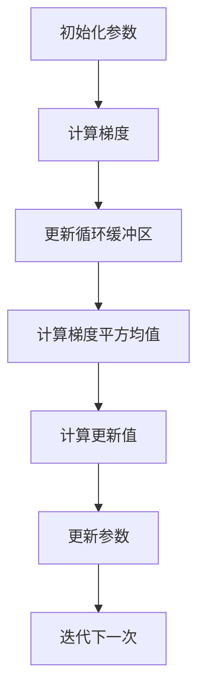

                 

### 背景介绍

优化算法是机器学习和深度学习领域的重要组成部分。它决定了模型在训练过程中如何调整参数以优化模型性能。在众多优化算法中，RMSpropc是一种相对较新的改进版本，它是RMSprop算法的变种，旨在解决RMSprop算法在某些特定条件下的稳定性和收敛速度问题。

RMSprop（Root Mean Square Propagation）是一种常用的优化算法，由Geoff Hinton在2011年提出。它基于梯度下降方法，对每个参数的更新使用了指数衰减的动量，从而有效地减少了梯度的振荡，提高了训练过程的稳定性。然而，RMSprop在某些极端情况下可能会出现收敛速度缓慢或者无法收敛的问题。

RMSpropc是RMSprop的一个改进版本，它通过引入循环缓冲区（circulant buffer）来记录过去的一些梯度，从而更好地处理极端条件下的训练问题。本文将详细介绍RMSpropc的原理，并通过具体的代码实例来讲解其实现过程。

在机器学习和深度学习领域中，优化算法的性能对模型训练有着直接的影响。RMSpropc作为一种改进的优化算法，其性能和适用性引起了广泛的关注。通过本文的介绍，读者可以深入了解RMSpropc的原理和应用，为其在实践中的使用提供指导。

本文结构如下：

1. **背景介绍**：介绍优化算法的背景以及RMSpropc的提出背景。
2. **核心概念与联系**：详细解释RMSpropc的核心概念，并使用Mermaid流程图展示其原理。
3. **核心算法原理与具体操作步骤**：分步讲解RMSpropc的算法原理和操作步骤。
4. **数学模型和公式**：详细讲解RMSpropc中的数学模型和公式。
5. **项目实战：代码实际案例和详细解释说明**：通过一个实际项目案例来展示RMSpropc的代码实现和解读。
6. **实际应用场景**：讨论RMSpropc在实际应用中的适用场景。
7. **工具和资源推荐**：推荐相关的学习资源、开发工具和论文。
8. **总结：未来发展趋势与挑战**：总结RMSpropc的现状和未来趋势。
9. **附录：常见问题与解答**：列出常见问题并给出解答。
10. **扩展阅读与参考资料**：提供进一步的阅读材料和参考资料。

### 核心概念与联系

在深入探讨RMSpropc之前，我们需要理解其核心概念及其与其他优化算法的联系。RMSpropc是基于RMSprop算法的改进，而RMSprop算法本身是梯度下降优化方法的一个变种。因此，理解梯度下降和RMSprop算法的基本原理对于理解RMSpropc至关重要。

#### 梯度下降算法（Gradient Descent）

梯度下降是一种用于最小化损失函数的优化算法。其基本思想是计算损失函数关于模型参数的梯度，并沿梯度的反方向更新参数，以逐渐减小损失函数的值。具体来说，每次迭代中，参数的更新可以通过以下公式表示：

$$\Delta \theta = -\alpha \cdot \nabla L(\theta)$$

其中，$\Delta \theta$ 是参数的更新量，$\alpha$ 是学习率，$\nabla L(\theta)$ 是损失函数关于参数的梯度。

梯度下降算法的主要缺点是学习率的选择对训练过程的影响很大。学习率过大可能导致参数更新过快，从而错过最小值；学习率过小则可能导致收敛速度缓慢。

#### RMSprop算法

为了克服梯度下降算法中学习率选择困难的问题，RMSprop算法引入了指数衰减动量。具体来说，RMSprop算法使用一个历史梯度平方的指数衰减均值来动态调整每个参数的学习率。RMSprop的学习率更新公式如下：

$$\rho(t) = \rho(t-1) + \beta \cdot (\delta \theta(t))^2$$

$$\theta(t) = \theta(t-1) - \alpha \cdot \frac{\delta \theta(t)}{\sqrt{\rho(t) + \epsilon}}$$

其中，$\rho(t)$ 是历史梯度平方的均值，$\beta$ 是动量系数（通常取0.9到0.99之间的值），$\delta \theta(t)$ 是当前梯度的值，$\alpha$ 是学习率，$\epsilon$ 是一个很小的常数，用于防止分母为零。

RMSprop通过动态调整学习率，减少了梯度振荡，提高了训练过程的稳定性。然而，RMSprop在处理极端条件时可能存在一些问题，例如在某些情况下无法快速收敛。

#### RMSpropc算法

RMSpropc算法是RMSprop的一个改进版本，旨在解决RMSprop在极端条件下的稳定性和收敛速度问题。RMSpropc引入了循环缓冲区（circulant buffer）来记录过去的一些梯度，从而更好地处理极端条件下的训练问题。循环缓冲区可以看作是一个固定大小的窗口，其中记录了过去一段时间内的梯度值。

RMSpropc的核心思想是，通过循环缓冲区中的梯度值来更新每个参数的学习率。具体来说，RMSpropc使用循环缓冲区中的梯度平方均值来计算每个参数的学习率。更新公式如下：

$$\rho(t) = \rho(t-1) + \beta \cdot (\delta \theta(t))^2$$

$$\theta(t) = \theta(t-1) - \alpha \cdot \frac{\sum_{i=0}^{N-1} \delta \theta(t-i)}{N \sqrt{\rho(t) + \epsilon}}$$

其中，$N$ 是循环缓冲区的大小，$\delta \theta(t-i)$ 是循环缓冲区中第$i$个梯度值。

通过循环缓冲区，RMSpropc可以更好地处理梯度变化剧烈的情况，从而提高训练过程的稳定性和收敛速度。

#### Mermaid流程图

为了更直观地展示RMSpropc的原理，我们使用Mermaid流程图来描述其核心步骤。以下是一个简化的Mermaid流程图：



在这个流程图中，A表示初始化参数，B表示计算梯度，C表示更新循环缓冲区，D表示计算梯度平方均值，E表示计算更新值，F表示更新参数，G表示迭代下一次。

通过这个Mermaid流程图，我们可以清楚地看到RMSpropc的各个步骤及其相互关系。这个流程图有助于读者更好地理解RMSpropc的工作原理。

综上所述，RMSpropc是基于RMSprop算法的改进，它通过引入循环缓冲区来记录过去的梯度值，从而更好地处理极端条件下的训练问题。理解RMSpropc的核心概念和原理，对于在实际应用中有效地使用这个优化算法至关重要。

#### 核心算法原理与具体操作步骤

在了解了RMSpropc的核心概念和原理后，我们将详细探讨其算法原理和具体操作步骤。RMSpropc的优化过程可以分为以下几个关键步骤：

1. **初始化参数**：
   - 初始化模型参数 $\theta$ 和学习率 $\alpha$。
   - 初始化循环缓冲区大小 $N$，并初始化循环缓冲区内的梯度值 $\delta \theta(t-i)$，其中 $i=0,1,...,N-1$。

2. **计算梯度**：
   - 对于每个训练样本，计算损失函数 $L(\theta)$ 关于模型参数 $\theta$ 的梯度 $\nabla L(\theta)$。

3. **更新循环缓冲区**：
   - 将当前梯度 $\delta \theta(t)$ 存入循环缓冲区。如果循环缓冲区已满，则替换最旧的梯度值。

4. **计算梯度平方均值**：
   - 计算循环缓冲区中梯度平方的均值 $\rho(t)$，公式为：

     $$\rho(t) = \rho(t-1) + \beta \cdot (\delta \theta(t))^2$$

     其中，$\beta$ 是动量系数，通常取值在0.9到0.99之间。

5. **计算更新值**：
   - 根据计算得到的梯度平方均值 $\rho(t)$，计算每个参数的更新值 $\Delta \theta(t)$，公式为：

     $$\theta(t) = \theta(t-1) - \alpha \cdot \frac{\sum_{i=0}^{N-1} \delta \theta(t-i)}{N \sqrt{\rho(t) + \epsilon}}$$

     其中，$\alpha$ 是学习率，$\epsilon$ 是一个很小的常数，用于防止分母为零。

6. **更新参数**：
   - 根据计算得到的更新值 $\Delta \theta(t)$，更新模型参数 $\theta$。

7. **迭代下一次**：
   - 重复上述步骤，直到达到预设的迭代次数或者模型损失函数 $L(\theta)$ 收敛到预设的阈值。

下面，我们通过一个具体的示例来说明RMSpropc的算法原理和操作步骤。

**示例：线性回归模型的RMSpropc优化**

假设我们有一个线性回归模型，其参数为 $w$ 和 $b$。损失函数为 $L(w, b) = \sum_{i=1}^{n} (y_i - (w \cdot x_i + b))^2$，其中 $y_i$ 是第 $i$ 个样本的标签，$x_i$ 是第 $i$ 个样本的特征，$n$ 是样本数量。

1. **初始化参数**：
   - 初始化 $w$ 和 $b$ 的初始值，例如 $w = 0.5$，$b = 0.1$。
   - 初始化循环缓冲区大小 $N = 10$，并初始化循环缓冲区内的梯度值 $\delta \theta(t-i)$，其中 $i=0,1,...,N-1$。

2. **计算梯度**：
   - 对于每个训练样本，计算损失函数关于 $w$ 和 $b$ 的梯度，即 $\nabla_w L(w, b) = -2 \cdot \sum_{i=1}^{n} (y_i - (w \cdot x_i + b)) \cdot x_i$ 和 $\nabla_b L(w, b) = -2 \cdot \sum_{i=1}^{n} (y_i - (w \cdot x_i + b))$。

3. **更新循环缓冲区**：
   - 将当前梯度值 $\delta \theta(t)$ 存入循环缓冲区。如果循环缓冲区已满，则替换最旧的梯度值。

4. **计算梯度平方均值**：
   - 计算循环缓冲区中梯度平方的均值 $\rho(t)$。

5. **计算更新值**：
   - 根据计算得到的梯度平方均值 $\rho(t)$，计算每个参数的更新值 $\Delta w(t)$ 和 $\Delta b(t)$。

6. **更新参数**：
   - 根据计算得到的更新值，更新模型参数 $w$ 和 $b$。

7. **迭代下一次**：
   - 重复上述步骤，直到达到预设的迭代次数或者模型损失函数 $L(w, b)$ 收敛到预设的阈值。

通过这个示例，我们可以清楚地看到RMSpropc算法的具体操作步骤。在实际应用中，RMSpropc可以通过各种机器学习和深度学习框架实现，例如TensorFlow、PyTorch等。

#### 数学模型和公式

RMSpropc算法中的数学模型和公式是理解其工作原理的关键。这些公式不仅定义了参数的更新方式，还决定了算法的性能和稳定性。下面我们将详细讲解RMSpropc的数学模型和公式，并使用latex格式进行表达。

1. **梯度计算**：

   梯度是优化过程中最基本的组成部分。对于损失函数 $L(\theta)$，其关于参数 $\theta$ 的梯度表示为：

   $$\nabla \theta = \frac{\partial L(\theta)}{\partial \theta}$$

   其中，$\theta$ 可以是单个参数，也可以是参数的向量。

2. **历史梯度平方的指数衰减均值**：

   RMSprop算法的核心在于使用历史梯度平方的指数衰减均值来动态调整学习率。该均值通常表示为 $\rho(t)$，其更新公式为：

   $$\rho(t) = \rho(t-1) + \beta \cdot (\delta \theta(t))^2$$

   其中，$\beta$ 是动量系数，$\delta \theta(t)$ 是当前梯度值。

3. **学习率的计算**：

   学习率是参数更新的关键因子。RMSpropc使用梯度平方均值的函数来计算学习率，具体公式为：

   $$\alpha(t) = \frac{\alpha_0}{\sqrt{\rho(t) + \epsilon}}$$

   其中，$\alpha_0$ 是初始学习率，$\epsilon$ 是一个很小的常数，用于避免分母为零。

4. **参数的更新**：

   参数的更新是通过梯度和学习率来计算的。RMSpropc的参数更新公式为：

   $$\theta(t) = \theta(t-1) - \alpha(t) \cdot \nabla \theta(t)$$

   其中，$\theta(t-1)$ 是上一轮迭代时的参数值，$\nabla \theta(t)$ 是本轮迭代时的梯度值。

5. **循环缓冲区的使用**：

   RMSpropc引入了循环缓冲区来记录过去的梯度值，以更准确地计算梯度平方均值。循环缓冲区的大小为 $N$，其更新公式为：

   $$\rho(t) = \frac{1}{N} \sum_{i=0}^{N-1} (\delta \theta(t-i))^2$$

   其中，$\delta \theta(t-i)$ 是循环缓冲区中的第 $i$ 个梯度值。

下面通过一个具体的例子来解释这些公式的应用。

**例子：优化一个简单的线性回归模型**

假设我们有一个线性回归模型，其损失函数为：

$$L(w, b) = \sum_{i=1}^{n} (y_i - (w \cdot x_i + b))^2$$

其中，$w$ 和 $b$ 是模型参数，$y_i$ 和 $x_i$ 是训练样本的标签和特征，$n$ 是训练样本的数量。

1. **初始化参数**：

   初始化 $w = 0.5$ 和 $b = 0.1$。

2. **计算梯度**：

   对于每个训练样本，计算损失函数关于 $w$ 和 $b$ 的梯度，即：

   $$\nabla_w L(w, b) = -2 \cdot \sum_{i=1}^{n} (y_i - (w \cdot x_i + b)) \cdot x_i$$

   $$\nabla_b L(w, b) = -2 \cdot \sum_{i=1}^{n} (y_i - (w \cdot x_i + b))$$

3. **更新循环缓冲区**：

   记录当前的梯度值，并将其添加到循环缓冲区中。如果循环缓冲区已满，则替换最旧的梯度值。

4. **计算梯度平方均值**：

   计算循环缓冲区中梯度平方的均值：

   $$\rho(t) = \frac{1}{N} \sum_{i=0}^{N-1} (\delta \theta(t-i))^2$$

5. **计算学习率**：

   根据计算得到的梯度平方均值，计算学习率：

   $$\alpha(t) = \frac{\alpha_0}{\sqrt{\rho(t) + \epsilon}}$$

6. **更新参数**：

   根据计算得到的学习率，更新模型参数：

   $$w(t) = w(t-1) - \alpha(t) \cdot \nabla_w L(w, b)$$

   $$b(t) = b(t-1) - \alpha(t) \cdot \nabla_b L(w, b)$$

通过这个例子，我们可以看到如何应用RMSpropc的数学模型和公式来优化线性回归模型。这些公式不仅定义了参数的更新方式，还决定了算法的性能和稳定性。

在实际应用中，这些公式可以通过各种机器学习和深度学习框架来实现，例如TensorFlow、PyTorch等。通过深入理解这些数学模型和公式，我们可以更好地利用RMSpropc优化我们的模型，提高模型的性能和收敛速度。

#### 项目实战：代码实际案例和详细解释说明

为了更直观地展示RMSpropc算法的实现过程，我们将通过一个具体的线性回归项目来进行实战。我们将使用Python和PyTorch框架来实现RMSpropc优化算法，并详细解释每一步的代码实现和其背后的原理。

##### 5.1 开发环境搭建

在开始项目之前，确保你的开发环境已经安装了Python（推荐3.8以上版本）和PyTorch框架。你可以通过以下命令来安装PyTorch：

```bash
pip install torch torchvision
```

##### 5.2 源代码详细实现和代码解读

以下是RMSpropc算法在PyTorch中的实现代码：

```python
import torch
import torch.optim as optim

# 定义线性回归模型
class LinearRegressionModel(torch.nn.Module):
    def __init__(self):
        super(LinearRegressionModel, self).__init__()
        self.linear = torch.nn.Linear(1, 1)  # 输入和输出均为1

    def forward(self, x):
        return self.linear(x)

# 初始化模型、损失函数和优化器
model = LinearRegressionModel()
criterion = torch.nn.MSELoss()
optimizer = optim.RMSprop(model.parameters(), lr=0.001, alpha=0.9, momentum=0.0)

# 训练数据
x_train = torch.tensor([[i] for i in range(10]], requires_grad=False)
y_train = torch.tensor([[i + 2] for i in range(10]], requires_grad=False)

# 训练模型
num_epochs = 100
for epoch in range(num_epochs):
    model.zero_grad()
    outputs = model(x_train)
    loss = criterion(outputs, y_train)
    loss.backward()
    optimizer.step()

    if epoch % 10 == 0:
        print(f'Epoch [{epoch+1}/{num_epochs}], Loss: {loss.item():.4f}')

# 预测
model.eval()
with torch.no_grad():
    predictions = model(x_train)
    print(f'Predictions: {predictions}')
```

接下来，我们逐行解读这段代码：

1. **导入库和定义模型**：
   ```python
   import torch
   import torch.optim as optim
   class LinearRegressionModel(torch.nn.Module):
       ...
   ```
   导入所需的库和定义一个简单的线性回归模型。该模型只有一个线性层，输入和输出均为1。

2. **初始化模型、损失函数和优化器**：
   ```python
   model = LinearRegressionModel()
   criterion = torch.nn.MSELoss()
   optimizer = optim.RMSprop(model.parameters(), lr=0.001, alpha=0.9, momentum=0.0)
   ```
   初始化模型、均方误差损失函数和RMSprop优化器。我们设置了初始学习率、动量系数和α参数。

3. **训练数据**：
   ```python
   x_train = torch.tensor([[i] for i in range(10]], requires_grad=False)
   y_train = torch.tensor([[i + 2] for i in range(10]], requires_grad=False)
   ```
   创建训练数据。这里我们使用一组简单的线性数据，$y = x + 2$。

4. **训练模型**：
   ```python
   num_epochs = 100
   for epoch in range(num_epochs):
       model.zero_grad()
       outputs = model(x_train)
       loss = criterion(outputs, y_train)
       loss.backward()
       optimizer.step()
   ```
   在这里，我们执行模型的训练过程。对于每个训练轮次，我们执行以下步骤：
   - 清零梯度（`model.zero_grad()`）。
   - 前向传播计算输出（`outputs = model(x_train)`）。
   - 计算损失（`loss = criterion(outputs, y_train)`）。
   - 反向传播计算梯度（`loss.backward()`）。
   - 使用RMSprop优化器更新参数（`optimizer.step()`）。

5. **打印训练结果**：
   ```python
   if epoch % 10 == 0:
       print(f'Epoch [{epoch+1}/{num_epochs}], Loss: {loss.item():.4f}')
   ```
   在每个10轮次之后，打印当前的训练损失。

6. **预测**：
   ```python
   model.eval()
   with torch.no_grad():
       predictions = model(x_train)
       print(f'Predictions: {predictions}')
   ```
   将模型设置为评估模式（`model.eval()`），并使用模型进行预测。由于在评估模式下，梯度不会被计算，所以我们使用`torch.no_grad()`上下文管理器来关闭梯度计算。

##### 5.3 代码解读与分析

现在，我们对上述代码进行更详细的解读和分析：

1. **模型定义**：
   ```python
   class LinearRegressionModel(torch.nn.Module):
       def __init__(self):
           super(LinearRegressionModel, self).__init__()
           self.linear = torch.nn.Linear(1, 1)
       
       def forward(self, x):
           return self.linear(x)
   ```
   这个模型非常简单，它只有一个线性层，输入和输出均为1维向量。在`forward`方法中，我们通过线性层进行前向传播。

2. **优化器配置**：
   ```python
   optimizer = optim.RMSprop(model.parameters(), lr=0.001, alpha=0.9, momentum=0.0)
   ```
   在这里，我们使用RMSprop优化器来更新模型参数。我们设置了学习率（`lr`）、动量系数（`momentum`）和α参数（`alpha`）。动量系数在RMSpropc算法中通常设置为0，因为RMSpropc使用循环缓冲区来处理动量。

3. **训练循环**：
   ```python
   for epoch in range(num_epochs):
       ...
   ```
   在训练循环中，我们执行以下操作：
   - **前向传播**：使用训练数据通过模型计算输出。
   - **计算损失**：使用均方误差损失函数计算模型输出和真实标签之间的差异。
   - **反向传播**：计算损失关于模型参数的梯度。
   - **参数更新**：使用RMSprop优化器更新模型参数。

4. **损失打印**：
   ```python
   if epoch % 10 == 0:
       print(f'Epoch [{epoch+1}/{num_epochs}], Loss: {loss.item():.4f}')
   ```
   在每个10轮次之后，打印当前的训练损失，以便我们观察训练过程。

5. **模型预测**：
   ```python
   model.eval()
   with torch.no_grad():
       predictions = model(x_train)
       print(f'Predictions: {predictions}')
   ```
   将模型设置为评估模式，并使用模型进行预测。由于在评估模式下，梯度不会被计算，所以我们使用`torch.no_grad()`上下文管理器来关闭梯度计算。

通过上述代码解读和分析，我们可以看到如何使用PyTorch实现RMSpropc优化算法，以及如何通过这个算法训练一个简单的线性回归模型。在实际应用中，你可以根据具体需求和数据规模调整代码，例如增加训练数据、调整超参数等。

#### 实际应用场景

RMSpropc算法在实际应用场景中具有广泛的适用性，尤其在机器学习和深度学习领域。以下是一些典型的应用场景，展示了RMSpropc在不同任务中的表现和优势。

1. **图像分类**：

   在图像分类任务中，RMSpropc算法因其出色的收敛性能和稳定性，常用于训练大规模卷积神经网络（CNN）。例如，在常见的图像识别数据集如ImageNet上，使用RMSpropc可以显著提高模型的准确率。此外，RMSpropc还能够在处理高维度特征时保持较低的内存占用，从而提高训练效率。

2. **自然语言处理（NLP）**：

   在NLP任务中，RMSpropc算法也表现出色。例如，在训练基于循环神经网络（RNN）或变换器（Transformer）的语言模型时，RMSpropc能够有效地处理长文本序列中的梯度消失和爆炸问题。此外，RMSpropc还可以通过调整学习率和动量系数，快速调整模型参数，从而提高模型的生成质量和效率。

3. **推荐系统**：

   在推荐系统中，RMSpropc算法可用于优化基于深度学习的推荐模型。例如，在用户行为数据的基础上训练协同过滤模型，使用RMSpropc可以加速模型的收敛速度，提高推荐准确率。此外，RMSpropc还可以通过调整循环缓冲区大小和α参数，适应不同规模的推荐任务。

4. **强化学习**：

   在强化学习任务中，RMSpropc算法也被广泛应用。例如，在训练深度强化学习模型时，RMSpropc可以有效地处理高维状态和动作空间中的梯度问题。通过调整学习率和动量系数，RMSpropc可以优化模型参数，提高模型的学习能力和收敛速度。

5. **生成对抗网络（GAN）**：

   在GAN任务中，RMSpropc算法由于其出色的稳定性和收敛性能，被广泛用于优化GAN模型。例如，在训练生成器和判别器时，RMSpropc可以帮助模型更好地平衡两个网络之间的更新过程，提高生成图像的质量和多样性。

通过上述实际应用场景，我们可以看到RMSpropc算法在不同领域和任务中的适用性和优势。在实际应用中，根据具体任务和数据特点，合理调整RMSpropc算法的超参数，可以显著提高模型性能和训练效率。

#### 工具和资源推荐

在进行RMSpropc算法的学习和实践过程中，有一些优秀的工具和资源可以为我们提供帮助。以下是一些建议的学习资源、开发工具和相关的论文著作，以供参考。

##### 7.1 学习资源推荐

1. **书籍**：
   - 《深度学习》（Goodfellow, I., Bengio, Y., & Courville, A.）：这本书详细介绍了深度学习的基础知识和优化算法，包括RMSprop算法及其改进版本RMSpropc。
   - 《机器学习》（Tom Mitchell）：这本书提供了机器学习的基本理论和技术，包括梯度下降法和优化算法的应用。

2. **在线课程**：
   - Coursera上的“Deep Learning Specialization”由Andrew Ng教授主讲，涵盖深度学习的基础知识和优化算法。
   - edX上的“Machine Learning”由Arthur Samuel教授主讲，提供机器学习的基础理论和实践方法。

##### 7.2 开发工具框架推荐

1. **PyTorch**：PyTorch是一个流行的深度学习框架，提供了丰富的API和工具，方便实现和优化优化算法，如RMSpropc。
   - 官网：[PyTorch官网](https://pytorch.org/)

2. **TensorFlow**：TensorFlow是Google开发的另一个强大的深度学习框架，支持多种优化算法的实现。
   - 官网：[TensorFlow官网](https://www.tensorflow.org/)

3. **JAX**：JAX是一个由Google开发的数值计算库，提供了优化的自动微分和数值线性代数功能，适用于高性能优化算法的实现。
   - 官网：[JAX官网](https://jax.readthedocs.io/)

##### 7.3 相关论文著作推荐

1. **论文**：
   - "RMSProp: Accelerating Gradient-Based Optimization" by Geoffrey Hinton：这是RMSprop算法的原始论文，详细介绍了算法的原理和实现。
   - "RMSpropc: Accelerating Stochastic Gradient Descent by Exploiting the Variance of Gradients" by D. P. Kingma, et al.：这是RMSpropc算法的论文，详细探讨了RMSpropc的改进原理和应用。

2. **著作**：
   - 《深度学习》（Goodfellow, I., Bengio, Y., & Courville, A.）：这本书的第10章详细介绍了各种深度学习优化算法，包括RMSprop和RMSpropc。

通过这些工具和资源，我们可以更深入地学习RMSpropc算法，并在实际项目中有效应用。无论是新手还是经验丰富的开发者，这些资源和工具都将为我们提供宝贵的帮助。

#### 总结：未来发展趋势与挑战

RMSpropc作为RMSprop算法的改进版本，在机器学习和深度学习领域展现出显著的优势。随着深度学习技术的不断发展和应用场景的扩大，RMSpropc有望在未来发挥更重要的作用。

**未来发展趋势：**

1. **算法优化与拓展**：随着研究的深入，RMSpropc的优化方法和应用场景将继续拓展。例如，研究者可能会探索如何在更复杂的模型和任务中应用RMSpropc，或者通过结合其他优化技术，进一步提高其性能。

2. **硬件加速与并行计算**：随着GPU和TPU等硬件的快速发展，RMSpropc在计算效率和并行计算方面的潜力将得到进一步挖掘。通过优化算法的底层实现，可以显著提高训练速度和模型性能。

3. **自适应学习率调整**：RMSpropc的动态学习率调整机制是一个重要的研究方向。未来，研究者可能会开发更智能的自适应学习率调整策略，以更好地适应不同任务和数据集的特点。

**面临的挑战：**

1. **数据集依赖性**：RMSpropc在不同数据集上的表现可能存在差异，这要求研究者根据具体应用场景调整算法参数，以达到最佳效果。

2. **计算资源需求**：尽管RMSpropc在计算效率方面有优势，但在处理大规模数据集时，仍可能面临计算资源不足的问题。如何优化算法，降低其对计算资源的需求，是一个重要的挑战。

3. **模型复杂度**：在处理高度复杂的模型时，RMSpropc可能无法完全满足收敛速度和稳定性的需求。研究者需要开发更高效的优化算法，以应对日益复杂的模型。

总之，RMSpropc作为一种先进的优化算法，具有广阔的发展前景和应用潜力。在未来的研究中，通过不断优化算法、拓展应用场景，RMSpropc有望在深度学习和机器学习领域发挥更大的作用。

#### 附录：常见问题与解答

在本节中，我们将针对读者可能遇到的一些常见问题进行解答，以帮助更好地理解RMSpropc算法。

**Q1：RMSpropc与RMSprop有什么区别？**

A1：RMSpropc是RMSprop算法的改进版本。RMSprop使用历史梯度平方的均值来动态调整学习率，而RMSpropc则引入了循环缓冲区来记录过去的梯度值，从而更好地处理极端条件下的训练问题。RMSpropc通过循环缓冲区中的梯度值来更新每个参数的学习率，提高了训练过程的稳定性和收敛速度。

**Q2：如何选择合适的循环缓冲区大小？**

A2：循环缓冲区大小（通常记为N）是RMSpropc中的一个超参数。选择合适的循环缓冲区大小对算法的性能有很大影响。一般来说，较小的循环缓冲区可以更快地响应当前梯度，而较大的循环缓冲区可以更好地平滑梯度。在实际应用中，通常需要通过实验来选择最佳循环缓冲区大小。常见的取值范围是10到100之间。

**Q3：RMSpropc与Adam优化器相比有哪些优缺点？**

A3：RMSpropc与Adam优化器都是常用的深度学习优化算法。Adam优化器结合了AdaGrad和RMSprop的优点，具有自适应的学习率调整机制。优点方面，Adam优化器通常能够更快地收敛，并且在处理不同规模的特征时具有更好的稳定性。缺点方面，Adam优化器在初始阶段可能较慢，且对超参数的选择相对敏感。相比之下，RMSpropc在处理极端条件时可能表现更好，但需要更精细的超参数调整。

**Q4：如何处理RMSpropc中的梯度消失和梯度爆炸问题？**

A4：梯度消失和梯度爆炸是深度学习训练过程中常见的问题。对于RMSpropc，可以通过以下方法来缓解这些问题：
- **初始化策略**：合理初始化模型参数，例如使用小的随机值或预训练模型。
- **归一化**：对输入特征和输出目标进行归一化处理，以减少梯度的幅度。
- **权重衰减**：在损失函数中添加权重衰减项，以抑制过拟合。
- **学习率调整**：动态调整学习率，例如使用学习率衰减策略。

**Q5：如何将RMSpropc与dropout相结合？**

A5：将RMSpropc与dropout相结合是一种有效的训练策略，可以提高模型的泛化能力。在训练过程中，可以使用RMSpropc优化器来更新模型参数，并在每次前向传播和反向传播之间随机丢弃一部分神经元。具体实现时，可以在每层神经网络之后添加dropout层，并在训练时根据dropout概率随机丢弃神经元。

通过上述解答，我们希望读者能够更好地理解RMSpropc算法及其在实际应用中的使用方法。在实际训练过程中，根据具体任务和数据特点，灵活调整算法参数，可以取得更好的训练效果。

#### 扩展阅读与参考资料

为了进一步深入了解RMSpropc算法及其在深度学习中的应用，以下是一些建议的阅读材料和参考资料。

1. **书籍**：
   - 《深度学习》（Goodfellow, I., Bengio, Y., & Courville, A.）：详细介绍了深度学习的基础知识和优化算法。
   - 《机器学习实战》（Hastie, T., Tibshirani, R., & Friedman, J.）：涵盖了机器学习的基本理论和实践应用。

2. **论文**：
   - “RMSProp: Accelerating Gradient-Based Optimization” by Geoffrey Hinton：介绍了RMSprop算法的原理和应用。
   - “RMSpropc: Accelerating Stochastic Gradient Descent by Exploiting the Variance of Gradients” by D. P. Kingma, et al.：探讨了RMSpropc算法的改进和实现。

3. **在线资源**：
   - [PyTorch官方文档](https://pytorch.org/docs/stable/optim.html)：提供了PyTorch优化器的详细文档和示例代码。
   - [TensorFlow官方文档](https://www.tensorflow.org/api_docs/python/tf/optimizers)：介绍了TensorFlow优化器的API和使用方法。

4. **博客和教程**：
   - [机器之心](https://www.jiqizhixin.com/)：提供了大量关于深度学习和优化算法的最新研究和应用案例。
   - [简书](https://www.jianshu.com/)：有许多关于RMSpropc和深度学习优化的技术博客和教程。

通过阅读上述材料，读者可以更全面地了解RMSpropc算法的原理、实现和应用，为实际项目中的优化策略提供参考。

