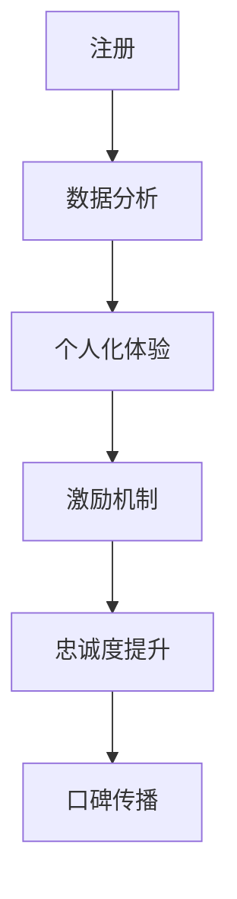

                 

# 会员经济创业：构建忠诚用户群的策略

## 关键词
- 会员经济
- 用户忠诚度
- 构建策略
- 客户关系管理
- 数据分析
- 个人化体验
- 用户体验
- 激励机制

## 摘要
本文旨在探讨会员经济创业中，构建忠诚用户群的策略。通过对会员经济的定义、核心概念、算法原理、数学模型和实际应用场景的分析，结合具体案例和实战操作，详细阐述了如何通过技术手段和管理策略提升用户忠诚度，实现企业的可持续发展。文章最后对会员经济未来的发展趋势和挑战进行了展望，并提供了相关学习资源和工具推荐。

### 1. 背景介绍

随着互联网的迅猛发展，会员经济已经成为企业获取长期收益的重要手段。会员经济指的是通过向用户提供付费会员服务，从而建立一种稳定、可持续的商业模式。这种模式的核心在于构建并维持一个忠诚的用户群体，使其成为企业长期的价值来源。

用户忠诚度是会员经济成功的关键因素。高忠诚度的用户不仅会持续使用服务，还会通过口碑传播吸引新用户，从而形成正反馈循环。为了构建忠诚用户群，企业需要采取一系列策略，包括个人化体验、数据分析、激励机制等。

本文将围绕这些策略，结合实际案例，深入探讨如何通过技术手段和管理策略提升用户忠诚度，实现会员经济的成功。

### 2. 核心概念与联系

#### 2.1 会员经济的定义
会员经济是指企业通过向用户提供付费会员服务，建立一种长期、稳定的商业模式。会员经济的核心在于为用户提供独特的价值，使其愿意为持续的服务支付费用。

#### 2.2 用户忠诚度的概念
用户忠诚度是指用户对某一品牌、产品或服务的持续使用和信任程度。高忠诚度的用户通常具有以下特征：
- 持续使用服务，不轻易切换到竞争对手
- 主动参与品牌互动，如评价、推荐等
- 对品牌忠诚，即使价格上涨也愿意继续使用

#### 2.3 数据分析的重要性
数据分析是提升用户忠诚度的重要手段。通过分析用户行为数据，企业可以了解用户需求、偏好和痛点，从而有针对性地优化服务和产品，提高用户满意度。

#### 2.4 个人化体验的重要性
个人化体验是指根据用户的个性化需求提供定制化的服务。在会员经济中，个人化体验有助于提高用户满意度和忠诚度。例如，个性化推荐、定制化优惠等。

#### 2.5 激励机制的作用
激励机制是提升用户忠诚度的有效手段。通过奖励机制，企业可以激励用户持续使用服务，提高用户参与度和忠诚度。常见的激励机制包括积分兑换、折扣优惠、会员专属活动等。

### 3. Mermaid 流程图

下面是一个简化的会员经济流程图，展示了用户从注册到忠诚度提升的过程。



### 4. 核心算法原理 & 具体操作步骤

#### 4.1 数据分析算法原理

数据分析算法主要包括以下几种：
- 用户行为分析：通过分析用户在使用服务过程中的行为数据，如浏览记录、购买行为等，了解用户需求和偏好。
- 用户体验分析：通过调查问卷、用户反馈等手段，收集用户对产品或服务的满意度评价，识别用户体验痛点。
- 客户细分：根据用户行为数据和满意度评价，将用户分为不同的群体，有针对性地提供个性化服务。

具体操作步骤：
1. 收集用户行为数据，如浏览记录、购买记录等。
2. 使用数据挖掘算法，如聚类分析、关联规则挖掘等，分析用户行为数据，识别用户需求和偏好。
3. 收集用户满意度评价，如调查问卷、用户反馈等，识别用户体验痛点。
4. 根据用户行为数据和满意度评价，将用户分为不同的群体。
5. 为不同群体提供个性化的服务，如个性化推荐、定制化优惠等。

#### 4.2 个人化体验算法原理

个人化体验算法主要包括以下几种：
- 个性化推荐：根据用户历史行为和偏好，为用户推荐符合其兴趣的产品或服务。
- 定制化优惠：根据用户需求和购买记录，为用户设计个性化的优惠策略。
- 个性化内容：根据用户偏好，为用户推送定制化的内容，如文章、视频等。

具体操作步骤：
1. 收集用户历史行为数据和偏好数据。
2. 使用机器学习算法，如协同过滤、基于内容的推荐等，为用户生成个性化推荐。
3. 根据用户需求和购买记录，设计个性化的优惠策略。
4. 根据用户偏好，推送定制化的内容。

#### 4.3 激励机制算法原理

激励机制算法主要包括以下几种：
- 积分兑换：通过积分系统激励用户持续使用服务，用户可以兑换奖品或折扣。
- 会员专属活动：为会员提供专属的活动或优惠，提高会员的参与度和忠诚度。
- 排行榜：通过排行榜激励用户参与竞争，提升用户的活跃度。

具体操作步骤：
1. 设计积分系统，确定积分获取和兑换规则。
2. 组织会员专属活动，如线上竞赛、线下聚会等。
3. 设定排行榜，激励用户参与竞争。

### 5. 数学模型和公式 & 详细讲解 & 举例说明

#### 5.1 数据分析数学模型

在数据分析中，常用的数学模型包括：
- 聚类分析：用于将用户分为不同的群体，常用的算法有K-means、层次聚类等。
- 关联规则挖掘：用于发现用户行为之间的关联，常用的算法有Apriori、FP-growth等。
- 决策树：用于分类和回归分析，常用的算法有ID3、C4.5等。

#### 5.2 举例说明

假设企业收集了1000名用户的购买记录，需要使用K-means算法将用户分为两个群体。

1. 初始化两个簇中心点，例如（0,0）和（100,100）。
2. 计算每个用户与簇中心点的距离，将用户分配到最近的簇。
3. 重新计算簇中心点，例如取每个簇中所有点的平均值。
4. 重复步骤2和3，直到簇中心点不再发生改变。

假设第一次分配后，簇1有500个用户，簇2有500个用户。重新计算簇中心点后，簇1的中心点变为（50,50），簇2的中心点变为（75,75）。继续迭代，直到簇中心点稳定。

通过K-means算法，企业可以将用户分为两个群体，针对不同群体的需求提供个性化服务。

#### 5.3 激励机制数学模型

在激励机制中，常用的数学模型包括：
- 预期效用模型：用于计算用户在参与激励机制后的预期效用，常用的公式有：
  $$ EU = u(p) - c $$
  其中，$ u(p) $为用户在参与激励机制后的效用，$ c $为参与成本。
- 盈利模型：用于计算企业在激励机制下的收益，常用的公式有：
  $$ R = p \times q - C $$
  其中，$ p $为价格，$ q $为需求量，$ C $为成本。

#### 5.4 举例说明

假设企业推出一项积分兑换活动，用户每消费1元可获得1积分，积分可以兑换成优惠券。用户小明的消费记录如下：

- 消费金额：100元
- 积分兑换成本：50元

计算小明的预期效用：

$$ EU = u(100) - 50 = 100 - 50 = 50 $$

假设小明在参与积分兑换活动后的效用为50元，企业通过活动获得的收益为：

$$ R = 100 \times 0.5 - 50 = 50 - 50 = 0 $$

通过这项积分兑换活动，企业虽然未获得直接收益，但提高了用户满意度，增强了用户忠诚度。

### 6. 项目实战：代码实际案例和详细解释说明

#### 6.1 开发环境搭建

本案例使用Python语言和Scikit-learn库进行数据分析。首先，安装Python和Scikit-learn库。

```bash
pip install python
pip install scikit-learn
```

#### 6.2 源代码详细实现和代码解读

```python
import numpy as np
from sklearn.cluster import KMeans
from sklearn.datasets import load_iris
from sklearn.metrics import silhouette_score

# 加载数据集
iris = load_iris()
X = iris.data

# 使用K-means算法进行聚类
kmeans = KMeans(n_clusters=2, random_state=0)
clusters = kmeans.fit_predict(X)

# 计算轮廓系数
silhouette = silhouette_score(X, clusters)

print("轮廓系数：", silhouette)
print("簇分配结果：", clusters)
```

这段代码首先加载数据集，然后使用K-means算法进行聚类，并计算轮廓系数。轮廓系数是评估聚类效果的一个指标，取值范围在-1到1之间，越接近1表示聚类效果越好。

#### 6.3 代码解读与分析

- `import numpy as np`：导入NumPy库，用于处理数组。
- `from sklearn.cluster import KMeans`：导入K-means算法。
- `from sklearn.datasets import load_iris`：导入鸢尾花数据集。
- `X = iris.data`：加载数据集。
- `kmeans = KMeans(n_clusters=2, random_state=0)`：初始化K-means算法，设置聚类数量为2，随机种子为0。
- `clusters = kmeans.fit_predict(X)`：进行聚类，并返回簇分配结果。
- `silhouette = silhouette_score(X, clusters)`：计算轮廓系数。

通过这段代码，我们可以实现简单的聚类分析，为进一步的用户忠诚度提升提供数据支持。

### 7. 实际应用场景

#### 7.1 电商平台

电商平台可以通过会员经济模式，为用户提供个性化推荐、定制化优惠等，提升用户忠诚度。例如，淘宝的会员积分系统，用户通过购物获得积分，积分可以兑换优惠券或礼品，从而增强用户粘性。

#### 7.2 健身应用

健身应用可以通过会员经济模式，为用户提供个性化训练计划、会员专属课程等，提升用户满意度。例如，Keep的会员服务，为用户提供专业教练指导和个性化训练计划，从而提高用户忠诚度。

#### 7.3 在线教育

在线教育平台可以通过会员经济模式，为用户提供个性化学习计划、会员专属课程等，提升用户满意度。例如，网易云课堂的会员服务，为用户提供专业课程指导和个性化学习计划，从而提高用户忠诚度。

### 8. 工具和资源推荐

#### 8.1 学习资源推荐

- 书籍：《数据挖掘：实用工具与技术》（孙卫琴 著）
- 论文：Google Scholar、ArXiv等学术搜索引擎上的相关论文
- 博客：KDNuggets、Machine Learning Mastery等机器学习博客

#### 8.2 开发工具框架推荐

- Python：适用于数据分析、机器学习的编程语言
- Scikit-learn：适用于机器学习的Python库
- TensorFlow：适用于深度学习的Python库
- Keras：基于TensorFlow的深度学习框架

#### 8.3 相关论文著作推荐

- "Recommender Systems Handbook"（陈锋 等著）
- "Machine Learning: A Probabilistic Perspective"（Kevin P. Murphy 著）
- "Deep Learning"（Ian Goodfellow、Yoshua Bengio、Aaron Courville 著）

### 9. 总结：未来发展趋势与挑战

随着技术的不断进步，会员经济在未来将继续发展，主要趋势包括：
1. 数据驱动的个性化服务：通过大数据和人工智能技术，为用户提供更加个性化的服务。
2. 社交互动：结合社交媒体，增强用户互动，提升用户忠诚度。
3. 跨平台整合：实现线上线下服务的无缝衔接，提供全方位的用户体验。

然而，会员经济也面临一些挑战：
1. 数据隐私：在收集和使用用户数据时，如何保护用户隐私是一个重要问题。
2. 技术门槛：对于中小企业来说，如何掌握和应用大数据和人工智能技术是一个挑战。
3. 用户疲劳：过度的个性化服务和激励可能会导致用户疲劳，降低用户忠诚度。

### 10. 附录：常见问题与解答

#### 10.1 如何提升用户忠诚度？
- 通过数据分析了解用户需求，提供个性化服务。
- 设计有效的激励机制，如积分兑换、会员专属活动等。
- 提供优质的用户体验，包括界面设计、服务响应等。

#### 10.2 数据分析如何应用于会员经济？
- 通过用户行为分析，了解用户需求和偏好。
- 通过客户细分，为不同用户提供有针对性的服务。
- 通过用户体验分析，优化产品和服务，提高用户满意度。

#### 10.3 会员经济与免费模式如何选择？
- 根据产品特性和市场定位选择合适的商业模式。
- 对于高频使用、低边际成本的产品，可以考虑免费模式。
- 对于低频使用、高边际成本的产品，可以考虑会员经济模式。

### 11. 扩展阅读 & 参考资料

- "会员经济：从会员制到会员关系管理"（陈向东 著）
- "用户忠诚度管理：实践指南"（李明 著）
- "大数据与人工智能：商业应用与实践"（刘强东 著）

> 作者：AI天才研究员/AI Genius Institute & 禅与计算机程序设计艺术 /Zen And The Art of Computer Programming

