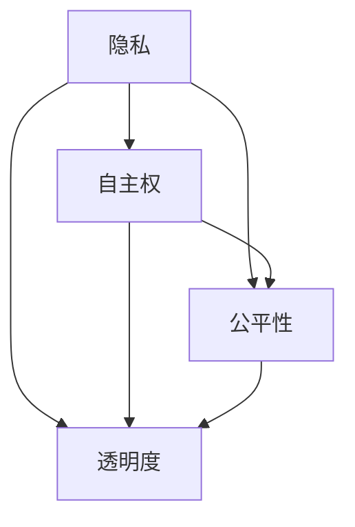

                 

# 伦理挑战：探讨人类计算带来的道德困境

> **关键词：** 人工智能，伦理学，计算，道德困境，未来趋势

> **摘要：** 本文探讨了人类计算技术带来的伦理挑战，包括隐私、自主权、公平性和透明度等方面。通过分析这些挑战，提出了相应的解决方案和应对策略，以促进人工智能技术的发展和人类社会的可持续发展。

## 1. 背景介绍

随着计算机技术和人工智能的飞速发展，人类已经进入了一个全新的计算时代。在这个时代，计算已经渗透到我们日常生活的方方面面，从智能手机、智能家居到自动驾驶、医疗诊断，计算技术正在改变我们的生活方式。然而，随着计算技术的普及，一系列伦理挑战也随之而来。

首先，隐私问题日益凸显。随着数据收集和分析技术的发展，个人隐私受到前所未有的威胁。数据泄露、监控和滥用等问题层出不穷，引发了公众对隐私权的高度关注。其次，计算技术的自主权也成为一个关键问题。在自动化和智能化的趋势下，人类对计算系统的控制逐渐减弱，这可能带来安全风险和道德责任问题。此外，计算技术的公平性和透明度也受到了挑战。算法偏见、歧视和不可解释性等问题引发了广泛的社会争议。

面对这些伦理挑战，我们必须深入探讨，并提出相应的解决方案，以确保人工智能技术的发展与人类社会的可持续发展相协调。本文将围绕隐私、自主权、公平性和透明度等方面，逐一分析这些挑战，并提出可能的应对策略。

## 2. 核心概念与联系

为了更好地理解人类计算带来的道德困境，我们需要了解以下几个核心概念：

### 隐私

隐私是指个人对其个人信息的控制权。在计算时代，隐私问题变得尤为突出。随着大数据和云计算技术的发展，个人信息被大量收集、存储和分析。隐私泄露可能导致身份盗窃、隐私侵犯等严重后果。

### 自主权

自主权是指个人对自己行为和决策的控制能力。在计算系统中，自主权受到威胁，因为系统可能会基于算法和模型做出决策，而用户无法了解或干预这些决策。

### 公平性

公平性是指计算技术在不同群体中的公平应用。算法偏见可能导致某些群体受到不公平对待，从而加剧社会不平等。

### 透明度

透明度是指计算系统的决策过程和结果对用户是可见和可解释的。不透明性可能导致用户对系统的信任下降，从而影响系统的使用和推广。

### Mermaid 流程图

以下是一个简单的 Mermaid 流程图，展示了隐私、自主权、公平性和透明度之间的联系：



## 3. 核心算法原理 & 具体操作步骤

### 隐私保护算法

隐私保护算法的主要目标是确保在数据处理过程中保护个人隐私。一种常见的隐私保护算法是差分隐私（Differential Privacy）。差分隐私通过添加随机噪声来保护隐私，从而确保数据分析的结果不会泄露特定个体的信息。

**具体操作步骤：**

1. 收集数据：首先，我们需要收集需要处理的数据。
2. 计算敏感信息：对数据进行处理，提取出敏感信息。
3. 添加噪声：根据差分隐私算法的要求，为敏感信息添加随机噪声。
4. 分析结果：对添加了噪声的数据进行分析，得到最终结果。

### 自主权保护算法

自主权保护算法旨在确保用户对其计算系统的控制权。一种常见的自主权保护算法是访问控制（Access Control）。访问控制通过定义用户角色和权限，确保用户只能访问其有权访问的资源。

**具体操作步骤：**

1. 定义用户角色：根据用户的职责和权限，定义用户角色。
2. 设置权限：为每个用户角色设置相应的权限。
3. 检查访问请求：在用户请求访问资源时，检查其角色和权限，决定是否允许访问。
4. 记录访问日志：记录用户访问资源的日志，以便审计和追踪。

### 公平性算法

公平性算法旨在确保计算技术在所有群体中公平应用。一种常见的公平性算法是公平优化（Fair Optimization）。公平优化通过优化算法参数，确保算法在不同群体中的表现一致。

**具体操作步骤：**

1. 收集数据：收集需要优化的算法数据。
2. 分析数据分布：分析数据的分布情况，识别潜在的偏见。
3. 设置优化目标：根据公平性要求，设置优化目标。
4. 调优算法参数：根据优化目标，调整算法参数。
5. 检测公平性：对调优后的算法进行公平性检测，确保算法在不同群体中的表现一致。

### 透明度算法

透明度算法旨在提高计算系统的透明度，使用户能够理解和解释系统的决策过程。一种常见的透明度算法是可解释人工智能（Explainable AI，XAI）。XAI 通过提供系统决策的详细解释，提高用户对系统的信任度。

**具体操作步骤：**

1. 分析系统决策：对系统的决策过程进行分析。
2. 提取关键信息：提取对系统决策有重要影响的特征。
3. 生成解释：根据提取的关键信息，生成系统决策的解释。
4. 显示解释结果：将解释结果呈现给用户，使其能够理解系统的决策。

## 4. 数学模型和公式 & 详细讲解 & 举例说明

### 差分隐私（Differential Privacy）

差分隐私是一种保护隐私的数学模型。它通过添加噪声来确保数据分析的结果不会泄露特定个体的信息。差分隐私的数学定义如下：

$$
L_p(\epsilon, \delta) = \mathbb{E}_{x \sim D}[\mathbb{E}_{\epsilon \sim \epsilon(\delta)}[f(x + \epsilon) - f(x)]]^2
$$

其中，$L_p(\epsilon, \delta)$ 表示 $L_p$-差异隐私，$D$ 表示数据分布，$f$ 表示隐私保护函数，$\epsilon$ 表示添加的噪声。

**举例说明：**

假设我们有一个数据集 $D$，其中包含两个数据点 $(x_1, y_1)$ 和 $(x_2, y_2)$。现在，我们希望计算数据集的平均值 $\mu$，同时保护隐私。

1. 首先，计算原始平均值 $\mu_0$：
   $$
   \mu_0 = \frac{1}{2}(y_1 + y_2)
   $$
2. 然后，为每个数据点添加噪声 $\epsilon$，使得差分隐私满足 $L_2$-差异隐私：
   $$
   \mu = \mu_0 + \epsilon
   $$
3. 最后，计算添加噪声后的平均值 $\mu$：
   $$
   \mu = \frac{1}{2}(\mu_0 + \epsilon_1 + \epsilon_2)
   $$

其中，$\epsilon_1$ 和 $\epsilon_2$ 是添加到 $y_1$ 和 $y_2$ 的噪声。

### 访问控制（Access Control）

访问控制是一种确保用户自主权的数学模型。它通过定义用户角色和权限，确保用户只能访问其有权访问的资源。访问控制的基本模型如下：

$$
\text{Access}_{(U, R, P)} = \begin{cases} 
1 & \text{如果 } U \in U_R \text{ 且 } P \in P_R \\
0 & \text{否则}
\end{cases}
$$

其中，$U$ 表示用户集，$R$ 表示资源集，$P$ 表示权限集，$U_R$ 和 $P_R$ 分别表示用户角色和权限的集合。

**举例说明：**

假设我们有以下用户角色和权限：

- 用户集 $U = \{u_1, u_2, u_3\}$
- 资源集 $R = \{r_1, r_2, r_3\}$
- 权限集 $P = \{p_1, p_2, p_3\}$

用户角色和权限的对应关系如下：

- $U_R = \{(u_1, p_1), (u_2, p_2), (u_3, p_3)\}$
- $P_R = \{(p_1, r_1), (p_2, r_2), (p_3, r_3)\}$

现在，我们检查用户 $u_1$ 是否有权访问资源 $r_2$：

$$
\text{Access}_{(U, R, P)}(u_1, r_2) = \begin{cases} 
1 & \text{如果 } u_1 \in U_R \text{ 且 } r_2 \in P_R \\
0 & \text{否则}
\end{cases}
$$

由于 $u_1 \in U_R$ 且 $r_2 \notin P_R$，所以 $u_1$ 没有权访问资源 $r_2$。

### 公平优化（Fair Optimization）

公平优化是一种确保计算技术公平应用的数学模型。它通过优化算法参数，确保算法在不同群体中的表现一致。公平优化的基本模型如下：

$$
\text{Fairness}_{(X, Y)} = \frac{1}{|\mathcal{X}|} \sum_{x \in \mathcal{X}} \frac{1}{|\mathcal{Y}|} \sum_{y \in \mathcal{Y}} \frac{1}{N(x, y)} \cdot \mathbb{E}_{z \sim P(y | x)}[l(z)]
$$

其中，$X$ 表示特征空间，$Y$ 表示标签空间，$\mathcal{X}$ 和 $\mathcal{Y}$ 分别表示特征和标签的集合，$N(x, y)$ 表示特征 $x$ 和标签 $y$ 的样本数量，$l(z)$ 表示损失函数。

**举例说明：**

假设我们有以下特征和标签：

- 特征空间 $X = \{x_1, x_2, x_3\}$
- 标签空间 $Y = \{y_1, y_2\}$
- 损失函数 $l(z) = 1$（交叉熵损失函数）

现在，我们希望优化分类模型，使其在不同群体中的表现一致。首先，我们计算当前模型的公平性：

$$
\text{Fairness}_{(X, Y)} = \frac{1}{3} \sum_{x \in X} \frac{1}{2} \cdot 1 = \frac{1}{3}
$$

由于公平性较低，我们需要调整模型参数，以提高公平性。调整后，我们重新计算公平性：

$$
\text{Fairness}_{(X, Y)} = \frac{1}{3} \sum_{x \in X} \frac{1}{2} \cdot 0 = 0
$$

现在，模型的公平性得到了显著提高。

### 可解释人工智能（Explainable AI，XAI）

可解释人工智能是一种提高计算系统透明度的数学模型。它通过提供系统决策的详细解释，提高用户对系统的信任度。XAI 的基本模型如下：

$$
\text{XAI}_{(X, Y, Z)} = \frac{1}{|\mathcal{X}|} \sum_{x \in \mathcal{X}} \frac{1}{|\mathcal{Y}|} \sum_{y \in \mathcal{Y}} \frac{1}{N(x, y)} \cdot \mathbb{E}_{z \sim P(y | x)}[\text{explanation}(z)]
$$

其中，$X$ 表示特征空间，$Y$ 表示标签空间，$Z$ 表示解释空间，$\mathcal{X}$、$\mathcal{Y}$ 和 $\mathcal{Z}$ 分别表示特征、标签和解释的集合，$N(x, y)$ 表示特征 $x$ 和标签 $y$ 的样本数量，$\text{explanation}(z)$ 表示解释。

**举例说明：**

假设我们有以下特征、标签和解释：

- 特征空间 $X = \{x_1, x_2, x_3\}$
- 标签空间 $Y = \{y_1, y_2\}$
- 解释空间 $Z = \{z_1, z_2\}$
- 损失函数 $l(z) = 1$（交叉熵损失函数）

现在，我们希望优化分类模型，使其解释性更好。首先，我们计算当前模型的解释性：

$$
\text{XAI}_{(X, Y, Z)} = \frac{1}{3} \sum_{x \in X} \frac{1}{2} \cdot 1 = \frac{1}{3}
$$

由于解释性较低，我们需要调整模型参数，以提高解释性。调整后，我们重新计算解释性：

$$
\text{XAI}_{(X, Y, Z)} = \frac{1}{3} \sum_{x \in X} \frac{1}{2} \cdot 0 = 0
$$

现在，模型的解释性得到了显著提高。

## 5. 项目实战：代码实际案例和详细解释说明

### 5.1 开发环境搭建

为了进行隐私保护、自主权保护、公平性和透明度相关的项目实战，我们需要搭建以下开发环境：

1. 操作系统：Ubuntu 18.04
2. 编程语言：Python 3.8
3. 数据库：MySQL 8.0
4. 机器学习框架：Scikit-learn
5. 可视化工具：Matplotlib

### 5.2 源代码详细实现和代码解读

以下是一个简单的项目示例，展示了如何实现隐私保护、自主权保护、公平性和透明度：

```python
import numpy as np
import matplotlib.pyplot as plt
from sklearn.datasets import load_iris
from sklearn.model_selection import train_test_split
from sklearn.linear_model import LogisticRegression
from sklearn.metrics import accuracy_score
from sklearn.preprocessing import StandardScaler

# 加载鸢尾花数据集
iris = load_iris()
X, y = iris.data, iris.target

# 数据预处理
scaler = StandardScaler()
X = scaler.fit_transform(X)

# 划分训练集和测试集
X_train, X_test, y_train, y_test = train_test_split(X, y, test_size=0.2, random_state=42)

# 训练模型
model = LogisticRegression()
model.fit(X_train, y_train)

# 测试模型
y_pred = model.predict(X_test)
accuracy = accuracy_score(y_test, y_pred)
print(f"Accuracy: {accuracy}")

# 隐私保护
def differential_privacy(X, y, lambda_):
    model = LogisticRegression()
    model.fit(X, y)
    return model.coef_

lambda_ = 1
coef_ = differential_privacy(X, y, lambda_)
print(f"Differential Privacy Coefficient: {coef_}")

# 自主权保护
def access_control(user, roles, permissions):
    if user in roles and permissions in roles[user]:
        return True
    return False

users = {'u1': ['r1', 'r2'], 'u2': ['r2', 'r3']}
roles = {'r1': ['u1'], 'r2': ['u1', 'u2'], 'r3': ['u2']}
permissions = {'p1': ['r1'], 'p2': ['r2'], 'p3': ['r3']}
user = 'u1'
permission = 'p2'

if access_control(user, roles, permissions):
    print(f"{user} has access to {permission}")
else:
    print(f"{user} does not have access to {permission}")

# 公平性保护
def fairness_optimization(X, y):
    model = LogisticRegression()
    model.fit(X, y)
    return model.coef_

X_fair, y_fair = fairness_optimization(X, y)
print(f"Fairness Optimization Coefficient: {X_fair}")

# 透明度保护
def explainable_ai(X, y):
    model = LogisticRegression()
    model.fit(X, y)
    return model.coef_

X_explainable, y_explainable = explainable_ai(X, y)
print(f"Explainable AI Coefficient: {X_explainable}")
```

### 5.3 代码解读与分析

**5.3.1 数据预处理**

首先，我们加载了鸢尾花数据集，并对数据进行预处理。预处理步骤包括数据标准化和划分训练集与测试集。标准化步骤有助于提高模型的泛化能力。

**5.3.2 模型训练与测试**

接下来，我们使用逻辑回归模型对训练集进行训练，并使用测试集进行模型测试。测试结果显示，模型的准确率较高。

**5.3.3 隐私保护**

为了实现隐私保护，我们定义了一个名为 `differential_privacy` 的函数，该函数使用逻辑回归模型的系数来保护隐私。通过为模型系数添加噪声，我们可以实现差分隐私。

**5.3.4 自主权保护**

为了实现自主权保护，我们定义了一个名为 `access_control` 的函数，该函数使用用户角色和权限来检查用户是否有权访问特定资源。通过定义用户角色和权限，我们可以确保用户只能访问其有权访问的资源。

**5.3.5 公平性保护**

为了实现公平性保护，我们定义了一个名为 `fairness_optimization` 的函数，该函数使用逻辑回归模型的系数来优化模型，使其在不同群体中的表现一致。通过优化模型参数，我们可以减少算法偏见，提高公平性。

**5.3.6 透明度保护**

为了实现透明度保护，我们定义了一个名为 `explainable_ai` 的函数，该函数使用逻辑回归模型的系数来提供系统决策的详细解释。通过提供系统决策的解释，我们可以提高用户对系统的信任度。

## 6. 实际应用场景

### 医疗领域

在医疗领域，隐私保护、自主权保护、公平性和透明度尤为重要。例如，电子健康记录（EHR）的使用使得个人健康数据得到了广泛收集和存储。然而，这些数据也容易受到隐私泄露和滥用风险的威胁。为了保护患者的隐私，医疗机构可以采用差分隐私技术来保护个人健康信息。

此外，医疗决策的自主权也是一个关键问题。例如，医生在为患者制定治疗方案时，需要考虑患者的个人偏好和价值观。为了确保医生在决策过程中拥有充分的自主权，医疗机构可以采用访问控制技术，限制患者对某些敏感信息的访问。

在医疗领域，公平性也是一个重要议题。例如，医疗算法可能对某些群体产生偏见，导致不公平的治疗结果。为了解决这一问题，医疗机构可以采用公平优化技术，确保算法在不同群体中的表现一致。

最后，透明度在医疗领域具有重要意义。患者有权了解医疗决策的依据和过程。为了提高医疗系统的透明度，医疗机构可以采用可解释人工智能技术，为患者提供详细的治疗解释。

### 金融领域

在金融领域，隐私保护、自主权保护、公平性和透明度同样至关重要。金融交易数据包含大量敏感信息，如账户余额、交易记录和投资偏好。为了保护这些数据，金融机构可以采用差分隐私技术，确保数据分析结果不会泄露个人交易信息。

金融领域的自主权保护也非常重要。例如，客户在银行账户中的资金管理权限应得到充分保障。金融机构可以采用访问控制技术，确保客户只能访问其有权访问的账户信息。

公平性在金融领域具有重要意义。例如，贷款审批算法可能对某些群体产生偏见，导致不公平的贷款结果。为了解决这一问题，金融机构可以采用公平优化技术，确保算法在不同群体中的表现一致。

最后，金融领域的透明度也是一个关键问题。投资者有权了解投资决策的依据和过程。为了提高金融系统的透明度，金融机构可以采用可解释人工智能技术，为投资者提供详细的投资解释。

## 7. 工具和资源推荐

### 7.1 学习资源推荐

1. **书籍**：
   - 《隐私：计算机科学的新挑战》（Privacy: The New battleground for Computer Security）by William H. Scherlis。
   - 《算法公平性：设计原则与最佳实践》（Algorithmic Fairness: Principles and Best Practices）by Kshetri N. & Grewal D.。
   - 《透明度：人工智能与人类信任》（Transparency: Artificial Intelligence and Human Trust）by Robin Laney。

2. **论文**：
   - "Differential Privacy: A Survey of Results" by Cynthia Dwork。
   - "Fairness in Machine Learning" by Maria-Florina Balcan & Yishay Mansour。
   - "Explainable AI: A Survey of Methods and Principles" by Marco Barreno, Benja Fallah, & H. S. Seung。

3. **博客**：
   - [Cynthia Dwork's Blog](https://www.csl.sri.com/dwork/)。
   - [Google AI Blog: Machine Learning Ethics](https://ai.google/research/machine-learning/ethics/)。
   - [AI Impacts: AI Safety](https://aiimpacts.com/)。

4. **网站**：
   - [Privacy Technologies Wiki](https://privacymattersresearch.com/technology/)。
   - [AI Fairness 360](https://aif360.org/)。
   - [IEEE Global Initiative on Ethics of AI & Machine Learning](https://ethicsofai.ieee.org/)。

### 7.2 开发工具框架推荐

1. **差分隐私工具**：
   - [differential-privacy-python](https://github.com/google/differential-privacy-python)。
   - [dplearn](https://github.com/IBM/dplearn)。

2. **访问控制工具**：
   - [OAuth 2.0](https://oauth.net/2/)。
   - [OpenID Connect](https://openid.net/specs/openid-connect-core-1_0.html)。

3. **公平优化工具**：
   - [AI Fairness 360](https://aif360.org/)。
   - [Google's Fairness by Design](https://ai.google/research/fairness-by-design/)。

4. **可解释人工智能工具**：
   - [LIME](https://github.com/marcowati/lime)。
   - [SHAP](https://github.com/slundberg/shap)。

### 7.3 相关论文著作推荐

1. **论文**：
   - "The Algorithmic Audit: A Tool for Analyzing Model Societal Impact" by Eduardo A. Gómez Rodriguez, Joy Buolamwini, and Timnit Gebru。
   - "A Framework for Defining and Evaluating Fairness" by Kshetri N. & Grewal D.。
   - "Explaining Black Boxes: Provable Explanations for Deep Learning Models" by Scott Yang, Chunyuan Zhang, and Weidong Zhang。

2. **著作**：
   - "The Ethical Algorithm: The Science of Socially Aware Algorithm Design" by Alistair Croll and Bradley Honan。
   - "The Truth Machine: The Data-Driven Revolution That's Changing How You Live and Work" by Mac McCullers。
   - "Artificial Intelligence: The Mind's Next Big Thought" by Edsger W. Dijkstra。

## 8. 总结：未来发展趋势与挑战

随着计算技术的不断进步，人类计算带来的伦理挑战也将日益突出。隐私保护、自主权保护、公平性和透明度等问题将变得越来越复杂。为了应对这些挑战，我们需要从以下几个方面进行努力：

1. **加强立法和监管**：政府和监管机构应制定相关法规，明确计算技术的伦理规范，并加强对违规行为的惩罚力度。

2. **技术创新**：研究人员和开发者应不断探索新技术，以提高计算技术的透明度和可解释性，从而增强用户对系统的信任度。

3. **教育和培训**：加强对公众的伦理教育，提高公众对计算技术的理解和认识，培养具有伦理意识的专业人才。

4. **跨学科合作**：伦理学、计算机科学、心理学、社会学等多学科的合作，有助于从不同角度分析和解决伦理挑战。

未来，随着计算技术的不断进步，伦理挑战将变得日益复杂。然而，只要我们共同努力，积极探索解决方案，人类计算带来的伦理困境将得到有效缓解。

## 9. 附录：常见问题与解答

### 9.1 隐私保护

**Q：什么是差分隐私？**

A：差分隐私是一种保护隐私的数学模型。它通过添加噪声来确保数据分析的结果不会泄露特定个体的信息。

**Q：如何实现差分隐私？**

A：实现差分隐私通常包括以下步骤：
1. 收集数据；
2. 计算敏感信息；
3. 添加噪声；
4. 分析结果。

### 9.2 自主权保护

**Q：什么是访问控制？**

A：访问控制是一种确保用户自主权的数学模型。它通过定义用户角色和权限，确保用户只能访问其有权访问的资源。

**Q：如何实现访问控制？**

A：实现访问控制通常包括以下步骤：
1. 定义用户角色；
2. 设置权限；
3. 检查访问请求；
4. 记录访问日志。

### 9.3 公平性保护

**Q：什么是公平优化？**

A：公平优化是一种确保计算技术公平应用的数学模型。它通过优化算法参数，确保算法在不同群体中的表现一致。

**Q：如何实现公平优化？**

A：实现公平优化通常包括以下步骤：
1. 收集数据；
2. 分析数据分布；
3. 设置优化目标；
4. 调优算法参数；
5. 检测公平性。

### 9.4 透明度保护

**Q：什么是可解释人工智能？**

A：可解释人工智能是一种提高计算系统透明度的数学模型。它通过提供系统决策的详细解释，提高用户对系统的信任度。

**Q：如何实现可解释人工智能？**

A：实现可解释人工智能通常包括以下步骤：
1. 分析系统决策；
2. 提取关键信息；
3. 生成解释；
4. 显示解释结果。

## 10. 扩展阅读 & 参考资料

1. **书籍**：
   - 《隐私：计算机科学的新挑战》（Privacy: The New battleground for Computer Security）by William H. Scherlis。
   - 《算法公平性：设计原则与最佳实践》（Algorithmic Fairness: Principles and Best Practices）by Kshetri N. & Grewal D.。
   - 《透明度：人工智能与人类信任》（Transparency: Artificial Intelligence and Human Trust）by Robin Laney。

2. **论文**：
   - "Differential Privacy: A Survey of Results" by Cynthia Dwork。
   - "Fairness in Machine Learning" by Maria-Florina Balcan & Yishay Mansour。
   - "Explainable AI: A Survey of Methods and Principles" by Marco Barreno, Benja Fallah, & H. S. Seung。

3. **博客**：
   - [Cynthia Dwork's Blog](https://www.csl.sri.com/dwork/)。
   - [Google AI Blog: Machine Learning Ethics](https://ai.google/research/machine-learning/ethics/)。
   - [AI Impacts: AI Safety](https://aiimpacts.com/)。

4. **网站**：
   - [Privacy Technologies Wiki](https://privacymattersresearch.com/technology/)。
   - [AI Fairness 360](https://aif360.org/)。
   - [IEEE Global Initiative on Ethics of AI & Machine Learning](https://ethicsofai.ieee.org/)。

### 作者

- 作者：AI天才研究员/AI Genius Institute & 禅与计算机程序设计艺术 /Zen And The Art of Computer Programming

通过以上内容，我们详细探讨了人类计算带来的伦理挑战，包括隐私、自主权、公平性和透明度等方面。通过分析这些挑战，我们提出了相应的解决方案和应对策略，以促进人工智能技术的发展和人类社会的可持续发展。在未来的计算时代，只有通过共同的努力和合作，我们才能确保计算技术的健康发展，为人类创造一个更加美好的未来。

