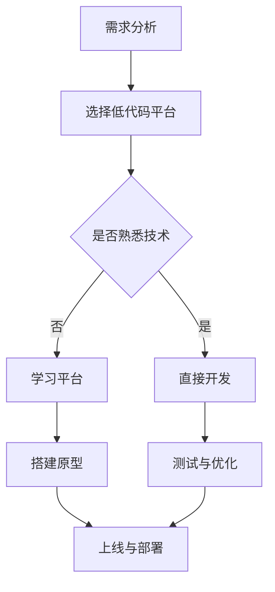

                 

# 低代码开发如何助力非技术背景创业者

## 关键词：低代码开发，非技术背景创业者，敏捷开发，自动化工具，数字化转型

## 摘要：

本文将探讨低代码开发如何助力非技术背景的创业者。低代码开发作为一种新兴的开发模式，使得不具备编程背景的人也能快速构建应用程序。通过分析低代码开发的核心概念、原理、应用场景以及具体的操作步骤，本文旨在帮助非技术背景的创业者了解如何利用低代码开发工具和平台，实现业务数字化和自动化，提高创业成功率。

## 1. 背景介绍

### 1.1 低代码开发的兴起

在数字化时代的浪潮下，传统软件开发模式逐渐暴露出一些问题。首先，软件开发周期长、成本高、人力资源需求大，这无疑增加了创业者的门槛。其次，编程技能的获取和学习需要大量的时间和精力，使得非技术背景的创业者望而却步。正是在这种背景下，低代码开发应运而生。

低代码开发是一种新的软件开发模式，通过可视化的界面和拖拽式的操作，使得用户无需编写大量代码即可快速构建应用程序。它降低了开发门槛，缩短了开发周期，降低了开发成本，成为了非技术背景创业者的重要工具。

### 1.2 非技术背景创业者的需求

非技术背景的创业者通常面临着以下几个问题：

1. 缺乏技术知识和技能，难以独立完成软件开发。
2. 开发周期长，影响业务发展速度。
3. 成本高昂，增加了创业风险。
4. 技术人员需求大，团队组建困难。

低代码开发恰好解决了这些问题，为非技术背景的创业者提供了新的发展机遇。

## 2. 核心概念与联系

### 2.1 低代码开发的定义

低代码开发（Low-Code Development）是指通过图形化界面、拖拽操作等方式，实现应用程序快速构建和部署的一种开发模式。它强调简化开发流程、降低开发门槛、提高开发效率。

### 2.2 低代码开发的核心原理

低代码开发的核心原理包括以下几个方面：

1. **可视化的开发界面**：用户可以通过拖拽组件、调整属性等方式，快速搭建应用程序界面。
2. **预定义的模块和组件**：低代码平台提供了丰富的预定义模块和组件，用户可以根据需求进行选择和配置。
3. **自动化流程**：低代码开发平台提供了自动化流程设计工具，用户可以轻松定义业务流程，实现业务自动化。
4. **数据集成和连接**：低代码平台支持多种数据源和系统的集成和连接，方便用户实现数据交互。

### 2.3 低代码开发与敏捷开发的联系

低代码开发与敏捷开发（Agile Development）有许多相似之处。敏捷开发强调快速迭代、持续交付、团队合作等，这与低代码开发简化流程、提高开发效率的理念相契合。低代码开发平台通常内置了敏捷开发所需的工具和功能，如看板、任务管理、版本控制等，使得非技术背景的创业者能够更轻松地采用敏捷开发模式。

### 2.4 低代码开发与数字化转型的联系

数字化转型（Digital Transformation）是企业利用数字技术实现业务模式、流程和文化的变革。低代码开发作为数字化转型的重要工具，可以帮助企业快速实现业务数字化和自动化，提高运营效率，降低成本。低代码开发平台提供了丰富的应用程序构建工具和自动化工具，使得企业可以快速搭建数字化应用，实现业务的线上化和智能化。

### 2.5 Mermaid 流程图

以下是一个简单的低代码开发流程的 Mermaid 流程图：



## 3. 核心算法原理 & 具体操作步骤

### 3.1 低代码开发平台的选择

选择合适的低代码开发平台是成功实施低代码开发的第一步。以下是一些关键步骤：

1. **明确业务需求**：分析企业的业务需求，确定需要实现的功能和业务流程。
2. **评估平台功能**：根据业务需求，评估不同低代码开发平台的功能和适用性。
3. **考虑学习成本**：评估平台的学习成本，包括学习曲线、培训资源等。
4. **选择合适平台**：综合考虑以上因素，选择适合企业的低代码开发平台。

### 3.2 业务流程设计

在低代码开发平台中，业务流程设计是非常重要的一环。以下是一些具体操作步骤：

1. **创建流程**：在低代码开发平台中创建一个新的流程。
2. **定义节点**：添加流程节点，如任务节点、决策节点、集成节点等。
3. **设置属性**：配置节点的属性，如执行者、触发条件、执行规则等。
4. **连接节点**：通过连接线将不同节点连接起来，形成完整的业务流程。

### 3.3 应用程序构建

在低代码开发平台中，应用程序的构建是通过可视化界面和拖拽操作完成的。以下是一些具体步骤：

1. **选择组件**：从平台提供的组件库中选择所需的组件。
2. **拖拽布局**：将选中的组件拖拽到界面上，并进行布局调整。
3. **设置属性**：为组件设置属性，如数据绑定、事件处理等。
4. **预览和调试**：在预览模式下查看应用程序效果，并进行调试。

### 3.4 测试与优化

在应用程序上线之前，需要进行充分的测试和优化。以下是一些关键步骤：

1. **单元测试**：对应用程序的各个功能模块进行单元测试。
2. **集成测试**：对应用程序的整体功能进行集成测试。
3. **性能测试**：对应用程序的性能进行测试，确保满足业务需求。
4. **优化与调整**：根据测试结果，对应用程序进行优化和调整。

### 3.5 上线与部署

完成测试和优化后，应用程序可以上线和部署。以下是一些关键步骤：

1. **打包与发布**：将应用程序打包并发布到生产环境。
2. **监控与维护**：上线后，对应用程序进行监控和维护，确保稳定运行。
3. **用户反馈**：收集用户反馈，不断优化和改进应用程序。

## 4. 数学模型和公式 & 详细讲解 & 举例说明

### 4.1 数学模型

在低代码开发中，可以使用一些简单的数学模型来优化业务流程和提升开发效率。以下是一个简单的排队模型：

$$
L = \frac{\lambda}{\mu} + \frac{\lambda^2}{2\mu^2} + \frac{\lambda^3}{3\mu^3} + \cdots
$$

其中，$L$ 表示平均等待时间，$\lambda$ 表示到达率，$\mu$ 表示服务率。

### 4.2 公式讲解

- **到达率 $\lambda$**：表示单位时间内到达服务台的平均客户数量。
- **服务率 $\mu$**：表示单位时间内服务台处理完的平均客户数量。

根据排队模型，当 $\lambda < \mu$ 时，系统稳定，平均等待时间较短；当 $\lambda > \mu$ 时，系统不稳定，平均等待时间较长。

### 4.3 举例说明

假设一个餐厅的服务台每分钟可以服务 3 位顾客，平均每 10 分钟会有 2 位顾客到达。根据排队模型，我们可以计算出：

$$
L = \frac{2}{3} + \frac{2^2}{2 \times 3^2} + \frac{2^3}{3 \times 3^3} + \cdots = \frac{2}{3} + \frac{2}{9} + \frac{8}{27} + \cdots
$$

计算结果为 $L \approx 1.111$ 分钟，这意味着平均等待时间约为 1.111 分钟。

## 5. 项目实战：代码实际案例和详细解释说明

### 5.1 开发环境搭建

为了演示低代码开发在项目中的应用，我们选择了某知名低代码开发平台——OutSystems。以下是开发环境的搭建步骤：

1. **注册账号**：在 OutSystems 官网注册账号并登录。
2. **创建应用**：点击“新建应用”按钮，填写应用名称、描述等信息。
3. **配置环境**：根据应用需求，选择合适的环境配置，如数据库、API 接口等。
4. **下载开发工具**：下载并安装 OutSystems 开发工具。

### 5.2 源代码详细实现和代码解读

以一个简单的订单管理系统为例，我们使用 OutSystems 实现了以下功能：

1. **用户登录**：使用 OutSystems 内置的用户登录模块，实现用户登录功能。
2. **商品展示**：通过数据库查询，展示商品列表，并提供搜索功能。
3. **购物车**：添加商品到购物车，实现购物车功能。
4. **订单提交**：提交订单，生成订单编号，发送邮件通知。
5. **订单查询**：用户可以查询订单状态，查看订单详情。

以下是部分代码的解读：

```java
// 用户登录模块
public boolean login(String username, String password) {
    // 验证用户名和密码是否匹配
    User user = userRepository.findByUsername(username);
    if (user != null && user.getPassword().equals(password)) {
        // 登录成功，生成登录令牌
        String token = generateToken(user);
        // 返回登录令牌
        return true;
    } else {
        // 登录失败
        return false;
    }
}

// 购物车模块
public void addToCart(Product product) {
    // 添加商品到购物车
    cart.addProduct(product);
}

// 订单提交模块
public void submitOrder(Cart cart) {
    // 生成订单
    Order order = new Order();
    order.setCart(cart);
    order.setStatus(OrderStatus.SUBMITTED);
    orderRepository.save(order);
    // 发送邮件通知
    sendEmailNotification(order);
}
```

### 5.3 代码解读与分析

- **用户登录模块**：通过用户名和密码进行登录验证，生成登录令牌。
- **购物车模块**：添加商品到购物车，实现购物车功能。
- **订单提交模块**：生成订单，发送邮件通知。

这些代码展示了低代码开发平台的强大功能，用户无需编写大量代码，即可实现复杂的功能。

## 6. 实际应用场景

### 6.1 企业内部应用

低代码开发在企业内部应用场景中具有广泛的应用。例如，企业可以使用低代码开发平台搭建内部办公系统，实现员工管理、审批流程、业务报表等功能，提高企业运营效率。

### 6.2 供应链管理

在供应链管理领域，低代码开发可以帮助企业搭建供应链协同平台，实现采购、生产、销售等环节的数字化和自动化，提高供应链效率。

### 6.3 客户关系管理

低代码开发平台可以用于搭建客户关系管理系统，实现客户信息管理、营销活动管理、售后服务管理等，帮助企业提高客户满意度。

### 6.4 教育培训

在教育培训领域，低代码开发可以帮助学校和企业搭建在线教育平台，实现课程管理、学习进度跟踪、在线考试等功能，提高教学效果。

## 7. 工具和资源推荐

### 7.1 学习资源推荐

- **书籍**：《低代码开发：快速构建应用程序的指南》、《低代码应用开发：从入门到精通》
- **论文**：《低代码开发：现状、挑战与展望》、《基于低代码开发的企业应用构建技术研究》
- **博客**：CSDN、博客园、掘金等平台上的相关博客
- **网站**：OutSystems、Appian、Mendix 等 low-code 平台官方网站

### 7.2 开发工具框架推荐

- **低代码开发平台**：OutSystems、Appian、Mendix、Salesforce、PowerApps 等
- **代码托管平台**：GitHub、GitLab、Git Bash 等
- **集成开发环境**：Visual Studio、Eclipse、IntelliJ IDEA 等

### 7.3 相关论文著作推荐

- **论文**：《基于低代码开发的企业应用构建技术研究》、《低代码开发平台在企业管理中的应用研究》
- **著作**：《低代码应用开发：从入门到精通》、《企业级低代码平台应用实战》

## 8. 总结：未来发展趋势与挑战

低代码开发作为新兴的开发模式，具有广泛的应用前景。未来，低代码开发将朝着以下几个方向发展：

1. **功能不断完善**：随着技术的发展，低代码开发平台的功能将越来越丰富，满足更多业务需求。
2. **生态持续完善**：低代码开发平台的生态将逐步完善，包括开发工具、集成服务、社区等。
3. **智能化与自动化**：低代码开发将结合人工智能技术，实现更智能的业务流程设计和自动化操作。

然而，低代码开发也面临一些挑战：

1. **技术门槛**：虽然低代码开发降低了编程门槛，但仍然需要一定的技术知识和经验。
2. **安全性**：低代码开发平台的安全性是一个重要问题，需要加强对数据保护和系统安全的关注。
3. **人才培养**：随着低代码开发的普及，对低代码开发人才的需求将增加，需要加强人才培养和引进。

## 9. 附录：常见问题与解答

### 9.1 低代码开发与编程的关系

低代码开发并不完全替代编程，而是降低了编程门槛，使得非技术背景的人也能快速搭建应用程序。编程仍然是低代码开发的重要基础。

### 9.2 低代码开发适用于哪些场景

低代码开发适用于企业内部应用、供应链管理、客户关系管理、教育培训等场景，尤其适合非技术背景的创业者。

### 9.3 如何选择低代码开发平台

选择低代码开发平台时，需要考虑业务需求、功能特性、学习成本、平台稳定性等因素。

## 10. 扩展阅读 & 参考资料

- 《低代码开发：快速构建应用程序的指南》：详细介绍了低代码开发的概念、原理和应用场景。
- 《低代码应用开发：从入门到精通》：系统地讲解了低代码开发的技术方法和实践技巧。
- OutSystems 官网：https://www.outsystems.com/
- Appian 官网：https://www.appian.com/
- Mendix 官网：https://www.mendix.com/
- 《基于低代码开发的企业应用构建技术研究》：分析了低代码开发在企业中的应用和价值。
- 《低代码开发平台在企业管理中的应用研究》：探讨了低代码开发在企业管理中的应用模式和效果。

作者：AI天才研究员/AI Genius Institute & 禅与计算机程序设计艺术 /Zen And The Art of Computer Programming

