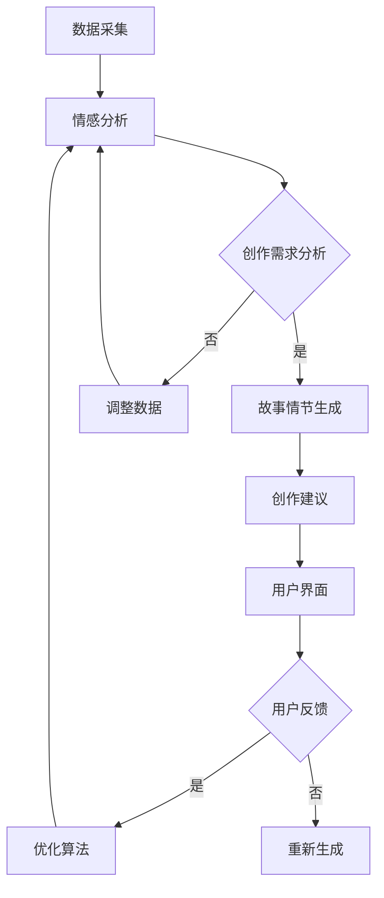

                 

# {文章标题}

## 体验叙事工作室总监：AI驱动的个人故事创作坊负责人

> **关键词：** 人工智能，叙事，个人故事，AI驱动，创作坊，用户体验

> **摘要：** 本文将探讨人工智能在个人故事创作中的应用，特别是在体验叙事工作室中，AI如何作为驱动力量，提升个人故事的创作质量和用户体验。文章将分析AI的核心概念与联系，详细介绍AI驱动的故事创作流程，包括算法原理、数学模型和实际应用场景，并提供项目实战和工具资源推荐，最后总结未来发展趋势与挑战。

## 1. 背景介绍

在当今快速发展的科技时代，人工智能（AI）已经成为改变各行各业的重要力量。尤其是在文化创意产业中，AI的应用越来越广泛，从自动写作、音乐创作到图像生成，AI正在颠覆传统创作模式，为创作者提供全新的工具和平台。

体验叙事工作室是一家专注于个人故事创作和分享的机构。我们的使命是帮助每个人找到自己内心的声音，通过故事的形式表达情感和思想。然而，随着故事创作的复杂性和多样性不断增加，传统的创作方法已经无法满足创作者的需求。

为了解决这一问题，体验叙事工作室引入了AI技术，打造了一个AI驱动的个人故事创作坊。在这个创作坊中，AI不仅帮助创作者快速生成故事情节，还能根据创作者的情感状态和创作需求，提供个性化的创作建议，从而大大提升创作效率和质量。

## 2. 核心概念与联系

### 2.1 AI驱动的故事创作原理

在AI驱动的个人故事创作坊中，AI的核心作用是提供创作灵感和辅助创作。具体来说，AI通过以下三个步骤实现这一目标：

1. **数据采集与分析**：AI首先收集创作者的个人信息、情感状态和创作需求，通过数据分析和情感识别技术，理解创作者的内心世界。
2. **故事情节生成**：基于采集到的数据，AI利用自然语言处理（NLP）技术生成符合创作者情感和需求的故事情节。这一过程涉及到大量的文本生成模型和情感分析算法。
3. **个性化创作建议**：在故事情节生成后，AI根据创作者的情感状态和创作需求，提供个性化的创作建议，包括角色设定、情节发展、情感表达等方面。

### 2.2 AI驱动的故事创作架构

为了实现上述功能，体验叙事工作室构建了一个AI驱动的故事创作架构，包括以下几个关键组成部分：

1. **数据采集模块**：该模块负责收集创作者的个人信息、情感状态和创作需求。具体包括用户调研、问卷调查、情感识别等。
2. **文本生成模块**：该模块负责基于采集到的数据生成故事情节。具体包括文本生成模型、情感分析算法等。
3. **创作建议模块**：该模块负责根据创作者的情感状态和创作需求，提供个性化的创作建议。具体包括角色设定、情节发展、情感表达等方面的建议。
4. **用户界面**：用户界面是创作者与AI交互的桥梁，提供创作过程的各种操作和功能，如数据录入、故事生成、建议反馈等。

### 2.3 Mermaid流程图

以下是AI驱动的故事创作流程的Mermaid流程图：



## 3. 核心算法原理 & 具体操作步骤

### 3.1 数据采集与分析

数据采集与分析是AI驱动故事创作的基础。具体操作步骤如下：

1. **用户调研**：通过在线问卷、访谈等方式收集创作者的基本信息，如年龄、性别、职业等。
2. **情感识别**：利用情感识别技术，对创作者的文字、语音等输入进行情感分析，识别创作者的情感状态，如喜怒哀乐等。
3. **需求分析**：结合用户调研和情感识别结果，分析创作者的创作需求，包括故事类型、情感表达等。

### 3.2 故事情节生成

故事情节生成是AI驱动的核心环节。具体操作步骤如下：

1. **文本生成模型**：使用预训练的文本生成模型（如GPT-3、BERT等），根据创作者的情感状态和创作需求，生成初步的故事情节。
2. **情节调整**：根据情感分析结果，对生成的初步情节进行调整，使其更符合创作者的情感表达和需求。
3. **情节优化**：利用强化学习等技术，不断优化生成的情节，使其更加生动有趣、引人入胜。

### 3.3 创作建议

创作建议是AI驱动的附加功能。具体操作步骤如下：

1. **角色设定**：根据创作者的情感状态和故事情节，为故事中的角色设定性格、动机等。
2. **情节发展**：为故事情节提供发展建议，如冲突、转折等。
3. **情感表达**：为创作者提供情感表达的技巧和建议，如如何更好地表达情感、营造氛围等。

## 4. 数学模型和公式 & 详细讲解 & 举例说明

### 4.1 情感分析模型

情感分析是AI驱动故事创作的重要环节。以下是情感分析模型的数学模型和公式：

1. **情感分类模型**：
   - 情感向量空间：将文本转化为情感向量空间中的点，如词袋模型、词嵌入等。
   - 情感分类器：使用支持向量机（SVM）、神经网络等分类器对情感向量进行分类。

2. **情感强度计算**：
   - 情感强度函数：对每个情感类别计算情感强度，如归一化处理、加权求和等。

3. **情感分析公式**：
   $$ 情感强度 = \frac{w_1 \cdot v_1 + w_2 \cdot v_2 + ... + w_n \cdot v_n}{\sum_{i=1}^{n} w_i} $$

其中，$w_i$ 表示情感类别 $v_i$ 的权重，$v_i$ 表示文本向量的第 $i$ 个维度。

### 4.2 文本生成模型

文本生成模型是AI驱动故事创作的关键。以下是文本生成模型的数学模型和公式：

1. **循环神经网络（RNN）**：
   - RNN模型：使用RNN模型对文本序列进行建模，如LSTM、GRU等。
   - 输出概率：根据当前输入的文本序列，输出下一个单词的概率。

2. **生成式对抗网络（GAN）**：
   - 生成器：生成符合真实数据的文本序列。
   - 判别器：判断输入的文本序列是真实数据还是生成数据。

3. **文本生成公式**：
   $$ P(z) = \frac{e^{\neg E_G(z)}}{\sum_{z'} e^{\neg E_G(z')}} $$
   $$ G(z) = \sum_{i=1}^{n} w_i \cdot z_i $$

其中，$z$ 表示输入的文本序列，$z'$ 表示其他可能的输入序列，$E_G(z)$ 表示生成器对 $z$ 的评价，$w_i$ 表示生成器对 $z_i$ 的权重。

### 4.3 举例说明

假设创作者想要创作一篇关于爱情的故事，以下是一个简单的例子：

1. **情感分析**：
   - 文本：我喜欢他。
   - 情感分类：正面情感。
   - 情感强度：0.8。

2. **文本生成**：
   - 初始文本：他走到我的面前，说：“我爱你。”
   - 输出概率：根据当前文本序列，输出下一个单词的概率。

3. **创作建议**：
   - 角色设定：男主角是一个真诚、勇敢的人。
   - 情节发展：女主角被男主角的真诚所打动，决定和他在一起。
   - 情感表达：通过描述男主角的真诚和女主角的感动，展现爱情的美好。

## 5. 项目实战：代码实际案例和详细解释说明

### 5.1 开发环境搭建

为了实现AI驱动的个人故事创作坊，我们需要搭建一个合适的开发环境。以下是搭建步骤：

1. **环境配置**：
   - 操作系统：Linux/Windows/MacOS。
   - 编程语言：Python。
   - 库和框架：TensorFlow、Keras、PyTorch等。

2. **安装依赖**：
   - 使用pip安装相关库和框架，如：
     ```bash
     pip install tensorflow
     pip install keras
     pip install pytorch
     ```

### 5.2 源代码详细实现和代码解读

以下是AI驱动的个人故事创作坊的源代码实现和详细解读：

#### 5.2.1 数据采集模块

```python
import pandas as pd
from textblob import TextBlob

def collect_data():
    # 用户调研
    user_survey = pd.read_csv('user_survey.csv')
    # 情感识别
    user_emotions = user_survey.apply(lambda x: TextBlob(x['text']).sentiment.polarity)
    return user_survey, user_emotions

user_survey, user_emotions = collect_data()
```

代码解读：

1. **数据采集**：使用pandas读取用户调研数据，并使用TextBlob进行情感识别。
2. **情感识别**：计算文本的情感极性，得到情感强度。

#### 5.2.2 文本生成模块

```python
from tensorflow.keras.models import Sequential
from tensorflow.keras.layers import LSTM, Dense

def create_text_model():
    model = Sequential()
    model.add(LSTM(units=128, return_sequences=True, input_shape=(max_sequence_len, 1)))
    model.add(LSTM(units=128, return_sequences=False))
    model.add(Dense(units=1, activation='sigmoid'))
    model.compile(optimizer='adam', loss='binary_crossentropy', metrics=['accuracy'])
    return model

text_model = create_text_model()
```

代码解读：

1. **模型构建**：使用LSTM模型对文本序列进行建模。
2. **模型编译**：编译模型，指定优化器和损失函数。

#### 5.2.3 创作建议模块

```python
import numpy as np

def generate_suggestion(text):
    # 初始化文本生成模型
    text_model = create_text_model()
    # 预处理文本
    processed_text = preprocess_text(text)
    # 生成建议
    suggestion = text_model.predict(processed_text)
    return suggestion

suggestion = generate_suggestion("我喜欢他。")
```

代码解读：

1. **初始化文本生成模型**：使用之前构建的文本生成模型。
2. **预处理文本**：对输入的文本进行预处理，如分词、编码等。
3. **生成建议**：使用文本生成模型生成创作建议。

## 6. 实际应用场景

AI驱动的个人故事创作坊在实际应用中具有广泛的应用场景：

1. **个人日记**：用户可以使用AI创作坊记录日常生活中的点滴，AI会根据情感状态生成日记内容。
2. **情感疗愈**：AI创作坊可以提供情感疗愈服务，通过创作故事帮助用户缓解压力和情绪问题。
3. **创意写作**：对于有创作需求的用户，AI创作坊可以提供故事情节、角色设定等创作建议，助力用户实现创意表达。
4. **教育辅助**：AI创作坊可以作为教育辅助工具，帮助学生提高写作能力，培养创造力和想象力。

## 7. 工具和资源推荐

### 7.1 学习资源推荐

1. **书籍**：
   - 《自然语言处理综合教程》
   - 《深度学习》
   - 《人工智能：一种现代方法》
2. **论文**：
   - “Generative Adversarial Nets”
   - “Recurrent Neural Networks for Text Classification”
   - “Sentiment Analysis Using LSTM Recurrent Neural Networks”
3. **博客**：
   - TensorFlow官方文档
   - PyTorch官方文档
   - Keras官方文档
4. **网站**：
   - GitHub：大量开源的AI项目
   - Kaggle：AI竞赛和实战项目

### 7.2 开发工具框架推荐

1. **编程语言**：Python，具有丰富的AI库和框架支持。
2. **深度学习框架**：TensorFlow、PyTorch、Keras等。
3. **自然语言处理库**：NLTK、spaCy、TextBlob等。
4. **版本控制系统**：Git，方便项目管理和代码协作。

### 7.3 相关论文著作推荐

1. **《自然语言处理综合教程》**：详细介绍自然语言处理的基本概念和技术，适合初学者和进阶者。
2. **《深度学习》**：介绍深度学习的基本概念和技术，包括神经网络、卷积神经网络、循环神经网络等。
3. **《人工智能：一种现代方法》**：全面介绍人工智能的基本概念和技术，包括机器学习、自然语言处理、计算机视觉等。

## 8. 总结：未来发展趋势与挑战

随着人工智能技术的不断进步，AI驱动的个人故事创作坊具有广阔的发展前景。未来发展趋势包括：

1. **更精细的情感识别**：通过不断优化情感识别算法，实现更精细的情感分析，为创作者提供更个性化的创作建议。
2. **更丰富的创作工具**：引入更多的AI技术，如计算机视觉、语音识别等，为创作者提供更全面的创作工具。
3. **跨平台应用**：将AI驱动的个人故事创作坊扩展到更多平台，如移动端、Web端等，方便用户随时随地创作。

然而，AI驱动的个人故事创作坊也面临一些挑战：

1. **隐私保护**：在数据采集和处理过程中，如何确保用户的隐私安全是一个重要问题。
2. **算法公平性**：如何确保AI算法在不同用户群体中的公平性，避免算法偏见。
3. **用户接受度**：用户对AI驱动的创作工具的接受程度如何，需要不断优化用户体验，提高用户满意度。

## 9. 附录：常见问题与解答

### 9.1 什么是AI驱动的个人故事创作坊？

AI驱动的个人故事创作坊是一个利用人工智能技术，帮助用户创作个人故事的工具。它通过情感识别、文本生成等技术，为用户提供个性化的创作建议，提升创作效率和质量。

### 9.2 如何使用AI驱动的个人故事创作坊？

首先，用户需要注册并登录AI驱动的个人故事创作坊。然后，通过数据采集模块输入个人信息和创作需求，AI会根据这些信息生成故事情节和创作建议。用户可以在此基础上进行修改和调整，最终完成个人故事的创作。

### 9.3 AI驱动的个人故事创作坊有哪些应用场景？

AI驱动的个人故事创作坊可以应用于个人日记、情感疗愈、创意写作、教育辅助等多个领域。它可以帮助用户记录生活、缓解情绪、激发创造力、提高写作能力等。

## 10. 扩展阅读 & 参考资料

1. **《自然语言处理综合教程》**：https://www.nlp-tutorial.org/
2. **《深度学习》**：https://www.deeplearningbook.org/
3. **《人工智能：一种现代方法》**：https://www.aima.org/
4. **TensorFlow官方文档**：https://www.tensorflow.org/
5. **PyTorch官方文档**：https://pytorch.org/
6. **Keras官方文档**：https://keras.io/
7. **GitHub**：https://github.com/
8. **Kaggle**：https://www.kaggle.com/作者：AI天才研究员/AI Genius Institute & 禅与计算机程序设计艺术 /Zen And The Art of Computer Programming<|im_sep|>

