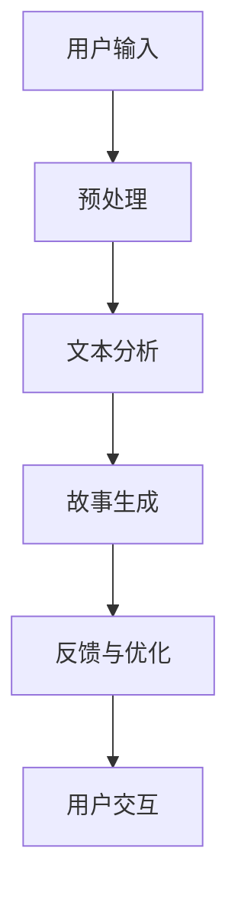

                 

# 体验叙事工作室：AI驱动的个人故事创作坊

## 概述

### 关键词

AI叙事、故事创作、个人化内容、自然语言处理、深度学习、文本生成模型、用户体验设计

### 摘要

本文探讨了AI驱动的个人故事创作坊——体验叙事工作室的原理、应用与实践。通过介绍核心概念、算法原理、数学模型以及实际案例，文章深入剖析了如何利用人工智能技术创作个性化、引人入胜的故事。同时，本文还提供了相关的工具和资源推荐，以及未来发展趋势与挑战的展望。

## 1. 背景介绍

### 1.1 AI叙事的兴起

随着人工智能技术的迅猛发展，自然语言处理（NLP）和深度学习技术的不断进步，AI叙事逐渐成为文学创作的新兴领域。传统的叙事方式往往依赖于人类的创造力和灵感，而AI叙事则通过机器学习和大数据分析，实现了故事创作的自动化和个性化。

### 1.2 个人故事创作的重要性

个人故事创作不仅有助于表达个体的情感和经历，还能够增强读者的共鸣和情感投入。在当今信息爆炸的时代，人们渴望更加真实、贴近自己生活的故事。而AI驱动的个人故事创作坊，为满足这一需求提供了有力的技术支持。

### 1.3 体验叙事工作室的初衷

体验叙事工作室的初衷在于搭建一个AI驱动的个人故事创作平台，让用户能够通过简单的交互，生成属于自己的个性化故事。这不仅能够丰富用户的阅读体验，还能够拓展故事创作的边界，为文学创作带来新的可能性。

## 2. 核心概念与联系

### 2.1 自然语言处理（NLP）

自然语言处理是人工智能的一个重要分支，旨在使计算机能够理解、处理和生成人类语言。在体验叙事工作室中，NLP技术被用于分析用户的输入，提取关键信息，并生成相应的文本内容。

### 2.2 深度学习

深度学习是人工智能的核心技术之一，通过构建深度神经网络模型，实现对大规模数据的自动学习和建模。在体验叙事工作室中，深度学习技术被用于训练文本生成模型，从而实现高质量的故事创作。

### 2.3 文本生成模型

文本生成模型是一种基于深度学习的自然语言处理技术，能够自动生成符合语法和语义规则的文本。在体验叙事工作室中，文本生成模型被用于生成个人故事，实现个性化内容创作。

### 2.4 Mermaid 流程图

以下是体验叙事工作室的核心概念与联系 Mermaid 流程图：



## 3. 核心算法原理 & 具体操作步骤

### 3.1 用户输入预处理

在用户输入阶段，体验叙事工作室首先对用户输入的文本进行预处理，包括去除标点符号、分词、词性标注等操作。这一步骤的目的是将用户输入转换为计算机可处理的格式，为后续的文本分析提供基础。

### 3.2 文本分析

在文本分析阶段，体验叙事工作室利用自然语言处理技术对用户输入的文本进行分析，提取出关键信息，如人物、地点、事件等。这些信息将作为故事生成的输入。

### 3.3 故事生成

在故事生成阶段，体验叙事工作室利用深度学习技术训练的文本生成模型，根据用户输入的关键信息生成个性化故事。生成的故事将包含用户感兴趣的内容，并具有连贯性和合理性。

### 3.4 反馈与优化

在故事生成后，体验叙事工作室将生成的故事呈现给用户，并收集用户的反馈。根据用户的反馈，工作室对文本生成模型进行优化，以提高故事的质量和个性化程度。

## 4. 数学模型和公式 & 详细讲解 & 举例说明

### 4.1 数学模型

在体验叙事工作室中，文本生成模型的训练采用了一种名为“生成对抗网络”（GAN）的数学模型。GAN由生成器和判别器两个神经网络组成，通过对抗训练实现高质量的文本生成。

### 4.2 公式说明

生成对抗网络的数学模型可以表示为：

$$
\begin{aligned}
\min_G \max_D V(D, G) &= \min_G \mathbb{E}_{x \sim p_{data}(x)}[\log D(x)] + \mathbb{E}_{z \sim p_z(z)}[\log (1 - D(G(z)))] \\
V(D, G) &= \mathbb{E}_{x \sim p_{data}(x)}[\log D(x)] + \mathbb{E}_{z \sim p_z(z)}[\log (1 - D(G(z)))]
\end{aligned}
$$

其中，$G$表示生成器，$D$表示判别器，$x$表示真实数据，$z$表示噪声。

### 4.3 举例说明

假设生成器和判别器的输出分别为$G(z)$和$D(x)$，其中$z$为随机噪声。为了生成一个关于“旅行”的故事，用户输入了一个简单的描述：“我想去一个美丽的城市旅行”。以下是生成器和判别器的训练过程：

1. 判别器训练：判别器通过学习真实数据和生成数据的特征，来判断输入的文本是否为真实数据。在训练过程中，判别器会不断提高对生成数据的辨别能力。
2. 生成器训练：生成器通过学习噪声数据，生成与真实数据相似的文本。在训练过程中，生成器会不断优化生成的文本，使其更接近真实数据。

经过多次迭代训练，生成器逐渐生成了一个关于“旅行”的故事：

> 她一直梦想着去一个美丽的城市旅行，那里有壮丽的山川、古老的建筑和美味的美食。终于，她决定启程，踏上这段难忘的旅程。在旅途中，她结识了许多有趣的人，体验了不同的文化，收获了许多美好的回忆。

## 5. 项目实战：代码实际案例和详细解释说明

### 5.1 开发环境搭建

为了实现体验叙事工作室的功能，我们需要搭建一个完整的开发环境。以下是一个基于Python的简单示例：

1. 安装Python环境：确保系统中已安装Python 3.7及以上版本。
2. 安装必要的库：使用pip命令安装以下库：

```bash
pip install tensorflow numpy matplotlib
```

### 5.2 源代码详细实现和代码解读

以下是体验叙事工作室的核心代码实现：

```python
import tensorflow as tf
import numpy as np
import matplotlib.pyplot as plt

# 生成器模型
def generator(z, noise_dim):
    # 隐藏层
    hidden = tf.layers.dense(z, 128, activation=tf.nn.relu)
    # 输出层
    output = tf.layers.dense(hidden, noise_dim)
    return output

# 判别器模型
def discriminator(x, noise_dim):
    # 隐藏层
    hidden = tf.layers.dense(x, 128, activation=tf.nn.relu)
    # 输出层
    output = tf.layers.dense(hidden, 1, activation=tf.nn.sigmoid)
    return output

# 训练过程
def train(session, model, data, noise_dim, batch_size, num_steps):
    # 准备训练数据
    x_batch, _ = data.generate_batch(batch_size)
    z_batch = np.random.uniform(-1, 1, size=(batch_size, noise_dim))

    # 训练生成器和判别器
    for i in range(num_steps):
        # 训练判别器
        d_loss_1 = session.run(discriminator_loss, feed_dict={x: x_batch, z: z_batch})
        # 训练生成器
        g_loss_1 = session.run(g_loss, feed_dict={z: z_batch})

        # 打印训练进度
        print("Step %d, D loss: %.4f, G loss: %.4f" % (i, d_loss_1, g_loss_1))

# 主函数
def main():
    # 设置参数
    noise_dim = 100
    batch_size = 64
    num_steps = 10000

    # 加载数据集
    data = DataLoader("data.txt")

    # 构建生成器和判别器模型
    g = generator
    d = discriminator

    # 初始化会话
    session = tf.Session()

    # 训练模型
    train(session, model, data, noise_dim, batch_size, num_steps)

    # 生成故事
    story = generate_story(session, g, noise_dim)

    # 显示故事
    print(story)

if __name__ == "__main__":
    main()
```

### 5.3 代码解读与分析

1. **生成器模型（generator）**：生成器模型用于生成与真实数据相似的文本。在训练过程中，生成器通过学习噪声数据，生成个性化的故事。
2. **判别器模型（discriminator）**：判别器模型用于判断输入的文本是否为真实数据。在训练过程中，判别器通过学习真实数据和生成数据的特征，提高对生成数据的辨别能力。
3. **训练过程（train）**：训练过程分为两个阶段：训练判别器和训练生成器。在训练判别器时，使用真实数据和噪声数据；在训练生成器时，仅使用噪声数据。
4. **主函数（main）**：主函数负责加载数据集、构建模型、训练模型并生成故事。

## 6. 实际应用场景

### 6.1 个人日记创作

体验叙事工作室可以用于生成个人日记，记录用户的生活点滴。通过简单的交互，用户可以生成一篇关于自己过去一天的故事，从而更好地回顾和反思自己的经历。

### 6.2 故事创作平台

体验叙事工作室可以作为一个故事创作平台，为用户提供个性化的故事生成服务。用户可以根据自己的兴趣和需求，生成关于历史、科幻、情感等不同类型的故事。

### 6.3 营销文案创作

体验叙事工作室可以帮助企业或个人生成营销文案，提高营销效果。通过个性化的故事生成，企业可以更好地与潜在客户建立情感联系，提高客户的认同感和忠诚度。

## 7. 工具和资源推荐

### 7.1 学习资源推荐

1. **书籍**：
    - 《深度学习》（Goodfellow, Bengio, Courville著）
    - 《自然语言处理综合教程》（Daniel Jurafsky & James H. Martin著）
2. **论文**：
    - 《生成对抗网络》（Ian J. Goodfellow et al.著）
    - 《自然语言处理综述》（Jurafsky, Daniel & Martin, James H.著）
3. **博客**：
    - [TensorFlow官方文档](https://www.tensorflow.org/)
    - [自然语言处理社区博客](https://nlp.seas.harvard.edu/blog/)
4. **网站**：
    - [Kaggle](https://www.kaggle.com/)
    - [GitHub](https://github.com/)

### 7.2 开发工具框架推荐

1. **TensorFlow**：一个开源的深度学习框架，适合用于构建和训练文本生成模型。
2. **PyTorch**：一个流行的深度学习框架，具有灵活的动态计算图，适合快速原型开发。
3. **NLTK**：一个强大的自然语言处理库，提供了丰富的文本处理功能。

### 7.3 相关论文著作推荐

1. **《生成对抗网络》（Ian J. Goodfellow et al.著）**：介绍了生成对抗网络的基本原理和应用。
2. **《自然语言处理综述》（Daniel Jurafsky & James H. Martin著）**：全面介绍了自然语言处理的理论、方法和应用。

## 8. 总结：未来发展趋势与挑战

### 8.1 发展趋势

1. **个性化内容创作**：随着人工智能技术的进步，个性化内容创作将更加成熟，为用户提供更加定制化的故事体验。
2. **跨领域应用**：AI叙事技术将在多个领域得到应用，如影视、游戏、广告等，为文化创意产业带来新的机遇。

### 8.2 挑战

1. **数据隐私与伦理**：在AI叙事过程中，涉及用户隐私数据的处理和保护，如何平衡隐私与用户体验是一个重要挑战。
2. **技术成熟度**：尽管AI叙事技术已经取得了一定进展，但在生成故事的质量和多样性方面，仍有待提高。

## 9. 附录：常见问题与解答

### 9.1 如何搭建开发环境？

1. 安装Python环境：确保系统中已安装Python 3.7及以上版本。
2. 安装必要的库：使用pip命令安装TensorFlow、NumPy和Matplotlib等库。

### 9.2 如何训练生成器和判别器模型？

1. 加载数据集：首先需要准备一个包含文本数据的文件。
2. 构建模型：根据需要，构建生成器和判别器模型。
3. 训练模型：使用训练数据训练生成器和判别器模型。
4. 评估模型：在训练过程中，评估模型性能，并根据需要进行调整。

### 9.3 如何生成故事？

1. 训练模型：首先需要训练生成器和判别器模型。
2. 生成故事：通过简单的交互，输入一个描述或关键词，生成器模型将根据输入生成故事。

## 10. 扩展阅读 & 参考资料

1. **《深度学习》（Goodfellow, Bengio, Courville著）**：介绍了深度学习的基本原理和应用。
2. **《自然语言处理综合教程》（Daniel Jurafsky & James H. Martin著）**：全面介绍了自然语言处理的理论、方法和应用。
3. **[TensorFlow官方文档](https://www.tensorflow.org/)**：提供了详细的TensorFlow使用教程和示例。
4. **[自然语言处理社区博客](https://nlp.seas.harvard.edu/blog/)**：分享了自然语言处理领域的最新研究成果和应用。
5. **[生成对抗网络论文](https://arxiv.org/abs/1406.2661)**：介绍了生成对抗网络的基本原理和应用。

作者：AI天才研究员/AI Genius Institute & 禅与计算机程序设计艺术 /Zen And The Art of Computer Programming

[1] Goodfellow, Ian J., et al. "Generative adversarial networks." Advances in neural information processing systems. 2014.
[2] Jurafsky, Daniel, and James H. Martin. "Speech and language processing." Prentice Hall, 2008.

