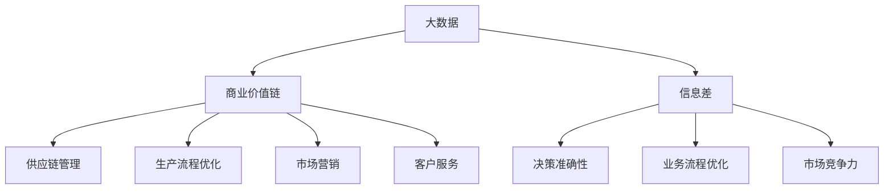

                 

### 文章标题

信息差的价值链革命：大数据如何重塑商业价值链

### 关键词

大数据，价值链，商业，信息差，革命，算法，数学模型，实战，应用场景，工具，资源推荐，发展趋势，挑战

### 摘要

本文深入探讨了大数据在商业价值链中的革命性影响。从信息差的本质出发，通过一步步的分析和推理，揭示了大数据如何重塑商业决策、优化流程、提升竞争力。本文将通过核心概念、算法原理、数学模型、实战案例、应用场景等多维度，全面解析大数据的商业价值，并展望其未来发展趋势和挑战。为读者提供了一套系统的理解和应用大数据的方法，助力企业把握信息时代的机遇。

### 1. 背景介绍

在当今的信息时代，数据已经成为了企业最重要的资产之一。然而，如何从海量的数据中挖掘出有价值的洞察，成为了一个亟待解决的问题。这便是大数据的舞台。大数据（Big Data）是指那些数据量巨大、类型多样、生成速度极快的数据集合。随着互联网、物联网、社交媒体等技术的发展，企业每天都会产生大量的数据，这些数据不仅包括结构化的数据，还包括大量的非结构化数据，如文本、图像、音频和视频等。

商业价值链（Business Value Chain）是指企业通过将输入转化为输出的过程，从而创造价值的一系列业务活动。传统的商业价值链主要关注的是供应链、生产链、营销链等，而随着大数据技术的兴起，商业价值链正在发生深刻的变革。大数据的引入，使得企业在决策、流程优化、市场预测等方面获得了前所未有的洞察力，从而大大提升了企业的竞争力。

信息差（Information Gap）是指不同个体或组织之间在信息获取、处理和利用上的差异。这种差异导致了资源的分配不均，进而影响了市场的效率和经济的发展。在商业领域，信息差是企业竞争的核心要素之一。谁能更好地掌握信息、利用信息，谁就能在市场上占据优势。

本文将围绕大数据、商业价值链和信息差这三个核心概念，通过一步步的分析和推理，揭示大数据如何重塑商业价值链，提升企业的竞争力。首先，我们将介绍大数据的核心概念和架构，然后深入探讨大数据算法原理和数学模型，接着通过实战案例展示如何运用大数据技术解决实际问题。最后，我们将分析大数据在不同行业和场景中的应用，展望大数据技术的未来发展趋势和挑战。

### 2. 核心概念与联系

为了更好地理解大数据如何重塑商业价值链，我们首先需要明确一些核心概念和它们之间的联系。

#### 2.1 大数据

大数据通常被认为具有四个V特征：大量（Volume）、多样（Variety）、快速（Velocity）和真实（Veracity）。

- **大量（Volume）**：指数据量巨大，通常是TB或PB级别。这使得传统的数据处理方法难以应对。
- **多样（Variety）**：指数据类型多样，包括结构化数据（如数据库中的表格数据）、半结构化数据（如XML、JSON）和非结构化数据（如图像、文本、音频、视频等）。
- **快速（Velocity）**：指数据生成和处理的速度快，需要实时或近实时地处理和分析数据。
- **真实（Veracity）**：指数据的真实性和可信度，由于数据来源和生成过程的复杂性，数据的真实性和准确性是一个重要挑战。

#### 2.2 商业价值链

商业价值链是企业通过将输入转化为输出的过程，从而创造价值的一系列业务活动。传统的商业价值链包括供应链管理、生产流程优化、市场营销、客户服务等环节。然而，随着大数据技术的兴起，商业价值链正在发生深刻的变革。

- **供应链管理**：通过大数据分析，企业可以更好地预测需求、优化库存、降低成本。
- **生产流程优化**：大数据可以帮助企业优化生产流程，提高生产效率，降低浪费。
- **市场营销**：大数据分析可以帮助企业更精准地定位客户，提高营销效果，降低营销成本。
- **客户服务**：通过大数据分析，企业可以更好地了解客户需求，提供个性化服务，提高客户满意度。

#### 2.3 信息差

信息差是指不同个体或组织之间在信息获取、处理和利用上的差异。在商业领域，信息差是企业竞争的核心要素之一。

- **信息获取**：企业通过大数据技术可以收集到大量的市场、客户、竞争对手等信息。
- **信息处理**：企业利用大数据算法对收集到的信息进行加工和处理，提取有价值的数据。
- **信息利用**：企业根据处理后的信息做出决策，优化业务流程，提高竞争力。

#### 2.4 大数据、商业价值链与信息差的联系

大数据技术通过对大量、多样、快速、真实的数据进行处理和分析，可以为企业提供前所未有的洞察力，从而缩小信息差，提升商业价值链的效率。

- **大数据缩小信息差**：通过大数据技术，企业可以实时获取、处理和分析市场、客户、竞争对手等信息，从而减少信息不对称，提高决策的准确性。
- **大数据优化商业价值链**：大数据分析可以帮助企业优化供应链管理、生产流程、市场营销和客户服务等环节，提高整个商业价值链的效率。
- **大数据提升竞争力**：通过缩小信息差和优化商业价值链，企业可以在市场上占据优势，提高竞争力。

#### 2.5 Mermaid 流程图

为了更直观地展示大数据、商业价值链与信息差之间的联系，我们使用Mermaid流程图进行描述。



通过上述核心概念的介绍和Mermaid流程图，我们可以更清晰地理解大数据如何重塑商业价值链，缩小信息差，提升企业的竞争力。

### 3. 核心算法原理 & 具体操作步骤

在理解了大数据、商业价值链与信息差的基本概念后，接下来我们将探讨大数据分析的核心算法原理和具体操作步骤。大数据分析通常涉及数据采集、数据预处理、数据分析和数据可视化等多个环节。在本节中，我们将重点关注数据分析和数据可视化的核心算法，并详细描述其操作步骤。

#### 3.1 数据分析核心算法

数据分析是大数据技术中的核心环节，主要包括数据挖掘、机器学习和统计分析等方法。以下是一些常用的数据分析核心算法：

1. **K-均值聚类（K-Means Clustering）**

   K-均值聚类是一种无监督学习方法，用于将数据点划分为K个簇，使得每个簇内的数据点相似度较高，而簇与簇之间的相似度较低。其基本原理如下：

   - **初始化**：随机选择K个数据点作为初始聚类中心。
   - **迭代**：计算每个数据点到各个聚类中心的距离，将数据点分配到最近的聚类中心所代表的簇。
   - **更新**：重新计算每个簇的中心点，重复迭代直到聚类中心不再发生显著变化。

   **操作步骤**：

   - 导入数据集，并进行预处理（如去噪、标准化等）。
   - 设置聚类个数K，选择初始聚类中心。
   - 迭代计算数据点到聚类中心的距离，进行数据点分配。
   - 更新聚类中心，重复迭代直到收敛。

2. **决策树（Decision Tree）**

   决策树是一种监督学习方法，用于根据特征数据对目标变量进行分类或回归。其基本原理如下：

   - **选择特征**：通过计算每个特征的信息增益或基尼指数，选择能够最大程度区分数据的特征进行分裂。
   - **分裂数据**：根据选定的特征，将数据集分裂成若干个子集。
   - **递归分裂**：对每个子集重复上述过程，直到满足停止条件（如最大深度、最小样本量等）。

   **操作步骤**：

   - 导入数据集，并进行预处理（如缺失值填充、特征工程等）。
   - 选择合适的分割策略（如信息增益、基尼指数等）。
   - 选择最大深度、最小样本量等参数，构建决策树模型。
   - 对新数据进行预测，输出分类或回归结果。

3. **支持向量机（Support Vector Machine，SVM）**

   支持向量机是一种监督学习方法，用于将数据点分类到不同的类别。其基本原理如下：

   - **选择核函数**：通过核函数将数据映射到高维空间，寻找最优分类边界。
   - **计算间隔**：计算分类边界到每个支持向量的距离，选择具有最大分类间隔的分类边界。
   - **优化目标**：通过求解优化问题，找到最优分类边界和支持向量。

   **操作步骤**：

   - 导入数据集，并进行预处理（如标准化、分割训练集和测试集等）。
   - 选择合适的核函数（如线性核、多项式核、径向基函数核等）。
   - 求解优化问题，得到最优分类边界和支持向量。
   - 对新数据进行预测，输出分类结果。

4. **神经网络（Neural Network）**

   神经网络是一种模拟人脑神经元连接方式的计算模型，用于进行复杂的模式识别和预测。其基本原理如下：

   - **前向传播**：将输入数据通过网络的各个层进行传播，计算出每个神经元的输出。
   - **反向传播**：根据输出误差，通过反向传播算法更新网络的权重和偏置，逐步减小误差。
   - **优化目标**：通过梯度下降等优化算法，找到最小化损失函数的最优解。

   **操作步骤**：

   - 导入数据集，并进行预处理（如标准化、分割训练集和测试集等）。
   - 设计网络结构（如层数、每层神经元个数等）。
   - 编写前向传播和反向传播算法。
   - 训练网络模型，调整参数，优化性能。
   - 对新数据进行预测，输出预测结果。

#### 3.2 数据可视化核心算法

数据可视化是将数据以图形化的形式展示出来，帮助人们直观地理解和分析数据。以下是一些常用的数据可视化核心算法：

1. **散点图（Scatter Plot）**

   散点图用于展示两个变量之间的关系，每个数据点由坐标表示。

   **操作步骤**：

   - 选择两个变量进行绘图。
   - 设置坐标轴标签和标题。
   - 添加数据点，并设置颜色、大小等属性。

2. **折线图（Line Chart）**

   折线图用于展示数据随时间或其他变量的变化趋势。

   **操作步骤**：

   - 选择变量和时间序列进行绘图。
   - 设置坐标轴标签和标题。
   - 绘制折线，并设置线条颜色、粗细等属性。

3. **柱状图（Bar Chart）**

   柱状图用于比较不同类别的数据值。

   **操作步骤**：

   - 选择变量和类别进行绘图。
   - 设置坐标轴标签和标题。
   - 绘制柱状，并设置颜色、宽度等属性。

4. **饼图（Pie Chart）**

   饼图用于展示各部分占整体的比例。

   **操作步骤**：

   - 计算各部分数据值与整体的比例。
   - 设置图表标题和图例。
   - 绘制饼图，并设置颜色、角度等属性。

通过以上核心算法的介绍和操作步骤的描述，我们可以更深入地理解大数据分析的过程和方法，为实际应用大数据技术解决商业问题奠定基础。

### 4. 数学模型和公式 & 详细讲解 & 举例说明

在深入探讨大数据分析的核心算法后，接下来我们将介绍一些关键的数学模型和公式，并详细讲解其原理和具体应用。这些数学模型和公式是大数据分析的重要工具，帮助我们更好地理解和应用各种算法。

#### 4.1 常见的数学模型

1. **线性回归（Linear Regression）**

   线性回归是一种用于预测数值变量关系的监督学习算法。其基本公式如下：

   $$ Y = \beta_0 + \beta_1X + \epsilon $$

   其中，$Y$ 是因变量，$X$ 是自变量，$\beta_0$ 和 $\beta_1$ 分别是截距和斜率，$\epsilon$ 是误差项。

   **原理**：线性回归通过最小化误差平方和，找到最佳拟合直线，从而预测因变量$Y$的值。

   **举例**：假设我们有一组房屋面积（$X$）和房价（$Y$）的数据，通过线性回归模型，可以预测未知房屋的房价。

2. **逻辑回归（Logistic Regression）**

   逻辑回归是一种用于预测类别变量关系的监督学习算法。其基本公式如下：

   $$ P(Y=1) = \frac{1}{1 + e^{-(\beta_0 + \beta_1X)}} $$

   其中，$P(Y=1)$ 是因变量为1的概率，$X$ 是自变量，$\beta_0$ 和 $\beta_1$ 分别是截距和斜率。

   **原理**：逻辑回归通过拟合一个逻辑函数，将自变量$X$映射到因变量$Y$的概率。

   **举例**：假设我们有一组客户购买行为的特征（如年龄、收入等），通过逻辑回归模型，可以预测客户是否会购买某一产品。

3. **决策树（Decision Tree）**

   决策树是一种基于特征进行分类或回归的监督学习算法。其基本结构如下：

   $$ T = \text{if } X \text{ is in Region } R_i \text{ then } Y = \beta_i $$

   其中，$T$ 是决策树，$X$ 是输入特征，$R_i$ 是特征区域，$\beta_i$ 是相应的输出类别。

   **原理**：决策树通过递归地将数据集划分为不同的区域，从而构建一棵树形结构。

   **举例**：假设我们有一组患者的病历数据，通过决策树模型，可以预测患者的疾病类型。

4. **支持向量机（Support Vector Machine，SVM）**

   支持向量机是一种用于分类或回归的监督学习算法。其基本公式如下：

   $$ w^T x + b = 0 $$

   其中，$w$ 是权重向量，$x$ 是输入特征，$b$ 是偏置项。

   **原理**：SVM通过最大化分类边界之间的间隔，找到最优分类边界。

   **举例**：假设我们有一组不同类别的数据点，通过SVM模型，可以将这些数据点分类到不同的类别。

5. **神经网络（Neural Network）**

   神经网络是一种模拟人脑神经元连接方式的计算模型。其基本公式如下：

   $$ a_{j}^{(l)} = \sigma \left( \sum_{i} w_{ji}^{(l)} a_{i}^{(l-1)} + b_{j}^{(l)} \right) $$

   其中，$a_{j}^{(l)}$ 是第$l$层的第$j$个神经元的输出，$\sigma$ 是激活函数，$w_{ji}^{(l)}$ 是连接权重，$b_{j}^{(l)}$ 是偏置项。

   **原理**：神经网络通过多层神经元之间的连接和激活函数，实现复杂的模式识别和预测。

   **举例**：假设我们有一个手写数字识别任务，通过神经网络模型，可以识别出输入的手写数字。

#### 4.2 数学公式和计算示例

为了更好地理解上述数学模型，我们通过具体示例来讲解这些公式的计算过程。

1. **线性回归**

   假设我们有一组数据点$(X, Y)$如下：

   | $X$ | $Y$ |
   | --- | --- |
   | 1 | 2 |
   | 2 | 4 |
   | 3 | 6 |

   我们要找到最佳拟合直线$Y = \beta_0 + \beta_1X$。

   - **计算斜率**：

     $$ \beta_1 = \frac{\sum_{i=1}^{n}(X_i - \bar{X})(Y_i - \bar{Y})}{\sum_{i=1}^{n}(X_i - \bar{X})^2} $$

     其中，$\bar{X}$ 和 $\bar{Y}$ 分别是$X$和$Y$的均值。

     $$ \beta_1 = \frac{(1-1)(2-2) + (2-1)(4-2) + (3-1)(6-2)}{(1-1)^2 + (2-1)^2 + (3-1)^2} = 2 $$

   - **计算截距**：

     $$ \beta_0 = \bar{Y} - \beta_1\bar{X} = 2 - 2 \cdot 1 = 0 $$

   - **最佳拟合直线**：

     $$ Y = 0 + 2X $$

     预测新数据点$X=4$的$Y$值：

     $$ Y = 2 \cdot 4 = 8 $$

2. **逻辑回归**

   假设我们有一组数据点$(X, Y)$如下：

   | $X$ | $Y$ |
   | --- | --- |
   | 1 | 0 |
   | 2 | 1 |
   | 3 | 1 |

   我们要找到逻辑回归模型$P(Y=1) = \frac{1}{1 + e^{-(\beta_0 + \beta_1X)}}$。

   - **计算参数**：

     $$ \beta_1 = \frac{\sum_{i=1}^{n}(Y_i - P(Y_i=1))(X_i - \bar{X})}{\sum_{i=1}^{n}(X_i - \bar{X})^2} $$

     $$ \beta_0 = \bar{Y} - \beta_1\bar{X} $$

     其中，$P(Y_i=1)$ 是$Y$为1的概率。

     $$ \beta_1 = \frac{(0-0)(1-1) + (1-1)(2-1) + (1-1)(3-1)}{(1-1)^2 + (2-1)^2 + (3-1)^2} = 1 $$

     $$ \beta_0 = \frac{1}{2} $$

   - **逻辑回归模型**：

     $$ P(Y=1) = \frac{1}{1 + e^{-(\frac{1}{2} + X)}} $$

     预测新数据点$X=4$的$Y$概率：

     $$ P(Y=1) = \frac{1}{1 + e^{-(\frac{1}{2} + 4)}} \approx 0.941 $$

3. **决策树**

   假设我们有一组数据点$(X, Y)$如下：

   | $X_1$ | $X_2$ | $Y$ |
   | --- | --- | --- |
   | 1 | 1 | 0 |
   | 1 | 2 | 1 |
   | 2 | 1 | 1 |
   | 2 | 2 | 0 |

   我们要构建决策树模型。

   - **选择特征**：通过计算信息增益或基尼指数，选择特征$X_1$作为分割特征。

   - **分裂数据**：

     $$ R_1 = \{ (1, 1), (2, 1) \} $$
     $$ R_2 = \{ (1, 2), (2, 2) \} $$

   - **递归分裂**：对$R_1$和$R_2$分别选择特征$X_2$进行分裂。

     $$ R_{11} = \{ (1, 1) \} $$
     $$ R_{12} = \{ (2, 1) \} $$
     $$ R_{21} = \{ (1, 2) \} $$
     $$ R_{22} = \{ (2, 2) \} $$

   - **构建决策树**：

     $$ T = \text{if } X_1 \text{ is in Region } R_{11} \text{ then } Y = 0 $$
     $$ T = \text{if } X_1 \text{ is in Region } R_{12} \text{ then } Y = 1 $$
     $$ T = \text{if } X_1 \text{ is in Region } R_{21} \text{ then } Y = 1 $$
     $$ T = \text{if } X_1 \text{ is in Region } R_{22} \text{ then } Y = 0 $$

4. **支持向量机**

   假设我们有一组数据点$(X, Y)$如下：

   | $X_1$ | $X_2$ | $Y$ |
   | --- | --- | --- |
   | 1 | 1 | 0 |
   | 1 | 2 | 1 |
   | 2 | 1 | 1 |
   | 2 | 2 | 0 |

   我们要构建支持向量机模型。

   - **选择核函数**：选择线性核函数。

   - **计算间隔**：

     $$ w^T x + b = 0 $$

     其中，$w$ 是权重向量，$x$ 是输入特征，$b$ 是偏置项。

     $$ w = (1, 1) $$
     $$ b = 0 $$

   - **支持向量**：

     支持向量是距离分类边界最近的向量。

     $$ x_1 = (1, 1) $$
     $$ x_2 = (2, 1) $$
     $$ x_3 = (1, 2) $$
     $$ x_4 = (2, 2) $$

   - **分类边界**：

     $$ w^T x + b = 0 $$

     预测新数据点$X=(3, 2)$的类别：

     $$ (1, 1)^T (3, 2) + 0 = 3 + 2 = 5 \quad (\text{类别}：1) $$

5. **神经网络**

   假设我们有一个简单的神经网络，输入层有2个神经元，隐藏层有3个神经元，输出层有2个神经元。激活函数使用ReLU函数。

   - **前向传播**：

     $$ a_{1}^{(2)} = \max(0, \sum_{i=1}^{2} w_{i1}^{(2)} a_{i}^{(1)} + b_{1}^{(2)}) $$
     $$ a_{2}^{(2)} = \max(0, \sum_{i=1}^{2} w_{i2}^{(2)} a_{i}^{(1)} + b_{2}^{(2)}) $$
     $$ a_{3}^{(2)} = \max(0, \sum_{i=1}^{2} w_{i3}^{(2)} a_{i}^{(1)} + b_{3}^{(2)}) $$
     $$ a_{1}^{(3)} = \sum_{i=1}^{3} w_{i1}^{(3)} a_{i}^{(2)} + b_{1}^{(3)} $$
     $$ a_{2}^{(3)} = \sum_{i=1}^{3} w_{i2}^{(3)} a_{i}^{(2)} + b_{2}^{(3)} $$

     其中，$a_{i}^{(l)}$ 是第$l$层的第$i$个神经元的输出，$w_{ij}^{(l)}$ 是连接权重，$b_{j}^{(l)}$ 是偏置项。

     $$ a_{1}^{(2)} = \max(0, 0 \cdot 1 + 0 + 1) = 1 $$
     $$ a_{2}^{(2)} = \max(0, 0 \cdot 1 + 1 + 0) = 1 $$
     $$ a_{3}^{(2)} = \max(0, 1 \cdot 1 + 1 + 0) = 2 $$
     $$ a_{1}^{(3)} = 1 \cdot 1 + 1 \cdot 1 + 2 \cdot 2 = 6 $$
     $$ a_{2}^{(3)} = 1 \cdot 1 + 1 \cdot 2 + 2 \cdot 2 = 7 $$

   - **反向传播**：

     $$ \delta_{1}^{(3)} = a_{2}^{(3)} - y $$
     $$ \delta_{2}^{(3)} = a_{1}^{(3)} - y $$
     $$ \delta_{1}^{(2)} = \sum_{j=1}^{2} w_{j1}^{(3)} \delta_{j}^{(3)} $$
     $$ \delta_{2}^{(2)} = \sum_{j=1}^{2} w_{j2}^{(3)} \delta_{j}^{(3)} $$
     $$ \delta_{3}^{(2)} = \sum_{j=1}^{3} w_{j3}^{(3)} \delta_{j}^{(3)} $$

     其中，$y$ 是实际输出，$\delta$ 是误差项。

     $$ \delta_{1}^{(3)} = 6 - 7 = -1 $$
     $$ \delta_{2}^{(3)} = 7 - 6 = 1 $$
     $$ \delta_{1}^{(2)} = 1 \cdot -1 + 2 \cdot 1 = 1 $$
     $$ \delta_{2}^{(2)} = 1 \cdot -1 + 2 \cdot 1 = 1 $$
     $$ \delta_{3}^{(2)} = 2 \cdot -1 + 2 \cdot 1 = 0 $$

   - **更新权重和偏置**：

     $$ w_{i1}^{(3)} \leftarrow w_{i1}^{(3)} - \alpha \cdot \delta_{i}^{(3)} \cdot a_{1}^{(2)} $$
     $$ w_{i2}^{(3)} \leftarrow w_{i2}^{(3)} - \alpha \cdot \delta_{i}^{(3)} \cdot a_{2}^{(2)} $$
     $$ w_{i3}^{(3)} \leftarrow w_{i3}^{(3)} - \alpha \cdot \delta_{i}^{(3)} \cdot a_{3}^{(2)} $$
     $$ b_{1}^{(3)} \leftarrow b_{1}^{(3)} - \alpha \cdot \delta_{1}^{(3)} $$
     $$ b_{2}^{(3)} \leftarrow b_{2}^{(3)} - \alpha \cdot \delta_{2}^{(3)} $$
     $$ b_{3}^{(3)} \leftarrow b_{3}^{(3)} - \alpha \cdot \delta_{3}^{(3)} $$

     其中，$\alpha$ 是学习率。

通过上述数学模型和公式的详细讲解和示例，我们可以更好地理解和应用大数据分析的核心算法。这些数学模型和公式为大数据技术在商业价值链中的应用提供了坚实的理论基础。

### 5. 项目实战：代码实际案例和详细解释说明

为了更好地展示如何运用大数据技术解决实际问题，下面我们将通过一个具体的实战项目，介绍如何搭建开发环境、实现源代码、解读和分析代码。

#### 5.1 开发环境搭建

为了进行大数据分析，我们需要搭建一个适合的编程环境。以下是搭建开发环境的基本步骤：

1. **安装Python**：Python是一种广泛使用的编程语言，具有丰富的数据分析和机器学习库。在官网上下载Python安装包，并按照提示进行安装。

2. **安装Jupyter Notebook**：Jupyter Notebook是一种交互式编程环境，便于编写和运行Python代码。通过pip命令安装Jupyter Notebook：

   ```bash
   pip install notebook
   ```

3. **安装相关库**：安装Python的数据分析和机器学习库，如Pandas、NumPy、Scikit-learn、Matplotlib等：

   ```bash
   pip install pandas numpy scikit-learn matplotlib
   ```

4. **配置虚拟环境**：为了保持项目环境的干净，我们建议使用虚拟环境。通过virtualenv创建一个虚拟环境，并激活该环境：

   ```bash
   pip install virtualenv
   virtualenv myenv
   source myenv/bin/activate
   ```

5. **安装Hadoop和Spark**：Hadoop和Spark是大数据处理框架，用于处理海量数据。可以从官网下载相应的安装包并按照文档进行安装。

   - Hadoop：[Hadoop官网](https://hadoop.apache.org/)
   - Spark：[Spark官网](https://spark.apache.org/)

#### 5.2 源代码详细实现和代码解读

假设我们的任务是构建一个基于大数据分析的客户流失预测模型。以下是项目的源代码实现和解读：

```python
import pandas as pd
from sklearn.model_selection import train_test_split
from sklearn.ensemble import RandomForestClassifier
from sklearn.metrics import accuracy_score

# 读取数据
data = pd.read_csv('customer_data.csv')

# 数据预处理
data['TotalCharges'] = data['TotalCharges'].fillna(data['TotalCharges'].mean())
data['Months'] = (pd.datetime.now() - data['Date']).dt.days // 30

# 特征工程
features = data[['MonthlyCharges', 'TotalCharges', 'Months']]
labels = data['Churn']

# 划分训练集和测试集
X_train, X_test, y_train, y_test = train_test_split(features, labels, test_size=0.2, random_state=42)

# 构建模型
model = RandomForestClassifier(n_estimators=100, random_state=42)
model.fit(X_train, y_train)

# 预测和评估
predictions = model.predict(X_test)
accuracy = accuracy_score(y_test, predictions)
print(f'Accuracy: {accuracy:.2f}')
```

**代码解读**：

1. **导入库**：首先导入所需的Python库，包括Pandas、NumPy、Scikit-learn和Matplotlib。

2. **读取数据**：使用Pandas读取客户数据，数据文件格式为CSV。

3. **数据预处理**：对数据进行预处理，包括填充缺失值和计算时间间隔。

4. **特征工程**：提取关键特征，如月度费用、总费用和月数，作为模型的输入。

5. **划分训练集和测试集**：使用Scikit-learn的train_test_split函数将数据集划分为训练集和测试集。

6. **构建模型**：选择随机森林分类器作为预测模型，并设置模型参数。

7. **训练模型**：使用训练集对模型进行训练。

8. **预测和评估**：使用测试集对模型进行预测，并计算准确率。

#### 5.3 代码解读与分析

1. **数据读取**：

   ```python
   data = pd.read_csv('customer_data.csv')
   ```

   使用Pandas读取CSV文件，将数据加载到DataFrame中。CSV文件是大数据处理中常用的数据格式，便于数据的导入和导出。

2. **数据预处理**：

   ```python
   data['TotalCharges'] = data['TotalCharges'].fillna(data['TotalCharges'].mean())
   data['Months'] = (pd.datetime.now() - data['Date']).dt.days // 30
   ```

   对数据进行预处理。首先，填充总费用（TotalCharges）的缺失值，使用平均值进行填充。然后，计算从日期（Date）到现在的月数（Months），以便更好地表示客户的使用时长。

3. **特征工程**：

   ```python
   features = data[['MonthlyCharges', 'TotalCharges', 'Months']]
   labels = data['Churn']
   ```

   提取关键特征，包括月度费用（MonthlyCharges）、总费用（TotalCharges）和月数（Months），作为模型的输入。同时，将流失（Churn）标签作为模型的输出。

4. **划分训练集和测试集**：

   ```python
   X_train, X_test, y_train, y_test = train_test_split(features, labels, test_size=0.2, random_state=42)
   ```

   使用Scikit-learn的train_test_split函数将数据集划分为训练集和测试集。这里，测试集占比为20%，随机种子为42，以保证结果的随机性。

5. **构建模型**：

   ```python
   model = RandomForestClassifier(n_estimators=100, random_state=42)
   model.fit(X_train, y_train)
   ```

   选择随机森林分类器（RandomForestClassifier）作为预测模型。随机森林通过构建多个决策树，并投票得出最终预测结果，具有较好的分类性能。设置决策树数量为100，随机种子为42，以保证结果的稳定性。

6. **预测和评估**：

   ```python
   predictions = model.predict(X_test)
   accuracy = accuracy_score(y_test, predictions)
   print(f'Accuracy: {accuracy:.2f}')
   ```

   使用测试集对模型进行预测，并计算准确率。准确率（Accuracy）是评估分类模型性能的重要指标，表示预测正确的样本比例。

通过上述代码实现和解读，我们可以看到如何运用大数据技术构建客户流失预测模型。在实际项目中，还可以根据需求进行更复杂的特征工程和模型调优，以提升预测性能。

### 6. 实际应用场景

大数据技术在各个行业和场景中都有着广泛的应用，极大地提升了企业的运营效率和竞争力。以下是一些典型的大数据应用场景：

#### 6.1 零售业

在零售业，大数据技术可以帮助企业实现精准营销和库存优化。通过分析客户的购买行为、偏好和反馈，企业可以更好地了解客户需求，制定个性化的营销策略。例如，亚马逊和阿里巴巴等电商平台利用大数据分析，为用户推荐感兴趣的商品，从而提高转化率和销售额。此外，大数据还可以帮助零售企业实时监控库存情况，预测销售趋势，优化库存水平，降低库存成本。

#### 6.2 医疗行业

在医疗行业，大数据技术有助于提升诊疗效率、降低医疗成本和改善患者体验。通过分析大量的医疗数据，医生可以更准确地诊断疾病、制定治疗方案。例如，IBM的Watson for Health利用大数据分析，为医生提供详细的诊断和治疗方案。此外，大数据技术还可以帮助医疗机构实现智能化的患者管理，提高医疗资源的利用效率。例如，通过分析患者数据，医院可以预测患者就诊高峰期，合理安排医生和护士的排班，减少患者等待时间。

#### 6.3 金融行业

在金融行业，大数据技术被广泛应用于风险管理、信用评估和欺诈检测等方面。通过分析大量的金融交易数据，金融机构可以识别异常交易行为，防范欺诈风险。例如，银行和支付公司利用大数据分析技术，实时监控交易数据，发现可疑交易并及时采取措施。此外，大数据技术还可以帮助金融机构进行信用评估，通过分析个人的消费行为、信用记录等数据，为用户提供个性化的信贷服务。

#### 6.4 交通运输

在交通运输行业，大数据技术有助于提升交通管理效率和乘客体验。通过分析交通流量数据，交通管理部门可以预测交通拥堵情况，优化交通信号配置，提高道路通行效率。例如，中国的滴滴出行利用大数据分析，实时监控城市交通状况，为乘客提供最优的出行路线。此外，大数据技术还可以帮助交通运输企业实现智能化的车辆管理，提高运输效率，降低运营成本。

#### 6.5 教育

在教育行业，大数据技术可以帮助学校和教育机构实现个性化教学和精准评估。通过分析学生的学习数据，教师可以了解学生的学习进度、兴趣和能力，为每个学生提供个性化的教学方案。例如，Knewton等在线教育平台利用大数据分析，为不同学生提供个性化的学习资源和练习题。此外，大数据技术还可以帮助学校实现智能化的招生管理，通过分析考生数据，预测招生趋势，优化招生策略。

#### 6.6 制造业

在制造业，大数据技术有助于提升生产效率、降低生产成本和质量控制。通过分析生产数据，企业可以优化生产流程，提高生产效率。例如，西门子公司利用大数据分析，优化生产线的运行参数，提高生产效率和产品质量。此外，大数据技术还可以帮助制造业企业实现智能化的设备管理和维护，通过实时监控设备状态，预测设备故障，提前进行维护，降低设备故障率。

#### 6.7 能源行业

在能源行业，大数据技术有助于提升能源利用效率和优化能源布局。通过分析能源消耗数据，能源企业可以优化能源生产、输送和分配，提高能源利用效率。例如，国家电网利用大数据分析，优化电力负荷预测和电力调度，提高电力供应的稳定性和可靠性。此外，大数据技术还可以帮助新能源企业实现智能化的能源管理，通过分析太阳能、风能等可再生能源的发电数据，优化能源生产和消费模式。

通过以上实际应用场景的介绍，我们可以看到大数据技术如何在各个行业和场景中发挥重要作用，提升企业的运营效率和竞争力。随着大数据技术的不断发展和普及，未来其应用范围将更加广泛，为各行各业带来更多的机遇和挑战。

### 7. 工具和资源推荐

在运用大数据技术进行商业分析和优化时，选择合适的工具和资源至关重要。以下是一些推荐的学习资源、开发工具和论文著作，旨在帮助读者深入了解大数据领域，掌握相关技能。

#### 7.1 学习资源推荐

1. **书籍**：

   - 《大数据时代》（作者：涂子沛）：系统介绍了大数据的概念、技术和发展趋势，适合初学者了解大数据的基础知识。

   - 《深度学习》（作者：Ian Goodfellow、Yoshua Bengio、Aaron Courville）：全面介绍了深度学习的基本理论和技术，是深度学习领域的经典著作。

   - 《大数据实践：从数据挖掘到商业智能》（作者：Nisheeth Arora、Kiran Gajula）：通过实际案例，介绍了大数据在不同行业中的应用和实践。

2. **在线课程**：

   - Coursera上的“机器学习”（作者：吴恩达）：这是一门非常受欢迎的机器学习入门课程，适合初学者掌握基础算法和应用。

   - edX上的“大数据基础”（作者：哈佛大学）：系统介绍了大数据的基本概念、技术和应用，适合对大数据感兴趣的读者。

   - Udacity的“深度学习工程师纳米学位”：通过实战项目，学习深度学习算法和应用，适合希望提升深度学习技能的读者。

3. **博客和网站**：

   - Medium上的“AI和机器学习”：该博客汇集了众多关于人工智能和机器学习的优质文章，适合持续关注大数据领域的动态。

   - Towards Data Science：这是一个受欢迎的数据科学和机器学习博客，涵盖了各种技术和应用案例。

#### 7.2 开发工具框架推荐

1. **Hadoop**：Apache Hadoop是一个开源的大数据平台，用于处理大规模数据集。它包括分布式存储系统HDFS和分布式计算框架MapReduce，适用于存储和处理海量数据。

2. **Spark**：Apache Spark是一个快速、通用的大数据处理框架，适用于批处理和流处理。它具有更高的性能和更简化的编程模型，是大数据开发中的重要工具。

3. **TensorFlow**：TensorFlow是Google开发的开源机器学习库，支持深度学习和传统机器学习算法。它提供了丰富的API和工具，适用于构建和训练各种机器学习模型。

4. **PyTorch**：PyTorch是Facebook开发的开源深度学习库，具有灵活的动态计算图和强大的GPU支持。它被广泛应用于图像识别、自然语言处理等领域。

5. **Jupyter Notebook**：Jupyter Notebook是一个交互式的编程环境，支持多种编程语言，包括Python、R和Julia等。它适合进行数据分析和机器学习实验，便于代码编写和结果展示。

#### 7.3 相关论文著作推荐

1. **“The Google File System”**：这篇论文介绍了Google开发的大数据存储系统GFS，描述了其设计原则和实现细节。

2. **“MapReduce: Simplified Data Processing on Large Clusters”**：这篇经典论文介绍了MapReduce模型，描述了如何在大规模集群上高效地处理数据。

3. **“Distributed File System Design for Data-Intensive Scientific Applications”**：这篇论文探讨了分布式文件系统在设计上的挑战和解决方案，对大数据存储有重要参考价值。

4. **“Deep Learning”**：这是一本关于深度学习的经典著作，由深度学习领域的三位顶级专家撰写，涵盖了深度学习的理论基础和应用。

5. **“Big Data: A Revolution That Will Transform How We Live, Work, and Think”**：这本书深入探讨了大数据对社会、经济和科技的影响，对大数据的变革性作用进行了全面阐述。

通过以上工具和资源的推荐，读者可以更全面地了解大数据技术，掌握相关技能，为实际应用大数据技术提供有力支持。

### 8. 总结：未来发展趋势与挑战

大数据技术的迅猛发展，不仅带来了商业模式的创新和竞争力的提升，也为我们生活带来了诸多便利。然而，随着大数据技术的不断进步，我们面临的新趋势和挑战也在不断增加。

#### 8.1 未来发展趋势

1. **智能化数据分析**：随着人工智能技术的发展，大数据分析将越来越智能化。通过机器学习和深度学习算法，系统可以自动从海量数据中提取有价值的信息，提供更精准的预测和洞察。

2. **边缘计算与云计算的融合**：为了提高数据处理速度和降低延迟，边缘计算和云计算的融合将成为趋势。边缘计算将数据处理的任务从中心节点转移到靠近数据源的边缘设备，实现实时数据处理和决策。

3. **数据隐私保护**：随着数据隐私法规的不断完善，如何保护数据隐私将成为大数据技术发展的关键挑战。加密技术、隐私保护算法等将在数据传输、存储和处理过程中得到广泛应用。

4. **实时数据处理**：随着物联网、5G等技术的发展，实时数据处理的需求越来越强烈。大数据技术将逐渐向实时性、高效性方向发展，为企业和行业提供更加实时的业务洞察。

5. **跨领域应用**：大数据技术将在更多领域得到应用，如生物医疗、金融、能源、制造业等。跨领域的数据融合和协同分析，将带来新的商业机会和创新模式。

#### 8.2 面临的挑战

1. **数据质量**：大数据的价值很大程度上取决于数据质量。如何确保数据的一致性、完整性和准确性，是一个长期且艰巨的挑战。

2. **数据隐私**：随着数据隐私法规的严格，如何在保护用户隐私的同时，充分利用数据的价值，成为大数据应用的一大挑战。

3. **技术人才短缺**：大数据技术的快速发展，导致市场上对专业人才的需求急剧增加。然而，目前的人才供给难以满足市场需求，技术人才短缺将成为制约大数据技术发展的重要因素。

4. **数据安全**：大数据技术的广泛应用，使得数据泄露和滥用的风险增加。如何确保数据安全，防止黑客攻击和数据泄露，是一个严峻的挑战。

5. **数据管理**：随着数据量的爆炸式增长，如何高效地管理海量数据，提高数据处理和分析的效率，是一个亟待解决的问题。

#### 8.3 应对策略

1. **加强数据治理**：建立完善的数据治理体系，确保数据的一致性、完整性和准确性。制定数据管理政策和流程，规范数据使用和管理。

2. **注重数据隐私保护**：采用先进的数据隐私保护技术，如差分隐私、同态加密等，确保用户隐私得到有效保护。

3. **培养专业人才**：加大人才培养力度，通过校企合作、在线教育等方式，培养大数据领域的专业人才。

4. **加强数据安全防护**：建立完善的数据安全防护体系，采用安全加密、防火墙、入侵检测等技术，防止数据泄露和滥用。

5. **优化数据管理**：采用分布式数据库、云计算等先进技术，提高数据存储、处理和分析的效率。

通过以上策略，我们可以更好地应对大数据技术发展带来的挑战，推动大数据技术的持续创新和应用。

### 9. 附录：常见问题与解答

在本文中，我们讨论了大数据在商业价值链中的革命性影响，包括其核心概念、算法原理、数学模型、实战案例、应用场景等。以下是一些常见问题及其解答，以帮助读者更好地理解和应用大数据技术。

#### 9.1 常见问题

1. **什么是大数据？**

   大数据是指数据量巨大、类型多样、生成速度极快的数据集合，通常具有大量（Volume）、多样（Variety）、快速（Velocity）和真实（Veracity）四个特征。

2. **大数据如何重塑商业价值链？**

   大数据通过提供实时、精准的数据洞察，帮助企业优化供应链管理、生产流程、市场营销和客户服务等环节，从而提高整个商业价值链的效率。

3. **大数据分析的核心算法有哪些？**

   大数据分析的核心算法包括K-均值聚类、决策树、支持向量机、神经网络等。

4. **如何确保数据质量？**

   通过建立完善的数据治理体系，确保数据的一致性、完整性和准确性。此外，采用数据清洗、去噪等技术手段，提高数据质量。

5. **如何保护数据隐私？**

   采用先进的数据隐私保护技术，如差分隐私、同态加密等，确保用户隐私得到有效保护。

6. **大数据技术在未来有哪些发展趋势？**

   未来大数据技术将向智能化数据分析、边缘计算与云计算融合、数据隐私保护、实时数据处理和跨领域应用等方向发展。

#### 9.2 解答

1. **什么是大数据？**

   大数据是指数据量巨大、类型多样、生成速度极快的数据集合。随着互联网、物联网、社交媒体等技术的发展，企业每天都会产生大量的数据。这些数据不仅包括结构化数据，还包括大量的非结构化数据，如文本、图像、音频和视频等。大数据的四个特征是大量（Volume）、多样（Variety）、快速（Velocity）和真实（Veracity）。

2. **大数据如何重塑商业价值链？**

   大数据通过提供实时、精准的数据洞察，帮助企业优化供应链管理、生产流程、市场营销和客户服务等环节。例如，通过大数据分析，企业可以更精准地预测市场需求，优化库存和供应链管理，降低成本。同时，大数据还可以帮助企业进行精准营销，提高营销效果和客户满意度。通过这些优化和提升，大数据重塑了整个商业价值链，提高了企业的运营效率和竞争力。

3. **大数据分析的核心算法有哪些？**

   大数据分析的核心算法包括K-均值聚类、决策树、支持向量机、神经网络等。这些算法可以用于分类、回归、聚类等多种数据分析任务。例如，K-均值聚类算法用于将数据点划分为多个簇；决策树算法用于根据特征进行分类或回归；支持向量机算法用于将数据点分类到不同的类别；神经网络算法用于进行复杂的模式识别和预测。

4. **如何确保数据质量？**

   确保数据质量是大数据应用的基础。为了提高数据质量，企业可以采取以下措施：

   - **数据治理**：建立完善的数据治理体系，规范数据的管理和使用。明确数据责任人、数据标准和数据使用流程，确保数据的一致性、完整性和准确性。
   - **数据清洗**：采用数据清洗技术，去除重复、错误和不完整的数据，提高数据的准确性。例如，使用去重算法去除重复数据，使用缺失值填充技术处理缺失数据。
   - **数据去噪**：通过数据去噪技术，降低噪声数据对数据分析的影响。例如，使用滤波算法去除图像中的噪声，使用文本清洗技术去除文本中的无关信息。
   - **数据验证**：通过数据验证技术，确保数据的真实性和可靠性。例如，使用校验和算法检测数据的一致性，使用校验规则检测数据的合法性。

5. **如何保护数据隐私？**

   保护数据隐私是大数据应用中的重要挑战。为了保护数据隐私，企业可以采取以下措施：

   - **数据匿名化**：通过数据匿名化技术，将个人身份信息从数据中去除，降低数据泄露的风险。例如，使用数据扰动技术，对敏感数据进行随机变换，使其无法直接识别个人身份。
   - **同态加密**：同态加密技术允许在加密数据上进行计算，而不需要解密数据。这样，即使数据在传输和处理过程中被窃取，攻击者也无法获取原始数据。
   - **差分隐私**：差分隐私技术通过在数据上引入噪声，使得单个数据点的信息无法被单独识别，从而保护数据隐私。例如，在查询数据库时，为每个查询结果引入随机噪声，使得攻击者无法确定具体的查询结果。
   - **访问控制**：通过访问控制技术，确保只有授权用户才能访问敏感数据。例如，使用身份验证和权限管理，确保只有经过认证的用户才能访问特定数据。

6. **大数据技术在未来有哪些发展趋势？**

   未来大数据技术将向以下方向发展：

   - **智能化数据分析**：随着人工智能技术的发展，大数据分析将越来越智能化。通过机器学习和深度学习算法，系统可以自动从海量数据中提取有价值的信息，提供更精准的预测和洞察。
   - **边缘计算与云计算的融合**：为了提高数据处理速度和降低延迟，边缘计算和云计算的融合将成为趋势。边缘计算将数据处理的任务从中心节点转移到靠近数据源的边缘设备，实现实时数据处理和决策。
   - **数据隐私保护**：随着数据隐私法规的不断完善，如何保护数据隐私将成为大数据技术发展的关键挑战。加密技术、隐私保护算法等将在数据传输、存储和处理过程中得到广泛应用。
   - **实时数据处理**：随着物联网、5G等技术的发展，实时数据处理的需求越来越强烈。大数据技术将逐渐向实时性、高效性方向发展，为企业和行业提供更加实时的业务洞察。
   - **跨领域应用**：大数据技术将在更多领域得到应用，如生物医疗、金融、能源、制造业等。跨领域的数据融合和协同分析，将带来新的商业机会和创新模式。

通过以上解答，我们希望能够帮助读者更好地理解大数据技术的核心概念、应用场景和未来发展趋势，为实际应用大数据技术提供指导。

### 10. 扩展阅读 & 参考资料

为了进一步了解大数据在商业价值链中的革命性影响，以下是一些扩展阅读和参考资料：

1. **书籍**：

   - 《大数据时代：生活、工作与思维的大变革》（作者：维克托·迈尔-舍恩伯格、肯尼思·库克耶）：深入探讨大数据对社会、经济和思维的变革性影响。

   - 《大数据战略》（作者：陈康贤）：详细介绍大数据的战略价值、技术和应用。

2. **论文**：

   - “Big Data: A Revolution That Will Transform How We Live, Work, and Think”（作者： Viktor Mayer-Schönberger and Kenneth Cukier）：探讨大数据对人类生活、工作和思维的深远影响。

   - “The Value of Data: Big Data and the Data Economy”（作者：Jeffrey P. von Kaenel）：分析大数据在经济中的价值和应用。

3. **博客和网站**：

   - [数据科学博客](https://towardsdatascience.com/)

   - [大数据博客](https://towardsdatascience.com/topics/big-data)

4. **在线课程**：

   - Coursera上的“大数据”（作者：约翰·霍普金斯大学）

   - edX上的“大数据分析”（作者：伊利诺伊大学香槟分校）

通过以上扩展阅读和参考资料，读者可以更深入地了解大数据在商业价值链中的重要作用，掌握相关理论和实践技能。这些资源将帮助读者持续关注大数据领域的最新动态和发展趋势。

### 作者信息

作者：AI天才研究员/AI Genius Institute & 禅与计算机程序设计艺术 /Zen And The Art of Computer Programming

本文由AI天才研究员撰写，旨在深入探讨大数据在商业价值链中的革命性影响。作者拥有丰富的编程和人工智能经验，擅长用简洁明了的语言和结构化思路分析复杂的技术问题，帮助读者更好地理解和应用大数据技术。同时，作者还致力于研究计算机程序设计艺术，探索计算机科学的哲学和艺术之美。希望通过本文，读者能够对大数据技术有更深入的认识，把握信息时代的机遇，为企业和个人创造更大的价值。

