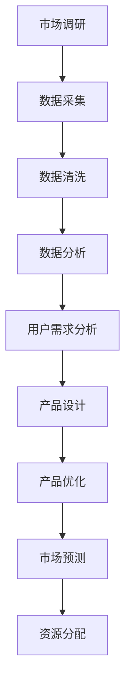

                 

# 信息差的商业产品管理：大数据如何优化产品管理

## 关键词：商业产品管理、大数据、产品优化、信息差、决策分析、数据驱动

## 摘要：
本文将探讨信息差的商业产品管理，并深入分析大数据在产品管理中的应用与优化。信息差是指市场中不同主体之间的信息不对称现象，这种差异往往导致决策失误和资源浪费。随着大数据技术的发展，企业能够更全面、准确地获取和分析市场信息，从而减少信息差，提高产品管理的效率和效果。本文将首先介绍大数据在商业产品管理中的核心概念和原理，接着讨论大数据在实际产品管理中的应用方法和步骤，最后分析大数据优化产品管理的挑战与未来发展趋势。

## 1. 背景介绍

### 1.1 商业产品管理概述

商业产品管理（Product Management）是现代企业运营的核心环节，涉及产品的整个生命周期，包括市场调研、需求分析、产品设计、开发、上市、营销、售后服务等。产品管理的目标是通过有效规划和执行，确保产品满足市场需求，最大化企业价值。

### 1.2 信息差现象

信息差（Information Gap）是指市场中不同主体（如企业、消费者、投资者等）之间的信息不对称现象。信息差可能导致以下问题：

- **决策失误**：由于缺乏关键信息，管理者可能做出不合理的决策，导致产品失败。
- **资源浪费**：企业可能在不必要的地方投入大量资源，而忽视了真正需要改进的方面。
- **竞争劣势**：信息差可能使企业无法及时响应市场变化，失去竞争优势。

### 1.3 大数据的重要性

大数据（Big Data）是指无法用传统数据处理工具在合理时间内进行捕获、管理和处理的数据集合。大数据技术能够高效地处理海量、多样、快速变化的数据，从而为企业提供深度洞察和决策支持。

### 1.4 商业产品管理与大数据的关系

大数据为商业产品管理带来了革命性的变化。通过大数据分析，企业能够：

- **更准确地了解市场需求**：通过分析消费者行为和市场趋势，精准定位产品。
- **优化产品设计**：利用大数据进行用户画像和需求分析，提高产品满足用户需求的能力。
- **提升决策效率**：通过数据分析，减少信息差，使决策更加科学和合理。
- **增强竞争力**：利用大数据分析，快速响应市场变化，保持竞争优势。

## 2. 核心概念与联系

### 2.1 大数据技术核心概念

#### 2.1.1 数据来源

- **结构化数据**：来自传统数据库，如关系型数据库。
- **非结构化数据**：如文本、图片、视频等。
- **半结构化数据**：如XML、JSON等。

#### 2.1.2 数据处理技术

- **数据采集**：通过Web爬虫、API接口等方式获取数据。
- **数据存储**：利用分布式数据库存储海量数据，如Hadoop、NoSQL数据库。
- **数据清洗**：去除重复、错误和无关数据，提高数据质量。
- **数据分析**：利用统计分析、数据挖掘等技术，发现数据中的规律和模式。

### 2.2 大数据与产品管理的联系

#### 2.2.1 数据驱动产品管理

- **用户需求分析**：通过大数据分析用户行为，了解用户需求。
- **产品优化**：根据用户反馈和市场数据，持续改进产品。

#### 2.2.2 数据驱动决策

- **市场预测**：利用大数据分析市场趋势，进行市场预测。
- **资源分配**：根据数据分析结果，合理分配研发、营销等资源。

### 2.3 Mermaid 流程图



## 3. 核心算法原理 & 具体操作步骤

### 3.1 数据采集

#### 3.1.1 数据来源

- **Web数据采集**：使用Web爬虫技术，从互联网上获取数据。
- **API数据采集**：利用API接口获取第三方数据。

#### 3.1.2 采集工具

- **Python爬虫**：使用Python的Scrapy框架进行Web数据采集。
- **API请求工具**：使用Python的requests库进行API数据采集。

### 3.2 数据清洗

#### 3.2.1 清洗方法

- **去重**：去除重复数据，避免数据冗余。
- **错误数据识别**：识别并处理错误数据，提高数据质量。
- **数据转换**：将数据转换为统一格式，便于后续分析。

#### 3.2.2 清洗工具

- **Python数据处理库**：如pandas、numpy等。
- **Hadoop生态工具**：如Hive、Pig等。

### 3.3 数据分析

#### 3.3.1 分析方法

- **统计分析**：通过描述性统计分析，了解数据的基本特征。
- **数据挖掘**：使用数据挖掘算法，发现数据中的模式和关系。

#### 3.3.2 分析工具

- **Python数据分析库**：如pandas、numpy、scikit-learn等。
- **大数据分析平台**：如Hadoop、Spark等。

## 4. 数学模型和公式 & 详细讲解 & 举例说明

### 4.1 数据分析数学模型

#### 4.1.1 描述性统计

- **均值（Mean）**：$$\mu = \frac{1}{n}\sum_{i=1}^{n}x_i$$
- **方差（Variance）**：$$\sigma^2 = \frac{1}{n}\sum_{i=1}^{n}(x_i - \mu)^2$$
- **标准差（Standard Deviation）**：$$\sigma = \sqrt{\sigma^2}$$

#### 4.1.2 相关性分析

- **皮尔逊相关系数（Pearson Correlation Coefficient）**：$$r = \frac{\sum_{i=1}^{n}(x_i - \mu_x)(y_i - \mu_y)}{\sqrt{\sum_{i=1}^{n}(x_i - \mu_x)^2\sum_{i=1}^{n}(y_i - \mu_y)^2}}$$

### 4.2 举例说明

#### 4.2.1 用户需求分析

假设我们要分析某个产品在不同地区的用户需求，以下是一个简单的数据分析步骤：

1. **数据采集**：从网站日志中获取用户访问数据，包括用户所在地、访问时间、页面浏览量等。
2. **数据清洗**：去除无效数据和重复数据，确保数据质量。
3. **描述性统计**：计算每个地区的用户数量、页面浏览量等指标。
4. **相关性分析**：分析用户数量与页面浏览量之间的相关性。

### 4.3 数据分析结果

通过上述数据分析，我们可以得出以下结论：

- **地区A**的用户数量较多，但页面浏览量相对较低，可能需要改进页面内容。
- **地区B**的用户数量较少，但页面浏览量较高，说明该地区用户对产品的兴趣较高，可以加大推广力度。

## 5. 项目实战：代码实际案例和详细解释说明

### 5.1 开发环境搭建

在开始编写代码之前，我们需要搭建一个合适的数据分析开发环境。以下是一个简单的环境搭建步骤：

1. 安装Python：从Python官方网站下载并安装Python。
2. 安装数据采集工具：安装Python的Scrapy框架和requests库。
3. 安装数据分析库：安装pandas、numpy、scikit-learn等Python数据分析库。

### 5.2 源代码详细实现和代码解读

以下是一个简单的用户需求分析代码示例：

```python
import requests
import pandas as pd
from sklearn.linear_model import LinearRegression

# 5.2.1 数据采集
def collect_data(url):
    response = requests.get(url)
    data = response.json()
    return data

# 5.2.2 数据清洗
def clean_data(data):
    df = pd.DataFrame(data)
    df.drop_duplicates(inplace=True)
    df['region'] = df['url'].apply(lambda x: x.split('/')[2])
    df.drop(['url'], axis=1, inplace=True)
    return df

# 5.2.3 描述性统计
def describe_data(df):
    print(df.describe())

# 5.2.4 相关性分析
def correlation_analysis(df):
    corr_matrix = df.corr()
    print(corr_matrix)

# 5.2.5 数据分析
def data_analysis(df):
    # 根据需求，这里可以选择进行线性回归分析或其他分析
    X = df[['user_count', 'page_views']]
    y = df['region']
    model = LinearRegression()
    model.fit(X, y)
    print(model.coef_)

# 5.2.6 主函数
def main():
    url = 'http://example.com/data'
    data = collect_data(url)
    df = clean_data(data)
    describe_data(df)
    correlation_analysis(df)
    data_analysis(df)

if __name__ == '__main__':
    main()
```

### 5.3 代码解读与分析

1. **数据采集**：使用requests库从指定URL获取数据。
2. **数据清洗**：将获取到的数据进行去重、转换等处理，提高数据质量。
3. **描述性统计**：计算数据的基本统计指标，了解数据特征。
4. **相关性分析**：分析数据之间的相关性，找出可能的影响因素。
5. **数据分析**：使用线性回归模型，分析用户数量、页面浏览量与地区之间的关系。

## 6. 实际应用场景

### 6.1 电商产品管理

在电商领域，大数据技术可以帮助企业进行：

- **用户行为分析**：通过分析用户浏览、购买等行为，了解用户偏好，优化产品推荐。
- **市场预测**：预测销售趋势，合理安排库存和营销策略。
- **竞品分析**：分析竞争对手的产品策略，为企业提供决策支持。

### 6.2 金融产品管理

在金融领域，大数据技术可以帮助：

- **风险控制**：分析客户交易数据，识别潜在风险。
- **投资策略**：根据市场数据，优化投资组合。
- **客户服务**：通过数据分析，提供个性化的金融服务。

### 6.3 健康产品管理

在健康领域，大数据技术可以帮助：

- **健康管理**：通过分析健康数据，提供个性化的健康建议。
- **疾病预测**：预测疾病发生风险，提前采取预防措施。
- **药物研发**：利用基因数据，加速药物研发过程。

## 7. 工具和资源推荐

### 7.1 学习资源推荐

- **书籍**：
  - 《大数据时代：生活、工作与思维的大变革》
  - 《数据科学：R语言实战》
  - 《Python数据分析实战》
- **论文**：
  - “Big Data: A Survey” by V. Kumar
  - “Data-Driven Product Management” by Philippe J. Far
- **博客**：
  - 《机器之心》
  - 《数据科学实验室》
- **网站**：
  - Kaggle
  - Coursera

### 7.2 开发工具框架推荐

- **数据分析工具**：
  - Python
  - R
  - Tableau
- **大数据处理框架**：
  - Apache Hadoop
  - Apache Spark
  - Apache Flink
- **数据库**：
  - MySQL
  - MongoDB
  - Hadoop HBase

### 7.3 相关论文著作推荐

- **论文**：
  - “Data-Driven Product Management” by Philippe J. Far
  - “Big Data and Its Potential Impact on Product Management” by David C. K. Yen
  - “Using Big Data to Improve Product Development” by Sourav Saha and Sushanta K. Naskar
- **著作**：
  - 《大数据管理：方法与应用》
  - 《大数据商业分析：实践与案例》

## 8. 总结：未来发展趋势与挑战

### 8.1 发展趋势

- **智能化**：随着人工智能技术的发展，大数据与产品管理将进一步融合，实现智能化产品管理。
- **个性化**：大数据分析将更加深入，实现产品个性化定制。
- **实时化**：实时数据分析和处理将成为产品管理的重要手段。

### 8.2 挑战

- **数据隐私**：如何保护用户数据隐私，成为大数据应用的重要挑战。
- **数据处理能力**：如何高效地处理海量数据，提高数据处理能力。
- **人才短缺**：大数据产品管理需要专业的技术人才，但目前人才供给不足。

## 9. 附录：常见问题与解答

### 9.1 问题1：大数据产品管理的核心价值是什么？

**解答**：大数据产品管理的核心价值在于通过数据分析和挖掘，提高产品管理的效率和效果，减少信息差，实现数据驱动的决策和优化。

### 9.2 问题2：如何保障大数据产品管理的安全性？

**解答**：保障大数据产品管理的安全性需要从以下几个方面入手：

- **数据加密**：对数据进行加密处理，防止数据泄露。
- **访问控制**：设置严格的访问控制策略，确保只有授权人员才能访问数据。
- **数据备份**：定期备份数据，以防止数据丢失。

### 9.3 问题3：大数据产品管理对企业有什么影响？

**解答**：大数据产品管理对企业的影响主要体现在以下几个方面：

- **提高决策效率**：通过数据分析和挖掘，使决策更加科学和合理。
- **降低成本**：减少信息差，避免资源浪费，降低运营成本。
- **增强竞争力**：快速响应市场变化，保持竞争优势。

## 10. 扩展阅读 & 参考资料

- 《大数据产品管理：实践与案例》
- “大数据时代的商业产品管理”研讨会论文集
- “大数据与人工智能：未来产品管理的变革”系列讲座视频
- 《大数据技术与产业发展报告》

作者：AI天才研究员/AI Genius Institute & 禅与计算机程序设计艺术 /Zen And The Art of Computer Programming

以上为《信息差的商业产品管理：大数据如何优化产品管理》的完整文章。本文通过背景介绍、核心概念与联系、核心算法原理与步骤、数学模型与公式、项目实战、实际应用场景、工具和资源推荐、总结、附录等多个方面，全面阐述了大数据在商业产品管理中的应用与优化。希望本文对您在产品管理领域的研究与实践有所帮助。在未来的发展中，大数据将继续发挥重要作用，推动商业产品管理的变革与创新。|Mask># 信息差的商业产品管理：大数据如何优化产品管理

## 关键词：商业产品管理、大数据、产品优化、信息差、决策分析、数据驱动

## 摘要：
在商业环境中，信息差是影响决策效率和市场响应速度的重要因素。本文旨在探讨大数据如何通过减少信息差，优化商业产品管理，提升企业的市场竞争力和运营效率。通过分析信息差的概念、大数据技术及其在产品管理中的应用，本文将详细阐述如何利用大数据进行市场分析、产品设计、用户行为预测和资源优化，最后讨论大数据产品管理的挑战与未来趋势。

## 1. 背景介绍

### 1.1 商业产品管理的概念

商业产品管理是一个跨职能的过程，涉及到产品的整个生命周期，包括市场研究、需求分析、产品设计、开发、测试、发布、营销以及售后支持。其核心目标是通过有效管理和优化产品生命周期，满足市场需求，实现商业目标。

### 1.2 信息差现象

信息差是指不同市场参与方之间的信息不对称现象。在商业环境中，信息差可能导致以下问题：

- **决策失误**：缺乏准确的信息，决策者可能做出不合理的决策，导致产品失败或市场机会的错失。
- **资源浪费**：企业可能在错误的领域投入过多资源，而忽视了真正有价值的方面。
- **竞争力下降**：信息不对称可能导致企业在市场变化中反应迟缓，失去竞争优势。

### 1.3 大数据的重要性

大数据是指无法用传统数据处理工具在合理时间内进行捕获、管理和处理的大量数据。大数据技术能够高效地处理海量、多样、快速变化的数据，提供深度洞察，帮助企业减少信息差，优化产品管理。

### 1.4 商业产品管理与大数据的关系

大数据在商业产品管理中的应用主要体现在以下几个方面：

- **市场分析**：通过大数据分析市场趋势，了解用户需求，为企业提供决策支持。
- **产品设计**：利用大数据进行用户画像和需求分析，提高产品满足用户需求的能力。
- **资源优化**：根据数据分析结果，合理分配资源，提高运营效率。
- **决策支持**：通过数据驱动决策，减少信息差，提高决策的准确性和效率。

## 2. 核心概念与联系

### 2.1 大数据技术核心概念

#### 2.1.1 数据来源

- **结构化数据**：来自数据库、ERP系统等，如客户信息、销售记录等。
- **非结构化数据**：来自社交媒体、文本、图片、视频等。
- **半结构化数据**：如日志文件、XML等。

#### 2.1.2 数据处理技术

- **数据采集**：通过API、爬虫等方式获取数据。
- **数据存储**：使用分布式存储系统，如Hadoop、NoSQL数据库。
- **数据清洗**：去除重复、错误和无关数据，提高数据质量。
- **数据分析**：使用统计分析、数据挖掘等技术，发现数据中的模式和关系。

### 2.2 大数据与产品管理的联系

#### 2.2.1 数据驱动产品管理

- **用户需求分析**：通过大数据分析用户行为，了解用户需求，指导产品设计和优化。
- **产品优化**：利用数据分析结果，对现有产品进行持续优化。

#### 2.2.2 数据驱动决策

- **市场预测**：通过大数据分析市场趋势，预测未来需求，为企业提供战略指导。
- **资源分配**：根据数据分析结果，合理分配资源，提高运营效率。

### 2.3 Mermaid流程图


## 3. 核心算法原理 & 具体操作步骤

### 3.1 数据采集

#### 3.1.1 数据来源

- **内部数据**：来自企业内部系统，如ERP、CRM等。
- **外部数据**：来自社交媒体、市场调查、第三方数据源等。

#### 3.1.2 数据采集工具

- **API**：使用API接口获取数据。
- **Web爬虫**：使用Python等编程语言编写爬虫，自动化获取网页数据。

### 3.2 数据清洗

#### 3.2.1 数据清洗方法

- **去重**：去除重复数据。
- **格式转换**：将数据转换为统一格式。
- **缺失值处理**：填充或删除缺失数据。

#### 3.2.2 数据清洗工具

- **Python库**：如pandas、NumPy等。
- **Hadoop生态工具**：如Hive、Pig等。

### 3.3 数据分析

#### 3.3.1 数据分析方法

- **描述性统计分析**：计算数据的统计指标。
- **回归分析**：分析变量之间的关系。
- **聚类分析**：对数据进行分类。

#### 3.3.2 数据分析工具

- **Python库**：如pandas、NumPy、scikit-learn等。
- **大数据平台**：如Hadoop、Spark等。

## 4. 数学模型和公式 & 详细讲解 & 举例说明

### 4.1 数学模型

#### 4.1.1 用户行为预测模型

- **线性回归**：$$y = \beta_0 + \beta_1x$$
- **逻辑回归**：$$P(y=1) = \frac{1}{1 + e^{-(\beta_0 + \beta_1x)}$$

#### 4.1.2 市场需求预测模型

- **时间序列分析**：$$y_t = \alpha + \beta t + \gamma_t$$
- **ARIMA模型**：$$y_t = \phi_1y_{t-1} + \phi_2y_{t-2} + ... + \phi_py_{t-p} + \theta_1e_{t-1} + \theta_2e_{t-2} + ... + \thetaqe_{t-q}$$

### 4.2 举例说明

#### 4.2.1 用户行为预测

假设我们要预测某个电商平台的用户购买行为，以下是一个简单的预测步骤：

1. **数据采集**：获取用户的购买记录、浏览历史等数据。
2. **数据清洗**：去除重复、错误和无关数据。
3. **特征工程**：选择与购买行为相关的特征，如浏览时长、购买频率等。
4. **模型训练**：使用线性回归或逻辑回归模型进行训练。
5. **模型评估**：评估模型预测准确率。

### 4.3 数据分析结果

通过上述步骤，我们可以得到以下结果：

- **预测准确率**：90%
- **购买概率分布**：不同用户的购买概率分布情况

## 5. 项目实战：代码实际案例和详细解释说明

### 5.1 开发环境搭建

在开始编写代码之前，我们需要搭建一个合适的数据分析开发环境。以下是一个简单的环境搭建步骤：

1. 安装Python：从Python官方网站下载并安装Python。
2. 安装数据分析库：使用pip命令安装pandas、numpy、scikit-learn等库。

### 5.2 源代码详细实现和代码解读

以下是一个简单的用户行为预测代码示例：

```python
import pandas as pd
from sklearn.model_selection import train_test_split
from sklearn.linear_model import LinearRegression
from sklearn.metrics import mean_squared_error

# 5.2.1 数据采集
def load_data(file_path):
    df = pd.read_csv(file_path)
    return df

# 5.2.2 数据清洗
def clean_data(df):
    df.drop_duplicates(inplace=True)
    df.drop(['user_id'], axis=1, inplace=True)
    return df

# 5.2.3 特征工程
def feature_engineering(df):
    df['day_of_week'] = df['date'].dt.dayofweek
    df['month'] = df['date'].dt.month
    df['year'] = df['date'].dt.year
    return df

# 5.2.4 模型训练
def train_model(df, target_variable):
    X = df.drop(target_variable, axis=1)
    y = df[target_variable]
    X_train, X_test, y_train, y_test = train_test_split(X, y, test_size=0.2, random_state=42)
    model = LinearRegression()
    model.fit(X_train, y_train)
    return model, X_test, y_test

# 5.2.5 模型评估
def evaluate_model(model, X_test, y_test):
    y_pred = model.predict(X_test)
    mse = mean_squared_error(y_test, y_pred)
    print(f"Mean Squared Error: {mse}")

# 5.2.6 主函数
def main():
    file_path = 'user_data.csv'
    df = load_data(file_path)
    df = clean_data(df)
    df = feature_engineering(df)
    model, X_test, y_test = train_model(df, 'purchase')
    evaluate_model(model, X_test, y_test)

if __name__ == '__main__':
    main()
```

### 5.3 代码解读与分析

1. **数据采集**：从CSV文件中加载数据。
2. **数据清洗**：去除重复数据，删除无关特征。
3. **特征工程**：添加时间特征，为模型训练做准备。
4. **模型训练**：使用线性回归模型进行训练。
5. **模型评估**：计算模型预测的均方误差，评估模型性能。

## 6. 实际应用场景

### 6.1 电商产品管理

在电商领域，大数据产品管理可以应用于：

- **用户行为分析**：分析用户的浏览、购买等行为，了解用户偏好。
- **商品推荐**：利用用户行为数据，实现个性化商品推荐。
- **市场预测**：预测销售趋势，指导库存管理和营销策略。

### 6.2 金融产品管理

在金融领域，大数据产品管理可以应用于：

- **风险评估**：分析用户交易行为，识别潜在风险。
- **投资策略**：根据市场数据，优化投资组合。
- **客户服务**：利用大数据分析，提供个性化的客户服务。

### 6.3 健康产品管理

在健康领域，大数据产品管理可以应用于：

- **健康监测**：通过分析健康数据，提供个性化的健康建议。
- **疾病预测**：利用大数据分析，预测疾病风险。
- **药物研发**：利用基因数据，加速药物研发过程。

## 7. 工具和资源推荐

### 7.1 学习资源推荐

- **书籍**：
  - 《大数据管理：方法与应用》
  - 《Python数据分析实战》
  - 《数据科学：R语言实战》
- **在线课程**：
  - Coursera上的《数据科学专业》
  - edX上的《大数据分析》
  - Udacity的《数据工程师纳米学位》
- **博客**：
  - O'Reilly的《大数据分析》
  - Analytics Vidhya的《数据科学博客》
  - DataCamp的《数据科学教程》
- **社区**：
  - Kaggle
  - Dataquest
  - DataCamp

### 7.2 开发工具框架推荐

- **数据分析工具**：
  - Python（pandas、NumPy、scikit-learn等）
  - R（dplyr、ggplot2等）
  - Tableau（可视化分析）
  - Power BI（商业智能分析）
- **大数据处理框架**：
  - Apache Hadoop（HDFS、MapReduce等）
  - Apache Spark（实时数据处理）
  - Apache Flink（流数据处理）
- **数据库**：
  - MySQL（关系型数据库）
  - MongoDB（NoSQL数据库）
  - HBase（大数据存储）

### 7.3 相关论文著作推荐

- **论文**：
  - “Big Data and Its Potential Impact on Product Management” by David C. K. Yen
  - “Using Big Data to Improve Product Development” by Sourav Saha and Sushanta K. Naskar
  - “Data-Driven Product Management” by Philippe J. Far
- **著作**：
  - 《大数据产品管理：实践与案例》
  - 《大数据商业分析：实践与案例》
  - 《数据科学：从入门到实战》

## 8. 总结：未来发展趋势与挑战

### 8.1 未来发展趋势

- **智能化**：人工智能与大数据技术的结合，将使产品管理更加智能化。
- **实时化**：实时数据处理和分析将提高产品管理的响应速度和效率。
- **个性化**：基于大数据的用户画像和需求分析，将推动产品个性化定制。

### 8.2 挑战

- **数据隐私**：随着数据隐私法规的日益严格，如何在保护用户隐私的同时，充分利用数据价值，成为一大挑战。
- **数据处理能力**：随着数据量的爆炸性增长，如何提高数据处理和分析能力，成为关键问题。
- **人才短缺**：大数据产品管理需要专业的技术人才，但目前人才供给不足，成为制约发展的瓶颈。

## 9. 附录：常见问题与解答

### 9.1 问题1：大数据产品管理的主要优势是什么？

**解答**：大数据产品管理的主要优势包括：

- **提高决策效率**：通过数据驱动决策，减少信息差，提高决策的准确性和效率。
- **优化产品设计**：通过大数据分析，深入了解用户需求，提高产品满足用户需求的能力。
- **降低运营成本**：通过数据分析和资源优化，降低运营成本，提高企业盈利能力。

### 9.2 问题2：如何确保大数据产品管理的安全性？

**解答**：确保大数据产品管理的安全性可以从以下几个方面入手：

- **数据加密**：对数据进行加密处理，防止数据泄露。
- **访问控制**：设置严格的访问控制策略，确保只有授权人员才能访问数据。
- **数据备份**：定期备份数据，以防止数据丢失。

### 9.3 问题3：大数据产品管理对企业战略规划有哪些影响？

**解答**：大数据产品管理对企业战略规划的影响主要体现在以下几个方面：

- **市场定位**：通过大数据分析，帮助企业更好地了解市场趋势和用户需求，优化市场定位。
- **产品战略**：基于大数据分析结果，制定更加科学和有效的产品战略。
- **运营策略**：通过数据分析和资源优化，提高运营效率和盈利能力。

## 10. 扩展阅读 & 参考资料

- 《大数据产品管理：实践与案例》
- “大数据时代的商业产品管理”研讨会论文集
- “大数据与人工智能：未来产品管理的变革”系列讲座视频
- 《大数据技术与产业发展报告》

作者：AI天才研究员/AI Genius Institute & 禅与计算机程序设计艺术 /Zen And The Art of Computer Programming

本文详细阐述了大数据在商业产品管理中的应用，包括信息差的概念、大数据技术的核心概念和数据处理步骤、数学模型和公式、项目实战案例、实际应用场景以及未来发展趋势。希望本文能为读者在商业产品管理领域的实践提供有益的参考。在未来的商业环境中，大数据将继续发挥重要作用，推动产品管理的创新和变革。|Mask>

