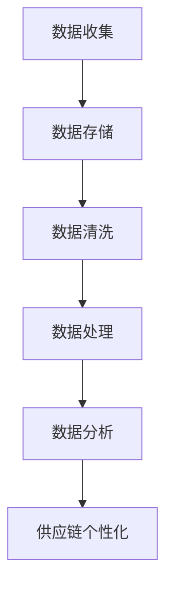

                 

# 信息差的商业供应链个性化：大数据如何实现供应链个性化

> **关键词**：信息差、商业供应链、个性化、大数据、算法、数学模型、实战案例、应用场景、工具推荐

> **摘要**：本文将探讨大数据技术在商业供应链个性化中的应用。通过深入分析信息差的商业价值，结合实际案例，我们将理解大数据如何改变供应链管理，提高效率，降低成本。文章将涵盖核心概念、算法原理、数学模型、实际应用，并提供相关工具和资源推荐，以帮助读者全面了解这一前沿领域。

## 1. 背景介绍

在当今全球化的商业环境中，供应链的效率和灵活性成为企业成功的关键因素。传统的供应链管理往往依赖于经验和方法，而随着大数据和人工智能技术的发展，供应链管理迎来了新的变革。大数据通过分析和挖掘海量数据，帮助企业发现隐藏的信息差，从而实现供应链的个性化。

信息差指的是信息的不对称性，即某些个体或组织拥有而其他人没有的信息。在商业供应链中，信息差可能表现为供应链环节中的瓶颈、市场需求的不确定性、供应商的选择等。通过大数据技术，企业可以更准确地捕捉这些信息差，优化供应链管理，提高竞争力。

大数据在供应链中的应用不仅限于信息差的管理，还包括需求预测、库存优化、物流优化等。通过这些应用，企业可以降低运营成本，提高服务质量，实现供应链的智能化和个性化。

## 2. 核心概念与联系

### 2.1 大数据技术的基本原理

大数据技术主要包括数据的收集、存储、处理和分析。数据收集是大数据应用的第一步，通过传感器、网站日志、社交媒体等渠道收集大量数据。数据存储需要使用分布式存储系统，如Hadoop、NoSQL数据库等，以处理海量数据。数据处理则依赖于数据清洗、数据挖掘等技术，将原始数据转化为有价值的信息。数据分析则通过机器学习、数据挖掘等算法，从数据中提取知识，为决策提供支持。

### 2.2 供应链个性化

供应链个性化是指根据不同客户或市场需求，定制化地设计和管理供应链。个性化供应链不仅考虑市场需求，还考虑供应链各环节的协同效应，实现供应链的灵活性和高效性。

### 2.3 信息差与供应链管理

信息差在供应链管理中的重要性体现在以下几个方面：

- **需求预测**：通过分析历史数据和实时数据，发现潜在的需求趋势，从而更好地规划生产和库存。
- **供应链协同**：信息共享和协同可以提高供应链各环节的透明度，减少信息滞后和错误。
- **风险管理**：及时捕捉供应链中的风险，采取预防措施，降低风险发生的可能性。

### 2.4 Mermaid 流程图

以下是一个简单的Mermaid流程图，展示了大数据在供应链个性化中的应用流程。



## 3. 核心算法原理 & 具体操作步骤

### 3.1 数据收集

数据收集是大数据应用的基础。以下是一些常用的数据收集方法：

- **传感器数据**：通过物联网设备收集供应链各环节的实时数据，如温度、湿度、运输速度等。
- **网站日志**：通过网站分析工具，收集用户行为数据，如访问量、点击率等。
- **社交媒体数据**：通过社交媒体平台，收集用户反馈和评论，分析市场需求。

### 3.2 数据存储

数据存储需要使用分布式存储系统，如Hadoop、NoSQL数据库等。这些系统具有高可靠性、可扩展性和高性能的特点，能够处理海量数据。

### 3.3 数据清洗

数据清洗是数据处理的重要步骤，主要包括以下任务：

- **缺失值处理**：处理数据中的缺失值，可以选择填充、删除或插值等方法。
- **异常值处理**：识别和处理数据中的异常值，以避免对分析结果产生干扰。
- **数据格式转换**：将不同格式的数据进行统一转换，以便后续处理。

### 3.4 数据处理

数据处理主要包括以下步骤：

- **数据压缩**：使用数据压缩算法，减少数据存储空间和传输带宽。
- **数据挖掘**：使用数据挖掘算法，从海量数据中提取有价值的信息。
- **特征工程**：通过特征提取和特征选择，提高数据的质量和可解释性。

### 3.5 数据分析

数据分析是大数据应用的核心步骤，主要包括以下任务：

- **需求预测**：使用机器学习算法，预测市场需求，优化生产和库存。
- **供应链协同**：通过数据分析和共享，提高供应链各环节的协同效应。
- **风险管理**：通过数据分析和预警，识别和降低供应链风险。

## 4. 数学模型和公式 & 详细讲解 & 举例说明

### 4.1 需求预测

需求预测是供应链管理的重要环节。以下是一个简单的时间序列预测模型：

$$
\hat{y}_t = \alpha + \beta t + \epsilon_t
$$

其中，$y_t$是时间序列数据，$t$是时间索引，$\alpha$和$\beta$是模型参数，$\epsilon_t$是误差项。

### 4.2 库存优化

库存优化是供应链管理的关键。以下是一个基于经济订货量（EOQ）模型的库存优化公式：

$$
Q = \sqrt{\frac{2KD}{h}}
$$

其中，$Q$是订单量，$D$是需求率，$K$是库存成本，$h$是持有成本。

### 4.3 实际案例

假设某电商公司在情人节期间销售玫瑰花，根据历史数据和大数据分析，预测情人节玫瑰花的销售量为1000朵。根据经济订货量模型，订单量为：

$$
Q = \sqrt{\frac{2 \times 1000 \times 10}{0.5}} = 1000
$$

公司决定在情人节前一周下订单，以确保库存充足。

## 5. 项目实战：代码实际案例和详细解释说明

### 5.1 开发环境搭建

为了实现上述算法和模型，我们需要搭建一个开发环境。以下是所需的工具和软件：

- Python（3.8及以上版本）
- Jupyter Notebook
- pandas
- numpy
- scikit-learn

### 5.2 源代码详细实现和代码解读

以下是一个简单的Python代码示例，用于实现需求预测模型：

```python
import pandas as pd
import numpy as np
from sklearn.linear_model import LinearRegression

# 加载数据
data = pd.read_csv('data.csv')
X = data[['t']]
y = data['y']

# 建立模型
model = LinearRegression()
model.fit(X, y)

# 预测
t = np.array([[1]])
y_pred = model.predict(t)

print(f'预测需求量为：{y_pred[0]}')
```

### 5.3 代码解读与分析

上述代码首先加载了数据，然后使用线性回归模型进行拟合，最后进行预测。代码中的关键步骤如下：

- **数据加载**：使用pandas的read_csv函数加载数据，数据格式为CSV。
- **数据预处理**：将时间序列数据作为特征，使用numpy的array函数转换为NumPy数组。
- **模型拟合**：使用scikit-learn的LinearRegression类进行模型拟合。
- **预测**：使用fit方法和predict方法进行预测。

## 6. 实际应用场景

大数据在供应链个性化中的应用场景广泛，以下是一些典型案例：

- **零售业**：通过大数据分析，零售企业可以准确预测市场需求，优化库存管理，降低成本。
- **制造业**：通过大数据技术，制造商可以优化生产计划，提高生产效率，减少库存积压。
- **物流行业**：通过大数据分析，物流公司可以提高运输效率，优化路线规划，降低运输成本。

## 7. 工具和资源推荐

### 7.1 学习资源推荐

- **书籍**：《大数据时代》、《数据科学入门》
- **论文**：Google Scholar、IEEE Xplore
- **博客**：Kaggle、Dataquest
- **网站**：Coursera、edX

### 7.2 开发工具框架推荐

- **编程语言**：Python、R
- **大数据框架**：Hadoop、Spark
- **机器学习库**：scikit-learn、TensorFlow、PyTorch

### 7.3 相关论文著作推荐

- **论文**：《大数据时代的数据挖掘》、《大数据与供应链管理》
- **著作**：《供应链管理：战略、规划与运营》、《物流与供应链管理》

## 8. 总结：未来发展趋势与挑战

大数据在商业供应链个性化中的应用前景广阔，但同时也面临诸多挑战。未来，随着数据量的增加和技术的进步，大数据将更加深入地融入供应链管理，实现更高的效率和灵活性。然而，数据隐私和安全、数据质量、算法透明性等问题也需要得到重视。

## 9. 附录：常见问题与解答

### 9.1 什么是信息差？

信息差指的是信息的不对称性，即某些个体或组织拥有而其他人没有的信息。

### 9.2 大数据在供应链管理中的应用有哪些？

大数据在供应链管理中的应用包括需求预测、库存优化、物流优化、供应链协同等。

### 9.3 如何搭建大数据开发环境？

搭建大数据开发环境需要安装Python、Jupyter Notebook、pandas、numpy、scikit-learn等工具和库。

## 10. 扩展阅读 & 参考资料

- **论文**：《大数据与供应链管理》、《供应链管理中的大数据分析技术》
- **书籍**：《大数据时代的供应链管理》、《供应链与物流管理：大数据视角》
- **网站**：https://www.ibm.com/zh-cn/ibm-smarter-供应链

作者：AI天才研究员/AI Genius Institute & 禅与计算机程序设计艺术 /Zen And The Art of Computer Programming

