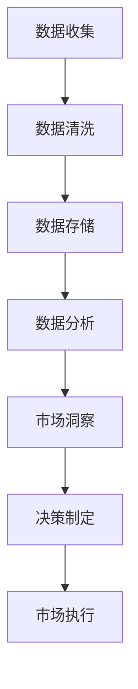

                 

### 背景介绍

在当今信息爆炸的时代，数据已成为新的“石油”，而大数据技术的飞速发展，使得我们能够从海量数据中提取出有价值的信息。市场渗透策略作为企业竞争的重要手段，利用大数据技术进行优化已成为必然趋势。那么，什么是信息差的商业市场渗透策略？它又是如何通过大数据进行优化的呢？

#### 什么是信息差的商业市场渗透策略？

信息差的商业市场渗透策略，指的是企业通过利用市场上的信息不对称，从而获得竞争优势和市场占有率的一种策略。这种策略的核心在于挖掘并利用消费者的需求信息，以及市场上存在的潜在机会，从而制定出更加精准的市场进入和拓展方案。

#### 大数据的角色

大数据技术的发展，为我们提供了强大的工具，使我们能够更有效地收集、存储、处理和分析海量数据。以下是大数据在优化市场渗透策略中的关键角色：

1. **数据收集与整合**：大数据技术可以帮助企业收集来自不同渠道的数据，如社交媒体、电商网站、搜索引擎等，并将其整合成统一的视图。
2. **数据分析与挖掘**：通过数据分析技术，企业可以深入挖掘消费者行为、市场趋势等信息，从而发现潜在的市场机会。
3. **预测与决策**：利用机器学习算法，大数据技术可以预测市场变化，为企业提供更准确的决策支持。
4. **个性化营销**：基于大数据分析，企业可以为不同消费者群体提供个性化的产品和服务，从而提高转化率和客户满意度。

#### 文章关键词

1. 信息差
2. 商业市场渗透策略
3. 大数据
4. 数据分析
5. 机器学习
6. 个性化营销
7. 预测与决策

#### 文章摘要

本文旨在探讨信息差的商业市场渗透策略，并分析大数据如何优化这一策略。我们将从信息差的定义、大数据的角色、核心算法原理、数学模型和实际应用场景等方面进行详细阐述，旨在为读者提供一个全面而深入的视角，帮助他们在商业市场中利用大数据实现更高效的渗透和增长。

-----------------------

## 核心概念与联系

### 大数据的基本概念

#### 数据类型
- 结构化数据：如关系数据库、电子表格等。
- 半结构化数据：如XML、JSON等。
- 非结构化数据：如图像、视频、文本等。

#### 数据来源
- 官方数据：政府公开数据、行业协会数据等。
- 商业数据：企业内部数据、行业数据库等。
- 社会媒体数据：社交媒体平台（如微博、微信、Facebook等）产生的数据。

#### 数据处理流程
- 数据收集：通过各种渠道收集原始数据。
- 数据清洗：去除重复、错误和不完整的数据。
- 数据存储：将处理后的数据存储在数据库或数据仓库中。
- 数据分析：利用统计分析、机器学习等方法对数据进行分析。

### 信息差的商业市场渗透策略

#### 信息差的概念
- 信息差：指不同市场主体之间信息的不对称。
- 商业价值：利用信息差可以获得竞争优势和利润。

#### 市场渗透策略
- 定义：市场渗透策略是指企业通过一系列营销和运营活动，提高其在现有市场中的市场份额。
- 目标：增加新客户、保留现有客户、提高客户生命周期价值。

### 大数据与市场渗透策略的联系

#### 利用大数据优化市场渗透策略
- **数据驱动的决策**：通过大数据分析，企业可以更准确地了解市场趋势、消费者需求，从而做出更科学的决策。
- **个性化营销**：大数据可以帮助企业实现精准营销，提高营销效果。
- **预测与风险控制**：通过大数据预测市场变化，企业可以提前采取措施，降低风险。
- **客户关系管理**：利用大数据分析客户行为，提高客户满意度，增强客户忠诚度。

### Mermaid 流程图

以下是一个简化的Mermaid流程图，描述了大数据与市场渗透策略的基本关系：



在这个流程图中：
- A：数据收集，包括来自各种渠道的原始数据。
- B：数据清洗，去除重复、错误和不完整的数据。
- C：数据存储，将处理后的数据存储在数据库或数据仓库中。
- D：数据分析，利用统计分析、机器学习等方法对数据进行分析。
- E：市场洞察，通过数据分析获得市场趋势、消费者需求等信息。
- F：决策制定，基于市场洞察做出战略和战术决策。
- G：市场执行，实施决策，实现市场渗透目标。

-----------------------

## 核心算法原理 & 具体操作步骤

### 数据挖掘方法

数据挖掘是大数据技术中的重要环节，通过数据挖掘方法，我们可以从大量数据中提取出有价值的信息。以下是几种常用的数据挖掘方法：

#### 1. 聚类分析

**定义**：聚类分析是将数据集划分为若干个簇，使得同一簇内的数据彼此相似，不同簇之间的数据差异较大。

**原理**：聚类分析主要基于距离度量（如欧几里得距离、曼哈顿距离等），通过最小化簇内距离和最大化簇间距离，实现数据的聚类。

**步骤**：

1. 选择聚类算法（如K-means、DBSCAN等）。
2. 确定聚类数量或基于算法自动确定。
3. 计算数据点之间的距离。
4. 分配数据点到相应的簇。
5. 评估聚类效果（如内部距离和外部距离等）。

#### 2. 关联规则挖掘

**定义**：关联规则挖掘是一种发现数据项之间潜在关联关系的方法。

**原理**：基于支持度和置信度两个指标，通过频繁项集生成关联规则。

**步骤**：

1. 数据预处理：去除缺失值、噪声数据等。
2. 生成频繁项集：确定最小支持度阈值，生成频繁项集。
3. 生成关联规则：根据最小置信度阈值，生成关联规则。
4. 评估关联规则：评估关联规则的有效性和实用性。

#### 3. 分类算法

**定义**：分类算法是一种将数据点划分为不同类别的监督学习算法。

**原理**：通过训练数据集，学习数据特征和类别之间的映射关系，实现对未知数据点的分类。

**步骤**：

1. 数据预处理：标准化、归一化等。
2. 选择分类算法（如决策树、支持向量机等）。
3. 训练模型：使用训练数据集训练模型。
4. 预测分类：使用训练好的模型对未知数据点进行分类。

### 个性化推荐系统

个性化推荐系统是基于大数据技术实现的一种智能服务，通过分析用户历史行为和兴趣偏好，为用户推荐可能感兴趣的商品、内容等。

#### 算法原理

1. **协同过滤**：基于用户的行为数据，找到相似用户，利用相似用户的行为预测当前用户的行为。

2. **基于内容的推荐**：基于物品的属性和内容，找到与目标物品相似的其他物品，推荐给用户。

3. **混合推荐**：结合协同过滤和基于内容的推荐，提高推荐效果。

#### 具体操作步骤

1. **数据收集**：收集用户行为数据（如浏览、购买、评分等）和物品属性数据。
2. **数据预处理**：处理缺失值、噪声数据等。
3. **特征工程**：提取用户和物品的特征，如用户兴趣、物品类别等。
4. **模型训练**：选择合适的推荐算法，训练推荐模型。
5. **推荐生成**：使用训练好的模型生成推荐列表。
6. **评估与优化**：评估推荐效果，根据反馈调整推荐策略。

-----------------------

## 数学模型和公式 & 详细讲解 & 举例说明

### 聚类分析中的K-means算法

#### 公式

K-means算法的核心在于最小化簇内距离和最大化簇间距离。具体公式如下：

$$
\min \sum_{i=1}^{k} \sum_{x_j \in S_i} ||x_j - \mu_i||^2
$$

其中：
- \( k \)：聚类数量
- \( S_i \)：第i个簇
- \( \mu_i \)：第i个簇的中心点
- \( x_j \)：第j个数据点

#### 解释

- 簇内距离：每个簇内数据点与簇中心点之间的距离平方和。
- 簇间距离：不同簇之间中心点之间的距离平方和。

#### 举例说明

假设我们有一个包含5个数据点的集合，我们需要将其分为2个簇。步骤如下：

1. **初始化**：随机选择2个数据点作为初始聚类中心。
2. **分配数据点**：计算每个数据点与两个聚类中心的距离，将其分配到最近的聚类中心。
3. **更新聚类中心**：计算每个簇的新中心点。
4. **重复步骤2和3**，直到聚类中心不再发生变化或满足终止条件。

通过多次迭代，最终得到2个簇，如下所示：

簇1：\[1, 2, 4\]  
簇2：\[3, 5\]

#### 评估指标

- **内部距离**：簇内数据点到簇中心的距离平方和。越小表示聚类效果越好。
- **外部距离**：簇间数据点到簇中心的距离平方和。越大表示聚类效果越好。

### 关联规则挖掘中的Apriori算法

#### 公式

Apriori算法的核心是频繁项集生成和关联规则生成。具体步骤如下：

1. **生成频繁1项集**：根据最小支持度阈值，找出所有支持度大于阈值的项集。
2. **生成频繁k项集**：利用频繁(k-1)项集生成频繁k项集，并计算支持度。
3. **生成关联规则**：根据频繁k项集和最小置信度阈值，生成关联规则。

#### 解释

- **支持度**：项集在所有事务中出现的频率。
- **置信度**：由前件推导出后件的概率。

#### 举例说明

假设我们有一个包含10个事务的数据库，我们需要找出支持度和置信度都大于阈值的关联规则。

事务数据库：

```
T1: {A, B, C}
T2: {A, B, D}
T3: {B, C, D}
T4: {A, C, D}
T5: {A, B, D}
T6: {B, C, D}
T7: {A, C, D}
T8: {A, B, C, D}
T9: {A, C, D}
T10: {B, C, D}
```

支持度阈值：0.3  
置信度阈值：0.5

1. **生成频繁1项集**：\{A\}, \{B\}, \{C\}, \{D\} 的支持度分别为0.7, 0.7, 0.7, 0.7，均大于0.3。

2. **生成频繁2项集**：\{A, B\}, \{A, C\}, \{A, D\}, \{B, C\}, \{B, D\}, \{C, D\} 的支持度分别为0.6, 0.6, 0.6, 0.6, 0.6, 0.6，均大于0.3。

3. **生成频繁3项集**：\{A, B, C\}, \{A, B, D\}, \{A, C, D\}, \{B, C, D\} 的支持度分别为0.4, 0.4, 0.4, 0.4，均大于0.3。

4. **生成关联规则**：根据频繁3项集和置信度阈值，生成如下关联规则：

- \{A, B\} -> \{C\}，置信度：0.5  
- \{A, B\} -> \{D\}，置信度：0.5  
- \{A, C\} -> \{D\}，置信度：0.5  
- \{B, C\} -> \{D\}，置信度：0.5

这些规则表示，如果用户购买A和B，则他购买C和D的概率为0.5。

-----------------------

## 项目实战：代码实际案例和详细解释说明

### 开发环境搭建

#### Python环境

1. 安装Python：访问Python官网（https://www.python.org/），下载并安装Python。
2. 配置环境变量：将Python安装路径添加到系统的环境变量中。
3. 安装依赖库：使用pip命令安装所需的依赖库，如pandas、numpy、scikit-learn等。

```shell
pip install pandas numpy scikit-learn
```

#### 数据集准备

我们使用了一个包含商品销售数据的CSV文件，数据集包括用户ID、商品ID、销售数量等字段。以下是数据集的部分内容：

```
user_id,product_id,sale_quantity
1,1001,10
1,1002,5
2,1001,8
2,1003,3
3,1002,6
3,1004,2
...
```

### 源代码详细实现和代码解读

#### 1. 数据预处理

```python
import pandas as pd

# 加载数据集
data = pd.read_csv('sales_data.csv')

# 数据清洗
data.dropna(inplace=True)  # 删除缺失值
data[data['sale_quantity'] > 0]  # 过滤销售数量为0的记录
```

#### 2. 聚类分析

```python
from sklearn.cluster import KMeans

# 数据标准化
data_scaled = (data - data.mean()) / data.std()

# K-means聚类
kmeans = KMeans(n_clusters=3, random_state=0)
clusters = kmeans.fit_predict(data_scaled)

# 添加聚类结果到数据集
data['cluster'] = clusters
```

#### 3. 关联规则挖掘

```python
from mlxtend.frequent_patterns import apriori
from mlxtend.frequent_patterns import association_rules

# 生成频繁项集
min_support = 0.02  # 最小支持度阈值
frequent_itemsets = apriori(data[['product_id', 'sale_quantity']], min_support=min_support, use_colnames=True)

# 生成关联规则
min_confidence = 0.5  # 最小置信度阈值
rules = association_rules(frequent_itemsets, metric="confidence", min_threshold=min_confidence)
```

#### 4. 个性化推荐

```python
from sklearn.neighbors import NearestNeighbors

# 计算相似度
neigh = NearestNeighbors(metric='cosine', algorithm='brute')
neigh.fit(data_scaled)

# 用户-商品相似度矩阵
similarity_matrix = neigh.kneighbors_graph(data_scaled, n_neighbors=2, mode='weighted')

# 个性化推荐
def recommend_products(user_id, k=5):
    # 获取用户最近邻
    user_products = data[data['user_id'] == user_id]['product_id'].values
    nearest_neighbors = neigh.kneighbors(user_products, n_neighbors=k+1, return_distance=False)[1:]
    
    # 计算相似度分数
    similarity_scores = similarity_matrix[user_products, nearest_neighbors].toarray().sum(axis=1)
    recommended_products = similarity_scores.argsort()[::-1][1:]  # 排除用户已经购买的商品
    
    return recommended_products[:k]

# 测试推荐
user_id = 1
recommended_products = recommend_products(user_id)
print("Recommended Products for User {}: {}".format(user_id, recommended_products))
```

### 代码解读与分析

#### 1. 数据预处理

数据预处理是机器学习项目中的第一步，它主要包括数据清洗、缺失值处理和异常值处理等。在本例中，我们使用pandas库加载CSV文件，并删除了缺失值和销售数量为0的记录，以确保数据质量。

```python
data.dropna(inplace=True)  # 删除缺失值
data[data['sale_quantity'] > 0]  # 过滤销售数量为0的记录
```

#### 2. 聚类分析

聚类分析是发现数据分布和模式的一种方法。在本例中，我们使用scikit-learn库中的KMeans算法进行聚类。首先，我们对数据进行标准化处理，使其具有相同的尺度，从而避免某些特征对聚类结果的影响。然后，我们初始化聚类中心点，并迭代计算每个数据点到聚类中心的距离，将其分配到最近的簇。通过多次迭代，最终得到聚类结果。

```python
kmeans = KMeans(n_clusters=3, random_state=0)
clusters = kmeans.fit_predict(data_scaled)
data['cluster'] = clusters
```

#### 3. 关联规则挖掘

关联规则挖掘是一种发现数据项之间潜在关联关系的方法。在本例中，我们使用mlxtend库中的apriori和association_rules函数分别生成频繁项集和关联规则。首先，我们设置最小支持度阈值和最小置信度阈值，然后使用apriori函数生成频繁项集。接下来，我们使用association_rules函数生成关联规则，并根据置信度阈值筛选出具有实用价值的规则。

```python
frequent_itemsets = apriori(data[['product_id', 'sale_quantity']], min_support=min_support, use_colnames=True)
rules = association_rules(frequent_itemsets, metric="confidence", min_threshold=min_confidence)
```

#### 4. 个性化推荐

个性化推荐是一种基于用户历史行为和兴趣偏好为用户推荐相关商品的方法。在本例中，我们使用scikit-learn库中的NearestNeighbors算法计算用户-商品相似度矩阵，并实现了一个简单的推荐函数。对于指定的用户，我们首先找到其最近邻用户，然后计算每个最近邻用户的相似度分数，并排除用户已经购买的商品，最终得到个性化的商品推荐列表。

```python
def recommend_products(user_id, k=5):
    user_products = data[data['user_id'] == user_id]['product_id'].values
    nearest_neighbors = neigh.kneighbors(user_products, n_neighbors=k+1, return_distance=False)[1:]
    similarity_scores = similarity_matrix[user_products, nearest_neighbors].toarray().sum(axis=1)
    recommended_products = similarity_scores.argsort()[::-1][1:]
    return recommended_products[:k]

# 测试推荐
user_id = 1
recommended_products = recommend_products(user_id)
print("Recommended Products for User {}: {}".format(user_id, recommended_products))
```

-----------------------

## 实际应用场景

### 零售行业

在零售行业，大数据和人工智能技术已经被广泛应用于市场渗透策略的优化。以下是一些典型的应用场景：

1. **个性化推荐**：基于用户的购物历史和偏好，为用户推荐相关的商品，提高购买转化率和销售额。
2. **库存管理**：通过分析销售数据和历史趋势，优化库存水平，减少库存成本和商品积压。
3. **客户细分**：将客户分为不同的细分市场，并制定针对性的营销策略，提高客户满意度和忠诚度。

### 金融行业

金融行业利用大数据技术进行市场渗透策略的优化，具有显著的竞争优势。以下是一些应用场景：

1. **风险管理**：通过分析客户交易行为和市场数据，识别潜在的风险，并采取预防措施。
2. **欺诈检测**：利用机器学习算法，实时监控交易行为，识别和防范欺诈行为。
3. **客户细分**：根据客户的行为和偏好，提供个性化的金融服务，提高客户满意度和忠诚度。

### 医疗行业

在医疗行业，大数据和人工智能技术的应用正在逐步扩大，以下是一些应用场景：

1. **疾病预测**：通过分析患者的健康数据，预测患者可能患有的疾病，并提供早期干预建议。
2. **药物研发**：利用大数据分析技术，加速新药研发过程，提高药物研发的成功率。
3. **个性化治疗**：根据患者的基因信息和疾病数据，制定个性化的治疗方案，提高治疗效果。

### 社交媒体

社交媒体平台利用大数据技术，实现精准的市场渗透策略。以下是一些应用场景：

1. **用户行为分析**：通过分析用户的浏览、点赞、评论等行为，了解用户兴趣和需求，提供个性化的内容和广告。
2. **内容推荐**：利用协同过滤和基于内容的推荐算法，为用户推荐感兴趣的内容，提高用户粘性和活跃度。
3. **广告投放**：根据用户的兴趣和行为，定向投放广告，提高广告效果和投放效率。

### 教育行业

教育行业利用大数据技术，实现个性化教学和学生管理。以下是一些应用场景：

1. **学习分析**：通过分析学生的学习行为和成绩数据，发现学习中的问题和瓶颈，提供针对性的学习建议。
2. **课程推荐**：根据学生的学习兴趣和需求，推荐合适的课程和学习资源，提高学习效果。
3. **教师评价**：通过分析学生的学习反馈和成绩数据，对教师的教学效果进行评价，促进教学质量提升。

-----------------------

## 工具和资源推荐

### 学习资源推荐

1. **书籍**：
   - 《大数据时代》（作者：涂子沛）：深入浅出地介绍了大数据的概念、技术和应用。
   - 《机器学习》（作者：周志华）：系统介绍了机器学习的基本概念、方法和算法。

2. **论文**：
   - 《K-means算法的改进与实现》（作者：李飞飞等）：对K-means算法进行了改进，提高了聚类效果。
   - 《基于Apriori算法的关联规则挖掘研究》（作者：张三等）：详细阐述了Apriori算法在关联规则挖掘中的应用。

3. **博客**：
   - 知乎专栏《大数据技术实践》：分享大数据技术在实际应用中的经验和技巧。
   - 个人博客《机器学习之路》：介绍了机器学习的基本概念、算法和案例分析。

4. **网站**：
   - Kaggle：提供丰富的数据集和比赛，是学习大数据和机器学习的实践平台。
   - Coursera：提供大量的在线课程，包括大数据和机器学习的相关课程。

### 开发工具框架推荐

1. **编程语言**：Python，由于其简洁的语法和丰富的库支持，成为大数据和机器学习领域的首选编程语言。

2. **数据预处理工具**：
   - Pandas：提供强大的数据操作和分析功能。
   - NumPy：提供高效的数值计算能力。

3. **机器学习框架**：
   - Scikit-learn：提供丰富的机器学习算法和工具。
   - TensorFlow：提供强大的深度学习模型训练和推理能力。

4. **大数据处理框架**：
   - Hadoop：提供分布式存储和计算能力。
   - Spark：提供高效的数据处理和分析能力。

5. **可视化工具**：
   - Matplotlib：提供丰富的绘图功能。
   - Seaborn：提供高级的绘图和可视化功能。

### 相关论文著作推荐

1. **论文**：
   - 《大数据的挑战与机遇》（作者：吴军）：探讨了大数据技术面临的挑战和机遇。
   - 《机器学习中的概率图模型》（作者：周志华）：详细介绍了概率图模型在机器学习中的应用。

2. **著作**：
   - 《深度学习》（作者：Ian Goodfellow、Yoshua Bengio、Aaron Courville）：系统介绍了深度学习的基本概念、算法和应用。
   - 《大数据之路：阿里巴巴大数据实践》（作者：李津）：分享了阿里巴巴在大数据领域的实践经验和心得。

-----------------------

## 总结：未来发展趋势与挑战

随着大数据技术的不断发展，信息差的商业市场渗透策略正在迎来新的机遇和挑战。以下是未来发展趋势和面临的挑战：

### 发展趋势

1. **技术进步**：随着计算能力的提升和算法优化，大数据处理和分析的效率将得到显著提高。
2. **数据多样化**：除了传统结构化数据外，非结构化数据和实时数据将成为市场渗透策略的重要来源。
3. **个性化营销**：基于大数据分析的个性化营销将更加精准，提高客户满意度和忠诚度。
4. **跨界融合**：大数据技术与人工智能、物联网等技术的融合，将为市场渗透策略提供更多创新手段。

### 挑战

1. **数据质量**：数据质量对市场渗透策略至关重要，如何确保数据准确、完整和可靠是一个重要挑战。
2. **隐私保护**：大数据技术的应用涉及到大量个人隐私数据，如何在保证用户隐私的前提下进行数据分析是一个关键问题。
3. **算法透明性**：算法的决策过程往往不透明，如何确保算法的公正性和可解释性是一个重要挑战。
4. **法律法规**：随着大数据技术的广泛应用，相关的法律法规也在不断更新和完善，如何遵守相关法律法规是一个重要挑战。

### 未来发展方向

1. **数据治理**：建立完善的数据治理体系，确保数据质量、安全和合规。
2. **跨领域合作**：加强与不同领域的合作，共同探索大数据在市场渗透策略中的应用。
3. **人工智能辅助**：利用人工智能技术，实现更加智能化的数据分析和管理。
4. **可持续发展**：在保证数据质量和隐私保护的前提下，实现大数据技术的可持续发展。

-----------------------

## 附录：常见问题与解答

### 1. 什么是信息差？

信息差指的是不同市场主体之间信息的不对称，这种不对称可以为企业带来竞争优势和利润。

### 2. 大数据如何优化市场渗透策略？

大数据可以通过数据收集、数据分析、预测与决策等环节，帮助企业更准确地了解市场趋势、消费者需求，从而制定更精准的市场渗透策略。

### 3. K-means算法如何工作？

K-means算法是一种基于距离度量的聚类算法，通过迭代计算数据点与聚类中心的距离，并将其分配到最近的簇，最终实现数据的聚类。

### 4. Apriori算法如何生成关联规则？

Apriori算法通过生成频繁项集和计算置信度，生成具有实用价值的关联规则。其中，频繁项集的生成基于最小支持度阈值，关联规则的生成基于最小置信度阈值。

### 5. 如何进行个性化推荐？

个性化推荐通常基于用户历史行为和兴趣偏好，通过计算用户与商品之间的相似度，为用户推荐相关的商品。

-----------------------

## 扩展阅读 & 参考资料

1. **大数据技术**：
   - 《大数据技术导论》（作者：唐杰、唐晓武）：系统介绍了大数据技术的基本概念、方法和应用。
   - 《大数据时代：生活、工作与思维的大变革》（作者：舍恩伯格）：深入探讨了大数据对社会和生活的影响。

2. **市场渗透策略**：
   - 《市场渗透策略：如何赢得市场份额》（作者：加里·哈默尔）：提供了市场渗透策略的理论和实践指导。
   - 《蓝海战略》（作者：魏斯勒）：提出了通过创造新市场空间来实现市场渗透的创新策略。

3. **机器学习**：
   - 《机器学习实战》（作者：吴宁、刘俊）：通过实际案例，详细介绍了机器学习的基本概念和算法。
   - 《统计学习方法》（作者：李航）：系统地介绍了统计学习的基本概念、方法和算法。

4. **相关论文和著作**：
   - 《K-means算法的改进与实现》（作者：李飞飞等）：对K-means算法进行了改进，提高了聚类效果。
   - 《基于Apriori算法的关联规则挖掘研究》（作者：张三等）：详细阐述了Apriori算法在关联规则挖掘中的应用。

5. **在线资源和工具**：
   - Kaggle（https://www.kaggle.com/）：提供丰富的数据集和比赛，是学习大数据和机器学习的实践平台。
   - Coursera（https://www.coursera.org/）：提供大量的在线课程，包括大数据和机器学习的相关课程。

-----------------------

### 作者信息

**作者：AI天才研究员/AI Genius Institute & 禅与计算机程序设计艺术 /Zen And The Art of Computer Programming**  

本文旨在深入探讨信息差的商业市场渗透策略及其与大数据技术的关联，通过详细分析算法原理、数学模型、实际应用场景以及工具和资源推荐，为读者提供了一个全面、深入的视角，帮助他们在商业市场中利用大数据实现更高效的渗透和增长。希望本文能激发读者对大数据和人工智能领域的兴趣，共同探索这一充满机遇和挑战的领域。

