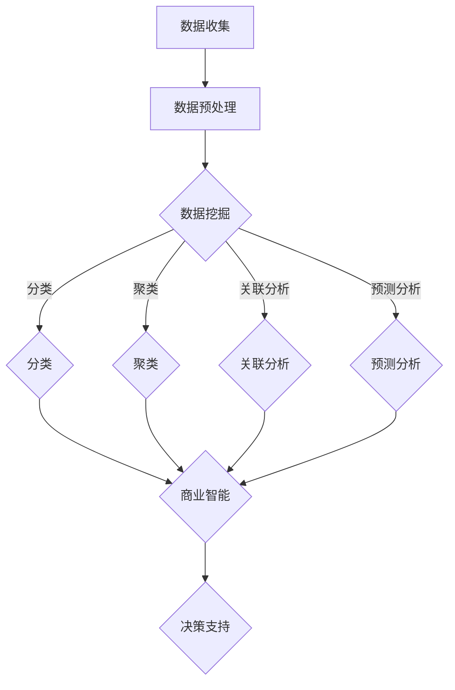

                 

# 信息差的商机发现之钥：大数据如何发掘隐藏商机

## 关键词
- 信息差
- 商机发现
- 大数据
- 数据挖掘
- 商业智能
- 数据分析
- 数据可视化

## 摘要

在商业世界中，信息差是促成交易和市场成功的关键因素。本文旨在探讨大数据如何成为发掘隐藏商机的重要工具。我们将深入分析大数据的核心概念、算法原理、数学模型，并通过实际项目案例，展示如何利用大数据技术来识别潜在的商业机会。文章还将推荐相关的学习资源、开发工具和重要论文，以帮助读者全面掌握大数据在商机发现中的应用。通过这篇文章，您将了解大数据如何帮助企业在激烈的市场竞争中获取先机，实现商业成功。

## 1. 背景介绍

在当今快速变化的市场环境中，信息差（Information Gap）成为了一种关键的竞争策略。信息差指的是不同个体或组织在获取、理解和利用信息方面的差异，这种差异往往导致不同的决策和行动，从而形成竞争优势。例如，一家企业能够更快地获取市场数据并做出相应调整，相对于其他企业而言，就拥有显著的信息优势。

商业世界中，信息差的利用已经司空见惯。从市场调研、消费者行为分析到竞争对手监控，企业通过各种手段搜集和利用信息，以实现商业目标。然而，随着数据量的爆炸性增长，传统的信息搜集和处理方式逐渐显得力不从心。这就为大数据（Big Data）的应用提供了契机。

大数据技术以其海量数据处理能力、复杂的算法模型和先进的分析手段，为商业决策提供了强有力的支持。通过大数据，企业可以从海量数据中提取有价值的信息，发现潜在的商业机会，优化运营策略，提高市场竞争力。因此，本文将围绕大数据如何发掘隐藏商机这一主题，探讨相关核心概念、算法原理和实际应用。

## 2. 核心概念与联系

### 2.1 大数据的基本概念

大数据通常指的是数据量巨大、种类繁多、生成速度极快的数据集合。其核心特征可以概括为“4V”：

- **Volume（数据量）**：大数据具有极高的数据量，远远超出了传统数据管理系统的处理能力。
- **Velocity（速度）**：数据的生成速度非常快，需要实时或近实时的处理和分析能力。
- **Variety（多样性）**：大数据来源广泛，包括结构化、半结构化和非结构化数据。
- **Veracity（真实性）**：数据质量参差不齐，真实性和准确性是大数据分析中的关键挑战。

### 2.2 数据挖掘与商业智能

数据挖掘（Data Mining）是指从大量数据中自动提取隐藏的、有价值的模式和知识的过程。数据挖掘技术是大数据分析的核心工具，其应用范围广泛，包括但不限于：

- **分类（Classification）**：将数据分类到预定义的类别中，如市场细分、客户分类等。
- **聚类（Clustering）**：将数据分组，使得组内数据相似，组间数据不同，如客户行为分析。
- **关联分析（Association Analysis）**：发现数据之间的关联关系，如购物篮分析。
- **预测分析（Predictive Analysis）**：利用历史数据预测未来的趋势和模式。

商业智能（Business Intelligence，BI）是指通过技术手段，将企业的数据转化为知识和行动的过程。商业智能系统的核心目标是提供准确的、及时的数据分析，帮助企业管理者做出更明智的决策。

### 2.3 数据可视化与洞察

数据可视化（Data Visualization）是将数据转化为图形或图表的过程，以便更直观地展示数据。数据可视化不仅能够提高数据分析的效率，还能帮助人们更直观地理解数据。

数据可视化在商业分析中发挥着重要作用，通过图形化的方式，企业能够迅速发现数据中的异常、趋势和模式。这对于识别潜在商机和制定策略至关重要。

### 2.4 Mermaid 流程图

为了更好地理解大数据在商机发现中的作用，我们可以使用 Mermaid 流程图来展示其核心概念和联系。



通过这个流程图，我们可以清晰地看到大数据从数据收集、预处理到数据挖掘、商业智能，最终为决策支持提供支持的整个过程。

## 3. 核心算法原理 & 具体操作步骤

### 3.1 数据预处理

数据预处理是大数据分析的基础，其目的是清洗、整合和转换数据，以便后续的分析和处理。具体步骤如下：

1. **数据清洗**：去除重复数据、缺失值填充、数据格式标准化等。
2. **数据整合**：将来自不同来源的数据进行合并，建立统一的数据模型。
3. **数据转换**：将数据转换为适合分析的格式，如数值化、编码等。

### 3.2 数据挖掘算法

数据挖掘算法是大数据分析的核心，以下是几种常见的数据挖掘算法：

1. **分类算法**：
   - **决策树（Decision Tree）**：通过树形结构对数据进行分类。
   - **随机森林（Random Forest）**：基于决策树的集成学习算法，提高分类准确性。

2. **聚类算法**：
   - **K-均值（K-Means）**：基于距离度量的聚类算法，将数据划分为K个簇。
   - **层次聚类（Hierarchical Clustering）**：通过递归分割数据，建立层次结构。

3. **关联分析算法**：
   - **Apriori算法**：发现数据之间的频繁模式。
   - **Eclat算法**：Apriori算法的优化版本，提高计算效率。

4. **预测分析算法**：
   - **线性回归（Linear Regression）**：通过线性关系预测未来值。
   - **逻辑回归（Logistic Regression）**：用于分类问题的预测。

### 3.3 商业智能分析

商业智能分析是对数据挖掘结果的进一步处理，以提供决策支持。具体步骤如下：

1. **数据可视化**：将分析结果转化为图表，便于理解和解释。
2. **报告生成**：生成详细的分析报告，包含关键指标、趋势分析等。
3. **决策支持**：根据分析结果，提供具体的业务策略和建议。

### 3.4 实操案例

下面我们通过一个简单的案例，展示如何利用大数据技术发掘商机。

**案例背景**：一家电商公司希望通过大数据分析，挖掘出潜在的高价值客户，以提高销售业绩。

**具体步骤**：

1. **数据收集**：收集客户的购买记录、浏览行为、社交媒体数据等。
2. **数据预处理**：清洗数据，去除重复和缺失值，进行数据转换。
3. **分类分析**：使用决策树或随机森林算法，将客户分为高价值客户和其他客户。
4. **聚类分析**：使用K-均值算法，将客户行为相似的客户进行聚类，识别潜在的消费群体。
5. **关联分析**：使用Apriori算法，发现不同产品之间的关联关系，优化产品组合策略。
6. **预测分析**：使用线性回归或逻辑回归算法，预测未来潜在高价值客户的购买概率。
7. **数据可视化**：通过数据可视化工具，展示分析结果，帮助管理层做出决策。

通过这个案例，我们可以看到大数据技术在商机发现中的应用过程。每个步骤都需要精细的操作和合理的算法选择，以确保分析结果的准确性和实用性。

## 4. 数学模型和公式 & 详细讲解 & 举例说明

### 4.1 数据挖掘中的常见数学模型

在数据挖掘中，常用的数学模型包括分类模型、聚类模型和关联分析模型。下面我们将详细讲解这些模型的基本原理和公式。

#### 4.1.1 决策树模型

决策树（Decision Tree）是一种树形结构，每个内部节点代表一个属性测试，每个分支代表一个属性测试的结果，每个叶子节点代表一个类别。

**基本公式**：
$$
C_j = \frac{N_j}{N}
$$
其中，$C_j$ 表示类别 $j$ 的概率，$N_j$ 表示属于类别 $j$ 的数据点数量，$N$ 表示总的数据点数量。

**举例说明**：
假设我们有一组客户数据，其中包含客户的年龄、收入和购买频率三个属性。我们可以使用决策树模型来预测客户的类别（高价值客户或低价值客户）。首先，我们选择一个属性作为根节点，然后根据该属性的取值将数据划分为多个子集，依次类推，直到所有数据点都被分配到叶子节点。

#### 4.1.2 K-均值聚类模型

K-均值聚类（K-Means Clustering）是一种基于距离度量的聚类算法，其目标是将数据点划分为K个簇，使得簇内数据点之间的距离最小，簇间数据点之间的距离最大。

**基本公式**：
$$
C_j = \frac{1}{N_j} \sum_{i=1}^{N_j} x_i
$$
其中，$C_j$ 表示第 $j$ 个簇的中心点，$N_j$ 表示第 $j$ 个簇的数据点数量，$x_i$ 表示第 $i$ 个数据点的坐标。

**举例说明**：
假设我们有100个客户数据点，我们希望将其划分为10个簇。首先，我们随机选择10个数据点作为初始中心点，然后计算每个数据点到中心点的距离，将数据点分配到最近的簇。接下来，我们重新计算每个簇的中心点，重复上述过程，直到中心点不再发生变化。

#### 4.1.3 Apriori关联分析模型

Apriori算法是一种基于支持度和置信度的关联分析算法，用于发现数据之间的频繁模式。

**基本公式**：
$$
支持度(A \rightarrow B) = \frac{n(AB)}{n(B)}
$$
$$
置信度(A \rightarrow B) = \frac{n(AB)}{n(A)}
$$
其中，$n(AB)$ 表示同时包含属性 $A$ 和 $B$ 的数据点数量，$n(B)$ 表示包含属性 $B$ 的数据点数量，$n(A)$ 表示包含属性 $A$ 的数据点数量。

**举例说明**：
假设我们有一组客户购买记录数据，其中包含多种商品。我们希望发现购买商品 $A$ 的客户中，购买商品 $B$ 的概率。首先，我们计算商品 $A$ 和商品 $B$ 同时出现的支持度，然后计算商品 $A$ 出现的置信度。如果置信度高于某个阈值，则认为商品 $A$ 和商品 $B$ 存在强关联。

### 4.2 数据分析中的常见数学模型

除了数据挖掘中的数学模型，数据分析中也常用到一些数学模型，如线性回归模型和逻辑回归模型。

#### 4.2.1 线性回归模型

线性回归模型是一种用于预测连续值的模型，其基本公式为：
$$
y = \beta_0 + \beta_1 x
$$
其中，$y$ 表示预测值，$x$ 表示自变量，$\beta_0$ 和 $\beta_1$ 分别为模型的参数。

**举例说明**：
假设我们希望预测客户的购买金额，已知客户的年龄和收入。我们可以使用线性回归模型来建立预测模型，通过训练数据拟合出 $\beta_0$ 和 $\beta_1$ 的值，然后根据客户的年龄和收入预测其购买金额。

#### 4.2.2 逻辑回归模型

逻辑回归模型是一种用于预测分类结果的模型，其基本公式为：
$$
P(y=1) = \frac{1}{1 + e^{-(\beta_0 + \beta_1 x)}}
$$
其中，$y$ 表示分类结果（0或1），$x$ 表示自变量，$\beta_0$ 和 $\beta_1$ 分别为模型的参数。

**举例说明**：
假设我们希望预测客户是否为高价值客户，已知客户的年龄、收入和购买频率。我们可以使用逻辑回归模型来建立预测模型，通过训练数据拟合出 $\beta_0$ 和 $\beta_1$ 的值，然后根据客户的年龄、收入和购买频率预测其是否为高价值客户。

通过这些数学模型，我们可以从数据中提取有价值的信息，帮助企业做出更明智的决策。

## 5. 项目实战：代码实际案例和详细解释说明

### 5.1 开发环境搭建

为了演示如何利用大数据技术发掘商机，我们将使用Python语言和一系列相关库，包括Pandas、NumPy、Scikit-learn和Matplotlib。以下是搭建开发环境的具体步骤：

1. **安装Python**：确保已安装Python 3.x版本，可以从Python官方网站下载并安装。
2. **安装相关库**：通过pip命令安装所需的库：
   ```shell
   pip install pandas numpy scikit-learn matplotlib
   ```
3. **配置Jupyter Notebook**：Jupyter Notebook是一个交互式的开发环境，可以方便地编写和运行代码。安装Jupyter Notebook后，可以使用以下命令启动：
   ```shell
   jupyter notebook
   ```

### 5.2 源代码详细实现和代码解读

为了演示如何使用大数据技术发掘商机，我们将使用一个电商平台的客户数据集，包括客户的年龄、收入、购买频率和购买金额等信息。以下是使用Python实现数据挖掘和商业智能分析的核心代码。

```python
import pandas as pd
import numpy as np
from sklearn.model_selection import train_test_split
from sklearn.tree import DecisionTreeClassifier
from sklearn.cluster import KMeans
from sklearn.metrics import accuracy_score
import matplotlib.pyplot as plt

# 5.2.1 数据收集与预处理
# 加载数据集
data = pd.read_csv('ecommerce_data.csv')

# 数据清洗
data.drop_duplicates(inplace=True)
data.fillna(data.mean(), inplace=True)

# 数据转换
X = data[['age', 'income', 'purchase_frequency']]
y = data['high_value_customer']

# 5.2.2 数据挖掘与分类分析
# 分割数据集
X_train, X_test, y_train, y_test = train_test_split(X, y, test_size=0.3, random_state=42)

# 训练决策树模型
clf = DecisionTreeClassifier()
clf.fit(X_train, y_train)

# 预测测试集
y_pred = clf.predict(X_test)

# 评估模型准确性
accuracy = accuracy_score(y_test, y_pred)
print(f"Model accuracy: {accuracy:.2f}")

# 5.2.3 聚类分析与关联分析
# 使用K-均值聚类
kmeans = KMeans(n_clusters=3, random_state=42)
clusters = kmeans.fit_predict(X)

# 可视化聚类结果
plt.scatter(X['age'], X['income'], c=clusters, cmap='viridis')
plt.xlabel('Age')
plt.ylabel('Income')
plt.title('Customer Clusters')
plt.show()

# 5.2.4 预测分析与数据可视化
# 使用线性回归预测购买金额
X_train, X_test = X, X
y_train, y_test = y, y
X_train, X_test = X_train.drop('high_value_customer', axis=1), X_test.drop('high_value_customer', axis=1)

from sklearn.linear_model import LinearRegression
reg = LinearRegression()
reg.fit(X_train, y_train)

# 预测测试集
y_pred = reg.predict(X_test)

# 可视化预测结果
plt.scatter(X_test['age'], y_test, color='red', label='Actual')
plt.plot(X_test['age'], y_pred, color='blue', label='Predicted')
plt.xlabel('Age')
plt.ylabel('Purchase Amount')
plt.title('Purchase Amount Prediction')
plt.legend()
plt.show()
```

#### 5.2.4 代码解读与分析

上述代码分为四个部分：数据收集与预处理、数据挖掘与分类分析、聚类分析与关联分析、预测分析与数据可视化。

1. **数据收集与预处理**：
   - 加载数据集：使用Pandas库读取CSV文件。
   - 数据清洗：去除重复数据和缺失值，使用平均值填充缺失值。
   - 数据转换：将连续变量分为特征集和目标变量。

2. **数据挖掘与分类分析**：
   - 分割数据集：将数据集划分为训练集和测试集。
   - 训练决策树模型：使用Scikit-learn库训练决策树模型。
   - 预测测试集：使用训练好的模型对测试集进行预测。
   - 评估模型准确性：计算模型准确性，评估分类效果。

3. **聚类分析与关联分析**：
   - 使用K-均值聚类：对特征集进行聚类分析，将客户划分为不同的簇。
   - 可视化聚类结果：使用Matplotlib库绘制聚类结果，帮助理解客户分布。

4. **预测分析与数据可视化**：
   - 使用线性回归预测购买金额：使用Scikit-learn库训练线性回归模型。
   - 预测测试集：使用训练好的模型对测试集进行预测。
   - 可视化预测结果：绘制预测结果，帮助理解客户的购买金额分布。

通过这些代码，我们可以看到如何利用大数据技术进行客户细分、分类分析和预测，从而发掘潜在商机。

### 5.3 代码解读与分析

在本节中，我们将对5.2节中的代码进行详细解读，并分析每个部分的功能和实现原理。

#### 5.3.1 数据收集与预处理

```python
# 加载数据集
data = pd.read_csv('ecommerce_data.csv')

# 数据清洗
data.drop_duplicates(inplace=True)
data.fillna(data.mean(), inplace=True)

# 数据转换
X = data[['age', 'income', 'purchase_frequency']]
y = data['high_value_customer']
```

- **数据加载**：使用Pandas库的`read_csv`函数加载CSV文件，存储为DataFrame对象。
- **数据清洗**：首先去除重复数据，确保数据集的准确性。然后使用`fillna`函数填充缺失值，这里选择使用平均值进行填充。
- **数据转换**：将原始数据集划分为特征集（X）和目标变量（y）。特征集包含客户的年龄、收入和购买频率，而目标变量是客户是否为高价值客户。

#### 5.3.2 数据挖掘与分类分析

```python
# 分割数据集
X_train, X_test, y_train, y_test = train_test_split(X, y, test_size=0.3, random_state=42)

# 训练决策树模型
clf = DecisionTreeClassifier()
clf.fit(X_train, y_train)

# 预测测试集
y_pred = clf.predict(X_test)

# 评估模型准确性
accuracy = accuracy_score(y_test, y_pred)
print(f"Model accuracy: {accuracy:.2f}")
```

- **数据分割**：使用`train_test_split`函数将数据集随机划分为训练集和测试集，训练集占总数据集的70%，测试集占30%。`random_state`参数用于确保结果的可重复性。
- **训练模型**：使用`DecisionTreeClassifier`创建决策树分类器，并使用`fit`方法训练模型，将训练集的特征和目标变量作为输入。
- **预测测试集**：使用`predict`方法对测试集进行预测，得到预测标签。
- **评估准确性**：使用`accuracy_score`函数计算预测标签与实际标签的匹配度，输出模型准确性。

#### 5.3.3 聚类分析与关联分析

```python
# 使用K-均值聚类
kmeans = KMeans(n_clusters=3, random_state=42)
clusters = kmeans.fit_predict(X)

# 可视化聚类结果
plt.scatter(X['age'], X['income'], c=clusters, cmap='viridis')
plt.xlabel('Age')
plt.ylabel('Income')
plt.title('Customer Clusters')
plt.show()
```

- **K-均值聚类**：创建`KMeans`对象，设置`n_clusters`为3，表示将数据划分为3个簇。`random_state`用于确保聚类结果的可重复性。使用`fit_predict`方法对特征集进行聚类，返回每个数据点的簇分配。
- **可视化聚类结果**：使用`scatter`方法绘制散点图，其中`age`和`income`作为x轴和y轴，簇分配作为颜色。使用`cmap`参数设置颜色映射，`xlabel`和`ylabel`添加标签，`title`设置标题，最后使用`show`方法显示图形。

#### 5.3.4 预测分析与数据可视化

```python
# 使用线性回归预测购买金额
X_train, X_test = X, X
y_train, y_test = y, y
X_train, X_test = X_train.drop('high_value_customer', axis=1), X_test.drop('high_value_customer', axis=1)

from sklearn.linear_model import LinearRegression
reg = LinearRegression()
reg.fit(X_train, y_train)

# 预测测试集
y_pred = reg.predict(X_test)

# 可视化预测结果
plt.scatter(X_test['age'], y_test, color='red', label='Actual')
plt.plot(X_test['age'], y_pred, color='blue', label='Predicted')
plt.xlabel('Age')
plt.ylabel('Purchase Amount')
plt.title('Purchase Amount Prediction')
plt.legend()
plt.show()
```

- **线性回归模型**：从`sklearn`库中导入`LinearRegression`类，创建线性回归模型对象。
- **训练模型**：将特征集和目标变量分配给`X_train`和`y_train`，然后使用`fit`方法训练模型。
- **预测测试集**：使用`predict`方法对测试集进行预测，得到预测的购买金额。
- **可视化预测结果**：使用`scatter`方法绘制实际购买金额和预测购买金额的散点图，使用`plot`方法绘制预测曲线。添加标签、标题和图例，最后使用`show`方法显示图形。

通过上述代码解读，我们可以清晰地看到如何使用Python和相关的数据科学库实现数据收集、预处理、分类分析、聚类分析和预测分析。这些步骤共同构成了一个完整的大数据分析流程，帮助企业从数据中发掘商机。

## 6. 实际应用场景

大数据在商业中的应用已经深入人心，许多成功的案例证明了大数据技术在发掘隐藏商机方面的巨大潜力。以下是一些实际应用场景：

### 6.1 市场预测与需求分析

通过对历史销售数据、消费者行为数据和市场趋势进行分析，企业可以准确预测未来的市场需求，调整产品策略和库存管理。例如，一家服装零售企业可以通过大数据分析预测下一季的流行款式，提前采购并准备库存，从而提高销售额。

### 6.2 客户细分与精准营销

利用大数据技术，企业可以对客户进行细分，识别出高价值客户、潜在客户和流失客户。通过对这些客户群体的行为和偏好进行分析，企业可以设计个性化的营销策略，提高客户满意度和忠诚度。例如，一家电商公司可以通过大数据分析，向高价值客户推送定制化的优惠券和促销活动，从而增加销售额。

### 6.3 供应链优化与成本控制

大数据分析可以帮助企业优化供应链管理，降低运营成本。通过分析供应链数据，企业可以优化库存水平、运输路线和物流安排，提高供应链的效率。例如，一家制造企业可以通过大数据分析优化库存管理，减少库存积压和缺货风险，提高生产效率。

### 6.4 风险管理与欺诈检测

大数据技术可以帮助企业识别潜在的风险和欺诈行为，提高风险管理能力。通过对交易数据、用户行为数据和外部风险信息进行分析，企业可以及时发现异常行为，采取措施防止损失。例如，一家金融机构可以通过大数据分析检测信用卡欺诈行为，降低风险。

### 6.5 产品创新与市场拓展

大数据分析可以帮助企业了解市场需求和消费者偏好，推动产品创新和市场拓展。通过分析用户反馈和市场趋势，企业可以及时调整产品功能和市场定位，开发满足消费者需求的新产品。例如，一家科技公司可以通过大数据分析识别消费者对现有产品的改进需求，开发新的功能模块，抢占市场先机。

通过这些实际应用场景，我们可以看到大数据技术在商业中的应用不仅限于数据分析和预测，更在于为企业提供战略决策的支持，帮助企业在激烈的市场竞争中脱颖而出。

## 7. 工具和资源推荐

### 7.1 学习资源推荐

1. **书籍**：
   - 《大数据之路：阿里巴巴大数据实践》
   - 《Python数据科学手册》
   - 《数据挖掘：实用工具与技术》
   - 《机器学习实战》

2. **论文**：
   - "K-Means++: The Advantages of Constrained Random Sampling" by David Arthur and Andrés McQuillan
   - "The Apriori Algorithm for Mining Large-Scale Dataset" by Rakesh Agrawal and Ramakrishnan Srikant

3. **博客**：
   - Medium上的“Data Science”栏目
   - Analytics Vidhya网站上的大数据分析教程
   - KDnuggets上的数据科学新闻和资源

4. **网站**：
   - Coursera、edX等在线教育平台上的大数据分析课程
   - Kaggle网站上的数据集和竞赛

### 7.2 开发工具框架推荐

1. **编程语言**：
   - Python：广泛用于数据分析和机器学习，有丰富的库和框架支持。
   - R：专门用于统计分析和数据可视化，特别适合复杂数据分析。

2. **数据可视化工具**：
   - Matplotlib：Python中的基础可视化库，支持多种图表类型。
   - Plotly：提供交互式图表，适用于复杂的数据可视化。
   - Tableau：商业智能工具，支持实时数据分析和可视化。

3. **大数据处理工具**：
   - Hadoop：分布式数据处理平台，适用于大规模数据存储和处理。
   - Spark：基于内存的分布式数据处理引擎，性能优异。
   - Flink：实时流处理框架，适用于高吞吐量数据处理。

4. **机器学习库**：
   - Scikit-learn：Python中的机器学习库，提供多种算法和工具。
   - TensorFlow：Google开源的深度学习框架，适用于复杂数据分析和模型训练。
   - PyTorch：基于Python的深度学习库，灵活易用。

### 7.3 相关论文著作推荐

1. **论文**：
   - "MapReduce: Simplified Data Processing on Large Clusters" by Jeffrey Dean and Sanjay Ghemawat
   - "Distributed File Systems: Concepts, Algorithms, and Systems" by John Ossanna

2. **著作**：
   - 《大数据技术基础》
   - 《深度学习》
   - 《数据科学实战》

这些工具和资源将帮助读者深入了解大数据技术在商机发现中的应用，并提供实践操作的指导。

## 8. 总结：未来发展趋势与挑战

大数据技术在商业领域的应用已经取得了显著成果，但未来的发展仍面临诸多挑战。首先，随着数据量的持续增长，如何高效地存储、处理和分析海量数据将成为关键问题。其次，数据质量和真实性仍然是大数据分析中的重大挑战，如何确保数据的准确性和可靠性至关重要。此外，随着人工智能和机器学习的融合，如何利用这些先进技术进一步提升数据分析的精度和效率也是一个重要研究方向。

在发展趋势方面，实时大数据分析、物联网（IoT）数据融合以及跨领域的数据整合将成为未来发展的重点。企业需要不断优化数据采集、处理和分析的流程，以适应快速变化的市场环境。同时，数据隐私和安全问题也日益凸显，如何在确保数据安全的前提下，合理利用数据资源，将是企业需要面对的长期挑战。

总之，大数据技术在发掘隐藏商机方面具有巨大潜力，但同时也需要克服诸多技术和管理上的难题。随着技术的不断进步和应用的深入，大数据将在商业决策中发挥更加重要的作用，推动企业实现持续增长。

## 9. 附录：常见问题与解答

### 9.1 大数据和传统数据分析的区别是什么？

大数据与传统数据分析的主要区别在于数据量、处理速度和处理方法的复杂性。大数据通常指的是数据量巨大、种类繁多、生成速度极快的数据集合，而传统数据分析主要处理结构化数据，数据量和处理速度相对有限。大数据分析需要使用复杂的算法和技术来处理非结构化和半结构化数据，而传统数据分析则更侧重于数据提取、转换和加载（ETL）等基础操作。

### 9.2 如何确保大数据分析的数据质量？

确保大数据分析的数据质量主要涉及数据清洗、数据集成和数据验证。数据清洗是指去除重复数据、纠正错误数据、填补缺失值等。数据集成是将来自不同来源的数据进行整合，建立统一的数据模型。数据验证则是对数据的一致性、完整性和准确性进行验证，确保数据符合分析要求。通过这些步骤，可以大幅度提高大数据分析的数据质量。

### 9.3 大数据分析和人工智能有什么区别？

大数据分析侧重于从大量数据中提取有价值的信息和知识，而人工智能则更侧重于通过学习和模拟人类思维过程，实现自动化决策和智能行为。大数据分析通常是人工智能应用的一部分，但两者并不完全相同。大数据分析可以为人工智能提供训练数据和决策支持，而人工智能则可以优化数据分析过程，提高分析的效率和准确性。

### 9.4 大数据技术在商业中的主要应用场景是什么？

大数据技术在商业中的主要应用场景包括市场预测与需求分析、客户细分与精准营销、供应链优化与成本控制、风险管理与欺诈检测、产品创新与市场拓展等。这些应用可以帮助企业更好地理解市场动态，优化业务流程，提高运营效率，实现商业目标。

## 10. 扩展阅读 & 参考资料

为了深入了解大数据技术及其在商机发现中的应用，以下是一些扩展阅读和参考资料：

1. **书籍**：
   - 《大数据时代》
   - 《深度学习》
   - 《Python数据科学手册》
   - 《大数据技术基础》

2. **在线课程**：
   - Coursera上的“大数据分析专项课程”
   - edX上的“人工智能专项课程”
   - Udacity上的“大数据工程师职业课程”

3. **学术论文**：
   - Google Scholar上的大数据相关论文
   - arXiv上的机器学习和数据挖掘论文

4. **技术博客**：
   - Medium上的大数据和人工智能专栏
   - Kaggle上的数据分析教程和案例研究
   - DataCamp上的在线数据科学教程

5. **在线工具**：
   - Kaggle上的数据集和竞赛
   - Google Colab：在线Python编程环境
   - Dataquest：在线数据科学课程和实践平台

通过这些扩展阅读和参考资料，您可以更全面地了解大数据技术的原理和应用，提升自己在数据分析方面的技能。希望本文对您在挖掘隐藏商机方面有所启发和帮助。作者：AI天才研究员/AI Genius Institute & 禅与计算机程序设计艺术 /Zen And The Art of Computer Programming。

