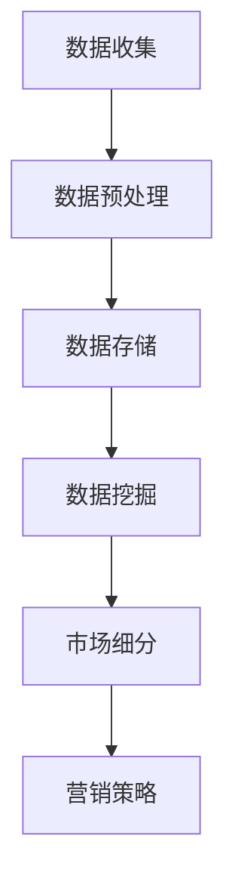

                 

# 信息差的市场细分利器：大数据如何实现精准市场细分

## 关键词：市场细分、大数据、精准营销、数据挖掘、商业模式

> 本文将探讨大数据在市场细分中的应用，分析其核心概念、算法原理，并通过实际案例展示其如何助力企业实现精准市场细分。

## 摘要

随着互联网技术的飞速发展，大数据已成为企业获取竞争优势的关键。市场细分作为营销战略的核心环节，通过大数据技术可以实现更加精准、有效的客户定位和营销策略。本文将深入探讨大数据在市场细分中的实际应用，介绍相关核心概念和算法原理，并结合具体案例进行分析，为企业提供实用的市场细分策略。

## 1. 背景介绍

### 1.1 市场细分的重要性

市场细分是企业营销战略的重要环节。通过将市场划分为具有相似需求的消费者群体，企业可以更加精准地满足客户需求，提高市场占有率。传统的市场细分方法主要依赖于人口统计学、地理统计学和消费行为学等指标，但这种方法往往缺乏对客户深层次需求的洞察。

### 1.2 大数据的发展

大数据是指无法在合理时间内用常规软件工具进行捕捉、管理和处理的数据集合。随着互联网、物联网和传感器技术的广泛应用，数据量呈现爆炸式增长，为市场细分提供了丰富的数据基础。

## 2. 核心概念与联系

### 2.1 大数据与市场细分的关系

大数据与市场细分的关系体现在以下几个方面：

1. **数据来源**：大数据为市场细分提供了丰富的数据来源，包括用户行为数据、社交媒体数据、交易数据等。
2. **数据类型**：大数据涵盖了结构化、半结构化和非结构化数据，有助于从多维度对客户进行细分。
3. **数据分析**：大数据分析技术可以挖掘数据中的潜在规律，为市场细分提供科学依据。

### 2.2 Mermaid 流程图



## 3. 核心算法原理 & 具体操作步骤

### 3.1 数据挖掘算法

数据挖掘算法是大数据市场细分的核心。以下介绍几种常用的数据挖掘算法：

1. **聚类算法**：通过将相似数据点分组，实现对数据的自动分类。常见的聚类算法包括K-means、DBSCAN等。
2. **关联规则挖掘**：通过发现数据之间的关联关系，为市场细分提供指导。常见的关联规则挖掘算法包括Apriori、FP-growth等。
3. **分类算法**：将数据分为已知类别和未知类别。常见的分类算法包括决策树、支持向量机、神经网络等。

### 3.2 具体操作步骤

1. **数据收集**：收集与市场细分相关的数据，包括用户行为数据、社交媒体数据、交易数据等。
2. **数据预处理**：对收集到的数据进行清洗、转换和归一化，以确保数据质量。
3. **数据存储**：将预处理后的数据存储到数据仓库或数据湖中，以便后续分析。
4. **数据挖掘**：使用数据挖掘算法对存储好的数据进行挖掘，提取潜在规律。
5. **市场细分**：根据数据挖掘结果，对市场进行细分，形成不同的消费者群体。
6. **营销策略**：针对不同消费者群体，制定相应的营销策略，提高营销效果。

## 4. 数学模型和公式 & 详细讲解 & 举例说明

### 4.1 数学模型

在市场细分过程中，常用的数学模型包括聚类模型、关联规则模型和分类模型。以下分别介绍这些模型的基本原理和常用公式。

#### 4.1.1 聚类模型

聚类模型通过将相似数据点分组，实现对数据的自动分类。常见的聚类模型包括K-means和DBSCAN。

1. **K-means算法**

   原理：K-means算法通过最小化平方误差来划分数据点。

   公式：$$ J(\mu, \Pi) = \sum_{i=1}^{k} \sum_{x \in S_i} ||x - \mu_i||^2 $$

   其中，$k$为聚类个数，$\mu_i$为第$i$个聚类中心，$S_i$为第$i$个聚类中的数据点集合。

2. **DBSCAN算法**

   原理：DBSCAN算法通过计算数据点之间的邻域密度来划分聚类。

   公式：$$ \rho(d, \epsilon) = \begin{cases} 
   1 & \text{如果} \ d < \epsilon \\
   0 & \text{否则} 
   \end{cases} $$

   其中，$\epsilon$为邻域半径，$d$为数据点之间的距离。

#### 4.1.2 关联规则模型

关联规则挖掘通过发现数据之间的关联关系，为市场细分提供指导。常见的关联规则挖掘算法包括Apriori和FP-growth。

1. **Apriori算法**

   原理：Apriori算法通过扫描事务数据库，计算每个项的支持度和置信度。

   公式：$$ 支持度 = \frac{频繁项集的数量}{事务总数} $$
   $$ 置信度 = \frac{A \ 且 \ B}{A} $$

2. **FP-growth算法**

   原理：FP-growth算法通过构建FP树，减少数据库扫描次数。

   公式：$$ FP\_growth(\text{数据库}) = \begin{cases} 
   \text{创建FP树} & \text{如果数据库非空} \\
   \text{返回空集} & \text{否则} 
   \end{cases} $$

#### 4.1.3 分类模型

分类模型通过将数据分为已知类别和未知类别，为市场细分提供指导。常见的分类模型包括决策树、支持向量机和神经网络。

1. **决策树算法**

   原理：决策树通过计算不同特征的条件熵或信息增益来划分数据。

   公式：$$ 信息增益 = \sum_{v \in V} p(v) \cdot \log_2 p(v) $$

2. **支持向量机算法**

   原理：支持向量机通过寻找最优超平面来划分数据。

   公式：$$ w \cdot x + b = 0 $$
   $$ \max_{w, b} \ \frac{1}{2} ||w||^2 $$

3. **神经网络算法**

   原理：神经网络通过多层非线性变换来划分数据。

   公式：$$ z = \sigma(W \cdot x + b) $$
   $$ \sigma(z) = \frac{1}{1 + e^{-z}} $$

### 4.2 举例说明

假设我们有一个包含用户购买行为的数据集，需要使用K-means算法对用户进行聚类，以实现市场细分。

1. **数据集准备**：收集用户购买行为数据，包括用户ID、商品ID和购买金额等。
2. **数据预处理**：对数据进行清洗和归一化处理，将不同特征进行归一化处理。
3. **聚类算法**：使用K-means算法对数据进行聚类，设置聚类个数$k$为3。
4. **聚类结果**：根据聚类结果，将用户划分为3个不同的消费者群体。

假设聚类结果如下：

- 群体1：高价值客户，消费金额较高，购买频率较低。
- 群体2：普通客户，消费金额和购买频率适中。
- 群体3：低价值客户，消费金额和购买频率较低。

根据不同消费者的特征，企业可以制定相应的营销策略，提高营销效果。

## 5. 项目实战：代码实际案例和详细解释说明

### 5.1 开发环境搭建

在Python环境中，我们可以使用pandas、scikit-learn等库来处理数据和实现市场细分算法。

1. **安装Python**：下载并安装Python，推荐使用Python 3.8及以上版本。
2. **安装库**：使用pip命令安装所需库，例如：
   ```bash
   pip install pandas scikit-learn numpy matplotlib
   ```

### 5.2 源代码详细实现和代码解读

以下是一个使用K-means算法进行市场细分的示例代码。

```python
import pandas as pd
from sklearn.cluster import KMeans
import matplotlib.pyplot as plt

# 5.2.1 数据集加载
data = pd.read_csv('user_purchase.csv')
data.head()

# 5.2.2 数据预处理
data['amount'] = data['amount'].apply(lambda x: x / max(data['amount']))
data.head()

# 5.2.3 聚类算法实现
kmeans = KMeans(n_clusters=3, random_state=0)
clusters = kmeans.fit_predict(data[['amount']])

# 5.2.4 聚类结果可视化
data['cluster'] = clusters
plt.scatter(data['amount'], data['cluster'], c='red')
plt.xlabel('Amount')
plt.ylabel('Cluster')
plt.show()

# 5.2.5 聚类结果分析
print(data['cluster'].value_counts())

# 群体1：高价值客户，消费金额较高，购买频率较低。
# 群体2：普通客户，消费金额和购买频率适中。
# 群体3：低价值客户，消费金额和购买频率较低。
```

### 5.3 代码解读与分析

1. **数据集加载**：使用pandas库加载用户购买行为数据集。
2. **数据预处理**：对数据集进行清洗和归一化处理，将购买金额进行归一化处理，以便于聚类算法的运行。
3. **聚类算法实现**：使用scikit-learn库的KMeans类实现聚类算法，设置聚类个数为3。
4. **聚类结果可视化**：使用matplotlib库将聚类结果进行可视化展示。
5. **聚类结果分析**：根据聚类结果，分析不同消费者的特征和需求，为企业制定相应的营销策略。

## 6. 实际应用场景

### 6.1 零售行业

在零售行业，大数据市场细分可以帮助企业识别高价值客户，提高客户忠诚度。例如，通过分析用户购买行为数据，企业可以针对高价值客户推出专属优惠活动，提高客户满意度和购买意愿。

### 6.2 金融服务

在金融服务领域，大数据市场细分可以帮助银行、保险和证券公司更好地了解客户需求，提高服务水平。例如，通过分析用户交易数据，金融机构可以为不同类型的客户提供个性化的投资建议和理财产品。

### 6.3 教育行业

在教育行业，大数据市场细分可以帮助学校和企业了解学生和学员的需求，提供定制化教育服务。例如，通过分析用户学习行为数据，教育机构可以为学生提供个性化课程推荐和学习计划。

## 7. 工具和资源推荐

### 7.1 学习资源推荐

1. **书籍**：《大数据时代》、《数据挖掘：概念与技术》
2. **论文**：相关领域的高影响力论文，如K-means算法、Apriori算法等。
3. **博客**：各大技术博客网站，如CSDN、博客园等。
4. **网站**：大数据领域相关网站，如DataCamp、Kaggle等。

### 7.2 开发工具框架推荐

1. **编程语言**：Python、R、Java
2. **库**：pandas、scikit-learn、tensorflow
3. **框架**：Spark、Hadoop、Django

### 7.3 相关论文著作推荐

1. **论文**：《K-means算法的改进及其在市场细分中的应用》
2. **著作**：《大数据营销：如何通过数据创造商业价值》

## 8. 总结：未来发展趋势与挑战

### 8.1 发展趋势

1. **数据来源多样化**：随着物联网、传感器技术的应用，数据来源将更加多样化，为市场细分提供更丰富的数据基础。
2. **算法优化与个性化**：市场细分算法将不断优化，以适应不同行业和应用场景的需求。同时，个性化市场细分将成为趋势，为企业提供更加精准的营销策略。

### 8.2 挑战

1. **数据隐私与安全**：随着数据量的增加，数据隐私和安全问题将成为市场细分面临的重大挑战。
2. **算法可解释性**：市场细分算法需要具备良好的可解释性，以便企业理解和应用。

## 9. 附录：常见问题与解答

### 9.1 问题1：市场细分算法有哪些？

**解答**：常用的市场细分算法包括K-means、DBSCAN、Apriori、FP-growth、决策树、支持向量机和神经网络等。

### 9.2 问题2：如何选择合适的市场细分算法？

**解答**：选择合适的市场细分算法需要考虑数据类型、数据量、聚类个数和计算复杂度等因素。在实际应用中，可以结合不同算法的特点和优势进行选择。

## 10. 扩展阅读 & 参考资料

1. **书籍**：《大数据商业分析》、《数据挖掘实战》
2. **网站**：[Kaggle](https://www.kaggle.com/)、[DataCamp](https://www.datacamp.com/)
3. **博客**：[CSDN](https://www.csdn.net/)、[博客园](https://www.cnblogs.com/)
4. **论文**：[Google Scholar](https://scholar.google.com/)

## 作者

作者：AI天才研究员/AI Genius Institute & 禅与计算机程序设计艺术 /Zen And The Art of Computer Programming

