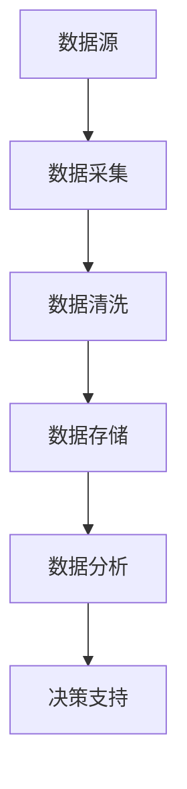

                 

## 1. 背景介绍

在当今信息爆炸的时代，运营效率的提升成为各行各业共同追求的目标。对于互联网企业而言，运营效率的优化直接关系到企业的生存和发展。大数据作为一种强大的工具，在提升运营效率方面发挥了不可或缺的作用。本文将深入探讨信息差的运营优化之路，以及大数据如何通过数据分析、机器学习等技术手段提升运营效率。

### 信息差的概念

信息差，即信息不对称，是指不同个体或群体之间所掌握的信息存在差异。在商业环境中，信息差往往意味着商机。例如，企业通过大数据分析可以挖掘出消费者的潜在需求，从而制定更加精准的市场营销策略。然而，信息差的产生不仅限于企业，也存在于个人之间。如何有效利用信息差，提升自身竞争力，是每个运营者都需要面对的问题。

### 运营效率的定义

运营效率是指企业在资源投入和产出之间所达到的平衡。高效的运营意味着在有限的资源下，企业能够实现最大的产出。运营效率的提升不仅有助于降低成本，提高盈利能力，还能够提升客户满意度，增强企业的核心竞争力。随着市场竞争的加剧，运营效率的优化成为企业持续发展的关键。

### 大数据的作用

大数据作为一种庞大的数据集合，涵盖了结构化、半结构化和非结构化数据。通过大数据技术，企业可以对海量数据进行采集、存储、处理和分析，从而发现隐藏在数据背后的规律和趋势。具体来说，大数据在运营效率提升方面有以下几个方面的作用：

1. **市场调研与需求分析**：大数据可以帮助企业更准确地了解市场需求，挖掘潜在客户，制定更有针对性的运营策略。
2. **客户行为分析**：通过对用户行为的分析，企业可以优化产品和服务，提高用户满意度，减少客户流失率。
3. **运营流程优化**：大数据分析可以帮助企业识别运营过程中的瓶颈和问题，从而进行流程优化，提高工作效率。
4. **风险预测与控制**：大数据分析能够预测潜在的风险，提前采取应对措施，降低运营风险。

### 本文章的结构

本文将分为以下几个部分进行探讨：

1. **核心概念与联系**：介绍大数据运营优化的核心概念，并给出相关的 Mermaid 流程图。
2. **核心算法原理 & 具体操作步骤**：详细讲解大数据运营优化的关键技术算法，以及具体的操作步骤。
3. **数学模型和公式 & 详细讲解 & 举例说明**：介绍大数据分析过程中所涉及的数学模型和公式，并通过实际案例进行说明。
4. **项目实战：代码实际案例和详细解释说明**：通过具体的代码实现，展示大数据运营优化的实际应用。
5. **实际应用场景**：分析大数据在各类运营场景中的应用，探讨其具体作用和效果。
6. **工具和资源推荐**：推荐学习大数据技术所需的学习资源、开发工具和框架。
7. **总结：未来发展趋势与挑战**：总结大数据在运营优化领域的应用现状，探讨未来发展趋势和面临的挑战。

通过以上七个部分，本文将全面解析大数据如何通过信息差的运营优化，提升企业的运营效率。

## 2. 核心概念与联系

在探讨大数据如何提升运营效率之前，我们首先需要了解一些核心概念，这些概念构成了大数据运营优化的理论基础。以下是本文涉及的关键概念及其相互关系，我们将通过 Mermaid 流程图来展示这些概念之间的联系。

### 2.1 数据源

数据源是大数据运营优化的起点。数据源可以是用户行为数据、交易数据、社交媒体数据等。以下是数据源的主要类型：

- **用户行为数据**：包括浏览记录、点击行为、购买记录等。
- **交易数据**：包括订单数据、支付数据等。
- **社交媒体数据**：包括评论、点赞、分享等。

### 2.2 数据采集

数据采集是将数据从数据源中提取出来，并存储到数据仓库的过程。数据采集的方法包括：

- **批处理**：定期从数据源中提取数据，并批量处理。
- **实时处理**：实时从数据源中获取数据，并立即处理。

### 2.3 数据清洗

数据清洗是确保数据质量的过程。通过数据清洗，可以去除重复数据、缺失数据、错误数据等，从而提高数据质量。数据清洗的方法包括：

- **去重**：删除重复的数据记录。
- **补全**：补充缺失的数据。
- **校正**：纠正错误的数据。

### 2.4 数据存储

数据存储是将处理后的数据存储到数据库或数据仓库中，以便后续分析。常见的数据存储技术包括：

- **关系型数据库**：如 MySQL、Oracle 等。
- **NoSQL 数据库**：如 MongoDB、Cassandra 等。
- **数据仓库**：如 Hadoop、Spark 等。

### 2.5 数据分析

数据分析是通过统计学、机器学习等方法对数据进行处理和分析，以提取有价值的信息。数据分析的方法包括：

- **描述性分析**：描述数据的分布、趋势等。
- **预测性分析**：预测未来的趋势和变化。
- **相关性分析**：分析数据之间的相关性。

### 2.6 决策支持

决策支持是通过数据分析结果，为运营决策提供依据。决策支持的方法包括：

- **业务规则**：基于经验和规则进行决策。
- **机器学习**：通过模型预测进行决策。

### Mermaid 流程图

以下是大数据运营优化的 Mermaid 流程图，展示了各个核心概念之间的联系：

在 Mermaid 流程图中，每个节点代表一个核心概念，箭头表示概念之间的数据流和处理过程。通过这个流程图，我们可以清晰地看到大数据运营优化的整体架构。

### 小结

通过上述核心概念与联系的介绍，我们可以看出大数据运营优化是一个复杂的过程，涉及到数据源、数据采集、数据清洗、数据存储、数据分析和决策支持等多个环节。这些概念相互关联，共同构成了大数据运营优化的理论基础。在下一部分，我们将深入探讨大数据运营优化的核心算法原理，以及具体的操作步骤。

---

在本文接下来的内容中，我们将详细讨论大数据运营优化的核心算法原理，包括数据挖掘、机器学习、深度学习等方法，并介绍具体的操作步骤。这将为我们理解和应用大数据技术提供更深入的洞察。敬请期待。

