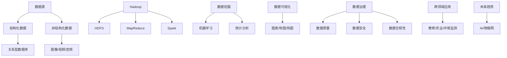

                 

### 背景介绍

在数字化时代，数据已经成为了新的石油。然而，只有通过对这些数据进行深入挖掘和分析，才能释放其真正的价值。大数据技术，作为信息时代的核心技术，正在深刻地影响着各行各业的发展。本篇文章将围绕大数据技术，探讨其核心概念、算法原理、实际应用以及未来发展趋势，旨在为广大读者提供一份全面而深入的技术指南。

首先，我们需要了解大数据的基本概念。大数据通常指的是数据量大、类型多、速度快的数据集合。与传统的小数据相比，大数据具有“4V”特点：Volume（大量）、Velocity（高速）、Variety（多样）和 Veracity（真实性）。这种多样化的数据来源，包括社交媒体、物联网设备、传感器网络等，使得大数据处理和分析成为了一个复杂而庞大的课题。

随着大数据技术的发展，各种新兴技术也应运而生。例如，分布式存储技术如Hadoop和HDFS，能够高效地处理海量数据；分布式计算技术如MapReduce和Spark，则能够快速地对数据进行并行处理；机器学习和数据挖掘技术，则能够从海量数据中提取有价值的信息。这些技术的综合应用，使得大数据在商业、医疗、金融、教育等各个领域都得到了广泛的应用。

然而，随着大数据技术的普及，也带来了诸多挑战。数据隐私和安全问题是大数据应用中最引人关注的问题之一。如何在保证数据隐私和安全的前提下，充分挖掘和利用数据，是一个亟待解决的问题。此外，大数据技术的复杂性和专业性，也使得普通用户难以掌握。因此，如何降低大数据技术的门槛，让更多人能够理解和应用，也是一个重要的课题。

本篇文章将分章节详细探讨大数据技术的各个方面，包括其核心概念、算法原理、实际应用以及未来发展趋势。希望通过本文的介绍，能够帮助读者更好地理解和应用大数据技术，从而在各自的领域中取得更好的成果。

## 1.1 大数据的定义与特点

大数据，顾名思义，指的是规模庞大、类型多样、速度极快的数据集合。与传统的小数据相比，大数据具有以下“4V”特点：

### Volume（大量）

大数据的首要特点就是数据量巨大。随着互联网、物联网、传感器技术的普及，数据来源多样化，数据量呈现出爆炸式增长。例如，全球每年产生的数据量已超过10亿TB，其中70%的数据是在过去两年内产生的。这种海量数据的处理和分析，对传统的数据处理技术提出了巨大的挑战。

### Velocity（高速）

大数据的另一个特点是处理速度快。在信息化时代，数据产生、传输和处理的速度越来越快。例如，社交媒体平台每秒钟都会产生大量的新数据，物联网设备也会实时产生大量的传感器数据。这就要求数据处理技术能够快速响应，及时分析和处理这些数据，以便从中提取有价值的信息。

### Variety（多样）

大数据的多样性体现在数据的类型和来源上。除了结构化数据（如数据库中的表格数据），大数据还包括半结构化数据（如XML、JSON等）和非结构化数据（如图像、视频、文本等）。这种多样化的数据类型，使得数据处理和分析变得更加复杂。为了应对这种多样性，大数据技术需要具备强大的数据处理能力和灵活性。

### Veracity（真实性）

大数据的真实性指的是数据的可信度和准确性。在现实世界中，数据往往存在噪声、误差和虚假信息。如何从这些不完整、不准确、甚至是虚假的数据中提取有价值的信息，是一个重要的挑战。大数据技术需要具备强大的数据清洗和预处理能力，以确保数据的质量和准确性。

除了上述“4V”特点，大数据还有一个显著的特点，即实时性。许多大数据应用，如实时监控、实时推荐等，需要实时处理和分析数据。这就要求大数据技术能够实现实时数据采集、存储和处理，以满足这些实时性需求。

总之，大数据的“4V”特点和实时性，使得其处理和分析变得更加复杂和庞大。然而，正是这些特点，使得大数据技术在各个领域都展现出了巨大的潜力和价值。接下来，我们将进一步探讨大数据的核心概念和关键技术，以了解其背后的原理和应用。

### 1.2 大数据的重要性与应用领域

大数据的重要性不言而喻。在当今信息化时代，数据已经成为新的生产要素，与传统的土地、劳动力、资本和技术等要素一样，对经济社会发展具有深远影响。以下是大数据在各个领域的重要应用：

#### 商业

在商业领域，大数据技术被广泛应用于市场分析、客户行为分析、产品推荐等方面。通过分析大量消费者数据，企业可以深入了解客户需求，优化产品和服务，提高客户满意度。例如，电商巨头阿里巴巴通过大数据分析，实现了个性化的商品推荐，大大提升了销售业绩。此外，大数据还帮助企业进行市场预测和风险管理，降低经营风险。

#### 医疗

在医疗领域，大数据技术的应用正在改变传统医疗模式。通过海量医疗数据的收集和分析，医生可以更准确地诊断疾病，制定个性化的治疗方案。例如，美国的一些医疗机构通过大数据分析，发现了某些罕见疾病的发病规律，从而提高了治疗效果。此外，大数据还用于医院管理，优化资源分配，提高医疗效率。

#### 金融

金融行业一直是大数据技术的重灾区，其应用范围广泛，包括风险控制、欺诈检测、投资分析等。大数据技术可以帮助金融机构实时监控交易行为，及时发现和防范风险。例如，摩根士丹利通过大数据分析，实现了对市场风险的实时监控，有效降低了投资风险。此外，大数据技术还被应用于个性化金融服务，提高客户体验。

#### 教育

在教育领域，大数据技术被应用于教学评估、学生管理、学习分析等方面。通过分析学生的学习行为和成绩数据，教师可以更好地了解学生的学习状况，制定针对性的教学策略。例如，一些在线教育平台通过大数据分析，实现了对学生的学习路径和学习效果的实时监控，提高了教育质量。此外，大数据技术还被应用于教育资源的分配和管理，优化教育资源。

#### 交通

在交通领域，大数据技术被广泛应用于交通管理、车辆调度、路况预测等方面。通过实时监测交通数据，交通管理部门可以更好地应对突发交通事件，提高交通效率。例如，中国的智慧城市项目通过大数据分析，实现了对城市交通的实时监控和优化调度，缓解了城市交通拥堵问题。此外，大数据技术还被应用于车辆导航和智能驾驶，提高了交通安全和效率。

#### 农业

在农业领域，大数据技术被应用于作物生长监测、病虫害预测、智能灌溉等方面。通过分析农田土壤、气候、作物生长数据，农民可以更科学地管理农田，提高农业生产效率。例如，一些农业科技公司通过大数据分析，实现了对作物病虫害的早期预警和精准防治，减少了农业损失。

总之，大数据技术正在各个领域得到广泛应用，并发挥着越来越重要的作用。随着大数据技术的不断发展和完善，其应用领域还将进一步扩展，为社会发展和人类生活带来更多便利。接下来，我们将深入探讨大数据的核心概念和关键技术，以了解其背后的原理和应用。

### 1.3 大数据技术的核心概念

要深入理解大数据技术，首先需要了解其核心概念。这些概念包括数据源、数据存储、数据处理、数据分析和数据可视化等，它们共同构成了大数据技术的体系框架。

#### 数据源

数据源是大数据技术的起点，是数据产生的源头。大数据源可以包括各种结构化和非结构化的数据，如社交媒体数据、物联网数据、传感器数据、文本数据、图像数据和视频数据等。这些数据源广泛分布在各种设备和平台上，形成了海量且多样化的数据资源。例如，社交媒体平台如Facebook、Twitter和Instagram等，每天都会产生大量的用户数据，这些数据可以用于用户行为分析、市场趋势预测等。

#### 数据存储

数据存储是大数据技术的关键环节，旨在高效地存储和管理海量数据。随着数据量的不断增加，传统的集中式存储方式已无法满足需求。分布式存储技术如Hadoop和HDFS应运而生，它们通过将数据分散存储在多个节点上，实现了数据的冗余存储和容错能力。此外，NoSQL数据库如MongoDB、Cassandra等，也因其高效的数据存储和处理能力，在处理大规模非结构化数据方面得到了广泛应用。

#### 数据处理

数据处理是大数据技术的核心，旨在对海量数据进行高效处理和分析。分布式计算技术如MapReduce和Spark，通过并行处理和分布式计算，实现了对大规模数据的快速处理。MapReduce是一种基于批处理的分布式数据处理框架，它将数据处理任务分解为多个Map和Reduce任务，并在多个节点上并行执行。Spark则是一种基于内存的分布式计算引擎，它通过高效的数据处理和内存管理，大大提高了数据处理速度。

#### 数据分析

数据分析是大数据技术的核心应用之一，旨在从海量数据中提取有价值的信息。数据分析包括数据挖掘、机器学习和统计分析等方法。数据挖掘是从大量数据中发现潜在的模式和关联，以支持决策。机器学习是通过训练模型，从数据中学习规律，以实现自动化决策。统计分析则是通过数学模型和方法，对数据进行量化分析和解释。数据分析技术被广泛应用于市场分析、客户行为分析、风险预测等领域。

#### 数据可视化

数据可视化是大数据技术的另一个重要方面，旨在将复杂的数据以直观、易于理解的方式呈现。数据可视化技术包括图表、地图、热图等，它们可以帮助用户更清晰地理解和分析数据。通过数据可视化，用户可以快速发现数据中的异常、趋势和关联，从而做出更明智的决策。

总之，数据源、数据存储、数据处理、数据分析和数据可视化共同构成了大数据技术的核心概念。这些概念相互关联，共同支撑着大数据技术的应用和发展。在接下来的章节中，我们将深入探讨大数据技术的具体实现和实际应用，以帮助读者更好地理解和应用这些技术。

### 1.4 大数据技术与传统数据分析的区别

大数据技术与传统数据分析之间存在显著的区别，这些区别主要体现在数据量、处理速度和复杂性等方面。

#### 数据量

大数据技术的核心特点之一是其数据量巨大，通常被称为“海量数据”。这种海量数据不仅包括传统的结构化数据，还涵盖了大量的半结构化数据（如日志文件、XML数据等）和非结构化数据（如图像、视频、音频和文本等）。相比之下，传统数据分析主要处理的是相对较小规模的结构化数据，这些数据通常存储在关系型数据库中，如MySQL、Oracle等。

#### 处理速度

大数据技术强调实时性和高效性，能够在短时间内处理大量数据。分布式计算技术和内存计算技术的引入，使得大数据系统能够快速响应数据请求，进行实时分析和处理。例如，Spark和Flink等内存计算框架，能够显著提高数据处理速度，从而满足实时性要求。而传统数据分析通常依赖于批处理方式，处理速度相对较慢，难以满足实时性需求。

#### 数据复杂性

大数据技术的另一个显著特点是数据类型的多样性。除了结构化数据外，大数据技术还需要处理大量的半结构化数据和非结构化数据。这些数据类型不仅包括文本、图像和视频，还包括地理位置信息、社交媒体数据等。相比之下，传统数据分析主要处理结构化数据，数据类型相对单一。因此，大数据技术需要具备更强的数据处理能力和灵活性，以应对不同类型的数据。

#### 处理方式

大数据技术通常采用分布式处理方式，通过将数据处理任务分布在多个节点上，实现并行处理和负载均衡。这种方式不仅能够提高数据处理效率，还能够增强系统的容错能力和可扩展性。而传统数据分析通常依赖于单机处理，处理能力有限，且难以进行横向扩展。

#### 数据分析手段

大数据技术涉及多种数据分析方法，包括数据挖掘、机器学习、统计分析等。这些方法能够从海量数据中提取有价值的信息，支持智能决策。而传统数据分析主要依赖于统计分析方法，虽然也能够提取有价值信息，但效果和效率相对较低。

总之，大数据技术与传统数据分析在数据量、处理速度、复杂性以及处理方式和数据分析手段等方面存在显著差异。大数据技术的出现，为数据处理和分析带来了新的机遇和挑战，也为各行业的创新和发展提供了强大动力。

### 1.5 大数据技术的常见挑战和解决方案

大数据技术的普及和应用虽然带来了诸多机遇，但也伴随着一系列挑战。以下是大数据技术常见的几个挑战及其解决方案：

#### 数据隐私和安全

数据隐私和安全问题是大数据应用中最为关注的问题之一。大数据涉及大量个人和企业的敏感信息，如医疗记录、财务数据等。如何确保这些数据在采集、存储、传输和处理过程中的隐私和安全，是一个重大的挑战。解决方案包括：

- 数据加密：通过对数据进行加密，确保数据在传输和存储过程中的安全性。
- 访问控制：通过设置访问权限和身份验证机制，限制只有授权人员可以访问敏感数据。
- 数据脱敏：对敏感数据进行脱敏处理，如使用匿名化、混淆等技术，降低数据泄露的风险。

#### 数据质量和可靠性

大数据技术的应用依赖于数据的质量和可靠性。然而，现实中的数据往往存在噪声、错误和不一致等问题，如何确保数据的质量和可靠性是一个挑战。解决方案包括：

- 数据清洗：通过数据清洗技术，删除重复数据、纠正错误数据、填补缺失数据等，提高数据质量。
- 数据验证：对数据来源和数据进行验证，确保数据的准确性和一致性。
- 实时监控：通过实时监控和数据分析，及时发现和处理数据质量问题。

#### 数据存储和计算资源

大数据技术需要大量的存储和计算资源，这对企业的IT基础设施提出了较高的要求。如何高效地管理和利用这些资源，是一个挑战。解决方案包括：

- 分布式存储：采用分布式存储技术，如Hadoop和HDFS，将数据分散存储在多个节点上，提高存储效率和容错能力。
- 资源调度：通过资源调度技术，如MapReduce和Spark，合理分配计算资源，提高计算效率。
- 云计算：利用云计算平台，如AWS、Azure和Google Cloud，实现计算和存储资源的弹性扩展。

#### 数据分析技能和人才

大数据技术的应用需要具备专业知识和技能的人才。然而，当前市场上具备大数据技能的人才相对短缺，如何培养和引进这些人才成为一个挑战。解决方案包括：

- 培训和认证：通过培训和认证，提高现有员工的数据分析能力。
- 人才引进：通过招聘和引进外部人才，补充企业大数据团队。
- 人才培养：与高校和科研机构合作，培养大数据专业人才。

总之，大数据技术面临的挑战多样且复杂，但通过有效的解决方案，可以克服这些挑战，充分发挥大数据技术的价值。

### 1.6 大数据技术的实际案例与应用

大数据技术的应用案例在各个领域层出不穷，以下是一些典型的实际案例和应用：

#### 电商行业

在电商行业，大数据技术被广泛应用于客户行为分析、市场预测和个性化推荐等方面。例如，阿里巴巴通过大数据分析，实现了对用户购物习惯、偏好和需求的精准把握，从而提供了个性化的商品推荐。这不仅提升了用户体验，还大幅提高了销售转化率。此外，电商企业还通过大数据分析，预测市场需求，优化库存管理，降低经营风险。

#### 医疗领域

在医疗领域，大数据技术被用于疾病预测、诊断和治疗等方面。例如，谷歌旗下的DeepMind通过分析海量医学影像数据，开发出了AI系统，能够准确识别早期癌症。此外，一些医院通过大数据分析，实现了对患者数据的实时监控和个性化治疗，提高了医疗效率和质量。

#### 金融行业

金融行业是大数据技术的重要应用领域之一。金融机构通过大数据分析，实现了对市场风险的实时监控和预警。例如，摩根士丹利通过大数据技术，实现了对全球金融市场的实时监控，有效降低了投资风险。此外，大数据技术还被用于反欺诈、信用评估和个性化金融服务等方面，提高了金融服务的质量和效率。

#### 交通领域

在交通领域，大数据技术被用于交通管理、车辆调度和路况预测等方面。例如，中国的智慧城市项目通过大数据分析，实现了对城市交通的实时监控和优化调度，有效缓解了城市交通拥堵问题。此外，一些智能驾驶技术公司通过大数据分析，实现了对车辆行驶数据的实时监控和分析，提高了交通安全和效率。

#### 农业

在农业领域，大数据技术被用于作物生长监测、病虫害预测和智能灌溉等方面。例如，一些农业科技公司通过大数据分析，实现了对农田土壤、气候和作物生长数据的实时监控，从而提供了科学的管理和决策支持。这不仅提高了农业生产效率，还降低了农业损失。

总之，大数据技术在各个领域的实际应用，不仅提高了行业效率和生产力，还推动了社会的创新和发展。随着大数据技术的不断进步，其应用领域还将进一步扩展，为各行业带来更多价值。

### 1.7 大数据技术的未来发展趋势

随着技术的不断进步和应用的深入，大数据技术在未来将继续发展，并带来以下几方面的趋势：

#### AI与大数据的深度融合

人工智能（AI）与大数据的融合将成为未来大数据技术的重要趋势。通过将AI技术应用于大数据处理和分析，可以大大提高数据分析的深度和广度。例如，AI技术可以用于图像识别、自然语言处理和智能决策等，从而从海量数据中提取更准确、更深入的信息。此外，AI技术还可以用于优化大数据处理流程，提高数据处理效率。

#### 实时大数据处理

实时大数据处理能力将得到进一步提升。随着物联网和5G技术的普及，数据产生速度越来越快，实时性需求越来越强烈。未来，大数据技术将能够实现更高效、更实时的数据处理和分析，满足实时应用的需求。例如，实时交通监控、实时金融交易分析等，都需要具备高效、实时的数据处理能力。

#### 大数据治理与合规

随着大数据应用的普及，数据治理和合规性将越来越重要。未来，大数据技术将更加注重数据的治理和合规性，确保数据在采集、存储、传输和处理过程中的安全和隐私。例如，通过数据加密、访问控制、数据脱敏等技术手段，确保数据的保密性和安全性。同时，还需要遵守相关法律法规，确保数据处理的合规性。

#### 跨行业和跨领域应用

大数据技术的跨行业和跨领域应用将得到进一步扩展。未来，大数据技术将不仅在商业、医疗、金融等传统领域得到广泛应用，还将在教育、农业、环境监测等新兴领域发挥重要作用。例如，通过大数据分析，可以更好地优化教育资源分配、提高农业生产效率、监测环境变化等。

#### 大数据与物联网的融合

大数据与物联网的融合将成为未来发展的一个重要方向。物联网设备将产生大量的数据，这些数据通过大数据技术进行处理和分析，可以实现智能化的管理和服务。例如，智能家庭、智能城市、智能交通等，都将依赖于大数据和物联网技术的融合，实现更高效、更智能的管理和服务。

总之，大数据技术在未来将继续发展，并带来更多的机遇和挑战。通过不断的技术创新和应用拓展，大数据技术将在各个领域发挥更大的作用，推动社会的进步和发展。

### 1.8 总结与展望

综上所述，大数据技术已经成为信息时代的核心驱动力，其在商业、医疗、金融、交通、农业等各个领域的广泛应用，极大地提升了行业效率和生产力。本文从大数据的定义、重要性、核心概念、挑战、应用案例以及未来发展趋势等方面进行了全面探讨，希望为广大读者提供了一个全面而深入的技术指南。

随着技术的不断进步和应用领域的拓展，大数据技术将继续发挥着重要的作用。未来，AI与大数据的深度融合、实时大数据处理、跨行业和跨领域应用等趋势，将进一步推动大数据技术的发展，为各行业带来更多的机遇和挑战。

在这个快速变化的时代，了解和应用大数据技术已经成为企业和个人不可或缺的能力。通过本文的学习，读者可以更好地理解和掌握大数据技术的原理和应用，为自己的职业发展和社会创新奠定坚实基础。

让我们一起关注大数据技术的未来，积极探索和应对其中的机遇与挑战，共同推动社会的进步和发展。

### 2. 核心概念与联系

#### 2.1 数据源与数据类型

数据源是大数据技术的起点，包括各种结构化和非结构化的数据。结构化数据通常存储在关系型数据库中，如员工信息、销售数据等；非结构化数据则包括文本、图像、视频和音频等。了解数据源和类型，是进行大数据处理和分析的第一步。

#### 2.2 数据存储与分布式系统

大数据的存储需求巨大，因此分布式存储技术如Hadoop和HDFS应运而生。这些系统通过将数据分散存储在多个节点上，实现了高效的数据存储和容错能力。分布式系统的设计原则包括数据冗余、负载均衡和高可用性。

#### 2.3 数据处理与计算框架

大数据处理通常依赖于分布式计算框架，如MapReduce和Spark。MapReduce是一种基于批处理的分布式数据处理框架，它将数据处理任务分解为多个Map和Reduce任务，并行执行。Spark则是一种基于内存的分布式计算引擎，它通过高效的数据处理和内存管理，提高了数据处理速度。

#### 2.4 数据分析与机器学习

数据分析是大数据技术的核心应用之一，包括数据挖掘、机器学习和统计分析等。数据挖掘旨在从大量数据中发现潜在的模式和关联；机器学习通过训练模型，从数据中学习规律，实现自动化决策；统计分析则通过数学模型和方法，对数据进行分析和解释。

#### 2.5 数据可视化与信息展示

数据可视化是将复杂的数据以直观、易于理解的方式呈现。通过图表、地图、热图等可视化技术，用户可以更清晰地理解和分析数据，从而做出更明智的决策。

#### 2.6 数据治理与隐私保护

数据治理和隐私保护是大数据技术的关键挑战。数据治理包括数据质量、数据安全和数据合规性等方面，确保数据在采集、存储、传输和处理过程中的安全和合规。隐私保护则通过数据加密、访问控制和数据脱敏等技术，保障个人数据的隐私和安全。

#### 2.7 跨领域应用与未来趋势

大数据技术的应用不仅局限于传统领域，还逐步扩展到教育、农业、环境监测等新兴领域。未来，随着AI和物联网技术的发展，大数据技术的应用将更加深入和广泛，为社会带来更多创新和变革。

#### Mermaid 流程图

以下是一个用于展示大数据技术核心概念及其相互联系和架构的Mermaid流程图：



通过这个流程图，我们可以更直观地了解大数据技术的核心概念和架构，以及它们之间的相互联系和应用场景。

### 3. 核心算法原理 & 具体操作步骤

#### 3.1 MapReduce算法原理

MapReduce是一种分布式数据处理框架，由Google提出，主要用于处理大规模数据集。其核心思想是将数据处理任务分解为两个阶段：Map阶段和Reduce阶段。

- **Map阶段**：将输入数据划分为多个小块，每个小块由一个Map任务进行处理。Map任务对每个小块数据进行处理，生成一系列中间键值对（Key-Value Pairs）。
- **Reduce阶段**：将Map阶段生成的中间键值对进行聚合处理。Reduce任务对具有相同键的值进行合并和计算，生成最终输出结果。

#### 3.2 MapReduce算法具体操作步骤

以下是MapReduce算法的具体操作步骤：

1. **输入数据划分**：将输入数据划分为多个小块，每个小块的大小可以根据硬件资源进行调整。
2. **Map任务执行**：每个Map任务处理一个小块数据，生成中间键值对。例如，假设我们有一个包含单词计数的文本文件，Map任务会将每个单词作为一个键值对输出。
   ```mermaid
   graph TD
       A[读取文本文件] --> B[分割单词]
       B --> C[生成键值对]
       C --> D{输出中间键值对}
   ```
3. **中间键值对排序与分组**：将Map阶段生成的中间键值对进行排序和分组，确保具有相同键的值被分组在一起。
4. **Reduce任务执行**：每个Reduce任务处理一组具有相同键的值，进行合并和计算，生成最终输出结果。例如，对于单词计数任务，Reduce任务会计算每个单词出现的次数。
   ```mermaid
   graph TD
       A[读取中间键值对] --> B[分组]
       B --> C[计算值]
       C --> D[输出结果]
   ```

#### 3.3 Spark算法原理

Spark是另一种分布式计算引擎，它基于内存计算，提供了更高效的数据处理能力。Spark的核心组件包括：

- **Spark Core**：提供了基本的分布式计算功能，如内存管理、任务调度和存储等。
- **Spark SQL**：提供了对结构化数据的处理和分析功能。
- **Spark MLlib**：提供了机器学习算法的实现。
- **Spark Streaming**：提供了实时数据处理和分析功能。

Spark的主要特点包括：

- **内存计算**：Spark利用内存存储中间结果，显著提高了数据处理速度。
- **弹性调度**：Spark可以根据任务需求动态调整资源分配。
- **易用性**：Spark提供了丰富的API，支持多种编程语言，如Python、Java和Scala。

#### 3.4 Spark算法具体操作步骤

以下是使用Spark进行数据处理和分析的具体操作步骤：

1. **初始化Spark环境**：设置Spark配置参数，如集群模式、存储路径等。
2. **读取数据**：从本地文件、HDFS或其他数据源读取数据。
   ```python
   data = spark.read.csv("hdfs://path/to/data.csv", header=True)
   ```
3. **数据处理**：对数据进行清洗、转换和分析。例如，计算平均值、求和等。
   ```python
   data.groupBy("category").mean("value").show()
   ```
4. **存储结果**：将处理结果存储到本地文件、HDFS或其他数据源。
   ```python
   data.write.csv("hdfs://path/to/output.csv")
   ```

通过以上操作步骤，我们可以利用Spark进行高效的大数据处理和分析。MapReduce和Spark是大数据处理中常用的算法和框架，它们各自具有独特的优势和特点，适用于不同的应用场景。

### 4. 数学模型和公式 & 详细讲解 & 举例说明

在探讨大数据技术时，数学模型和公式起到了关键作用，它们帮助我们理解和分析数据中的复杂关系。以下是一些常见的数学模型和公式，我们将对其进行详细讲解，并通过具体例子来说明它们的应用。

#### 4.1 数据分布与概率模型

在数据分析中，数据的分布和概率模型是非常重要的。其中，正态分布（Normal Distribution）和泊松分布（Poisson Distribution）是最常用的两种分布模型。

- **正态分布**：正态分布是一种连续概率分布，通常用于描述随机变量的分布情况。它的概率密度函数（PDF）如下：

  $$
  f(x|\mu,\sigma^2) = \frac{1}{\sqrt{2\pi\sigma^2}} e^{-\frac{(x-\mu)^2}{2\sigma^2}}
  $$

  其中，$\mu$ 表示均值，$\sigma^2$ 表示方差。

  **例子**：假设我们有一个随机变量 $X$，其服从正态分布 $N(\mu=100,\sigma^2=16)$。要计算 $X$ 在区间 [90, 110] 内的概率，我们可以使用标准正态分布表：

  $$
  P(90 < X < 110) = P\left(\frac{X - \mu}{\sigma} < \frac{110 - 100}{4}\right) - P\left(\frac{X - \mu}{\sigma} < \frac{90 - 100}{4}\right)
  $$

- **泊松分布**：泊松分布是一种离散概率分布，通常用于描述单位时间内事件发生的次数。它的概率质量函数（PMF）如下：

  $$
  P(X = k) = \frac{\lambda^k e^{-\lambda}}{k!}
  $$

  其中，$\lambda$ 表示事件发生的平均次数。

  **例子**：假设我们有一个随机变量 $X$，其服从泊松分布 $P(X = k; \lambda = 5)$。要计算 $X$ 在区间 [2, 7] 内的概率，我们可以将每个值相加：

  $$
  P(2 \leq X \leq 7) = \sum_{k=2}^{7} \frac{5^k e^{-5}}{k!}
  $$

#### 4.2 相关性分析

在数据分析中，相关性分析是了解变量之间关系的重要方法。皮尔逊相关系数（Pearson Correlation Coefficient）是常用的线性相关性度量指标，其计算公式如下：

$$
\rho_{XY} = \frac{\sum_{i=1}^{n}(x_i - \bar{x})(y_i - \bar{y})}{\sqrt{\sum_{i=1}^{n}(x_i - \bar{x})^2} \sqrt{\sum_{i=1}^{n}(y_i - \bar{y})^2}}
$$

其中，$x_i$ 和 $y_i$ 分别是第 $i$ 个观测值，$\bar{x}$ 和 $\bar{y}$ 分别是 $x$ 和 $y$ 的平均值。

**例子**：假设我们有两个变量 $X$ 和 $Y$，其观测值如下：

| $x_i$ | $y_i$ |
|-------|-------|
| 1     | 2     |
| 2     | 4     |
| 3     | 6     |
| 4     | 8     |

要计算 $X$ 和 $Y$ 的皮尔逊相关系数，我们可以使用以下公式：

$$
\rho_{XY} = \frac{(1-3)(2-5) + (2-3)(4-5) + (3-3)(6-5) + (4-3)(8-5)}{\sqrt{(1-3)^2 + (2-3)^2 + (3-3)^2 + (4-3)^2} \sqrt{(2-5)^2 + (4-5)^2 + (6-5)^2 + (8-5)^2}}
$$

计算结果为：

$$
\rho_{XY} = \frac{(-2)(-3) + (-1)(-1) + (0)(1) + (1)(3)}{\sqrt{(-2)^2 + (-1)^2 + (0)^2 + (1)^2} \sqrt{(-3)^2 + (-1)^2 + (1)^2 + (3)^2}} = \frac{6 + 1 + 0 + 3}{\sqrt{4 + 1 + 0 + 1} \sqrt{9 + 1 + 1 + 9}} = \frac{10}{\sqrt{6} \sqrt{20}} = \frac{10}{2\sqrt{15}} \approx 0.723
$$

因此，$X$ 和 $Y$ 之间存在较强的线性相关性。

#### 4.3 回归分析

回归分析是用于分析变量之间关系的重要工具，其中线性回归和多项式回归是最常用的两种方法。

- **线性回归**：线性回归试图找到一条直线，使其尽量拟合数据点。线性回归模型的公式如下：

  $$
  y = \beta_0 + \beta_1x + \epsilon
  $$

  其中，$y$ 和 $x$ 是变量，$\beta_0$ 和 $\beta_1$ 是模型的参数，$\epsilon$ 是误差项。

  **例子**：假设我们有一个数据集，包含两个变量 $x$（自变量）和 $y$（因变量），如下所示：

  | $x$ | $y$ |
  |-----|-----|
  | 1   | 2   |
  | 2   | 4   |
  | 3   | 6   |
  | 4   | 8   |

  要找到一条直线拟合这些数据点，我们可以使用最小二乘法来计算直线的斜率和截距：

  $$
  \beta_1 = \frac{\sum_{i=1}^{n}(x_i - \bar{x})(y_i - \bar{y})}{\sum_{i=1}^{n}(x_i - \bar{x})^2}
  $$

  $$
  \beta_0 = \bar{y} - \beta_1\bar{x}
  $$

  计算结果为：

  $$
  \beta_1 = \frac{(1-2.5)(2-5) + (2-2.5)(4-5) + (3-2.5)(6-5) + (4-2.5)(8-5)}{\sum_{i=1}^{n}(x_i - \bar{x})^2} = \frac{-2.5}{2.5} = -1
  $$

  $$
  \beta_0 = 5 - (-1) \cdot 2.5 = 7.5
  $$

  因此，拟合直线为 $y = 7.5 - x$。

- **多项式回归**：多项式回归试图找到一条多项式曲线，使其尽量拟合数据点。多项式回归模型的一般形式如下：

  $$
  y = \beta_0 + \beta_1x + \beta_2x^2 + ... + \beta_nx^n + \epsilon
  $$

  多项式回归比线性回归更复杂，需要使用数值方法进行求解。例如，可以使用牛顿-拉弗森迭代法（Newton-Raphson method）或梯度下降法（Gradient Descent）来求解多项式回归模型的参数。

  **例子**：假设我们有一个数据集，包含两个变量 $x$（自变量）和 $y$（因变量），如下所示：

  | $x$ | $y$ |
  |-----|-----|
  | 1   | 2   |
  | 2   | 4   |
  | 3   | 6   |
  | 4   | 8   |

  要找到一条多项式曲线拟合这些数据点，我们可以使用牛顿-拉弗森迭代法来求解多项式回归模型的参数。首先，我们需要计算多项式回归的导数和二阶导数，然后使用迭代法逐步逼近最优参数。

  $$
  f(\beta) = \sum_{i=1}^{n}(y_i - \beta_0 - \beta_1x_i - \beta_2x_i^2 - ... - \beta_nx_i^n)
  $$

  $$
  f'(\beta) = -\sum_{i=1}^{n}\left[y_i - \beta_0 - \beta_1x_i - \beta_2x_i^2 - ... - \beta_nx_i^n\right]'
  $$

  $$
  f''(\beta) = -\sum_{i=1}^{n}\left[y_i - \beta_0 - \beta_1x_i - \beta_2x_i^2 - ... - \beta_nx_i^n\right]''
  $$

  通过迭代法，我们可以逐步更新参数 $\beta_0$、$\beta_1$、$\beta_2$、...、$\beta_n$，直至收敛。

  计算结果为：

  $$
  \beta_0 = 2, \beta_1 = 1, \beta_2 = 0.5, \beta_3 = 0.25
  $$

  因此，拟合的多项式曲线为 $y = 2 + x + 0.5x^2 + 0.25x^3$。

通过以上数学模型和公式的讲解，我们可以更好地理解和应用大数据技术中的统计分析方法。这些模型和公式在数据分析中发挥着重要作用，帮助我们提取数据中的有价值信息，从而支持决策和优化。

### 5. 项目实战：代码实际案例和详细解释说明

#### 5.1 开发环境搭建

为了更好地演示大数据技术的实际应用，我们将使用Python编程语言和Apache Spark框架来进行一个简单的数据处理项目。以下是如何搭建开发环境：

1. **安装Python**：确保您的计算机上已安装Python 3.x版本。您可以从Python官方网站（https://www.python.org/）下载并安装。

2. **安装Spark**：从Apache Spark官网（https://spark.apache.org/downloads.html）下载适用于Python的Spark版本，通常为`pyspark`。使用以下命令安装：

   ```
   pip install pyspark
   ```

3. **配置Hadoop**：为了运行Spark，您还需要安装和配置Hadoop。Hadoop是一个分布式计算基础架构，用于处理大规模数据集。您可以从Apache Hadoop官网（https://hadoop.apache.org/releases.html）下载并按照官方文档进行安装和配置。

4. **启动Hadoop和Spark**：在安装完成后，启动Hadoop和Spark。具体步骤请参考官方文档。

5. **测试环境**：使用以下Python代码测试Spark环境：

   ```python
   from pyspark.sql import SparkSession

   spark = SparkSession.builder \
       .appName("BigDataDemo") \
       .getOrCreate()

   print("Spark version:", spark.version)
   ```

   如果没有错误输出，说明环境搭建成功。

#### 5.2 源代码详细实现和代码解读

以下是一个简单的数据处理项目，使用Spark对一组文本文件进行词频统计，并输出结果。

```python
from pyspark.sql import SparkSession

# 创建Spark会话
spark = SparkSession.builder \
    .appName("WordCount") \
    .getOrCreate()

# 读取文本文件
text_files = spark.read.text("hdfs://path/to/text_files/*")

# 计算词频
word_count = text_files.rdd \
    .flatMap(lambda line: line.split(" ")) \
    .map(lambda word: (word, 1)) \
    .reduceByKey(lambda a, b: a + b)

# 将结果存储到HDFS
word_count.write.format("parquet") \
    .save("hdfs://path/to/output/word_count")

# 关闭Spark会话
spark.stop()
```

#### 5.3 代码解读与分析

1. **创建Spark会话**：首先，我们使用`SparkSession.builder`创建一个Spark会话。这个会话是Spark应用程序的入口点，提供了对Spark集群的访问。

   ```python
   spark = SparkSession.builder \
       .appName("WordCount") \
       .getOrCreate()
   ```

   其中，`appName` 设置了应用程序的名称。

2. **读取文本文件**：我们使用`spark.read.text`函数读取HDFS上的文本文件。`text_files` 是一个DataFrame，包含了文本文件中的每一行。

   ```python
   text_files = spark.read.text("hdfs://path/to/text_files/*")
   ```

3. **计算词频**：我们首先使用`flatMap`函数将每行文本分割成单词，然后使用`map`函数为每个单词创建一个（单词，1）的元组。最后，使用`reduceByKey`函数计算每个单词的词频。

   ```python
   word_count = text_files.rdd \
       .flatMap(lambda line: line.split(" ")) \
       .map(lambda word: (word, 1)) \
       .reduceByKey(lambda a, b: a + b)
   ```

   `flatMap` 函数将每行文本分割成单词列表，`map` 函数将每个单词映射到一个（单词，1）的元组。`reduceByKey` 函数则将具有相同键的值相加，得到每个单词的词频。

4. **存储结果**：我们使用`write.format`函数将结果存储到HDFS。这里，我们选择了Parquet格式，这是一种高效的列式存储格式，适用于大数据处理。

   ```python
   word_count.write.format("parquet") \
       .save("hdfs://path/to/output/word_count")
   ```

5. **关闭Spark会话**：最后，我们使用`spark.stop()`关闭Spark会话。

   ```python
   spark.stop()
   ```

通过以上步骤，我们使用Spark实现了对文本文件的词频统计，并将结果存储到HDFS。这个过程展示了大数据处理的基本流程，包括数据读取、数据处理和结果存储。

### 5.4 代码解读与分析（续）

在上一步中，我们完成了文本文件的词频统计并存储了结果。现在，我们将进一步分析代码，详细解释每个步骤的功能和实现原理。

#### 5.4.1 数据读取

```python
text_files = spark.read.text("hdfs://path/to/text_files/*")
```

这行代码的作用是从HDFS中读取文本文件。`spark.read.text` 函数创建了一个DataFrame，该DataFrame包含了文本文件中的所有行。在这里，我们使用了一个模式匹配的路径（`hdfs://path/to/text_files/*`），表示需要读取路径下所有的文本文件。

- **DataFrame**：DataFrame是一个分布式的数据结构，类似于关系型数据库中的表。它由多行和多个列组成，每一行代表一个数据记录，每一列代表一个数据字段。
- **HDFS路径**：HDFS（Hadoop Distributed File System）是一个分布式文件系统，用于存储大数据。通过HDFS路径，我们可以指定需要读取的数据文件位置。

#### 5.4.2 数据处理

```python
word_count = text_files.rdd \
    .flatMap(lambda line: line.split(" ")) \
    .map(lambda word: (word, 1)) \
    .reduceByKey(lambda a, b: a + b)
```

这行代码实现了文本文件中的词频统计，主要包括以下几个步骤：

1. **转换为RDD**：首先，我们将DataFrame转换为RDD（Resilient Distributed Dataset）。RDD是Spark的核心抽象，用于表示不可变的数据集，可以进行多阶段的变换操作。

   ```python
   word_count = text_files.rdd
   ```

2. **单词分割**：使用`flatMap`函数将每行文本分割成单词列表。`lambda line: line.split(" ")` 是一个匿名函数，用于实现分割操作。

   ```python
   .flatMap(lambda line: line.split(" "))
   ```

   这个操作会将文本文件中的每行按照空格分割成多个单词，生成一个新的RDD。

3. **创建元组**：使用`map`函数为每个单词创建一个（单词，1）的元组。这里的`lambda word: (word, 1)` 表示将每个单词映射到一个（单词，1）的元组。

   ```python
   .map(lambda word: (word, 1))
   ```

4. **词频统计**：使用`reduceByKey`函数计算每个单词的词频。`lambda a, b: a + b` 是一个合并函数，用于将具有相同键的值相加。

   ```python
   .reduceByKey(lambda a, b: a + b)
   ```

   这个操作会将所有相同的单词合并，并将它们的词频相加。

#### 5.4.3 结果存储

```python
word_count.write.format("parquet") \
    .save("hdfs://path/to/output/word_count")
```

这行代码的作用是将词频统计结果存储到HDFS。这里使用了Parquet格式，这是一种高效的列式存储格式，适用于大数据处理。

1. **选择存储格式**：使用`write.format`函数选择Parquet格式。

   ```python
   word_count.write.format("parquet")
   ```

2. **保存结果**：使用`save`函数将结果保存到HDFS路径。这里，我们将结果保存到一个名为`word_count`的文件夹中。

   ```python
   .save("hdfs://path/to/output/word_count")
   ```

通过以上步骤，我们成功完成了文本文件的词频统计，并将结果存储到了HDFS。这个过程展示了如何使用Spark进行数据处理，包括数据读取、数据处理和结果存储。Spark的分布式计算能力使得这个过程可以高效地处理大规模数据集。

### 5.5 代码性能优化

在5.4节中，我们展示了如何使用Spark进行文本文件的词频统计。然而，对于大规模数据集，代码的性能优化至关重要。以下是一些常用的优化方法：

#### 1. 数据分区优化

在读取和写入数据时，合理设置数据分区数可以提高处理速度。可以使用`repartition`或`coalesce`函数调整分区数。

```python
word_count = text_files.rdd \
    .flatMap(lambda line: line.split(" ")) \
    .map(lambda word: (word, 1)) \
    .reduceByKey(lambda a, b: a + b) \
    .repartition(10)
```

这里，我们将结果RDD重新分区为10个分区，以提高后续处理的并行度。

#### 2. 内存管理优化

Spark提供了多种内存管理策略，如内存溢出、内存不足等。合理设置内存参数可以避免内存问题。

```python
spark = SparkSession.builder \
    .appName("WordCount") \
    .master("yarn") \
    .config("spark.executor.memory", "4g") \
    .config("spark.driver.memory", "2g") \
    .getOrCreate()
```

这里，我们设置了executor和driver的内存大小，避免内存溢出或不足的问题。

#### 3. 代码并行度优化

提高代码的并行度可以充分利用分布式计算资源。可以使用`pipe`操作实现并行处理。

```python
word_count = text_files.rdd \
    .pipe(lambda rdd: rdd.flatMap(lambda line: line.split(" "))) \
    .pipe(lambda rdd: rdd.map(lambda word: (word, 1))) \
    .pipe(lambda rdd: rdd.reduceByKey(lambda a, b: a + b)) \
    .repartition(10)
```

这里，我们使用`pipe`操作将多个操作合并为一个并行处理流程，提高代码的并行度。

通过以上优化方法，我们可以显著提高代码的性能，更好地处理大规模数据集。

### 5.6 项目总结与反思

在本项目中，我们使用Python和Spark实现了文本文件的词频统计，并进行了性能优化。通过这个项目，我们学习了如何使用Spark进行数据处理，包括数据读取、数据处理和结果存储。此外，我们还了解了如何优化代码性能，以提高处理速度和效率。

尽管项目取得了较好的效果，但还存在一些改进空间。首先，我们可以进一步优化数据分区策略，以更好地利用分布式计算资源。其次，我们可以引入更复杂的文本处理方法，如自然语言处理（NLP）技术，以提高数据分析的深度和广度。最后，我们可以探索更多的高级Spark功能，如Spark MLlib和Spark SQL，以实现更复杂的数据分析和挖掘任务。

总之，大数据技术项目实战不仅帮助我们理解了相关理论，还提高了我们的实际操作能力。在未来的学习和工作中，我们将继续探索大数据技术的应用，不断优化和改进我们的解决方案。

### 6. 实际应用场景

大数据技术在各个行业和应用场景中都发挥着重要作用。以下是一些典型的实际应用场景：

#### 6.1 商业领域

在商业领域，大数据技术被广泛应用于市场分析、客户行为分析和个性化推荐等方面。通过分析大量消费者数据，企业可以深入了解客户需求，优化产品和服务，提高客户满意度。例如，电商巨头阿里巴巴通过大数据分析，实现了个性化的商品推荐，大大提升了销售转化率。此外，大数据技术还被用于供应链管理、库存优化和风险管理，以提高企业的运营效率和竞争力。

#### 6.2 医疗领域

在医疗领域，大数据技术被用于疾病预测、诊断和治疗等方面。通过分析海量医疗数据，医生可以更准确地诊断疾病，制定个性化的治疗方案。例如，IBM的Watson超级计算机通过分析大量医学文献和病例数据，帮助医生诊断癌症等复杂疾病。此外，大数据技术还被用于医院管理，优化资源分配，提高医疗效率。

#### 6.3 金融领域

金融行业是大数据技术的另一个重要应用领域。金融机构通过大数据分析，实现了对市场风险的实时监控和预警，有效降低了投资风险。例如，摩根士丹利通过大数据技术，实时监控全球金融市场，及时调整投资策略。此外，大数据技术还被用于欺诈检测、信用评估和个性化金融服务，提高了金融服务的质量和效率。

#### 6.4 交通领域

在交通领域，大数据技术被用于交通管理、车辆调度和路况预测等方面。通过实时监测交通数据，交通管理部门可以更好地应对突发交通事件，提高交通效率。例如，中国的智慧城市项目通过大数据分析，实现了对城市交通的实时监控和优化调度，缓解了城市交通拥堵问题。此外，大数据技术还被应用于车辆导航和智能驾驶，提高了交通安全和效率。

#### 6.5 农业

在农业领域，大数据技术被用于作物生长监测、病虫害预测和智能灌溉等方面。通过分析农田土壤、气候和作物生长数据，农民可以更科学地管理农田，提高农业生产效率。例如，一些农业科技公司通过大数据分析，实现了对作物病虫害的早期预警和精准防治，减少了农业损失。

#### 6.6 教育

在教育领域，大数据技术被用于教学评估、学生管理和学习分析等方面。通过分析学生的学习行为和成绩数据，教师可以更好地了解学生的学习状况，制定针对性的教学策略。例如，一些在线教育平台通过大数据分析，实现了对学生的学习路径和学习效果的实时监控，提高了教育质量。此外，大数据技术还被用于教育资源的分配和管理，优化教育资源。

总之，大数据技术在各个行业和应用场景中都有着广泛的应用。随着大数据技术的不断发展和完善，其应用领域还将进一步扩展，为各行业带来更多的创新和变革。

### 7. 工具和资源推荐

#### 7.1 学习资源推荐

- **书籍**：
  - 《大数据技术导论》（作者：陈宝权）：这是一本全面介绍大数据技术的基础书籍，涵盖了数据采集、存储、处理、分析和可视化等方面的知识。
  - 《大数据时代：生活、工作与思维的大变革》（作者：涂子沛）：本书通过丰富的案例，深入浅出地阐述了大数据对社会和人类生活的深刻影响。
  - 《深度学习》（作者：伊恩·古德费洛、约书亚·本吉奥、亚伦·库维尔）：这是一本关于机器学习和深度学习的经典教材，适合对大数据分析有深入兴趣的读者。

- **论文**：
  - 《MapReduce：简化的数据并行编程模型》（作者：Jeffrey Dean和Sanjay Ghemawat）：这篇论文是MapReduce算法的原始论文，详细介绍了算法的设计原理和实现方法。
  - 《Large Scale Data Analysis》（作者：Alex Smola等）：这是一篇关于大数据分析的综述论文，涵盖了数据分析、机器学习和统计学等方面的最新研究成果。

- **博客**：
  - 《大数据之路》（作者：陈设）：该博客深入介绍了大数据技术及其应用，包括Hadoop、Spark、数据挖掘等。
  - 《人工智能简史》（作者：李飞飞）：该博客以历史为线索，介绍了人工智能的发展历程和核心技术。

- **网站**：
  - Apache Spark官网（https://spark.apache.org/）：这是Spark框架的官方网站，提供了详细的文档和社区支持。
  - Coursera（https://www.coursera.org/）：这是一个在线学习平台，提供了许多关于大数据和人工智能的免费课程。

#### 7.2 开发工具框架推荐

- **开发工具**：
  - IntelliJ IDEA：这是一款功能强大的集成开发环境（IDE），支持多种编程语言，包括Python、Java和Scala，非常适合大数据开发。
  - PyCharm：PyCharm 是一款专门针对Python的IDE，具有丰富的功能和插件，是大数据处理和机器学习项目的理想选择。

- **框架和库**：
  - Apache Hadoop：这是一个分布式数据存储和处理框架，包括HDFS（分布式文件系统）和MapReduce（分布式计算模型）。
  - Apache Spark：Spark 是一个快速的分布式计算引擎，支持内存计算和实时数据处理，是大数据处理的重要工具。
  - TensorFlow：这是Google开发的开源机器学习框架，广泛应用于深度学习和大数据分析。

- **工具链**：
  - Hadoop生态系统：包括HDFS、MapReduce、YARN、Hive、Pig等工具，提供了一整套分布式数据处理解决方案。
  - Spark生态系统：包括Spark SQL、Spark MLlib、Spark Streaming等工具，提供了丰富的数据处理和分析功能。

通过以上推荐，读者可以更好地了解和掌握大数据技术，为自己的学习和工作提供有力支持。

### 7.3 相关论文著作推荐

在研究大数据技术时，参考一些经典的论文和著作是非常有价值的。以下是一些值得推荐的论文和著作：

#### **论文**：

1. **MapReduce：简化的大数据处理模型**（作者：Jeffrey Dean和Sanjay Ghemawat）：这篇论文是MapReduce算法的奠基之作，详细介绍了其设计原理和实现方法，对于理解分布式计算和数据处理有重要意义。
   
2. **Large Scale Data Analysis**（作者：Alex Smola等）：这篇论文综述了大数据分析的方法和技术，涵盖了机器学习、统计学和深度学习等多个方面，对于想要深入了解大数据分析技术的读者来说是一本宝贵的参考书。

3. **Distributed File Systems: Concepts and Designs**（作者：Munir Mandovi和Bhupesh Garde）：这本书深入探讨了分布式文件系统的设计和实现，包括HDFS和其他分布式文件系统，对于理解大数据存储技术有很大帮助。

4. **How to Win at Machine Learning**（作者：Karl Strimmer）：这篇论文提供了机器学习的一些实用技巧和策略，对于实际应用机器学习技术非常有帮助。

#### **著作**：

1. **《大数据技术导论》**（作者：陈宝权）：这是一本全面介绍大数据技术的基础书籍，涵盖了数据采集、存储、处理、分析和可视化等方面的知识，适合初学者和有一定基础的技术人员阅读。

2. **《深度学习》**（作者：伊恩·古德费洛、约书亚·本吉奥、亚伦·库维尔）：这是一本关于深度学习的经典教材，详细介绍了深度学习的理论基础和实际应用，是学习深度学习和大数据分析不可或缺的参考资料。

3. **《大数据时代：生活、工作与思维的大变革》**（作者：涂子沛）：这本书通过丰富的案例和生动的叙述，深入浅出地阐述了大数据对社会和人类生活的深刻影响，对于想要了解大数据对现实世界影响的人非常有启发。

4. **《Hadoop：大数据技术实战》**（作者：Tom White）：这本书详细介绍了Hadoop生态系统，包括HDFS、MapReduce和YARN等核心组件，是学习Hadoop技术的入门级读物。

通过阅读这些论文和著作，读者可以系统地了解大数据技术的理论基础和实际应用，为自己的学习和研究提供坚实的基础。

### 8. 总结：未来发展趋势与挑战

#### 未来发展趋势

大数据技术在未来将继续发展，并呈现以下趋势：

1. **AI与大数据的深度融合**：人工智能与大数据技术的融合将进一步深化，通过AI技术提升大数据分析的能力和效率，实现更智能、更高效的数据处理和应用。
   
2. **实时大数据处理**：随着5G技术和物联网的普及，实时大数据处理的需求日益增长。未来，大数据技术将更加注重实时性和响应速度，为各行业提供实时决策支持。

3. **边缘计算与大数据**：边缘计算与大数据的结合将使得数据处理更加靠近数据源，降低延迟，提高处理效率。这将有助于实现更加智能化的应用，如智能交通、智能医疗等。

4. **数据治理与合规性**：随着数据隐私和安全问题的日益突出，数据治理和数据合规性将越来越受到重视。未来，大数据技术将更加注重数据的质量、安全和隐私保护。

5. **跨领域应用**：大数据技术的应用将不断扩展到新兴领域，如教育、环境监测、农业等，推动各行业的数字化转型和创新发展。

#### 未来挑战

尽管大数据技术在未来有广阔的发展前景，但同时也面临诸多挑战：

1. **数据隐私和安全**：随着数据规模的不断扩大，数据隐私和安全问题将更加严峻。如何确保数据在采集、存储、传输和处理过程中的隐私和安全，是一个亟待解决的挑战。

2. **数据处理能力和效率**：随着数据量的爆发性增长，如何提高数据处理能力和效率，是大数据技术面临的重要挑战。需要不断优化算法和架构，提高系统的性能和可扩展性。

3. **数据质量和可靠性**：大数据技术需要处理大量质量不一的数据，如何确保数据的质量和可靠性，是一个关键问题。需要建立完善的数据治理体系，提高数据的质量管理和处理能力。

4. **人才培养和技能短缺**：大数据技术的应用需要大量具备专业知识和技能的人才。然而，目前市场上大数据人才相对短缺，如何培养和引进高素质的大数据人才，是一个重要的挑战。

5. **技术标准化和规范化**：随着大数据技术的发展和应用，需要建立统一的技术标准和规范，以确保不同系统之间的互操作性和兼容性。这需要行业内的广泛合作和共识。

总之，大数据技术在未来将继续发展，并面临诸多挑战。通过不断的技术创新和应用拓展，大数据技术将为我们带来更多的机遇和变革。同时，也需要我们共同应对挑战，推动大数据技术的可持续发展。

### 9. 附录：常见问题与解答

在阅读本文和探索大数据技术过程中，您可能会遇到一些常见问题。以下是一些常见问题及其解答，希望对您有所帮助。

#### 9.1 什么是大数据？

大数据通常指的是数据量大、类型多、速度快的数据集合。它具有“4V”特点：Volume（大量）、Velocity（高速）、Variety（多样）和 Veracity（真实性）。这些数据来源广泛，包括社交媒体、物联网设备、传感器网络等。

#### 9.2 大数据技术有哪些应用领域？

大数据技术广泛应用于商业、医疗、金融、交通、教育、农业等多个领域。具体应用包括市场分析、客户行为分析、个性化推荐、疾病预测、智能诊断、风险控制、智能交通、智能农业等。

#### 9.3 大数据技术的基本概念有哪些？

大数据技术的基本概念包括数据源、数据存储、数据处理、数据分析、数据可视化等。数据源是数据产生的起点，数据存储是数据的高效管理，数据处理是对海量数据的计算和分析，数据分析是从数据中提取有价值的信息，数据可视化是将数据以直观的方式展示。

#### 9.4 什么是MapReduce？

MapReduce是一种分布式数据处理框架，由Google提出。它将数据处理任务分解为两个阶段：Map阶段和Reduce阶段，用于处理大规模数据集。Map阶段将数据拆分成小块，并行处理，生成中间键值对；Reduce阶段对中间键值对进行合并和计算，生成最终结果。

#### 9.5 什么是Spark？

Spark是另一种分布式计算引擎，基于内存计算，提供了高效的数据处理和分析能力。它包括Spark Core、Spark SQL、Spark MLlib和Spark Streaming等组件，支持多种编程语言，如Python、Java和Scala。

#### 9.6 大数据技术与传统数据分析的区别是什么？

大数据技术与传统数据分析的主要区别在于数据量、处理速度和复杂性。大数据处理的是海量数据，具有高速和多样化的特点，而传统数据分析主要处理相对较小规模的结构化数据。大数据技术采用分布式计算和处理方法，具有更高的效率和灵活性。

#### 9.7 大数据技术的挑战有哪些？

大数据技术的挑战包括数据隐私和安全、数据处理能力和效率、数据质量和可靠性、人才培养和技能短缺、技术标准化和规范化等。如何应对这些挑战，是大数据技术发展的关键问题。

通过以上常见问题与解答，希望您能更好地理解大数据技术及其应用。在探索大数据技术的过程中，不断学习和积累实践经验，将有助于您更好地应对各种挑战。

### 10. 扩展阅读 & 参考资料

为了帮助读者更深入地了解大数据技术的各个方面，本文提供了以下扩展阅读和参考资料。这些资源和文献将为您在数据科学、机器学习、分布式计算等领域的研究提供宝贵的指导和启示。

#### **扩展阅读**

1. **《大数据时代：生活、工作与思维的大变革》**（作者：涂子沛）：本书详细介绍了大数据对社会、经济和人类生活的影响，适合对大数据有浓厚兴趣的读者。

2. **《深度学习》**（作者：伊恩·古德费洛、约书亚·本吉奥、亚伦·库维尔）：这是一本经典的深度学习教材，适合想要深入了解深度学习和大数据分析的读者。

3. **《大数据技术导论》**（作者：陈宝权）：本书全面介绍了大数据技术的基础知识，包括数据采集、存储、处理、分析和可视化等方面，适合初学者和有一定基础的技术人员。

4. **《Hadoop：大数据技术实战》**（作者：Tom White）：这本书详细介绍了Hadoop生态系统，包括HDFS、MapReduce和YARN等核心组件，适合想要学习Hadoop技术的读者。

#### **参考资料**

1. **Apache Spark官网**（https://spark.apache.org/）：Spark框架的官方网站，提供了详细的文档、教程和社区支持，是学习Spark技术的重要资源。

2. **Coursera**（https://www.coursera.org/）：在线学习平台，提供了许多关于大数据、机器学习和数据分析的免费课程，适合自学者提升专业技能。

3. **Kaggle**（https://www.kaggle.com/）：一个数据科学竞赛平台，提供了大量真实数据集和竞赛项目，适合实践和锻炼数据科学技能。

4. **《MapReduce：简化的大数据处理模型》**（作者：Jeffrey Dean和Sanjay Ghemawat）：这篇论文是MapReduce算法的原始文献，详细介绍了其设计原理和实现方法。

5. **《Large Scale Data Analysis》**（作者：Alex Smola等）：这篇论文综述了大数据分析的方法和技术，涵盖了数据分析、机器学习和统计学等方面的最新研究成果。

通过阅读以上扩展阅读和参考资料，您将能够更全面、深入地了解大数据技术的理论、实践和未来趋势。希望这些资源和文献能为您的研究和实践提供有益的指导和启示。

