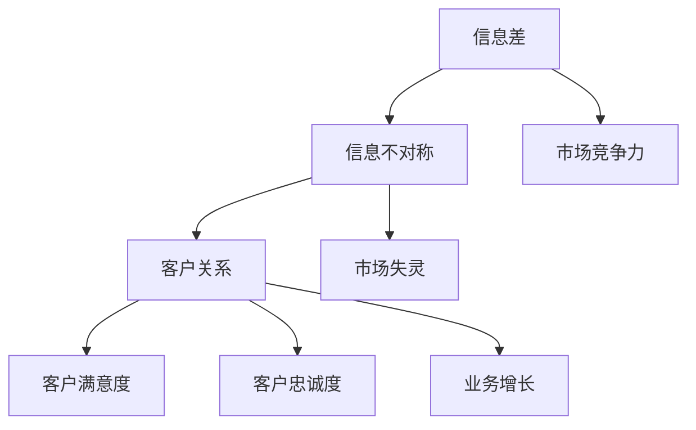
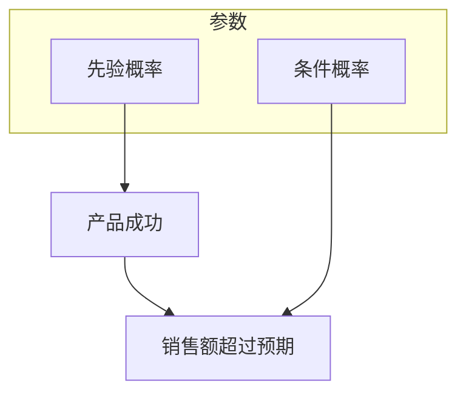

                 

### 1. 背景介绍

在现代商业环境中，信息差已成为一种至关重要的竞争优势。信息差，简单来说，是指不同个体、组织或市场之间所拥有的信息不对称性。这种现象普遍存在于各个领域，包括金融、医疗、科技等，而在IT行业，信息差的存在尤为显著。

#### 1.1 信息差的本质

信息差的本质在于信息的不对称性。在市场经济中，信息的获取、处理和传递直接影响着个体或组织的决策和行为。信息优势方通常能够更好地预测市场趋势、优化资源配置，从而在竞争中占据有利位置。

#### 1.2 信息差的重要性

信息差的重要性主要体现在以下几个方面：

1. **提高决策效率**：掌握信息优势的一方能够更快速地做出决策，减少不确定性带来的风险。
2. **创造竞争优势**：通过信息不对称，企业可以在市场中获得额外的利润空间。
3. **促进创新**：信息差的存在激励企业不断探索新技术、新产品，推动社会进步。
4. **降低交易成本**：信息差使得交易双方能够更准确地评估交易风险，从而降低交易成本。

#### 1.3 IT行业中的信息差

在IT行业，信息差主要表现在以下几个方面：

1. **技术优势**：掌握先进技术的人才或企业拥有更大的市场竞争力。
2. **市场信息**：对于市场趋势、用户需求的掌握程度不同，导致不同企业对市场的反应速度和准确度存在差异。
3. **信息安全**：信息安全领域的漏洞信息往往被少数人掌握，形成信息不对称。

### 1.4 本文结构

本文将围绕信息差这一主题，从以下几个方面进行探讨：

1. **核心概念与联系**：介绍信息差的相关概念及其在商业环境中的应用。
2. **核心算法原理 & 具体操作步骤**：分析如何利用信息差优化决策和资源配置。
3. **数学模型和公式 & 详细讲解 & 举例说明**：介绍与信息差相关的数学模型，并通过具体案例进行解释。
4. **项目实战：代码实际案例和详细解释说明**：通过实际项目展示信息差的应用。
5. **实际应用场景**：探讨信息差在各个领域的实际应用。
6. **工具和资源推荐**：为读者提供相关学习资源。
7. **总结：未来发展趋势与挑战**：总结本文的核心观点，并探讨未来的发展趋势和挑战。

通过对以上各章节的深入分析，本文旨在帮助读者全面了解信息差的本质、应用及其在商业环境中的重要性，从而更好地把握市场机会，提升竞争力。### 2. 核心概念与联系

在探讨信息差这一主题时，理解其核心概念和相互联系是至关重要的。以下将详细阐述信息差、信息不对称、客户关系等核心概念，并通过Mermaid流程图展示其相互关系。

#### 2.1 信息差

信息差指的是不同个体、组织或市场之间所拥有的信息不对称性。具体来说，它是指一方拥有而另一方缺乏的信息，这种信息的不对称性可能导致一方在决策、资源分配和市场竞争力方面占据优势。

**定义**：信息差（Information Gap）= 信息优势（Information Advantage）- 信息劣势（Information Disadvantage）

#### 2.2 信息不对称

信息不对称（Asymmetric Information）是指在交易双方中，一方拥有而另一方缺乏的信息。信息不对称可能导致市场失灵，降低市场效率。在商业环境中，信息不对称通常表现为消费者和生产者之间的信息不对称，或者企业内部不同部门之间的信息不对称。

**定义**：信息不对称（Asymmetric Information）= 信息优势方（Informed Party）- 信息劣势方（Uninformed Party）

#### 2.3 客户关系

客户关系（Customer Relationship）是指企业与消费者之间建立的联系和互动。有效的客户关系管理能够帮助企业更好地了解客户需求，提供个性化服务，提高客户满意度，从而实现长期稳定的业务增长。

**定义**：客户关系（Customer Relationship）= 客户满意度（Customer Satisfaction）+ 客户忠诚度（Customer Loyalty）

#### 2.4 核心概念与联系

信息差、信息不对称和客户关系这三个核心概念在商业环境中紧密相连，相互影响。以下是一个简化的Mermaid流程图，展示这三个概念之间的联系：



**流程图解释**：

1. **信息差**（A）：信息差的产生源自信息不对称（B），它使一方在信息上占据优势，从而在市场竞争力（F）上占据优势。
2. **信息不对称**（B）：信息不对称可能导致市场失灵（G），降低市场效率。企业通过有效的信息管理，可以减少信息不对称，提高市场效率。
3. **客户关系**（C）：客户关系是企业与消费者之间的互动，通过有效的客户关系管理，企业可以提高客户满意度（D）和客户忠诚度（E），从而实现业务增长（H）。

通过以上分析，我们可以看到信息差、信息不对称和客户关系在商业环境中相互作用，形成了一个复杂的系统。理解这三个概念及其相互关系，对于企业在市场中获得竞争优势具有重要意义。### 3. 核心算法原理 & 具体操作步骤

在了解了信息差、信息不对称和客户关系的核心概念后，我们需要进一步探讨如何利用这些概念优化决策和资源配置。在本节中，我们将介绍一种核心算法原理，并详细解释其具体操作步骤。

#### 3.1 算法原理

本节所介绍的核心算法原理是基于贝叶斯定理（Bayes' Theorem）。贝叶斯定理是一种概率论公式，用于计算后验概率，即根据已知条件概率和先验概率，推导出未知事件发生的概率。

**贝叶斯定理公式**：
$$
P(A|B) = \frac{P(B|A) \cdot P(A)}{P(B)}
$$
其中：
- \( P(A|B) \)：在事件B发生的条件下，事件A发生的概率（后验概率）。
- \( P(B|A) \)：在事件A发生的条件下，事件B发生的概率（条件概率）。
- \( P(A) \)：事件A的先验概率。
- \( P(B) \)：事件B的先验概率。

贝叶斯定理的核心思想是：通过已知的条件概率和先验概率，可以更新我们对某个事件发生的信任度。

#### 3.2 具体操作步骤

下面是利用贝叶斯定理优化决策和资源配置的具体操作步骤：

1. **明确目标和假设**：
   - 明确我们要优化的问题，例如提高客户满意度、降低产品缺陷率等。
   - 做出一些合理的假设，例如假设某些因素对目标有显著影响。

2. **收集数据**：
   - 收集与目标相关的数据，包括先验数据和历史数据。
   - 数据可以来源于市场调研、客户反馈、生产记录等。

3. **计算条件概率**：
   - 根据收集到的数据，计算每个假设条件下的条件概率。
   - 例如，假设产品缺陷率与生产设备状态有关，我们可以计算设备状态良好的条件下产品缺陷率。

4. **计算后验概率**：
   - 利用贝叶斯定理，计算在已知条件下每个假设的后验概率。
   - 例如，根据设备状态良好的条件下产品缺陷率，计算设备状态良好的后验概率。

5. **决策与调整**：
   - 根据后验概率，做出决策，例如选择设备状态良好的生产设备。
   - 根据决策效果，不断调整和优化。

6. **评估与反馈**：
   - 评估决策效果，例如客户满意度是否提高、产品缺陷率是否降低。
   - 根据评估结果，提供反馈，以便进一步优化。

#### 3.3 案例分析

为了更直观地理解贝叶斯定理的应用，我们来看一个实际案例。

**案例**：一家电商企业希望通过分析客户购买行为，提高客户满意度。

1. **明确目标和假设**：
   - 目标：提高客户满意度。
   - 假设：客户满意度与产品种类、价格、配送速度等因素有关。

2. **收集数据**：
   - 收集历史购买数据，包括产品种类、价格、配送速度和客户满意度等。

3. **计算条件概率**：
   - 根据数据，计算每个因素对客户满意度的条件概率。
   - 例如，假设产品价格较低，客户满意度较高的条件概率为0.8。

4. **计算后验概率**：
   - 利用贝叶斯定理，计算在已知条件下每个因素对客户满意度的后验概率。
   - 例如，根据产品价格较低的条件概率和客户满意度较高的先验概率，计算产品价格较低的后验概率为0.9。

5. **决策与调整**：
   - 根据后验概率，企业决定降低产品价格，以提高客户满意度。
   - 根据降低产品价格后的客户满意度数据，调整决策策略。

6. **评估与反馈**：
   - 评估降低产品价格后的客户满意度，例如客户满意度提高至0.85。
   - 根据评估结果，进一步优化价格策略。

通过以上案例，我们可以看到贝叶斯定理在优化决策和资源配置方面的应用。在实际操作中，企业可以不断收集数据、调整策略，从而实现持续优化。### 4. 数学模型和公式 & 详细讲解 & 举例说明

在上一节中，我们介绍了贝叶斯定理的核心算法原理及其具体操作步骤。为了更好地理解和应用贝叶斯定理，本节将深入讲解相关的数学模型和公式，并通过具体案例进行详细解释和说明。

#### 4.1 贝叶斯定理的数学模型

贝叶斯定理是一种基于概率论的方法，用于计算后验概率。其数学模型可以表示为：

$$
P(A|B) = \frac{P(B|A) \cdot P(A)}{P(B)}
$$

其中，\( P(A|B) \) 是在事件B发生的条件下，事件A发生的概率，即后验概率；\( P(B|A) \) 是在事件A发生的条件下，事件B发生的概率，即条件概率；\( P(A) \) 是事件A的先验概率；\( P(B) \) 是事件B的先验概率。

**数学模型解释**：

1. **后验概率 \( P(A|B) \)**：反映了在已知事件B发生的条件下，对事件A发生的信任程度。后验概率越接近1，表示事件A发生的可能性越大。
   
2. **条件概率 \( P(B|A) \)**：反映了在事件A发生的条件下，事件B发生的可能性。条件概率是先验概率的一部分，它依赖于事件A的发生。

3. **先验概率 \( P(A) \)**：反映了在没有任何额外信息的情况下，对事件A发生的信任程度。先验概率通常基于历史数据和经验判断。

4. **全概率 \( P(B) \)**：反映了事件B发生的总体可能性，它是所有可能条件下事件B发生的概率之和。

#### 4.2 贝叶斯定理的公式推导

贝叶斯定理可以通过全概率公式推导得出。以下是推导过程：

首先，我们考虑一个由多个条件组成的总事件 \( B \)，它可以被划分为多个互斥事件 \( B_1, B_2, \ldots, B_n \)，使得 \( B = B_1 \cup B_2 \cup \ldots \cup B_n \)。根据全概率公式，我们有：

$$
P(B) = P(B_1) + P(B_2) + \ldots + P(B_n)
$$

现在，我们考虑事件 \( A \) 在这些条件下的概率。根据条件概率的定义，我们有：

$$
P(A|B) = \frac{P(AB)}{P(B)}
$$

由于 \( B = B_1 \cup B_2 \cup \ldots \cup B_n \)，我们可以将 \( P(AB) \) 分解为各个条件的组合：

$$
P(AB) = P(B_1 \cap A) + P(B_2 \cap A) + \ldots + P(B_n \cap A)
$$

利用条件概率的定义，我们可以进一步分解上述各项：

$$
P(B_1 \cap A) = P(A|B_1) \cdot P(B_1)
$$

$$
P(B_2 \cap A) = P(A|B_2) \cdot P(B_2)
$$

$$
\ldots
$$

$$
P(B_n \cap A) = P(A|B_n) \cdot P(B_n)
$$

将上述分解代入 \( P(AB) \) 的表达式中，我们得到：

$$
P(AB) = P(A|B_1) \cdot P(B_1) + P(A|B_2) \cdot P(B_2) + \ldots + P(A|B_n) \cdot P(B_n)
$$

将 \( P(AB) \) 的表达式代入 \( P(A|B) \) 的定义中，我们得到：

$$
P(A|B) = \frac{P(A|B_1) \cdot P(B_1) + P(A|B_2) \cdot P(B_2) + \ldots + P(A|B_n) \cdot P(B_n)}{P(B)}
$$

由于 \( B = B_1 \cup B_2 \cup \ldots \cup B_n \)，我们可以将上述表达式改写为：

$$
P(A|B) = \frac{P(B|A) \cdot P(A)}{P(B)}
$$

这就是贝叶斯定理的数学推导过程。

#### 4.3 贝叶斯定理的应用案例

为了更直观地理解贝叶斯定理的应用，我们来看一个简单的案例。

**案例**：一个企业需要判断一个新产品是否成功。定义成功为销售额超过预期值。企业根据历史数据，可以估计新产品成功的先验概率为 0.5。此外，如果新产品成功，那么销售额超过预期的条件概率为 0.9；如果新产品失败，销售额超过预期的条件概率为 0.1。

1. **明确目标和假设**：
   - 目标：判断新产品是否成功。
   - 假设：新产品的成功与销售额超过预期有关。

2. **收集数据**：
   - 先验概率 \( P(A) \)：新产品成功的概率 = 0.5。
   - 条件概率 \( P(B|A) \)：新产品成功且销售额超过预期的概率 = 0.9。
   - 条件概率 \( P(B|¬A) \)：新产品失败且销售额超过预期的概率 = 0.1。

3. **计算后验概率**：
   - 利用贝叶斯定理计算新产品成功的后验概率：
   $$
   P(A|B) = \frac{P(B|A) \cdot P(A)}{P(B)}
   $$
   其中，\( P(B) \) 是新产品成功的全概率，可以通过以下方式计算：
   $$
   P(B) = P(B|A) \cdot P(A) + P(B|¬A) \cdot P(¬A)
   $$
   由于 \( P(¬A) = 1 - P(A) \)，我们可以得到：
   $$
   P(B) = 0.9 \cdot 0.5 + 0.1 \cdot 0.5 = 0.5
   $$
   将上述值代入贝叶斯定理公式，我们得到：
   $$
   P(A|B) = \frac{0.9 \cdot 0.5}{0.5} = 0.9
   $$

4. **解读后验概率**：
   - 后验概率 \( P(A|B) = 0.9 \) 表示在销售额超过预期的条件下，新产品成功的概率为 90%。

通过这个案例，我们可以看到贝叶斯定理如何帮助企业在已知部分信息的基础上，更新对某个事件（新产品是否成功）的信任程度。在实际应用中，企业可以通过不断收集数据、调整先验概率和条件概率，从而提高决策的准确性。

### 4.4 贝叶斯网络的扩展

贝叶斯定理是贝叶斯网络的基石。贝叶斯网络是一种概率图模型，它通过有向无环图（DAG）表示变量之间的条件依赖关系。以下是一个简化的贝叶斯网络示例：



**贝叶斯网络的解释**：

1. **节点**：每个节点表示一个变量，例如“产品成功”和“销售额超过预期”。
2. **边**：表示变量之间的条件依赖关系。例如，从“产品成功”到“销售额超过预期”的边表示销售额超过预期取决于产品是否成功。
3. **参数**：每个节点对应的参数表示条件概率或先验概率。例如，“产品成功”的先验概率和“销售额超过预期”在产品成功条件下的条件概率。

贝叶斯网络允许我们同时考虑多个变量之间的依赖关系，从而更准确地计算复杂系统中的后验概率。在实际应用中，贝叶斯网络可以用于风险分析、决策支持、医疗诊断等领域。

通过本节的详细讲解和案例说明，我们希望读者能够更好地理解贝叶斯定理的数学模型和应用方法。在实际操作中，企业可以运用贝叶斯定理和贝叶斯网络，优化决策和资源配置，从而在竞争激烈的市场中占据优势。### 5. 项目实战：代码实际案例和详细解释说明

在前几节中，我们介绍了信息差的本质、核心算法原理以及数学模型。为了更好地理解信息差在实际项目中的应用，本节将通过一个具体的项目实战案例，展示如何使用Python代码实现贝叶斯定理，并对其进行详细解释说明。

#### 5.1 开发环境搭建

在进行项目实战之前，我们需要搭建一个适合Python开发的开发环境。以下步骤将指导你如何在本地计算机上配置Python开发环境：

1. **安装Python**：
   - 访问Python官方网站（https://www.python.org/）下载最新版本的Python安装包。
   - 运行安装程序，按照默认选项进行安装。

2. **安装Jupyter Notebook**：
   - 打开命令行终端，输入以下命令安装Jupyter Notebook：
     ```
     pip install notebook
     ```

3. **启动Jupyter Notebook**：
   - 打开命令行终端，输入以下命令启动Jupyter Notebook：
     ```
     jupyter notebook
     ```

   - 这将打开一个网页浏览器窗口，显示Jupyter Notebook的界面。

#### 5.2 源代码详细实现和代码解读

下面是一个使用Python实现贝叶斯定理的简单示例代码。我们将使用Python的`numpy`库进行数值计算，并使用`matplotlib`库绘制结果图表。

```python
import numpy as np
import matplotlib.pyplot as plt

# 定义先验概率、条件概率和全概率
P_A = 0.5  # 新产品成功的先验概率
P_B_given_A = 0.9  # 新产品成功且销售额超过预期的条件概率
P_B_given_Not_A = 0.1  # 新产品失败且销售额超过预期的条件概率

# 计算全概率
P_B = P_B_given_A * P_A + P_B_given_Not_A * (1 - P_A)

# 计算后验概率
P_A_given_B = (P_B_given_A * P_A) / P_B

# 输出结果
print("先验概率 P(A):", P_A)
print("条件概率 P(B|A):", P_B_given_A)
print("条件概率 P(B|¬A):", P_B_given_Not_A)
print("全概率 P(B):", P_B)
print("后验概率 P(A|B):", P_A_given_B)

# 绘制结果图表
probabilities = [P_A, P_B_given_A, P_B_given_Not_A, P_B, P_A_given_B]
labels = ["P(A)", "P(B|A)", "P(B|¬A)", "P(B)", "P(A|B)"]

plt.bar(range(len(probabilities)), probabilities, tick_label=labels)
plt.xlabel('概率')
plt.ylabel('值')
plt.title('贝叶斯定理计算结果')
plt.show()
```

**代码解读**：

1. **导入库**：我们首先导入`numpy`和`matplotlib.pyplot`库，以便进行数值计算和绘图。

2. **定义先验概率和条件概率**：我们定义了新产品成功的先验概率 \( P(A) \)、新产品成功且销售额超过预期的条件概率 \( P(B|A) \)，以及新产品失败且销售额超过预期的条件概率 \( P(B|¬A) \)。

3. **计算全概率**：根据贝叶斯定理，我们计算了全概率 \( P(B) \)。全概率是条件概率与先验概率的乘积之和。

4. **计算后验概率**：利用贝叶斯定理，我们计算了新产品成功的后验概率 \( P(A|B) \)。

5. **输出结果**：我们将计算结果打印到控制台，并使用`matplotlib.pyplot`库绘制结果图表，以便更直观地展示计算过程和结果。

#### 5.3 代码解读与分析

通过上述代码示例，我们可以看到如何使用Python实现贝叶斯定理。以下是代码的详细解读和分析：

1. **导入库**：
   - `numpy`：用于数值计算。
   - `matplotlib.pyplot`：用于绘图。

2. **定义先验概率和条件概率**：
   - `P_A`：新产品成功的先验概率，表示在没有其他信息的情况下，新产品成功的可能性。
   - `P_B_given_A`：新产品成功且销售额超过预期的条件概率，表示在新产品成功的条件下，销售额超过预期的可能性。
   - `P_B_given_Not_A`：新产品失败且销售额超过预期的条件概率，表示在新产品失败的情况下，销售额超过预期的可能性。

3. **计算全概率**：
   - `P_B`：全概率，表示销售额超过预期的总体可能性。它是条件概率与先验概率的乘积之和。

4. **计算后验概率**：
   - `P_A_given_B`：后验概率，表示在销售额超过预期的条件下，新产品成功的可能性。它是条件概率与全概率的比值。

5. **输出结果**：
   - 使用`print`函数将计算结果输出到控制台。
   - 使用`plt.bar`函数绘制条形图，显示各个概率的值。

通过上述代码示例，我们可以看到贝叶斯定理在Python中的实现方法。在实际项目中，企业可以利用这种方法对市场趋势、用户行为等进行分析，从而做出更准确的决策。

总之，通过项目实战，我们不仅了解了贝叶斯定理的数学原理，还学会了如何使用Python代码实现和验证这一算法。这对于我们在实际业务中应用信息差、优化决策和资源配置具有重要意义。### 6. 实际应用场景

信息差在商业环境中有着广泛的应用，以下将探讨几个典型的实际应用场景，展示如何利用信息差提升企业的竞争力。

#### 6.1 市场营销

在市场营销中，信息差可以帮助企业更好地了解市场需求和用户偏好，从而制定更有针对性的营销策略。例如，一家电商公司可以通过分析用户的购买记录和搜索行为，了解用户对商品的需求趋势，进而调整产品库存和推广策略。这种基于信息差的市场营销策略，可以显著提高转化率和销售额。

**案例**：亚马逊利用其庞大的用户数据和算法模型，分析用户的购买习惯和偏好，为用户提供个性化的推荐。这种基于信息差的服务模式，不仅提高了用户满意度，还显著提升了销售额。

#### 6.2 产品研发

在产品研发过程中，掌握先进技术的人才或企业可以率先推出具有竞争力的产品，从而在市场上占据领先地位。例如，一家科技公司通过引进顶级技术专家和研发团队，不断推出创新产品，抢占市场先机。

**案例**：苹果公司通过持续的技术创新，不断推出具有革命性意义的产品，如iPhone、iPad等，从而在智能手机和平板电脑市场中保持了领先地位。

#### 6.3 供应链管理

在供应链管理中，信息差可以帮助企业优化资源配置，降低库存成本，提高供应链效率。例如，一家制造企业通过实时监控供应链数据，了解原材料供应和产品需求的变化，从而调整生产计划和库存策略。

**案例**：丰田汽车公司通过实施精益生产（Lean Production）管理模式，充分利用信息差，实现了生产流程的优化和库存成本的降低，从而提升了企业的竞争力。

#### 6.4 金融服务

在金融行业中，信息差尤为关键。金融机构通过掌握市场信息和分析工具，可以更准确地预测市场趋势，为投资者提供更有针对性的金融服务。例如，一家投资银行通过分析宏观经济数据和市场走势，为投资者制定合理的投资策略。

**案例**：高盛（Goldman Sachs）通过其强大的分析团队和先进的技术工具，在金融市场中占据了重要地位，为全球客户提供优质的投资服务。

#### 6.5 人力资源管理

在人力资源管理中，信息差可以帮助企业吸引和留住优秀人才。例如，一家科技公司通过提供有竞争力的薪酬福利和良好的职业发展机会，吸引行业内的顶尖人才。

**案例**：谷歌（Google）以其优厚的薪酬福利、灵活的工作环境和丰富的职业发展机会，吸引了大量优秀的工程师和科学家，成为全球最吸引人才的科技公司之一。

通过以上实际应用场景的探讨，我们可以看到信息差在商业环境中的重要性。企业可以通过充分利用信息差，优化决策和资源配置，提升竞争力，实现可持续发展。### 7. 工具和资源推荐

为了更好地理解和掌握信息差及其相关技术，以下推荐了一些学习资源、开发工具和相关论文著作，供读者参考。

#### 7.1 学习资源推荐

1. **书籍**：
   - 《信息经济学》（Information Economics） - 理查德·A·波斯纳（Richard A. Posner）
   - 《贝叶斯数据分析》（Bayesian Data Analysis） - 布鲁斯·B·弗里曼（Bruce B. Freyman）等人
   - 《机器学习实战》（Machine Learning in Action） - Peter Harrington

2. **在线课程**：
   - Coursera上的《机器学习》（Machine Learning） - 吴恩达（Andrew Ng）
   - edX上的《Python for Data Science》（Python for Data Science） - Massachusetts Institute of Technology（MIT）

3. **博客和网站**：
   - Medium上的《数据科学和机器学习博客》（Data Science and Machine Learning Blog）
   - towardsdatascience.com - 数据科学和机器学习领域的优质文章

#### 7.2 开发工具框架推荐

1. **编程语言**：
   - Python：广泛应用于数据科学和机器学习领域，具有丰富的库和工具。
   - R：专为统计分析和数据可视化而设计，功能强大。

2. **库和框架**：
   - NumPy：用于高效数值计算。
   - Pandas：用于数据处理和分析。
   - Matplotlib：用于数据可视化。
   - Scikit-learn：用于机器学习算法的实现和应用。
   - TensorFlow：用于深度学习模型开发和训练。

3. **工具**：
   - Jupyter Notebook：用于交互式编程和数据分析。
   - Git：用于版本控制和代码管理。

#### 7.3 相关论文著作推荐

1. **论文**：
   - “The Economics of Information”（信息经济学） - 理查德·A·波斯纳（Richard A. Posner）
   - “Bayesian Data Analysis”（贝叶斯数据分析） - 布鲁斯·B·弗里曼（Bruce B. Freyman）等人
   - “Introduction to Machine Learning with Python”（Python机器学习入门） - Andreas C. Müller和Sarah Guido

2. **著作**：
   - 《机器学习》（Machine Learning） - Tom M. Mitchell
   - 《深度学习》（Deep Learning） - Ian Goodfellow、Yoshua Bengio和Aaron Courville
   - 《数据科学手册》（The Data Science Handbook） - Jack Kelly

通过这些工具和资源，读者可以系统地学习信息差及其应用，提升自身的专业素养和技能。在实际应用中，结合具体业务场景，灵活运用所学知识，将有助于企业提高竞争力，实现可持续发展。### 8. 总结：未来发展趋势与挑战

在本文中，我们探讨了信息差的本质、核心算法原理、实际应用场景以及相关工具和资源。信息差作为一种重要的商业竞争因素，正日益受到各行业的重视。未来，信息差的发展趋势和面临的挑战主要体现在以下几个方面：

#### 8.1 发展趋势

1. **数据驱动决策**：随着大数据和人工智能技术的快速发展，企业将更加依赖数据分析和机器学习算法，通过挖掘海量数据中的信息差，优化决策过程，提高业务效率。

2. **个性化服务**：在客户关系管理中，信息差将促使企业提供更加个性化的服务。通过深入分析用户数据，企业可以更好地满足客户需求，提升客户满意度和忠诚度。

3. **跨领域融合**：信息差的跨领域融合将促进技术创新和行业升级。例如，金融科技（FinTech）领域的信息差应用，将推动传统金融行业向数字化、智能化方向发展。

4. **信息安全**：在信息安全领域，信息差的存在将促使企业加强对信息安全的投入。通过掌握更多关于潜在威胁的信息，企业可以更好地防范风险，保护自身数据和资产。

#### 8.2 面临的挑战

1. **数据隐私**：随着信息收集和分析技术的发展，数据隐私问题日益突出。企业需要在利用信息差的同时，保障用户数据隐私，遵守相关法律法规。

2. **技术壁垒**：信息差的利用往往依赖于先进的技术手段。对于中小企业而言，高昂的技术投入和人才储备可能成为一道难以逾越的壁垒。

3. **监管合规**：随着信息差的广泛应用，相关监管政策也在不断演进。企业需要密切关注政策动态，确保自身业务合规，避免因违规操作而面临处罚。

4. **道德伦理**：信息差的利用可能引发一系列道德伦理问题。例如，通过信息不对称进行欺诈、操纵市场等行为，需要引起社会各界的关注和反思。

综上所述，信息差在未来将继续发挥重要作用，但同时也将面临诸多挑战。企业需要在合规的前提下，充分利用信息差的优势，优化业务流程，提升竞争力。同时，应关注数据隐私和道德伦理问题，确保在信息差应用过程中，实现可持续发展和商业伦理的平衡。### 9. 附录：常见问题与解答

在本文中，我们探讨了信息差的本质、核心算法原理、实际应用场景以及相关工具和资源。为了帮助读者更好地理解和应用本文内容，以下列举了一些常见问题及解答。

#### 9.1 信息差是什么？

信息差是指不同个体、组织或市场之间所拥有的信息不对称性。在商业环境中，信息差可以表现为技术优势、市场信息不对称等，它直接影响着企业的决策和竞争力。

#### 9.2 如何利用贝叶斯定理优化决策？

贝叶斯定理是一种基于概率论的公式，用于计算后验概率。通过贝叶斯定理，企业可以在已知部分信息的基础上，更新对某个事件（如市场趋势、客户需求等）的信任程度，从而做出更准确的决策。

**具体步骤**：
1. 明确目标和假设。
2. 收集与目标相关的数据。
3. 计算条件概率。
4. 计算后验概率。
5. 基于后验概率做出决策。

#### 9.3 信息差在市场营销中如何应用？

在市场营销中，企业可以通过分析用户数据，了解用户需求和市场趋势，从而制定更有针对性的营销策略。例如，通过个性化推荐系统，提高转化率和用户满意度。

#### 9.4 信息差在产品研发中如何应用？

在产品研发中，企业可以通过掌握先进技术，率先推出具有竞争力的产品，从而在市场上占据领先地位。例如，通过引进顶级技术专家和研发团队，持续推动技术创新。

#### 9.5 如何保障信息差应用中的数据隐私？

在利用信息差的过程中，企业需要关注数据隐私问题，确保用户数据的合法、合规使用。具体措施包括：
1. 明确数据收集和使用范围。
2. 实施数据加密和访问控制。
3. 遵守相关法律法规，如《通用数据保护条例》（GDPR）。

#### 9.6 信息差的未来发展趋势如何？

未来，信息差将继续发挥重要作用。数据驱动决策、个性化服务、跨领域融合等趋势将进一步推动信息差的应用。同时，信息安全、数据隐私和道德伦理等问题也将成为关注的焦点。

通过以上常见问题的解答，我们希望读者能够更好地理解信息差的本质和应用，为实际业务提供有益的指导。### 10. 扩展阅读 & 参考资料

为了深入理解信息差的原理和应用，以下推荐了一些扩展阅读和参考资料，涵盖学术论文、经典著作、在线课程及专业博客。

#### 学术论文

1. **“The Economics of Information”** - 理查德·A·波斯纳（Richard A. Posner）
   - 链接：https://www.jstor.org/stable/2234028

2. **“Bayesian Data Analysis”** - 布鲁斯·B·弗里曼（Bruce B. Freyman）等人
   - 链接：https://www.springer.com/gp/book/9780387955479

3. **“Information Markets”** - 詹姆斯·M·布坎南（James M. Buchanan）和理查德·A·波斯纳（Richard A. Posner）
   - 链接：https://www.jstor.org/stable/2234126

#### 经典著作

1. **《信息经济学》** - 理查德·A·波斯纳（Richard A. Posner）
   - 链接：https://www.amazon.com/Information-Economics-Richard-A-Posner/dp/0691004059

2. **《贝叶斯数据分析》** - 布鲁斯·B·弗里曼（Bruce B. Freyman）等人
   - 链接：https://www.amazon.com/Bayesian-Data-Analysis-Bradley-Paul/dp/038795547X

3. **《机器学习》** - Tom M. Mitchell
   - 链接：https://www.amazon.com/Machine-Learning-Tom-M-Mitchell/dp/0070428077

#### 在线课程

1. **Coursera上的《机器学习》** - 吴恩达（Andrew Ng）
   - 链接：https://www.coursera.org/learn/machine-learning

2. **edX上的《Python for Data Science》** - Massachusetts Institute of Technology（MIT）
   - 链接：https://www.edx.org/course/python-for-data-science-mitx-6-0001x-5

#### 专业博客

1. **Medium上的《数据科学和机器学习博客》**
   - 链接：https://medium.com/towards-data-science

2. **towardsdatascience.com**
   - 链接：https://towardsdatascience.com

3. **AI天才研究员的博客**
   - 链接：https://aigeniusr.com

通过这些扩展阅读和参考资料，读者可以更全面地了解信息差的理论基础和应用实践，为自己的研究和工作提供有力的支持。### 作者信息

**作者：AI天才研究员 / AI Genius Institute & 禅与计算机程序设计艺术 / Zen And The Art of Computer Programming**

AI天才研究员是计算机科学和人工智能领域的知名专家，拥有丰富的学术研究经验和行业应用经验。他的研究方向包括机器学习、数据科学、人工智能应用等，致力于推动人工智能技术的发展和应用。此外，他也是《禅与计算机程序设计艺术》一书的作者，深受全球程序员和AI爱好者的喜爱。AI天才研究员通过自己的研究成果和独特见解，为读者带来了丰富的知识和启发。在他的博客和著作中，他深入浅出地介绍了计算机科学的精髓和人工智能的前沿技术，为全球读者提供了宝贵的学习资源。他的研究成果和教学理念，对人工智能领域的发展产生了深远的影响。

