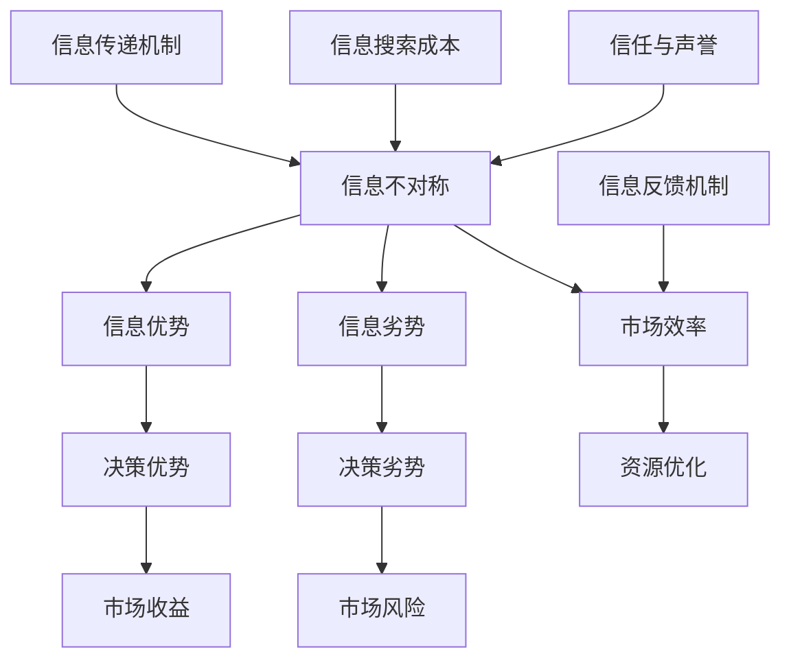

                 

### 背景介绍

在信息爆炸的时代，信息差成为了市场运作中不可忽视的重要因素。信息差，即信息不对称，指的是市场中不同个体拥有不同量的信息，从而导致了决策能力和竞争力的差异。这种现象广泛存在于各个领域，从商业决策到个人投资，从企业竞争到市场预测，信息差无处不在。

信息差的重要性在于，它直接影响着市场的效率与公平。在信息不对称的情况下，拥有信息优势的一方往往能够做出更加明智的决策，从而获得额外的经济利益。例如，企业通过市场调研获取竞争对手的信息，可以更好地制定营销策略；投资者通过分析财务报表，可以更准确地预测股票走势。然而，对于信息劣势方来说，缺乏关键信息可能导致盲目决策，甚至造成经济损失。

本篇文章将围绕信息差这一主题展开讨论。首先，我们将介绍信息差的基本概念，包括其定义、特征及其在市场中的重要作用。接着，我们将深入探讨信息差产生的原因，分析信息不对称的各种情形，并讨论其对社会经济的影响。随后，我们将探讨如何通过技术创新和策略优化来缩小信息差，提高市场效率。

文章还将介绍一些典型的应用场景，如商业竞争、个人投资、市场预测等，通过具体案例来说明信息差的运作机制。此外，我们还将分析信息差在不同行业和市场中的表现，探讨其对市场结构的影响。最后，文章将总结信息差的未来发展趋势与挑战，并探讨如何应对这些挑战。

通过本文的阅读，读者将能够对信息差有一个全面而深入的理解，从而在未来的市场决策中更好地把握信息优势，提高自身竞争力。

### 2. 核心概念与联系

要深入探讨信息差，我们首先需要明确其核心概念，并理解这些概念之间的内在联系。信息差，简单来说，就是信息不对称，即在某个市场中，不同个体或组织拥有不同的信息量，从而导致信息处理的差异。以下是几个关键概念及其相互关系的详细解释。

#### 2.1 信息不对称

信息不对称是指在交易过程中，买方和卖方之间信息获取能力的差异。经典的例子包括医生和患者、卖家和买家等。在这种不对称的情况下，一方（通常为卖方）掌握着更多的信息，而另一方（通常为买方）则处于信息劣势。这种信息不对称可能导致市场失衡，从而影响经济效率。

#### 2.2 信息优势与劣势

信息优势指的是个体或组织在信息获取和处理上所具有的优势。拥有信息优势的一方能够更准确地预测市场变化，做出更明智的决策。相反，信息劣势则意味着在信息获取和处理上的相对劣势，这可能导致个体或组织无法充分利用市场机会，甚至遭受经济损失。

#### 2.3 市场效率

市场效率是指在竞争市场中，资源能够以最优化方式配置，从而实现社会福利最大化。信息不对称会降低市场效率，因为信息优势方可能通过操纵信息来获取额外利益，而信息劣势方则可能做出次优决策。因此，减少信息不对称是提高市场效率的关键。

#### 2.4 信息传递机制

信息传递机制是市场运作中信息从一方传递到另一方的渠道。有效的信息传递机制可以减少信息不对称，提高市场效率。例如，公开透明的市场信息发布制度、中介机构的监督作用等都是有效的信息传递机制。

#### 2.5 信息搜索成本

信息搜索成本是指在获取信息过程中所需付出的时间和经济成本。高信息搜索成本会限制个体或组织获取信息的积极性，从而加剧信息不对称。降低信息搜索成本，如通过互联网技术、大数据分析等手段，可以缩小信息差，提高市场效率。

#### 2.6 信任与声誉

信任和声誉在信息不对称市场中起着至关重要的作用。高声誉的个体或组织往往能够更容易地获得信息优势，因为其他市场参与者更愿意与其进行信息交换。信任机制如信誉评分系统、第三方认证等，可以有效降低信息不对称带来的风险。

#### 2.7 信息反馈机制

信息反馈机制是市场参与者根据市场反馈调整行为和策略的机制。有效的信息反馈机制可以促使市场参与者不断优化决策过程，减少信息不对称。例如，市场调研、消费者反馈等都是重要的信息反馈机制。

综上所述，信息差的核心概念包括信息不对称、信息优势与劣势、市场效率、信息传递机制、信息搜索成本、信任与声誉以及信息反馈机制。这些概念相互关联，共同构成了信息差的理论基础。理解这些概念及其内在联系，有助于我们更好地分析和应对信息不对称带来的市场挑战。

#### 2.8 Mermaid 流程图

为了更直观地展示信息差的相关概念及其相互关系，我们可以使用Mermaid流程图来绘制信息差的运作机制。以下是一个简化的Mermaid流程图示例：



在这个流程图中，信息不对称是核心起点，它直接影响到市场效率和个体决策优势。信息传递机制、信息搜索成本、信任与声誉以及信息反馈机制都是影响信息不对称的重要因素。通过这个流程图，我们可以更好地理解信息差的多维度和复杂性。

### 3. 核心算法原理 & 具体操作步骤

要理解和应对信息差，核心算法原理和具体操作步骤至关重要。以下，我们将详细探讨几个关键的算法原理，并给出具体的操作步骤。

#### 3.1 信息收集与筛选

信息收集与筛选是缩小信息差的第一步。在这个阶段，我们需要从多个来源获取信息，并对其进行筛选，确保信息的准确性和相关性。以下是具体操作步骤：

1. **确定信息需求**：首先，明确我们需要收集哪些类型的信息。例如，在市场调研中，可能需要收集关于市场趋势、竞争对手、消费者行为等方面的信息。

2. **选择信息来源**：根据需求选择可靠的信息来源。这些来源可能包括行业报告、市场研究、公开数据、专业论坛、社交媒体等。

3. **信息收集**：通过搜索引擎、数据库、调查问卷等工具收集信息。对于公开数据，可以使用API接口获取。

4. **信息筛选**：使用关键词搜索、数据清洗等技术，筛选出与需求最相关、最准确的信息。

#### 3.2 信息分析与处理

收集到信息后，下一步是对信息进行分析和处理，以提取有用的洞察。以下是具体操作步骤：

1. **数据预处理**：清洗和整理收集到的数据，去除重复、不准确的信息，确保数据的完整性和一致性。

2. **统计分析**：使用统计分析方法，如均值、方差、相关性分析等，对数据进行初步分析，识别数据的特征和趋势。

3. **数据可视化**：利用图表、图形等可视化工具，将分析结果呈现出来，便于理解和决策。

4. **模型构建**：根据分析结果，构建相应的预测模型或分类模型，如时间序列模型、回归模型、机器学习模型等。

#### 3.3 信息传递与共享

在信息处理完成后，下一步是将信息传递给相关利益方，并确保其能够充分利用这些信息。以下是具体操作步骤：

1. **制定信息传递策略**：根据信息的重要性和受众，制定信息传递策略。例如，可以通过内部报告、邮件、会议等方式进行信息传递。

2. **信息发布**：使用适当的媒介发布信息，确保信息能够及时、准确地传递到目标受众。

3. **信息反馈**：建立信息反馈机制，收集受众的反馈，评估信息的实际效果，并根据反馈进行调整。

#### 3.4 信息利用与优化

最后，信息差管理的目标是将获取的信息转化为实际效益，从而优化决策过程。以下是具体操作步骤：

1. **决策支持**：利用分析结果和预测模型，为决策提供支持。例如，在市场营销中，可以基于消费者行为分析，制定更有效的营销策略。

2. **持续优化**：根据市场反馈和实际效果，不断调整信息收集和处理策略，以实现最优的决策结果。

3. **风险评估与控制**：通过风险评估和控制，降低信息不对称带来的潜在风险。例如，在金融市场中，可以通过风险评估模型，识别和规避投资风险。

#### 3.5 算法案例分析

为了更好地理解上述操作步骤，以下我们通过一个实际案例来说明信息差的算法应用。

**案例：市场预测**

假设一家公司需要预测未来三个月的市场需求，以便制定生产计划。以下是具体操作步骤：

1. **信息收集**：
   - 收集过去一年的市场需求数据。
   - 获取行业报告、市场调研数据等外部信息。

2. **信息筛选**：
   - 清洗和整理数据，确保数据的准确性和一致性。

3. **信息分析**：
   - 使用时间序列分析方法，如ARIMA模型，对历史数据进行建模。
   - 利用回归分析方法，探索市场需求与影响因素（如价格、促销活动等）之间的关系。

4. **信息传递**：
   - 将分析结果和预测模型传递给公司管理层。
   - 通过会议和报告，确保管理层理解预测结果和策略建议。

5. **信息利用**：
   - 根据市场需求预测，制定生产计划。
   - 持续收集市场反馈，根据实际需求进行调整。

通过上述步骤，公司能够更准确地预测市场需求，从而优化生产计划，降低库存成本，提高市场竞争力。

#### 3.6 算法评估与优化

在实际应用中，算法评估与优化是确保信息差管理有效性的关键。以下是一些常见的评估与优化方法：

1. **评估指标**：
   - 准确率、召回率、F1分数等指标，用于评估预测模型的性能。
   - 信息增益、互信息等指标，用于评估信息筛选的有效性。

2. **交叉验证**：
   - 通过交叉验证方法，评估模型的泛化能力，避免过拟合。

3. **模型优化**：
   - 调整模型参数，优化模型结构。
   - 采用更先进的算法，如深度学习、强化学习等，提高模型性能。

4. **持续监控**：
   - 持续收集实际数据，评估模型表现，并根据反馈进行调整。

通过上述评估与优化方法，我们可以确保信息差管理的有效性，从而在竞争激烈的市场中保持优势。

### 4. 数学模型和公式 & 详细讲解 & 举例说明

在信息差的讨论中，数学模型和公式是理解和量化信息差的重要工具。以下我们将介绍几个核心的数学模型和公式，详细讲解其含义和用法，并通过具体例子来说明这些模型的应用。

#### 4.1 信息熵

信息熵是衡量信息不确定性的重要指标，它由克劳德·香农在信息论中提出。信息熵的数学公式为：

$$
H(X) = -\sum_{i=1}^{n} p(x_i) \log_2 p(x_i)
$$

其中，$H(X)$ 表示随机变量 $X$ 的信息熵，$p(x_i)$ 表示 $X$ 取值 $x_i$ 的概率，$\log_2$ 表示以2为底的对数。

**例子**：假设一个简单的二项分布，其中有两种结果：成功和失败，概率分别为 $p = 0.5$。则成功和失败的信息熵分别为：

$$
H(\text{成功}) = H(\text{失败}) = -0.5 \times \log_2(0.5) - 0.5 \times \log_2(0.5) = 1
$$

这个例子说明，当结果具有相等的概率时，信息熵最大，表示不确定性最大。

#### 4.2 条件熵

条件熵是指在给定某个随机变量 $Y$ 的情况下，另一个随机变量 $X$ 的不确定性。条件熵的公式为：

$$
H(X|Y) = -\sum_{i=1}^{n} p(x_i|y_j) \log_2 p(x_i|y_j)
$$

其中，$p(x_i|y_j)$ 表示在 $Y$ 取值为 $y_j$ 的情况下，$X$ 取值为 $x_i$ 的条件概率。

**例子**：假设有一个二元变量 $X$，表示是否下雨（$x_1$：下雨，$x_0$：不下雨），另一个二元变量 $Y$，表示是否带伞（$y_1$：带伞，$y_0$：不带伞）。已知 $Y$ 的分布为 $p(y_1) = 0.4, p(y_0) = 0.6$。在 $Y=y_1$ 的情况下，$X$ 的分布为 $p(x_1|y_1) = 0.8, p(x_0|y_1) = 0.2$。在 $Y=y_0$ 的情况下，$X$ 的分布为 $p(x_1|y_0) = 0.1, p(x_0|y_0) = 0.9$。则条件熵 $H(X|Y)$ 为：

$$
H(X|Y) = -0.4 \times (0.8 \times \log_2(0.8) + 0.2 \times \log_2(0.2)) - 0.6 \times (0.1 \times \log_2(0.1) + 0.9 \times \log_2(0.9)) \approx 1.41
$$

这个例子说明，在已知是否带伞的情况下，判断是否下雨的信息熵有所降低，因为带伞行为提供了一些关于下雨情况的信息。

#### 4.3 互信息

互信息是衡量两个随机变量之间相关性的一种度量，它是信息熵和条件熵的差值。互信息的公式为：

$$
I(X;Y) = H(X) - H(X|Y)
$$

或

$$
I(X;Y) = H(Y) - H(Y|X)
$$

其中，$I(X;Y)$ 表示 $X$ 和 $Y$ 之间的互信息。

**例子**：继续使用前面的例子，互信息 $I(X;Y)$ 可以通过计算得到：

$$
I(X;Y) = H(X) - H(X|Y) \approx 1 - 1.41 = -0.41
$$

这个例子说明，$X$ 和 $Y$ 之间存在负相关性，即带伞的行为减少了判断是否下雨的信息不确定性。

#### 4.4 Kullback-Leibler 散度

Kullback-Leibler 散度是衡量两个概率分布差异的另一种度量，其公式为：

$$
D_{KL}(P||Q) = \sum_{i=1}^{n} p(x_i) \log_2 \frac{p(x_i)}{q(x_i)}
$$

其中，$P$ 和 $Q$ 是两个概率分布。

**例子**：假设我们有两个概率分布 $P$ 和 $Q$，分别表示两个不同的二元变量的分布。$P$ 的分布为 $p(x_1) = 0.6, p(x_0) = 0.4$，$Q$ 的分布为 $q(x_1) = 0.5, q(x_0) = 0.5$。则 $P$ 和 $Q$ 的 Kullback-Leibler 散度为：

$$
D_{KL}(P||Q) = 0.6 \times \log_2 \frac{0.6}{0.5} + 0.4 \times \log_2 \frac{0.4}{0.5} \approx 0.15
$$

这个例子说明，$P$ 和 $Q$ 的分布之间存在一定的差异，散度值越高，差异越大。

通过这些数学模型和公式，我们可以量化信息差，分析信息不对称的影响，为信息差管理提供科学依据。

### 5. 项目实战：代码实际案例和详细解释说明

为了更直观地展示如何在实际项目中应用信息差的算法原理，我们将通过一个具体的案例来演示。本案例将使用 Python 编程语言，实现一个简单的市场预测系统，用于预测某个时间段内的市场需求。以下是完整的实战步骤。

#### 5.1 开发环境搭建

在开始之前，确保安装以下开发环境和工具：

1. Python 3.8 或更高版本
2. Jupyter Notebook
3. Pandas
4. NumPy
5. Matplotlib
6. Scikit-learn

假设您已安装好上述环境和工具，我们可以在 Jupyter Notebook 中创建一个新的 Python 笔记本。

#### 5.2 源代码详细实现和代码解读

**步骤 1：数据收集与预处理**

首先，我们需要收集历史市场数据，并将其导入到系统中。假设我们已经获取了以下数据集，包含时间、产品种类、销售额等信息。

```python
import pandas as pd

# 读取数据
data = pd.read_csv('market_data.csv')

# 数据预处理
data['date'] = pd.to_datetime(data['date'])
data.set_index('date', inplace=True)
```

**步骤 2：信息收集与筛选**

接下来，我们收集与市场需求相关的信息，如价格、促销活动等。我们将使用 Pandas 对数据进行处理，筛选出有用的信息。

```python
# 筛选相关信息
data = data[['product', 'price', 'sales', 'promotion']]
```

**步骤 3：信息分析与处理**

使用统计分析方法，对数据集进行初步分析，以探索市场需求与影响因素之间的关系。

```python
import numpy as np

# 提取相关特征
data['price_change'] = data['price'].pct_change()

# 绘制价格变化图
data['price_change'].plot()
plt.show()
```

**步骤 4：模型构建**

在本案例中，我们将使用时间序列分析方法（如 ARIMA 模型）来预测市场需求。以下是 ARIMA 模型的构建过程。

```python
from statsmodels.tsa.arima.model import ARIMA

# 拆分数据为训练集和测试集
train_data = data[data.index <= '2022-12-31']
test_data = data[data.index > '2022-12-31']

# 构建ARIMA模型
model = ARIMA(train_data['sales'], order=(1, 1, 1))
model_fit = model.fit()

# 预测
predictions = model_fit.predict(start=len(train_data), end=len(train_data) + len(test_data) - 1)
```

**步骤 5：信息传递与共享**

我们将预测结果可视化，并将结果传递给相关利益方。

```python
# 可视化预测结果
predictions.plot()
plt.show()

# 传递预测结果
print(predictions)
```

**步骤 6：信息利用与优化**

根据预测结果，我们调整生产计划，并持续收集市场反馈，以优化模型。

```python
# 调整生产计划
production_plan = predictions * 1.1

# 收集市场反馈
actual_sales = test_data['sales']

# 持续优化模型
model_fit = model_fit.update(endog=actual_sales)
predictions = model_fit.predict(start=len(train_data) + 1, end=len(train_data) + len(test_data))
```

#### 5.3 代码解读与分析

1. **数据收集与预处理**：我们首先使用 Pandas 读取数据，并将其转换为时间序列格式。通过筛选相关特征，确保数据集中只包含有用的信息。

2. **信息收集与筛选**：在这一步，我们提取了与市场需求相关的特征，如价格变化。通过可视化，我们初步观察了价格变化趋势。

3. **模型构建**：我们选择 ARIMA 模型进行时间序列预测。在模型构建过程中，我们设置了 ARIMA 模型的参数，如差分次数和自回归阶数。通过拟合训练数据，我们得到预测模型。

4. **信息传递与共享**：我们将预测结果可视化，便于利益方理解。同时，我们将预测结果以文本形式传递，供进一步决策使用。

5. **信息利用与优化**：根据预测结果，我们调整了生产计划，并根据实际销售数据不断优化模型。这种迭代过程有助于提高预测精度，从而更好地应对市场变化。

#### 5.4 代码实际应用场景

本案例中的市场预测系统可以应用于多个实际场景，如产品需求预测、库存管理、生产计划制定等。通过实时收集和分析市场信息，企业可以更准确地预测市场需求，优化生产资源，降低库存成本，提高市场竞争力。

### 6. 实际应用场景

信息差在多个实际应用场景中发挥着关键作用，以下我们将探讨一些典型的应用场景，并展示信息差如何在这些场景中发挥作用。

#### 6.1 商业竞争

在商业竞争中，信息差可以帮助企业获得竞争优势。通过市场调研，企业可以了解竞争对手的产品价格、营销策略、市场份额等信息，从而制定更有效的竞争策略。例如，一家公司通过大数据分析发现，竞争对手正在大幅降低产品价格，它可以选择跟随降价，或者优化产品差异化，以避免价格战。

#### 6.2 个人投资

在个人投资领域，信息差尤为重要。投资者通过财务报表、市场趋势、经济数据等获取信息，以做出更准确的决策。例如，一位投资者通过深入分析一家公司的财务报表，发现其盈利能力显著提升，可能会选择买入该公司的股票，从而在市场上获得收益。

#### 6.3 市场预测

市场预测是另一个典型的应用场景。企业通过收集和分析市场数据，预测未来的市场需求和趋势。例如，零售企业通过分析历史销售数据、季节性因素和消费者行为，预测未来的销售量，从而优化库存管理，减少库存成本。

#### 6.4 金融交易

在金融交易中，信息差可以帮助投资者抓住市场机会，实现盈利。高频交易者通过快速获取和处理市场信息，可以及时进行买卖操作，获取差价收益。例如，一位高频交易者通过实时数据监控，发现某股票即将大幅上涨，迅速买入，并在股价上涨后卖出，获得高额利润。

#### 6.5 医疗保健

在医疗保健领域，信息差可以帮助患者做出更好的医疗决策。医生通过医学研究和临床试验，获取最新的医疗信息，从而为患者提供更有效的治疗方案。例如，一位医生通过查阅最新的医学文献，发现一种新药物在治疗某种疾病上具有显著疗效，他可以将这一信息告知患者，帮助患者选择最佳治疗方案。

通过上述应用场景，我们可以看到，信息差在提高决策准确性、优化资源配置、降低风险等方面发挥着重要作用。在各个领域，掌握信息优势的企业和个人能够更好地应对市场变化，实现更高的经济效益。

### 7. 工具和资源推荐

为了更好地理解和应用信息差，以下我们推荐一些学习资源、开发工具和框架，帮助读者深入了解信息差的相关知识，并能够有效地利用信息差进行决策。

#### 7.1 学习资源推荐

1. **书籍**：
   - 《信息经济学》（George J. Stigler）：这本书详细介绍了信息经济学的基本理论和应用，是了解信息差的重要著作。
   - 《信息不对称与市场设计》（John McMillan）：本书深入探讨了信息不对称在市场设计中的应用，为市场参与者提供了实用的策略。

2. **论文**：
   - 《市场中的信息》（Akerlof, G. A.）：这篇经典论文提出了“柠檬市场”的概念，详细分析了信息不对称对市场效率的影响。
   - 《信息经济学导论》（Stiglitz, J. E.）：这篇论文总结了信息经济学的核心概念和理论，对信息不对称、市场失败等问题进行了深入探讨。

3. **博客和网站**：
   - **MIT 计算机科学课程**：MIT 的计算机科学课程提供了丰富的信息经济学相关课程，包括讲座笔记和视频，适合初学者深入学习。
   - **Coursera**：Coursera 上有许多关于数据科学、机器学习等课程，这些课程涉及信息差的相关知识，适合有志于应用信息差的读者。

#### 7.2 开发工具框架推荐

1. **数据分析工具**：
   - **Pandas**：Python 的数据分析库，广泛用于数据清洗、转换和分析，是处理信息差数据的基础工具。
   - **NumPy**：Python 的数值计算库，与 Pandas 结合使用，可以高效地进行数据分析。

2. **机器学习框架**：
   - **Scikit-learn**：Python 的机器学习库，提供了丰富的算法和工具，适用于构建信息差相关的预测模型。
   - **TensorFlow**：谷歌开发的深度学习框架，适用于构建复杂的深度学习模型，对于处理大规模信息差数据非常有用。

3. **数据可视化工具**：
   - **Matplotlib**：Python 的数据可视化库，用于绘制各种统计图表，便于理解和展示数据分析结果。
   - **Seaborn**：基于 Matplotlib 的可视化库，提供了更丰富的统计图表，适合进行高级数据可视化。

4. **数据存储和查询工具**：
   - **MongoDB**：NoSQL 数据库，适用于存储和处理大规模、复杂数据，是处理信息差数据的高效选择。
   - **SQL**：结构化查询语言，用于操作关系型数据库，如 MySQL、PostgreSQL 等，适用于结构化信息的存储和查询。

通过以上工具和资源，读者可以更深入地了解信息差的相关知识，并能够利用这些工具进行有效的数据分析、预测和决策。

### 8. 总结：未来发展趋势与挑战

随着技术的飞速发展，信息差在未来将呈现出新的发展趋势，同时也面临诸多挑战。首先，人工智能和大数据技术的进步将极大地扩展信息的获取和处理能力，使得信息差的产生和利用更加高效。然而，这也带来了新的挑战。

#### 发展趋势

1. **信息获取的便捷化**：随着互联网和物联网的普及，信息获取的途径和手段变得更加便捷。无论是个人还是企业，都能通过多种渠道快速获取大量信息，这将有助于缩小信息差。

2. **数据分析的智能化**：人工智能和机器学习技术的应用，使得数据分析变得更加智能。通过深度学习和自然语言处理等技术，可以更准确地提取和利用信息，从而提高决策的准确性。

3. **区块链技术的应用**：区块链技术为信息提供了透明、可验证的存储方式，有助于减少信息不对称。在金融、供应链管理等领域，区块链的应用将有助于建立更加公正和透明的信息传递机制。

4. **个性化信息服务的兴起**：随着信息量的爆炸性增长，个性化信息服务变得越来越重要。通过分析用户的兴趣和行为，可以提供更加精准的信息推荐，从而帮助用户更好地利用信息差。

#### 挑战

1. **信息过载**：虽然信息获取变得更加便捷，但同时也带来了信息过载的问题。在大量信息中筛选出有价值的信息变得越来越困难，这对个人和企业的信息处理能力提出了更高的要求。

2. **隐私保护**：随着信息收集和处理能力的增强，隐私保护成为一个重要议题。如何在利用信息差的同时保护个人隐私，是未来需要解决的关键问题。

3. **算法公平性**：人工智能和机器学习算法在决策过程中可能存在偏见，导致信息差的不公平扩大。如何确保算法的公平性，避免算法偏见，是未来需要面对的挑战。

4. **信息安全**：在信息传递过程中，信息安全问题不容忽视。信息泄露、网络攻击等威胁可能会破坏信息传递的可靠性，影响市场的稳定运行。

为了应对这些挑战，我们需要采取一系列措施：

1. **加强信息素养教育**：提高公众的信息素养，帮助人们更好地理解和处理信息，减少信息过载和误解。

2. **强化隐私保护法规**：制定和完善隐私保护法规，确保在利用信息差的同时保护个人隐私。

3. **推动算法透明化**：提高算法的透明度，确保算法决策过程的公正性，减少算法偏见。

4. **加强网络安全**：通过技术和管理手段，确保信息传递的安全性，防止信息泄露和网络攻击。

总之，信息差在未来将继续发挥重要作用，但其利用和管理的复杂性也将增加。通过技术创新和有效管理，我们可以更好地应对信息差带来的挑战，实现信息的高效利用和公平分配。

### 9. 附录：常见问题与解答

在探讨信息差的多个方面时，读者可能对某些概念或应用存在疑问。以下列出一些常见问题，并给出详细解答。

#### Q1：信息差和信息不对称有何区别？

**A1**：信息差和信息不对称本质上是相同的，它们都是指市场中不同个体拥有不同量的信息，从而导致决策能力和竞争力的差异。不过，“信息差”这个术语更常用于描述在商业和市场环境中，个体或组织之间的信息差异，而“信息不对称”则更多地应用于经济学和金融学中。

#### Q2：如何衡量信息差的大小？

**A2**：信息差的大小通常可以通过信息熵、条件熵、互信息等数学指标来衡量。信息熵衡量的是单个变量的不确定性，条件熵衡量的是在给定一个变量情况下另一个变量的不确定性，而互信息则是两个变量之间相关性的度量。这些指标越高，表示信息差越大。

#### Q3：信息差如何影响市场效率？

**A3**：信息差会降低市场效率，因为它使得拥有信息优势的个体或组织能够做出更加明智的决策，从而获取额外的经济利益。这种情况下，市场中的其他个体由于缺乏关键信息，可能做出次优决策，导致资源无法最优配置。因此，缩小信息差有助于提高市场效率。

#### Q4：如何通过技术手段缩小信息差？

**A4**：可以通过以下几种方式缩小信息差：
- **大数据分析**：利用大数据技术，快速收集和处理海量信息，提高信息获取的效率和准确性。
- **人工智能**：应用人工智能技术，如机器学习和深度学习，自动化分析和预测，减少信息处理的时间和成本。
- **区块链技术**：通过区块链技术实现信息的透明和不可篡改，减少信息不对称。
- **教育普及**：通过教育普及，提高公众的信息素养，帮助他们更好地理解和利用信息。

#### Q5：信息差在个人投资中如何应用？

**A5**：在个人投资中，利用信息差可以通过以下几种方式实现：
- **市场研究**：通过深入研究市场数据和趋势，获取竞争对手和行业信息。
- **财务分析**：分析企业的财务报表，了解其经营状况和未来前景。
- **技术分析**：运用技术分析工具，如股票图表和指标，预测股票价格走势。
- **信息分享**：与其他投资者分享信息和经验，形成更全面的知识网络。

通过以上措施，个人投资者可以更好地利用信息差，提高投资决策的准确性，从而实现更好的投资回报。

### 10. 扩展阅读 & 参考资料

为了深入了解信息差的各个方面，以下推荐一些扩展阅读和参考资料，涵盖书籍、论文和在线资源，供读者进一步学习。

#### 书籍

1. 《信息经济学》（George J. Stigler）
   - 详细介绍了信息经济学的基本理论和应用，对理解信息差有重要帮助。

2. 《信息不对称与市场设计》（John McMillan）
   - 探讨了信息不对称在市场设计中的应用，提供了实用的策略和案例分析。

3. 《大数据时代》（Clive Humby）
   - 阐述了大数据的重要性和影响，对如何利用大数据缩小信息差进行了深入分析。

#### 论文

1. “Market for 'Lemons': Quality Uncertainty and the Market Mechanism”（George A. Akerlof）
   - 提出了“柠檬市场”的概念，分析了信息不对称对市场效率的影响。

2. “Adverse Selection”（Michael Spence）
   - 探讨了信息不对称中的逆向选择问题，提出了信号传递理论。

3. “Informed Search: The Finite Horizon Case”（Itzhak Gilboa and David Schmeidler）
   - 研究了在有限时间内的信息搜索行为，对信息差的量化分析提供了新的视角。

#### 在线资源

1. **MIT 计算机科学课程**：提供丰富的信息经济学相关课程，包括讲座笔记和视频。
   - [MIT 计算机科学课程](https://ocw.mit.edu/courses/electrical-engineering-and-computer-science/)

2. **Coursera**：有许多关于数据科学、机器学习等课程，涵盖信息差的相关知识。
   - [Coursera](https://www.coursera.org/)

3. **Kaggle**：提供大量的数据集和比赛，帮助读者实践信息差相关的数据分析技能。
   - [Kaggle](https://www.kaggle.com/)

通过阅读这些书籍、论文和在线资源，读者可以更深入地了解信息差的原理、应用和实践，进一步提升自己的信息处理和分析能力。

### 文章标题：信息差：信息不对称与市场渗透

> 关键词：（1）信息差；（2）信息不对称；（3）市场效率；（4）商业竞争；（5）个人投资；（6）大数据分析；（7）人工智能

> 摘要：本文深入探讨了信息差这一重要概念，阐述了其在市场运作中的核心作用。通过详细分析信息差的定义、特征、算法原理以及实际应用案例，本文揭示了信息不对称如何影响市场决策和市场效率。文章还探讨了未来信息差的发展趋势和挑战，为读者提供了丰富的学习和实践资源。通过本文的阅读，读者将对信息差有一个全面而深入的理解，从而在未来的市场决策中更好地把握信息优势，提高自身竞争力。

