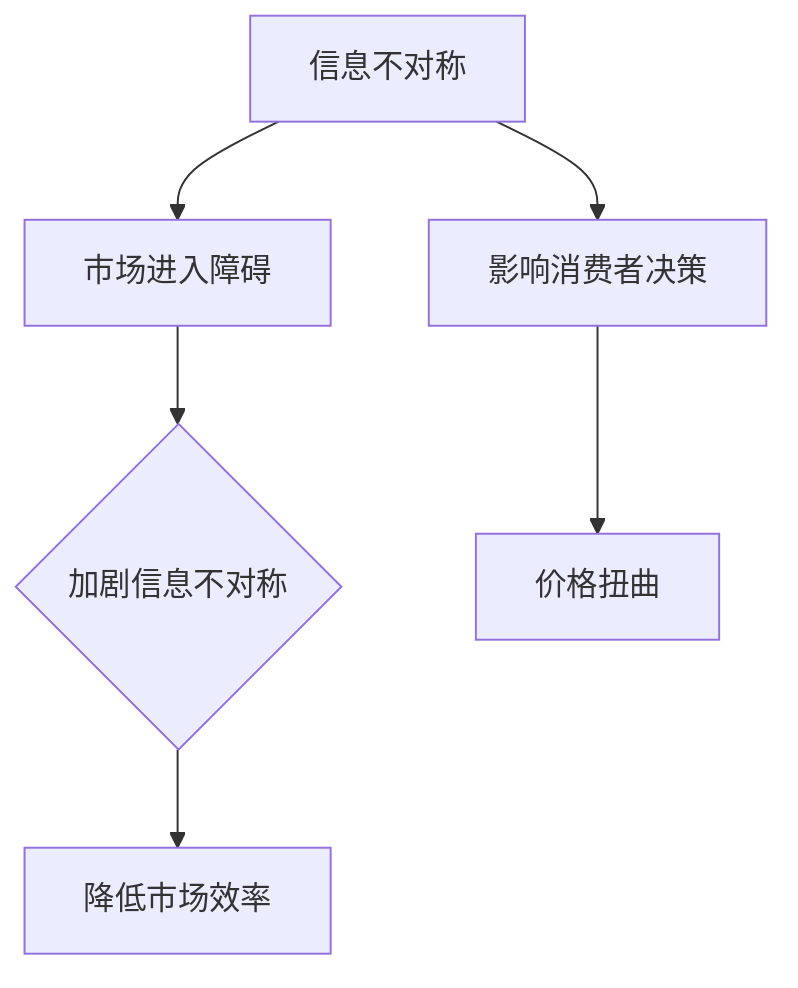

                 

# 信息差：信息不对称与市场进入障碍

## 关键词：信息不对称、市场进入障碍、信息差、竞争策略、数据分析、经济学原理

## 摘要：
本文将深入探讨信息不对称与市场进入障碍这两个关键概念，从经济学视角分析其影响和作用。我们将通过实例、算法原理、数学模型以及实际应用，详细解释信息差如何影响市场竞争、企业发展以及个人决策。文章旨在揭示信息不对称现象背后的规律，帮助读者理解和利用信息差，在竞争激烈的市场中找到优势。

## 1. 背景介绍

信息不对称是指在市场中，不同主体之间对某些信息拥有不同程度的了解，导致信息获取的不均衡。市场进入障碍则是指市场中新参与者面临的困难和挑战，这些障碍可能来自资源、技术、政策等多方面因素。

信息不对称和市场进入障碍在现实生活中广泛存在，它们对市场运作产生深远影响。例如，在二手车市场中，卖家通常比买家更了解车辆的实际状况，这就形成了信息不对称。而新企业进入一个成熟行业时，可能需要面对高昂的启动成本、复杂的审批流程和强大的既有竞争者，这些都是市场进入障碍。

本文将围绕这两个主题展开，首先介绍相关核心概念，然后探讨其相互作用以及影响，最后提出一些应对策略和建议。

## 2. 核心概念与联系

### 2.1 信息不对称

信息不对称可以定义为市场中某些参与者拥有而其他参与者没有的信息差异。这种差异可能导致市场效率降低、价格扭曲和消费者权益受损。

#### 2.1.1 原因
- **信息成本**：获取信息的成本可能非常高，特别是对于某些专业领域。
- **信息保密**：某些企业或个人出于竞争目的，会选择保密关键信息。
- **不对称信息传递**：信息在传递过程中可能被扭曲或遗漏。

#### 2.1.2 类型
- **知识性不对称**：例如，消费者对产品质量的了解不足。
- **行为性不对称**：卖方或买方在行为上的不确定性。

### 2.2 市场进入障碍

市场进入障碍是指新参与者进入市场时所面临的障碍，这些障碍可能会阻止或减缓市场的新竞争者进入。

#### 2.2.1 原因
- **资源限制**：资金、技术、人才等资源不足。
- **政策法规**：政府的审批流程、税收政策等。
- **规模经济**：已有企业通过规模经济获得成本优势。
- **品牌认知**：已有品牌的市场影响力和用户忠诚度。

#### 2.2.2 类型
- **结构性障碍**：如专利保护、行业垄断等。
- **行为性障碍**：如广告宣传、顾客忠诚等。

### 2.3 信息不对称与市场进入障碍的联系

信息不对称和市场进入障碍之间存在紧密的联系。一方面，信息不对称可能导致市场进入障碍，例如，如果新进入者无法获取有关市场需求的准确信息，他们可能会难以制定有效的市场策略。另一方面，市场进入障碍也可能加剧信息不对称，例如，已有企业可能会通过限制信息流动来维护其市场地位。


### 2.4 Mermaid 流程图



## 3. 核心算法原理 & 具体操作步骤

为了更好地理解信息不对称与市场进入障碍，我们可以借助一个经典的经济学模型——逆向选择模型。

### 3.1 逆向选择模型

逆向选择模型描述了在信息不对称情况下，市场参与者如何进行选择。该模型主要关注两个参与者：卖家（拥有私人信息）和买家（没有私人信息）。

#### 3.1.1 模型假设
- 卖家知道自己的商品质量，但买家不知道。
- 商品有两种质量：高质量和低质量。
- 每种质量的商品有不同的价格。

#### 3.1.2 模型分析
- 如果买家不能区分商品质量，他们可能只会支付低质量的商品价格，导致高质量商品卖家退出市场。
- 这种情况称为逆向选择。

### 3.2 解决方案

为了解决逆向选择问题，市场参与者可以采取以下策略：

#### 3.2.1 信息共享
- 卖家可以通过提供质量保证、披露信息等方式，增加买家对商品的信心。
- 买家可以通过更多的市场调研和产品测试，提高自己对商品的了解。

#### 3.2.2 信号发送
- 卖家可以通过价格信号、品牌形象等，向买家传达商品质量信息。
- 买家可以通过观察卖家的行为和声誉，判断商品质量。

### 3.3 操作步骤

#### 3.3.1 信息共享步骤
1. 卖家收集商品质量信息。
2. 卖家将信息发布到市场。
3. 买家根据卖家提供的信息做出购买决策。

#### 3.3.2 信号发送步骤
1. 卖家制定价格策略，根据商品质量调整价格。
2. 卖家加强品牌建设，提高市场声誉。
3. 买家根据价格和品牌信息，选择商品。

## 4. 数学模型和公式 & 详细讲解 & 举例说明

### 4.1 数学模型

逆向选择模型的数学表达式为：

$$
p = \frac{Q_1}{Q_1 + Q_2}
$$

其中，$p$ 是买家愿意支付的价格，$Q_1$ 是高质量商品的数量，$Q_2$ 是低质量商品的数量。

### 4.2 详细讲解

这个公式表示，买家愿意支付的价格取决于市场上高质量和低质量商品的比例。当高质量商品的比例增加时，买家愿意支付的价格也会增加。

### 4.3 举例说明

假设市场上只有两种商品：高质量商品（价值1000元）和低质量商品（价值500元）。如果市场上80%的商品是高质量商品，那么买家愿意支付的平均价格将是：

$$
p = \frac{1000 \times 0.8 + 500 \times 0.2}{1} = 800 \text{元}
$$

这意味着，买家愿意支付800元购买商品，因为他们预期市场上大部分商品是高质量商品。

## 5. 项目实战：代码实际案例和详细解释说明

### 5.1 开发环境搭建

为了更好地理解信息不对称与市场进入障碍，我们将使用Python编写一个简单的市场模拟程序。首先，我们需要搭建开发环境。

1. 安装Python（版本3.8及以上）。
2. 安装必要库：numpy、matplotlib。

```bash
pip install numpy matplotlib
```

### 5.2 源代码详细实现和代码解读

#### 5.2.1 代码实现

以下是一个简单的市场模拟程序，用于模拟信息不对称和逆向选择问题。

```python
import numpy as np
import matplotlib.pyplot as plt

# 模拟市场
def market_simulation(sellers, buyers, quality_price):
    market_size = len(sellers)
    total_revenue = 0

    for i in range(market_size):
        buyer_price = np.random.uniform(0, 1)
        if buyer_price < buyers[i]:
            total_revenue += quality_price
        else:
            total_revenue += 0.5 * quality_price

    return total_revenue / market_size

# 参数设置
sellers = [0.6, 0.7, 0.8, 0.9]  # 卖家质量信息
buyers = [0.4, 0.5, 0.6, 0.7]   # 买家质量信息
quality_price = 1000  # 高质量商品价格

# 模拟100次
revenues = [market_simulation(sellers, buyers, quality_price) for _ in range(100)]

# 可视化结果
plt.hist(revenues, bins=20, alpha=0.5)
plt.title('Market Revenue Distribution')
plt.xlabel('Average Revenue')
plt.ylabel('Frequency')
plt.show()
```

#### 5.2.2 代码解读

1. **模拟市场**：`market_simulation` 函数用于模拟市场，每次模拟包括多个卖家和买家。
2. **卖家和买家**：`sellers` 和 `buyers` 列表分别表示卖家和买家的质量信息。
3. **质量价格**：`quality_price` 表示高质量商品的价格。
4. **模拟结果**：模拟100次后，计算平均收入并可视化结果。

### 5.3 代码解读与分析

通过这个简单的模拟程序，我们可以看到信息不对称如何影响市场收入。在理想情况下（卖家和买家质量信息一致），平均收入会较高。但在信息不对称的情况下，平均收入可能会降低。

这个模拟程序可以帮助我们更好地理解信息不对称和市场进入障碍对市场运作的影响。通过调整卖家和买家的质量信息，我们可以观察不同情况下的市场结果，从而找到提高市场效率的方法。

## 6. 实际应用场景

### 6.1 金融领域

在金融市场中，信息不对称现象尤为突出。例如，投资者与上市公司之间就财务信息存在显著的不对称。上市公司可能拥有关于公司运营、财务状况的详细信息，而投资者只能依赖公开披露的信息。这种信息不对称可能导致市场失灵，投资者无法做出理性决策，从而影响市场稳定。

**解决方案**：
- **监管加强**：政府可以通过加强监管，要求上市公司提供更透明、更全面的信息。
- **信息披露制度**：建立完善的上市公司信息披露制度，提高市场透明度。
- **投资者教育**：加强对投资者的教育，提高他们的信息处理能力。

### 6.2 电商领域

在电商领域，买家通常无法直接了解商品的真实情况，这导致了信息不对称。例如，在二手商品交易中，卖家可能知道商品的真实状况，而买家只能依靠卖家提供的描述和图片。

**解决方案**：
- **商品评价系统**：建立完善的商品评价系统，让买家能够根据其他买家的评价做出决策。
- **增强视觉识别技术**：利用计算机视觉技术，对商品进行自动识别和评价。
- **透明化物流**：提供物流全程跟踪服务，让买家能够实时了解商品运输情况。

### 6.3 医疗领域

在医疗领域，患者和医生之间也存在信息不对称。医生通常拥有更多的医学知识和诊断信息，而患者往往只能依赖医生的建议。

**解决方案**：
- **患者教育**：提高患者的医学知识水平，让他们能够更好地理解自己的健康状况和治疗方案。
- **共享病历**：建立共享病历系统，让患者能够随时查看自己的病历信息。
- **在线咨询**：提供在线咨询服务，让患者能够直接与医生沟通，获取专业建议。

## 7. 工具和资源推荐

### 7.1 学习资源推荐

- **书籍**：
  - 《信息经济学》（作者：James M. Poterba）
  - 《市场机制》（作者：James M. Buchanan）
- **论文**：
  - "The Economics of Information"（作者：Herbert Simon）
  - "Adverse Selection"（作者：Michael Spence）
- **博客**：
  - [维基百科 - 信息不对称](https://en.wikipedia.org/wiki/Asymmetric_information)
  - [经济学人 - 信息不对称](https://www.economist.com/economics/2019/09/13/the-facts-are-funny-things)
- **网站**：
  - [国际经济学协会 - 信息不对称研究](https://www.iae.com/topics/information asymmetry/)

### 7.2 开发工具框架推荐

- **Python**：适用于数据分析和模型构建。
- **Numpy**：用于数值计算和矩阵操作。
- **Matplotlib**：用于数据可视化和图形绘制。

### 7.3 相关论文著作推荐

- "Information, Incentives and Conflict"（作者：Richard A. Posner）
- "Adverse Selection in Competitive Insurance Markets: An Analysis and Policy建议"（作者：A. Michael Spence）
- "Information Markets"（作者：B. Douglas Bernheim）

## 8. 总结：未来发展趋势与挑战

信息不对称和市场进入障碍是现代市场中不可忽视的现象。随着技术的发展和市场的全球化，这些现象可能会变得更加复杂。未来，我们需要更多的研究来解决以下挑战：

- **数据隐私与透明度**：如何在保护数据隐私的同时，提高市场透明度？
- **算法公平性**：如何确保算法在处理信息时不会加剧信息不对称？
- **政策制定**：如何制定有效的政策来缓解市场进入障碍，促进市场竞争？

通过深入研究和实践，我们有望找到更好的解决方案，让市场更加公平和高效。

## 9. 附录：常见问题与解答

### 9.1 什么是信息不对称？
信息不对称是指在市场中，不同主体之间对某些信息拥有不同程度的了解，导致信息获取的不均衡。

### 9.2 市场进入障碍有哪些类型？
市场进入障碍主要包括资源限制、政策法规、规模经济和品牌认知等类型。

### 9.3 如何解决信息不对称问题？
解决信息不对称问题可以通过信息共享、信号发送和政府监管等途径。

### 9.4 市场进入障碍如何影响企业发展？
市场进入障碍可能阻止或减缓新企业进入市场，影响市场竞争和行业创新。

## 10. 扩展阅读 & 参考资料

- [维基百科 - 市场进入障碍](https://en.wikipedia.org/wiki/Market_entry_barrier)
- [经济学人 - 市场进入障碍](https://www.economist.com/economics/2019/09/13/the-facts-are-funny-things)
- [《信息经济学》课程](https://ocw.mit.edu/courses/economics/14-126-information-economics-fall-2015/)
- [《市场机制》课程](https://ocw.mit.edu/courses/economics/14-126-market-mechanisms-fall-2015/)

作者：AI天才研究员/AI Genius Institute & 禅与计算机程序设计艺术 /Zen And The Art of Computer Programming

