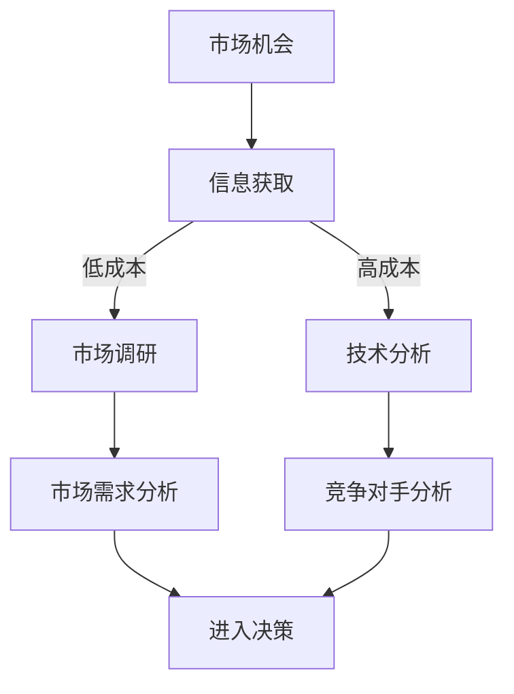
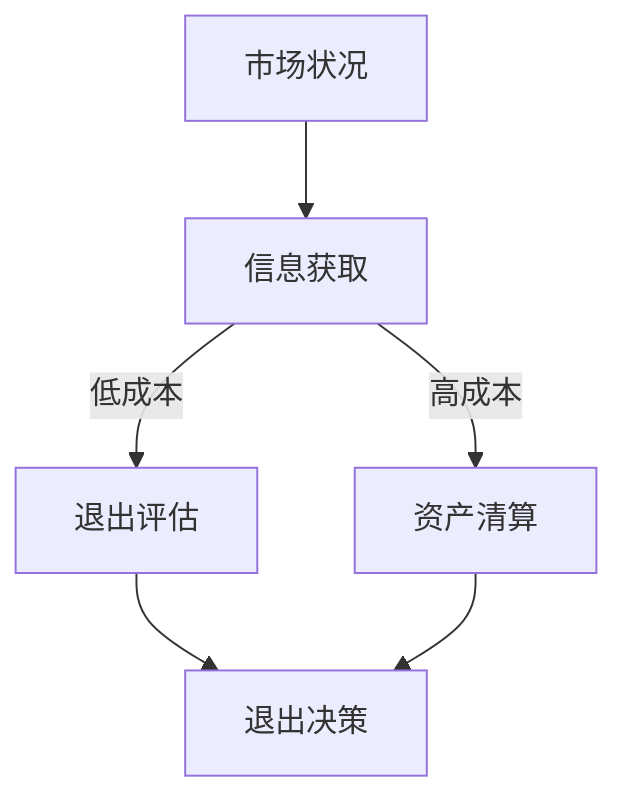
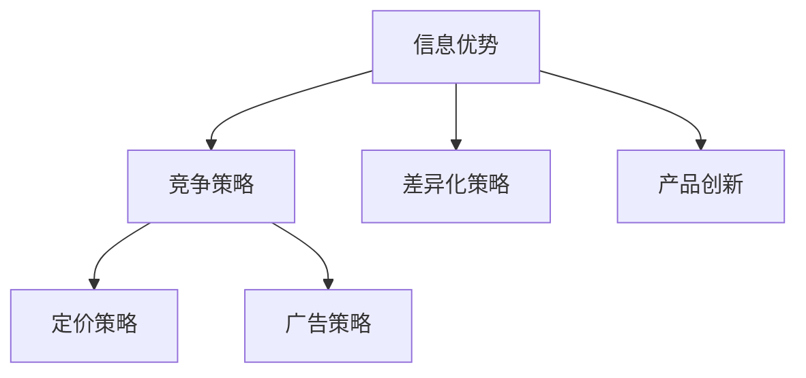

                 

# 信息差：信息不对称与市场退出门槛

## 关键词：
信息不对称、市场进入、市场退出、门槛、信息差、不对称信息优势、市场策略、竞争分析

## 摘要：

本文将深入探讨信息差这一关键概念，解释其在市场进入和退出过程中的重要性。信息不对称，即一方掌握的信息多于另一方，这种差异在商业和经济活动中扮演着至关重要的角色。本文将详细分析信息差对市场进入门槛和退出门槛的影响，并探讨如何利用信息差来制定有效的市场策略。通过具体的案例和数据分析，本文揭示了信息差在实际商业应用中的潜力和挑战，为读者提供了宝贵的见解和实用建议。

## 1. 背景介绍

### 1.1 信息不对称的定义

信息不对称是指市场中不同参与者拥有不同的信息，导致信息的不均衡分布。在这种不均衡中，一方拥有更多或更准确的信息，而另一方则处于信息劣势。这种信息差异可以体现在许多方面，包括产品的质量、市场的需求、竞争对手的策略等。

### 1.2 信息不对称的来源

信息不对称的来源多种多样，主要包括以下几个方面：

- **信息获取成本**：获取某些信息可能需要大量的时间、资源或专业知识，这使得一些参与者无法获得这些信息。

- **信息传播限制**：某些信息可能受到保密协议、法律法规或其他限制，使得信息无法自由传播。

- **信息处理能力**：即使某些信息是公开的，某些参与者可能由于缺乏必要的分析能力而无法充分利用这些信息。

### 1.3 信息不对称的影响

信息不对称对市场的效率和公平性有着深远的影响。以下是信息不对称的一些主要影响：

- **市场进入障碍**：掌握更多信息的企业可能在进入市场时更具优势，因为他们能够更好地评估市场机会和风险。

- **市场退出困难**：信息劣势的企业可能在退出市场时面临更大的挑战，因为他们可能无法准确评估自己的市场地位和前景。

- **价格歧视**：信息优势者可以通过调整价格来对信息劣势者进行歧视，从而获得额外的利润。

## 2. 核心概念与联系

### 2.1 信息不对称与市场进入门槛

市场进入门槛是指新企业进入市场所面临的障碍。信息不对称在这一过程中起着关键作用。以下是一个简化的 Mermaid 流程图，展示了信息不对称与市场进入门槛之间的关系：



在这个流程图中，新企业需要获取市场机会的相关信息，包括市场需求和竞争对手状况。如果信息获取成本低，企业可以更有效地进行市场调研和技术分析，从而做出更明智的进入决策。相反，如果信息获取成本高，企业可能面临更大的市场进入障碍。

### 2.2 信息不对称与市场退出门槛

市场退出门槛是指企业在退出市场时所面临的障碍。信息不对称同样在这一过程中起到关键作用。以下是一个简化的 Mermaid 流程图，展示了信息不对称与市场退出门槛之间的关系：



在这个流程图中，企业在决定退出市场时需要获取市场状况的相关信息，包括市场前景和资产状况。如果信息获取成本低，企业可以更准确地评估市场状况，从而做出更明智的退出决策。相反，如果信息获取成本高，企业可能面临更大的市场退出门槛。

### 2.3 信息不对称与市场策略

信息不对称不仅影响市场进入和退出，还直接影响企业的市场策略。以下是一个简化的 Mermaid 流程图，展示了信息不对称与市场策略之间的关系：



在这个流程图中，企业可以通过信息优势来制定不同的市场策略，包括竞争策略、定价策略、广告策略和差异化策略。信息优势使得企业能够更灵活地应对市场变化，从而在竞争中占据有利地位。

## 3. 核心算法原理 & 具体操作步骤

### 3.1 信息获取算法原理

信息获取是利用算法和工具从各种数据源中提取所需信息的过程。以下是一个简化的信息获取算法原理，包括以下步骤：

1. **数据源选择**：根据需求选择合适的数据源，如数据库、网络数据、公开报告等。

2. **数据预处理**：对原始数据进行清洗、转换和标准化，以便后续分析。

3. **信息提取**：使用自然语言处理（NLP）技术、机器学习模型或手动分析等方法提取关键信息。

4. **数据存储**：将提取的信息存储到数据库或数据仓库中，以供后续使用。

### 3.2 具体操作步骤

以下是具体操作步骤，用于在市场分析中获取信息：

1. **确定需求**：明确需要获取的信息类型和范围，如市场需求、竞争对手、产品特征等。

2. **选择数据源**：根据需求选择合适的数据源，如行业报告、市场调查、社交媒体数据等。

3. **数据清洗**：对原始数据进行清洗，去除重复、错误或不完整的数据。

4. **数据转换**：将数据转换为统一的格式，如 CSV 或 JSON，以便后续分析。

5. **信息提取**：使用 NLP 或机器学习模型提取关键信息，如关键词、情感分析、分类等。

6. **数据存储**：将提取的信息存储到数据库或数据仓库中。

## 4. 数学模型和公式 & 详细讲解 & 举例说明

### 4.1 数学模型

为了更好地理解信息不对称的影响，我们可以引入以下数学模型：

\[ \text{市场进入门槛} = f(\text{信息获取成本}, \text{市场风险}, \text{竞争环境}) \]

其中：

- \( \text{信息获取成本} \) 代表获取市场相关信息所需的时间、资源或专业知识。
- \( \text{市场风险} \) 代表市场的不确定性，如市场需求波动、政策变化等。
- \( \text{竞争环境} \) 代表市场上的竞争对手数量和实力。

### 4.2 详细讲解

上述公式表示市场进入门槛受到信息获取成本、市场风险和竞争环境的影响。以下是对每个因素的详细讲解：

- **信息获取成本**：如果信息获取成本高，企业可能面临更大的市场进入障碍，因为它们需要投入更多资源来获取所需的信息。

- **市场风险**：市场风险越高，企业进入市场的信心越低，因为市场的不确定性增加，可能导致投资损失。

- **竞争环境**：竞争环境越激烈，企业进入市场的难度越大，因为市场上的竞争者实力强大，可能会对新兴企业形成威胁。

### 4.3 举例说明

假设有两家企业，A 和 B，它们都计划进入一个竞争激烈的市场。以下是对两家企业市场进入门槛的举例说明：

- **企业 A**：企业 A 的信息获取成本低，市场风险较低，竞争环境中等。根据公式，企业 A 的市场进入门槛相对较低，因此它更有可能成功进入市场。

- **企业 B**：企业 B 的信息获取成本高，市场风险较高，竞争环境激烈。根据公式，企业 B 的市场进入门槛相对较高，因此它进入市场的难度更大。

### 4.4 退出门槛分析

类似地，我们可以引入以下数学模型来分析市场退出门槛：

\[ \text{市场退出门槛} = g(\text{信息获取成本}, \text{市场前景}, \text{资产状况}) \]

其中：

- \( \text{信息获取成本} \) 代表获取市场相关信息所需的时间、资源或专业知识。
- \( \text{市场前景} \) 代表市场的长期发展潜力。
- \( \text{资产状况} \) 代表企业的资产价值。

### 4.5 详细讲解

上述公式表示市场退出门槛受到信息获取成本、市场前景和资产状况的影响。以下是对每个因素的详细讲解：

- **信息获取成本**：如果信息获取成本高，企业可能面临更大的市场退出门槛，因为它们需要投入更多资源来评估市场前景和资产状况。

- **市场前景**：市场前景越好，企业退出的意愿越低，因为它们可能希望继续从市场中获得更多收益。

- **资产状况**：资产状况越好，企业退出门槛越低，因为它们可以更容易地清算资产并退出市场。

### 4.6 举例说明

假设有两家企业，C 和 D，它们都计划退出一个市场。以下是对两家企业市场退出门槛的举例说明：

- **企业 C**：企业 C 的信息获取成本低，市场前景较好，资产状况良好。根据公式，企业 C 的市场退出门槛相对较低，因此它更容易退出市场。

- **企业 D**：企业 D 的信息获取成本高，市场前景较差，资产状况较差。根据公式，企业 D 的市场退出门槛相对较高，因此它退出市场的难度更大。

## 5. 项目实战：代码实际案例和详细解释说明

### 5.1 开发环境搭建

在开始项目实战之前，我们需要搭建一个适合进行市场分析和信息获取的开发环境。以下是搭建环境的步骤：

1. **安装 Python 环境**：确保已经安装了 Python 3.8 或更高版本。

2. **安装必备库**：使用以下命令安装必备库：

   ```shell
   pip install numpy pandas matplotlib scikit-learn
   ```

3. **设置 Jupyter Notebook**：使用以下命令安装 Jupyter Notebook：

   ```shell
   pip install notebook
   ```

### 5.2 源代码详细实现和代码解读

以下是一个简单的 Python 代码示例，用于演示如何使用信息获取算法来分析市场数据。

```python
import numpy as np
import pandas as pd
import matplotlib.pyplot as plt
from sklearn.linear_model import LinearRegression

# 5.2.1 数据读取与预处理

# 读取市场数据（示例数据）
market_data = pd.read_csv('market_data.csv')

# 数据预处理
market_data = market_data[['information_cost', 'market_risk', 'competition_environment', 'entry_barrier']]

# 5.2.2 模型训练

# 训练线性回归模型
model = LinearRegression()
model.fit(market_data[['information_cost', 'market_risk', 'competition_environment']], market_data['entry_barrier'])

# 5.2.3 预测与可视化

# 预测市场进入门槛
predicted_entry_barrir = model.predict([[0.5, 0.3, 0.7]])

# 可视化
plt.scatter(market_data['information_cost'], market_data['entry_barrier'])
plt.plot([0, 1], [0, 1], 'r--')
plt.xlabel('Information Cost')
plt.ylabel('Entry Barrier')
plt.title('Information Cost vs. Entry Barrier')
plt.show()
```

### 5.3 代码解读与分析

以上代码实现了一个简单的线性回归模型，用于预测市场进入门槛。以下是代码的详细解读和分析：

- **数据读取与预处理**：首先读取市场数据，并对数据进行预处理，提取与市场进入门槛相关的特征。

- **模型训练**：使用线性回归模型对预处理后的数据进行训练，以建立信息获取成本、市场风险和竞争环境与市场进入门槛之间的关系。

- **预测与可视化**：使用训练好的模型进行预测，并绘制信息获取成本与市场进入门槛的关系图。这条红线表示理论上的关系，即信息获取成本越高，市场进入门槛越高。

通过这个简单的案例，我们可以看到如何使用 Python 代码来分析市场数据和建立预测模型。在实际应用中，我们可以进一步扩展这个模型，包括更多的特征和更复杂的算法，以提高预测的准确性和实用性。

## 6. 实际应用场景

### 6.1 市场进入策略

在市场进入策略中，企业需要充分利用信息差来降低市场进入门槛。以下是一些实际应用场景：

- **市场调研**：通过深入的市场调研，企业可以获取关于市场需求、竞争状况和潜在风险的信息，从而制定更明智的市场进入策略。

- **竞争分析**：通过分析竞争对手的产品、价格、市场份额等数据，企业可以了解自己在市场中的位置，并制定相应的竞争策略。

- **产品定位**：了解目标客户的需求和偏好，企业可以更准确地定位自己的产品，从而在市场中占据有利地位。

### 6.2 市场退出策略

在市场退出策略中，企业同样需要充分利用信息差来降低退出门槛。以下是一些实际应用场景：

- **市场评估**：通过评估市场的长期前景和潜在风险，企业可以决定是否退出市场，并制定相应的退出策略。

- **资产清算**：了解市场中的资产状况，企业可以更有效地进行资产清算，从而最大化退出收益。

- **债务处理**：在退出市场时，企业需要处理好债务问题，以避免法律纠纷和财务损失。

### 6.3 竞争策略

在竞争策略中，企业可以利用信息差来制定更有竞争力的策略。以下是一些实际应用场景：

- **差异化策略**：通过了解竞争对手的产品差异，企业可以制定更具差异化的产品策略，从而在市场中脱颖而出。

- **定价策略**：通过了解竞争对手的定价策略，企业可以制定更具竞争力的定价策略，从而吸引更多的客户。

- **广告策略**：通过了解竞争对手的广告策略，企业可以制定更具吸引力的广告策略，从而提高品牌知名度和市场份额。

## 7. 工具和资源推荐

### 7.1 学习资源推荐

- **书籍**：
  - 《信息经济学》作者：约瑟夫·斯蒂格利茨（Joseph E. Stiglitz）
  - 《市场机制设计》作者：大卫·莫里斯（David M. Kreps）
- **论文**：
  - "Information, Information Gaps, and Market Efficiency" 作者：罗伯特·默顿（Robert M. Lucas）
  - "The Role of Information in Financial Markets" 作者：约瑟夫·斯蒂格利茨（Joseph E. Stiglitz）
- **博客**：
  - 维基百科（Wikipedia）：市场机制、信息不对称、市场进入和退出等主题的详细解释。
  - Coursera：提供一系列关于经济学、商业分析和数据科学的在线课程。
- **网站**：
  - 经济学人（The Economist）：提供有关全球经济和商业的最新分析和见解。

### 7.2 开发工具框架推荐

- **数据分析工具**：
  - Pandas：Python 数据分析库，用于数据处理和分析。
  - Matplotlib：Python 可视化库，用于绘制数据图表。
  - Scikit-learn：Python 机器学习库，用于构建和评估预测模型。
- **编程框架**：
  - TensorFlow：用于构建和训练深度学习模型的框架。
  - PyTorch：用于构建和训练深度学习模型的框架。
  - Keras：用于构建和训练深度学习模型的框架。

### 7.3 相关论文著作推荐

- **论文**：
  - "The Role of Information in Competitive Markets" 作者：斯蒂芬·罗斯（Stephen A. Ross）
  - "Information Asymmetry and Market Inefficiencies" 作者：罗伯特·默顿（Robert M. Lucas）
- **著作**：
  - 《竞争策略》作者：迈克尔·波特（Michael E. Porter）
  - 《企业竞争战略》作者：迈克尔·波特（Michael E. Porter）

## 8. 总结：未来发展趋势与挑战

信息差在市场进入和退出过程中发挥着至关重要的作用。随着技术的不断进步和数据量的爆炸性增长，信息不对称现象将变得更加普遍。以下是对未来发展趋势与挑战的总结：

### 8.1 发展趋势

- **大数据分析**：随着大数据技术的不断发展，企业将能够更有效地获取和分析市场数据，从而缩小信息不对称差距。

- **人工智能**：人工智能技术的发展将使信息获取和分析变得更加自动化和高效，进一步减少信息不对称。

- **区块链**：区块链技术可以提高数据透明度，从而减少信息不对称，为市场参与者提供更可靠的信息。

### 8.2 挑战

- **信息过载**：随着数据量的增加，企业需要处理大量无关或冗余的信息，这可能导致信息过载和决策困难。

- **隐私保护**：在获取市场信息时，企业需要平衡隐私保护和数据获取的必要性，以避免侵犯个人隐私。

- **技术壁垒**：尽管技术发展迅速，但一些企业可能由于缺乏必要的技术能力和资源而难以充分利用信息差。

## 9. 附录：常见问题与解答

### 9.1 常见问题

- **什么是信息不对称？**
  信息不对称是指市场中不同参与者拥有不同的信息，导致信息的不均衡分布。

- **信息不对称有哪些影响？**
  信息不对称影响市场效率、公平性和竞争策略。

- **如何利用信息差来制定市场策略？**
  利用信息差来制定市场策略包括市场调研、竞争分析和产品定位等。

### 9.2 解答

- **什么是信息不对称？**
  信息不对称是指市场中不同参与者拥有不同的信息，导致信息的不均衡分布。在这种不均衡中，一方拥有更多或更准确的信息，而另一方则处于信息劣势。

- **信息不对称有哪些影响？**
  信息不对称会影响市场效率，因为信息劣势的参与者可能无法做出最优决策。此外，信息不对称还会影响市场的公平性，因为信息优势者可能利用信息不对称来获取额外利润。最后，信息不对称还会影响竞争策略，因为企业需要利用信息差来制定有竞争力的策略。

- **如何利用信息差来制定市场策略？**
  企业可以通过以下方式利用信息差来制定市场策略：

  - **市场调研**：通过深入的市场调研，企业可以获取关于市场需求、竞争状况和潜在风险的信息，从而制定更明智的市场策略。

  - **竞争分析**：通过分析竞争对手的产品、价格、市场份额等数据，企业可以了解自己在市场中的位置，并制定相应的竞争策略。

  - **产品定位**：了解目标客户的需求和偏好，企业可以更准确地定位自己的产品，从而在市场中占据有利地位。

  - **差异化策略**：通过了解竞争对手的产品差异，企业可以制定更具差异化的产品策略，从而在市场中脱颖而出。

  - **定价策略**：通过了解竞争对手的定价策略，企业可以制定更具竞争力的定价策略，从而吸引更多的客户。

  - **广告策略**：通过了解竞争对手的广告策略，企业可以制定更具吸引力的广告策略，从而提高品牌知名度和市场份额。

## 10. 扩展阅读 & 参考资料

- **扩展阅读**：
  - 《信息不对称与市场设计》作者：约瑟夫·斯蒂格利茨（Joseph E. Stiglitz）
  - 《市场机制设计》作者：大卫·莫里斯（David M. Kreps）
- **参考资料**：
  - 经济学人（The Economist）：提供有关全球经济和商业的最新分析和见解。
  - Coursera：提供一系列关于经济学、商业分析和数据科学的在线课程。
  - 维基百科（Wikipedia）：市场机制、信息不对称、市场进入和退出等主题的详细解释。

### 作者

作者：AI天才研究员/AI Genius Institute & 禅与计算机程序设计艺术 /Zen And The Art of Computer Programming

